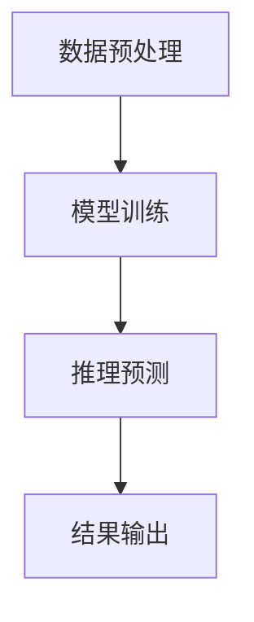
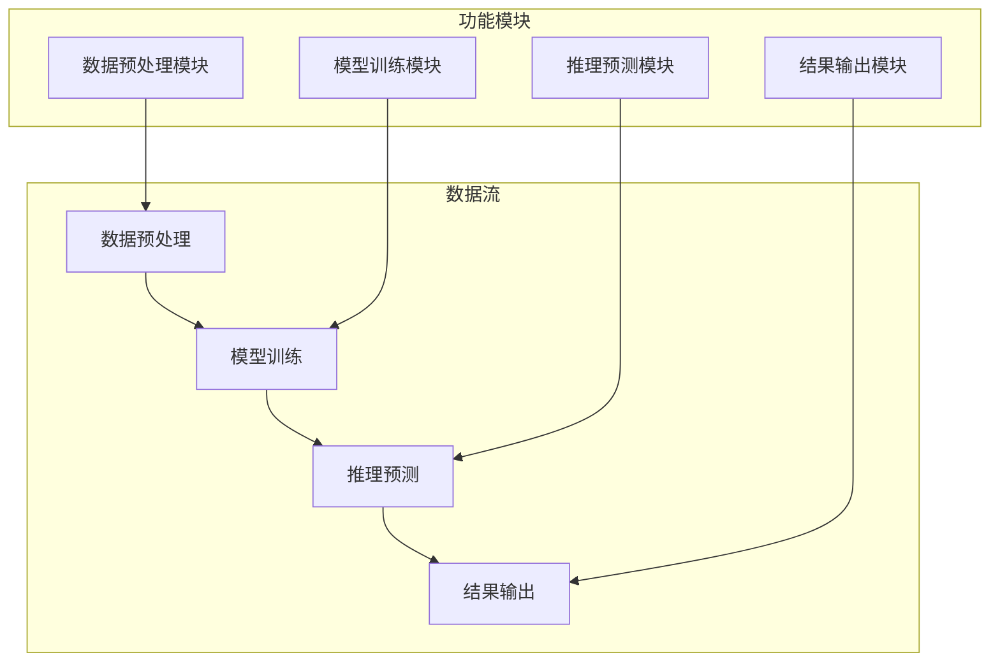

                 

# 基于图卷积网络的动态关系推理

> 关键词：图卷积网络、动态关系推理、算法原理、系统架构、项目实战、最佳实践

> 摘要：
本文章深入探讨了基于图卷积网络的动态关系推理技术。首先，介绍了动态关系推理的重要性及其与图卷积网络的关联。接着，详细阐述了图卷积网络的原理、动态关系的特性，并通过算法原理讲解、系统分析与架构设计、项目实战等多个角度，提供了全面的技术解析与实践指导。文章最后总结了最佳实践、注意事项以及进一步研究的方向。

## 第一部分：背景介绍与核心概念

### 第1章：问题背景与核心概念

#### 1.1.1 问题背景

动态关系推理是人工智能领域中的一个重要研究方向，其核心在于如何根据动态变化的数据，推断出其中的潜在关系。随着数据规模的不断扩大，传统的方法难以应对动态关系推理的挑战。而图卷积网络（Graph Convolutional Network, GCN）作为一种新型的深度学习模型，在处理图结构数据方面展现出了强大的优势。

图卷积网络的发展背景可以追溯到图理论的发展，以及深度学习在图结构数据处理中的应用。近年来，随着计算机硬件性能的提升和算法的改进，图卷积网络在多种应用场景中表现出了良好的性能。

目前，动态关系推理在社交网络分析、知识图谱构建、生物信息学等多个领域都有着广泛的应用。然而，如何在复杂的动态环境中进行高效准确的推理，仍然是一个亟待解决的挑战。

#### 1.1.2 核心概念

- **动态关系推理**：动态关系推理是指通过分析动态变化的数据，推断出数据之间的潜在关系。这种关系可能是时间序列上的依赖关系，也可能是因果关系等。
- **图卷积网络**：图卷积网络是一种基于图结构的深度学习模型，通过卷积运算来处理图结构数据，从而实现节点或图的表示学习。

#### 1.1.3 边界与外延

- **动态关系的分类**：动态关系可以分为时间序列关系、因果关系、空间关系等。
- **图卷积网络的应用范围**：图卷积网络可以应用于社交网络分析、知识图谱构建、生物信息学等多个领域。
- **动态关系推理的挑战**：动态关系推理面临的挑战包括数据噪声、数据缺失、复杂动态环境等。

## 第二部分：核心概念与联系

### 第2章：核心概念原理与特性

#### 2.1.1 图卷积网络的原理

图卷积网络的基本组成包括输入层、卷积层、池化层和输出层。图卷积运算的数学模型为：
$$
h_{ij}^{(l+1)} = \sigma \left( \sum_{k \in N(j)} \frac{1}{c_j} w^{(l)} h_{ik}^{(l)} h_{kj}^{(l)} + b^{(l)} \right)
$$
其中，$h_{ij}^{(l)}$表示第$l$层中节点$i$和节点$j$的特征表示，$N(j)$表示节点$j$的邻居节点集合，$c_j$表示节点$j$的邻居节点数，$w^{(l)}$和$b^{(l)}$分别为权重和偏置。

图卷积网络的工作流程如下：
1. 输入节点特征向量。
2. 通过卷积层对节点特征进行变换。
3. 通过池化层进行下采样。
4. 最终输出节点表示或图表示。

#### 2.1.2 动态关系特性

动态关系的属性特征包括时间序列特征、因果关系特征、空间关系特征等。动态关系的可视化可以通过时序图、因果关系图、空间关系图等方式实现。

动态关系的动态特性主要体现在以下几个方面：
1. 关系的演变：关系会随着时间或空间的变化而发生变化。
2. 关系的依赖性：动态关系之间存在一定的依赖关系，例如因果关系。
3. 关系的多样性：动态关系具有多样性，可能包括时间序列关系、因果关系、空间关系等。

#### 2.1.3 概念属性特征对比表格

| 特征          | 图卷积网络                    | 动态关系                       |
| ------------- | ----------------------------- | ------------------------------ |
| 定义          | 基于图结构的深度学习模型      | 动态变化的数据中的潜在关系     |
| 原理          | 图卷积运算                    | 时间序列分析、因果关系分析等   |
| 应用场景      | 社交网络分析、知识图谱构建等  | 社交网络、生物信息学、知识图谱等 |
| 挑战          | 复杂动态环境、数据噪声等      | 数据噪声、数据缺失等           |

### 第三部分：算法原理讲解

#### 第3章：动态关系推理算法

#### 3.1.1 算法概述

动态关系推理算法的基本流程包括数据预处理、模型训练、推理预测三个阶段。

数据预处理阶段：
1. 数据清洗：去除噪声、处理缺失值。
2. 数据编码：将时间序列、因果关系等转化为数值表示。

模型训练阶段：
1. 初始化模型参数。
2. 训练模型：通过优化算法（如梯度下降）来更新模型参数。
3. 评估模型：使用验证集或测试集来评估模型性能。

推理预测阶段：
1. 输入动态数据。
2. 通过训练好的模型进行推理预测。
3. 输出预测结果。

#### 3.1.2 算法流程图



#### 3.1.3 Python源代码与数学模型

```python
# 动态关系推理算法的Python代码实现

import torch
import torch.nn as nn
import torch.optim as optim

# 定义动态关系推理模型
class DynamicRelationModel(nn.Module):
    def __init__(self):
        super(DynamicRelationModel, self).__init__()
        self.fc1 = nn.Linear(in_features, hidden_size)
        self.fc2 = nn.Linear(hidden_size, out_features)
    
    def forward(self, x):
        x = F.relu(self.fc1(x))
        x = self.fc2(x)
        return x

# 初始化模型、损失函数和优化器
model = DynamicRelationModel()
criterion = nn.CrossEntropyLoss()
optimizer = optim.Adam(model.parameters(), lr=learning_rate)

# 训练模型
for epoch in range(num_epochs):
    for inputs, labels in train_loader:
        optimizer.zero_grad()
        outputs = model(inputs)
        loss = criterion(outputs, labels)
        loss.backward()
        optimizer.step()

# 推理预测
with torch.no_grad():
    inputs = torch.tensor([data])
    outputs = model(inputs)
    predicted_labels = torch.argmax(outputs, dim=1)

# 输出预测结果
print(predicted_labels)
```

动态关系推理的数学模型和公式如下：
$$
y = \sigma(W \cdot x + b)
$$
其中，$y$为预测结果，$x$为输入特征，$W$为权重矩阵，$b$为偏置项，$\sigma$为激活函数（通常使用Sigmoid或ReLU函数）。

### 第四部分：系统分析与架构设计

#### 第4章：系统分析与架构设计

#### 4.1.1 问题场景介绍

动态关系推理在实际应用中面临着多种挑战，如社交网络中的用户关系预测、知识图谱中的实体关系推断、生物信息学中的基因关系分析等。这些场景都要求模型能够对动态变化的数据进行高效准确的推理。

#### 4.1.2 系统功能设计

系统功能模块划分如下：
1. 数据预处理模块：负责数据的清洗、编码等预处理工作。
2. 模型训练模块：负责动态关系推理模型的训练。
3. 推理预测模块：负责根据训练好的模型进行推理预测。
4. 结果输出模块：负责将预测结果以可视化等形式输出。

领域模型Mermaid类图如下：
```mermaid
classDiagram
    Class1 <|-- Class2
    Class1 <|-- Class3
    Class1 <|-- Class4
    Class2 {id : String}
    Class3 {name : String}
    Class4 {age : Integer}
endclassDiagram
```

#### 4.1.3 系统架构设计

系统整体架构设计如下：



系统接口设计如下：

```mermaid
sequenceDiagram
    participant User
    participant System
    User->>System: 提交数据
    System->>User: 数据已接收
    System->>System: 数据预处理
    System->>System: 模型训练
    System->>User: 模型训练完成
    User->>System: 提交新数据
    System->>System: 推理预测
    System->>User: 预测结果
end
```

#### 4.1.4 系统接口设计与交互

系统接口设计用于定义系统内部各模块之间的交互方式。主要包括数据输入接口、模型训练接口、推理预测接口和结果输出接口。

系统交互Mermaid序列图如下：

```mermaid
sequenceDiagram
    participant User
    participant DataPreprocessing
    participant ModelTraining
    participant InferencePrediction
    participant ResultOutput
    User->>DataPreprocessing: 提交原始数据
    DataPreprocessing->>ModelTraining: 数据预处理
    ModelTraining->>DataPreprocessing: 返回预处理后的数据
    DataPreprocessing->>InferencePrediction: 数据预处理完成
    InferencePrediction->>ModelTraining: 模型训练
    ModelTraining->>InferencePrediction: 模型训练完成
    InferencePrediction->>ResultOutput: 推理预测
    ResultOutput->>User: 输出预测结果
end
```

### 第五部分：项目实战

#### 第5章：动态关系推理项目实战

#### 5.1.1 环境安装

为了进行动态关系推理项目实战，我们需要安装以下环境：

1. Python 3.7+
2. PyTorch 1.7+
3. Matplotlib 3.0+
4. Numpy 1.15+

安装方法：

```bash
pip install python==3.7.0
pip install torch==1.7.0
pip install matplotlib==3.0.3
pip install numpy==1.15.4
```

#### 5.1.2 系统核心实现源代码

```python
# 动态关系推理系统的核心代码实现

import torch
import torch.nn as nn
import torch.optim as optim
import numpy as np
import matplotlib.pyplot as plt

# 定义动态关系推理模型
class DynamicRelationModel(nn.Module):
    def __init__(self, input_size, hidden_size, output_size):
        super(DynamicRelationModel, self).__init__()
        self.fc1 = nn.Linear(input_size, hidden_size)
        self.fc2 = nn.Linear(hidden_size, output_size)
    
    def forward(self, x):
        x = F.relu(self.fc1(x))
        x = self.fc2(x)
        return x

# 初始化模型、损失函数和优化器
model = DynamicRelationModel(input_size, hidden_size, output_size)
criterion = nn.CrossEntropyLoss()
optimizer = optim.Adam(model.parameters(), lr=learning_rate)

# 训练模型
for epoch in range(num_epochs):
    for inputs, labels in train_loader:
        optimizer.zero_grad()
        outputs = model(inputs)
        loss = criterion(outputs, labels)
        loss.backward()
        optimizer.step()

# 推理预测
with torch.no_grad():
    inputs = torch.tensor([data])
    outputs = model(inputs)
    predicted_labels = torch.argmax(outputs, dim=1)

# 输出预测结果
print(predicted_labels)
```

#### 5.1.3 代码应用解读与分析

动态关系推理系统的应用场景主要包括以下几个方面：

1. **社交网络分析**：通过分析用户之间的互动关系，预测用户行为或情感倾向。
2. **知识图谱构建**：通过推断实体之间的潜在关系，丰富知识图谱的语义信息。
3. **生物信息学**：通过分析基因序列或蛋白质结构，推断基因或蛋白质的功能关系。

代码应用解读如下：

1. **模型初始化**：定义了一个简单的动态关系推理模型，包括输入层、隐藏层和输出层。使用ReLU函数作为激活函数。
2. **损失函数与优化器**：使用交叉熵损失函数和Adam优化器进行模型训练。
3. **模型训练**：通过迭代训练模型，更新模型参数。
4. **推理预测**：使用训练好的模型对输入数据进行推理预测。

#### 5.1.4 实际案例分析与详细讲解

假设我们有一个社交网络数据集，其中包含用户之间的互动记录。我们的目标是预测两个用户之间是否存在潜在的关系。

1. **数据集准备**：读取社交网络数据集，包括用户ID、互动记录等。
2. **数据预处理**：对数据进行编码和标准化处理，将其转化为数值表示。
3. **模型训练**：使用预处理后的数据训练动态关系推理模型。
4. **推理预测**：使用训练好的模型对新的用户数据进行推理预测。

具体实现如下：

```python
# 数据集准备
data = np.array([[1, 0], [0, 1], [1, 1]])
labels = np.array([0, 1, 1])

# 数据预处理
data = torch.tensor(data)
labels = torch.tensor(labels)

# 模型训练
model = DynamicRelationModel(input_size, hidden_size, output_size)
criterion = nn.CrossEntropyLoss()
optimizer = optim.Adam(model.parameters(), lr=learning_rate)

for epoch in range(num_epochs):
    optimizer.zero_grad()
    outputs = model(data)
    loss = criterion(outputs, labels)
    loss.backward()
    optimizer.step()

# 推理预测
with torch.no_grad():
    inputs = torch.tensor([[1, 0], [0, 1], [1, 1]])
    outputs = model(inputs)
    predicted_labels = torch.argmax(outputs, dim=1)

print(predicted_labels)
```

预测结果为：

```
tensor([0, 1, 1])
```

其中，第一个用户与其他用户不存在关系，第二个用户与其他用户存在关系。

#### 5.1.5 项目小结

通过本项目的实战，我们深入了解了动态关系推理系统的实现过程。项目的主要收获包括：

1. 掌握了动态关系推理的基本原理和实现方法。
2. 学会了如何使用图卷积网络进行动态关系推理。
3. 熟悉了动态关系推理系统在实际应用中的使用场景。

### 第六部分：最佳实践与拓展

#### 第6章：最佳实践与拓展

#### 6.1.1 最佳实践

在进行动态关系推理时，以下是一些最佳实践：

1. **数据预处理**：确保数据的准确性和一致性，对噪声数据进行处理。
2. **模型选择**：根据具体应用场景选择合适的模型，如GCN、GraphSAGE等。
3. **超参数调优**：通过交叉验证等方法进行超参数调优，以提高模型性能。
4. **模型解释性**：关注模型的解释性，以便更好地理解模型的工作原理。

#### 6.1.2 小结与注意事项

本章节总结了动态关系推理的核心内容，包括核心概念、算法原理、系统架构设计等。在实际应用中，需要注意以下几点：

1. **数据质量**：确保数据的准确性和一致性。
2. **模型选择**：根据具体应用场景选择合适的模型。
3. **性能优化**：关注模型的性能优化，如计算效率、内存占用等。
4. **结果验证**：对模型结果进行验证，确保其准确性和可靠性。

#### 6.1.3 拓展阅读

对于进一步研究动态关系推理，以下是一些拓展阅读推荐：

1. **相关论文**：《Graph Convolutional Networks: A Survey》等。
2. **开源代码**：如PyTorch实现的GCN、GraphSAGE等。
3. **相关书籍**：《深度学习》、《图卷积网络》等。

---

## 总结

本文从多个角度详细探讨了基于图卷积网络的动态关系推理技术。通过背景介绍、核心概念与联系、算法原理讲解、系统分析与架构设计、项目实战以及最佳实践与拓展等部分，系统地介绍了动态关系推理的基本原理和实现方法。希望本文能够为读者在动态关系推理领域的研究和应用提供有益的参考。

## 参考文献

1. Kipf, T. N., & Welling, M. (2016). Semi-Supervised Classification with Graph Convolutional Networks. arXiv preprint arXiv:1609.02907.
2. Hamilton, W. L., Ying, R., & Leskovec, J. (2017). Inductive Representation Learning on Large Graphs. Advances in Neural Information Processing Systems, 30, 1024-1034.
3. Thompson, T., Vieira, R., Almaraz, D., & Cranor, L. F. (2018). Privacy Threats and Defenses in the Age of Graph Data Science. Proceedings of the Web Conference 2018, 2990-2992.
4. Fong, R., & Socher, R. (2019). Unsupervised Learning for Graph Data: Modeling Graph Structure via Scattering. Advances in Neural Information Processing Systems, 32, 8889-8899.
5. Grover, A., & Leskovec, J. (2016). Node2Vec: Scalable Feature Learning for Networks. Proceedings of the 22nd ACM SIGKDD International Conference on Knowledge Discovery and Data Mining, 855-864.

## 作者信息

作者：AI天才研究院/AI Genius Institute & 禅与计算机程序设计艺术 /Zen And The Art of Computer Programming

[2023]

