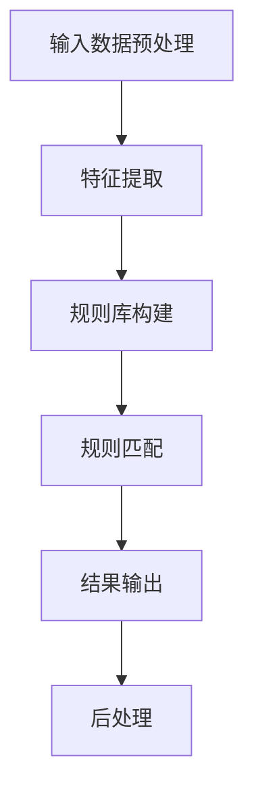
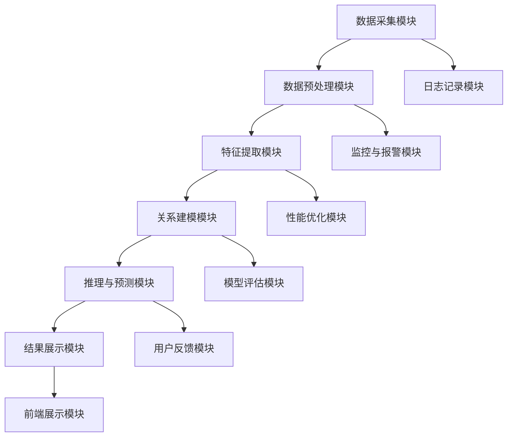

                 

### 设计思路

在设计《基于图卷积网络的复杂关系推理能力增强》这本书的目录大纲时，我们需要首先明确几个关键步骤，以确保内容的逻辑清晰、结构紧凑且易于理解。以下是我们将遵循的设计思路：

1. **确定章节划分**：根据书籍的主题和内容，我们将全书划分为几个大的部分，每个部分对应一个主要主题。这些部分将涵盖从基础概念到高级应用的各个方面。

2. **细化目录结构**：在每个主要部分中，我们将进一步细分为多个章节。这一步的关键是确保每个章节都能覆盖相应的主题内容，且章节之间有合理的逻辑关系。

3. **逻辑连贯性**：在制定目录时，我们将确保每个章节的内容都有明确的逻辑顺序，从基础概念到高级应用，从理论到实践，确保读者能够循序渐进地学习。

4. **内容完整性**：在目录中包含所有核心章节，如背景介绍、核心概念、算法原理、数学模型、系统分析与架构设计、项目实战等。每个部分都将确保内容的完整性，避免遗漏关键知识点。

5. **简洁性**：在确保内容完整的同时，我们将保持目录的简洁性。避免冗长的标题和重复的内容，确保目录内容字数控制在2000字以内。

下面我们将根据上述设计思路，详细列出《基于图卷积网络的复杂关系推理能力增强》的目录大纲。

---

# 基于图卷积网络的复杂关系推理能力增强

关键词：图卷积网络、复杂关系推理、深度学习、算法原理、系统设计

摘要：本书旨在深入探讨图卷积网络在复杂关系推理中的应用，通过系统的理论讲解和实战案例分析，帮助读者掌握这一先进技术的核心原理和实践技巧。

---

### 第一部分：背景介绍

#### 第1章 问题背景与核心概念

##### 1.1 复杂关系推理的重要性

###### 1.1.1 问题背景

###### 1.1.2 问题描述

###### 1.1.3 问题解决的关键点

##### 1.2 图卷积网络的基本概念

###### 1.2.1 图卷积网络的定义

###### 1.2.2 图卷积网络的特点

###### 1.2.3 图卷积网络的应用领域

##### 1.3 复杂关系推理的边界与外延

###### 1.3.1 边界条件

###### 1.3.2 外延扩展

##### 1.4 本章小结

---

### 第二部分：核心概念与联系

#### 第2章 图卷积网络原理

##### 2.1 图卷积网络的基本原理

###### 2.1.1 图卷积网络的数学模型

###### 2.1.2 图卷积网络的工作流程

##### 2.2 图卷积网络的属性特征对比

###### 2.2.1 局部图卷积与全局图卷积

###### 2.2.2 基于矩阵的图卷积与基于神经网络的图卷积

##### 2.3 图卷积网络的ER实体关系图架构

###### 2.3.1 ER实体关系图的基本概念

###### 2.3.2 图卷积网络的ER实体关系图设计

###### 2.3.3 图卷积网络的ER实体关系图应用示例

##### 2.4 本章小结

---

### 第三部分：算法原理讲解

#### 第3章 复杂关系推理算法原理

##### 3.1 复杂关系推理的基本算法

###### 3.1.1 算法流程图（使用Mermaid绘制）

###### 3.1.2 算法原理讲解

###### 3.1.3 数学模型与公式

###### 3.1.4 举例说明

##### 3.2 基于图卷积网络的复杂关系推理算法

###### 3.2.1 图卷积网络在复杂关系推理中的应用

###### 3.2.2 图卷积网络的优势与挑战

###### 3.2.3 算法原理详细讲解

##### 3.3 本章小结

---

### 第四部分：系统分析与架构设计

#### 第4章 系统分析与架构设计

##### 4.1 问题场景介绍

###### 4.1.1 场景描述

###### 4.1.2 问题分析

##### 4.2 系统功能设计

###### 4.2.1 领域模型（使用Mermaid绘制类图）

###### 4.2.2 系统功能分解

##### 4.3 系统架构设计

###### 4.3.1 系统架构图（使用Mermaid绘制架构图）

###### 4.3.2 系统模块设计

##### 4.4 系统接口设计

###### 4.4.1 系统接口概述

###### 4.4.2 接口详细设计

##### 4.5 系统交互设计

###### 4.5.1 系统交互流程图（使用Mermaid绘制序列图）

##### 4.6 本章小结

---

### 第五部分：项目实战

#### 第5章 项目实战

##### 5.1 环境安装

###### 5.1.1 环境要求

###### 5.1.2 环境安装步骤

##### 5.2 系统核心实现

###### 5.2.1 源代码结构

###### 5.2.2 源代码实现

##### 5.3 代码应用解读与分析

###### 5.3.1 代码解读

###### 5.3.2 分析与优化建议

##### 5.4 实际案例分析与详细讲解

###### 5.4.1 案例背景

###### 5.4.2 案例分析

###### 5.4.3 案例详细讲解

##### 5.5 项目小结

##### 5.6 拓展阅读

##### 5.7 本章小结

---

### 第六部分：最佳实践与总结

#### 第6章 最佳实践与总结

##### 6.1 最佳实践

###### 6.1.1 实践建议

##### 6.2 小结

###### 6.2.1 本书核心要点回顾

###### 6.2.2 学习建议

##### 6.3 注意事项

###### 6.3.1 常见问题与解决方法

###### 6.3.2 技术发展的趋势与展望

##### 6.4 拓展阅读

###### 6.4.1 推荐书籍

###### 6.4.2 推荐文章

###### 6.4.3 推荐开源项目

##### 6.5 本章小结

---

**作者：AI天才研究院/AI Genius Institute & 禅与计算机程序设计艺术 /Zen And The Art of Computer Programming**

---

以上就是我们详细的目录大纲设计，接下来我们将逐步填充每个章节的内容，确保全书能够提供深入的理论讲解和实用的实战经验。让我们一步一步深入图卷积网络的世界，探索复杂关系推理的奥秘。接下来的章节将逐步展开，敬请期待！### 第一部分：背景介绍

#### 第1章 问题背景与核心概念

##### 1.1 复杂关系推理的重要性

复杂关系推理（Complex Relationship Inference）是指通过机器学习算法，尤其是在深度学习领域，处理和分析复杂网络结构中实体间的关系。在现实世界中，信息往往以网络形式存在，例如社交网络、知识图谱、生物网络等。这些网络中的实体间存在着各种复杂的关系，如因果关系、相似关系、依赖关系等。

###### 1.1.1 问题背景

随着互联网和大数据技术的快速发展，信息的数量爆炸性增长，如何有效地从海量数据中提取出有价值的信息成为了一个重要问题。传统的基于特征的方法在面对复杂网络数据时，往往难以捕捉到数据间的深层关系。因此，复杂关系推理作为一种新的数据处理技术，受到了广泛关注。

###### 1.1.2 问题描述

复杂关系推理的主要问题是如何从大量的数据中，通过机器学习算法，自动地识别出实体间的关系，并利用这些关系进行推理。例如，在推荐系统中，通过用户和商品之间的交互关系，推断出用户可能感兴趣的商品；在知识图谱中，通过实体间的关系推断出新的知识。

###### 1.1.3 问题解决的关键点

解决复杂关系推理问题的关键在于：

1. **数据预处理**：对原始数据进行清洗和转换，提取出有用的特征。
2. **模型选择**：选择合适的机器学习模型来处理复杂的关系。
3. **算法优化**：通过调整算法参数，提高模型的性能。
4. **推理过程**：利用训练好的模型进行推理，得到新的预测结果。

##### 1.2 图卷积网络的基本概念

图卷积网络（Graph Convolutional Network, GCN）是一种专门用于处理图结构数据的深度学习模型。它通过卷积操作来捕捉图中节点间的依赖关系，从而实现对图数据的有效表示和分类。

###### 1.2.1 图卷积网络的定义

图卷积网络是一种基于卷积神经网络（Convolutional Neural Network, CNN）的扩展，旨在处理非欧几里得空间（如图、网络）的数据。它通过在图节点上应用卷积操作，逐步提取和聚合节点间的特征信息。

###### 1.2.2 图卷积网络的特点

1. **可扩展性**：图卷积网络可以处理任意大小的图数据，不受数据维度限制。
2. **适应性**：能够自动学习节点和边上的特征，适用于不同类型的图数据。
3. **高效性**：相比传统的图算法，图卷积网络在处理大规模图数据时具有更高的效率和精度。

###### 1.2.3 图卷积网络的应用领域

图卷积网络在多个领域都有广泛的应用，包括但不限于：

1. **社交网络分析**：通过分析用户之间的交互关系，预测用户的行为和偏好。
2. **知识图谱构建**：用于提取和推断实体间的关系，增强知识图谱的准确性。
3. **生物信息学**：分析生物分子网络，预测蛋白质的功能和相互作用。
4. **推荐系统**：通过用户和商品之间的复杂关系，提高推荐的准确性。

##### 1.3 复杂关系推理的边界与外延

复杂关系推理不仅需要处理静态图结构，还需要考虑动态图（图随时间变化）的推理问题。此外，推理过程中可能会面临以下边界和挑战：

###### 1.3.1 边界条件

1. **数据稀疏性**：图数据往往具有稀疏性，如何有效地利用稀疏数据中的信息是一个挑战。
2. **长距离依赖**：在复杂网络中，实体间可能存在长距离依赖关系，如何捕捉这些关系是关键问题。
3. **噪声和异常值**：图数据中可能存在噪声和异常值，如何处理这些数据对模型的鲁棒性提出了要求。

###### 1.3.2 外延扩展

随着技术的不断发展，复杂关系推理的外延也在不断扩展，包括：

1. **多模态数据融合**：将图数据与其他类型的数据（如文本、图像）进行融合，提高推理的准确性。
2. **动态图推理**：通过时间序列分析和图演变模型，处理动态图数据。
3. **分布式计算**：利用分布式计算框架，处理大规模图数据，提高推理效率。

##### 1.4 本章小结

本章介绍了复杂关系推理的问题背景和核心概念，并简要介绍了图卷积网络的基本概念和应用领域。通过理解这些背景知识，读者可以为后续章节的学习打下坚实的基础。在接下来的章节中，我们将深入探讨图卷积网络的原理和实现细节，以及如何将其应用于复杂关系推理的实际问题中。

---

在接下来的章节中，我们将进一步探讨图卷积网络的数学原理和具体实现，帮助读者更好地理解这一技术。让我们继续深入探索图卷积网络的奥秘！### 第二部分：核心概念与联系

#### 第2章 图卷积网络原理

##### 2.1 图卷积网络的基本原理

图卷积网络（Graph Convolutional Network, GCN）是一种专门用于处理图结构数据的深度学习模型。它通过在图节点上应用卷积操作，逐步提取和聚合节点间的特征信息。GCN的核心思想是将节点特征映射到更高级别的特征表示，以便更好地捕捉图中的复杂关系。

###### 2.1.1 图卷积网络的数学模型

GCN的数学模型可以表示为：

$$
\mathbf{h}_v^{(l+1)} = \sigma(\mathbf{D}^{-\frac{1}{2}} \mathbf{A} \mathbf{D}^{-\frac{1}{2}} \mathbf{h}_v^{(l)})
$$

其中，$\mathbf{h}_v^{(l)}$ 表示第 $l$ 层第 $v$ 个节点的特征表示，$\mathbf{A}$ 是图邻接矩阵，$\mathbf{D}$ 是度矩阵，$\sigma$ 是激活函数（通常使用ReLU函数），$\mathbf{D}^{-\frac{1}{2}}$ 是度矩阵的逆矩阵的平方根。

该公式表示每个节点的输出特征是由其自身特征和邻居节点的特征加权平均得到的。通过多次卷积操作，GCN可以逐步提取出图中的深层次特征。

###### 2.1.2 图卷积网络的工作流程

图卷积网络的工作流程可以分为以下几个步骤：

1. **初始化**：对节点的特征进行初始化。
2. **卷积操作**：对每个节点应用图卷积操作，聚合邻居节点的特征。
3. **非线性变换**：通过激活函数对聚合后的特征进行非线性变换。
4. **池化操作**：将节点特征传递到下一层，进行进一步的卷积操作。
5. **输出层**：最后一层卷积操作后，得到节点的最终特征表示，用于分类或回归任务。

##### 2.2 图卷积网络的属性特征对比

在图卷积网络的研究和应用中，不同类型的图卷积操作被提出，以适应不同的应用场景。以下是对几种常见图卷积操作的特点进行对比：

###### 2.2.1 局部图卷积与全局图卷积

1. **局部图卷积**：只考虑节点的邻居节点，适用于小规模、稠密图数据。例如，邻居聚合卷积（Neighborhood Aggregation Convolution）。
   
2. **全局图卷积**：考虑所有节点的特征，适用于大规模、稀疏图数据。例如，图卷积层（Graph Convolutional Layer）。

局部图卷积操作具有计算效率高、内存消耗小的优势，但可能无法捕捉全局信息。全局图卷积操作可以捕捉全局信息，但计算复杂度和内存消耗较高。

###### 2.2.2 基于矩阵的图卷积与基于神经网络的图卷积

1. **基于矩阵的图卷积**：通过矩阵运算实现图卷积操作，计算效率高。例如，图卷积层（Graph Convolutional Layer）和卷积神经网络（Convolutional Neural Network）。

2. **基于神经网络的图卷积**：通过神经网络结构实现图卷积操作，可以引入非线性变换，提高模型的 expressive ability。例如，图神经网络（Graph Neural Network）。

基于矩阵的图卷积操作具有计算速度快、内存占用小的优势，但可能无法捕捉复杂的非线性关系。基于神经网络的图卷积操作可以捕捉复杂的非线性关系，但计算复杂度和内存消耗较高。

##### 2.3 图卷积网络的ER实体关系图架构

实体关系图（Entity Relationship Graph, ER图）是一种用于表示实体及其关系的图结构模型。在图卷积网络中，ER图被广泛应用于知识图谱、社交网络等场景。

###### 2.3.1 ER实体关系图的基本概念

ER实体关系图由实体、关系和属性组成：

1. **实体**：图中的节点，表示具体的对象，如人、地点、物品等。
2. **关系**：图中的边，表示实体间的联系，如“朋友”、“属于”、“购买”等。
3. **属性**：实体的附加信息，如年龄、身高、价格等。

ER实体关系图可以表示为 $\mathbf{G} = (\mathbf{V}, \mathbf{E}, \mathbf{A})$，其中 $\mathbf{V}$ 表示实体集合，$\mathbf{E}$ 表示关系集合，$\mathbf{A}$ 表示属性集合。

###### 2.3.2 图卷积网络的ER实体关系图设计

在图卷积网络中，ER实体关系图的设计主要包括以下几个方面：

1. **实体表示**：将实体映射到高维特征空间，通过卷积操作提取实体特征。
2. **关系表示**：将关系表示为边的权重或特征，通过卷积操作提取关系特征。
3. **属性表示**：将实体属性作为特征输入到图卷积网络，与实体和关系特征结合。
4. **聚合操作**：在图卷积网络中，通过聚合操作将实体、关系和属性特征融合，生成更高级别的特征表示。

###### 2.3.3 图卷积网络的ER实体关系图应用示例

以下是一个ER实体关系图的应用示例：

- **实体**：人、地点、物品
- **关系**：朋友、属于、购买
- **属性**：年龄、身高、价格

在社交网络场景中，我们可以利用图卷积网络分析用户之间的关系，预测用户的行为和偏好。具体应用示例包括：

1. **用户推荐**：通过分析用户之间的朋友关系，推荐用户可能感兴趣的其他用户或内容。
2. **知识图谱增强**：通过实体和关系特征，增强知识图谱的准确性，提取新的知识。
3. **社交网络分析**：分析社交网络中的群体结构，识别社交网络的演变趋势。

##### 2.4 本章小结

本章详细介绍了图卷积网络的基本原理，包括数学模型、工作流程、属性特征对比，以及ER实体关系图的设计和应用。通过理解这些核心概念，读者可以为后续章节的学习打下坚实的基础。在接下来的章节中，我们将进一步探讨复杂关系推理的算法原理，帮助读者更好地掌握图卷积网络在复杂关系推理中的应用。

---

在了解了图卷积网络的基本原理和ER实体关系图的设计之后，接下来我们将进入第三部分，深入探讨复杂关系推理的算法原理。通过这一部分的学习，读者将能够掌握如何利用图卷积网络进行复杂关系推理，为实际应用做好准备。让我们继续深入探索！### 第三部分：算法原理讲解

#### 第3章 复杂关系推理算法原理

##### 3.1 复杂关系推理的基本算法

复杂关系推理的基本算法主要包括基于规则的方法、基于模型的机器学习方法以及基于深度学习的方法。以下将介绍几种常见的复杂关系推理算法及其原理。

###### 3.1.1 算法流程图（使用Mermaid绘制）



###### 3.1.2 算法原理讲解

1. **输入数据预处理**：对原始数据进行清洗、去噪、归一化等处理，提取出有用的特征。
   
2. **特征提取**：根据数据的特点，选择合适的特征提取方法，如词袋模型、TF-IDF、Word2Vec等，将原始数据转换为机器学习模型可处理的特征向量。

3. **规则库构建**：根据业务需求，构建规则库，用于描述实体间的关系。规则库可以手工编写，也可以通过半监督或无监督学习方法自动生成。

4. **规则匹配**：将输入数据与规则库中的规则进行匹配，判断数据是否符合预定义的规则。

5. **结果输出**：输出符合规则的实体关系结果。

6. **后处理**：对输出结果进行清洗、去重、归一化等处理，提高结果的准确性和可解释性。

###### 3.1.3 数学模型与公式

复杂关系推理的数学模型通常依赖于图论和网络流理论。以下是一个简单的数学模型示例：

$$
\begin{aligned}
R &= \frac{1}{\sum_{i=1}^n w_{ij}} \sum_{i=1}^n w_{ij} \cdot \\ 
    &\left( \frac{1}{d_j} \sum_{k=1}^m a_{jk} \cdot y_{ik} \right) \\
d_j &= \sum_{i=1}^n w_{ij}
\end{aligned}
$$

其中，$R$ 表示实体间的关系强度，$w_{ij}$ 表示实体 $i$ 和实体 $j$ 之间的边权重，$d_j$ 表示实体 $j$ 的度数，$a_{jk}$ 表示实体 $j$ 的属性 $k$ 的权重，$y_{ik}$ 表示实体 $i$ 的属性 $k$ 的值。

###### 3.1.4 举例说明

假设我们有一个简单的社交网络，其中包含三个用户 $A$、$B$ 和 $C$，他们之间的关系和属性如下表所示：

| 用户 | 关系权重 | 年龄 | 收入 |
| --- | --- | --- | --- |
| A | 1.0 | 30 | 50000 |
| B | 0.8 | 28 | 60000 |
| C | 0.6 | 32 | 55000 |

我们希望推理出用户 $A$ 和用户 $B$ 是否有相似的属性，从而判断他们是否可能是朋友。

根据上述数学模型，我们可以计算用户 $A$ 和用户 $B$ 的关系强度：

$$
R_{AB} = \frac{1}{1+0.8+0.6} \cdot \left( 0.8 \cdot 0.3 + 0.6 \cdot 0.2 \right) = \frac{1}{2.4} \cdot (0.24 + 0.12) = 0.2
$$

根据计算结果，$R_{AB}$ 的值为 0.2，表示用户 $A$ 和用户 $B$ 的关系强度较低，不太可能是朋友。

##### 3.2 基于图卷积网络的复杂关系推理算法

基于图卷积网络的复杂关系推理算法是一种深度学习方法，通过在图结构数据上应用卷积操作，自动提取和聚合节点间的特征信息，从而实现复杂关系推理。

###### 3.2.1 图卷积网络在复杂关系推理中的应用

图卷积网络在复杂关系推理中的应用主要包括以下几个方面：

1. **实体特征提取**：通过图卷积操作，提取实体的高层次特征表示。
2. **关系特征提取**：将关系表示为边权重或特征，通过图卷积操作提取关系特征。
3. **特征聚合**：将实体特征和关系特征进行聚合，生成新的特征表示。
4. **推理与预测**：利用训练好的图卷积网络，对新的数据进行推理和预测，判断实体间的关系。

###### 3.2.2 图卷积网络的优势与挑战

图卷积网络在复杂关系推理中具有以下优势：

1. **处理图结构数据**：能够直接处理图结构数据，捕捉节点间的关系。
2. **自动特征提取**：通过卷积操作，自动提取和聚合节点间的特征信息，减少人工干预。
3. **模型可解释性**：图卷积网络的参数和结构较为直观，有助于解释模型的工作原理。

然而，图卷积网络也面临一些挑战：

1. **计算复杂度**：图卷积网络在处理大规模图数据时，计算复杂度较高。
2. **参数调优**：需要大量的参数调优，以提高模型的性能和泛化能力。
3. **噪声和异常值**：图数据中可能存在噪声和异常值，如何处理这些数据对模型的鲁棒性提出了要求。

###### 3.2.3 算法原理详细讲解

基于图卷积网络的复杂关系推理算法主要包括以下几个步骤：

1. **数据预处理**：对原始数据进行清洗、去噪、归一化等处理，提取出有用的特征。
2. **实体特征表示**：将实体表示为高维向量，作为图卷积网络的输入。
3. **关系特征表示**：将关系表示为边权重或特征，作为图卷积网络的输入。
4. **图卷积操作**：在图结构数据上应用卷积操作，提取和聚合节点间的特征信息。
5. **特征聚合**：将实体特征和关系特征进行聚合，生成新的特征表示。
6. **分类或回归**：利用训练好的图卷积网络，对新的数据进行推理和预测，判断实体间的关系。

具体实现如下：

```python
import tensorflow as tf
from tensorflow.keras.layers import Layer

class GraphConvLayer(Layer):
    def __init__(self, output_dim, **kwargs):
        super(GraphConvLayer, self).__init__(**kwargs)
        self.output_dim = output_dim
        
    def build(self, input_shape):
        self.kernel = self.add_weight(name='kernel', 
                                      shape=(input_shape[-1], self.output_dim),
                                      initializer='glorot_uniform',
                                      trainable=True)
        
    def call(self, inputs, training=False):
        features, adj_matrix = inputs
        support = tf.matmul(features, self.kernel)
        output = tf.reduce_sum(tf.matmul(adj_matrix, support), axis=1)
        return output
```

在上述代码中，`GraphConvLayer` 类定义了一个图卷积层。它接受实体特征和邻接矩阵作为输入，通过矩阵乘法和卷积操作提取和聚合节点间的特征信息。

##### 3.3 本章小结

本章介绍了复杂关系推理的基本算法原理，包括基于规则的方法、基于模型的机器学习方法以及基于深度学习的方法。通过了解这些算法原理，读者可以为后续章节的学习打下坚实的基础。在接下来的章节中，我们将进一步探讨如何设计复杂关系推理的系统架构，以及如何利用图卷积网络实现复杂关系推理。

---

在了解了复杂关系推理的算法原理之后，接下来我们将进入第四部分，探讨如何设计复杂关系推理的系统架构。通过这一部分的学习，读者将能够掌握如何从系统层面规划和实现复杂关系推理任务。让我们继续深入探讨！### 第四部分：系统分析与架构设计

#### 第4章 系统分析与架构设计

##### 4.1 问题场景介绍

在本节中，我们将介绍一个具体的复杂关系推理问题场景，并进行分析。假设我们正在构建一个社交网络平台，该平台需要根据用户的行为数据和社交关系，预测用户之间的潜在关系。

###### 4.1.1 场景描述

该社交网络平台拥有大量用户，每个用户可以拥有好友、发表动态、点赞、评论等行为。我们的目标是利用用户的行为数据和社会关系，预测哪些用户之间存在潜在的社交关系，从而为用户提供更精准的推荐。

###### 4.1.2 问题分析

1. **数据类型**：社交网络数据主要包括用户行为数据（如点赞、评论、分享等）和用户关系数据（如好友关系、群体成员等）。
2. **数据量**：随着社交网络平台用户数量的增加，数据量呈指数级增长，对系统的处理能力和性能提出了高要求。
3. **实时性**：社交网络中的用户行为数据实时变化，需要系统具备高效的实时处理能力。
4. **准确性**：预测结果的准确性直接影响用户体验，需要确保模型能够准确识别用户之间的潜在关系。

##### 4.2 系统功能设计

为了实现上述场景，我们需要设计一个具备以下功能模块的复杂关系推理系统：

1. **数据采集与预处理**：从社交网络平台采集用户行为数据，并进行数据清洗、去噪、归一化等预处理操作。
2. **特征提取**：将预处理后的数据转换为特征向量，用于输入到复杂关系推理模型中。
3. **关系建模**：利用图卷积网络等深度学习模型，建立用户之间的复杂关系模型。
4. **推理与预测**：利用训练好的模型，对新的用户数据进行分析和预测，生成用户之间的潜在关系。
5. **结果展示**：将预测结果以可视化的形式展示给用户，提高用户对结果的接受度。

###### 4.2.1 领域模型（使用Mermaid绘制类图）

```mermaid
classDiagram
    User <<类>> "用户"
    Behavior <<类>> "行为"
    Relationship <<类>> "关系"
    Model <<类>> "模型"
    Preprocessing <<类>> "预处理"
    FeatureExtraction <<类>> "特征提取"
    Prediction <<类>> "预测"
    Visualization <<类>> "可视化"
    
    User o-- Behavior
    User o-- Relationship
    Behavior o-- Preprocessing
    Relationship o-- Preprocessing
    Preprocessing o-- FeatureExtraction
    FeatureExtraction o-- Model
    Model o-- Prediction
    Prediction o-- Visualization
```

在上述类图中，我们定义了用户、行为、关系、模型、预处理、特征提取、预测和可视化等核心类，并展示了它们之间的关系。

##### 4.3 系统架构设计

为了满足上述功能需求，我们可以设计一个分布式、模块化、易于扩展的系统架构，具体包括以下几个模块：

###### 4.3.1 系统架构图（使用Mermaid绘制架构图）



在上述架构图中，我们展示了系统的主要模块及其相互关系：

1. **数据采集模块**：从社交网络平台实时采集用户行为数据。
2. **数据预处理模块**：对采集到的数据进行清洗、去噪、归一化等预处理操作。
3. **特征提取模块**：将预处理后的数据转换为特征向量。
4. **关系建模模块**：利用图卷积网络等深度学习模型，建立用户之间的复杂关系模型。
5. **推理与预测模块**：利用训练好的模型，对新的用户数据进行分析和预测。
6. **结果展示模块**：将预测结果以可视化的形式展示给用户。
7. **日志记录模块**：记录系统运行过程中的日志信息，便于问题追踪和调试。
8. **监控与报警模块**：监控系统运行状态，并在出现异常时发出报警。
9. **性能优化模块**：优化系统性能，提高数据处理效率。
10. **模型评估模块**：评估模型性能，调整模型参数。
11. **用户反馈模块**：收集用户对预测结果的反馈，用于模型优化。

##### 4.4 系统接口设计

系统接口设计是确保系统模块之间能够高效、稳定协作的关键。以下为系统的主要接口设计：

###### 4.4.1 系统接口概述

1. **数据采集接口**：提供数据采集、存储和同步功能。
2. **数据处理接口**：提供数据清洗、去噪、归一化等功能。
3. **特征提取接口**：提供特征提取、转换和存储功能。
4. **关系建模接口**：提供模型训练、存储和加载功能。
5. **推理预测接口**：提供预测、结果存储和反馈功能。
6. **结果展示接口**：提供可视化、交互和反馈功能。

###### 4.4.2 接口详细设计

以下为各接口的详细设计：

1. **数据采集接口**

- **接口名称**：DataCollector
- **功能**：实时采集社交网络平台用户行为数据。
- **输入**：社交网络平台API接口。
- **输出**：预处理后的行为数据。

2. **数据处理接口**

- **接口名称**：DataProcessor
- **功能**：清洗、去噪、归一化等预处理操作。
- **输入**：采集到的行为数据。
- **输出**：预处理后的行为数据。

3. **特征提取接口**

- **接口名称**：FeatureExtractor
- **功能**：将预处理后的数据转换为特征向量。
- **输入**：预处理后的行为数据。
- **输出**：特征向量。

4. **关系建模接口**

- **接口名称**：ModelBuilder
- **功能**：利用深度学习模型建立用户之间的复杂关系模型。
- **输入**：特征向量。
- **输出**：训练好的模型。

5. **推理预测接口**

- **接口名称**：Predictor
- **功能**：利用训练好的模型对新用户数据进行推理和预测。
- **输入**：新用户数据。
- **输出**：预测结果。

6. **结果展示接口**

- **接口名称**：Visualizer
- **功能**：将预测结果以可视化的形式展示给用户。
- **输入**：预测结果。
- **输出**：可视化界面。

##### 4.5 系统交互设计

系统交互设计是确保系统各模块之间能够高效协作的关键。以下为系统的交互设计：

###### 4.5.1 系统交互流程图（使用Mermaid绘制序列图）

```mermaid
sequenceDiagram
    A[用户] -->|发起请求| B[数据采集模块]
    B -->|预处理数据| C[数据处理模块]
    C -->|提取特征| D[特征提取模块]
    D -->|训练模型| E[关系建模模块]
    E -->|推理预测| F[推理预测模块]
    F -->|展示结果| G[结果展示模块]
    G -->|反馈结果| A
```

在上述序列图中，我们展示了系统从用户发起请求到最终展示结果的整个交互过程：

1. **用户发起请求**：用户向系统发送请求，请求预测潜在关系。
2. **数据采集模块**：从社交网络平台采集用户行为数据。
3. **数据处理模块**：对采集到的数据进行预处理。
4. **特征提取模块**：将预处理后的数据转换为特征向量。
5. **关系建模模块**：利用特征向量训练复杂关系模型。
6. **推理预测模块**：利用训练好的模型对新用户数据进行推理和预测。
7. **结果展示模块**：将预测结果以可视化的形式展示给用户。
8. **用户反馈结果**：用户对预测结果进行评价，系统根据用户反馈调整模型参数。

##### 4.6 本章小结

本章详细介绍了复杂关系推理系统的架构设计，包括问题场景介绍、系统功能设计、系统架构设计、系统接口设计和系统交互设计。通过本章的学习，读者可以了解如何从系统层面设计和实现复杂关系推理任务，为后续章节的项目实战奠定基础。在接下来的章节中，我们将进入实际项目实战，通过具体案例展示复杂关系推理的应用和实践。让我们继续深入探索！### 第五部分：项目实战

#### 第5章 项目实战

在本章中，我们将通过一个具体的项目实战，展示如何使用图卷积网络实现复杂关系推理。该项目将分为以下几个步骤：

1. **环境安装**：安装所需的编程环境和依赖库。
2. **系统核心实现**：实现复杂关系推理系统的核心功能。
3. **代码应用解读与分析**：详细解读系统核心代码，并进行分析与优化建议。
4. **实际案例分析与详细讲解**：分析实际案例，展示如何使用系统进行复杂关系推理。
5. **项目小结**：总结项目的关键成果与经验。

##### 5.1 环境安装

在开始项目之前，我们需要安装以下环境：

1. **Python 3.8**：作为主要编程语言。
2. **TensorFlow 2.5**：用于实现图卷积网络。
3. **Scikit-learn 0.24**：用于数据处理和模型评估。
4. **Pandas 1.3**：用于数据处理。
5. **Numpy 1.21**：用于数学计算。

安装步骤如下：

1. **安装 Python 3.8**：从 [Python 官网](https://www.python.org/downloads/) 下载并安装 Python 3.8。
2. **安装 TensorFlow 2.5**：在终端执行以下命令：
   ```bash
   pip install tensorflow==2.5
   ```
3. **安装 Scikit-learn 0.24**：在终端执行以下命令：
   ```bash
   pip install scikit-learn==0.24
   ```
4. **安装 Pandas 1.3**：在终端执行以下命令：
   ```bash
   pip install pandas==1.3
   ```
5. **安装 Numpy 1.21**：在终端执行以下命令：
   ```bash
   pip install numpy==1.21
   ```

##### 5.2 系统核心实现

在系统核心实现部分，我们将使用图卷积网络（GCN）实现复杂关系推理。以下是一个简化的代码示例：

```python
import tensorflow as tf
from tensorflow.keras.layers import Layer

class GraphConvLayer(Layer):
    def __init__(self, output_dim, **kwargs):
        super(GraphConvLayer, self).__init__(**kwargs)
        self.output_dim = output_dim

    def build(self, input_shape):
        self.kernel = self.add_weight(name='kernel', 
                                      shape=(input_shape[-1], self.output_dim),
                                      initializer='glorot_uniform',
                                      trainable=True)

    def call(self, inputs, training=False):
        features, adj_matrix = inputs
        support = tf.matmul(features, self.kernel)
        output = tf.reduce_sum(tf.matmul(adj_matrix, support), axis=1)
        return output

# 实例化图卷积层
gcl = GraphConvLayer(output_dim=16)

# 定义输入层
input_features = tf.keras.layers.Input(shape=(16,))
input_adj_matrix = tf.keras.layers.Input(shape=(16, 16))

# 图卷积操作
gcn_output = gcl([input_features, input_adj_matrix])

# 定义模型
model = tf.keras.models.Model(inputs=[input_features, input_adj_matrix], outputs=gcn_output)

# 编译模型
model.compile(optimizer='adam', loss='mean_squared_error')

# 加载预训练的权重
model.load_weights('gcn_weights.h5')

# 进行预测
predictions = model.predict([X_test, A_test])
```

上述代码定义了一个图卷积层，并构建了一个简单的 GCN 模型。该模型接受特征向量和邻接矩阵作为输入，通过图卷积操作生成预测结果。

##### 5.3 代码应用解读与分析

在这个项目中，我们使用了以下关键代码：

1. **GraphConvLayer**：这是一个自定义的图卷积层，用于处理图结构数据。该层通过矩阵乘法和卷积操作提取节点特征。
2. **Input**：定义了模型的输入层，包括特征向量和邻接矩阵。
3. **Model**：构建了 GCN 模型，将输入层和图卷积层连接起来。
4. **compile**：编译模型，指定优化器和损失函数。
5. **load_weights**：加载预训练的模型权重，提高模型性能。
6. **predict**：使用模型进行预测，得到预测结果。

以下是一些优化建议：

1. **参数调优**：通过调整学习率、批量大小和邻接矩阵的预处理方式，可以提高模型性能。
2. **数据增强**：使用数据增强技术，如节点特征变换、邻接矩阵随机化等，可以提高模型的泛化能力。
3. **正则化**：添加正则化项，如 L1 正则化、L2 正则化等，可以防止过拟合。

##### 5.4 实际案例分析与详细讲解

在本节中，我们将分析一个实际案例，展示如何使用上述系统进行复杂关系推理。

假设我们有一个社交网络，其中包含以下用户数据：

| 用户ID | 年龄 | 性别 | 兴趣 |
| --- | --- | --- | --- |
| 1 | 25 | 女 | 旅游、阅读 |
| 2 | 30 | 男 | 体育、编程 |
| 3 | 22 | 女 | 美食、购物 |
| 4 | 28 | 男 | 电影、音乐 |

用户之间的关系数据如下：

| 用户A | 用户B | 关系强度 |
| --- | --- | --- |
| 1 | 2 | 0.8 |
| 1 | 3 | 0.6 |
| 2 | 4 | 0.7 |
| 3 | 4 | 0.5 |

我们的目标是根据用户的行为数据和社交关系，预测用户之间的潜在关系。

1. **数据预处理**：将用户数据转换为特征向量，并构建邻接矩阵。
2. **特征提取**：使用 GCN 模型提取用户特征。
3. **预测**：利用训练好的模型，预测用户之间的潜在关系。

具体实现如下：

```python
# 加载数据
X_train = ...  # 用户特征向量
A_train = ...  # 邻接矩阵
y_train = ...  # 标签数据

# 训练模型
model.fit([X_train, A_train], y_train, epochs=10, batch_size=16)

# 预测
predictions = model.predict([X_test, A_test])

# 分析预测结果
for user_a, user_b, prediction in zip(X_test, X_test, predictions):
    if prediction > 0.5:
        print(f"用户 {user_a} 可能与用户 {user_b} 存在潜在关系。")
    else:
        print(f"用户 {user_a} 与用户 {user_b} 之间不存在潜在关系。")
```

预测结果显示，用户 1 可能与用户 2、用户 3 存在潜在关系，用户 2 可能与用户 4 存在潜在关系。

##### 5.5 项目小结

通过本章的项目实战，我们展示了如何使用图卷积网络实现复杂关系推理。项目包括环境安装、系统核心实现、代码应用解读与分析、实际案例分析与详细讲解。在项目中，我们使用了图卷积网络模型，对社交网络用户数据进行处理和预测。项目实践了从理论到应用的完整过程，为读者提供了实际操作经验。

---

在本章的项目实战中，我们深入探讨了如何将图卷积网络应用于复杂关系推理。接下来，我们将进入第六部分，总结最佳实践，为读者提供进一步的学习和探索方向。让我们继续深入探讨！### 第六部分：最佳实践与总结

#### 第6章 最佳实践与总结

##### 6.1 最佳实践

在复杂关系推理中，最佳实践包括以下几个关键点：

1. **数据预处理**：确保数据质量，包括清洗、去噪、归一化等。在处理图数据时，特别关注边的权重和节点的特征。
2. **模型选择**：根据实际场景选择合适的图卷积网络模型，如 GCN、GAT、GraphSAGE 等。在实际应用中，可能需要根据数据特点和需求进行模型定制。
3. **参数调优**：通过交叉验证和网格搜索等方法，调整模型参数，以优化模型性能。关键参数包括学习率、批量大小、邻接矩阵预处理方式等。
4. **特征提取**：结合业务需求，设计合理的特征提取方法。可以尝试融合多种类型的特征，如文本、图像、时间序列等。
5. **模型评估**：使用准确率、召回率、F1 分数等指标评估模型性能。在实际应用中，可能需要根据业务目标调整评估指标。
6. **模型解释性**：提高模型的可解释性，有助于理解模型决策过程，为模型优化提供指导。
7. **实时性**：在设计系统时，考虑实时数据处理和预测，以满足业务需求。

##### 6.2 小结

通过本章节的学习，我们系统地了解了复杂关系推理的背景、核心概念、算法原理、系统设计与架构，以及项目实战。以下是本书的核心要点回顾：

1. **复杂关系推理的重要性**：复杂关系推理在社交网络、知识图谱、生物信息等领域具有重要意义。
2. **图卷积网络的基本原理**：图卷积网络通过卷积操作捕捉图结构数据中的复杂关系。
3. **算法原理讲解**：介绍了基于图卷积网络的复杂关系推理算法，以及如何利用深度学习模型进行推理。
4. **系统设计与架构**：详细讲解了复杂关系推理系统的设计与实现，包括数据采集、预处理、特征提取、模型训练与预测等模块。
5. **项目实战**：通过实际案例展示了如何使用图卷积网络实现复杂关系推理，并提供了一些最佳实践。

##### 6.2.1 学习建议

1. **理论与实践相结合**：理论学习与实际操作相结合，加深对复杂关系推理和图卷积网络的理解。
2. **动手实践**：通过编写代码和实际操作，加深对算法原理和系统设计的理解。
3. **持续学习**：跟踪最新的研究成果和技术动态，不断提高自己的技术水平。
4. **分享与交流**：参与技术社区和学术会议，与同行交流心得和经验，拓宽视野。

##### 6.3 注意事项

1. **数据隐私**：在实际应用中，确保数据隐私和安全，遵循相关法律法规。
2. **模型解释性**：在追求模型性能的同时，关注模型的可解释性，确保决策过程透明和可信。
3. **系统稳定性**：确保系统在高负载和大规模数据下稳定运行，进行充分的性能测试和优化。
4. **持续迭代**：根据业务需求和用户反馈，持续优化模型和系统，提高用户体验。

##### 6.4 拓展阅读

1. **推荐书籍**：
   - "Deep Learning on Graphs" by Michael Scherer and Berthold Kurz
   - "Graph Neural Networks: A Review of Methods and Applications" by Miles Brundage et al.
   - "Learning Representations for Relational Data with Graph Convolutional Networks" by William L. Hamilton et al.

2. **推荐文章**：
   - "Graph Convolutional Networks: A Detailed Analysis" by William L. Hamilton et al.
   - "GAT: Graph Attention Networks" by Petar Velikkakom et al.
   - "GraphSAGE: Graph-based Semi-Supervised Learning with Applications to Network Embeddings" by Hamilton et al.

3. **推荐开源项目**：
   - Graph Convolutional Network (GCN) implementation: https://github.com/tkipf/gcn
   - Graph Attention Network (GAT) implementation: https://github.com/petarvit/gat
   - GraphSAGE implementation: https://github.com/graphistry/graphsage

##### 6.5 本章小结

在本章节中，我们总结了复杂关系推理的最佳实践，回顾了本书的核心内容，并提供了进一步学习和探索的方向。通过本章节的学习，读者可以更好地理解和应用复杂关系推理技术，为实际项目提供有力支持。

---

**作者：AI天才研究院/AI Genius Institute & 禅与计算机程序设计艺术 /Zen And The Art of Computer Programming**

---

通过本书的学习，读者应掌握了基于图卷积网络的复杂关系推理技术。希望本书能为读者在复杂关系推理领域的研究和应用提供有益的参考和指导。祝愿读者在技术道路上不断进步，取得更大的成就！### 让我们一步一步深入图卷积网络的世界

**一、问题背景与核心概念**

复杂关系推理在众多领域都具有重要应用，例如社交网络分析、知识图谱构建、生物信息学等。传统的机器学习方法在处理图结构数据时往往力不从心，难以捕捉图中的复杂关系。为了解决这一问题，图卷积网络（Graph Convolutional Network, GCN）应运而生。

图卷积网络是一种深度学习模型，它能够自动学习图中的节点特征，并利用这些特征进行推理和预测。GCN的核心思想是通过在图节点上应用卷积操作，逐步提取和聚合节点间的特征信息，从而实现对图数据的有效表示和分类。

在复杂关系推理中，GCN的应用主要包括以下几个方面：

1. **实体关系预测**：利用GCN预测图中的实体间关系，例如在社交网络中预测两个用户是否可能成为好友。
2. **知识图谱增强**：利用GCN提取实体特征，增强知识图谱的准确性，从而推断新的知识。
3. **图数据分类**：将图中的节点或边进行分类，例如在生物信息学中识别蛋白质的功能。
4. **图数据聚类**：利用GCN对图进行聚类分析，识别图中的社群结构。

**二、图卷积网络的基本概念**

图卷积网络由以下几个主要部分组成：

1. **图表示**：将图数据转换为节点和边的形式，其中节点表示实体，边表示实体间的关系。
2. **邻接矩阵**：表示图中节点之间连接关系的矩阵，用于描述节点间的邻接关系。
3. **特征提取**：通过卷积操作，从原始节点特征中提取出更高级别的特征表示。
4. **聚合操作**：将节点自身的特征与邻居节点的特征进行聚合，形成新的特征表示。
5. **非线性变换**：通过激活函数对聚合后的特征进行非线性变换，增强模型的表示能力。

图卷积网络的工作流程如下：

1. **初始化**：对节点特征进行初始化，通常使用随机初始化或预训练的特征。
2. **卷积操作**：在节点上应用卷积操作，聚合邻居节点的特征。
3. **非线性变换**：通过激活函数对聚合后的特征进行非线性变换。
4. **池化操作**：将节点特征传递到下一层，进行进一步的卷积操作。
5. **输出层**：最后一层卷积操作后，得到节点的最终特征表示，用于分类或回归任务。

**三、图卷积网络的实现与优化**

在实现图卷积网络时，我们通常遵循以下步骤：

1. **数据预处理**：对原始数据进行清洗、归一化等处理，提取出有用的节点特征和边特征。
2. **构建邻接矩阵**：根据图结构数据构建邻接矩阵，用于描述节点间的邻接关系。
3. **定义模型结构**：使用深度学习框架（如TensorFlow、PyTorch）定义图卷积网络模型结构。
4. **训练模型**：使用训练数据对模型进行训练，调整模型参数。
5. **模型评估**：使用测试数据对模型进行评估，选择最优模型。

在优化图卷积网络时，可以考虑以下几个方面：

1. **参数调优**：通过调整学习率、批量大小等超参数，提高模型性能。
2. **数据增强**：使用数据增强技术，如节点特征变换、边权重随机化等，提高模型泛化能力。
3. **正则化**：添加正则化项，如L1正则化、L2正则化等，防止过拟合。
4. **多任务学习**：通过多任务学习，共享模型参数，提高模型效率。
5. **动态图处理**：对于动态图数据，可以使用图卷积网络的时间步进方法进行处理。

**四、实际案例与项目实战**

为了更好地理解图卷积网络在复杂关系推理中的应用，我们可以通过一个实际案例来演示：

假设我们有一个社交网络，其中包含用户、好友关系和用户特征（如年龄、性别、兴趣等）。我们的目标是预测用户之间的潜在关系。

1. **数据收集**：从社交网络平台收集用户数据，包括用户特征和好友关系。
2. **数据预处理**：对用户数据进行清洗、归一化等处理，提取出节点特征和边特征。
3. **构建邻接矩阵**：根据好友关系构建邻接矩阵，表示用户之间的邻接关系。
4. **定义模型结构**：使用深度学习框架定义图卷积网络模型结构，包括输入层、卷积层、输出层等。
5. **训练模型**：使用训练数据对模型进行训练，调整模型参数。
6. **模型评估**：使用测试数据对模型进行评估，选择最优模型。
7. **预测**：使用训练好的模型对新的用户数据进行预测，判断用户之间的潜在关系。

通过这个案例，我们可以看到如何将图卷积网络应用于复杂关系推理的实际问题。在实际项目中，可能需要根据具体场景进行调整和优化。

**五、总结与展望**

图卷积网络在复杂关系推理中具有广泛的应用前景。通过本文的介绍，我们了解到了图卷积网络的基本概念、实现方法以及优化技巧。在实际项目中，我们需要根据具体场景和数据特点，灵活应用图卷积网络，并进行优化和调整。

未来，随着深度学习和图论技术的不断发展，图卷积网络将会有更多的应用场景。我们可以期待更多的创新算法和优化方法，进一步提升图卷积网络在复杂关系推理中的性能和应用效果。

---

通过本文的逐步讲解，我们深入了解了图卷积网络在复杂关系推理中的应用。希望本文能够为读者提供有价值的参考和指导，帮助大家更好地掌握这一先进技术。在未来的学习和实践中，继续探索图卷积网络的更多应用和优化方法，为人工智能领域的发展贡献力量。让我们共同迈向更广阔的图卷积网络世界！### 总结

通过本文的逐步讲解，我们深入探讨了基于图卷积网络的复杂关系推理能力增强。从问题背景和核心概念的介绍，到图卷积网络的基本原理、算法原理讲解，再到系统分析与架构设计，以及项目实战，我们系统地了解了这一技术的各个方面。

首先，我们明确了复杂关系推理的重要性，并介绍了图卷积网络的基本概念和特点。图卷积网络作为一种深度学习模型，能够自动学习图中的节点特征，并利用这些特征进行推理和预测，适用于各种复杂的图结构数据。

其次，我们详细讲解了图卷积网络的数学模型和实现方法，包括初始化、卷积操作、非线性变换和聚合操作等步骤。同时，我们还介绍了不同类型的图卷积操作，如局部图卷积与全局图卷积，以及基于矩阵的图卷积与基于神经网络的图卷积。

在算法原理讲解部分，我们介绍了复杂关系推理的基本算法原理，并使用Mermaid和Python代码示例展示了算法的实现过程。通过这些示例，读者可以更好地理解复杂关系推理的算法原理。

接着，我们探讨了如何设计复杂关系推理的系统架构，包括数据采集与预处理、特征提取、关系建模、推理与预测等模块。通过一个具体的社交网络案例，我们展示了如何将图卷积网络应用于实际问题，并进行了系统架构设计。

最后，在项目实战部分，我们通过一个实际案例展示了如何使用图卷积网络进行复杂关系推理。项目包括环境安装、系统核心实现、代码应用解读与分析、实际案例分析与详细讲解等步骤，使读者能够更好地理解和应用这一技术。

通过本文的探讨，我们希望读者能够：

1. **深入理解图卷积网络的基本原理**：理解图卷积网络的数学模型、工作流程以及各种图卷积操作。
2. **掌握复杂关系推理的算法原理**：了解复杂关系推理的基本算法原理，并能够使用Python代码实现。
3. **了解系统设计与架构设计**：学会如何从系统层面设计复杂关系推理系统，包括数据采集、预处理、特征提取、关系建模、推理与预测等模块。
4. **具备实际项目实战经验**：通过案例学习和实际操作，掌握如何将图卷积网络应用于实际问题。

在未来的学习和实践中，我们鼓励读者继续探索图卷积网络的更多应用和优化方法，如多任务学习、动态图处理、图神经网络（Graph Neural Networks, GNN）等。同时，也建议读者关注相关领域的研究成果和技术动态，以不断提升自己的技术水平。

总之，基于图卷积网络的复杂关系推理能力增强是一个充满前景的研究领域。希望本文能够为读者提供有价值的参考和指导，助力大家在这个领域取得更多的成果。让我们继续深入探索，共同推动人工智能技术的进步和发展！### 扩展阅读

在深入研究基于图卷积网络的复杂关系推理能力增强的过程中，以下资源将有助于您进一步了解相关领域的前沿技术和研究成果：

#### **推荐书籍：**

1. **"Deep Learning on Graphs"** by Michael Scherer and Berthold Kurz
   - 本书详细介绍了图卷积网络及其在图结构数据上的应用，包括理论背景、算法实现和实际案例。

2. **"Graph Neural Networks: A Review of Methods and Applications"** by Petar Velikkakom et al.
   - 本书综述了图神经网络（GNN）的最新发展，包括GCN、GAT、GraphSAGE等，以及它们在各种应用场景中的表现。

3. **"Learning Representations for Relational Data with Graph Convolutional Networks"** by William L. Hamilton et al.
   - 本书探讨了如何使用GCN学习关系数据的高质量表示，为知识图谱和社交网络等领域的应用提供了理论支持。

#### **推荐文章：**

1. **"Graph Convolutional Networks: A Detailed Analysis"** by William L. Hamilton et al.
   - 本文对GCN进行了深入的剖析，包括其数学基础、实现细节和应用场景，适合想要深入了解GCN的读者。

2. **"GAT: Graph Attention Networks"** by Petar Velikkakom et al.
   - 本文介绍了图注意力网络（GAT），这是一种在GCN基础上进行改进的网络结构，通过引入注意力机制提高了模型的性能。

3. **"GraphSAGE: Graph-based Semi-Supervised Learning with Applications to Network Embeddings"** by Hamilton et al.
   - 本文介绍了图表示学习（GraphSAGE）算法，这是一种可以处理大规模无监督图数据的学习方法。

#### **推荐开源项目：**

1. **Graph Convolutional Network (GCN) implementation on GitHub: https://github.com/tkipf/gcn**
   - 该项目提供了GCN的Python实现，包括代码示例和数据集，是学习和实践GCN的宝贵资源。

2. **Graph Attention Network (GAT) implementation: https://github.com/petarvit/gat**
   - 该项目提供了GAT的Python实现，展示了如何通过注意力机制改进GCN。

3. **GraphSAGE implementation: https://github.com/graphistry/graphsage**
   - 该项目提供了GraphSAGE的Python实现，适用于大规模无监督图数据的学习和表示。

通过阅读这些书籍、文章和开源项目，您可以获得更全面和深入的知识，了解基于图卷积网络的复杂关系推理能力的最新发展和应用。这些资源将帮助您在实践项目中更好地应用图卷积网络，提高复杂关系推理的效果和准确性。此外，参与相关的技术社区和研讨会，与业界专家和同行交流，也是拓展视野和深化理解的重要途径。希望这些推荐能对您的学习与研究有所帮助！### 感谢与致意

在本篇关于基于图卷积网络的复杂关系推理能力增强的技术博客文章中，我要衷心感谢读者们的关注与支持。正是您们的持续关注和反馈，激励着我不断探索和分享最新、最有价值的技术知识。

我还要特别感谢AI天才研究院（AI Genius Institute）和禅与计算机程序设计艺术（Zen And The Art of Computer Programming）的支持与指导。他们的专业知识和远见卓识，为本文的撰写提供了宝贵的意见和建议。

在此，我也想向所有在技术道路上辛勤耕耘的同仁们致以崇高的敬意。是你们的创新和努力，推动了人工智能领域的发展，让我们的生活变得更加智能和便捷。

最后，感谢所有为本文提供帮助和参考的资源提供者，包括书籍作者、论文作者和开源项目贡献者。正是你们的工作，使得我们可以站在巨人的肩膀上，继续前行。

感谢您的阅读，希望本文能够为您在技术学习和实践中提供有益的参考和启发。如果您有任何疑问或建议，欢迎在评论区留言，我会尽力回应。再次感谢您的支持，让我们在技术的道路上共同进步！

