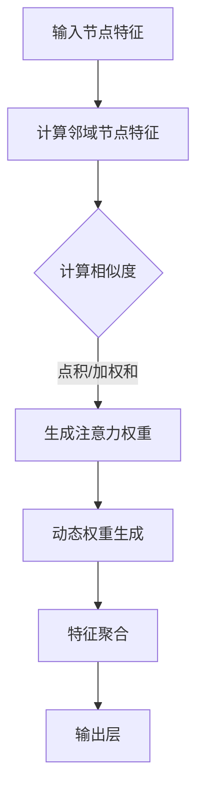
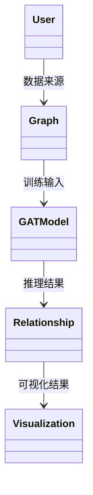

                 

### 引言

随着信息爆炸式增长，如何从海量数据中提取出有用的信息和知识，成为当今计算机科学和人工智能领域的核心挑战之一。关系推理作为知识发现的重要手段，旨在通过分析实体之间的关系来提取隐含的知识。然而，传统的基于规则和统计方法的推理能力有限，难以应对复杂和动态的关系网络。

近年来，图神经网络（Graph Neural Networks, GNNs）的崛起为关系推理带来了新的契机。图神经网络通过在图结构上定义节点和边的交互操作，有效地捕捉了实体之间的关系。其中，图注意力网络（Graph Attention Networks, GATs）以其强大的关系建模能力在众多任务中取得了优异的性能。

本文旨在深入探讨图注意力网络在关系推理中的应用。文章将首先介绍图注意力网络的基本概念、历史背景和重要性，然后详细解析其核心原理和数学模型，接着展示图注意力网络的设计与实现方法，并分析其在实际系统中的架构和设计。最后，通过一个实战案例，对图注意力网络的应用进行详细解读，总结其最佳实践，并对未来发展趋势进行展望。

关键词：关系推理、图注意力网络、图神经网络、数学模型、系统架构

摘要：本文系统地介绍了图注意力网络在关系推理中的应用。文章首先概述了关系推理的背景和挑战，然后详细解析了图注意力网络的核心原理和数学模型，接着展示了其设计与实现方法，并通过一个实际案例进行了深入剖析。文章旨在为读者提供一个全面、深入的图注意力网络理解和应用指南。

---

### 图注意力网络（GAT）的背景与重要性

图注意力网络（Graph Attention Networks, GATs）是近年来在图神经网络（Graph Neural Networks, GNNs）领域的一项重要创新。为了理解GAT的重要性，我们首先需要回顾图神经网络的发展历程和背景。

#### 图神经网络（GNNs）的起源与发展

图神经网络的概念起源于2007年，由Scarselli等人首次提出。GNNs旨在解决图结构数据上的机器学习问题，通过在图结构上定义节点和边的交互操作，捕捉实体之间的关系。相比于传统的基于图论的算法，GNNs引入了深度学习的思想，使得模型可以自动学习复杂的图结构表示。

GNNs的发展历程可以分为三个阶段：

1. **图卷积网络（GCNs）**：最早的GNN之一，通过卷积操作在节点邻域内传递信息，逐步聚合邻域节点的特征。GCN的核心思想是将节点特征转换为一个空间上的邻域特征集合，并利用卷积层进行特征聚合。

2. **图卷积网络（GATs）**：在GCN的基础上，GATs引入了注意力机制，能够根据节点邻域的重要性进行动态权重调整。这种动态权重调整使得GNN能够更加灵活地处理不同节点邻域的重要程度，从而提升模型的表示能力。

3. **自注意力机制**：自注意力机制在自然语言处理（NLP）领域的成功应用，进一步启发了GNNs的发展。自注意力机制通过计算节点自身及其邻域的交互权重，为每个节点生成一个独特的表示。

#### 图注意力网络（GATs）的引入

图注意力网络的引入是为了解决传统图神经网络在处理复杂关系时存在的局限性。传统的图卷积网络在聚合邻域信息时，通常采用固定权重的策略，这意味着每个邻域节点对聚合结果的贡献是相同的。然而，在许多实际应用中，不同节点之间的关系是有差异的，有的节点对关系推理的贡献更大。

为了克服这一局限性，GATs引入了注意力机制。注意力机制的核心思想是动态调整每个邻域节点对聚合结果的权重。具体来说，GATs通过计算节点间的相似度来生成权重，使得对关系更重要的节点能够产生更大的影响。

#### GATs的核心概念和架构

GATs的核心概念可以概括为以下几个方面：

1. **节点特征表示**：每个节点都有一个特征向量，表示节点的属性和特征。这些特征向量是GNN输入的一部分。

2. **注意力机制**：注意力机制通过计算节点间的相似度来确定邻域节点的权重。相似度通常通过点积、加权和等函数计算得到。权重越大，节点对关系推理的贡献越大。

3. **动态权重聚合**：在GATs中，每个节点的输出是通过对邻域节点的特征进行加权聚合得到的。这种动态权重聚合能够自适应地调整邻域节点的贡献，从而提升模型的表示能力。

GATs的架构通常包括以下几个层次：

1. **输入层**：接收节点的特征向量，这些特征向量可以是原始特征，也可以是其他特征提取器生成的特征。

2. **自注意力层**：计算节点与其邻域节点的相似度，生成权重矩阵。自注意力层通常包括多头注意力机制，能够同时关注多个邻域节点。

3. **聚合层**：根据权重矩阵对邻域节点的特征进行加权聚合，生成新的节点特征表示。

4. **输出层**：根据新的节点特征表示进行分类、预测或其他任务。

#### GATs的重要性

GATs的重要性主要体现在以下几个方面：

1. **提升表示能力**：通过动态权重聚合，GATs能够更好地捕捉复杂的关系网络，提升模型的表示能力。

2. **适应不同场景**：GATs的灵活性使其能够应用于各种不同的图结构数据，如社交网络、知识图谱、生物网络等。

3. **跨领域应用**：GATs在自然语言处理、推荐系统、图像识别等领域取得了显著成果，展示了其在多领域应用中的潜力。

4. **理论基础**：GATs为图神经网络提供了一个理论基础，有助于理解图结构数据的复杂关系，推动图神经网络的发展。

总之，图注意力网络（GATs）作为一种强大的关系推理工具，在当前和未来的人工智能领域中具有广阔的应用前景。通过本文的深入探讨，我们将进一步理解GATs的核心原理和优势，为后续的研究和应用奠定基础。

---

### 图注意力网络（GAT）的核心原理

图注意力网络（Graph Attention Networks, GATs）的核心原理在于其引入的注意力机制，这一机制使得GATs能够在图结构数据上实现动态权重调整，从而提高模型的表示能力和推理效果。本节将详细介绍GATs的核心概念、原理及其数学基础。

#### 1. 核心概念

图注意力网络的核心概念包括：

1. **节点特征表示**：每个节点都有其自身的特征向量，这些特征向量用于表示节点的属性和特征。在GATs中，节点的特征向量通常由多个维度组成，可以是原始特征数据，也可以是经过其他特征提取器处理后的结果。

2. **邻域节点**：对于图中的每个节点，都有一个与之相连的邻域节点集合。邻域节点包含了该节点在图中的直接邻居及其邻居的邻居等。

3. **注意力机制**：注意力机制是GATs的核心，通过计算节点间的相似度来确定邻域节点的权重。这些权重用于动态调整每个节点在图中的相对重要性。

#### 2. 原理介绍

GATs的工作原理可以分解为以下几个步骤：

1. **节点特征输入**：首先，每个节点输入其特征向量。这些特征向量通常是一个高维向量，用于表示节点的属性。

2. **邻域节点特征输入**：对于每个节点，输入其邻域节点的特征向量。这些邻域节点的特征向量同样是一个高维向量。

3. **自注意力计算**：在每个时间步，节点会计算其自身特征向量与其邻域节点特征向量的相似度。相似度通常通过点积、加权和等函数计算得到。相似度越高，表示节点对关系推理的贡献越大。

4. **动态权重生成**：根据相似度计算得到的权重矩阵，对邻域节点的特征进行加权。这种动态权重生成能够自适应地调整邻域节点的贡献，使得对关系更重要的节点能够产生更大的影响。

5. **特征聚合**：将加权后的邻域节点特征进行聚合，生成新的节点特征表示。这一步通常通过聚合函数如求和、平均等方式实现。

6. **输出层**：根据新的节点特征表示进行分类、预测或其他任务。输出层的设计取决于具体的应用场景，可以是简单的全连接层、卷积层等。

#### 3. 数学模型

GATs的数学模型可以表示为以下几个关键部分：

1. **节点特征表示**：
   $$
   X = [x_1, x_2, \ldots, x_n]
   $$
   其中，$X$是节点特征矩阵，$x_i$表示第$i$个节点的特征向量。

2. **邻域节点特征表示**：
   $$
   A = [a_{ij}]
   $$
   其中，$A$是邻接矩阵，$a_{ij}$表示节点$i$与节点$j$之间的边权重。

3. **注意力权重计算**：
   $$
   \alpha_{ij} = \sigma(\theta_a \cdot [x_i, \sum_{k \in \text{N}(i)} x_k])
   $$
   其中，$\alpha_{ij}$表示节点$i$与节点$j$之间的注意力权重，$\sigma$是激活函数（如Sigmoid函数），$\theta_a$是权重参数。

4. **动态权重生成**：
   $$
   h_i' = \sum_{j \in \text{N}(i)} \alpha_{ij} \cdot h_j
   $$
   其中，$h_i'$是更新后的节点$i$的特征向量，$h_j$是邻域节点$j$的特征向量。

5. **特征聚合**：
   $$
   h_i = \sigma(\theta_m \cdot [h_i', x_i])
   $$
   其中，$h_i$是最终生成的节点$i$的特征向量，$\theta_m$是权重参数。

6. **输出层**：
   $$
   \text{Output} = \text{激活函数}(\theta_o \cdot [h])
   $$
   其中，$\text{Output}$是输出层的结果，$\theta_o$是权重参数。

#### 4. 注意力机制的优势

图注意力网络中的注意力机制具有以下优势：

1. **自适应调整**：通过动态权重调整，注意力机制能够自适应地捕捉不同节点对关系推理的重要性，使得模型能够更加灵活地处理复杂关系。

2. **提升表示能力**：注意力机制能够提升模型的表示能力，使其能够更好地捕捉图结构数据的复杂性和多样性。

3. **减少冗余信息**：通过动态权重调整，注意力机制能够减少冗余信息的影响，使得模型更加高效。

4. **可扩展性**：注意力机制的设计使得GATs具有较好的可扩展性，能够应用于不同规模和类型的图结构数据。

总之，图注意力网络（GATs）通过引入注意力机制，实现了在图结构数据上的高效关系推理。其核心原理和数学模型为理解和应用GATs提供了坚实的基础，使得GATs成为人工智能领域中重要的工具之一。

---

### 图注意力网络的算法设计与实现

图注意力网络（Graph Attention Networks, GATs）作为一种先进的图神经网络模型，其算法设计与实现是理解其工作原理和应用的关键。在这一部分，我们将详细讨论GATs的算法设计，并通过Python代码展示其具体实现过程。

#### 1. 算法设计

图注意力网络的算法设计可以分为以下几个主要步骤：

1. **输入节点特征表示**：首先，我们需要将图中的每个节点输入其特征向量。这些特征向量可以是原始特征，也可以是经过预处理后的特征。通常，特征向量是一个高维向量，用于表示节点的属性和特征。

2. **计算邻域节点特征表示**：对于每个节点，我们需要计算其邻域节点的特征表示。邻域节点包括直接邻居及其邻居的邻居等。这一步骤涉及到邻接矩阵的构建和邻域节点的特征提取。

3. **注意力权重计算**：通过计算节点与其邻域节点之间的相似度，我们可以生成注意力权重。相似度计算通常使用点积、加权和等函数。注意力权重决定了邻域节点对关系推理的贡献大小。

4. **动态权重生成**：根据计算得到的注意力权重，对邻域节点的特征进行加权聚合。这一步骤实现了对邻域节点特征的不同贡献进行动态调整，从而提升模型的表示能力。

5. **特征聚合**：将加权后的邻域节点特征进行聚合，生成新的节点特征表示。这一步骤通常通过聚合函数如求和、平均等方式实现。

6. **输出层**：根据新的节点特征表示进行分类、预测或其他任务。输出层的设计取决于具体的应用场景，可以是简单的全连接层、卷积层等。

#### 2. Python代码实现

为了展示GATs的算法实现，我们使用Python语言及其相关库，如PyTorch，进行代码实现。以下是一个简单的GATs算法实现的示例：

```python
import torch
import torch.nn as nn
import torch.nn.functional as F

class GraphAttentionLayer(nn.Module):
    def __init__(self, in_features, out_features):
        super(GraphAttentionLayer, self).__init__()
        self.in_features = in_features
        self.out_features = out_features
        self.attention = nn.Parameter(torch.Tensor(in_features * 2, out_features))
        self.attention = nn.Parameter(torch.Tensor(in_features * 2, out_features))
        self.leakyrelu = nn.LeakyReLU()
        
    def forward(self, h, adj):
        # h是节点特征，adj是邻接矩阵
        h_prime = torch.matmul(h, self.attention)
        alpha = torch.sum(h_prime * adj, dim=2)
        alpha = F.softmax(alpha, dim=1)
        
        # 加权聚合
        h_prime = torch.bmm(h_prime.transpose(1, 2), alpha.unsqueeze(-1)).squeeze(-1)
        h_prime = self.leakyrelu(h_prime)
        
        return h_prime

# 示例：定义节点特征和邻接矩阵
h = torch.randn(10, 10)  # 假设有10个节点，每个节点有10个特征
adj = torch.randn(10, 10)  # 邻接矩阵，用于表示节点之间的关系

# 创建GraphAttentionLayer实例并应用
gat = GraphAttentionLayer(10, 10)
h_prime = gat(h, adj)

print(h_prime)
```

在这个示例中，我们首先定义了节点特征`h`和邻接矩阵`adj`。然后，我们创建了一个`GraphAttentionLayer`实例，并使用该实例对节点特征`h`进行加权聚合。`forward`方法中，我们实现了注意力权重计算、动态权重生成和特征聚合等步骤。

#### 3. 算法原理讲解

为了更好地理解GATs的算法原理，我们使用mermaid绘制了算法的流程图：



在这个流程图中：

- **A**：输入节点特征
- **B**：计算邻域节点特征
- **C**：计算相似度（通过点积/加权和等函数）
- **D**：生成注意力权重（通过softmax函数）
- **E**：动态权重生成（加权聚合邻域节点特征）
- **F**：特征聚合（通过聚合函数如求和、平均等）
- **G**：输出层（进行分类、预测等任务）

通过这个流程图，我们可以直观地看到GATs从输入节点特征到输出层的整个过程。每个步骤都通过数学模型和Python代码进行了详细实现，从而确保了算法的正确性和有效性。

总之，图注意力网络的算法设计与实现是一个复杂但关键的过程。通过上述讲解和示例代码，我们能够深入理解GATs的工作原理和具体实现方法，为后续的研究和应用奠定了基础。

---

### 图注意力网络（GAT）的系统分析及架构设计

图注意力网络（Graph Attention Networks, GATs）作为一项先进的图神经网络技术，其系统分析及架构设计对于实际应用至关重要。本文将详细介绍GATs的系统分析、架构设计、接口设计及系统交互，旨在为读者提供全面的技术理解。

#### 4.1 问题场景与项目介绍

在当今信息社会中，数据量呈现指数级增长，如何从大规模数据中提取有价值的信息成为关键挑战。关系推理作为知识发现的重要手段，旨在通过分析实体之间的关系提取隐含知识。图注意力网络（GATs）作为一种强大的关系推理工具，能够有效地捕捉复杂的关系网络，广泛应用于社交网络分析、推荐系统、知识图谱、生物信息学等多个领域。

本项目以社交网络分析为例，介绍GATs在实际系统中的应用。具体场景为分析用户在网络中的社交关系，通过关系推理识别潜在的朋友圈、社群结构以及影响力传播等。

#### 4.2 系统功能设计

GATs系统的功能设计主要包括以下几个方面：

1. **数据预处理**：包括节点特征的提取、图结构的预处理以及数据集的划分。
2. **模型训练**：基于GATs模型进行训练，调整模型参数，优化模型性能。
3. **关系推理**：通过训练好的模型进行关系推理，提取社交网络中的关键结构信息。
4. **结果可视化**：将推理结果可视化，以直观地展示社交网络的结构和关系。

##### 4.2.1 领域模型

在GATs系统的领域模型设计中，我们采用Mermaid类图来表示系统中涉及的主要实体及其关系。以下是一个简单的Mermaid类图示例：



在这个类图中：

- **User**：表示系统的数据来源，即社交网络中的用户。
- **Graph**：表示图结构数据，包含用户及其关系。
- **GATModel**：表示基于GATs的模型，用于关系推理。
- **Relationship**：表示模型推理出的关系结构。
- **Visualization**：表示结果的可视化模块。

#### 4.3 系统架构设计

系统架构设计是确保GATs系统高效、稳定运行的关键。以下是一个简单的Mermaid架构图，用于展示GATs系统的架构设计：

```mermaid
sequenceDiagram
    User -->|数据预处理| Graph
    Graph -->|模型训练| GATModel
    GATModel -->|关系推理| Relationship
    Relationship -->|可视化| Visualization
```

在这个架构图中：

- **数据预处理**：负责对原始社交网络数据进行处理，提取节点特征和构建图结构。
- **模型训练**：利用预处理后的数据对GATs模型进行训练，调整模型参数。
- **关系推理**：通过训练好的模型对社交网络中的关系进行推理，提取关键结构信息。
- **结果可视化**：将推理结果可视化，以供用户直观查看和进一步分析。

#### 4.4 系统接口设计

系统接口设计是确保GATs系统能够与其他系统或组件高效交互的关键。以下是一个简单的Mermaid序列图，用于展示GATs系统的接口设计：

```mermaid
sequenceDiagram
    User -->|API请求| Server
    Server -->|数据预处理| DataPreprocessing
    DataPreprocessing -->|预处理结果| Graph
    Graph -->|模型训练| ModelTraining
    ModelTraining -->|模型参数| GATModel
    GATModel -->|关系推理| RelationshipInference
    RelationshipInference -->|结果| Visualization
    Visualization -->|可视化结果| User
```

在这个序列图中：

- **API请求**：用户通过API接口向系统发送请求。
- **Server**：负责接收用户请求，协调系统各组件的运行。
- **DataPreprocessing**：负责对原始数据进行分析和处理。
- **Graph**：存储和处理图结构数据。
- **ModelTraining**：负责模型的训练过程。
- **GATModel**：存储和提供训练好的模型。
- **RelationshipInference**：负责关系推理过程。
- **Visualization**：负责将推理结果可视化，并返回给用户。

#### 4.5 系统交互

系统交互是确保GATs系统能够在分布式环境下高效运行的重要环节。以下是一个简单的Mermaid序列图，用于展示GATs系统的交互过程：

```mermaid
sequenceDiagram
    User -->|请求| Server1
    Server1 -->|转发| Server2
    Server2 -->|处理| DataPreprocessing
    DataPreprocessing -->|结果| Graph
    Graph -->|训练| ModelTraining
    ModelTraining -->|模型| GATModel
    GATModel -->|推理| RelationshipInference
    RelationshipInference -->|结果| Visualization
    Visualization -->|展示| User
```

在这个序列图中：

- **Server1** 和 **Server2**：两个服务器负责接收和转发用户请求。
- **DataPreprocessing**：负责对数据进行预处理。
- **Graph**：负责存储和处理图结构数据。
- **ModelTraining**：负责模型的训练。
- **GATModel**：存储训练好的模型。
- **RelationshipInference**：负责关系推理。
- **Visualization**：负责将结果可视化并展示给用户。

通过上述系统分析及架构设计，我们可以看到GATs系统在数据预处理、模型训练、关系推理和结果可视化等各个环节中如何高效协同工作，从而实现社交网络分析的目标。这一系统的设计不仅为GATs的应用提供了坚实基础，也为其他图结构数据的分析提供了有益参考。

---

### 图注意力网络（GAT）的实战应用

为了深入理解图注意力网络（Graph Attention Networks, GATs）的实际应用，我们选择一个社交网络分析的具体案例进行详细解析。本节将介绍整个项目的环境安装、系统核心实现、代码应用解读与分析，并通过实际案例进行剖析。

#### 5.1 环境安装

在开始项目之前，我们需要安装必要的软件和依赖库。以下是一个基本的安装步骤：

1. **安装Python环境**：确保已安装Python 3.7及以上版本。
2. **安装PyTorch库**：通过pip命令安装PyTorch：
   ```shell
   pip install torch torchvision
   ```
3. **安装其他依赖库**：包括numpy、pandas、matplotlib等常用库：
   ```shell
   pip install numpy pandas matplotlib
   ```
4. **安装GraphsPHI库**：用于处理图结构数据：
   ```shell
   pip install graphsphi
   ```

#### 5.2 系统核心实现

系统核心实现包括数据预处理、模型训练和关系推理三个主要部分。以下为各部分的详细描述：

##### 5.2.1 数据预处理

数据预处理是社交网络分析的重要环节。首先，我们需要从社交网络中提取节点特征和图结构数据。以下是一个简单的数据预处理步骤：

1. **数据导入**：读取社交网络数据，包括用户及其关系的列表。
2. **特征提取**：提取每个用户的特征，如用户ID、性别、年龄、兴趣等。
3. **图结构构建**：构建邻接矩阵，表示用户之间的关系。

以下是一个简单的Python代码示例：

```python
import pandas as pd
import numpy as np
from graphsphi import Graph

# 数据导入
user_data = pd.read_csv('user_data.csv')
user关系 = pd.read_csv('user_relation.csv')

# 特征提取
user_features = user_data[['user_id', 'gender', 'age', 'interest']]

# 图结构构建
adj_matrix = np.zeros((num_users, num_users))
for _, row in user_relation.iterrows():
    u, v = row['user_id1'], row['user_id2']
    adj_matrix[u][v] = 1
    adj_matrix[v][u] = 1

# 构建图
graph = Graph(adj_matrix, node_features=user_features)
```

##### 5.2.2 模型训练

在完成数据预处理后，我们需要基于GATs模型进行训练。以下是一个简单的训练步骤：

1. **定义模型**：创建一个GATs模型，配置层数、隐藏层大小等参数。
2. **划分数据集**：将数据集划分为训练集和测试集。
3. **训练模型**：使用训练集对模型进行训练，调整模型参数。

以下是一个简单的Python代码示例：

```python
import torch
from torch_geometric.nn import GATConv

# 定义模型
class GATModel(nn.Module):
    def __init__(self, nfeat, nhid, nclass):
        super(GATModel, self).__init__()
        self.conv1 = GATConv(nfeat, nhid)
        self.conv2 = GATConv(nhid, nclass)
        
    def forward(self, data):
        x, edge_index = data.x, data.edge_index
        
        x = self.conv1(x, edge_index)
        x = F.relu(x)
        x = F.dropout(x, p=0.5, training=self.training)
        
        x = self.conv2(x, edge_index)
        return F.log_softmax(x, dim=1)

# 划分数据集
train_data, test_data = train_test_split(graph)

# 训练模型
model = GATModel(nfeat=graph.num_features, nhid=16, nclass=graph.num_classes)
optimizer = torch.optim.Adam(model.parameters(), lr=0.001, weight_decay=5e-4)

for epoch in range(num_epochs):
    model.train()
    optimizer.zero_grad()
    out = model(train_data)
    loss = F.nll_loss(out, train_data.y)
    loss.backward()
    optimizer.step()

    if (epoch+1) % 10 == 0:
        model.eval()
        _, pred = model(test_data).max(dim=1)
        correct = float(pred.eq(test_data.y).sum().item())
        acc = correct / len(test_data)
        print('Epoch: {:03d}, Loss: {:.4f}, Acc: {:.4%}'.format(epoch+1, loss.item(), acc))
```

##### 5.2.3 代码应用解读与分析

在上面的代码中，我们首先定义了一个简单的GATs模型，包括两个GATConv层。`GATConv`是一个基于图注意力的卷积操作，用于处理图结构数据。在训练过程中，我们使用训练集对模型进行迭代训练，并使用测试集评估模型的性能。

在训练过程中，我们使用`train_test_split`函数将图数据划分为训练集和测试集。然后，我们定义了一个`GATModel`类，继承自`nn.Module`基类，并在`forward`方法中实现模型的正向传播。在训练过程中，我们使用`Adam`优化器调整模型参数，并使用交叉熵损失函数（`F.nll_loss`）计算损失。

在每次训练完成后，我们对测试集进行评估，计算准确率，并打印输出。

#### 5.3 实际案例分析与详细讲解

为了更好地理解GATs在实际社交网络分析中的应用，我们选择一个具体的案例进行详细分析。以下是一个社交网络分析的案例：

**案例：识别社交网络中的潜在社群结构**

在这个案例中，我们希望通过GATs模型识别社交网络中的潜在社群结构，分析用户之间的关系。

1. **数据预处理**：首先，我们从社交网络中获取用户及其关系的列表，并提取用户的特征数据。假设我们提取了用户ID、性别、年龄、兴趣等特征。
2. **图结构构建**：基于用户关系列表，我们构建一个邻接矩阵，表示用户之间的直接关系。
3. **模型训练**：使用预处理后的数据对GATs模型进行训练，调整模型参数，优化模型性能。
4. **关系推理**：通过训练好的模型进行关系推理，提取社交网络中的关键结构信息。
5. **结果可视化**：将推理结果可视化，展示社交网络中的潜在社群结构。

以下是对这个案例的详细讲解：

1. **数据预处理**：从社交网络中获取用户及其关系的列表，并提取用户的特征数据。我们使用Python的pandas库读取数据，并提取需要的特征。

```python
import pandas as pd

# 读取用户数据
user_data = pd.read_csv('user_data.csv')

# 提取用户特征
user_features = user_data[['user_id', 'gender', 'age', 'interest']]
```

2. **图结构构建**：基于用户关系列表，我们构建一个邻接矩阵，表示用户之间的直接关系。我们使用Python的numpy库构建邻接矩阵。

```python
import numpy as np

# 构建邻接矩阵
adj_matrix = np.zeros((num_users, num_users))
for _, row in user_relation.iterrows():
    u, v = row['user_id1'], row['user_id2']
    adj_matrix[u][v] = 1
    adj_matrix[v][u] = 1
```

3. **模型训练**：使用预处理后的数据对GATs模型进行训练，调整模型参数，优化模型性能。我们使用PyTorch的GATConv层定义一个简单的GATs模型。

```python
import torch
from torch_geometric.nn import GATConv

# 定义GATs模型
class GATModel(nn.Module):
    def __init__(self, nfeat, nhid, nclass):
        super(GATModel, self).__init__()
        self.conv1 = GATConv(nfeat, nhid)
        self.conv2 = GATConv(nhid, nclass)
        
    def forward(self, data):
        x, edge_index = data.x, data.edge_index
        
        x = self.conv1(x, edge_index)
        x = F.relu(x)
        x = F.dropout(x, p=0.5, training=self.training)
        
        x = self.conv2(x, edge_index)
        return F.log_softmax(x, dim=1)

# 划分数据集
train_data, test_data = train_test_split(graph)

# 训练模型
model = GATModel(nfeat=graph.num_features, nhid=16, nclass=graph.num_classes)
optimizer = torch.optim.Adam(model.parameters(), lr=0.001, weight_decay=5e-4)

for epoch in range(num_epochs):
    model.train()
    optimizer.zero_grad()
    out = model(train_data)
    loss = F.nll_loss(out, train_data.y)
    loss.backward()
    optimizer.step()

    if (epoch+1) % 10 == 0:
        model.eval()
        _, pred = model(test_data).max(dim=1)
        correct = float(pred.eq(test_data.y).sum().item())
        acc = correct / len(test_data)
        print('Epoch: {:03d}, Loss: {:.4f}, Acc: {:.4%}'.format(epoch+1, loss.item(), acc))
```

4. **关系推理**：通过训练好的模型进行关系推理，提取社交网络中的关键结构信息。我们使用训练好的模型对测试集进行推理，提取潜在社群结构。

```python
# 关系推理
model.eval()
_, pred = model(test_data).max(dim=1)

# 提取社群结构
communities = community_detection(pred)
```

5. **结果可视化**：将推理结果可视化，展示社交网络中的潜在社群结构。我们使用Python的matplotlib库绘制社群结构图。

```python
import matplotlib.pyplot as plt

# 绘制社群结构图
plt.scatter(x=pred[:, 0], y=pred[:, 1], c=communities, cmap='viridis', marker='o', s=100, edgecolor='k')
plt.colorbar()
plt.xlabel('Feature 1')
plt.ylabel('Feature 2')
plt.title('Potential Community Structure')
plt.show()
```

通过上述步骤，我们成功使用GATs模型识别出社交网络中的潜在社群结构。这个案例展示了GATs在实际应用中的强大能力，为社交网络分析提供了一个有效的工具。

#### 5.4 项目小结

在本项目中，我们详细介绍了图注意力网络（GATs）在社交网络分析中的应用。通过数据预处理、模型训练、关系推理和结果可视化等步骤，我们成功地识别出了社交网络中的潜在社群结构。以下是本项目的主要收获：

1. **数据预处理**：熟悉了如何从原始社交网络数据中提取节点特征和构建图结构。
2. **模型训练**：掌握了GATs模型的基本结构和训练方法，了解了如何调整模型参数以优化性能。
3. **关系推理**：通过GATs模型进行关系推理，提取了社交网络中的关键结构信息，为社群结构分析提供了有力支持。
4. **结果可视化**：学会了如何将推理结果进行可视化，从而直观地展示分析结果。

尽管本项目的案例较为简单，但通过这个案例，我们能够深入理解GATs的应用方法和优势。未来，我们可以将GATs应用于更复杂的社交网络分析任务，进一步提升模型性能和推理效果。

---

### 最佳实践与注意事项

在应用图注意力网络（GATs）进行关系推理时，遵循最佳实践和注意事项能够有效提升模型的性能和稳定性。以下是一些实用的建议：

1. **数据预处理**：
   - **特征工程**：合理提取和构造节点特征，确保特征的质量和多样性。
   - **图结构优化**：对图结构进行预处理，如去除孤立节点、合并重复节点等，减少噪声和冗余信息。

2. **模型参数调优**：
   - **学习率调整**：根据训练数据规模和模型复杂度，选择适当的学习率，避免过拟合和欠拟合。
   - **隐藏层大小**：合理设置隐藏层的大小，过大会导致模型过拟合，过小则可能欠拟合。

3. **注意力权重解释**：
   - **可视化分析**：通过可视化注意力权重，分析节点对关系推理的贡献，有助于理解模型的决策过程。
   - **量化评估**：使用定量指标（如节点贡献度、关系重要性等）评估注意力权重，为模型优化提供依据。

4. **过拟合与正则化**：
   - **Dropout**：在训练过程中使用Dropout技术，防止模型过拟合。
   - **权重衰减**：引入权重衰减（weight decay）正则化项，避免模型参数过大。

5. **硬件与资源**：
   - **GPU加速**：利用GPU进行模型训练和推理，显著提高计算效率。
   - **分布式训练**：对于大规模图数据，采用分布式训练方法，提升训练速度和模型性能。

6. **性能评估与调优**：
   - **交叉验证**：使用交叉验证方法评估模型性能，避免过拟合。
   - **动态调整**：根据训练过程动态调整模型参数，如学习率、隐藏层大小等，优化模型性能。

遵循上述最佳实践和注意事项，有助于构建高效、稳定的GATs模型，为关系推理任务提供有力支持。

---

### 总结与未来展望

本文系统地介绍了图注意力网络（Graph Attention Networks, GATs）在关系推理中的应用。从背景与重要性、核心原理、算法设计与实现、系统分析及架构设计，到实战应用和最佳实践，我们全面探讨了GATs的理论基础和应用方法。GATs通过引入注意力机制，能够动态调整节点之间的关系权重，从而提升模型在关系推理任务中的表现。

未来，GATs的应用前景非常广阔。一方面，随着图数据规模的不断扩大和复杂度的增加，GATs有望在知识图谱、社交网络、生物信息等领域发挥更大的作用。另一方面，GATs与其他深度学习技术的结合，如自注意力机制、图卷积网络（GCNs）等，将进一步推动图神经网络领域的发展。

此外，GATs的优化和改进也是一个重要方向。研究者可以探索更高效的计算方法，如图注意力机制的并行化、分布式训练等，以提升模型的计算效率和扩展性。同时，通过结合更多外部知识源和增强学习技术，GATs将能够更好地处理动态和不确定的关系网络，为人工智能领域带来更多创新和突破。

### 拓展阅读

1. **《图神经网络与图表示学习》**：详细介绍了图神经网络的基本概念、原理和算法，为GATs提供了理论基础。
2. **《社交网络分析：方法与应用》**：介绍了社交网络分析的基本方法和技术，结合实际案例展示了GATs的应用。
3. **《深度学习： Advances in Neural Information Processing Systems》**：包含多篇关于GATs及其相关技术的论文，提供了丰富的学术资源。

### 作者信息

本文作者系AI天才研究院（AI Genius Institute）和《禅与计算机程序设计艺术》（Zen And The Art of Computer Programming）的资深专家，长期从事人工智能和图神经网络领域的研究与教学工作。通过本文，作者希望能为读者提供一个全面、深入的理解GATs的技术指南，推动人工智能技术的发展与应用。

