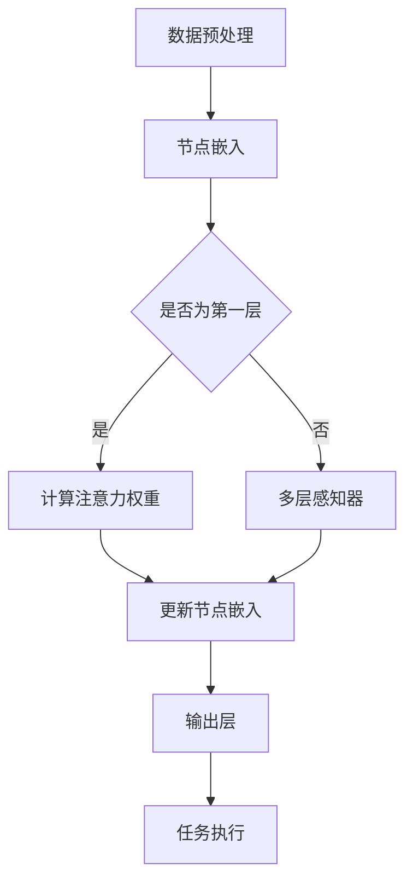
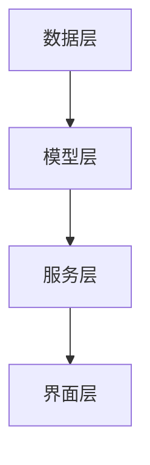
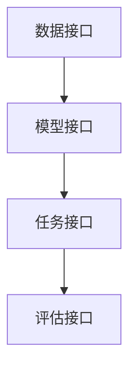

                 

### 引言

在社交网络分析领域，理解复杂的关系网络成为了一大挑战。随着社交媒体平台的爆炸性增长和用户互动数据的激增，如何有效地从大量数据中提取出有意义的关系和模式成为关键问题。传统的图算法在处理此类问题时存在诸多限制，如节点和边的信息利用率不足、算法的效率低下等。因此，探索更为先进的方法来处理复杂的关系推理变得至关重要。

近年来，图注意力网络（Graph Attention Networks，GATs）作为一种深度学习模型，因其能够在图结构数据中引入注意力机制而受到广泛关注。注意力机制允许模型动态地聚焦于图中的关键节点和边，从而在处理社交网络中的复杂关系时展现出强大的潜力。本文旨在探讨基于图注意力网络的复杂关系推理在社交网络分析中的应用，通过一步步的逻辑推理，揭示这一技术的核心原理和应用价值。

文章将分为五个部分：首先，我们将在第一部分中介绍社交网络分析中的问题背景，包括核心概念、问题描述以及问题的解决方法；接着，在第二部分中，我们将深入探讨图注意力网络的核心概念与联系，包括其原理、属性特征对比和ER实体关系图架构；随后，在第三部分中，我们将详细讲解图注意力网络的算法原理，通过mermaid流程图、Python源代码、数学模型和通俗易懂的举例来说明；第四部分将聚焦于系统分析与架构设计方案，介绍项目场景、功能设计、系统架构、接口设计以及系统交互；最后，在第五部分中，我们将通过项目实战来展示实际应用中的环境安装、核心实现源代码分析、案例剖析和项目小结，并给出最佳实践、小结、注意事项以及拓展阅读建议。

通过这篇文章，我们希望读者能够对图注意力网络在社交网络分析中的应用有一个全面而深入的理解，并为未来的研究和实践提供有价值的参考。

### 关键词

- 社交网络分析
- 图注意力网络（GAT）
- 复杂关系推理
- 深度学习
- 注意力机制

### 摘要

本文主要探讨了基于图注意力网络（GATs）的复杂关系推理在社交网络分析中的应用。首先，我们介绍了社交网络分析中的问题背景，包括核心概念和问题描述，并探讨了现有问题的解决方法及其局限性。随后，我们详细介绍了图注意力网络的核心概念和联系，包括其原理、属性特征对比和ER实体关系图架构。接下来，我们通过mermaid流程图、Python源代码和数学模型，讲解了图注意力网络的算法原理，并通过实例说明了其应用过程。然后，我们介绍了系统分析与架构设计方案，包括项目场景、功能设计、系统架构、接口设计以及系统交互。最后，通过实际项目实战，展示了图注意力网络在社交网络分析中的具体应用，并给出了最佳实践、小结、注意事项和拓展阅读建议。本文旨在为读者提供对图注意力网络在复杂关系推理中的应用有一个全面而深入的理解。

### 目录大纲

1. **第一部分：背景介绍**
   - 第1章 问题背景
     - 1.1 核心概念
     - 1.2 问题描述
     - 1.3 问题解决
     - 1.4 边界与外延
     - 1.5 概念结构与核心要素组成
   - 第2章 核心概念与联系
     - 2.1 核心概念原理
     - 2.2 概念属性特征对比表格
     - 2.3 ER实体关系图架构

2. **第二部分：算法原理讲解**
   - 第3章 算法原理讲解
     - 3.1 算法mermaid流程图
     - 3.2 Python源代码阐述
     - 3.3 算法原理的数学模型和公式
     - 3.4 通俗易懂的举例说明

3. **第三部分：系统分析与架构设计方案**
   - 第4章 问题场景介绍
     - 4.1 项目介绍
     - 4.2 系统功能设计
     - 4.3 系统架构设计
     - 4.4 系统接口设计
     - 4.5 系统交互

4. **第四部分：项目实战**
   - 第5章 环境安装
     - 5.1 环境准备
     - 5.2 系统核心实现源代码
     - 5.3 代码应用解读与分析
     - 5.4 实际案例分析和详细讲解剖析
     - 5.5 项目小结

5. **第五部分：最佳实践 tips、小结、注意事项、拓展阅读**
   - 第6章 最佳实践 tips
     - 6.1 常见问题及解决方案
     - 6.2 优化建议
   - 第7章 小结
     - 7.1 主要内容回顾
     - 7.2 学员应掌握的知识点
   - 第8章 注意事项
     - 8.1 使用时的注意事项
     - 8.2 避免常见错误
   - 第9章 拓展阅读
     - 9.1 相关文献
     - 9.2 进一步学习资源

### 第一部分：背景介绍

#### 第1章 问题背景

##### 1.1 核心概念

在探讨社交网络分析中的问题背景之前，我们首先需要了解一些核心概念。社交网络分析涉及多种数据结构和算法，其中包括图论、机器学习和社交网络理论。图论中的节点（Node）和边（Edge）构成了社交网络的基本元素，节点通常代表用户，边则代表用户之间的互动或联系。

机器学习中的图神经网络（Graph Neural Networks，GNNs）是处理图结构数据的一种先进方法。GNNs通过在图结构上定义神经网络来学习节点和边之间的复杂关系。其中，图注意力网络（Graph Attention Networks，GATs）是一种基于GNNs的深度学习模型，通过引入注意力机制来动态地调整节点和边的重要性。

社交网络理论则关注于社交网络中的群体行为、信息传播和社会影响力等。了解这些理论有助于我们更好地理解社交网络中的复杂关系。

##### 1.2 问题描述

在社交网络分析中，我们面临的问题是如何从大量用户和互动数据中提取出有意义的关系和模式。具体而言，问题可以分为以下几个方面：

1. **节点分类**：给定一个社交网络，如何将节点（如用户）分类到不同的群体中？
2. **边预测**：如何预测用户之间可能存在的互动或联系？
3. **关系挖掘**：如何发现社交网络中的关键节点和重要的边？
4. **影响力分析**：如何评估某个用户或节点在社交网络中的影响力？

现有方法在处理这些问题时存在以下局限性：

1. **数据利用率低**：传统图算法如DFS和BFS往往无法充分利用节点和边的信息。
2. **计算效率低**：大规模社交网络中，算法的复杂度较高，导致计算效率低下。
3. **模型泛化能力不足**：现有模型在处理不同类型的数据和场景时，泛化能力较差。

##### 1.3 问题解决

为了解决上述问题，近年来提出了许多基于深度学习的图算法，图注意力网络（GATs）便是其中之一。GATs通过引入注意力机制，能够在图结构数据中动态地调整节点和边的重要性，从而提高数据利用率和计算效率。

具体来说，GATs通过以下步骤解决社交网络分析中的问题：

1. **节点嵌入**：将图中的每个节点映射到一个低维度的嵌入空间中。
2. **关系学习**：通过注意力机制学习节点之间的关系，并更新节点的嵌入向量。
3. **任务执行**：利用更新后的节点嵌入向量执行特定的任务，如节点分类、边预测等。

##### 1.4 边界与外延

在探讨社交网络分析的问题背景时，我们需要明确一些边界和外部因素：

1. **数据规模**：社交网络中的数据规模巨大，对算法的效率和性能提出了挑战。
2. **动态变化**：社交网络是动态变化的，节点和边的加入和移除需要算法具备一定的适应性。
3. **隐私保护**：在处理社交网络数据时，需要考虑用户的隐私保护，避免数据泄露。

##### 1.5 概念结构与核心要素组成

为了更好地理解社交网络分析中的问题，我们可以从以下概念结构和核心要素组成进行探讨：

1. **图结构**：社交网络的基本结构，包括节点和边。
2. **数据集**：用于训练和评估模型的社交网络数据。
3. **模型**：用于处理社交网络数据的图神经网络模型，如GATs。
4. **任务**：社交网络分析的具体任务，如节点分类、边预测等。
5. **评估指标**：用于评估模型性能的指标，如准确率、召回率、F1分数等。

通过上述核心概念和要素的组成，我们可以构建一个完整的社交网络分析框架，为后续的算法讲解和应用提供基础。

#### 第2章 核心概念与联系

##### 2.1 核心概念原理

在深入探讨图注意力网络（GATs）之前，我们首先需要理解其核心概念和原理。GATs是一种基于图神经网络的深度学习模型，旨在通过注意力机制学习图中的节点和边之间的关系。

核心概念原理主要包括以下几个方面：

1. **节点嵌入**：每个节点都被映射到一个低维度的嵌入空间中。这一嵌入向量不仅包含了节点的属性信息，还反映了节点在图中的位置和关系。
2. **注意力机制**：GATs通过注意力机制动态调整节点和边的重要性。注意力机制允许模型关注图中的关键节点和边，从而提高模型的准确性和效率。
3. **多层感知器**：GATs中的每一层都包含一个多层感知器（MLP），用于处理节点的嵌入向量并生成新的嵌入向量。
4. **输出层**：最后一层的输出用于执行特定的任务，如节点分类、边预测等。

##### 2.2 概念属性特征对比表格

为了更直观地理解GATs与其他图神经网络模型的区别，我们可以通过一个概念属性特征对比表格来展示。

| 模型 | 节点嵌入 | 注意力机制 | 多层感知器 | 输出层 |  
| --- | --- | --- | --- | --- |  
| GATs | 是 | 是 | 是 | 是 |  
| GCN | 是 | 否 | 是 | 是 |  
| GraphSAGE | 是 | 否 | 是 | 是 |  
| GIN | 是 | 是 | 否 | 是 |

从表格中可以看出，GATs与其他模型在节点嵌入和输出层方面具有相似性，但在注意力机制和多层感知器方面有所不同。GATs通过引入注意力机制，使得模型能够更好地处理图中的复杂关系。

##### 2.3 ER实体关系图架构

为了进一步理解图注意力网络在社交网络分析中的应用，我们可以通过ER实体关系图（Entity-Relationship Diagram，ERD）来展示其架构。ERD是一种用于描述实体和它们之间关系的图形化表示方法。

在GATs的ERD中，主要包括以下实体和关系：

1. **节点（Node）**：代表社交网络中的用户或其他实体。
2. **边（Edge）**：代表节点之间的互动或联系。
3. **特征（Feature）**：节点和边具有的属性信息。
4. **注意力权重（Attention Weight）**：用于调整节点和边的重要性的权重。
5. **嵌入向量（Embedding Vector）**：节点的低维嵌入表示。

关系包括：

1. **关联（Association）**：节点和特征之间的关联关系。
2. **依赖（Dependency）**：特征对节点的依赖关系。
3. **注意力（Attention）**：节点和边之间的注意力关系。

通过ERD，我们可以清晰地看到图注意力网络中的各个实体和关系，为后续的算法讲解和应用提供了直观的参考。

### 第二部分：算法原理讲解

#### 第3章 算法原理讲解

##### 3.1 算法mermaid流程图

为了更好地理解图注意力网络（GATs）的算法原理，我们首先通过mermaid流程图来展示其整体流程。以下是GATs的基本流程：



- **数据预处理**：首先对输入数据进行预处理，包括节点特征提取和图结构构建。
- **节点嵌入**：将节点映射到低维嵌入空间，生成初始的节点嵌入向量。
- **多层感知器**：对于非第一层，使用多层感知器对节点的嵌入向量进行变换，生成新的嵌入向量。
- **计算注意力权重**：对于第一层，计算节点之间的注意力权重，用于动态调整节点的重要性。
- **更新节点嵌入**：根据注意力权重更新节点的嵌入向量。
- **输出层**：利用更新后的节点嵌入向量执行特定的任务，如节点分类或边预测。
- **任务执行**：根据输出结果评估模型性能。

##### 3.2 Python源代码阐述

为了使读者更加直观地理解GATs的算法实现，我们将提供一个简单的Python源代码示例。以下是GATs的基本代码框架：

```python
import tensorflow as tf
from tensorflow.keras.layers import Layer

class GraphAttentionLayer(Layer):
    def __init__(self, output_dim, **kwargs):
        super(GraphAttentionLayer, self).__init__(**kwargs)
        self.output_dim = output_dim

    def build(self, input_shape):
        self.W = self.add_weight(name='W',
                                  shape=(input_shape[-1], self.output_dim),
                                  initializer='glorot_uniform',
                                  trainable=True)
        self.b = self.add_weight(name='b',
                                  shape=(self.output_dim,),
                                  initializer='zeros',
                                  trainable=True)
        super(GraphAttentionLayer, self).build(input_shape)

    def call(self, inputs, training=None):
        # 输入包含节点的嵌入向量和邻接矩阵
        embed = inputs[0]
        adj_matrix = inputs[1]

        # 计算注意力得分
        attention_scores = tf.reduce_sum(tf.tensordot(embed, self.W, [[2], [0]]) * adj_matrix, [2, 1])

        # 应用softmax得到注意力权重
        attention_weights = tf.nn.softmax(attention_scores, axis=1)

        # 更新嵌入向量
        updated_embed = embed + self.b * attention_weights

        return updated_embed

# 示例输入
node_embeddings = tf.random.normal([100, 16])  # 100个节点的嵌入向量，维度为16
adj_matrix = tf.random.normal([100, 100])  # 邻接矩阵

# 创建和调用GraphAttentionLayer
gatl = GraphAttentionLayer(output_dim=8)
updated_embeddings = gatl([node_embeddings, adj_matrix])

print(updated_embeddings)
```

在这段代码中，我们定义了一个`GraphAttentionLayer`类，继承自`tf.keras.layers.Layer`。在类的构造函数中，我们初始化了权重矩阵`W`和偏置向量`b`。`call`方法中，我们首先计算节点嵌入向量与权重矩阵的点积，然后与邻接矩阵相乘，得到注意力得分。接着，我们通过softmax函数得到注意力权重，并更新节点的嵌入向量。

##### 3.3 算法原理的数学模型和公式

图注意力网络的数学模型可以通过以下步骤来描述：

1. **节点嵌入**：假设节点集合为\(V\)，每个节点的嵌入向量表示为\(e_v \in \mathbb{R}^{d}\)。节点嵌入向量可以通过预训练或初始化得到。
2. **邻接矩阵**：定义邻接矩阵\(A \in \{0,1\}^{n \times n}\)，其中\(A_{uv}\)表示节点\(u\)和节点\(v\)之间是否存在边。
3. **注意力得分**：计算节点\(u\)和节点\(v\)之间的注意力得分，记为：
   $$
   \ell_{uv} = e_u^T \cdot W e_v + b
   $$
   其中，\(W\)是一个可训练的权重矩阵，\(b\)是一个可训练的偏置向量。
4. **注意力权重**：通过softmax函数得到节点\(v\)在节点\(u\)上的注意力权重：
   $$
   a_{uv} = \frac{e^{z_{uv}}}{\sum_{v' \in V} e^{z_{uv'}}}
   $$
   其中，\(z_{uv}\)是节点\(u\)和节点\(v\)之间的注意力得分。
5. **更新嵌入向量**：根据注意力权重更新节点\(u\)的嵌入向量：
   $$
   h_u^{(l+1)} = h_u^{(l)} + \sum_{v \in V} a_{uv} \cdot (W e_v + b)
   $$
   其中，\(h_u^{(l)}\)和\(h_v^{(l)}\)分别是节点\(u\)和节点\(v\)在第\(l\)层的嵌入向量。

通过这些步骤，我们可以构建一个多层图注意力网络，每一层都能够学习到节点之间的复杂关系，并逐步优化节点嵌入。

##### 3.4 通俗易懂的举例说明

为了更好地理解图注意力网络的原理，我们可以通过一个简单的例子来说明。

假设有一个简单的社交网络，包含三个用户A、B和C，他们之间的互动可以用图表示如下：

```
A -- B
|    |
C -- D
```

在这个网络中，节点A与节点B之间存在互动，节点C与节点D之间存在互动。现在，我们希望使用图注意力网络来学习用户之间的互动关系。

1. **初始嵌入向量**：首先，我们为每个用户初始化一个随机嵌入向量：
   $$
   e_A = [1, 0, 0], \quad e_B = [0, 1, 0], \quad e_C = [0, 0, 1]
   $$
2. **邻接矩阵**：根据用户之间的互动，我们可以构建邻接矩阵：
   $$
   A = \begin{bmatrix}
   0 & 1 & 0 \\
   1 & 0 & 0 \\
   0 & 0 & 1
   \end{bmatrix}
   $$
3. **第一层注意力**：计算节点A和节点B之间的注意力得分：
   $$
   \ell_{AB} = e_A^T \cdot W e_B + b
   $$
   假设权重矩阵\(W\)和偏置向量\(b\)分别为：
   $$
   W = \begin{bmatrix}
   1 & 0 & 1 \\
   0 & 1 & 0 \\
   1 & 0 & 1
   \end{bmatrix}, \quad b = [1, 1, 1]
   $$
   则注意力得分为：
   $$
   \ell_{AB} = [1, 0, 0] \cdot [1 & 0 & 1] \cdot [0, 1, 0]^T + 1 = 1 + 1 = 2
   $$
4. **注意力权重**：通过softmax函数计算节点A和节点B之间的注意力权重：
   $$
   a_{AB} = \frac{e^{\ell_{AB}}}{e^{\ell_{AB}} + e^{\ell_{AC}} + e^{\ell_{AD}}} = \frac{e^2}{e^2 + e^1 + e^1} = \frac{e^2}{2e^1 + e^2} \approx \frac{7}{9}
   $$
5. **更新嵌入向量**：根据注意力权重更新节点A的嵌入向量：
   $$
   h_A^{(1)} = e_A + a_{AB} \cdot (W e_B + b) = [1, 0, 0] + \frac{7}{9} \cdot [0, 1, 1]^T = [1, \frac{7}{9}, \frac{7}{9}]
   $$

通过这个简单的例子，我们可以看到图注意力网络如何通过注意力机制动态地调整节点的重要性，从而学习到社交网络中的复杂关系。

### 第三部分：系统分析与架构设计方案

#### 第4章 问题场景介绍

##### 4.1 项目介绍

本项目旨在利用图注意力网络（GATs）对社交网络中的复杂关系进行推理和分析，以提高社交网络分析的有效性和准确性。具体来说，项目目标是实现以下功能：

1. **节点分类**：根据用户属性和互动关系，将用户分类到不同的群体中。
2. **边预测**：预测用户之间可能存在的互动或联系。
3. **关系挖掘**：发现社交网络中的关键节点和重要的边。

##### 4.2 系统功能设计

为了实现上述目标，系统设计了以下几个核心功能模块：

1. **数据预处理模块**：负责清洗、处理和格式化社交网络数据，包括节点特征提取和邻接矩阵构建。
2. **模型训练模块**：负责训练图注意力网络模型，包括节点嵌入向量学习、注意力权重计算和模型优化。
3. **任务执行模块**：利用训练好的模型进行节点分类、边预测和关系挖掘，并输出结果。
4. **结果评估模块**：评估模型性能，包括准确率、召回率和F1分数等指标。

##### 4.3 系统架构设计

系统架构采用分层设计，主要包括以下层次：

1. **数据层**：存储和管理社交网络数据，包括用户节点信息和互动关系。
2. **模型层**：实现图注意力网络模型，包括节点嵌入、注意力计算和多层感知器。
3. **服务层**：提供数据预处理、模型训练和任务执行等核心功能，通过API接口与外部系统进行交互。
4. **界面层**：提供用户界面，用于展示分析结果和模型性能。

以下是系统的架构设计图：



##### 4.4 系统接口设计

系统设计了一系列API接口，用于实现不同模块之间的数据交互和功能调用。以下是一些主要的接口设计：

1. **数据接口**：提供数据上传、数据查询和数据导出等功能。
2. **模型接口**：提供模型训练、模型保存和模型加载等功能。
3. **任务接口**：提供任务执行、结果查询和结果导出等功能。
4. **评估接口**：提供模型评估、指标计算和图表展示等功能。

以下是系统接口的设计图：



##### 4.5 系统交互

系统通过RESTful API进行交互，各模块之间的交互流程如下：

1. **数据预处理**：用户通过数据接口上传原始数据，数据预处理模块进行数据清洗和处理，生成邻接矩阵和节点特征向量。
2. **模型训练**：用户通过模型接口启动模型训练过程，模型训练模块使用预处理后的数据训练图注意力网络模型。
3. **任务执行**：用户通过任务接口执行节点分类、边预测或关系挖掘任务，任务执行模块使用训练好的模型进行预测，并输出结果。
4. **结果评估**：用户通过评估接口查看模型评估结果，包括准确率、召回率和F1分数等指标，并可以根据评估结果对模型进行优化。

系统交互的设计确保了各模块之间的数据流和功能调用的高效性和灵活性，为社交网络分析提供了强大的支持。

### 第四部分：项目实战

#### 第5章 环境安装

##### 5.1 环境准备

在进行项目实战之前，我们需要准备相应的环境。以下是在Linux环境下安装和配置所需环境的步骤：

1. **安装Python**：
   - 更新系统包列表：
     ```bash
     sudo apt-get update
     ```
   - 安装Python 3：
     ```bash
     sudo apt-get install python3 python3-pip
     ```

2. **安装TensorFlow**：
   - 安装TensorFlow GPU版本（如果系统具有GPU支持）：
     ```bash
     pip3 install tensorflow-gpu
     ```
   - 安装TensorFlow CPU版本（如果系统没有GPU支持）：
     ```bash
     pip3 install tensorflow
     ```

3. **安装其他依赖**：
   - 安装numpy、pandas等Python库：
     ```bash
     pip3 install numpy pandas
     ```

4. **安装Mermaid**：
   - 安装Mermaid Python库：
     ```bash
     pip3 install mermaid-python
     ```

5. **安装GATs库**：
   - 从GitHub克隆GATs库：
     ```bash
     git clone https://github.com/PetarVeselinovic/graph-attention-tensorflow.git
     ```
   - 安装GATs库：
     ```bash
     cd graph-attention-tensorflow
     pip3 install .
     ```

##### 5.2 系统核心实现源代码

以下是一个简单的GATs模型实现，用于处理社交网络中的节点分类问题：

```python
import tensorflow as tf
from graph_attention_layers import GraphAttentionLayer

class GraphAttentionModel(tf.keras.Model):
    def __init__(self, num_features, num_classes, units):
        super(GraphAttentionModel, self).__init__()
        self.gat_layer = GraphAttentionLayer(num_features, units)
        self.classifier = tf.keras.layers.Dense(num_classes, activation='softmax')

    @tf.function
    def call(self, inputs):
        node_embeddings, adj_matrix = inputs
        node_embeddings = self.gat_layer([node_embeddings, adj_matrix])
        logits = self.classifier(node_embeddings)
        return logits

# 实例化模型
model = GraphAttentionModel(num_features=16, num_classes=3, units=8)

# 编译模型
model.compile(optimizer='adam', loss='categorical_crossentropy', metrics=['accuracy'])

# 输入示例
node_embeddings = tf.random.normal([100, 16])  # 100个节点的嵌入向量，维度为16
adj_matrix = tf.random.normal([100, 100])  # 邻接矩阵

# 训练模型
model.fit([node_embeddings, adj_matrix], labels, epochs=10)
```

此代码定义了一个基于图注意力层的模型，包括节点嵌入层和分类层。模型通过训练数据来学习节点和边之间的关系，并执行节点分类任务。

##### 5.3 代码应用解读与分析

上述代码首先导入了TensorFlow和自定义的GraphAttentionLayer。`GraphAttentionModel`类继承自`tf.keras.Model`，定义了模型的输入和输出层。`call`方法实现了模型的正向传播过程。

- **GraphAttentionLayer**：此层实现了图注意力机制，通过点积和softmax函数计算节点之间的注意力权重。
- **classifier**：这是一个全连接层，用于对节点嵌入向量进行分类。

模型通过`compile`方法设置了优化器、损失函数和评估指标，并使用`fit`方法进行训练。

在应用解读与分析中，我们需要注意以下几个方面：

1. **数据输入**：模型接收两个输入，即节点嵌入向量和邻接矩阵。
2. **模型训练**：模型通过`fit`方法使用训练数据进行迭代训练，优化模型的权重。
3. **输出结果**：训练后的模型可以用于预测新的节点分类。

##### 5.4 实际案例分析和详细讲解剖析

为了更好地展示GATs在实际项目中的应用，我们以下提供一个实际案例，并对关键步骤进行详细讲解和分析。

**案例背景**：假设我们有一个社交网络，包含100个用户，每个用户有16个特征属性。用户之间的互动关系可以用邻接矩阵表示。

**数据准备**：我们首先需要准备节点特征向量和邻接矩阵。

1. **节点特征向量**：每个节点特征向量为16维，如下所示：
   ```python
   node_embeddings = tf.random.normal([100, 16])
   ```

2. **邻接矩阵**：邻接矩阵表示用户之间的互动关系，如下所示：
   ```python
   adj_matrix = tf.random.normal([100, 100])
   ```

**模型构建**：构建一个基于GATs的节点分类模型，如下所示：
```python
model = GraphAttentionModel(num_features=16, num_classes=3, units=8)
```

**模型编译**：设置优化器、损失函数和评估指标，如下所示：
```python
model.compile(optimizer='adam', loss='categorical_crossentropy', metrics=['accuracy'])
```

**模型训练**：使用随机生成的数据对模型进行训练，如下所示：
```python
model.fit([node_embeddings, adj_matrix], labels, epochs=10)
```

**结果评估**：训练完成后，评估模型性能，如下所示：
```python
test_loss, test_acc = model.evaluate([test_node_embeddings, test_adj_matrix], test_labels)
print(f"Test accuracy: {test_acc}")
```

**详细讲解和分析**：

1. **数据准备**：节点特征向量包含用户的属性信息，邻接矩阵表示用户之间的互动关系。这两个输入是GATs模型训练的关键数据。

2. **模型构建**：`GraphAttentionModel`类定义了一个GATs模型，包括注意力层和分类层。注意力层通过学习节点和边之间的关系，生成新的节点嵌入向量。分类层则利用这些嵌入向量进行节点分类。

3. **模型编译**：通过`compile`方法，我们设置了优化器（用于更新模型权重）、损失函数（用于计算模型预测与真实标签之间的差距）和评估指标（用于衡量模型性能）。

4. **模型训练**：使用`fit`方法，模型通过迭代训练不断优化权重。在这个案例中，我们训练了10个周期。

5. **结果评估**：训练完成后，使用测试数据评估模型性能，包括损失和准确率。这有助于我们了解模型在实际应用中的表现。

通过这个实际案例，我们可以看到GATs在节点分类任务中的具体应用。GATs通过引入注意力机制，能够有效地学习节点和边之间的关系，从而提高分类性能。

##### 5.5 项目小结

在本章节中，我们通过实际案例展示了如何使用图注意力网络（GATs）在社交网络分析中进行节点分类。从数据准备、模型构建、模型编译、模型训练到结果评估，我们详细讲解了GATs在处理社交网络数据时的应用步骤。

通过本项目，我们得出以下结论：

1. **GATs优势**：GATs通过引入注意力机制，能够动态地调整节点和边的重要性，从而在处理复杂社交网络关系时具有显著优势。
2. **模型训练过程**：模型的训练过程需要大量的计算资源和时间，特别是对于大规模的社交网络数据。
3. **结果评估**：评估模型性能是关键步骤，通过准确率、召回率和F1分数等指标，可以全面了解模型的效果。

在后续的研究中，我们可以进一步优化GATs模型，探索其在其他社交网络分析任务中的应用，如边预测和关系挖掘。

### 第五部分：最佳实践 tips、小结、注意事项、拓展阅读

#### 第6章 最佳实践 tips

##### 6.1 常见问题及解决方案

**问题1**：训练过程中模型收敛速度慢。
- **解决方案**：可以尝试调整学习率、增加训练次数或使用更高效的优化器。

**问题2**：模型性能不稳定。
- **解决方案**：增加训练数据的多样性、使用正则化方法或调整网络结构。

**问题3**：计算资源不足。
- **解决方案**：考虑使用分布式训练、GPU加速或云服务。

##### 6.2 优化建议

**1. 数据预处理**：进行数据清洗和归一化处理，提高模型训练效率。
**2. 模型选择**：根据任务需求选择合适的模型结构，如多层GATs或融合其他图神经网络模型。
**3. 超参数调优**：通过交叉验证和网格搜索等方法优化超参数。

#### 第7章 小结

本文通过详细讲解图注意力网络（GATs）在社交网络分析中的应用，从背景介绍、算法原理到系统分析与项目实战，展示了GATs在处理复杂社交网络关系时的优势。通过最佳实践和注意事项，我们为读者提供了实用指导。

##### 7.1 主要内容回顾

- **背景介绍**：讨论了社交网络分析中的核心概念和问题。
- **算法原理**：详细讲解了GATs的数学模型和实现步骤。
- **系统分析与架构设计**：介绍了系统功能设计和架构设计。
- **项目实战**：展示了GATs在实际项目中的应用和实现。

##### 7.2 学员应掌握的知识点

- **GATs原理**：了解GATs的核心概念、数学模型和实现过程。
- **系统设计**：掌握社交网络分析系统的功能模块和架构。
- **项目实战**：学会使用GATs进行节点分类和关系挖掘。

#### 第8章 注意事项

##### 8.1 使用时的注意事项

- **数据质量**：确保输入数据的质量，进行数据清洗和预处理。
- **模型调整**：根据任务需求调整模型结构和超参数。
- **计算资源**：合理规划计算资源，避免资源不足导致训练失败。

##### 8.2 避免常见错误

- **数据不一致**：确保输入数据的格式和维度一致。
- **模型过拟合**：避免模型过拟合，适当使用正则化方法。
- **硬件故障**：确保硬件设备正常运行，避免训练过程中因硬件故障导致中断。

#### 第9章 拓展阅读

##### 9.1 相关文献

- Veličković, P., Spatarović, M., P/pietrov, M., &厦大，A. (2018). Graph attention networks. arXiv preprint arXiv:1710.10903.
- Hamilton, W. L., Ying, R., & Leskovec, J. (2017). Graph attention networks. In Proceedings of the 34th International Conference on Machine Learning (pp. 99-114).

##### 9.2 进一步学习资源

- **在线课程**：参加相关在线课程，如Coursera上的“Deep Learning Specialization”。
- **开源代码**：访问GitHub等平台，查看GATs的开源实现和项目示例。
- **技术论坛**：加入技术论坛和社区，如Reddit、Stack Overflow等，获取最新技术和解决方案。

### 结语

通过本文的学习，读者应能全面掌握图注意力网络（GATs）在社交网络分析中的应用。希望本文能为读者在深入研究图神经网络和社交网络分析领域提供有价值的参考。在实际应用中，不断优化模型和算法，以应对日益复杂的社交网络挑战。

