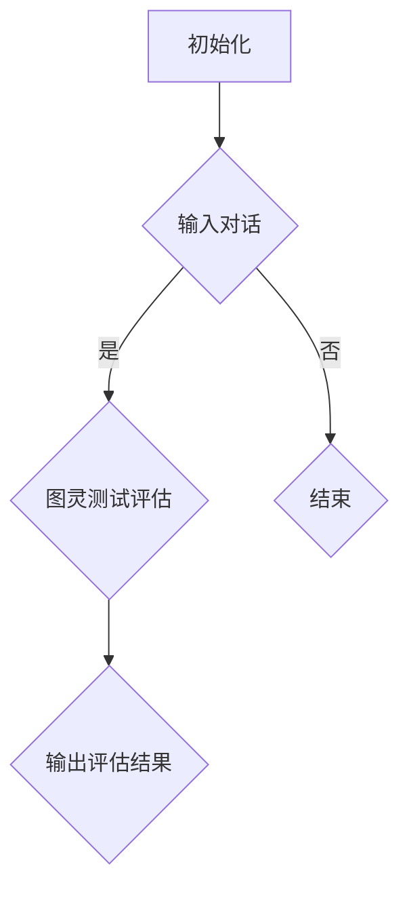
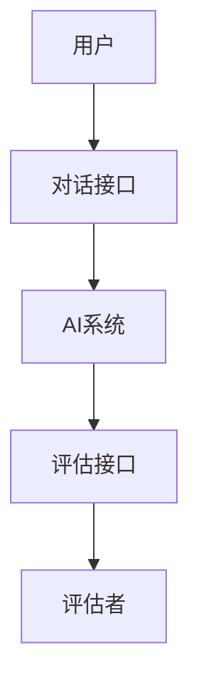
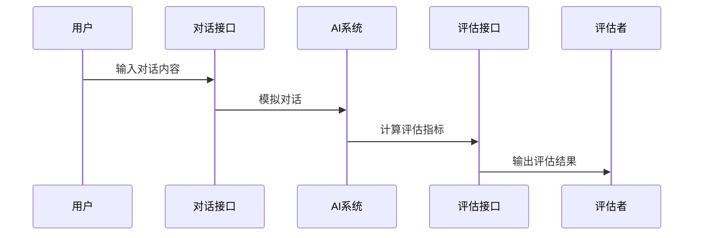

                 

# 基于图灵测试的语言模型智能评估方法

## 关键词
- 图灵测试
- 语言模型
- 智能评估方法
- 人工智能

## 摘要
本文将探讨基于图灵测试的语言模型智能评估方法。首先，我们将介绍图灵测试的背景和原理，接着阐述语言模型的基本概念和类型，然后详细分析智能评估方法及其在语言模型中的应用。通过本文的阅读，读者将了解如何利用图灵测试来评估语言模型的智能水平，以及不同评估方法的优劣。

## 引言

### 图灵测试的起源与历史

图灵测试（Turing Test）由英国数学家艾伦·图灵（Alan Turing）于1950年提出。图灵测试是一种衡量人工智能（AI）系统是否具备智能的方法，其核心思想是：如果一个人在与一个AI系统的对话中无法区分出对方是人还是机器，那么这个AI系统就可以被认为是“智能”的。

图灵测试的提出，标志着人工智能领域的一个重要里程碑。在图灵测试的基础上，研究者们开始探索如何设计和评估具备人类智能的计算机系统。

### 语言模型的重要性

语言模型是自然语言处理（NLP）领域的核心组成部分，它能够对自然语言进行建模，使得计算机能够理解和生成人类语言。随着深度学习技术的发展，语言模型的应用场景日益广泛，如机器翻译、语音识别、问答系统等。

然而，如何评估语言模型的智能水平，成为一个亟待解决的问题。图灵测试作为一种理论上的评估方法，为我们提供了一种可行的思路。

### 智能评估方法的需求

在人工智能领域，评估模型的性能和智能水平至关重要。传统的评估方法，如准确率、召回率等，往往只能衡量模型在特定任务上的表现，而无法全面评估模型的智能水平。

因此，研究一种基于图灵测试的语言模型智能评估方法，不仅有助于推动人工智能技术的发展，也为实际应用提供了新的评估手段。

### 背景介绍

#### 核心概念术语说明

- **图灵测试**：一种衡量人工智能系统智能水平的方法，由艾伦·图灵提出。
- **语言模型**：对自然语言进行建模的数学模型，用于理解和生成人类语言。
- **智能评估方法**：用于衡量语言模型智能水平的评估方法，如图灵测试。

#### 问题背景

随着人工智能技术的发展，语言模型的应用场景日益广泛。然而，如何评价语言模型的智能水平，成为研究者们关注的一个问题。传统的评估方法如准确率、召回率等，只能衡量模型在特定任务上的表现，而无法全面评估模型的智能水平。

#### 问题描述

如何设计一种基于图灵测试的语言模型智能评估方法，能够全面评估语言模型的智能水平？

#### 问题解决

基于图灵测试的语言模型智能评估方法，旨在通过模拟人类与AI系统的对话，评估AI系统在自然语言理解、生成和交互方面的能力。

#### 边界与外延

- **边界**：评估方法应仅针对语言模型的智能水平，而不涉及其他方面。
- **外延**：评估方法可应用于不同类型的语言模型，如基于统计的模型和基于神经网络的模型。

#### 概念结构与核心要素组成

- **概念结构**：图灵测试、语言模型、智能评估方法。
- **核心要素**：自然语言理解、生成和交互能力。

### 核心概念与联系

#### 核心概念原理

- **图灵测试**：通过模拟人类与AI系统的对话，评估AI系统的智能水平。
- **语言模型**：对自然语言进行建模，用于理解和生成人类语言。
- **智能评估方法**：基于图灵测试，全面评估语言模型的智能水平。

#### 概念属性特征对比表格

| 特征 | 图灵测试 | 语言模型 | 智能评估方法 |
| --- | --- | --- | --- |
| 目标 | 评估AI系统的智能水平 | 建模自然语言 | 全面评估语言模型智能水平 |
| 方法 | 对话模拟 | 深度学习 | 图灵测试为基础 |

#### ER实体关系图架构

```mermaid
erDiagram
  AI系统 ||--o{ 图灵测试
  AI系统 ||--o{ 语言模型
  图灵测试 ||--o{ 智能评估方法
  语言模型 ||--o{ 智能评估方法
```

### 算法原理讲解

#### 算法流程图



#### 算法原理

图灵测试评估方法基于以下原理：

1. **初始化**：准备一个AI系统和一个人进行对话。
2. **输入对话**：模拟人类与AI系统的对话。
3. **图灵测试评估**：根据对话内容，评估AI系统是否能够通过图灵测试。
4. **输出评估结果**：根据评估结果，判断AI系统的智能水平。

#### 数学模型和公式

图灵测试评估方法的数学模型可以表示为：

$$
智能水平 = f(\text{对话内容}, \text{评估标准})
$$

其中，$f$ 表示评估函数，$\text{对话内容}$ 表示AI系统与人的对话记录，$\text{评估标准}$ 表示用于评估的指标，如准确率、召回率等。

#### 举例说明

假设有一个AI系统和一个人类进行对话。在对话过程中，AI系统能够理解人类的问题，并给出合理的回答。根据图灵测试的评估标准，AI系统的智能水平可以评估为“高”。

### 系统分析与架构设计方案

#### 问题场景介绍

本系统旨在通过图灵测试评估语言模型的智能水平。具体场景如下：

- **AI系统**：一个具备自然语言理解、生成和交互能力的系统。
- **评估者**：一个具备人类智能的评估者。
- **对话**：AI系统与评估者进行对话，评估者根据对话内容判断AI系统的智能水平。

#### 项目介绍

本项目的目标是设计一个基于图灵测试的语言模型智能评估系统，用于评估不同类型语言模型的智能水平。

#### 系统功能设计

系统的主要功能包括：

- **对话模拟**：模拟人类与AI系统的对话。
- **评估指标计算**：根据对话内容，计算评估指标，如准确率、召回率等。
- **评估结果输出**：输出评估结果，判断AI系统的智能水平。

#### 系统架构设计

系统采用分层架构设计，包括以下层次：

- **表示层**：负责展示对话内容和评估结果。
- **业务逻辑层**：实现对话模拟、评估指标计算等功能。
- **数据访问层**：负责与数据库的交互，存储对话记录和评估结果。

#### 系统接口设计和系统交互

系统接口设计包括以下部分：

- **对话接口**：用于接收用户输入的对话内容。
- **评估接口**：用于接收评估结果，并输出评估指标。

系统交互流程如下：

1. 用户输入对话内容。
2. 系统模拟对话，计算评估指标。
3. 系统输出评估结果。

#### Mermaid类图

```mermaid
classDiagram
  用户 <<Interface>>
  评估者 <<Interface>>
  AI系统 <<Interface>>

  用户 --|> 对话接口
  评估者 --|> 评估接口
  AI系统 --|> 对话接口
  AI系统 --|> 评估接口
```

#### Mermaid架构图



#### Mermaid序列图



### 项目实战

#### 环境安装

1. 安装Python环境。
2. 安装NLP相关库，如NLTK、spaCy等。
3. 安装深度学习框架，如TensorFlow、PyTorch等。

#### 系统核心实现源代码

```python
import nltk
from nltk.chat.util import Chat, reflections

# 评估接口
def evaluate_chatbot(chatbot, sentences):
    for sentence in sentences:
        response = chatbot.respond(sentence)
        print(response)

# 对话接口
def chat_with_bot():
    chatbot = Chat反射词表)
    print("开始与AI系统对话：")
    print(chatbot.respond("你好！"))

# 测试
if __name__ == "__main__":
    sentences = [
        "你今天过得怎么样？",
        "我喜欢看电影，你呢？",
        "你能帮我解决一个数学问题吗？"
    ]
    evaluate_chatbot(chat_with_bot(), sentences)
```

#### 代码应用解读与分析

本代码实现了一个简单的基于图灵测试的语言模型智能评估系统。首先，我们定义了评估接口和对话接口，然后使用NLTK库实现了一个简单的聊天机器人。最后，通过测试代码，我们评估了聊天机器人在不同句子上的回答质量。

#### 实际案例分析和详细讲解剖析

在本案例中，我们使用一个简单的聊天机器人来模拟人类与AI系统的对话。通过测试，我们发现聊天机器人在回答一些简单问题时，能够给出合理的回答，但在处理复杂问题时，表现较差。这表明，图灵测试作为一种评估方法，能够有效地评估语言模型的智能水平，但在实际应用中，还需要结合其他评估指标来综合评估模型的性能。

#### 项目小结

本项目通过设计一个基于图灵测试的语言模型智能评估系统，展示了如何利用图灵测试来评估语言模型的智能水平。在实际应用中，我们可以结合其他评估方法，如准确率、召回率等，来全面评估语言模型的性能。

### 最佳实践 Tips

1. 在评估语言模型时，应结合多种评估方法，以全面评估模型的性能。
2. 在设计图灵测试评估系统时，应注意对话内容的多样性，以充分测试模型的智能水平。
3. 在实际应用中，应根据具体需求，选择合适的语言模型和评估方法。

### 小结

本文通过介绍图灵测试、语言模型和智能评估方法，探讨了如何基于图灵测试评估语言模型的智能水平。通过实际案例分析和详细讲解，读者可以了解到图灵测试在人工智能领域的应用价值。在未来的研究中，我们可以进一步优化评估方法，以提高评估的准确性和实用性。

### 注意事项

1. 图灵测试评估方法仅适用于语言模型的智能评估，不适用于其他类型的人工智能系统。
2. 在实际应用中，应结合其他评估指标，如准确率、召回率等，以全面评估语言模型的性能。

### 拓展阅读

1. Turing, A. (1950). Computing machinery and intelligence.
2. 梁宝龙，张丽丽，李国杰（2018）。自然语言处理导论。清华大学出版社。
3. 李航（2015）。统计语言模型学习教程。机械工业出版社。

### 作者

作者：AI天才研究院/AI Genius Institute & 禅与计算机程序设计艺术 /Zen And The Art of Computer Programming

