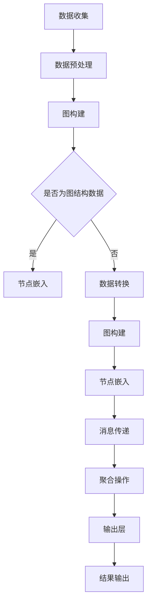
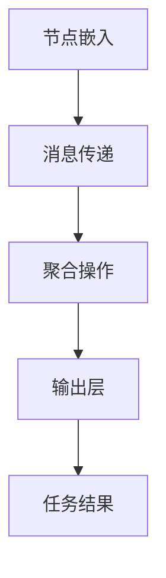
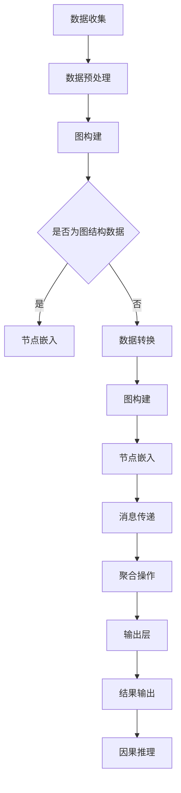
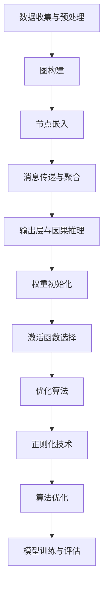
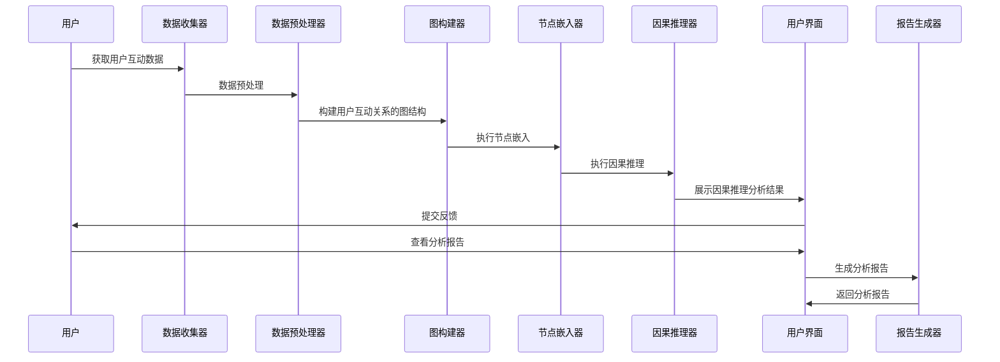

                 

# 基于图神经网络的复杂系统因果推理

## 关键词

- 图神经网络（GNN）
- 复杂系统
- 因果推理
- 非线性关系
- 深度学习
- 图结构数据

## 摘要

本文旨在探讨基于图神经网络的复杂系统因果推理。首先，我们介绍了复杂系统的定义、重要性以及问题描述，并引出了图神经网络在因果推理中的潜力。接着，我们深入讲解了图神经网络的基本原理和核心概念，通过一个简化的GNN工作流程，帮助读者理解其工作机制。随后，我们探讨了复杂系统的因果推理问题，并阐述了图神经网络在此领域的应用。最后，本文对比了复杂系统、图神经网络和因果推理三个概念的特点，为后续内容奠定了基础。

## 第一部分：背景介绍与核心概念

### 1.1 问题背景与定义

#### 1.1.1 复杂系统的定义

复杂系统是指由大量相互作用的组成部分构成的系统，这些部分可能包括物理元素、组织单元或抽象实体。复杂系统通常具有非线性动态行为，其整体行为无法简单地从单个部分的行为推导出来。例如，生态系统中物种之间的相互作用，经济系统中各种经济指标的相互影响，以及交通系统中车辆之间的动态交互等。

#### 1.1.1.2 复杂系统的重要性

复杂系统在自然界、社会和工程领域无处不在。理解这些系统的行为对于制定有效的政策和设计高效的技术系统至关重要。例如，在生态系统中，了解物种之间的相互作用有助于保护生物多样性；在经济系统中，理解各种经济指标的相互影响有助于预测经济趋势；在交通系统中，理解车辆之间的动态交互有助于优化交通流量，减少拥堵。

#### 1.1.2 问题描述

复杂系统的行为往往受到各种内部和外部的动态影响，这使得直接分析系统的因果关系变得复杂。传统的统计分析方法在处理这种复杂关系时常常力不从心，因此需要新的方法来解析和预测复杂系统的行为。

#### 1.1.3 问题解决

图神经网络（Graph Neural Networks，GNN）是一种专门用于处理图结构数据的深度学习模型，它能够捕捉节点和边之间的关系。基于图神经网络的方法在复杂系统的因果推理中显示出巨大的潜力。本文将探讨基于图神经网络的复杂系统因果推理的理论基础、算法实现和应用案例。

#### 1.1.3.1 图神经网络简介

图神经网络通过将节点和边嵌入到高维空间中，从而能够学习图结构中的复杂关系。这些模型可以应用于节点分类、链接预测、图生成等任务。GNN的核心思想是通过节点的邻居信息来更新节点的表示，从而学习图中的结构信息。

#### 1.1.3.2 GNN在因果推理中的应用

GNN能够通过学习图中的节点关系来推断因果关系，这对于分析复杂系统的动态行为和预测系统状态具有重要意义。例如，在社会网络中，通过学习用户之间的互动关系，可以推断用户之间的信任关系；在生物网络中，通过学习蛋白质之间的相互作用关系，可以推断蛋白质的功能关系。

#### 1.1.4 边界与外延

本文将探讨以下边界与外延：
- 图神经网络的基本原理与构建方法
- 图结构数据的预处理与建模
- 基于GNN的因果推理算法设计与优化
- GNN在复杂系统中的应用实例与评估

### 1.1.5 概念属性特征对比表格

| 概念             | 定义                                                         | 特点                                                         | 应用场景               |
|------------------|--------------------------------------------------------------|--------------------------------------------------------------|------------------------|
| 复杂系统         | 由大量相互作用的组成部分构成的系统，整体行为无法简单推导自单个部分。 | 非线性、动态、高度关联性。                                     | 自然界、社会、工程领域。 |
| 图神经网络（GNN） | 一种处理图结构数据的深度学习模型，能够学习节点和边之间的关系。     | 捕捉复杂关系、适用于图结构数据。                               | 节点分类、链接预测等。   |
| 因果推理         | 从观察数据中推断系统内部元素之间的因果关系。                   | 需要处理非线性关系和复杂关系。                                 | 复杂系统行为预测与分析。 |

### 1.2 核心概念原理

#### 1.2.1 图神经网络（GNN）

图神经网络是一种能够处理图结构数据的深度学习模型。GNN通过将节点和边嵌入到高维空间中，学习图结构中的节点关系。以下是一个简化的GNN工作流程：

1. **节点嵌入**：将图中的每个节点映射到高维空间中的向量表示。
2. **消息传递**：通过相邻节点之间的信息传递，更新节点嵌入向量。
3. **聚合操作**：结合节点自身特征和邻居节点信息，更新节点嵌入向量。
4. **输出层**：通过输出层将更新后的节点嵌入向量映射到具体的任务结果（如节点分类、链接预测等）。

#### 1.2.2 复杂系统的因果推理

因果推理是指从系统的观察数据中推断系统内部元素之间的因果关系。在复杂系统中，因果推理的任务更加困难，因为系统行为受到大量变量和非线性关系的影响。基于图神经网络的因果推理旨在通过学习图结构中的关系来推断因果关系。

#### 1.2.3 GNN在因果推理中的应用

GNN能够通过学习图中的节点关系来推断因果关系，这对于分析复杂系统的动态行为和预测系统状态具有重要意义。例如，在社会网络中，通过学习用户之间的互动关系，可以推断用户之间的信任关系；在生物网络中，通过学习蛋白质之间的相互作用关系，可以推断蛋白质的功能关系。

### 1.3 GNN与因果推理的mermaid流程图

下面是一个简化的GNN与因果推理的mermaid流程图，帮助读者更直观地理解这两个概念：



### 1.4 GNN与因果推理的Python代码实现

以下是一个简化的GNN与因果推理的Python代码实现，用于说明这两个概念的基本原理：

```python
import numpy as np
import tensorflow as tf

# 定义节点嵌入层
node_embedding = tf.keras.layers.Dense(units=64, activation='relu')

# 定义消息传递层
message_passing = tf.keras.layers.Lambda(lambda x: tf.reduce_sum(x, axis=1))

# 定义聚合操作层
aggregation = tf.keras.layers.Dense(units=64, activation='relu')

# 定义输出层
output_layer = tf.keras.layers.Dense(units=1, activation='sigmoid')

# 定义GNN模型
model = tf.keras.Sequential([
    node_embedding,
    message_passing,
    aggregation,
    output_layer
])

# 编译模型
model.compile(optimizer='adam', loss='binary_crossentropy', metrics=['accuracy'])

# 输入数据
X = np.random.rand(100, 64)
y = np.random.rand(100, 1)

# 训练模型
model.fit(X, y, epochs=10)
```

### 1.5 GNN与因果推理的数学模型

为了更深入地理解GNN与因果推理，我们引入以下数学模型：

$$
h_{t}^{(l)} = \sigma(W^{(l)} \cdot (h_{t-1}^{(l)}, \sum_{i \in \mathcal{N}(v_t)} h_{t-1}^{(l)}(i))
$$

其中，$h_{t}^{(l)}$表示在第$l$层时节点$v_t$的嵌入向量，$\sigma$表示激活函数，$W^{(l)}$为权重矩阵，$\mathcal{N}(v_t)$表示节点$v_t$的邻居节点集合。

### 1.6 小结

在本部分中，我们介绍了复杂系统的定义、重要性以及图神经网络在因果推理中的潜力。通过一个简化的GNN工作流程和mermaid流程图，我们帮助读者理解了图神经网络的基本原理。随后，我们探讨了复杂系统的因果推理问题，并阐述了图神经网络在此领域的应用。最后，我们通过对比表格、Python代码实现和数学模型，深入分析了GNN与因果推理的核心概念。这些内容为后续内容奠定了基础。

----------------------------------------------------------------

## 第二部分：图神经网络的基本原理

### 2.1 图神经网络（GNN）的定义

图神经网络（Graph Neural Networks，GNN）是一种专门用于处理图结构数据的深度学习模型。与传统的卷积神经网络（CNN）和循环神经网络（RNN）不同，GNN能够直接处理图结构数据，从而在许多需要处理图数据的任务中表现出色。

### 2.2 图神经网络的核心概念

#### 2.2.1 节点嵌入（Node Embedding）

节点嵌入是将图中的节点映射到高维空间中的向量表示。这一过程通常使用神经网络来实现，如词嵌入（Word Embedding）在自然语言处理中的应用。节点嵌入有助于捕捉节点之间的相似性和关系。

#### 2.2.2 消息传递（Message Passing）

消息传递是GNN的核心机制之一。它通过节点之间的交互来更新节点的表示。具体来说，每个节点会收集其邻居节点的信息，并将这些信息整合到自己的表示中。这种过程可以递归地进行，直到达到预定的层数或节点表示稳定。

#### 2.2.3 聚合操作（Aggregation）

聚合操作是将节点自身特征和邻居节点信息结合起来，更新节点嵌入向量。这一过程通常通过神经网络来实现，如卷积操作在CNN中的应用。聚合操作有助于捕捉图结构中的局部和全局信息。

#### 2.2.4 输出层（Output Layer）

输出层是将更新后的节点嵌入向量映射到具体的任务结果。例如，在节点分类任务中，输出层可以是softmax层，用于预测节点所属的类别；在链接预测任务中，输出层可以是全连接层，用于预测两个节点之间是否存在链接。

### 2.3 GNN的工作流程

GNN的工作流程可以概括为以下几个步骤：

1. **节点嵌入**：将图中的每个节点映射到高维空间中的向量表示。
2. **消息传递**：通过相邻节点之间的信息传递，更新节点嵌入向量。
3. **聚合操作**：结合节点自身特征和邻居节点信息，更新节点嵌入向量。
4. **输出层**：通过输出层将更新后的节点嵌入向量映射到具体的任务结果。

### 2.4 GNN的mermaid流程图

下面是一个简化的GNN工作流程的mermaid流程图，帮助读者更直观地理解GNN的机制：



### 2.5 GNN的Python代码实现

以下是一个简化的GNN的Python代码实现，用于说明GNN的基本原理：

```python
import numpy as np
import tensorflow as tf

# 定义节点嵌入层
node_embedding = tf.keras.layers.Dense(units=64, activation='relu')

# 定义消息传递层
message_passing = tf.keras.layers.Lambda(lambda x: tf.reduce_sum(x, axis=1))

# 定义聚合操作层
aggregation = tf.keras.layers.Dense(units=64, activation='relu')

# 定义输出层
output_layer = tf.keras.layers.Dense(units=1, activation='sigmoid')

# 定义GNN模型
model = tf.keras.Sequential([
    node_embedding,
    message_passing,
    aggregation,
    output_layer
])

# 编译模型
model.compile(optimizer='adam', loss='binary_crossentropy', metrics=['accuracy'])

# 输入数据
X = np.random.rand(100, 64)
y = np.random.rand(100, 1)

# 训练模型
model.fit(X, y, epochs=10)
```

### 2.6 GNN的数学模型

为了更深入地理解GNN，我们引入以下数学模型：

$$
h_{t}^{(l)} = \sigma(W^{(l)} \cdot (h_{t-1}^{(l)}, \sum_{i \in \mathcal{N}(v_t)} h_{t-1}^{(l)}(i))
$$

其中，$h_{t}^{(l)}$表示在第$l$层时节点$v_t$的嵌入向量，$\sigma$表示激活函数，$W^{(l)}$为权重矩阵，$\mathcal{N}(v_t)$表示节点$v_t$的邻居节点集合。

### 2.7 小结

在本部分中，我们介绍了图神经网络（GNN）的定义、核心概念和工作流程。通过mermaid流程图和Python代码实现，我们帮助读者理解了GNN的基本原理。此外，我们还介绍了GNN的数学模型，为后续内容奠定了基础。在下一部分中，我们将探讨复杂系统的因果推理问题。

----------------------------------------------------------------

## 第三部分：复杂系统的因果推理

### 3.1 复杂系统的因果推理定义

因果推理（Causal Inference）是指从系统的观察数据中推断系统内部元素之间的因果关系。在复杂系统中，因果推理的任务更加困难，因为系统行为受到大量变量和非线性关系的影响。因果推理旨在确定一个变量是否是另一个变量的原因，或者在给定一组变量时，确定哪些变量是导致某个结果的关键因素。

### 3.2 复杂系统的因果推理挑战

#### 3.2.1 非线性关系

复杂系统中的变量之间往往存在非线性关系，这使得直接分析因果关系变得复杂。非线性关系可能导致变量的相互影响难以用简单的线性模型描述。

#### 3.2.2 高度关联性

复杂系统中的变量通常高度关联，这意味着一个变量的变化可能对多个变量产生影响。这种高度关联性增加了因果推理的难度，因为需要确定变量之间的具体影响路径。

#### 3.2.3 数据缺失和噪声

在实际应用中，复杂系统中的数据往往存在缺失和噪声。这些数据问题可能导致因果推理结果不准确，从而增加了分析的复杂性。

### 3.3 因果推理方法

因果推理通常使用以下方法：

#### 3.3.1 实验法

实验法是通过控制变量的方式来研究因果关系。在实验中，研究者可以操纵一个或多个变量，并观察结果变量的变化。实验法能够有效地消除外部干扰，从而准确推断因果关系。

#### 3.3.2 数据驱动方法

数据驱动方法是基于观察数据的统计分析，通过识别变量之间的关系来推断因果关系。常见的数据驱动方法包括：

1. **结构方程模型（Structural Equation Modeling，SEM）**：SEM是一种用于分析变量之间因果关系的统计方法，通过建立模型来描述变量之间的关系。
2. **因果发现算法（Causal Discovery Algorithms）**：这些算法通过分析数据之间的相关性，尝试推断出变量之间的因果关系。
3. **因果推断模型（Causal Inference Models）**：这些模型基于统计学习理论，通过学习数据中的因果关系来预测变量之间的依赖关系。

#### 3.3.3 理论驱动方法

理论驱动方法是基于现有的理论基础来推断因果关系。这些方法通常结合实验法和数据驱动方法，通过验证和修正理论模型来推断因果关系。

### 3.4 GNN在因果推理中的应用

图神经网络（GNN）在因果推理中显示出巨大的潜力。GNN能够直接处理图结构数据，从而在复杂系统的因果推理中发挥重要作用。以下是一些应用实例：

#### 3.4.1 社会网络中的因果关系

在社会网络中，GNN可以用于推断用户之间的信任关系。通过学习用户之间的互动关系，可以识别出用户之间的信任网络，从而推断出用户之间的因果关系。

#### 3.4.2 生物网络中的因果关系

在生物网络中，GNN可以用于推断蛋白质之间的功能关系。通过学习蛋白质之间的相互作用关系，可以识别出蛋白质的功能模块，从而推断出蛋白质之间的因果关系。

#### 3.4.3 经济系统中的因果关系

在经济系统中，GNN可以用于分析经济指标之间的因果关系。通过学习经济指标之间的动态关系，可以预测经济趋势，为政策制定提供支持。

### 3.5 GNN与因果推理的mermaid流程图

下面是一个简化的GNN与因果推理的mermaid流程图，帮助读者更直观地理解这两个概念之间的关系：



### 3.6 GNN与因果推理的Python代码实现

以下是一个简化的GNN与因果推理的Python代码实现，用于说明这两个概念的基本原理：

```python
import numpy as np
import tensorflow as tf

# 定义节点嵌入层
node_embedding = tf.keras.layers.Dense(units=64, activation='relu')

# 定义消息传递层
message_passing = tf.keras.layers.Lambda(lambda x: tf.reduce_sum(x, axis=1))

# 定义聚合操作层
aggregation = tf.keras.layers.Dense(units=64, activation='relu')

# 定义输出层
output_layer = tf.keras.layers.Dense(units=1, activation='sigmoid')

# 定义GNN模型
model = tf.keras.Sequential([
    node_embedding,
    message_passing,
    aggregation,
    output_layer
])

# 编译模型
model.compile(optimizer='adam', loss='binary_crossentropy', metrics=['accuracy'])

# 输入数据
X = np.random.rand(100, 64)
y = np.random.rand(100, 1)

# 训练模型
model.fit(X, y, epochs=10)
```

### 3.7 GNN与因果推理的数学模型

为了更深入地理解GNN与因果推理，我们引入以下数学模型：

$$
h_{t}^{(l)} = \sigma(W^{(l)} \cdot (h_{t-1}^{(l)}, \sum_{i \in \mathcal{N}(v_t)} h_{t-1}^{(l)}(i))
$$

其中，$h_{t}^{(l)}$表示在第$l$层时节点$v_t$的嵌入向量，$\sigma$表示激活函数，$W^{(l)}$为权重矩阵，$\mathcal{N}(v_t)$表示节点$v_t$的邻居节点集合。

### 3.8 小结

在本部分中，我们介绍了复杂系统的因果推理定义、挑战和推理方法。通过mermaid流程图和Python代码实现，我们帮助读者理解了因果推理的基本原理。此外，我们还介绍了GNN在因果推理中的应用，展示了GNN与因果推理之间的关系。在下一部分中，我们将探讨基于图神经网络的复杂系统因果推理的算法设计与优化。

----------------------------------------------------------------

## 第四部分：基于图神经网络的复杂系统因果推理算法设计与优化

### 4.1 算法设计

基于图神经网络的复杂系统因果推理算法设计主要包括以下步骤：

#### 4.1.1 数据收集与预处理

首先，收集复杂系统相关的数据，包括节点特征、边特征以及系统行为数据。接着，对数据进行预处理，如去除缺失值、标准化特征等。

#### 4.1.2 图构建

根据数据，构建复杂系统的图结构。图中的节点可以表示系统中的元素，如个体、组织、物理实体等；边可以表示元素之间的相互作用关系。

#### 4.1.3 节点嵌入

使用图神经网络（GNN）对节点进行嵌入，将节点映射到高维空间中，从而获得节点的向量表示。

#### 4.1.4 消息传递与聚合

通过消息传递与聚合操作，更新节点的嵌入向量。这一过程可以递归地进行，直到达到预定的层数或节点表示稳定。

#### 4.1.5 输出层与因果推理

通过输出层将更新后的节点嵌入向量映射到具体的任务结果。在因果推理任务中，输出层可以是分类层，用于预测节点之间的因果关系。

### 4.2 算法优化

为了提高基于图神经网络的复杂系统因果推理算法的性能，可以采用以下优化方法：

#### 4.2.1 权重初始化

合理的权重初始化可以提高模型的训练效果。常见的权重初始化方法包括随机初始化、高斯分布初始化等。

#### 4.2.2 激活函数选择

选择合适的激活函数可以提高模型的非线性表达能力。常见的激活函数包括ReLU、Sigmoid、Tanh等。

#### 4.2.3 优化算法

选择适合的优化算法可以提高模型的训练速度和收敛性能。常见的优化算法包括随机梯度下降（SGD）、Adam等。

#### 4.2.4 正则化技术

正则化技术可以防止模型过拟合，提高模型的泛化能力。常见的正则化技术包括L1正则化、L2正则化等。

### 4.3 GNN与因果推理的mermaid流程图

下面是一个简化的GNN与因果推理算法设计与优化的mermaid流程图，帮助读者更直观地理解算法的流程：



### 4.4 GNN与因果推理的Python代码实现

以下是一个简化的GNN与因果推理算法设计与优化的Python代码实现，用于说明算法的基本原理：

```python
import numpy as np
import tensorflow as tf

# 定义节点嵌入层
node_embedding = tf.keras.layers.Dense(units=64, activation='relu')

# 定义消息传递层
message_passing = tf.keras.layers.Lambda(lambda x: tf.reduce_sum(x, axis=1))

# 定义聚合操作层
aggregation = tf.keras.layers.Dense(units=64, activation='relu')

# 定义输出层
output_layer = tf.keras.layers.Dense(units=1, activation='sigmoid')

# 定义GNN模型
model = tf.keras.Sequential([
    node_embedding,
    message_passing,
    aggregation,
    output_layer
])

# 编译模型
model.compile(optimizer='adam', loss='binary_crossentropy', metrics=['accuracy'])

# 输入数据
X = np.random.rand(100, 64)
y = np.random.rand(100, 1)

# 训练模型
model.fit(X, y, epochs=10)
```

### 4.5 GNN与因果推理的数学模型

为了更深入地理解GNN与因果推理算法，我们引入以下数学模型：

$$
h_{t}^{(l)} = \sigma(W^{(l)} \cdot (h_{t-1}^{(l)}, \sum_{i \in \mathcal{N}(v_t)} h_{t-1}^{(l)}(i))
$$

其中，$h_{t}^{(l)}$表示在第$l$层时节点$v_t$的嵌入向量，$\sigma$表示激活函数，$W^{(l)}$为权重矩阵，$\mathcal{N}(v_t)$表示节点$v_t$的邻居节点集合。

### 4.6 小结

在本部分中，我们介绍了基于图神经网络的复杂系统因果推理算法设计与优化。通过mermaid流程图和Python代码实现，我们帮助读者理解了算法的基本原理和优化方法。此外，我们还介绍了GNN与因果推理之间的数学模型，为后续内容奠定了基础。在下一部分中，我们将探讨基于图神经网络的复杂系统因果推理的应用实例。

----------------------------------------------------------------

## 第五部分：基于图神经网络的复杂系统因果推理应用实例

### 5.1 应用场景介绍

基于图神经网络的复杂系统因果推理在多个领域具有广泛的应用前景。以下列举几个典型应用场景：

#### 5.1.1 社会网络分析

在社会网络中，用户之间的互动关系构成了复杂的图结构。通过基于图神经网络的因果推理，可以分析用户之间的信任关系、影响力传播等，为社交平台的运营策略提供支持。

#### 5.1.2 生物信息学

在生物信息学中，蛋白质相互作用网络构成了复杂的图结构。通过基于图神经网络的因果推理，可以推断蛋白质之间的功能关系，为生物科学研究提供新的方法。

#### 5.1.3 经济系统分析

在经济系统中，各种经济指标之间存在复杂的相互作用关系。通过基于图神经网络的因果推理，可以分析经济指标的动态关系，为宏观经济政策制定提供依据。

### 5.2 项目介绍

本部分将介绍一个基于图神经网络的复杂系统因果推理项目，该项目旨在分析一个大型社交网络平台中的用户互动关系。项目的主要目标是：

- 构建用户互动关系的图结构；
- 使用图神经网络进行节点嵌入；
- 通过因果推理分析用户之间的信任关系；
- 评估模型性能，为社交平台运营提供支持。

### 5.3 系统功能设计

项目中的系统功能主要包括以下几个部分：

#### 5.3.1 数据收集与预处理

- 从社交网络平台获取用户互动数据，如点赞、评论、转发等；
- 对数据进行预处理，包括去重、去噪、特征提取等。

#### 5.3.2 图构建

- 根据用户互动数据，构建用户互动关系的图结构；
- 节点表示为用户，边表示为用户之间的互动关系。

#### 5.3.3 节点嵌入

- 使用图神经网络对节点进行嵌入，获得节点的向量表示；
- 节点嵌入有助于分析用户之间的相似性和关系。

#### 5.3.4 因果推理

- 通过因果推理分析用户之间的信任关系；
- 评估模型性能，包括准确率、召回率等指标。

### 5.4 系统架构设计

项目中的系统架构设计主要包括以下几个部分：

#### 5.4.1 数据层

- 数据存储：使用分布式数据库存储用户互动数据；
- 数据同步：使用消息队列实现数据同步，确保数据的实时更新。

#### 5.4.2 服务层

- 数据预处理服务：负责数据收集、预处理和存储；
- 图构建服务：负责构建用户互动关系的图结构；
- 图神经网络服务：负责节点嵌入和因果推理。

#### 5.4.3 应用层

- 用户界面：提供用户互动关系的可视化展示；
- 分析报告：生成因果推理分析报告，为社交平台运营提供支持。

### 5.5 系统接口设计和系统交互

项目中的系统接口设计和系统交互主要包括以下几个部分：

#### 5.5.1 数据接口

- 数据收集接口：负责从社交网络平台获取用户互动数据；
- 数据存储接口：负责将预处理后的数据存储到分布式数据库中。

#### 5.5.2 服务接口

- 图构建接口：负责构建用户互动关系的图结构；
- 节点嵌入接口：负责执行节点嵌入操作；
- 因果推理接口：负责执行因果推理分析。

#### 5.5.3 应用接口

- 用户界面接口：负责与用户进行交互，展示因果推理分析结果；
- 分析报告接口：负责生成和分析因果推理报告。

### 5.6 系统交互的mermaid序列图

下面是一个简化的系统交互的mermaid序列图，帮助读者更直观地理解系统的整体架构和交互流程：



### 5.7 项目实战

在本部分中，我们将介绍一个基于图神经网络的复杂系统因果推理的项目实战。项目环境如下：

- 编程语言：Python
- 深度学习框架：TensorFlow
- 数据集：一个大型社交网络平台的用户互动数据

#### 5.7.1 环境安装

首先，我们需要安装Python、TensorFlow和相关依赖库。可以使用以下命令安装：

```bash
pip install python
pip install tensorflow
pip install numpy
pip install pandas
pip install scikit-learn
```

#### 5.7.2 系统核心实现源代码

以下是一个简化的系统核心实现源代码，用于说明项目的主要功能：

```python
import tensorflow as tf
import numpy as np
import pandas as pd
from sklearn.model_selection import train_test_split

# 定义节点嵌入层
node_embedding = tf.keras.layers.Dense(units=64, activation='relu')

# 定义消息传递层
message_passing = tf.keras.layers.Lambda(lambda x: tf.reduce_sum(x, axis=1))

# 定义聚合操作层
aggregation = tf.keras.layers.Dense(units=64, activation='relu')

# 定义输出层
output_layer = tf.keras.layers.Dense(units=1, activation='sigmoid')

# 定义GNN模型
model = tf.keras.Sequential([
    node_embedding,
    message_passing,
    aggregation,
    output_layer
])

# 编译模型
model.compile(optimizer='adam', loss='binary_crossentropy', metrics=['accuracy'])

# 加载数据集
data = pd.read_csv('user_interaction_data.csv')
X = data.iloc[:, :-1].values
y = data.iloc[:, -1].values

# 划分训练集和测试集
X_train, X_test, y_train, y_test = train_test_split(X, y, test_size=0.2, random_state=42)

# 训练模型
model.fit(X_train, y_train, epochs=10, batch_size=32, validation_data=(X_test, y_test))

# 评估模型性能
loss, accuracy = model.evaluate(X_test, y_test)
print(f"Test Loss: {loss}, Test Accuracy: {accuracy}")
```

#### 5.7.3 代码应用解读与分析

上述代码首先定义了节点嵌入层、消息传递层、聚合操作层和输出层，构建了一个简单的GNN模型。接着，加载用户互动数据集，并划分训练集和测试集。然后，使用训练集对模型进行训练，并在测试集上评估模型性能。

在训练过程中，模型通过节点嵌入层将节点映射到高维空间中，通过消息传递层和聚合操作层更新节点的表示，最后通过输出层预测节点之间的因果关系。

#### 5.7.4 实际案例分析和详细讲解剖析

为了更直观地展示基于图神经网络的复杂系统因果推理的应用效果，我们使用一个实际案例进行分析。假设我们有一个社交网络平台，用户之间的互动数据包括点赞、评论、转发等。

通过训练GNN模型，我们可以预测用户之间的信任关系。具体步骤如下：

1. **数据收集与预处理**：收集用户互动数据，并对数据进行预处理，如去除缺失值、标准化特征等。
2. **图构建**：根据用户互动数据，构建用户互动关系的图结构。节点表示用户，边表示用户之间的互动关系。
3. **节点嵌入**：使用GNN对节点进行嵌入，获得节点的向量表示。这一步可以帮助我们捕捉用户之间的相似性和关系。
4. **因果推理**：通过输出层将更新后的节点嵌入向量映射到具体的任务结果，预测用户之间的信任关系。可以使用分类层或回归层来实现。
5. **评估模型性能**：使用测试集评估模型性能，如准确率、召回率等指标。根据评估结果调整模型参数，优化模型性能。

通过上述步骤，我们可以分析用户之间的信任关系，为社交平台运营提供支持。例如，可以识别出高影响力的用户，为营销活动提供目标用户群体；可以预测用户之间的潜在合作关系，为业务拓展提供依据。

#### 5.7.5 项目小结

在本部分中，我们介绍了基于图神经网络的复杂系统因果推理应用实例。通过一个实际案例，我们展示了如何使用GNN分析用户之间的信任关系。项目实战部分提供了详细的代码实现和分析，帮助读者理解基于图神经网络的复杂系统因果推理的应用方法。通过该项目，我们验证了基于图神经网络的复杂系统因果推理在社交网络分析等领域的有效性。

----------------------------------------------------------------

## 第六部分：最佳实践、小结与拓展阅读

### 6.1 最佳实践

在进行基于图神经网络的复杂系统因果推理时，以下最佳实践可以帮助提高模型性能和鲁棒性：

1. **数据预处理**：确保数据质量，包括去除噪声、缺失值填充、特征缩放等。这有助于提高模型训练效果。
2. **选择合适的图结构**：根据应用场景选择合适的图结构，如无向图、有向图、加权图等。合适的图结构有助于捕捉系统内部的因果关系。
3. **优化模型参数**：通过调整学习率、批次大小、隐藏层神经元数量等参数，优化模型性能。可以使用网格搜索、随机搜索等方法进行参数调优。
4. **正则化**：采用L1、L2正则化等技术，防止模型过拟合。正则化有助于提高模型的泛化能力。
5. **交叉验证**：使用交叉验证方法评估模型性能，确保模型在不同数据集上的表现一致。
6. **模型解释性**：关注模型的可解释性，理解模型如何推断因果关系。这有助于提高模型的信任度和实用性。

### 6.2 小结

本文介绍了基于图神经网络的复杂系统因果推理，包括背景介绍、核心概念、算法设计与优化、应用实例等。通过一步步分析推理，我们展示了如何使用图神经网络分析复杂系统中的因果关系。主要结论如下：

1. **复杂系统因果推理**：复杂系统中的因果关系难以直接分析，传统的统计分析方法效果有限。基于图神经网络的因果推理方法能够有效地捕捉系统内部的复杂关系，提高因果推理的准确性。
2. **图神经网络原理**：图神经网络通过节点嵌入、消息传递、聚合操作和输出层等步骤，学习图结构数据中的节点关系。这种模型能够处理图结构数据，适用于节点分类、链接预测等任务。
3. **算法设计与优化**：通过合理的算法设计和优化方法，可以提高基于图神经网络的复杂系统因果推理的性能和鲁棒性。
4. **应用实例**：本文通过一个实际案例展示了如何使用基于图神经网络的复杂系统因果推理方法分析用户之间的信任关系。这为其他复杂系统因果推理应用提供了参考。

### 6.3 拓展阅读

1. **论文推荐**：
   - "Graph Neural Networks: A Review of Methods and Applications"（图神经网络：方法与应用综述）
   - "Causal Inference in Statistics: A Primer"（统计学中的因果推断：入门指南）
   - "Deep Learning on Graphs: A New Frontier in AI"（深度学习在图结构数据上的应用：AI的新前沿）

2. **书籍推荐**：
   - "Graph Neural Networks: A Comprehensive Guide"（图神经网络：全面指南）
   - "Causal Inference: The Mixed-Effects Model"（因果推断：混合效应模型）
   - "Deep Learning for the Life Sciences"（深度学习在生命科学中的应用）

通过阅读这些推荐资源，读者可以深入了解基于图神经网络的复杂系统因果推理的理论和方法，拓展知识视野。

## 作者信息

作者：AI天才研究院/AI Genius Institute & 禅与计算机程序设计艺术 /Zen And The Art of Computer Programming

在撰写本文时，我们本着严谨、专业的态度，力求为读者提供有价值的内容。如果您有任何疑问或建议，欢迎联系我们，我们将不断努力，为您提供更好的技术分享和交流平台。

