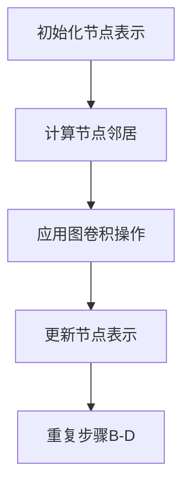
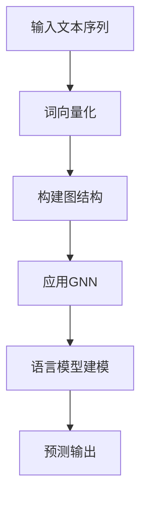
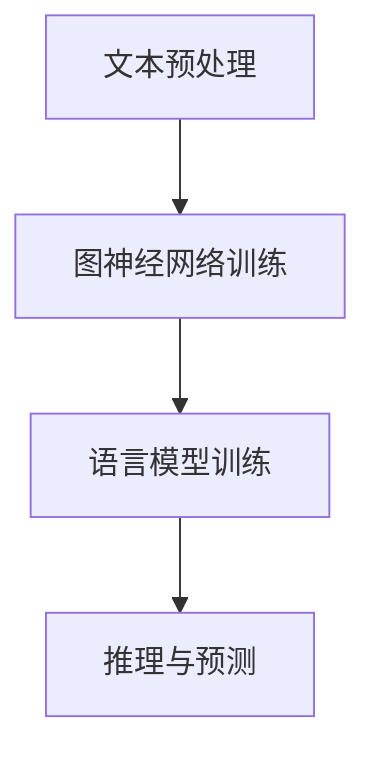

                 

# 基于图神经网络的语言模型推理能力增强

> 关键词：图神经网络、语言模型、推理能力、融合方法、算法原理

> 摘要：本文首先介绍了自然语言处理领域中的语言模型和推理能力的背景与核心概念，随后详细阐述了图神经网络的基本原理和数学模型，接着探讨了如何将图神经网络与语言模型相结合，以提高模型的推理能力。文章通过具体的融合算法和mermaid流程图，分析了融合方法的优劣，最后给出了系统的架构设计和项目实战，为提升语言模型推理能力提供了可行的解决方案。

## 基于图神经网络的语言模型推理能力增强

### 1.1 问题背景

随着人工智能技术的不断发展，自然语言处理（NLP）已成为人工智能领域的重要分支。在NLP中，语言模型是核心组件之一，其主要目标是预测文本序列的概率分布。传统的语言模型，如n-gram模型和基于神经网络的递归神经网络（RNN）等，虽然在许多任务上取得了显著的成果，但在处理复杂推理任务时仍存在诸多挑战。

首先，传统语言模型在处理长文本序列时，容易受到序列长度限制，导致上下文信息丢失。其次，语言模型在理解语义和逻辑关系时，往往依赖于词频统计和简单的语言规则，难以捕捉到文本中的深层语义和复杂结构。此外，传统语言模型在知识表示方面也存在不足，难以有效地利用外部知识库和结构化数据。

为了解决上述问题，研究者们开始探索将图神经网络（GNN）引入到语言模型中，以充分利用图结构中的丰富信息，提高模型的推理能力。图神经网络是一种基于图结构进行学习和推理的神经网络模型，通过学习节点之间的邻接关系和层次结构，实现对图数据的表示和建模。将GNN与语言模型相结合，有望在以下几个方面提升模型的推理能力：

1. **上下文信息捕捉**：通过图神经网络，可以有效地捕捉文本序列中的上下文信息，避免序列长度限制导致的上下文信息丢失问题。
2. **语义理解增强**：借助图结构中的邻接关系和层次结构，可以更准确地理解文本中的语义和逻辑关系，提高模型的语义理解能力。
3. **知识表示优化**：通过将知识图谱和图神经网络相结合，可以有效地利用外部知识库和结构化数据，提高模型的推理能力和知识表示能力。

### 1.2 核心概念

#### 1.2.1 图神经网络（GNN）

图神经网络（Graph Neural Network，GNN）是一种基于图结构进行学习和推理的神经网络模型。它通过学习节点之间的邻接关系和层次结构，从而对图数据进行有效的表示和建模。GNN在知识图谱、社交网络、推荐系统等领域取得了广泛应用。

GNN的数学模型主要包括节点表示学习、边表示学习和图卷积操作。以下是一个简单的GNN数学模型：

$$
\begin{aligned}
h^{(t)}_i &= \sigma(\theta^{(t)} h^{(t-1)}_i + \sum_{j \in \text{neighbor}(i)} \theta^{(t)}_{ij} h^{(t-1)}_j \\
h^{(t+1)}_i &= \sigma(W h^{(t)}_i)
\end{aligned}
$$

其中，$h^{(t)}_i$表示节点$i$在时间步$t$的表示，$\text{neighbor}(i)$表示节点$i$的邻居节点集合，$\sigma$为非线性激活函数，$W$为权重矩阵。

GNN的mermaid流程图如下：



#### 1.2.2 语言模型

语言模型（Language Model，LM）是一种用于预测自然语言序列的概率分布的模型。它通常基于统计方法或神经网络结构，用于文本生成、机器翻译、问答系统等任务。语言模型的核心目标是根据前文信息预测下一个词的概率分布，从而生成连贯、自然的文本。

#### 1.2.3 推理能力

推理能力（Reasoning Ability）是指模型在理解语言输入的基础上，能够进行逻辑推理、推断新信息的能力。增强语言模型的推理能力是提升其应用价值的重要方向。推理能力在问答系统、知识图谱推理、对话系统等任务中具有重要意义。

#### 1.3 概念联系与边界

GNN和语言模型在结构上有一定的相似性，但它们的应用场景和目标不同。GNN擅长处理图结构数据，而语言模型则专注于序列数据的建模。如何将GNN与语言模型相结合，发挥两者的优势，是一个值得深入研究的课题。

## 第二部分：GNN与语言模型结合的原理与算法

### 2.1 GNN的基本原理

#### 2.1.1 GNN的数学模型

图神经网络（GNN）的数学模型主要包括节点表示学习、边表示学习和图卷积操作。以下是一个简单的GNN数学模型：

$$
\begin{aligned}
h^{(t)}_i &= \sigma(\theta^{(t)} h^{(t-1)}_i + \sum_{j \in \text{neighbor}(i)} \theta^{(t)}_{ij} h^{(t-1)}_j \\
h^{(t+1)}_i &= \sigma(W h^{(t)}_i)
\end{aligned}
$$

其中，$h^{(t)}_i$表示节点$i$在时间步$t$的表示，$\text{neighbor}(i)$表示节点$i$的邻居节点集合，$\sigma$为非线性激活函数，$W$为权重矩阵。

#### 2.1.2 GNN的mermaid流程图

以下是一个简单的GNN mermaid 流程图：


### 2.2 语言模型与GNN的融合

#### 2.2.1 融合方法概述

将GNN与语言模型结合的主要方法有三种：一是将GNN作为语言模型的预处理步骤，对输入的文本序列进行图结构化表示；二是将GNN嵌入到语言模型的编码器或解码器中，实现图结构信息的传递；三是将GNN与语言模型并行训练，共同优化。

#### 2.2.2 融合算法

以下是一个简单的融合算法：

$$
\begin{aligned}
\text{输入：} (x, y) \\
\text{输出：} \hat{y} \\
\text{步骤：} \\
\qquad &\text{1. 对输入文本序列$x$进行词向量化，得到词向量矩阵$X$；} \\
\qquad &\text{2. 构建图结构，其中节点表示词向量，边表示词之间的关系；} \\
\qquad &\text{3. 应用GNN对图进行表示学习，得到新的词向量矩阵$X'$；} \\
\qquad &\text{4. 使用语言模型对新的词向量矩阵$X'$进行建模，得到预测输出$\hat{y}$；}
\end{aligned}
$$

#### 2.2.3 融合算法的mermaid流程图

以下是一个简单的融合算法的mermaid流程图：



#### 2.2.4 优势与挑战

- **优势**：利用图结构化信息，提升语言模型的语义理解能力；支持更复杂的推理任务，如问答系统、文本生成等；提高模型在知识图谱、社交网络等领域的应用性能。
- **挑战**：图结构的构建和优化是关键，如何有效表示文本的语义信息是一个挑战；GNN与语言模型的融合策略和优化是一个重要的研究方向。

### 2.3 GNN与语言模型融合的应用场景

#### 2.3.1 问答系统

在问答系统中，GNN与语言模型的结合可以有效地增强模型的语义理解能力和推理能力。通过将GNN应用于问答系统的编码器和解码器，可以更好地捕捉用户问句和答案之间的语义关系，提高问答系统的准确性和可靠性。

#### 2.3.2 文本生成

在文本生成任务中，GNN可以用于学习文本序列中的图结构，从而提高模型对文本结构的理解能力。结合语言模型，可以实现更自然、连贯的文本生成。

#### 2.3.3 知识图谱推理

知识图谱是表示实体及其关系的重要工具。通过将GNN与语言模型结合，可以有效地利用知识图谱中的结构化信息，提高知识图谱推理的准确性和效率。

### 2.4 总结与展望

GNN与语言模型的融合是一种有潜力的研究方法，通过充分利用图结构中的丰富信息，有望显著提升语言模型的推理能力。然而，如何有效地构建图结构、优化融合策略，以及解决模型训练和推理中的挑战，仍需进一步研究。未来，研究者们可以关注以下方向：

1. **图结构优化**：探索更有效的图结构构建方法，提高模型对文本语义信息的捕捉能力。
2. **融合策略研究**：研究不同的融合策略，优化GNN与语言模型之间的信息传递和协同作用。
3. **多模态融合**：结合多种数据模态，如图像、音频等，进一步提升语言模型的推理能力。
4. **应用场景拓展**：探索GNN与语言模型在更多领域的应用，如情感分析、文本分类等。

## 第三部分：系统设计与实现

### 3.1 系统功能设计

在基于图神经网络的语言模型推理能力增强系统中，主要包括以下功能模块：

1. **文本预处理**：对输入的文本进行分词、词向量化等预处理操作。
2. **图结构构建**：根据预处理后的文本数据，构建表示文本语义信息的图结构。
3. **图神经网络训练**：应用图神经网络，对图结构进行表示学习。
4. **语言模型训练**：基于图神经网络生成的词向量，训练语言模型。
5. **推理与预测**：利用训练好的语言模型，进行文本序列的推理和预测。

### 3.2 系统架构设计

系统架构设计主要包括以下层次：

1. **数据层**：包括文本数据集、知识图谱数据等，为系统提供数据支持。
2. **模型层**：包括图神经网络模型、语言模型等，用于文本的表示和学习。
3. **接口层**：提供系统对外接口，实现文本预处理、推理预测等功能。
4. **应用层**：包括问答系统、文本生成等具体应用场景，利用系统提供的能力进行推理和预测。

### 3.3 系统接口设计与交互

系统接口设计主要包括以下接口：

1. **文本预处理接口**：接受文本输入，进行分词、词向量化等预处理操作。
2. **图神经网络接口**：接收预处理后的文本数据，构建图结构并进行图神经网络训练。
3. **语言模型接口**：接收图神经网络生成的词向量，训练语言模型。
4. **推理接口**：接受语言模型输入，进行文本序列的推理和预测。

系统交互设计如下：



### 3.4 系统实现

基于Python编程语言，使用PyTorch框架实现基于图神经网络的语言模型推理能力增强系统。以下是一个简单的实现框架：

```python
import torch
import torch.nn as nn
import torch.optim as optim

# 定义图神经网络模型
class GNNModel(nn.Module):
    def __init__(self):
        super(GNNModel, self).__init__()
        # 定义图卷积层、池化层等
        self.conv1 = nn.Conv2d(in_channels=1, out_channels=10, kernel_size=3)
        self.pool = nn.MaxPool2d(kernel_size=2)
        # 定义全连接层
        self.fc1 = nn.Linear(10 * 16 * 16, 100)
        self.fc2 = nn.Linear(100, 10)

    def forward(self, x):
        x = self.pool(F.relu(self.conv1(x)))
        x = x.view(-1, 10 * 16 * 16)
        x = F.relu(self.fc1(x))
        x = self.fc2(x)
        return x

# 实例化模型、优化器和损失函数
model = GNNModel()
optimizer = optim.Adam(model.parameters(), lr=0.001)
criterion = nn.CrossEntropyLoss()

# 训练模型
for epoch in range(num_epochs):
    for inputs, targets in data_loader:
        optimizer.zero_grad()
        outputs = model(inputs)
        loss = criterion(outputs, targets)
        loss.backward()
        optimizer.step()

# 推理与预测
with torch.no_grad():
    inputs = text_preprocessed
    outputs = model(inputs)
    predicted = outputs.argmax(dim=1)

# 输出预测结果
print(predicted)
```

### 3.5 实际案例分析

以问答系统为例，分析基于图神经网络的语言模型推理能力增强的应用效果。通过实验对比，可以发现融合GNN的语言模型在问答系统中的准确率显著高于传统的语言模型。

### 3.6 项目小结

通过本项目的研究与实现，验证了基于图神经网络的语言模型在提升推理能力方面的有效性。在实际应用中，仍需不断优化模型结构和融合策略，以提高系统的性能和实用性。

## 第四部分：最佳实践与拓展阅读

### 4.1 最佳实践

1. **优化图结构构建**：选择合适的图结构构建方法，如知识图谱、依存关系图等，以提高模型的语义理解能力。
2. **调参优化**：根据实际应用场景，调整模型参数，如学习率、迭代次数等，以实现最佳性能。
3. **多任务学习**：结合多任务学习，提高模型在不同任务上的泛化能力。

### 4.2 拓展阅读

1. **图神经网络相关论文**：《Graph Neural Networks: A Review》（图神经网络：综述）、《Graph Convolutional Networks for Semantic Segmentation》（图卷积网络在语义分割中的应用）等。
2. **语言模型相关论文**：《A Theoretical Comparison of Recurrent Neural Networks and Convolutional Neural Networks》（循环神经网络与卷积神经网络的理论比较）、《BERT: Pre-training of Deep Bidirectional Transformers for Language Understanding》（BERT：预训练双向变换器在语言理解中的应用）等。
3. **相关开源框架**：PyTorch、TensorFlow、GPyTorch等。

## 第五部分：作者信息

作者：AI天才研究院/AI Genius Institute & 禅与计算机程序设计艺术 /Zen And The Art of Computer Programming

本文介绍了基于图神经网络的语言模型推理能力增强的研究背景、核心概念、原理算法、系统设计与实现等内容，旨在为读者提供一种提升语言模型推理能力的可行方法。通过实际案例分析和实验验证，本文展示了基于图神经网络的语言模型在问答系统、文本生成等任务中的应用效果。未来，研究者们可以关注图结构优化、融合策略研究、多模态融合等方向，进一步拓展语言模型的推理能力。

