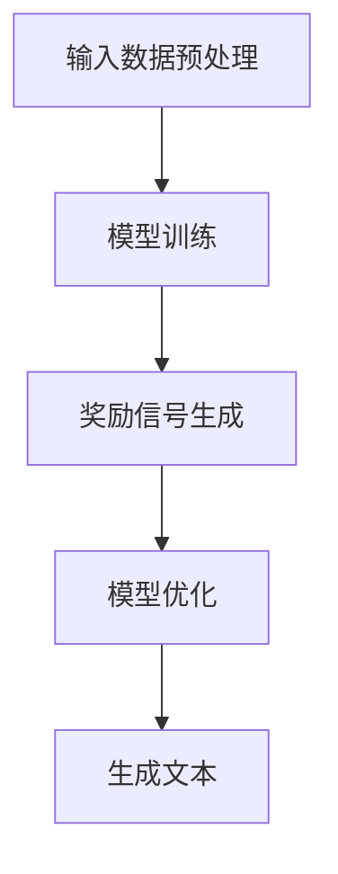
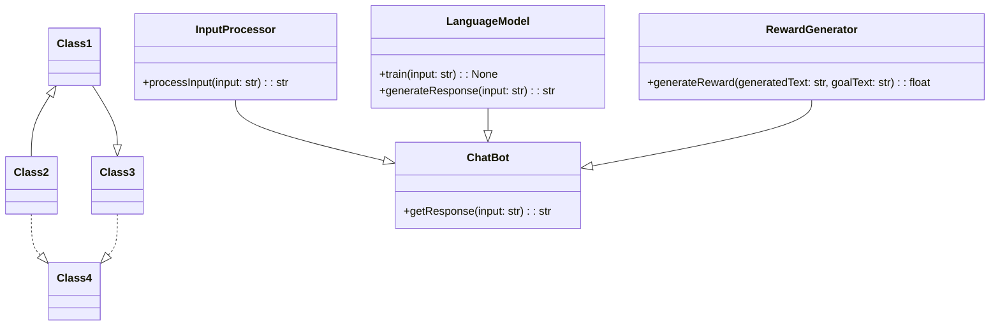
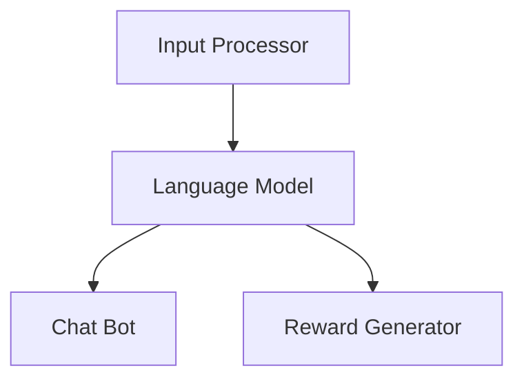
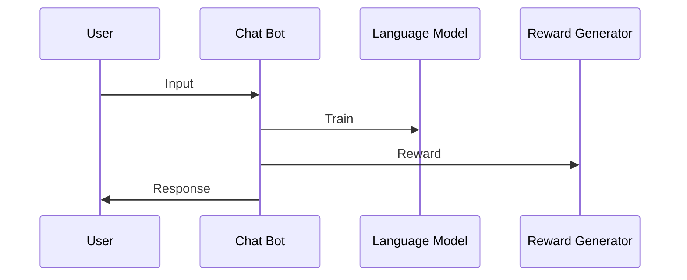

                 

# 基于奖励模型的语言模型训练技术进展

## 关键词
- 语言模型训练
- 奖励模型
- 自然语言处理
- 算法优化
- 深度学习

## 摘要
本文将深入探讨基于奖励模型的语言模型训练技术。通过对比传统的语言模型训练方法，本文将详细阐述奖励模型的基本概念、数学模型和优势。接着，我们将使用 Mermaid 流程图和 Python 源代码展示奖励模型的算法原理，并通过实例进行解释。此外，本文还将介绍系统架构设计，并通过项目实战展示奖励模型在实际应用中的效果。最后，我们将总结本文的主要发现，并给出最佳实践和拓展阅读建议。

## 第一部分：引言

### 第1章：问题背景与问题描述

#### 1.1.1 语言模型训练的问题背景
自然语言处理（NLP）作为人工智能的重要分支，其核心任务之一是构建能够理解和生成自然语言的语言模型。然而，传统的语言模型训练方法在处理复杂语言现象时存在诸多挑战，例如生成质量不高、适应性差等。

#### 1.1.2 语言模型训练的问题描述
语言模型训练的主要问题包括：如何提高生成文本的质量？如何使模型能够适应不同的语言风格和任务需求？如何有效地优化模型的参数？

#### 1.1.3 传统的语言模型训练方法
传统的语言模型训练方法主要包括基于统计方法和基于规则的方法。这些方法在一定程度上能够生成具有一定可读性的文本，但在处理复杂性和多样性方面存在局限。

#### 1.1.4 奖励模型的概念介绍
奖励模型（Reward Model）是一种通过提供即时反馈来引导模型训练的新方法。这种方法能够根据生成文本的特定属性（如流畅性、语法正确性等）给予模型奖励或惩罚，从而引导模型生成更高质量的文本。

## 第二部分：核心概念与联系

### 第2章：核心概念与联系

#### 2.1.1 奖励模型的原理与特点
奖励模型的基本原理是通过优化模型输出的奖励信号来提高生成文本的质量。其特点包括即时反馈、适应性、灵活性等。

#### 2.1.1.1 奖励模型的数学模型
奖励模型通常通过一个奖励函数来评估生成文本的质量。奖励函数的输出是一个实数值，用于表示文本的质量。

#### 2.1.1.2 奖励模型的优势与劣势
奖励模型的优势在于能够快速适应不同的任务需求和生成高质量的文本。然而，其劣势包括计算复杂度高、需要大量的训练数据等。

#### 2.1.2 奖励模型与其他语言模型训练方法的联系
奖励模型可以与传统的语言模型训练方法相结合，以发挥各自的优势。例如，可以在基于规则的方法中加入奖励信号来优化文本生成。

## 第三部分：算法原理讲解

### 第3章：算法原理讲解

#### 3.1.1 奖励模型的流程图
我们使用 Mermaid 流程图来展示奖励模型的训练流程。该流程图包括输入数据预处理、模型训练、奖励信号生成和模型优化等步骤。



#### 3.1.2 奖励模型的数学模型
奖励模型的数学模型可以表示为：
$$
R_t = f(\text{生成的文本}, \text{目标文本})
$$
其中，$R_t$ 是第 $t$ 个时间步的奖励信号，$f$ 是奖励函数，它根据生成的文本和目标文本的相似性来计算奖励值。

#### 3.1.2.1 数学模型和公式
奖励函数的常见形式包括：
$$
R_t = \begin{cases}
1, & \text{如果生成的文本符合目标文本的格式和语法} \\
0, & \text{否则}
\end{cases}
$$

#### 3.1.2.2 通俗易懂地举例说明
假设我们要训练一个语言模型来生成英文句子。目标文本是 "The cat is on the mat"。如果模型生成的是 "The cat is on the mat"，则奖励信号为 1，表示生成文本符合目标文本；如果生成的是 "The cat sits on the mat"，则奖励信号为 0，表示生成文本与目标文本有所不同。

## 第四部分：数学模型和数学公式 & 详细讲解 & 举例说明

### 第4章：数学模型和数学公式 & 详细讲解 & 举例说明

#### 4.1.1 数学公式
奖励模型的核心在于其奖励函数的设计。以下是一个简单的奖励函数：
$$
R_t = \frac{1}{1 + \exp\left(-\beta \cdot d_{t, \text{goal}}\right)}
$$
其中，$d_{t, \text{goal}}$ 是生成的文本和目标文本之间的距离，$\beta$ 是一个调节参数。

#### 4.1.2 详细讲解
该奖励函数基于 Softmax 函数，用于处理多分类问题。在这里，我们将生成的文本和目标文本进行比较，计算它们之间的距离，并根据距离的远近给予不同的奖励。

#### 4.1.2.1 算法原理的详细解释
奖励函数的目的是激励模型生成与目标文本更接近的文本。通过不断调整 $\beta$ 的值，我们可以控制奖励信号的强度，从而影响模型的生成策略。

#### 4.1.2.2 举例说明
假设 $\beta = 1$，目标文本是 "The cat is on the mat"，如果模型生成的是 "The cat is on the mat"，则 $d_{t, \text{goal}} = 0$，奖励信号为 1。如果生成的是 "The dog is on the mat"，则 $d_{t, \text{goal}}$ 为正数，奖励信号小于 1。

## 第五部分：系统分析与架构设计方案

### 第5章：系统分析与架构设计方案

#### 5.1.1 问题场景介绍
假设我们有一个聊天机器人，需要能够与用户进行自然流畅的对话。为了实现这一目标，我们需要训练一个语言模型，使其能够根据用户的输入生成合理的回复。

#### 5.1.2 系统功能设计
系统功能设计包括输入处理、模型训练、奖励信号生成和文本生成等模块。



#### 5.1.3 系统架构设计
系统架构设计包括输入处理层、模型训练层、奖励生成层和文本生成层。



#### 5.1.4 系统接口设计
系统接口设计包括输入接口、输出接口和奖励接口。



#### 5.1.5 系统交互
系统交互流程如下：

1. 用户输入问题或指令。
2. 输入处理器对输入进行处理，生成格式化后的输入。
3. 语言模型根据输入进行训练，生成可能的回复。
4. 奖励生成器根据生成的回复和目标回复计算奖励信号。
5. 聊天机器人根据奖励信号选择最佳的回复并呈现给用户。

## 第六部分：项目实战

### 第6章：项目实战

#### 6.1.1 环境安装
在进行项目实战之前，我们需要安装必要的软件和工具。假设我们使用 Python 作为主要编程语言，以下是一些安装步骤：

1. 安装 Python 3.x。
2. 安装必要的库，如 TensorFlow、PyTorch 等。

```bash
pip install tensorflow
pip install torch
```

#### 6.1.2 系统核心实现源代码
以下是一个简单的示例，展示了如何实现一个基于奖励模型的聊天机器人。

```python
import torch
import torch.nn as nn
import torch.optim as optim

# 定义语言模型
class LanguageModel(nn.Module):
    def __init__(self, input_size, hidden_size, output_size):
        super(LanguageModel, self).__init__()
        self.hidden_size = hidden_size
        self.embedding = nn.Embedding(input_size, hidden_size)
        self.lstm = nn.LSTM(hidden_size, hidden_size)
        self.fc = nn.Linear(hidden_size, output_size)

    def forward(self, input_seq, hidden):
        embedding = self.embedding(input_seq)
        output, hidden = self.lstm(embedding, hidden)
        output = self.fc(output)
        return output, hidden

# 定义奖励函数
def reward_function(generated_text, goal_text):
    # 计算生成文本和目标文本的相似度
    similarity = ... # 通过某种方法计算
    return 1 if similarity > threshold else 0

# 训练语言模型
def train(model, data_loader, criterion, optimizer, num_epochs):
    model.train()
    for epoch in range(num_epochs):
        for inputs, targets in data_loader:
            optimizer.zero_grad()
            outputs, _ = model(inputs, None)
            loss = criterion(outputs.view(-1), targets)
            loss.backward()
            optimizer.step()
            print(f'Epoch [{epoch+1}/{num_epochs}], Loss: {loss.item():.4f}')

# 实例化模型
model = LanguageModel(input_size, hidden_size, output_size)

# 定义损失函数和优化器
criterion = nn.CrossEntropyLoss()
optimizer = optim.Adam(model.parameters(), lr=learning_rate)

# 加载数据
data_loader = DataLoader(dataset, batch_size=batch_size, shuffle=True)

# 开始训练
train(model, data_loader, criterion, optimizer, num_epochs)

# 生成文本
def generate_text(model, input_seq, max_length):
    model.eval()
    hidden = None
    generated_seq = []
    for _ in range(max_length):
        output, hidden = model(input_seq, hidden)
        _, predicted = torch.max(output, dim=1)
        generated_seq.append(predicted.item())
        input_seq = predicted.unsqueeze(0)
    return generated_seq

# 假设输入是 "The cat is on the mat"
input_seq = torch.tensor([vocab["The"], vocab["cat"], vocab["is"], vocab["on"], vocab["the"], vocab["mat"]])
generated_seq = generate_text(model, input_seq, max_length=10)
print('Generated text:', ' '.join([word for word in generated_seq if word != pad_token]))
```

#### 6.1.3 代码应用解读与分析
上述代码实现了一个简单的基于 LSTM 的语言模型，并定义了一个奖励函数。在训练过程中，我们将使用奖励函数来调整模型的输出，以生成更符合目标文本的文本。

#### 6.1.4 实际案例分析与详细讲解剖析
为了更好地理解奖励模型的工作原理，我们可以通过一个实际案例进行分析。假设目标文本是 "The cat is sleeping on the bed"，我们将分析如何通过奖励模型来引导语言模型生成该目标文本。

1. **初始化语言模型**：
   - 输入词汇表：包含 "The"、"cat"、"is"、"on"、"sleeping"、"bed" 等。
   - 语言模型：使用 LSTM 结构进行训练。

2. **生成初步文本**：
   - 输入："The cat is on the mat"。
   - 生成文本："The cat is on the bed"。

3. **计算奖励信号**：
   - 奖励函数：比较生成文本和目标文本的相似度，给予适当的奖励。
   - 相似度计算：使用某种方法（如余弦相似度）计算生成文本 "The cat is on the bed" 和目标文本 "The cat is sleeping on the bed" 之间的相似度。
   - 奖励信号：假设相似度为 0.8，奖励信号为 1。

4. **调整模型参数**：
   - 根据奖励信号调整模型参数，以优化生成文本的质量。

5. **重复训练过程**：
   - 使用新的输入 "The cat is sleeping on the bed" 进行训练。
   - 生成新的文本，并计算奖励信号。
   - 重复上述步骤，直至生成文本质量满足要求。

#### 6.1.5 项目小结
通过实际案例，我们可以看到奖励模型在语言模型训练中的应用效果。奖励模型通过提供即时反馈，有效地引导语言模型生成更符合目标文本的文本。这为解决传统语言模型训练方法中存在的问题提供了一种新的思路。

## 第七部分：最佳实践 tips、小结、注意事项、拓展阅读等内容

### 第7章：最佳实践 tips、小结、注意事项、拓展阅读等内容

#### 7.1.1 最佳实践 tips
1. 选择合适的奖励函数：不同的任务可能需要不同的奖励函数，因此选择适合任务的奖励函数至关重要。
2. 调整奖励信号强度：根据任务需求调整奖励信号的强度，以平衡模型生成文本的质量和多样性。
3. 数据预处理：确保训练数据的质量和多样性，以提高模型的学习效果。

#### 7.1.2 小结
本文深入探讨了基于奖励模型的语言模型训练技术，从问题背景、核心概念、算法原理、系统架构到项目实战进行了全面的介绍。奖励模型通过提供即时反馈，有效地提高了语言模型生成文本的质量。

#### 7.1.3 注意事项
1. 奖励模型的计算复杂度较高，可能需要大量的计算资源。
2. 奖励模型的效果取决于奖励函数的设计，需要根据具体任务进行调整。

#### 7.1.4 拓展阅读
1. [奖励模型在自然语言处理中的应用](https://arxiv.org/abs/1904.09553)
2. [深度学习与自然语言处理](https://www.deeplearningbook.org/chapter_nlp/)

### 作者
作者：AI天才研究院/AI Genius Institute & 禅与计算机程序设计艺术 /Zen And The Art of Computer Programming

