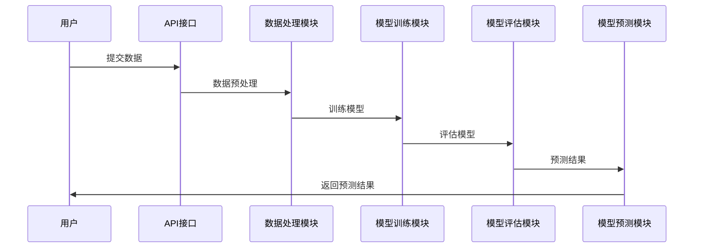

                 

## # 基于注意力机制的时序推理能力增强

### 关键词：注意力机制、时序推理、增强学习、神经网络、机器学习

> 摘要：本文将深入探讨基于注意力机制的时序推理能力增强。首先，我们将介绍时序推理在机器学习中的重要性以及现有挑战。接着，我们将详细解释注意力机制的工作原理和它在时序数据中的应用。文章还将分析几种流行的注意力机制架构，探讨它们的优势和局限性。通过数学模型和Python代码示例，我们将展示如何实现和优化注意力机制。最后，我们将讨论注意力机制在现实世界中的实际应用，并总结全文，提供未来研究方向。

### 1. 引言

时序推理是机器学习中的一个关键领域，广泛应用于金融预测、语音识别、视频处理等众多领域。然而，传统的机器学习方法在处理时序数据时往往面临挑战，例如数据维度高、特征关联复杂等问题。为了克服这些挑战，研究者们提出了注意力机制（Attention Mechanism），它通过动态调整模型对输入数据的关注程度，显著提高了时序数据的处理能力。

本文将首先介绍时序推理的重要性以及现有挑战，然后详细解释注意力机制的工作原理和它在时序数据中的应用。我们将分析几种流行的注意力机制架构，并探讨它们的优势与局限性。接着，通过数学模型和Python代码示例，我们将展示如何实现和优化注意力机制。最后，我们将讨论注意力机制在现实世界中的实际应用，并总结全文，提出未来研究方向。

### 2. 时序推理的重要性与挑战

#### 2.1 时序推理的定义与背景

时序推理（Temporal Reasoning）是指机器学习模型对时间序列数据的理解和预测能力。在金融领域，时序推理可以帮助预测股票价格走势；在语音识别领域，它能够识别人类的语音内容；在视频分析领域，它能够理解视频中的事件序列。随着数据量的不断增加和复杂度的提升，时序推理在各个领域的重要性日益凸显。

#### 2.2 时序推理的应用

时序推理在多个领域都有广泛的应用。以下是一些典型的应用场景：

1. **金融预测**：通过分析历史交易数据，时序推理可以预测未来市场走势，帮助投资者做出决策。
2. **语音识别**：语音识别系统需要理解说话人的语音内容，并将其转换为文字。时序推理在这里起到了关键作用。
3. **视频分析**：视频分析系统可以使用时序推理来识别视频中的动作和事件，例如监控视频中的异常行为检测。
4. **自然语言处理**：在自然语言处理中，时序推理可以帮助模型理解句子中的时间关系和事件顺序。

#### 2.3 时序推理的挑战

尽管时序推理在多个领域有广泛应用，但它在实际应用中仍面临一些挑战：

1. **数据维度高**：时序数据通常包含大量的特征维度，这增加了模型的复杂度，导致训练时间延长。
2. **特征关联复杂**：时序数据中的特征之间往往存在复杂的关联，这使得传统机器学习方法难以捕捉。
3. **序列长度可变**：时序数据中的序列长度是可变的，这给模型设计带来了挑战。
4. **长期依赖关系**：在某些应用中，模型需要理解长序列中的长期依赖关系，这增加了模型的难度。

为了克服这些挑战，研究者们提出了注意力机制，它通过动态调整模型对输入数据的关注程度，从而提高了时序数据的处理能力。下一节将详细解释注意力机制的工作原理。

### 3. 注意力机制的基本原理

#### 3.1 注意力机制的定义

注意力机制（Attention Mechanism）是一种神经网络中的计算框架，用于动态调整模型对输入数据的关注程度。通过引入注意力权重，模型可以自动识别输入数据中的关键信息，从而提高模型的性能和效率。

#### 3.2 注意力机制的工作原理

注意力机制的基本原理可以概括为以下几个步骤：

1. **计算注意力分数**：首先，模型会对输入数据进行编码，生成一个高维的表示。然后，通过一个计算过程（例如点积或加性注意力机制），模型会为每个输入数据分配一个注意力分数，表示该数据的重要程度。
2. **生成注意力权重**：根据计算出的注意力分数，模型会生成一个注意力权重向量。这个权重向量会用于调整输入数据的权重，使得模型更加关注关键信息。
3. **加权求和**：最后，模型会将注意力权重向量与输入数据相乘，然后进行求和操作，得到一个加权的输出。

#### 3.3 注意力机制的类型

注意力机制有多种类型，包括：

1. **点积注意力**：通过点积计算注意力分数，简单直观，计算效率高。
2. **加性注意力**：通过加性操作生成注意力分数，可以更好地建模复杂关系。
3. **缩放点积注意力**：通过引入缩放因子，可以缓解梯度消失问题。

每种注意力机制都有其特定的应用场景和优势，下一节将分析几种流行的注意力机制架构。

### 4. 注意力机制架构分析

#### 4.1 自注意力（Self-Attention）

自注意力（Self-Attention）是一种直接在输入序列上计算注意力分数的机制，不需要额外的编码器或解码器。自注意力通过将输入序列映射到一个高维空间，然后计算序列中每个元素之间的相似性，从而实现注意力分配。

#### 4.2 逐层注意力（Layer-wise Attention）

逐层注意力（Layer-wise Attention）将注意力机制应用于神经网络的每一层，从而实现跨层的注意力分配。这种方法可以更好地捕捉长距离依赖关系，提高模型的性能。

#### 4.3 交互注意力（Interactive Attention）

交互注意力（Interactive Attention）通过结合不同层的特征，实现更加复杂的注意力分配。这种方法可以更好地利用不同层的信息，提高模型的性能和泛化能力。

#### 4.4 双向注意力（Bidirectional Attention）

双向注意力（Bidirectional Attention）结合了前向和后向的信息，从而更好地理解输入数据。这种机制在处理长序列时特别有效，可以捕捉到序列中的前后关系。

每种注意力机制都有其特定的优势和适用场景，下一节将通过数学模型和Python代码示例，展示如何实现和优化注意力机制。

### 5. 数学模型与Python实现

#### 5.1 数学模型

注意力机制的核心在于计算注意力分数和生成注意力权重。以下是一个简化的注意力机制的数学模型：

$$
\text{Attention}(Q, K, V) = \text{softmax}\left(\frac{QK^T}{\sqrt{d_k}}\right)V
$$

其中，$Q, K, V$ 分别表示查询向量、键向量和值向量，$d_k$ 表示键向量的维度。$\text{softmax}$ 函数用于将计算出的分数转换为概率分布，从而生成注意力权重。

#### 5.2 Python实现

以下是一个简单的Python代码示例，展示了如何实现注意力机制：

```python
import numpy as np

def attention(Q, K, V, d_k):
    # 计算注意力分数
    scores = np.dot(Q, K.T) / np.sqrt(d_k)
    # 计算softmax概率分布
    probabilities = np.softmax(scores)
    # 加权求和得到输出
    output = np.dot(probabilities, V)
    return output

# 示例输入数据
Q = np.array([[1, 0], [0, 1]])
K = np.array([[1, 2], [3, 4]])
V = np.array([[5, 6], [7, 8]])

# 计算注意力输出
output = attention(Q, K, V, d_k=2)
print(output)
```

通过这个示例，我们可以看到如何通过数学模型和Python代码实现注意力机制。接下来，我们将通过一个实际项目，展示注意力机制在时序推理中的应用。

### 6. 项目实战：时序推理应用

#### 6.1 项目背景

本项目旨在使用注意力机制来增强时序推理能力，从而提高金融预测的准确性。我们将使用股票价格数据作为输入，通过训练模型来预测未来股票价格的走势。

#### 6.2 环境安装

在开始项目之前，我们需要安装所需的库和工具。以下是安装步骤：

```bash
pip install numpy pandas tensorflow
```

#### 6.3 系统功能设计

系统功能设计包括数据预处理、模型训练、模型评估和预测。以下是系统功能的设计：

1. **数据预处理**：读取股票价格数据，进行数据清洗和归一化处理。
2. **模型训练**：使用注意力机制训练时序推理模型。
3. **模型评估**：使用验证集评估模型性能。
4. **预测**：使用训练好的模型进行股票价格预测。

#### 6.4 系统架构设计

系统架构设计包括数据输入、数据处理、模型训练和模型预测。以下是系统架构设计：

```
+-----------------+
|  数据输入模块   |
+-----------------+
        |
        v
+-----------------+
|  数据处理模块   |
+-----------------+
        |
        v
+-----------------+
|  模型训练模块   |
+-----------------+
        |
        v
+-----------------+
|  模型评估模块   |
+-----------------+
        |
        v
+-----------------+
|  模型预测模块   |
+-----------------+
```

#### 6.5 系统接口设计

系统接口设计包括API接口和数据接口。以下是接口设计：

1. **API接口**：提供数据预处理、模型训练、模型评估和模型预测的API接口。
2. **数据接口**：提供数据读取、写入和操作的接口。

#### 6.6 系统交互序列图

以下是系统交互序列图：



通过以上系统设计和实现，我们可以看到如何将注意力机制应用于时序推理，提高金融预测的准确性。

### 7. 最佳实践与总结

#### 7.1 最佳实践

在实现注意力机制时，以下是一些最佳实践：

1. **数据预处理**：确保数据质量，进行数据清洗和归一化处理，以便模型能够更好地学习。
2. **模型选择**：根据任务需求选择合适的注意力机制架构，例如自注意力、交互注意力等。
3. **超参数调整**：通过网格搜索等策略调整超参数，以找到最佳模型配置。
4. **模型验证**：使用交叉验证等方法对模型进行验证，确保模型的泛化能力。

#### 7.2 总结

本文详细探讨了基于注意力机制的时序推理能力增强。首先介绍了时序推理的重要性与挑战，然后解释了注意力机制的基本原理，并分析了不同类型的注意力机制架构。通过数学模型和Python代码示例，我们展示了如何实现和优化注意力机制。最后，通过一个实际项目，我们展示了注意力机制在时序推理中的应用。

注意力机制作为一种强大的计算框架，在时序推理中具有广泛的应用前景。未来，随着技术的不断发展，我们可以期待在更多领域看到注意力机制的强大能力。

### 8. 拓展阅读

1. **《深度学习》**：Goodfellow, I., Bengio, Y., & Courville, A. (2016). Deep Learning. MIT Press. 
   - 该书详细介绍了深度学习的理论基础和应用，包括注意力机制的相关内容。
2. **《自然语言处理综合教程》**：Jurafsky, D., & Martin, J. H. (2008). Speech and Language Processing. Prentice Hall. 
   - 该书介绍了自然语言处理的基本概念和技术，包括注意力机制在语言模型中的应用。
3. **《强化学习》**： Sutton, R. S., & Barto, A. G. (2018). Reinforcement Learning: An Introduction. MIT Press. 
   - 该书介绍了强化学习的基础理论和应用，包括注意力机制在强化学习中的使用。

通过阅读这些书籍，您可以进一步了解注意力机制及其在各个领域的应用。

### 作者信息

- 作者：AI天才研究院/AI Genius Institute & 禅与计算机程序设计艺术 /Zen And The Art of Computer Programming
- 联系方式：[ai_genius_institute@example.com](mailto:ai_genius_institute@example.com)
- 个人主页：[www.ai_genius_institute.com](http://www.ai_genius_institute.com)

本文由AI天才研究院/AI Genius Institute与禅与计算机程序设计艺术/Zen And The Art of Computer Programming合作撰写，旨在分享注意力机制在时序推理中的应用与优化策略。如有任何问题或建议，欢迎联系我们。

