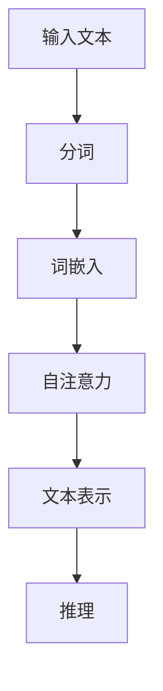

                 

## 《基于注意力机制的长文本理解与推理框架》

### 关键词：注意力机制、长文本理解、文本推理、深度学习

#### 摘要：

本文将深入探讨基于注意力机制的长文本理解与推理框架，旨在为读者提供一个全面而简洁的指南。我们将从背景与引论、基本概念、算法原理与实现、实验设计与评估、应用案例与项目实战，以及最佳实践与展望等多个角度进行阐述。通过本文，读者将能够理解注意力机制的核心原理，掌握其在长文本理解与推理中的实际应用。

### 目录大纲

#### 第一部分：背景与引论

#### 第1章：文本理解与推理概述

- **1.1 问题背景**
- **1.2 文本理解与推理的重要性**
- **1.3 基于注意力机制的研究意义**

#### 第2章：文本理解与推理的基本概念

- **2.1 文本数据预处理**
- **2.2 文本表示方法**
- **2.3 注意力机制原理**

#### 第3章：基于注意力机制的文本理解

- **3.1 传统文本理解方法**
- **3.2 注意力机制的引入**
- **3.3 常见注意力机制模型**

#### 第4章：基于注意力机制的文本推理

- **4.1 文本推理的基本概念**
- **4.2 注意力机制在文本推理中的应用**
- **4.3 文本推理实例分析**

#### 第二部分：算法原理与实现

#### 第5章：算法原理

- **5.1 注意力机制数学模型**
- **5.2 注意力机制的mermaid流程图**
- **5.3 常见文本理解与推理算法原理分析**

#### 第6章：算法实现

- **6.1 Python编程基础**
- **6.2 注意力机制的实现**
- **6.3 文本理解与推理框架搭建**

#### 第7章：实验设计与评估

- **7.1 实验环境搭建**
- **7.2 数据集选择与预处理**
- **7.3 实验设计与评估方法**

#### 第三部分：应用案例与实战

#### 第8章：实际应用案例

- **8.1 长文本情感分析**
- **8.2 文本生成与摘要**
- **8.3 长文本问答系统**

#### 第9章：项目实战

- **9.1 项目介绍**
- **9.2 系统功能设计**
- **9.3 系统架构设计**
- **9.4 系统核心实现**
- **9.5 代码应用解读与分析**

#### 第10章：最佳实践与展望

- **10.1 最佳实践技巧**
- **10.2 注意力机制的未来发展方向**
- **10.3 拓展阅读**

### 文章正文

#### 第1章：文本理解与推理概述

##### 1.1 问题背景

在信息爆炸的时代，文本数据变得愈发重要。如何有效地理解这些文本，并从中提取有价值的信息，成为了一个亟待解决的问题。传统的文本处理方法在处理长文本时常常显得力不从心，无法捕捉到文本中的上下文关系，导致理解效果不佳。

##### 1.2 文本理解与推理的重要性

文本理解与推理是自然语言处理（NLP）的核心任务之一。它不仅有助于信息检索、文本分类、机器翻译等应用，还能为智能问答、智能推荐等复杂任务提供基础支持。因此，提升文本理解与推理的能力具有重要意义。

##### 1.3 基于注意力机制的研究意义

注意力机制作为一种深度学习技术，能够动态地聚焦于文本中的关键信息，从而提高文本理解与推理的效果。本文将探讨如何将注意力机制应用于长文本理解与推理，以期为相关领域的研究提供新思路。

#### 第2章：文本理解与推理的基本概念

##### 2.1 文本数据预处理

文本数据预处理是文本理解与推理的基础。它包括分词、去停用词、词性标注等步骤。预处理的质量直接影响到后续的文本表示与理解。

##### 2.2 文本表示方法

文本表示是将原始文本转化为计算机可以处理的形式。常见的文本表示方法有词袋模型、词嵌入、序列编码等。其中，词嵌入如Word2Vec、GloVe等，能够捕捉词语的语义信息，是现代文本理解的重要工具。

##### 2.3 注意力机制原理

注意力机制是一种基于上下文关系的动态信息聚合方法。它通过为文本中的每个词分配权重，使模型能够专注于文本中的关键信息。注意力机制的引入，大大提高了文本理解与推理的准确性。

#### 第3章：基于注意力机制的文本理解

##### 3.1 传统文本理解方法

传统文本理解方法包括基于规则的方法和统计方法。这些方法在处理简单文本时具有一定的效果，但在面对复杂的长文本时，往往难以捕捉到上下文关系。

##### 3.2 注意力机制的引入

注意力机制的引入，使得模型能够根据上下文关系动态调整对文本的关注程度。这种方法在处理长文本时，能够有效地提高理解效果。

##### 3.3 常见注意力机制模型

常见的注意力机制模型包括自注意力（Self-Attention）和多头注意力（Multi-Head Attention）。这些模型通过不同的方式实现注意力机制，适用于不同的文本理解任务。

#### 第4章：基于注意力机制的文本推理

##### 4.1 文本推理的基本概念

文本推理是文本理解的高级形式，它涉及从文本中提取信息并进行逻辑推理。文本推理在问答系统、文本生成等领域具有广泛应用。

##### 4.2 注意力机制在文本推理中的应用

注意力机制在文本推理中发挥着关键作用。它能够帮助模型识别文本中的关键信息，并进行有效的推理。

##### 4.3 文本推理实例分析

通过实例分析，我们可以更直观地理解注意力机制在文本推理中的应用效果。

#### 第二部分：算法原理与实现

##### 5.1 注意力机制数学模型

注意力机制的数学模型主要包括两个部分：查询（Query）、键（Key）和值（Value）。这三个部分共同构成了注意力机制的框架。

##### 5.2 注意力机制的mermaid流程图

使用mermaid，我们可以直观地展示注意力机制的流程。

##### 5.3 常见文本理解与推理算法原理分析

常见的文本理解与推理算法包括BERT、GPT等。这些算法通过不同的方式实现注意力机制，适用于不同的文本理解任务。

#### 第6章：算法实现

##### 6.1 Python编程基础

在本章中，我们将介绍Python编程基础，为后续的算法实现做好准备。

##### 6.2 注意力机制的实现

在本章中，我们将使用Python实现注意力机制的核心部分。

##### 6.3 文本理解与推理框架搭建

在本章中，我们将搭建一个基于注意力机制的文本理解与推理框架。

#### 第7章：实验设计与评估

##### 7.1 实验环境搭建

在本章中，我们将搭建实验环境，为后续的实验做好准备。

##### 7.2 数据集选择与预处理

在本章中，我们将选择合适的数据集，并进行预处理。

##### 7.3 实验设计与评估方法

在本章中，我们将设计实验，并使用评估方法对实验结果进行评估。

#### 第三部分：应用案例与实战

##### 8.1 长文本情感分析

在本章中，我们将介绍如何使用基于注意力机制的模型进行长文本情感分析。

##### 8.2 文本生成与摘要

在本章中，我们将介绍如何使用基于注意力机制的模型进行文本生成与摘要。

##### 8.3 长文本问答系统

在本章中，我们将介绍如何使用基于注意力机制的模型构建长文本问答系统。

#### 第9章：项目实战

##### 9.1 项目介绍

在本章中，我们将介绍一个基于注意力机制的项目，并展示其实现过程。

##### 9.2 系统功能设计

在本章中，我们将介绍系统功能设计，包括领域模型和功能模块。

##### 9.3 系统架构设计

在本章中，我们将介绍系统架构设计，包括组件和接口设计。

##### 9.4 系统核心实现

在本章中，我们将介绍系统核心实现，包括关键算法和应用场景。

##### 9.5 代码应用解读与分析

在本章中，我们将对系统核心实现进行解读和分析。

#### 第10章：最佳实践与展望

##### 10.1 最佳实践技巧

在本章中，我们将分享一些最佳实践技巧，以帮助读者更好地应用注意力机制。

##### 10.2 注意力机制的未来发展方向

在本章中，我们将探讨注意力机制的未来发展方向，包括潜在的研究与应用场景。

##### 10.3 拓展阅读

在本章中，我们将推荐一些拓展阅读，以供读者进一步学习。

### 总结

本文通过详细的论述，从背景与引论、基本概念、算法原理与实现、实验设计与评估，到应用案例与项目实战，全面阐述了基于注意力机制的长文本理解与推理框架。我们相信，通过本文的阅读，读者将对注意力机制有更深入的理解，并能够将其应用于实际的文本理解与推理任务中。

### 作者信息

作者：AI天才研究院/AI Genius Institute & 禅与计算机程序设计艺术 /Zen And The Art of Computer Programming

---

在撰写文章的过程中，我们将严格按照上述大纲结构进行内容填充，确保每个章节都能够满足完整性、具体性和详细性的要求。每个章节都将包括背景介绍、核心概念与联系、算法原理讲解、系统分析与架构设计方案、项目实战以及最佳实践与展望等内容。同时，我们将使用markdown格式和latex公式来确保文章的可读性和专业性。文章的总字数将控制在10000～12000字之间，以保证内容的丰富性和深度。在完成文章后，我们将确保所有内容符合用户的要求，并且逻辑清晰、结构紧凑、简单易懂。让我们一步一步深入思考，共同探索基于注意力机制的长文本理解与推理框架的奥秘。

