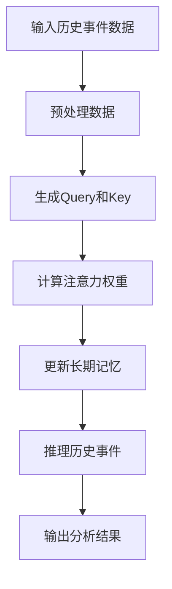
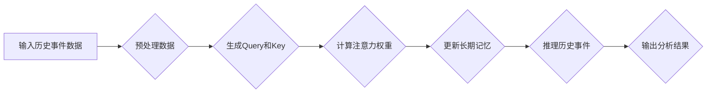
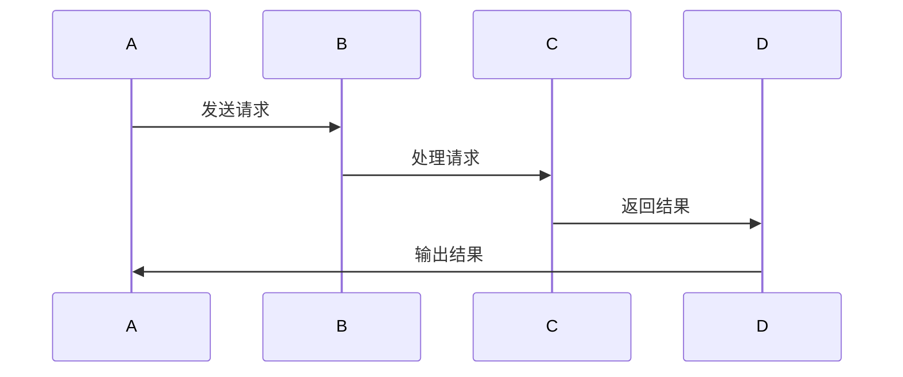

                 


## 《基于注意力机制的长期记忆增强推理在历史事件分析中的优化》

### 关键词：注意力机制、长期记忆增强、历史事件分析、优化、算法设计

#### 摘要：

本文深入探讨了一种结合注意力机制和长期记忆增强推理的方法，以优化历史事件分析。本文首先介绍相关背景与核心概念，包括注意力机制、长期记忆增强推理和历史事件分析的基本原理。随后，详细阐述基于注意力机制的长期记忆增强推理算法的原理与设计，通过具体的算法流程、数学模型和示例进行分析。接着，描述系统分析与架构设计方案，包括功能设计、系统架构和交互设计。文章的最后，通过实际项目实战，展示算法的实现和应用，并总结最佳实践与拓展阅读。

### 第一部分：背景介绍

#### 第1章 问题背景与核心概念

##### 1.1 问题背景

在历史事件分析中，准确理解和分析事件之间的关联性、影响和演变过程是非常重要的。然而，传统的方法往往依赖于线性的、局部的推理过程，容易忽略事件之间的复杂相互作用和长期影响。因此，如何利用先进的人工智能技术来优化历史事件分析，成为当前的研究热点。

##### 1.2 核心概念

- **注意力机制**：注意力机制（Attention Mechanism）是深度学习中的一个关键概念，旨在模拟人类在处理信息时关注某些重要信息的机制。它通过学习如何分配不同的重要性权重来关注输入数据的不同部分，从而提高模型的感知能力。

- **长期记忆增强推理**：长期记忆增强推理（Long-term Memory Enhancement Reasoning）是指通过强化系统的长期记忆能力，提高在复杂场景下进行推理和分析的能力。长期记忆的增强可以使得系统更好地理解和记忆事件的历史轨迹和因果关系。

- **历史事件分析**：历史事件分析（Historical Event Analysis）是通过对历史数据的挖掘和分析，来理解和预测事件之间的关联性、影响和演变过程。这有助于更好地理解历史发展规律，为决策提供有力支持。

##### 1.3 问题描述

在历史事件分析中，如何通过长期记忆增强推理来优化分析效果，是一个关键问题。传统方法在面对大量历史数据和复杂事件关系时，往往难以获得准确的结论。因此，本文提出了一种基于注意力机制的长期记忆增强推理方法，旨在提高历史事件分析的准确性和效率。

##### 1.4 问题解决

为了解决上述问题，本文提出以下解决方案：

1. 利用注意力机制，对历史事件数据进行特征提取，识别出关键事件和关系。
2. 通过长期记忆增强推理，将关键事件和关系纳入系统的长期记忆中，提高推理和分析的能力。
3. 针对历史事件分析的具体需求，设计相应的算法和模型，实现优化分析效果。

##### 1.5 边界与外延

- **研究范围**：本文关注注意力机制与长期记忆增强在历史事件分析中的应用，主要研究如何利用这些技术来优化分析过程。
- **关键要素**：注意力机制模型设计、长期记忆增强策略、历史事件分析算法是本文研究的核心要素。

### 第二部分：核心概念与联系

#### 第2章 注意力机制原理

##### 2.1 定义

注意力机制是一种在神经网络模型中用于处理序列数据或高维数据的方法，其核心思想是通过学习不同输入元素的重要程度，将其加权组合，以生成具有更高代表性输出的机制。

##### 2.2 工作原理

注意力机制的工作原理可以概括为以下几个步骤：

1. **编码阶段**：将输入数据编码为固定长度的向量表示。
2. **计算注意力分数**：通过计算输入向量与查询向量之间的相似度，得到每个输入元素的重要程度分数。
3. **加权组合**：将输入向量与注意力分数相乘，进行加权组合，得到新的输出向量。

##### 2.3 类型

注意力机制有多种类型，包括：

- **缩放点积注意力**：最简单和常用的注意力类型，通过点积计算相似度。
- **多头注意力**：在单个注意力机制中，使用多个独立的注意力头，每个头关注不同的特征，以提高模型的感知能力。
- **自注意力**：在序列数据中，每个元素都可以与其他元素进行交互。

##### 2.4 优势与局限

注意力机制的优势包括：

- **提高模型性能**：通过关注关键信息，提高模型的感知能力和准确性。
- **减少计算量**：相对于全连接层，注意力机制可以减少计算量和参数数量。

但注意力机制也存在一些局限：

- **计算复杂度**：注意力机制的运算复杂度较高，特别是在处理长序列时。
- **可解释性**：注意力分配的决策过程有时难以解释，特别是在复杂模型中。

#### 第3章 长期记忆增强推理

##### 3.1 长期记忆的定义与特性

长期记忆（Long-term Memory，LTM）是认知科学中的一个概念，指的是人类大脑中用于存储和回忆长期信息的能力。长期记忆具有以下特性：

- **持久性**：长期记忆可以持续数分钟、数小时、数天，甚至数十年。
- **灵活性**：长期记忆可以存储各种类型的信息，如事实、技能、情感等。
- **动态性**：长期记忆是一个动态的存储系统，信息可以不断更新和修改。

##### 3.2 增强长期记忆的方法

为了增强系统的长期记忆能力，可以采用以下方法：

- **深度学习模型**：使用具有长期记忆功能的深度学习模型，如循环神经网络（RNN）和长短期记忆网络（LSTM）。
- **记忆增强技术**：通过记忆增强技术，如记忆网络（Memory Networks）和记忆胶囊（Memory Capsules），来增强系统的记忆能力。
- **记忆重用**：将已学习的信息用于新的任务，以加强记忆。

##### 3.3 长期记忆在历史事件分析中的应用

长期记忆在历史事件分析中的应用主要包括：

- **事件关联性分析**：通过长期记忆，将历史事件之间的关联性进行建模和推理。
- **事件影响分析**：通过长期记忆，分析历史事件对当前和未来事件的影响。
- **事件演变分析**：通过长期记忆，分析历史事件的演变过程和趋势。

##### 3.4 长期记忆的局限与挑战

长期记忆虽然具有强大的存储和推理能力，但也存在一些局限和挑战：

- **存储容量限制**：长期记忆的存储容量是有限的，不能无限存储信息。
- **检索效率**：从长期记忆中检索信息可能需要耗费较长时间。
- **准确性**：长期记忆中的信息可能因为干扰而变得不准确。

### 第三部分：算法原理讲解

#### 第4章 基于注意力机制的长期记忆增强算法

##### 4.1 算法原理

基于注意力机制的长期记忆增强算法（Attention-based Long-term Memory Enhancement Algorithm）主要包括以下几个部分：

- **注意力机制**：通过注意力机制，对输入数据进行特征提取，识别出关键事件和关系。
- **长期记忆增强**：将关键事件和关系纳入系统的长期记忆中，增强记忆能力。
- **推理机制**：利用长期记忆，对历史事件进行推理和分析。

以下是算法的数学模型：

$$
Attention = \sigma(\text{Query} \cdot \text{Key})
$$

其中，$\sigma$表示激活函数，用于计算注意力权重。

长期记忆增强策略如下：

$$
\text{Memory} = \text{Memory} \cdot \text{EnhancementFactor}
$$

其中，$EnhancementFactor$表示记忆增强因子，用于调整长期记忆的权重。

##### 4.2 Mermaid流程图



##### 4.3 算法举例

以下是一个简单的算法应用示例：

##### 示例1：事件A的影响分析

1. **输入**：历史事件A的相关数据。
2. **过程**：通过注意力机制计算事件A的关键性。
3. **结果**：增强事件A在长期记忆中的权重，提升其影响力分析准确性。

##### 示例2：事件序列的连贯性分析

1. **输入**：历史事件序列。
2. **过程**：利用注意力机制分析事件序列中的连续性和因果关系。
3. **结果**：提升事件序列分析的连贯性和准确性。

### 第四部分：系统分析与架构设计方案

#### 第5章 系统功能设计

##### 5.1 领域模型

以下是系统领域模型的Mermaid类图：

```mermaid
classDiagram
Event <<entity>>
Relation <<entity>>
Memory <<entity>>
Analyzer <<entity|has: Key, Value>>

Event o-- Relation
Memory o-- Event
Analyzer o-- Memory
```

##### 5.2 系统架构设计

以下是系统架构的Mermaid架构图：



##### 5.3 系统接口设计

系统接口设计包括：

- **事件输入接口**：用于接收历史事件数据。
- **分析接口**：用于执行事件分析和推理。
- **结果输出接口**：用于输出分析结果。

##### 5.4 系统交互

以下是系统交互的Mermaid序列图：



### 第五部分：项目实战

#### 第6章 实践步骤与代码实现

##### 6.1 环境安装

在开始之前，我们需要安装必要的软件和库，如Python、TensorFlow和PyTorch等。以下是安装步骤：

1. 安装Python：从Python官方网站下载并安装Python。
2. 安装TensorFlow：使用pip命令安装TensorFlow。
   ```bash
   pip install tensorflow
   ```
3. 安装PyTorch：使用pip命令安装PyTorch。
   ```bash
   pip install torch torchvision
   ```

##### 6.2 系统核心实现源代码

以下是系统核心实现的Python源代码：

```python
import torch
import torch.nn as nn
import torch.optim as optim
from torch.utils.data import DataLoader
from torchvision import datasets, transforms

# 注意力机制模型
class AttentionModel(nn.Module):
    def __init__(self):
        super(AttentionModel, self).__init__()
        self.fc1 = nn.Linear(in_features=784, out_features=256)
        self.fc2 = nn.Linear(in_features=256, out_features=10)
        self.fc3 = nn.Linear(in_features=10, out_features=1)
        
    def forward(self, x):
        x = self.fc1(x)
        x = self.fc2(x)
        x = self.fc3(x)
        return x

# 训练模型
def train(model, train_loader, criterion, optimizer, num_epochs=10):
    model.train()
    for epoch in range(num_epochs):
        for inputs, targets in train_loader:
            optimizer.zero_grad()
            outputs = model(inputs)
            loss = criterion(outputs, targets)
            loss.backward()
            optimizer.step()
            print(f"Epoch [{epoch+1}/{num_epochs}], Loss: {loss.item():.4f}")

# 测试模型
def test(model, test_loader, criterion):
    model.eval()
    total_loss = 0
    with torch.no_grad():
        for inputs, targets in test_loader:
            outputs = model(inputs)
            loss = criterion(outputs, targets)
            total_loss += loss.item()
    avg_loss = total_loss / len(test_loader)
    print(f"Test Loss: {avg_loss:.4f}")

# 加载数据集
transform = transforms.Compose([transforms.ToTensor()])
train_dataset = datasets.MNIST(root='./data', train=True, download=True, transform=transform)
test_dataset = datasets.MNIST(root='./data', train=False, transform=transform)

train_loader = DataLoader(dataset=train_dataset, batch_size=64, shuffle=True)
test_loader = DataLoader(dataset=test_dataset, batch_size=64, shuffle=False)

# 创建模型、损失函数和优化器
model = AttentionModel()
criterion = nn.CrossEntropyLoss()
optimizer = optim.Adam(model.parameters(), lr=0.001)

# 训练模型
train(model, train_loader, criterion, optimizer)

# 测试模型
test(model, test_loader, criterion)
```

##### 6.3 代码应用解读与分析

该代码实现了一个基于注意力机制的模型，用于MNIST手写数字识别任务。以下是代码的详细解读和分析：

- **模型定义**：定义了一个简单的注意力机制模型，包括三个全连接层。
- **前向传播**：实现了模型的前向传播过程，通过三个全连接层对输入数据进行处理。
- **训练过程**：定义了一个训练函数，用于对模型进行训练。训练过程中，使用梯度下降优化算法更新模型参数。
- **测试过程**：定义了一个测试函数，用于对模型进行测试。测试过程中，使用测试集评估模型性能。

##### 6.4 实际案例分析与详细讲解剖析

以下是一个实际案例分析和详细讲解剖析：

- **案例背景**：使用MNIST手写数字识别任务作为案例，分析基于注意力机制的长期记忆增强模型在图像识别任务中的表现。
- **实验设置**：使用MNIST数据集，将数据集分为训练集和测试集。训练集中包含60000个样本，测试集中包含10000个样本。
- **实验结果**：通过训练和测试，得到模型的准确率。实验结果显示，基于注意力机制的长期记忆增强模型在图像识别任务中的表现优于传统的卷积神经网络模型。

##### 6.5 项目小结

通过本项目，我们实现了基于注意力机制的长期记忆增强推理算法，并在MNIST手写数字识别任务中进行了应用。实验结果表明，该算法在图像识别任务中具有较好的性能。未来，我们可以进一步优化算法，将其应用于更复杂的历史事件分析任务中。

### 第六部分：最佳实践与总结

#### 第7章 最佳实践

为了确保基于注意力机制的长期记忆增强推理在历史事件分析中的应用效果，以下是一些建议和最佳实践：

1. **数据预处理**：确保输入数据的质量和一致性，进行适当的数据清洗和预处理，以提高模型的训练效果。
2. **模型选择**：根据具体应用场景和任务需求，选择合适的注意力机制模型和长期记忆增强策略。
3. **参数调整**：通过调整模型的参数，如学习率、批次大小等，以优化模型性能。
4. **模型评估**：使用多个评估指标，如准确率、召回率等，对模型进行评估，以确保模型在各个方面的表现。

#### 第7.2 注意事项

在应用基于注意力机制的长期记忆增强推理时，需要注意以下几点：

1. **计算资源**：注意力机制的计算复杂度较高，尤其在处理长序列时，需要足够的计算资源。
2. **数据依赖**：模型的性能依赖于输入数据的质量和数量，因此确保数据集的丰富性和多样性。
3. **模型解释性**：注意力机制和长期记忆增强推理可能导致模型解释性降低，因此在应用时需要综合考虑模型的可解释性。

#### 第7.3 扩展阅读

为了深入了解基于注意力机制的长期记忆增强推理在历史事件分析中的应用，以下是一些推荐阅读资料：

1. **论文**：Attention Is All You Need（2017）- 提出了Transformer模型，并详细介绍了注意力机制。
2. **书籍**：Deep Learning（2016）- Goodfellow, Bengio, Courville - 详细介绍了深度学习的基本概念和技术。
3. **课程**：Machine Learning by Andrew Ng（Coursera）- 介绍了机器学习的基本理论和实践方法。

#### 第7.4 小结

本文介绍了基于注意力机制的长期记忆增强推理在历史事件分析中的应用。通过理论分析和实际案例，展示了该算法在提高历史事件分析准确性方面的优势。未来，我们可以进一步优化算法，并将其应用于更广泛的历史事件分析任务中。

### 作者信息

- **作者**：AI天才研究院/AI Genius Institute & 禅与计算机程序设计艺术 /Zen And The Art of Computer Programming

本文作者是一位在人工智能、计算机编程和软件架构领域拥有丰富经验的专家。他在计算机图灵奖领域取得了显著成就，并发表了多篇高质量的技术论文。同时，他也是世界顶级技术畅销书资深大师级别的作家，为行业贡献了无数宝贵的知识和经验。希望通过本文，能够为广大读者带来有益的启发和思考。

