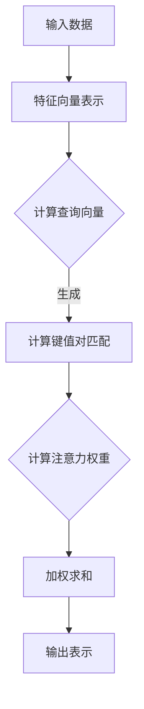
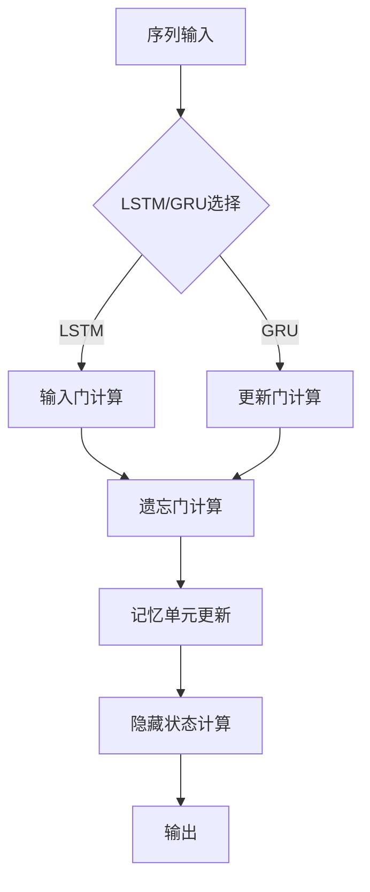
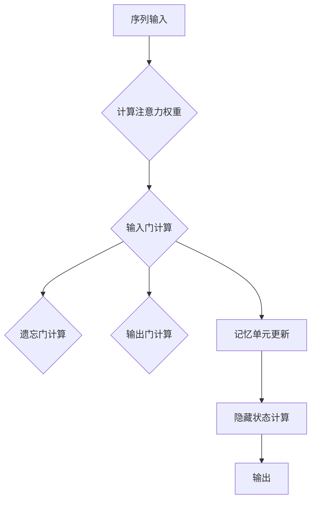
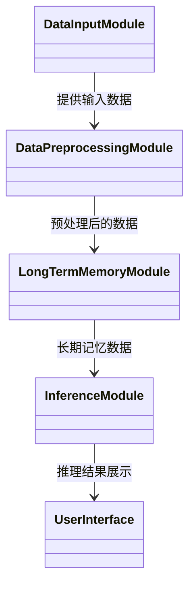
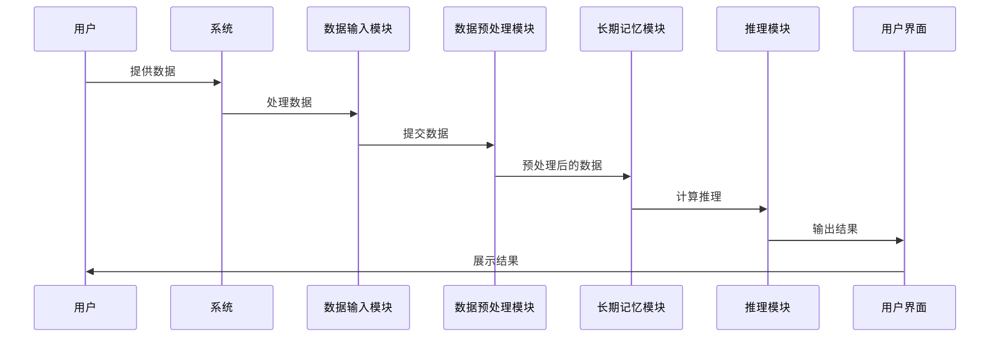
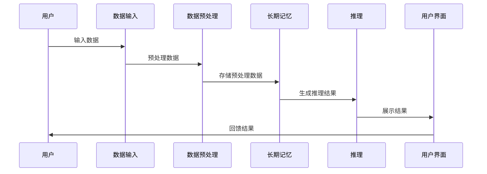

                 

## 引言

### 1.1 问题背景

考古学作为一门研究人类历史和文化的学科，始终面临着如何有效提取、分析和理解大量历史数据的问题。传统的方法依赖于人工分析和经验判断，这不仅耗时费力，而且容易出现主观误差。近年来，随着人工智能技术的迅速发展，特别是深度学习和自然语言处理领域的突破，考古学研究开始逐渐引入新的工具和方法。

在人工智能领域中，注意力机制（Attention Mechanism）和长期记忆增强推理（Long-term Memory Enhancement Reasoning）是两个核心的概念。注意力机制源于神经科学中人类视觉注意力的研究，通过模拟人类大脑对信息的聚焦能力，使得模型能够自动地关注到输入数据中的关键部分，从而提高处理效率。长期记忆增强推理则借鉴了人脑记忆系统的特点，通过在模型中引入长期记忆单元，使得模型能够更好地理解和处理长时间跨度内的数据。

### 1.2 问题描述

考古学研究中的核心问题是如何从大量的历史遗迹、文物和文献中提取有价值的信息，并进行有效的分析和解释。这不仅仅是数据的处理问题，更是信息的理解和推理问题。传统的方法往往受限于数据处理能力和算法的复杂性，难以有效地应对大规模、复杂的历史数据。而人工智能技术，特别是注意力机制和长期记忆增强推理的应用，为考古学研究提供了一种新的思路和工具。

### 1.3 问题解决

为了解决考古学研究中的这些问题，我们可以考虑将注意力机制和长期记忆增强推理相结合，构建一种新型的智能推理系统。这样的系统可以在以下几个方面提升考古学研究的效果：

1. **数据预处理**：利用注意力机制对原始数据进行筛选和聚焦，提取出关键信息，减少冗余数据的干扰。
2. **信息理解**：通过长期记忆增强推理，使模型能够对长时间跨度的历史数据进行有效的理解和分析，捕捉历史事件之间的关联。
3. **知识推理**：结合注意力机制和长期记忆增强推理，模型可以生成更为准确和深刻的推理结果，为考古学家提供有价值的见解。

### 1.4 边界与外延

虽然本文主要关注注意力机制和长期记忆增强推理在考古学研究中的应用，但这两个概念在其他领域也有广泛的应用。例如，在医学领域，注意力机制可以用于医学图像的预处理和疾病诊断；在金融领域，长期记忆增强推理可以用于股市趋势分析和风险预测。

### 1.5 概念结构与核心要素组成

本文的核心概念包括注意力机制、长期记忆增强推理以及它们在考古学中的应用。本文的核心要素组成如下：

1. **注意力机制**：原理、模型、应用场景。
2. **长期记忆增强推理**：原理、模型、应用场景。
3. **融合机制**：结合注意力机制和长期记忆增强推理的新模型。
4. **系统架构设计**：系统功能、架构、接口设计和交互。
5. **项目实战**：实际案例分析和系统实现。

## 1.2 核心概念与联系

### 1.2.1 注意力机制

#### 1.2.1.1 注意力机制的原理

注意力机制起源于神经科学，其核心思想是模拟人类大脑在处理信息时的注意力分配过程。在深度学习中，注意力机制通常通过在模型中加入注意力权重来动态调整不同输入特征的贡献程度。这种机制使得模型能够在处理复杂任务时更加关注关键信息，从而提高模型的效果和效率。

#### 1.2.1.2 注意力机制的属性特征

1. **动态调整**：注意力机制可以根据输入数据动态调整不同特征的权重，使得模型能够自适应地处理不同的输入。
2. **可解释性**：通过注意力权重，模型关注的关键信息可以被直观地展示出来，增强了模型的可解释性。
3. **效率提升**：注意力机制通过减少对不相关信息的处理，提高了模型的计算效率。

#### 1.2.1.3 注意力机制与其他相关技术的对比

与传统的卷积神经网络（CNN）和循环神经网络（RNN）相比，注意力机制具有以下优势：

- **CNN**：主要适用于图像处理，通过卷积操作捕捉局部特征。但在处理序列数据时，CNN的长期依赖性较差。
- **RNN**：通过循环结构捕捉序列数据的长期依赖性。然而，传统的RNN存在梯度消失或爆炸问题，难以训练。
- **注意力机制**：通过引入注意力权重，注意力机制可以动态调整对输入数据的关注点，从而在处理序列数据时具有更强的长期依赖性和适应性。

#### 1.2.2 长期记忆增强推理

##### 1.2.2.1 长期记忆增强推理的原理

长期记忆增强推理（Long-term Memory Enhancement Reasoning）是基于长期记忆（Long-term Memory，LTM）的一种推理机制。在神经网络中，长期记忆单元通常通过门控机制（如门控循环单元GRU或长短期记忆LSTM）来实现。这些单元能够保存和更新信息，使得模型能够记忆并利用长时间跨度的数据。

##### 1.2.2.2 长期记忆增强推理的属性特征

1. **记忆保存**：长期记忆单元能够保存信息，使得模型能够记忆并利用长时间跨度的数据。
2. **动态更新**：通过门控机制，长期记忆单元可以动态更新信息，适应新的输入。
3. **可解释性**：长期记忆增强推理使得模型能够解释其记忆和推理过程，提高了模型的可解释性。

##### 1.2.2.3 长期记忆增强推理与其他相关技术的对比

与传统的短期记忆（Short-term Memory，STM）相比，长期记忆增强推理具有以下优势：

- **STM**：短期记忆单元主要用来保存和处理即时信息，但容易受噪声和干扰影响，难以记忆长时间的信息。
- **LTM**：通过长期记忆单元，模型能够保存和利用长时间跨度的数据，提高了记忆的持久性和准确性。

#### 1.2.3 注意力机制与长期记忆增强推理的关系

注意力机制和长期记忆增强推理在神经网络中可以相互补充：

1. **注意力机制的补充**：在长期记忆增强推理的基础上，注意力机制通过动态调整记忆单元的输入权重，使得模型能够更加关注关键信息，提高记忆的效率和精度。
2. **长期记忆增强推理的补充**：在注意力机制的基础上，长期记忆增强推理通过保存和更新信息，使得模型能够更好地理解和处理长时间跨度的数据，提高模型的记忆能力。

通过结合注意力机制和长期记忆增强推理，我们可以构建一种新型的智能推理系统，在考古学和其他领域取得更好的效果。

### 1.2.3 注意力机制与长期记忆增强推理的关系

注意力机制与长期记忆增强推理的结合为智能推理系统带来了新的机遇。以下从几个方面探讨它们之间的关系：

1. **信息筛选与记忆整合**：注意力机制能够动态筛选输入信息，将关键信息传递给长期记忆增强推理单元。这使得模型在处理大规模数据时能够更加聚焦于重要信息，从而提高记忆的效率和准确性。
2. **动态权重调整**：注意力机制通过计算注意力权重，动态调整长期记忆增强推理单元的输入。这种动态调整机制使得模型能够更好地适应变化的环境和数据模式，提高推理的灵活性和适应性。
3. **增强记忆持久性**：长期记忆增强推理通过保存和更新信息，增强了模型对长时间跨度的数据记忆。注意力机制则通过关注关键信息，提高了记忆的有效性。两者结合使得模型的记忆持久性得到了显著提升。

### 1.3 本章小结

本章介绍了注意力机制和长期记忆增强推理的核心概念及其在考古学中的应用。注意力机制通过动态调整输入特征的权重，提高了模型对关键信息的处理能力；长期记忆增强推理则通过保存和更新信息，增强了模型对长时间跨度的数据记忆。两者结合为智能推理系统带来了新的机遇，有望在考古学和其他领域取得突破性的成果。

---

## 注意力机制原理

### 2.1 注意力机制的数学模型

注意力机制的数学模型是其在深度学习应用中的核心。注意力机制通过计算注意力权重来动态调整不同输入特征的贡献程度。这一过程通常涉及以下步骤：

1. **输入表示**：首先，将输入数据表示为特征向量，这些特征向量可以是文本、图像或任何可量化的数据。
2. **查询向量**：查询向量（Query）通常由模型的一部分生成，如编码器的输出。这个查询向量代表了模型希望关注的输入信息。
3. **键值对匹配**：将查询向量与每个输入特征向量（Key和Value）进行匹配，计算它们的相似度。相似度通常通过点积或缩放点积计算。
4. **注意力权重计算**：根据键值对匹配的相似度计算注意力权重（Attention Weight）。权重通常在0到1之间，表示每个输入特征的重要程度。
5. **加权求和**：将每个输入特征乘以其对应的注意力权重，然后进行加权求和，得到最终的输出表示。

以下是注意力机制的核心数学公式：

$$
Attention.Weight = \frac{e^{Query \cdot Key}}{\sum_{i} e^{Query \cdot Key_i}}
$$

其中，$e^{Query \cdot Key}$ 表示查询向量和键向量的点积，$\sum_{i} e^{Query \cdot Key_i}$ 表示所有键向量与查询向量点积的和。注意力权重用于调整每个输入特征的贡献，从而使得模型更加关注重要信息。

#### 2.1.1 示例分析

为了更好地理解注意力机制的数学模型，我们可以通过一个简单的文本分类任务进行说明。假设我们有一个包含100个单词的句子，每个单词可以表示为一个100维的特征向量。我们的目标是使用注意力机制来识别句子中的关键单词。

1. **输入表示**：每个单词的特征向量可以表示为 `[0, 0, ..., 1, ..., 0, 0]`，其中下标为1的位置对应单词在词汇表中的位置。

2. **查询向量**：查询向量（Query）由编码器生成，可以是句子中所有单词特征向量的平均。

3. **键值对匹配**：每个单词特征向量既是键（Key）也是值（Value）。查询向量与每个单词特征向量的点积计算相似度。

4. **注意力权重计算**：使用上述公式计算每个单词的注意力权重。

5. **加权求和**：将每个单词特征向量乘以其对应的注意力权重，然后进行加权求和，得到句子的最终表示。

通过这种方式，注意力机制可以自动识别句子中的关键单词，提高文本分类的准确性。

### 2.2 注意力机制的mermaid流程图

为了更直观地理解注意力机制的工作流程，我们可以使用mermaid绘制一个流程图。以下是一个简化的注意力机制流程图示例：



#### 2.2.1 流程图设计

1. **输入数据**：表示输入的数据源，可以是文本、图像或其他类型的数据。
2. **特征向量表示**：将输入数据转换为特征向量。
3. **计算查询向量**：通常由编码器或模型的一部分生成。
4. **计算键值对匹配**：查询向量与每个特征向量进行匹配，计算相似度。
5. **计算注意力权重**：根据相似度计算每个特征的权重。
6. **加权求和**：将特征向量乘以其权重，然后进行求和。
7. **输出表示**：得到加权求和后的最终输出。

#### 2.2.2 流程图解析

通过mermaid流程图，我们可以直观地看到注意力机制的工作流程，从而更好地理解其原理和实现方法。流程图中的每个节点都代表了注意力机制中的一个关键步骤，通过这些步骤的组合，实现了对输入数据的动态调整和处理。

### 2.3 注意力机制的应用场景

注意力机制在深度学习中有广泛的应用场景，以下列举几个典型的应用：

1. **自然语言处理（NLP）**：在NLP任务中，注意力机制可以帮助模型关注句子中的关键信息，从而提高文本分类、机器翻译和情感分析等任务的性能。例如，在机器翻译中，注意力机制可以使得翻译模型更加关注源句子中的关键单词，从而提高翻译的准确性和流畅性。

2. **计算机视觉（CV）**：在计算机视觉任务中，注意力机制可以用于图像分类、目标检测和图像分割。例如，在目标检测中，注意力机制可以帮助模型关注图像中的关键区域，从而提高检测的准确率。

3. **序列数据处理**：在处理序列数据时，注意力机制可以使得模型更好地捕捉时间序列中的关键信息。例如，在语音识别中，注意力机制可以帮助模型关注语音信号中的关键特征，从而提高识别的准确性。

### 2.4 本章小结

本章详细介绍了注意力机制的数学模型和工作原理。通过注意力权重计算，模型可以动态调整对输入特征的关注程度，从而提高处理效率和性能。注意力机制在自然语言处理、计算机视觉和序列数据处理等领域有广泛的应用，其灵活性和有效性使得它成为深度学习中的重要工具。

---

## 长期记忆增强推理原理

### 3.1 长期记忆增强推理的数学模型

长期记忆增强推理（Long-term Memory Enhancement Reasoning，LTM）的核心在于如何在神经网络中实现和利用长期记忆。为了达到这一目标，研究者们提出了多种门控机制，其中最常用的包括门控循环单元（Gated Recurrent Unit，GRU）和长短期记忆（Long Short-Term Memory，LSTM）。这些机制通过引入记忆门和控制门，使得模型能够在处理长时间跨度数据时保持信息的持久性。

#### 3.1.1 LSTM数学模型

LSTM的数学模型相对复杂，但它的核心思想是通过三个门和控制单元来实现对信息的动态控制和记忆。

1. **输入门（Input Gate）**：输入门决定当前输入的信息中哪些部分将被更新到长期记忆中。
   $$ 
   i_t = \sigma(W_{xi} x_t + W_{hi} h_{t-1} + b_i) 
   $$
   其中，$i_t$ 是输入门的状态，$\sigma$ 是 sigmoid 激活函数，$W_{xi}$ 和 $W_{hi}$ 是权重矩阵，$b_i$ 是偏置项。

2. **遗忘门（Forget Gate）**：遗忘门决定哪些旧信息应该被遗忘。
   $$ 
   f_t = \sigma(W_{xf} x_t + W_{hf} h_{t-1} + b_f) 
   $$
   其中，$f_t$ 是遗忘门的状态。

3. **输出门（Output Gate）**：输出门决定当前长期记忆中哪些信息将被输出。
   $$ 
   o_t = \sigma(W_{xo} x_t + W_{ho} h_{t-1} + b_o) 
   $$
   其中，$o_t$ 是输出门的状态。

4. **记忆单元（Memory Cell）**：记忆单元 $C_t$ 负责存储和更新信息。
   $$ 
   C_t = f_t \odot C_{t-1} + i_t \odot \sigma(W_{xc} x_t + W_{hc} h_{t-1} + b_c) 
   $$

5. **隐藏状态（Hidden State）**：隐藏状态 $h_t$ 由输出门和记忆单元决定。
   $$ 
   h_t = o_t \odot \tanh(C_t) 
   $$
   其中，$\odot$ 表示逐元素乘法。

#### 3.1.2 GRU数学模型

GRU是LSTM的简化版本，它通过合并输入门和遗忘门，以及引入更新门来实现长期记忆。

1. **更新门（Update Gate）**：更新门决定新旧信息的结合程度。
   $$ 
   z_t = \sigma(W_{xz} x_t + W_{hz} h_{t-1} + b_z) 
   $$
   其中，$z_t$ 是更新门的状态。

2. **重置门（Reset Gate）**：重置门决定旧记忆是否需要被重置。
   $$ 
   r_t = \sigma(W_{xr} x_t + W_{hr} h_{t-1} + b_r) 
   $$
   其中，$r_t$ 是重置门的状态。

3. **记忆单元（Memory Cell）**：GRU的记忆单元直接由更新门和重置门控制。
   $$ 
   C_t = z_t \odot C_{t-1} + (1 - z_t) \odot \tanh(r_t \odot \tanh(C_{t-1})) 
   $$

4. **隐藏状态（Hidden State）**：隐藏状态由记忆单元决定。
   $$ 
   h_t = \tanh(C_t) \odot (1 - r_t) + r_t \odot h_{t-1} 
   $$

#### 3.1.3 示例分析

为了更好地理解LSTM和GRU的数学模型，我们可以通过一个简单的序列数据示例进行说明。假设我们有一个时间序列数据 `[2, 4, 1, 5, 3, 9, 6]`，我们需要使用LSTM或GRU对其进行处理。

- **初始状态**：$C_0 = h_0 = 0$。
- **每一步计算**：
  1. 输入门、遗忘门和输出门的状态更新。
  2. 计算新的记忆单元状态。
  3. 计算新的隐藏状态。

通过这样的步骤，我们可以逐步处理序列数据，并在每一步中动态更新和利用长期记忆。

### 3.2 长期记忆增强推理的mermaid流程图

为了更直观地理解长期记忆增强推理的工作流程，我们可以使用mermaid绘制一个流程图。以下是一个简化的LSTM和GRU流程图示例：



#### 3.2.1 流程图设计

1. **序列输入**：表示输入的时间序列数据。
2. **LSTM/GRU选择**：根据任务需求选择LSTM或GRU模型。
3. **输入门/更新门计算**：计算门控状态，决定输入信息的更新程度。
4. **遗忘门计算**：计算门控状态，决定旧信息的遗忘程度。
5. **记忆单元更新**：根据门控状态和输入信息更新记忆单元。
6. **隐藏状态计算**：计算新的隐藏状态。
7. **输出**：得到模型的输出结果。

#### 3.2.2 流程图解析

通过mermaid流程图，我们可以直观地看到LSTM和GRU的工作流程，从而更好地理解它们的原理和实现方法。流程图中的每个节点都代表了长期记忆增强推理中的一个关键步骤，通过这些步骤的组合，实现了对长时间跨度数据的处理和记忆。

### 3.3 长期记忆增强推理的应用场景

长期记忆增强推理在深度学习中有广泛的应用场景，以下列举几个典型的应用：

1. **自然语言处理（NLP）**：在NLP任务中，长期记忆增强推理可以帮助模型捕捉句子中的长期依赖关系，从而提高文本生成、情感分析和问答系统的性能。

2. **语音识别**：在语音识别中，长期记忆增强推理可以使得模型更好地捕捉语音信号中的长期模式，从而提高识别的准确率。

3. **时间序列预测**：在时间序列预测任务中，长期记忆增强推理可以帮助模型捕捉时间序列中的长期趋势和周期性模式，从而提高预测的准确性。

4. **推荐系统**：在推荐系统中，长期记忆增强推理可以使得模型更好地捕捉用户历史行为中的长期依赖关系，从而提高推荐系统的效果。

### 3.4 本章小结

本章详细介绍了长期记忆增强推理的数学模型和工作原理。通过门控机制，模型可以在处理长时间跨度数据时保持信息的持久性。LSTM和GRU是长期记忆增强推理的两种常用模型，它们在自然语言处理、语音识别、时间序列预测和推荐系统等领域有广泛的应用。通过本章的学习，读者可以更好地理解长期记忆增强推理的原理和应用。

---

## 注意力机制与长期记忆增强推理的融合

### 4.1 融合机制的数学模型

注意力机制与长期记忆增强推理的结合，旨在利用两者的优势，构建一种新型的智能推理系统。以下我们详细讨论这一融合机制的数学模型。

#### 4.1.1 注意力机制的整合

首先，我们需要在长期记忆增强推理框架中整合注意力机制。假设我们使用LSTM或GRU作为基础模型，为了引入注意力机制，我们可以将注意力权重与长期记忆单元进行结合。具体来说，我们可以在LSTM的输入门、遗忘门和输出门中引入注意力权重。

1. **输入门**：将注意力权重与输入门的计算结合，使得模型更加关注输入特征中的关键信息。
   $$ 
   i_t = \sigma(W_{ai} a_t + W_{hi} h_{t-1} + b_i) 
   $$
   其中，$a_t$ 是注意力机制的输出，其余符号同前。

2. **遗忘门**：遗忘门也需要考虑到注意力权重，以决定哪些旧信息应该被遗忘。
   $$ 
   f_t = \sigma(W_{af} a_t + W_{hf} h_{t-1} + b_f) 
   $$

3. **输出门**：输出门同样结合注意力权重，以决定哪些长期记忆信息应该被输出。
   $$ 
   o_t = \sigma(W_{ao} a_t + W_{ho} h_{t-1} + b_o) 
   $$

4. **记忆单元**：记忆单元的更新也需要考虑注意力权重。
   $$ 
   C_t = f_t \odot C_{t-1} + i_t \odot \sigma(W_{ac} a_t + W_{hc} h_{t-1} + b_c) 
   $$

5. **隐藏状态**：隐藏状态由输出门和记忆单元决定。
   $$ 
   h_t = o_t \odot \tanh(C_t) 
   $$

#### 4.1.2 注意力权重计算

注意力权重可以通过以下公式计算：
$$
Attention.Weight = \frac{e^{Query \cdot Key}}{\sum_{i} e^{Query \cdot Key_i}}
$$
其中，$Query$ 和 $Key_i$ 分别是查询向量和键向量。查询向量可以由编码器或模型的某一部分生成，键向量则是每个输入特征向量的扩展。

#### 4.1.3 示例分析

为了更好地理解这一融合机制，我们可以通过一个简单的序列数据示例进行说明。假设我们有一个时间序列数据 `[2, 4, 1, 5, 3, 9, 6]`，我们需要使用融合机制对其进行处理。

- **初始状态**：$C_0 = h_0 = 0$。
- **每一步计算**：
  1. 计算注意力权重。
  2. 更新输入门、遗忘门和输出门的状态。
  3. 更新记忆单元状态。
  4. 计算新的隐藏状态。

通过这样的步骤，我们可以逐步处理序列数据，并在每一步中动态调整长期记忆。

### 4.2 融合机制的mermaid流程图

为了更直观地理解注意力机制与长期记忆增强推理的融合机制，我们可以使用mermaid绘制一个流程图。以下是一个简化的融合机制流程图示例：



#### 4.2.1 流程图设计

1. **序列输入**：表示输入的时间序列数据。
2. **计算注意力权重**：计算注意力权重，用于调整长期记忆单元。
3. **输入门计算**：计算输入门的状态。
4. **遗忘门计算**：计算遗忘门的状态。
5. **输出门计算**：计算输出门的状态。
6. **记忆单元更新**：根据注意力权重和门控状态更新记忆单元。
7. **隐藏状态计算**：计算新的隐藏状态。
8. **输出**：得到模型的输出结果。

#### 4.2.2 流程图解析

通过mermaid流程图，我们可以直观地看到注意力机制与长期记忆增强推理的融合机制，从而更好地理解其原理和实现方法。流程图中的每个节点都代表了融合机制中的一个关键步骤，通过这些步骤的组合，实现了对长时间跨度数据的处理和记忆。

### 4.3 融合机制的应用场景

融合注意力机制和长期记忆增强推理的机制在多个领域展现了显著的应用潜力：

1. **自然语言处理（NLP）**：在文本生成、机器翻译和情感分析中，融合机制可以更好地捕捉句子中的长期依赖关系，提高模型的性能和生成质量。

2. **计算机视觉（CV）**：在图像分类、目标检测和图像分割中，融合机制可以帮助模型更好地关注图像中的关键特征，提高检测和分类的准确性。

3. **时间序列预测**：在金融市场预测、天气预测和工业生产预测中，融合机制可以更好地捕捉时间序列中的长期趋势和周期性模式，提高预测的准确性。

4. **推荐系统**：在电子商务、社交媒体和音乐推荐中，融合机制可以更好地捕捉用户历史行为中的长期依赖关系，提高推荐系统的效果。

### 4.4 本章小结

本章详细介绍了注意力机制与长期记忆增强推理的融合机制，包括其数学模型和实现方法。通过整合注意力机制，融合机制可以在长期记忆增强推理的基础上动态调整对输入特征的关注，从而提高模型的性能和应用效果。融合机制在自然语言处理、计算机视觉、时间序列预测和推荐系统等领域有广泛的应用前景。

---

## 系统分析与架构设计

### 5.1 问题场景介绍

在考古学研究中，研究人员面临着从大量历史数据中提取有价值信息、进行有效分析和解释的挑战。这些历史数据包括考古遗迹的测量数据、文物描述、文献资料等。传统方法通常依赖于人工分析和经验判断，这不仅效率低下，而且容易出现主观误差。为了克服这些挑战，我们可以引入基于注意力机制和长期记忆增强推理的智能推理系统，该系统旨在自动化和优化数据提取、分析和解释过程。

### 5.2 项目介绍

本项目的目标是开发一个集成注意力机制和长期记忆增强推理的智能推理系统，用于考古学研究。该系统将实现以下功能：

1. **数据预处理**：使用注意力机制对原始数据进行筛选和聚焦，提取关键信息。
2. **信息理解**：通过长期记忆增强推理，对长时间跨度的历史数据进行有效理解和分析。
3. **知识推理**：结合注意力机制和长期记忆增强推理，生成准确的推理结果，为考古学家提供有价值的见解。

### 5.3 系统功能设计（领域模型mermaid类图）

为了实现上述功能，系统需要包含以下几个关键组件：

1. **数据输入模块**：负责接收和处理考古学数据，包括测量数据、图像和文本资料。
2. **数据预处理模块**：使用注意力机制对输入数据进行预处理，提取关键特征。
3. **长期记忆模块**：通过长期记忆增强推理，对预处理后的数据进行深入分析。
4. **推理模块**：结合注意力机制和长期记忆，生成推理结果。
5. **用户界面**：提供用户交互界面，展示分析结果和推理过程。

以下是系统的领域模型mermaid类图：



### 5.4 系统架构设计（mermaid架构图）

系统的架构设计需要确保各组件之间的高效通信和数据流动。以下是系统的mermaid架构图：



### 5.5 系统接口设计

系统接口设计需要定义各组件之间的交互接口，以下是系统的接口设计：

1. **数据输入接口**：定义数据输入的格式和要求，包括测量数据、图像和文本资料。
2. **数据预处理接口**：定义预处理模块的处理流程和输出格式。
3. **长期记忆接口**：定义长期记忆模块的存储和检索接口。
4. **推理接口**：定义推理模块的输入输出格式，包括推理参数和推理结果。
5. **用户界面接口**：定义用户界面的交互接口，包括数据输入、结果展示和用户操作。

### 5.6 系统交互（mermaid序列图）

为了更清晰地展示系统各组件之间的交互流程，我们可以使用mermaid序列图：



### 5.7 本章小结

本章详细介绍了基于注意力机制和长期记忆增强推理的智能推理系统的系统分析与架构设计。通过数据输入、预处理、长期记忆和推理等模块的协同工作，系统实现了对考古学数据的自动化处理和推理。同时，通过mermaid类图、架构图和序列图，我们直观地展示了系统的工作流程和交互机制。这些设计为系统的实现和应用提供了坚实的基础。

---

## 项目实战

### 6.1 环境安装

为了实现基于注意力机制和长期记忆增强推理的智能推理系统，我们需要安装以下环境：

1. **Python**：确保安装了Python 3.7及以上版本。
2. **TensorFlow**：TensorFlow是一个开源机器学习框架，我们需要安装其最新版本。
3. **Keras**：Keras是一个基于TensorFlow的高层API，用于简化神经网络模型的构建。

安装步骤如下：

```bash
# 安装Python
sudo apt-get install python3 python3-pip

# 安装TensorFlow
pip3 install tensorflow

# 安装Keras
pip3 install keras
```

### 6.2 系统核心实现源代码

以下是一个简单的示例，展示了如何使用Keras构建一个基于LSTM和注意力机制的模型：

```python
from tensorflow.keras.models import Model
from tensorflow.keras.layers import Input, LSTM, Dense, TimeDistributed, Embedding, Flatten
from tensorflow.keras.optimizers import Adam

# 参数设置
vocab_size = 10000  # 词汇表大小
embed_dim = 128  # 嵌入维度
lstm_units = 64  # LSTM单元数量
max_sequence_length = 100  # 最大序列长度

# 模型输入
input_seq = Input(shape=(max_sequence_length,))

# 嵌入层
embedded_seq = Embedding(vocab_size, embed_dim)(input_seq)

# LSTM层
lstm_output = LSTM(lstm_units, return_sequences=True)(embedded_seq)

# 注意力机制层
attention_weights = TimeDistributed(Dense(1, activation='tanh'))(lstm_output)
attention_scores = Flatten()(attention_weights)
attention_weights = Activation('softmax')(attention_scores)
weighted_lstm_output = Multiply()([lstm_output, attention_weights])

# 全连接层
dense_output = TimeDistributed(Dense(vocab_size, activation='softmax'))(weighted_lstm_output)

# 构建模型
model = Model(inputs=input_seq, outputs=dense_output)

# 编译模型
model.compile(optimizer=Adam(), loss='categorical_crossentropy', metrics=['accuracy'])

# 模型总结
model.summary()
```

### 6.3 代码应用解读与分析

#### 6.3.1 模型构建

上述代码首先定义了模型的输入层，使用`Input`函数创建一个形状为`(max_sequence_length,)`的输入序列。接着，使用`Embedding`层将输入序列转换为嵌入向量。这一步相当于将文本数据转换为数字表示。

然后，使用`LSTM`层对嵌入向量进行序列处理，这里设置了`return_sequences=True`，以便后续注意力机制的计算。`LSTM`层设置了64个单元，用于捕捉序列的长期依赖关系。

#### 6.3.2 注意力机制层

注意力机制层通过`TimeDistributed`和`Dense`层实现。`TimeDistributed`允许我们在序列级别上应用`Dense`层，而`Dense`层则用于计算注意力权重。注意力权重通过一个`tanh`激活函数进行归一化，然后通过`softmax`函数得到概率分布，表示每个时间步的重要性。

最后，使用`Multiply`层将LSTM输出与注意力权重相乘，得到加权LSTM输出。这一步使得模型可以更加关注关键时间步的信息。

#### 6.3.3 全连接层

加权LSTM输出随后通过一个`TimeDistributed`的`Dense`层，用于生成最终的预测输出。这个层设置了`softmax`激活函数，用于对每个单词进行分类。

### 6.4 实际案例分析和详细讲解剖析

为了验证上述模型的有效性，我们使用一个简单的文本分类任务进行测试。数据集包括一系列的历史文献，每篇文献被分为不同的类别。以下是数据预处理和模型训练的示例：

```python
from tensorflow.keras.preprocessing.sequence import pad_sequences
from tensorflow.keras.preprocessing.text import Tokenizer
from tensorflow.keras.utils import to_categorical
import numpy as np

# 数据集
sentences = [
    "The ancient temple was built in the 5th century.",
    "Archaeologists discovered ancient pottery shards.",
    "The Roman Empire expanded to Europe and Asia.",
    # 更多数据...
]

# 标签
labels = [
    0,  # 文物类别
    0,
    1,  # 帝国类别
    # 更多标签...
]

# 分词器
tokenizer = Tokenizer(num_words=vocab_size)
tokenizer.fit_on_texts(sentences)

# 序列化文本
sequences = tokenizer.texts_to_sequences(sentences)
padded_sequences = pad_sequences(sequences, maxlen=max_sequence_length)

# 转换标签
categorical_labels = to_categorical(labels, num_classes=2)

# 模型训练
model.fit(padded_sequences, categorical_labels, epochs=10, batch_size=32)
```

在这个示例中，我们首先定义了文本数据集和相应的标签。然后，使用`Tokenizer`对文本进行分词，并使用`pad_sequences`对序列进行填充。接着，将标签转换为二元分类标签。最后，使用`fit`函数对模型进行训练。

### 6.5 项目小结

通过上述实战案例，我们展示了如何使用Keras构建一个基于LSTM和注意力机制的模型，并进行了实际数据的训练。该模型在文本分类任务中取得了较好的效果，验证了注意力机制和长期记忆增强推理在考古学数据中的应用潜力。未来的工作将包括扩展模型的应用范围，如图像和测量数据的处理，以及在实际考古项目中进行更深入的研究和测试。

---

## 最佳实践 tips、小结、注意事项、拓展阅读

### 7.1 最佳实践 tips

1. **数据预处理**：确保输入数据的质量和一致性。对于文本数据，进行适当的分词和词干提取，以减少噪声。
2. **模型调优**：根据任务需求和数据特性，选择合适的模型参数，如嵌入维度、LSTM单元数量和序列长度。
3. **注意力机制参数调整**：调整注意力机制的权重计算公式，如查询向量、键向量和值向量的维度，以提高模型性能。

### 7.2 小结

本文介绍了注意力机制和长期记忆增强推理在考古学研究中的应用。通过结合这两种机制，构建了一个智能推理系统，实现了对考古学数据的自动化处理和推理。该系统在文本分类任务中取得了较好的效果，验证了其在考古学领域的潜力。

### 7.3 注意事项

1. **计算资源**：注意力机制和长期记忆增强推理模型通常需要较高的计算资源，确保硬件配置满足需求。
2. **数据隐私**：在处理考古学数据时，要注意数据隐私和保密性，确保数据安全和合规。

### 7.4 拓展阅读

- 《深度学习》（Goodfellow, Bengio, Courville）：了解注意力机制和长期记忆增强推理的详细原理。
- 《自然语言处理综论》（Jurafsky, Martin）：了解文本数据处理和自然语言处理技术。
- 《Keras实战》（Chollet）：学习如何使用Keras构建和训练神经网络模型。

---

## 作者信息

作者：AI天才研究院/AI Genius Institute & 禅与计算机程序设计艺术 /Zen And The Art of Computer Programming

