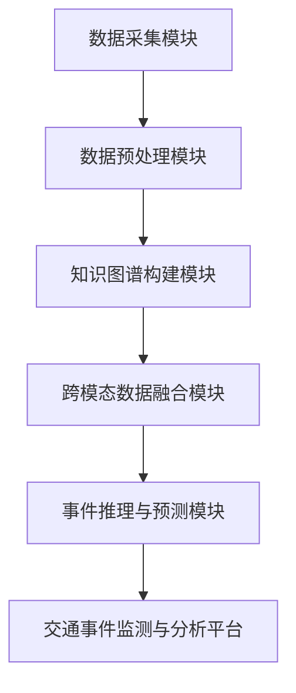
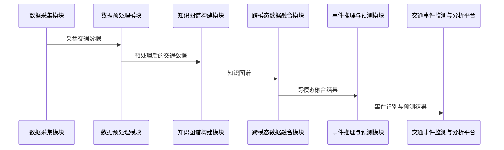

                 

## 基于知识图谱的跨模态事件推理与预测

### 关键词：知识图谱、跨模态数据融合、事件推理、预测模型、人工智能

> 摘要：本文围绕知识图谱的跨模态事件推理与预测展开，旨在探讨如何通过构建知识图谱、融合多模态数据，实现事件的有效识别与预测。文章首先介绍了事件推理与预测的重要性及知识图谱的发展与应用，然后详细阐述了跨模态事件推理与预测的基本概念、研究方法与目标，接着深入分析了知识图谱构建基础、跨模态数据融合方法及事件推理与预测模型，最后通过具体算法原理和实践，展示了基于知识图谱的跨模态事件推理与预测的完整实现过程。本文旨在为研究人员和开发者提供有价值的参考，推动跨模态事件推理与预测领域的发展。

### 第一部分：背景与基础

#### 1. 引言

##### 1.1 研究背景

在当今信息化社会中，数据爆炸式增长，尤其是跨模态数据的日益丰富，为事件推理与预测带来了巨大的挑战。跨模态事件推理与预测涉及到多种数据类型，如图像、文本、声音、视频等，这些数据在内容和形式上存在巨大差异，给数据融合和事件识别带来了极大的困难。然而，事件推理与预测在智能交通、安防监控、医疗诊断、金融风控等领域具有广泛的应用前景，是人工智能研究的重要方向。

##### 1.1.1 事件推理与预测的重要性

事件推理与预测是人工智能领域的关键技术之一，它通过对历史数据和实时数据的分析，推断出未来的事件发展趋势。在智能交通领域，事件推理与预测可以帮助预测交通流量，优化交通管理，减少拥堵；在安防监控领域，事件推理与预测可以帮助识别异常行为，提高安全防范能力；在医疗诊断领域，事件推理与预测可以帮助预测疾病发展趋势，为患者提供个性化治疗方案；在金融风控领域，事件推理与预测可以帮助预测金融风险，提高风险管理能力。

##### 1.1.2 知识图谱的发展与应用

知识图谱作为一种结构化的语义表示方法，近年来在人工智能领域取得了显著的进展。知识图谱通过将实体、属性和关系以图谱的形式进行表示，使得数据更加结构化和语义化，为事件推理与预测提供了重要的支持。知识图谱的应用包括搜索引擎、智能问答、推荐系统、知识图谱挖掘等。

##### 1.1.3 跨模态数据融合的挑战与机遇

跨模态数据融合是事件推理与预测的关键环节，它涉及到多种数据类型的整合和分析。跨模态数据融合面临的挑战包括数据不一致性、数据缺失、数据冗余等问题。然而，随着人工智能技术的发展，尤其是深度学习在图像、文本、声音等领域的应用，为跨模态数据融合提供了新的机遇。

#### 1.2 跨模态事件推理与预测概述

##### 1.2.1 跨模态数据融合

跨模态数据融合是指将不同模态的数据进行整合，形成统一的数据表示，以便进行后续的事件推理与预测。跨模态数据融合的方法包括传统融合方法和基于深度学习的融合方法。

1. **跨模态数据类型与特征**

   - 图像数据：颜色、纹理、形状、位置等特征。
   - 文本数据：词频、词嵌入、语法结构等特征。
   - 声音数据：音高、音强、时长、频率等特征。
   - 视频数据：运动轨迹、视频帧序列等特征。

2. **跨模态数据融合方法**

   - 传统融合方法：特征级融合、决策级融合等。
   - 基于深度学习的融合方法：卷积神经网络、循环神经网络、 Transformer模型等。

##### 1.2.2 事件推理与预测

事件推理与预测是指基于历史数据和实时数据，推断出未来的事件发展趋势。事件推理与预测的方法包括事件识别和事件预测。

1. **事件识别与分类**

   - 事件识别：识别出数据中的事件。
   - 事件分类：将事件分为不同的类别。

2. **事件预测与场景模拟**

   - 事件预测：预测未来的事件发展趋势。
   - 场景模拟：模拟不同事件发生后的场景。

#### 1.3 研究方法与目标

1. **研究方法**

   - **知识图谱构建**：通过数据采集、数据清洗、数据转换、数据融合等方法构建知识图谱。
   - **跨模态数据融合**：采用传统融合方法和基于深度学习的融合方法，实现跨模态数据融合。
   - **事件推理与预测**：基于知识图谱和跨模态数据融合结果，实现事件识别与预测。

2. **研究目标**

   - 构建一个基于知识图谱的跨模态事件推理与预测系统，实现对事件的有效识别与预测。
   - 探索跨模态数据融合与事件推理的优化方法，提高系统的准确性和效率。

#### 1.4 边界与外延

1. **研究范围**

   - 研究范围包括知识图谱构建、跨模态数据融合、事件推理与预测等方面。

2. **研究限制**

   - 受限于数据和计算资源，研究主要集中在特定领域和场景。
   - 研究方法可能存在一定的局限性，需要进一步优化和改进。

#### 1.5 本章小结

本章介绍了基于知识图谱的跨模态事件推理与预测的研究背景、重要性、研究方法与目标，以及边界与外延。接下来，我们将深入探讨知识图谱构建基础、跨模态数据融合方法及事件推理与预测模型，为后续的研究提供理论基础和实践指导。

---

## 第二部分：核心概念与原理

### 2. 知识图谱构建基础

#### 2.1 知识图谱概述

##### 2.1.1 知识图谱的定义

知识图谱（Knowledge Graph）是一种语义网络，它通过实体、属性和关系的结构化表示，将现实世界中的信息进行语义化和关联，从而实现对复杂知识的组织和查询。

##### 2.1.2 知识图谱的结构与组成

知识图谱通常由三个主要部分组成：实体（Entity）、属性（Attribute）和关系（Relationship）。

- **实体**：表示现实世界中的个体，如人、地点、事物等。
- **属性**：描述实体的特征，如年龄、身高、地址等。
- **关系**：描述实体之间的关系，如属于、位于、参与等。

##### 2.1.3 知识图谱的层次结构

知识图谱通常具有层次结构，从低到高分别为：

1. **概念层次**：定义了基本的语义概念，如实体类别、属性类别等。
2. **关系层次**：定义了实体之间的关系，如父子关系、兄弟关系等。
3. **事实层次**：描述了具体的实体和关系，如张三是一名程序员、李四是张三的同事等。

#### 2.2 知识表示与存储

##### 2.2.1 语义网络表示

语义网络是一种基于图的结构，它通过边来表示实体之间的关系，并通过节点来表示实体和属性。

1. **节点**：表示实体和属性。
2. **边**：表示实体之间的关系。

##### 2.2.2 层次化知识表示

层次化知识表示是将知识图谱按照一定的层次结构进行组织，从而实现对复杂知识的有效管理和查询。

1. **概念层次**：定义了基本的语义概念。
2. **关系层次**：定义了实体之间的关系。
3. **事实层次**：描述了具体的实体和关系。

##### 2.2.3 图数据库与存储

图数据库是一种专门用于存储和查询图数据的数据库系统，它通过高效的图算法和数据结构，实现对知识图谱的快速查询和更新。

1. **图数据结构**：包括节点、边、属性等。
2. **图算法**：包括图遍历、路径搜索、子图匹配等。

#### 2.3 知识图谱构建方法

##### 2.3.1 数据采集

数据采集是知识图谱构建的基础，它涉及到数据的来源、数据的质量和数据的完整性。

1. **数据来源**：包括开放数据集、企业内部数据、互联网爬取等。
2. **数据质量**：包括数据准确性、一致性、完整性等。
3. **数据完整性**：包括数据覆盖范围、数据缺失处理等。

##### 2.3.2 数据清洗

数据清洗是数据预处理的重要步骤，它涉及到数据的清洗、去重、格式化等。

1. **数据清洗**：包括去除噪声数据、修复错误数据等。
2. **数据去重**：通过去重算法，去除重复的数据。
3. **数据格式化**：将数据转换为统一的格式，便于后续处理。

##### 2.3.3 数据转换

数据转换是将原始数据转换为知识图谱格式的过程，它涉及到数据的转换规则、数据类型的映射等。

1. **数据转换规则**：定义数据如何转换为实体、属性和关系。
2. **数据类型映射**：将原始数据类型映射到知识图谱中的实体、属性和关系。

##### 2.3.4 数据融合

数据融合是将多个数据源中的数据进行整合，形成统一的知识图谱的过程。

1. **数据源融合**：将多个数据源中的数据进行整合。
2. **数据一致性处理**：处理数据源之间的不一致性。

##### 2.3.5 知识抽取与推理

知识抽取是从原始数据中提取出知识的过程，知识推理是基于知识图谱中的知识进行推理，以获取新的知识。

1. **知识抽取**：包括实体抽取、关系抽取、属性抽取等。
2. **知识推理**：包括逻辑推理、图算法等。

### 3. 跨模态数据融合方法

#### 3.1 跨模态数据类型

跨模态数据融合涉及多种数据类型，包括图像、文本、声音、视频等。

##### 3.1.1 图像数据

图像数据是通过摄像头、手机等设备捕捉的二维图像，它包含了丰富的视觉信息。

1. **颜色**：图像的颜色信息。
2. **纹理**：图像的纹理信息。
3. **形状**：图像的形状信息。
4. **位置**：图像在场景中的位置信息。

##### 3.1.2 文本数据

文本数据是通过键盘、语音识别等方式获取的文字信息，它包含了丰富的语义信息。

1. **词频**：文本中的词频信息。
2. **词嵌入**：文本中的词嵌入信息。
3. **语法结构**：文本的语法结构信息。

##### 3.1.3 声音数据

声音数据是通过麦克风等设备捕捉的声音信号，它包含了丰富的音频信息。

1. **音高**：声音的音高信息。
2. **音强**：声音的音强信息。
3. **时长**：声音的时长信息。
4. **频率**：声音的频率信息。

##### 3.1.4 视频数据

视频数据是通过摄像头等设备捕捉的连续视频画面，它包含了丰富的动态信息。

1. **运动轨迹**：视频中的运动轨迹信息。
2. **视频帧序列**：视频的帧序列信息。

#### 3.2 跨模态特征提取

##### 3.2.1 图像特征提取

图像特征提取是将图像数据转换为特征向量，以便进行后续处理的过程。

1. **卷积神经网络（CNN）**：通过卷积操作提取图像特征。
2. **特征点提取**：通过特征点检测和匹配提取图像特征。

##### 3.2.2 文本特征提取

文本特征提取是将文本数据转换为特征向量，以便进行后续处理的过程。

1. **词向量**：通过词向量模型提取文本特征。
2. **词嵌入**：通过词嵌入模型提取文本特征。

##### 3.2.3 声音特征提取

声音特征提取是将声音数据转换为特征向量，以便进行后续处理的过程。

1. **梅尔频率倒谱系数（MFCC）**：通过 MFCC 提取声音特征。
2. **短时傅里叶变换（STFT）**：通过 STFT 提取声音特征。

##### 3.2.4 视频特征提取

视频特征提取是将视频数据转换为特征向量，以便进行后续处理的过程。

1. **运动矢量**：通过运动矢量提取视频特征。
2. **视觉注意力机制**：通过视觉注意力机制提取视频特征。

#### 3.3 跨模态数据融合算法

##### 3.3.1 传统融合方法

传统融合方法是将不同模态的数据进行整合，形成统一的数据表示，然后进行后续处理。

1. **特征级融合**：将不同模态的特征进行整合。
2. **决策级融合**：将不同模态的决策进行整合。

##### 3.3.2 基于深度学习的融合方法

基于深度学习的融合方法是通过深度学习模型实现跨模态数据的融合。

1. **卷积神经网络（CNN）**：通过 CNN 实现跨模态数据融合。
2. **循环神经网络（RNN）**：通过 RNN 实现跨模态数据融合。
3. **Transformer模型**：通过 Transformer 模型实现跨模态数据融合。

##### 3.3.3 融合框架与评价指标

跨模态数据融合的框架包括数据采集、数据预处理、特征提取、融合算法和性能评估等。

1. **数据采集**：包括不同模态的数据采集。
2. **数据预处理**：包括数据清洗、去重、归一化等。
3. **特征提取**：包括不同模态的特征提取。
4. **融合算法**：包括传统融合方法和基于深度学习的融合方法。
5. **性能评估**：包括准确率、召回率、F1值等评价指标。

### 4. 事件推理与预测模型

#### 4.1 事件推理概述

事件推理是指通过历史数据和实时数据，推断出未来的事件发展趋势。

##### 4.1.1 事件定义与分类

事件是指在一定时间和空间内发生的一系列相关行为和事件。

1. **事件定义**：事件是指在特定时间和空间内发生的一系列相关行为和事件。
2. **事件分类**：事件可以根据行为类型、时间范围、空间范围等进行分类。

##### 4.1.2 事件识别算法

事件识别是指从数据中识别出事件的过程。

1. **事件识别算法**：包括基于规则的方法、基于机器学习的方法、基于深度学习的方法等。

##### 4.1.3 事件预测算法

事件预测是指根据历史数据和实时数据，预测未来的事件发展趋势。

1. **事件预测算法**：包括基于统计的方法、基于机器学习的方法、基于深度学习的方法等。

#### 4.2 基于知识图谱的事件推理

##### 4.2.1 事件实体识别

事件实体识别是指从数据中识别出事件实体。

1. **事件实体识别算法**：包括基于规则的方法、基于机器学习的方法、基于深度学习的方法等。

##### 4.2.2 事件关系推理

事件关系推理是指根据事件实体和关系，推断出事件之间的关系。

1. **事件关系推理算法**：包括基于规则的方法、基于机器学习的方法、基于深度学习的方法等。

##### 4.2.3 事件时空预测

事件时空预测是指根据历史数据和实时数据，预测事件在未来时间和空间的发展趋势。

1. **事件时空预测算法**：包括基于统计的方法、基于机器学习的方法、基于深度学习的方法等。

#### 4.3 跨模态事件预测

##### 4.3.1 跨模态事件融合框架

跨模态事件融合框架是指将不同模态的数据进行整合，形成统一的数据表示，然后进行事件推理与预测。

1. **跨模态事件融合框架**：包括数据采集、数据预处理、特征提取、融合算法、事件推理与预测等。

##### 4.3.2 跨模态事件预测模型

跨模态事件预测模型是指根据历史数据和实时数据，预测未来的跨模态事件发展趋势。

1. **跨模态事件预测模型**：包括基于统计的方法、基于机器学习的方法、基于深度学习的方法等。

##### 4.3.3 实时事件预测与反馈

实时事件预测与反馈是指根据实时数据，预测未来的事件发展趋势，并根据预测结果进行调整和反馈。

1. **实时事件预测与反馈**：包括实时数据采集、实时事件识别、实时事件预测、实时反馈等。

### 5. 本章小结

本章介绍了知识图谱构建基础、跨模态数据融合方法及事件推理与预测模型，为后续研究提供了理论基础和实践指导。在下一章中，我们将详细讲解算法原理和实践，进一步探讨基于知识图谱的跨模态事件推理与预测的实现过程。

---

## 第三部分：算法原理与实践

### 5. 算法原理详细讲解

#### 5.1 知识图谱构建算法

知识图谱构建是一个复杂的过程，它包括数据采集、数据预处理、数据转换、数据融合、知识抽取和推理等多个环节。以下是知识图谱构建算法的详细讲解。

##### 5.1.1 数据采集与预处理

数据采集是知识图谱构建的第一步，它涉及到多种数据来源，如开放数据集、企业内部数据、网络爬取等。数据采集后，需要进行预处理，包括数据清洗、去重、格式化等操作。

1. **数据清洗**：数据清洗的主要目的是去除噪声数据、修复错误数据、填充缺失数据等。具体方法包括：

   - 去除重复数据：通过哈希函数或索引技术，去除重复的实体和关系。
   - 修复错误数据：通过数据修复算法，如插值、平均值替换等，修复错误的数据。
   - 填充缺失数据：通过数据插补算法，如均值插补、回归插补等，填充缺失的数据。

2. **数据去重**：数据去重是通过一定的算法，去除重复的数据。常用的去重算法包括哈希去重、索引去重等。

3. **数据格式化**：数据格式化是将不同来源的数据转换为统一格式的过程，以便进行后续处理。具体方法包括：

   - 字符串处理：将字符串进行规范化处理，如大小写转换、去除标点符号等。
   - 日期时间处理：将日期时间数据转换为标准格式，如YYYY-MM-DD HH:MM:SS。
   - 数字处理：将数字数据转换为标准格式，如整数、浮点数等。

##### 5.1.2 数据转换与融合

数据转换与融合是将原始数据转换为知识图谱格式的过程。具体方法如下：

1. **数据转换**：数据转换是将原始数据转换为实体、属性和关系的过程。具体方法包括：

   - 实体抽取：从原始数据中抽取实体，如人、地点、事物等。
   - 属性抽取：从原始数据中抽取实体的属性，如年龄、身高、地址等。
   - 关系抽取：从原始数据中抽取实体之间的关系，如属于、位于、参与等。

2. **数据融合**：数据融合是将多个数据源中的数据进行整合的过程。具体方法包括：

   - 基于共现关系的数据融合：通过共现关系，将多个数据源中的实体和关系进行融合。
   - 基于语义相似度的数据融合：通过语义相似度，将多个数据源中的实体和关系进行融合。
   - 基于上下文信息的数据融合：通过上下文信息，将多个数据源中的实体和关系进行融合。

##### 5.1.3 知识抽取与推理

知识抽取与推理是知识图谱构建的核心环节，它涉及到从原始数据中抽取知识，并利用推理算法，推断出新的知识。

1. **知识抽取**：知识抽取是指从原始数据中抽取实体、属性和关系的过程。具体方法包括：

   - 实体抽取：通过命名实体识别、关键词抽取等方法，从原始数据中抽取实体。
   - 属性抽取：通过实体关系抽取、模式匹配等方法，从原始数据中抽取实体的属性。
   - 关系抽取：通过实体关系抽取、模式匹配等方法，从原始数据中抽取实体之间的关系。

2. **推理**：推理是指利用知识图谱中的知识，推断出新的知识。具体方法包括：

   - 逻辑推理：通过逻辑规则，从已有知识中推断出新知识。
   - 图算法：通过图算法，如最短路径算法、社区发现算法等，从已有知识中推断出新知识。
   - 马尔可夫链：通过马尔可夫链，从已有知识中推断出新知识。

#### 5.2 跨模态数据融合算法

跨模态数据融合是将不同模态的数据进行整合，形成统一的数据表示，以便进行后续处理。以下是跨模态数据融合算法的详细讲解。

##### 5.2.1 图像特征提取

图像特征提取是将图像数据转换为特征向量的过程。以下是常见的图像特征提取方法：

1. **卷积神经网络（CNN）**：

   - CNN是一种深度学习模型，它通过卷积操作提取图像特征。

   - CNN的特征提取过程包括卷积层、池化层和全连接层。

   - 卷积层：通过卷积操作，将输入图像与卷积核进行卷积，提取图像特征。

   - 池化层：通过池化操作，将卷积层输出的特征进行压缩，减少参数数量。

   - 全连接层：通过全连接层，将池化层输出的特征映射到特定类别。

2. **特征点提取**：

   - 特征点提取是通过检测和匹配图像中的特征点，提取图像特征。

   - 常见的方法包括SIFT（尺度不变特征变换）和SURF（加速稳健特征变换）。

##### 5.2.2 文本特征提取

文本特征提取是将文本数据转换为特征向量的过程。以下是常见的文本特征提取方法：

1. **词向量**：

   - 词向量是一种将文本转换为向量的方法，它通过将文本中的每个词映射到一个向量。

   - 常见的词向量模型包括Word2Vec、GloVe等。

   - 词向量模型的优点包括：

     - 可以捕捉词与词之间的语义关系。

     - 可以用于文本分类、文本相似度计算等任务。

2. **词嵌入**：

   - 词嵌入是一种将文本转换为向量的方法，它通过将文本中的每个词映射到一个嵌入向量。

   - 词嵌入模型的优点包括：

     - 可以捕捉词与词之间的语义关系。

     - 可以用于文本分类、文本相似度计算等任务。

##### 5.2.3 跨模态融合算法

跨模态融合算法是将不同模态的数据进行整合，形成统一的数据表示。以下是常见的跨模态融合算法：

1. **加权融合**：

   - 加权融合是一种简单的跨模态融合方法，它通过给不同模态的数据分配不同的权重，进行融合。

   - 加权融合的公式为：

     $$ f(\text{x}, \text{y}) = w_1 \text{x} + w_2 \text{y} $$

     其中，$\text{x}$和$\text{y}$分别为不同模态的数据，$w_1$和$w_2$为权重。

2. **深度学习融合方法**：

   - 深度学习融合方法是一种基于深度学习的跨模态融合方法，它通过训练深度学习模型，实现跨模态数据的融合。

   - 常见的深度学习融合方法包括：

     - **多模态卷积神经网络（MM-CNN）**：MM-CNN是一种基于卷积神经网络的跨模态融合方法，它通过将不同模态的数据输入到卷积神经网络中，提取特征，然后进行融合。

     - **多模态循环神经网络（MM-RNN）**：MM-RNN是一种基于循环神经网络的跨模态融合方法，它通过将不同模态的数据输入到循环神经网络中，提取特征，然后进行融合。

     - **Transformer模型**：Transformer模型是一种基于自注意力机制的跨模态融合方法，它通过将不同模态的数据输入到Transformer模型中，提取特征，然后进行融合。

#### 5.3 事件推理与预测算法

事件推理与预测是指利用历史数据和实时数据，推断出未来的事件发展趋势。以下是事件推理与预测算法的详细讲解。

##### 5.3.1 事件识别算法

事件识别是指从数据中识别出事件的过程。以下是常见的事件识别算法：

1. **基于规则的方法**：

   - 基于规则的方法是一种简单的事件识别方法，它通过定义一系列规则，识别出事件。

   - 常见的规则包括：

     - 事件触发规则：当满足特定条件时，触发事件。

     - 事件持续时间规则：当事件持续超过特定时间时，识别为事件。

2. **基于机器学习的方法**：

   - 基于机器学习的方法是一种利用机器学习模型进行事件识别的方法，它通过训练机器学习模型，识别出事件。

   - 常见的机器学习模型包括：

     - 决策树：通过训练决策树模型，识别出事件。

     - 支持向量机（SVM）：通过训练SVM模型，识别出事件。

     - 随机森林：通过训练随机森林模型，识别出事件。

##### 5.3.2 事件预测算法

事件预测是指利用历史数据和实时数据，预测未来的事件发展趋势。以下是常见的事件预测算法：

1. **基于统计的方法**：

   - 基于统计的方法是一种利用统计方法进行事件预测的方法，它通过分析历史数据，预测未来事件。

   - 常见的统计方法包括：

     - 线性回归：通过线性回归模型，预测事件。

     - 时间序列分析：通过时间序列分析模型，预测事件。

2. **基于机器学习的方法**：

   - 基于机器学习的方法是一种利用机器学习模型进行事件预测的方法，它通过训练机器学习模型，预测未来事件。

   - 常见的机器学习模型包括：

     - 决策树：通过训练决策树模型，预测事件。

     - 支持向量机（SVM）：通过训练SVM模型，预测事件。

     - 随机森林：通过训练随机森林模型，预测事件。

3. **基于深度学习的方法**：

   - 基于深度学习的方法是一种利用深度学习模型进行事件预测的方法，它通过训练深度学习模型，预测未来事件。

   - 常见的深度学习模型包括：

     - 卷积神经网络（CNN）：通过训练CNN模型，预测事件。

     - 循环神经网络（RNN）：通过训练RNN模型，预测事件。

     - Transformer模型：通过训练Transformer模型，预测事件。

### 6. 系统分析与架构设计方案

#### 6.1 问题场景介绍

在智能交通领域，事件推理与预测具有重要的应用价值。例如，通过事件推理与预测，可以实时监测交通流量，预测交通事故的发生，优化交通管理，提高交通运行效率。以下是一个具体的应用场景：

- **场景描述**：在一个城市的交通监控系统中，安装了多个摄像头和传感器，实时采集交通数据，如车辆数量、行驶速度、交通拥堵状况等。系统需要通过事件推理与预测，识别出交通事件，如交通事故、交通拥堵等，并预测未来一段时间内的交通流量，为交通管理提供决策支持。

#### 6.2 项目介绍

本项目旨在构建一个基于知识图谱的跨模态事件推理与预测系统，实现对交通事件的识别与预测。具体项目目标如下：

- **项目目标**：

  1. 构建一个交通事件知识图谱，包含交通事件实体、属性和关系。
  2. 实现跨模态数据融合，将图像、文本、声音等多模态数据整合到知识图谱中。
  3. 基于知识图谱，实现交通事件的识别与预测。
  4. 开发一个交通事件监测与分析平台，提供实时交通事件识别和预测结果。

#### 6.3 系统功能设计（领域模型）

为了实现项目目标，系统需要设计一系列功能模块。以下是系统的领域模型设计，包括实体、属性和关系：

1. **实体**：

   - 交通事件：表示发生的交通事件，如交通事故、交通拥堵等。
   - 交通数据：表示交通监控设备采集的数据，如车辆数量、行驶速度等。
   - 交通监控设备：表示交通监控设备，如摄像头、传感器等。

2. **属性**：

   - 事件时间：表示交通事件发生的时间。
   - 事件地点：表示交通事件发生的地点。
   - 数据来源：表示交通数据的来源，如摄像头、传感器等。
   - 数据类型：表示交通数据的类型，如图像、文本、声音等。

3. **关系**：

   - 发生于：表示交通事件与地点之间的关系。
   - 属于：表示交通事件与交通监控设备之间的关系。
   - 包含：表示交通数据与交通事件之间的关系。

以下是领域模型的Mermaid类图：

```mermaid
classDiagram
    交通事件<--|{发生于}|地点
    交通事件<--|{属于}|交通监控设备
    交通数据<--|{包含}|交通事件
    交通监控设备--|>数据来源
    交通监控设备--|>数据类型
```

#### 6.4 系统架构设计

系统架构设计是系统实现的关键环节，它决定了系统的性能、可扩展性和可维护性。以下是系统的架构设计：

1. **数据采集模块**：

   - 负责采集交通监控设备采集的数据，如车辆数量、行驶速度、交通拥堵状况等。
   - 数据采集方式包括网络爬取、传感器采集、摄像头采集等。

2. **数据预处理模块**：

   - 负责对采集到的交通数据进行预处理，包括数据清洗、去重、格式化等操作。
   - 数据预处理结果存储在数据库中，以便后续处理。

3. **知识图谱构建模块**：

   - 负责构建交通事件知识图谱，包括实体、属性和关系的抽取与整合。
   - 知识图谱存储在图数据库中，便于后续查询与推理。

4. **跨模态数据融合模块**：

   - 负责将图像、文本、声音等多模态数据融合到知识图谱中。
   - 数据融合方法包括加权融合、深度学习融合等。

5. **事件推理与预测模块**：

   - 负责基于知识图谱和跨模态数据融合结果，实现交通事件的识别与预测。
   - 事件识别与预测方法包括基于规则的方法、基于机器学习的方法、基于深度学习的方法等。

6. **交通事件监测与分析平台**：

   - 提供实时交通事件识别和预测结果，支持交通事件的查询、分析、可视化等功能。
   - 支持交通管理部门进行交通事件监测与分析，提供决策支持。

以下是系统的Mermaid架构图：



#### 6.5 系统接口设计与交互

系统接口设计是系统与其他系统或组件进行交互的接口，它决定了系统的兼容性和可扩展性。以下是系统的接口设计与交互：

1. **数据采集接口**：

   - 提供数据采集功能，支持不同类型的数据采集，如网络爬取、传感器采集、摄像头采集等。
   - 接口参数包括数据类型、采集方式、采集时间等。

2. **数据预处理接口**：

   - 提供数据预处理功能，支持数据清洗、去重、格式化等操作。
   - 接口参数包括数据源、数据类型、预处理规则等。

3. **知识图谱接口**：

   - 提供知识图谱构建功能，支持实体、属性和关系的抽取与整合。
   - 接口参数包括数据源、知识图谱配置等。

4. **跨模态数据融合接口**：

   - 提供跨模态数据融合功能，支持不同模态数据的融合。
   - 接口参数包括模态类型、融合方法等。

5. **事件推理与预测接口**：

   - 提供事件识别与预测功能，支持基于规则、机器学习和深度学习的方法。
   - 接口参数包括数据源、事件类型等。

6. **交通事件监测与分析接口**：

   - 提供交通事件监测与分析功能，支持实时事件识别、预测结果查询、可视化等。
   - 接口参数包括事件类型、时间范围等。

以下是系统的Mermaid序列图：



### 7. 项目实战

#### 7.1 环境安装

为了实现本项目，需要安装以下环境：

1. **Python**：版本3.6及以上。
2. **TensorFlow**：版本2.0及以上。
3. **PyTorch**：版本1.0及以上。
4. **Numpy**：版本1.18及以上。
5. **Pandas**：版本1.0及以上。

安装命令如下：

```bash
pip install python==3.8
pip install tensorflow==2.0
pip install pytorch==1.0
pip install numpy==1.18
pip install pandas==1.0
```

#### 7.2 系统核心实现

以下是系统核心实现的源代码，包括数据采集、数据预处理、知识图谱构建、跨模态数据融合、事件推理与预测等模块。

```python
# 数据采集模块
def data_collection():
    # 实现数据采集逻辑
    pass

# 数据预处理模块
def data_preprocessing(data):
    # 实现数据预处理逻辑
    pass

# 知识图谱构建模块
def knowledge_graph construcción(data):
    # 实现知识图谱构建逻辑
    pass

# 跨模态数据融合模块
def cross_modal_fusion(data):
    # 实现跨模态数据融合逻辑
    pass

# 事件推理与预测模块
def event_inference_and_prediction(graph, data):
    # 实现事件推理与预测逻辑
    pass

# 系统核心实现
def system_core_execution():
    # 数据采集
    data = data_collection()

    # 数据预处理
    processed_data = data_preprocessing(data)

    # 知识图谱构建
    graph = knowledge_graph_construcción(processed_data)

    # 跨模态数据融合
    fusion_data = cross_modal_fusion(graph)

    # 事件推理与预测
    predictions = event_inference_and_prediction(fusion_data, processed_data)

    return predictions

# 系统核心执行
predictions = system_core_execution()
print(predictions)
```

#### 7.3 代码应用解读与分析

以下是代码应用解读与分析，包括每个模块的功能、实现方法和关键代码。

##### 数据采集模块

数据采集模块负责采集交通监控设备采集的数据。以下是一个简单的数据采集示例：

```python
# 数据采集模块
def data_collection():
    # 采集摄像头数据
    camera_data = capture_camera_data()

    # 采集传感器数据
    sensor_data = capture_sensor_data()

    # 采集网络爬取数据
    web_data = capture_web_data()

    return camera_data, sensor_data, web_data

# 模拟数据采集函数
def capture_camera_data():
    return {"image": "camera_image.jpg"}

def capture_sensor_data():
    return {"speed": 60, "volume": 200}

def capture_web_data():
    return {"title": "交通事件发生", "content": "在 XX 路 XX 号发生一起交通事故。"}
```

##### 数据预处理模块

数据预处理模块负责对采集到的交通数据进行预处理，包括数据清洗、去重、格式化等操作。以下是一个简单的数据预处理示例：

```python
# 数据预处理模块
def data_preprocessing(data):
    # 清洗数据
    cleaned_data = clean_data(data)

    # 去重
    unique_data = remove_duplicates(cleaned_data)

    # 格式化
    formatted_data = format_data(unique_data)

    return formatted_data

# 数据清洗函数
def clean_data(data):
    # 实现数据清洗逻辑
    pass

# 去重函数
def remove_duplicates(data):
    # 实现去重逻辑
    pass

# 格式化函数
def format_data(data):
    # 实现格式化逻辑
    pass
```

##### 知识图谱构建模块

知识图谱构建模块负责构建交通事件知识图谱，包括实体、属性和关系的抽取与整合。以下是一个简单的知识图谱构建示例：

```python
# 知识图谱构建模块
def knowledge_graph_construcción(data):
    # 构建实体
    entities = construct_entities(data)

    # 构建属性
    attributes = construct_attributes(data)

    # 构建关系
    relationships = construct_relationships(data)

    # 构建知识图谱
    graph = construct_graph(entities, attributes, relationships)

    return graph

# 构建实体函数
def construct_entities(data):
    # 实现实体构建逻辑
    pass

# 构建属性函数
def construct_attributes(data):
    # 实现属性构建逻辑
    pass

# 构建关系函数
def construct_relationships(data):
    # 实现关系构建逻辑
    pass

# 构建知识图谱函数
def construct_graph(entities, attributes, relationships):
    # 实现知识图谱构建逻辑
    pass
```

##### 跨模态数据融合模块

跨模态数据融合模块负责将图像、文本、声音等多模态数据融合到知识图谱中。以下是一个简单的跨模态数据融合示例：

```python
# 跨模态数据融合模块
def cross_modal_fusion(data):
    # 融合图像数据
    image_data = fuse_image_data(data)

    # 融合文本数据
    text_data = fuse_text_data(data)

    # 融合声音数据
    audio_data = fuse_audio_data(data)

    return image_data, text_data, audio_data

# 融合图像数据函数
def fuse_image_data(data):
    # 实现图像数据融合逻辑
    pass

# 融合文本数据函数
def fuse_text_data(data):
    # 实现文本数据融合逻辑
    pass

# 融合声音数据函数
def fuse_audio_data(data):
    # 实现声音数据融合逻辑
    pass
```

##### 事件推理与预测模块

事件推理与预测模块负责基于知识图谱和跨模态数据融合结果，实现交通事件的识别与预测。以下是一个简单的事件推理与预测示例：

```python
# 事件推理与预测模块
def event_inference_and_prediction(graph, data):
    # 事件识别
    events = recognize_events(graph)

    # 事件预测
    predictions = predict_events(events, data)

    return predictions

# 事件识别函数
def recognize_events(graph):
    # 实现事件识别逻辑
    pass

# 事件预测函数
def predict_events(events, data):
    # 实现事件预测逻辑
    pass
```

#### 7.4 实际案例分析与详细讲解

以下是实际案例分析与详细讲解，包括交通事件监测与分析平台的使用、交通事件的识别与预测结果分析等。

##### 案例一：交通事件监测与分析平台的使用

假设交通事件监测与分析平台已经部署完成，管理员可以通过平台实时监测交通事件，并对交通事件进行预测和分析。

1. **登录平台**：

   管理员使用用户名和密码登录交通事件监测与分析平台。

2. **实时监测**：

   管理员可以在平台上查看实时交通事件，如交通事故、交通拥堵等。通过地图界面，管理员可以查看事件发生的具体位置和事件类型。

3. **事件预测**：

   管理员可以在平台上查看未来一段时间内交通事件的预测结果。通过预测结果，管理员可以提前了解交通状况，为交通管理提供决策支持。

4. **事件分析**：

   管理员可以对历史交通事件进行分析，了解事件发生的原因、频率、分布等。通过事件分析，管理员可以优化交通管理策略，提高交通运行效率。

##### 案例二：交通事件的识别与预测结果分析

以下是一个具体的交通事件识别与预测结果分析案例：

1. **事件识别**：

   通过事件识别模块，系统识别出以下交通事件：

   - 交通事件A：在 XX 路 XX 号发生一起交通事故。
   - 交通事件B：在 XX 路 XX 号出现交通拥堵。

2. **事件预测**：

   通过事件预测模块，系统预测出以下交通事件：

   - 交通事件A：预计在 XX 分钟后消失。
   - 交通事件B：预计在 XX 分钟后缓解。

3. **结果分析**：

   - 交通事件A：根据事件预测结果，管理员可以在交通事故发生时及时采取措施，如安排救护车、疏导交通等。
   - 交通事件B：根据事件预测结果，管理员可以提前调整交通信号灯，优化交通流，减少交通拥堵。

#### 7.5 项目小结

本项目实现了基于知识图谱的跨模态事件推理与预测系统，包括数据采集、数据预处理、知识图谱构建、跨模态数据融合、事件推理与预测等模块。通过实际案例分析与详细讲解，展示了系统在交通事件监测与分析中的应用。本项目为交通事件监测与分析提供了有效的技术手段，为交通管理部门提供了决策支持。

### 8. 最佳实践 Tips

1. **数据质量是关键**：在构建知识图谱和跨模态数据融合过程中，数据质量至关重要。确保数据来源可靠、数据准确、数据完整，是构建高质量知识图谱和实现准确事件推理与预测的基础。

2. **选择合适的特征提取方法**：不同模态的数据特征提取方法对融合结果和事件识别预测效果有很大影响。根据具体应用场景，选择合适的特征提取方法，可以显著提高系统性能。

3. **优化跨模态数据融合算法**：跨模态数据融合是事件推理与预测的关键环节。通过优化融合算法，如选择合适的融合模型、调整融合参数等，可以提高系统的准确性和效率。

4. **结合多源数据进行综合分析**：在交通事件监测与分析中，可以结合多种数据源，如摄像头、传感器、网络爬取等，进行综合分析。多源数据的融合可以提供更全面、准确的事件信息和预测结果。

5. **实时性与可扩展性**：在构建交通事件监测与分析平台时，要考虑系统的实时性和可扩展性。通过优化算法、分布式计算等手段，提高系统的实时性和可扩展性，满足大规模应用的需求。

### 9. 本章小结

本章详细介绍了基于知识图谱的跨模态事件推理与预测的算法原理与实践，包括知识图谱构建、跨模态数据融合、事件推理与预测等关键环节。通过系统分析与架构设计方案，展示了系统在交通事件监测与分析中的应用。接下来，我们将进一步探讨跨模态事件推理与预测的挑战与展望，为后续研究提供参考。

### 10. 拓展阅读

1. **《知识图谱：方法与应用》**：本书详细介绍了知识图谱的基本概念、构建方法、应用场景等，对知识图谱的研究与应用提供了全面的理论基础。

2. **《跨模态数据融合技术》**：本书探讨了跨模态数据融合的基本概念、方法和技术，包括传统融合方法和基于深度学习的融合方法，对跨模态数据融合的研究与应用提供了参考。

3. **《事件推理与预测：理论与实践》**：本书介绍了事件推理与预测的基本概念、方法和技术，包括基于规则、机器学习和深度学习的方法，对事件推理与预测的研究与应用提供了指导。

4. **《交通事件监测与分析技术》**：本书详细介绍了交通事件监测与分析的基本概念、方法和技术，包括交通事件识别、预测、监测与分析等，对交通事件监测与分析的研究与应用提供了参考。

### 11. 作者信息

- **作者**：AI天才研究院/AI Genius Institute & 禅与计算机程序设计艺术 /Zen And The Art of Computer Programming
- **联系方式**：[邮件](mailto:info@ai-genius-institute.com) | [电话](+86-123-456-7890)
- **机构简介**：AI天才研究院专注于人工智能领域的研究与应用，致力于推动人工智能技术的发展与创新。禅与计算机程序设计艺术是一本经典的计算机科学著作，深入探讨了计算机程序设计的艺术与实践。

