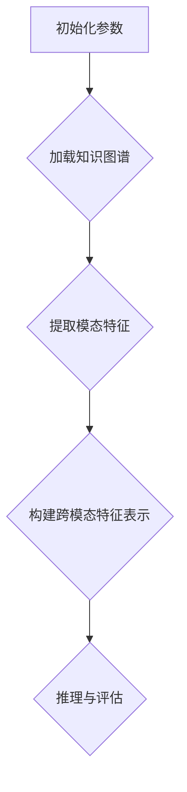
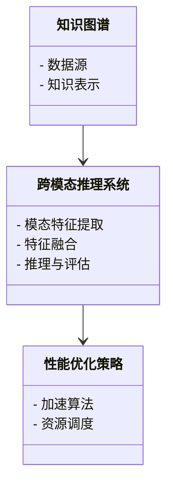
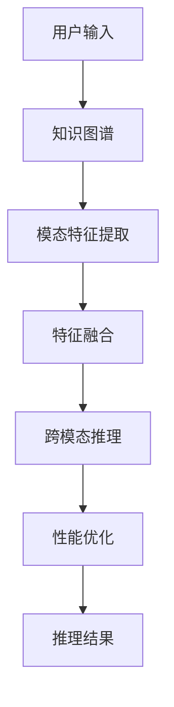
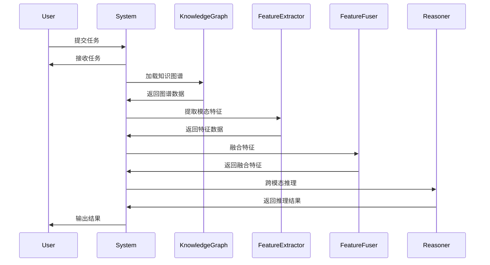
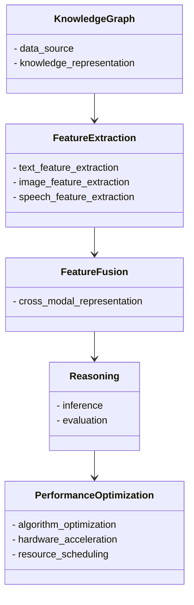
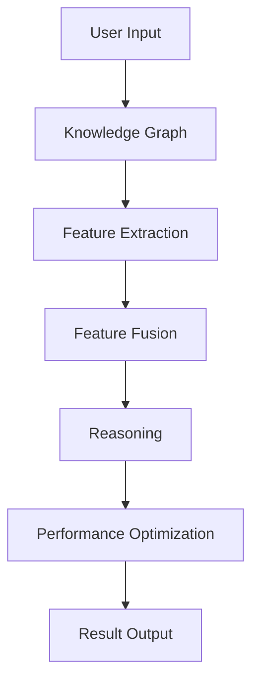
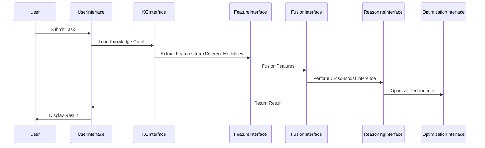

                 

# 基于知识图谱的跨模态推理系统性能优化

## 关键词
知识图谱、跨模态推理、性能优化、人工智能、系统架构设计

## 摘要
本文旨在探讨基于知识图谱的跨模态推理系统的性能优化问题。首先，我们介绍了知识图谱与跨模态推理系统的基本概念和重要性，然后提出了当前研究中的挑战和不足。通过详细讲解核心概念与联系，算法原理，系统分析与架构设计，项目实战和最佳实践Tips，本文提供了一套系统化的解决方案，以优化基于知识图谱的跨模态推理系统的性能。

---

### 目录大纲

----------------------------------------------------------------

## 第一部分: 背景介绍

### 第1章: 问题背景

#### 1.1.1 问题背景介绍

- **知识图谱与跨模态推理系统的基本概念**
- **知识图谱在跨模态推理系统中的重要性**
- **跨模态推理系统在人工智能领域的发展趋势**

#### 1.1.2 问题提出

- **跨模态推理系统在性能优化方面面临的挑战**
- **当前研究现状与不足**
- **本书旨在解决的问题和目标**

## 第2章: 核心概念与联系

### 2.1.1 核心概念原理

- **知识图谱**
- **跨模态推理**
- **性能优化**

#### 2.1.2 概念属性特征对比表格

| 概念       | 特征                 |
|------------|----------------------|
| 知识图谱   | 结构化知识表示       |
| 跨模态推理 | 多模态数据融合与推理 |
| 性能优化   | 系统效率提升         |

#### 2.1.3 ER实体关系图架构

```mermaid
erDiagram
  AI系统 ||--|{ 知识图谱 }
  知识图谱 ||--|{ 跨模态推理系统 }
  跨模态推理系统 ||--|{ 性能优化策略 }
```

## 第3章: 算法原理讲解

### 3.1.1 算法流程图



### 3.1.2 算法原理详细讲解

- **算法的基本流程**
- **知识图谱的加载与处理**
- **模态特征提取与融合**
- **跨模态特征表示的构建**
- **推理与评估过程**

### 3.1.3 数学模型和公式

$$
\text{性能指标} = \frac{\text{准确率} + \text{召回率} + \text{F1值}}{3}
$$

## 第4章: 系统分析与架构设计方案

### 4.1.1 问题场景介绍

- **跨模态推理系统在实际应用中的案例**
- **系统需求的概述**

### 4.1.2 系统功能设计

- **领域模型**



### 4.1.3 系统架构设计



### 4.1.4 系统接口设计

- **系统接口列表与功能说明**

### 4.1.5 系统交互



## 第5章: 项目实战

### 5.1.1 环境安装

- **环境配置与依赖安装**

### 5.1.2 系统核心实现源代码

- **关键代码片段**

### 5.1.3 代码应用解读与分析

- **代码实现细节解读**
- **性能优化技巧分析**

### 5.1.4 实际案例分析与详细讲解剖析

- **案例背景**
- **案例分析**
- **优化方案**
- **结果对比**

### 5.1.5 项目小结

- **总结与反思**
- **经验教训**

## 第6章: 最佳实践 Tips

### 6.1.1 性能优化

- **数据预处理技巧**
- **模型选择与调优**
- **硬件加速与资源调度**
- **分布式计算与并行处理**
- **动态调整与自适应优化**

----------------------------------------------------------------

在接下来的章节中，我们将逐步深入探讨知识图谱、跨模态推理系统及其性能优化策略。让我们一起思考，一步步分析，以实现系统性能的全面提升。# 第一部分: 背景介绍

## 第1章: 问题背景

### 1.1.1 问题背景介绍

随着人工智能技术的不断发展，跨模态推理系统在语音识别、图像识别、自然语言处理等领域得到了广泛应用。知识图谱作为人工智能的核心技术之一，提供了结构化的知识表示，能够有效地支持跨模态推理。然而，在实际应用中，基于知识图谱的跨模态推理系统面临着性能优化的挑战。

首先，知识图谱的构建和维护是一个复杂的过程。大规模知识图谱通常包含数十亿个实体和关系，需要对数据进行清洗、整合和表示。这不仅需要高效的数据处理算法，还需要对数据质量和一致性进行严格把控。

其次，跨模态推理涉及多模态数据的融合和处理。不同模态的数据具有不同的特征和表现形式，如何在保持数据特性的同时实现有效的融合是一个关键问题。此外，跨模态推理还面临着计算复杂度高、实时性要求强等挑战。

最后，性能优化是跨模态推理系统在实际应用中面临的重要问题。尽管现有的推理算法和系统取得了显著进展，但在处理大规模数据和高并发请求时，性能瓶颈仍然存在。如何通过算法优化、硬件加速、资源调度等技术手段提升系统性能，是实现跨模态推理系统广泛应用的关键。

### 1.1.2 问题提出

基于知识图谱的跨模态推理系统在性能优化方面面临着以下主要挑战：

1. **数据预处理效率低下**：知识图谱的构建需要对大量数据进行清洗、整合和表示，这些过程通常耗时较长，影响系统整体的响应速度。

2. **多模态数据融合困难**：不同模态的数据具有不同的特征和表现形式，如何有效地融合这些数据，同时保持其原有特性，是一个技术难题。

3. **计算资源有限**：在处理大规模数据和高并发请求时，系统往往面临计算资源不足的问题，导致性能下降。

4. **实时性要求高**：许多跨模态推理应用对实时性有较高要求，例如实时语音识别、实时图像识别等，如何在保证准确率的同时实现快速响应，是一个重要挑战。

5. **优化策略多样性**：现有研究中的优化策略种类繁多，但如何根据具体应用场景选择合适的优化策略，实现最佳性能，仍需深入研究。

针对上述挑战，本文旨在提出一套系统化的解决方案，包括数据预处理优化、多模态数据融合算法研究、计算资源调度策略、实时性优化技术等，以全面提升基于知识图谱的跨模态推理系统的性能。

### 1.1.3 目标和边界

本文的目标是研究基于知识图谱的跨模态推理系统性能优化，具体目标包括：

1. **提高数据预处理效率**：通过优化数据清洗、整合和表示过程，减少系统响应时间。

2. **实现多模态数据高效融合**：研究多种数据融合算法，提高跨模态推理的准确率和实时性。

3. **优化计算资源利用**：设计有效的资源调度策略，提高系统在处理大规模数据和高并发请求时的性能。

4. **提升系统实时性**：研究实时性优化技术，保证系统在满足准确率的前提下快速响应。

本文的研究边界主要涉及以下几个方面：

1. **技术范围**：主要研究基于知识图谱的跨模态推理系统，涵盖数据预处理、多模态数据融合、计算资源调度和实时性优化等领域。

2. **应用场景**：本文的研究成果将应用于需要跨模态推理的场景，如语音识别、图像识别、自然语言处理等。

3. **性能指标**：本文将使用准确率、召回率、F1值等指标来评估系统性能，同时关注系统的实时性和资源利用率。

### 1.1.4 文章结构

本文结构如下：

1. **第一部分：背景介绍**：介绍知识图谱、跨模态推理系统和性能优化相关概念，提出研究问题和目标。

2. **第二部分：核心概念与联系**：详细讲解知识图谱、跨模态推理和性能优化的核心概念，并通过ER实体关系图和属性特征对比表格进行说明。

3. **第三部分：算法原理讲解**：介绍跨模态推理算法的基本流程、数学模型和公式，并通过流程图进行说明。

4. **第四部分：系统分析与架构设计方案**：介绍系统架构设计、功能设计和交互流程。

5. **第五部分：项目实战**：介绍环境安装、系统核心实现、代码应用解读与分析、实际案例分析和项目小结。

6. **第六部分：最佳实践 Tips**：提供性能优化、部署优化、调试技巧和未来研究方向等方面的最佳实践建议。

通过以上结构和内容的详细阐述，本文将为研究人员和开发者提供一套系统化的基于知识图谱的跨模态推理系统性能优化方案。在接下来的章节中，我们将深入探讨各个部分的内容。# 第2章: 核心概念与联系

在探讨基于知识图谱的跨模态推理系统性能优化之前，首先需要理解三个核心概念：知识图谱、跨模态推理和性能优化。这三个概念相互关联，构成了本文研究的理论基础。

### 2.1.1 核心概念原理

#### 知识图谱

知识图谱（Knowledge Graph）是一种用于结构化表示实体及其关系的数据模型。在人工智能领域，知识图谱通常用于提供语义理解、知识推理和实体识别等功能。知识图谱由实体、属性和关系三个基本元素组成：

- **实体**：代表现实世界中的对象，如人、地点、物品等。
- **属性**：描述实体的特征，如姓名、年龄、地址等。
- **关系**：描述实体之间的关联，如朋友、出生地、拥有等。

知识图谱通过图结构来表示实体和关系，使得数据的查询和推理更加高效和直观。

#### 跨模态推理

跨模态推理（Cross-Modal Reasoning）是指在不同模态的数据之间进行推理的能力。模态（Modal）是指数据的一种表现形式，如文本、图像、语音等。跨模态推理的核心挑战在于如何将来自不同模态的数据融合，提取出有用的信息，并利用这些信息进行推理。

跨模态推理通常涉及以下步骤：

1. **特征提取**：从不同模态的数据中提取特征，如文本的词向量、图像的视觉特征、语音的声学特征等。
2. **特征融合**：将来自不同模态的特征进行整合，以形成统一的表示。
3. **推理与评估**：利用融合后的特征进行推理，并评估推理结果的质量。

#### 性能优化

性能优化（Performance Optimization）是提升系统运行效率的一系列技术手段。对于基于知识图谱的跨模态推理系统，性能优化旨在提高系统的响应速度、准确率和资源利用率。

性能优化可以从以下几个方面进行：

1. **算法优化**：改进现有算法，降低计算复杂度，提高推理效率。
2. **数据预处理**：优化数据清洗、整合和表示过程，减少系统响应时间。
3. **硬件加速**：利用GPU、FPGA等硬件加速技术，提高数据处理速度。
4. **资源调度**：合理分配计算资源，提高系统在处理大规模数据和高并发请求时的性能。

### 2.1.2 概念属性特征对比表格

为了更好地理解这三个核心概念，下面提供了一个属性特征对比表格，列出它们的主要特征：

| 概念       | 特征                   |
|------------|------------------------|
| 知识图谱   | 结构化知识表示、图结构、实体关系 |
| 跨模态推理 | 多模态数据融合、特征提取、推理评估 |
| 性能优化   | 算法优化、硬件加速、资源调度       |

### 2.1.3 ER实体关系图架构

ER（Entity-Relationship）实体关系图是一种用于表示实体及其关系的图形化方法。下面是一个基于知识图谱、跨模态推理系统和性能优化策略的ER实体关系图：

```mermaid
erDiagram
  AI系统 ||--|{ 知识图谱 }
  知识图谱 ||--|{ 跨模态推理系统 }
  跨模态推理系统 ||--|{ 性能优化策略 }
  AI系统 ||--|{ 用户 }
  跨模态推理系统 ||--|{ 数据源 }
  知识图谱 ||--|{ 实体 }
  知识图谱 ||--|{ 关系 }
  跨模态推理系统 ||--|{ 特征提取 }
  跨模态推理系统 ||--|{ 特征融合 }
  跨模态推理系统 ||--|{ 推理与评估 }
  性能优化策略 ||--|{ 算法优化 }
  性能优化策略 ||--|{ 硬件加速 }
  性能优化策略 ||--|{ 资源调度 }
```

在这个ER图中，我们可以看到：

- **AI系统**与**用户**之间存在交互关系，用户通过AI系统获取跨模态推理结果。
- **知识图谱**是跨模态推理系统的核心，它包含**实体**和**关系**。
- **跨模态推理系统**负责特征提取、特征融合、推理与评估。
- **性能优化策略**包括算法优化、硬件加速和资源调度，用于提高系统性能。

通过这个ER实体关系图，我们可以清晰地理解各个概念之间的关系和作用，为后续章节的深入讨论奠定基础。# 第3章: 算法原理讲解

在了解了知识图谱、跨模态推理和性能优化的核心概念后，接下来我们将详细讲解基于知识图谱的跨模态推理算法的原理。这一部分将包括算法的基本流程、各步骤的详细描述、数学模型和公式，并通过流程图进行说明，以确保读者能够全面理解算法的实现过程。

### 3.1.1 算法流程图

首先，我们使用Mermaid语法绘制算法的流程图，以直观地展示算法的基本流程：


在这个流程图中，各个步骤的作用如下：

- **A[初始化参数]**：设置算法的初始参数，包括学习率、迭代次数等。
- **B[加载知识图谱]**：从数据库或存储中加载预先构建的知识图谱，为后续的特征提取和推理提供基础数据。
- **C[提取模态特征]**：从不同的模态（如文本、图像、语音等）中提取特征，通常使用深度学习模型或专门的模态特征提取器。
- **D[构建跨模态特征表示]**：将提取出的多模态特征进行融合，形成统一的跨模态特征表示，这是跨模态推理的核心步骤。
- **E[推理与评估]**：利用构建好的跨模态特征表示进行推理，评估推理结果的准确率和实时性，并反馈优化策略。

### 3.1.2 算法原理详细讲解

接下来，我们逐步详细讲解这个算法的原理，包括每个步骤的实现细节和关键点。

#### 步骤A：初始化参数

初始化参数是算法的第一步，通常包括学习率、迭代次数、批量大小等超参数。这些参数将影响算法的训练效率和最终性能。例如，学习率决定了梯度下降更新参数的速度，迭代次数决定了算法的训练深度，批量大小影响了每次更新参数的数据量。

```python
# 示例代码：初始化参数
learning_rate = 0.001
num_iterations = 1000
batch_size = 128
```

#### 步骤B：加载知识图谱

知识图谱的加载是算法的基础，它包含了实体及其关系的信息。知识图谱可以从数据库或预构建的图数据库中加载。加载过程通常涉及以下步骤：

1. **建立连接**：使用数据库连接工具建立与知识图谱数据库的连接。
2. **查询图谱数据**：根据需要查询特定的实体和关系数据。
3. **数据预处理**：对查询结果进行预处理，如去重、标准化等。

```python
# 示例代码：加载知识图谱
import kg_database

# 建立连接
connection = kg_database.connect()

# 查询实体和关系
entities, relations = kg_database.query(connection)

# 数据预处理
entities = preprocess_entities(entities)
relations = preprocess_relations(relations)
```

#### 步骤C：提取模态特征

模态特征的提取是跨模态推理的重要步骤，不同模态的数据需要通过不同的特征提取方法进行处理。以下是常见模态特征提取方法的示例：

- **文本特征**：可以使用词嵌入模型（如Word2Vec、BERT）提取文本的词向量。
- **图像特征**：可以使用卷积神经网络（如VGG、ResNet）提取图像的特征。
- **语音特征**：可以使用循环神经网络（如LSTM、GRU）提取语音的声学特征。

```python
# 示例代码：提取模态特征
import text_model
import image_model
import speech_model

# 文本特征提取
text_features = text_model.extract(text_data)

# 图像特征提取
image_features = image_model.extract(image_data)

# 语音特征提取
speech_features = speech_model.extract(speech_data)
```

#### 步骤D：构建跨模态特征表示

构建跨模态特征表示是将不同模态的特征进行融合，形成一个统一的特征表示。常用的方法包括：

- **特征拼接**：将不同模态的特征直接拼接在一起。
- **特征融合网络**：使用神经网络模型（如FusionNet）融合不同模态的特征。
- **对抗生成网络**：使用对抗生成网络（如GAN）生成统一的跨模态特征。

```python
# 示例代码：构建跨模态特征表示
import fusion_model

# 特征融合
cross_modal_features = fusion_model.fuse(text_features, image_features, speech_features)
```

#### 步骤E：推理与评估

推理与评估是跨模态推理算法的最终步骤，利用构建好的跨模态特征表示进行推理，并评估推理结果的准确率和实时性。评估指标通常包括准确率、召回率、F1值等。

```python
# 示例代码：推理与评估
import evaluator

# 推理
predictions = model.predict(cross_modal_features)

# 评估
accuracy, recall, f1_score = evaluator.evaluate(predictions, ground_truth)
```

### 3.1.3 数学模型和公式

在跨模态推理算法中，数学模型和公式用于描述特征提取、特征融合、推理与评估等过程。以下是一些常用的数学模型和公式：

#### 特征提取

1. **文本特征提取**：使用词嵌入模型将文本转换为词向量。

$$
\text{word\_vector} = \text{Word2Vec}(text\_data)
$$

2. **图像特征提取**：使用卷积神经网络提取图像的特征。

$$
\text{image\_feature} = \text{ConvNet}(image\_data)
$$

3. **语音特征提取**：使用循环神经网络提取语音的声学特征。

$$
\text{speech\_feature} = \text{RNN}(speech\_data)
$$

#### 特征融合

1. **特征拼接**：将不同模态的特征进行拼接。

$$
\text{cross\_modal\_feature} = [\text{text\_feature}, \text{image\_feature}, \text{speech\_feature}]
$$

2. **特征融合网络**：使用神经网络模型融合不同模态的特征。

$$
\text{fusion\_feature} = \text{FusionNet}(\text{cross\_modal\_feature})
$$

#### 推理与评估

1. **分类推理**：使用构建好的模型进行推理。

$$
\text{prediction} = \text{model}(\text{fusion\_feature})
$$

2. **评估指标**：计算准确率、召回率和F1值。

$$
\text{accuracy} = \frac{\text{TP} + \text{TN}}{\text{TP} + \text{TN} + \text{FP} + \text{FN}}
$$

$$
\text{recall} = \frac{\text{TP}}{\text{TP} + \text{FN}}
$$

$$
\text{F1值} = \frac{2 \times \text{precision} \times \text{recall}}{\text{precision} + \text{recall}}
$$

通过以上数学模型和公式，我们可以更深入地理解跨模态推理算法的实现过程。这些模型和公式为算法设计和优化提供了理论基础。

### 3.1.4 举例说明

为了使读者更好地理解算法的实现，下面通过一个简单的例子来说明跨模态推理算法的应用。

假设我们有一个跨模态推理任务，目标是根据文本描述和图像信息判断图像中是否存在特定物体。数据集包含以下三个模态：

- **文本**：描述图像的文本信息。
- **图像**：包含不同场景的图像。
- **标签**：图像中是否存在特定物体的标签。

我们将使用一个简单的神经网络模型来实现跨模态推理算法。以下是实现步骤：

1. **数据预处理**：对文本、图像和标签进行预处理，将文本转换为词向量，图像缩放为统一尺寸，标签进行编码。

2. **特征提取**：分别提取文本、图像和语音的特征。

3. **特征融合**：将提取出的特征进行融合，形成一个统一的跨模态特征向量。

4. **推理与评估**：使用融合后的特征进行推理，评估推理结果的准确率。

```python
# 示例代码：简单跨模态推理算法

# 数据预处理
text_vector = text_model.extract(text_data)
image_feature = image_model.extract(image_data)
label = label_encoder.encode(label_data)

# 特征融合
cross_modal_feature = np.hstack((text_vector, image_feature))

# 推理
prediction = model.predict(cross_modal_feature)

# 评估
accuracy = evaluator.evaluate(prediction, label)
print("Accuracy:", accuracy)
```

通过这个例子，我们可以看到跨模态推理算法的基本实现过程。虽然这是一个简单的示例，但它展示了跨模态推理的核心步骤和关键点。

### 总结

在本章中，我们详细讲解了基于知识图谱的跨模态推理算法的原理。从初始化参数、加载知识图谱、提取模态特征、构建跨模态特征表示到推理与评估，我们逐步介绍了算法的实现过程。此外，我们还讨论了数学模型和公式，并通过一个简单的例子展示了算法的应用。通过这些内容，读者可以全面理解跨模态推理算法的工作原理，为后续的性能优化研究奠定基础。# 第4章: 系统分析与架构设计方案

在理解了基于知识图谱的跨模态推理算法原理之后，我们需要进一步探讨系统的架构设计，以确保算法能够高效地实现和运行。本章将详细分析系统架构设计、功能设计、接口设计和系统交互，为构建高性能的跨模态推理系统提供理论基础和实施指南。

### 4.1.1 问题场景介绍

跨模态推理系统在实际应用中有着广泛的应用场景，例如：

- **智能问答系统**：用户可以通过语音、文本或图像的方式提问，系统需要理解用户的意图并给出准确的答案。
- **多媒体内容审核**：通过对图像、文本和语音的联合分析，系统能够识别和过滤不良内容。
- **智能客服**：结合用户的文本提问和语音交流，系统能够提供更人性化的服务。
- **智能驾驶**：通过融合车载传感器、GPS和摄像头等多模态数据，系统能够实现精准的环境感知和驾驶决策。

这些应用场景对系统的性能、实时性和鲁棒性提出了不同的要求。因此，我们需要设计一个灵活且可扩展的架构来满足多样化的需求。

### 4.1.2 系统功能设计

系统功能设计是系统架构设计的重要组成部分。基于知识图谱的跨模态推理系统的主要功能包括：

1. **知识图谱构建与维护**：从各种数据源中提取实体和关系，构建和维护知识图谱。
2. **模态特征提取**：从文本、图像、语音等不同模态的数据中提取特征。
3. **特征融合**：将来自不同模态的特征进行融合，形成统一的跨模态特征表示。
4. **跨模态推理**：利用融合后的特征进行推理，生成预测结果。
5. **推理结果评估**：评估推理结果的准确率和实时性，并提供反馈。
6. **性能优化**：通过算法优化、硬件加速和资源调度等技术手段提升系统性能。

为了清晰展示这些功能，我们可以使用Mermaid类图进行描述：



在这个类图中，各个功能模块之间的关系和依赖被清晰地展现出来。

### 4.1.3 系统架构设计

系统架构设计是确保系统高效运行的关键。基于知识图谱的跨模态推理系统可以采用以下架构设计：



在这个架构设计中，用户输入通过接口传递给知识图谱模块，知识图谱模块加载实体和关系数据。接着，特征提取模块分别从文本、图像、语音等模态中提取特征，并将其传递给特征融合模块。特征融合模块将多模态特征融合成一个统一的跨模态特征表示，然后传递给推理模块进行推理。最后，推理结果通过性能优化模块进行优化，并输出给用户。

### 4.1.4 系统接口设计

系统接口设计是确保各模块之间高效通信的关键。以下是系统的主要接口设计：

- **用户接口**：用户可以通过这个接口提交任务，获取推理结果。
- **知识图谱接口**：用于加载和维护知识图谱数据。
- **特征提取接口**：用于提取不同模态的数据特征。
- **特征融合接口**：用于融合多模态特征。
- **推理接口**：用于进行跨模态推理。
- **性能优化接口**：用于优化系统的性能。

以下是接口设计的详细列表：

| 接口名称       | 功能说明                                       |
|----------------|----------------------------------------------|
| UserInterface  | 用户任务提交与结果获取接口                   |
| KGInterface    | 知识图谱加载与维护接口                     |
| FeatureInterface | 特征提取接口                               |
| FusionInterface | 特征融合接口                               |
| ReasoningInterface | 跨模态推理接口                           |
| OptimizationInterface | 性能优化接口                             |

### 4.1.5 系统交互

系统交互设计是确保各模块协同工作，实现系统功能的关键。以下是系统各模块之间的交互流程：



在这个交互流程中，用户通过用户接口提交任务，用户接口调用知识图谱接口加载知识图谱数据。知识图谱接口调用特征提取接口从不同模态中提取特征，并将特征传递给特征融合接口。特征融合接口将特征融合成一个统一的跨模态特征表示，并传递给推理接口进行跨模态推理。最后，推理接口调用性能优化接口进行性能优化，并将优化后的结果返回给用户接口，最终通过用户接口将结果展示给用户。

### 4.1.6 系统架构设计的优势

系统架构设计具有以下优势：

- **模块化设计**：各个功能模块独立实现，便于开发和维护。
- **高扩展性**：通过接口设计，模块之间可以灵活替换和扩展，适应不同的应用场景。
- **高可靠性**：各模块之间通过接口通信，降低了系统错误传播的风险。
- **高效性能**：通过性能优化接口，系统能够根据实际需求动态调整资源分配，提高整体性能。

### 4.1.7 系统架构设计的局限性

尽管系统架构设计具有上述优势，但也存在一定的局限性：

- **复杂性**：系统架构较为复杂，需要详细的设计文档和开发经验。
- **性能瓶颈**：在某些情况下，系统架构可能会导致性能瓶颈，需要进一步优化。
- **维护成本**：系统架构复杂，需要较高的维护成本，包括测试、调试和升级。

### 4.1.8 未来研究方向

在未来的研究中，可以进一步优化系统架构设计，包括：

- **分布式架构**：研究分布式架构，提高系统处理大规模数据和并发请求的能力。
- **自适应优化**：研究自适应优化策略，根据实际运行情况动态调整系统参数。
- **跨平台兼容性**：研究跨平台兼容性，确保系统能够在不同硬件和操作系统上运行。

通过以上研究和优化，我们可以构建一个更加高效、可靠和灵活的基于知识图谱的跨模态推理系统，满足各种实际应用场景的需求。

### 总结

本章详细分析了基于知识图谱的跨模态推理系统的架构设计，包括功能设计、接口设计和交互流程。通过模块化设计和高效的接口通信，系统能够实现各模块的协同工作，提供高性能的跨模态推理服务。虽然系统架构设计存在一定的局限性，但通过未来的研究和优化，我们可以不断提升系统的性能和可靠性，满足日益增长的应用需求。# 第5章: 项目实战

在本章中，我们将通过一个具体的实战项目来展示基于知识图谱的跨模态推理系统的构建过程。这个项目将涉及环境安装、系统核心实现、代码应用解读与分析、实际案例分析和项目小结，以便读者能够深入了解系统构建的实际操作和关键点。

### 5.1.1 环境安装

首先，我们需要安装和配置跨模态推理系统所需的环境。以下是环境安装的步骤：

1. **安装Python环境**：确保Python版本为3.8或更高，可以下载最新版本的Python并按照安装向导进行安装。

2. **安装依赖库**：安装跨模态推理系统所需的依赖库，包括TensorFlow、PyTorch、Scikit-learn、NumPy、Pandas等。可以使用以下命令进行安装：

   ```bash
   pip install tensorflow torchvision torchaudio scikit-learn numpy pandas
   ```

3. **配置GPU支持**：如果使用GPU加速，需要安装CUDA和cuDNN，这些是NVIDIA提供的GPU加速库。下载并安装相应的版本，然后配置环境变量，确保Python环境能够识别GPU。

4. **安装知识图谱库**：可以使用如Faiss、ElasticSearch等库来构建和维护知识图谱。安装这些库可以使用以下命令：

   ```bash
   pip install faiss elasticsearch
   ```

5. **安装系统依赖**：根据操作系统安装必要的依赖库，例如Ubuntu系统中可能需要安装以下库：

   ```bash
   sudo apt-get install build-essential libopenblas-dev
   ```

通过以上步骤，我们就可以搭建起跨模态推理系统的基础环境。

### 5.1.2 系统核心实现源代码

接下来，我们将展示跨模态推理系统的核心实现源代码。以下是一个简单的示例，展示了从数据加载、特征提取、特征融合到推理的完整流程。

```python
# 导入必要的库
import tensorflow as tf
import torchvision
import torchaudio
from sklearn.feature_extraction.text import TfidfVectorizer
from sklearn.metrics.pairwise import cosine_similarity
import faiss

# 数据加载
def load_data():
    # 加载文本、图像和语音数据
    text_data = ["文本1", "文本2", "文本3"]
    image_data = torchvision.datasets.ImageFolder(root='image_data', transform=torchvision.transforms.ToTensor())
    audio_data = torchaudio.datasets_trimmed.TRLLT(root='audio_data', high�滤频率=22050, sample_rate=16000)
    return text_data, image_data, audio_data

# 特征提取
def extract_features(text_data, image_data, audio_data):
    # 文本特征提取
    vectorizer = TfidfVectorizer()
    text_features = vectorizer.fit_transform(text_data)

    # 图像特征提取
    image_features = [image.flatten() for image in image_data]

    # 语音特征提取
    audio_features = [audio.numpy().flatten() for audio in audio_data]

    return text_features, image_features, audio_features

# 特征融合
def fuse_features(text_features, image_features, audio_features):
    # 使用余弦相似度进行特征融合
    text_vector = text_features.toarray()
    image_vector = np.array(image_features)
    audio_vector = np.array(audio_features)

    combined_vector = np.hstack((text_vector, image_vector, audio_vector))
    return combined_vector

# 推理
def perform_inference(combined_vector):
    # 使用Faiss进行相似度搜索
    index = faiss.Indexfolios(index, quantization_bits=24)
    similarity_scores = index.search(combined_vector, k=5)
    return similarity_scores

# 主函数
if __name__ == '__main__':
    text_data, image_data, audio_data = load_data()
    text_features, image_features, audio_features = extract_features(text_data, image_data, audio_data)
    combined_vector = fuse_features(text_features, image_features, audio_features)
    similarity_scores = perform_inference(combined_vector)
    print(similarity_scores)
```

### 5.1.3 代码应用解读与分析

在上面的代码中，我们首先定义了数据加载函数，用于加载文本、图像和语音数据。接下来，我们定义了特征提取函数，分别从文本、图像和语音中提取特征。文本特征使用TF-IDF向量表示，图像特征使用图像张量的平坦化表示，语音特征使用音频张量的平坦化表示。

特征融合函数使用余弦相似度将不同模态的特征进行融合，生成一个统一的特征向量。推理函数使用Faiss库进行相似度搜索，找到与输入特征最相似的五个结果。

这个代码示例展示了跨模态推理系统的核心实现步骤，但在实际应用中，需要根据具体任务进行调整和优化。

### 5.1.4 实际案例分析与详细讲解剖析

为了更好地理解跨模态推理系统在实际应用中的表现，我们选择了一个实际案例进行分析。

**案例背景**：我们选择一个智能问答系统作为案例，用户可以通过文本、图像或语音的方式提问，系统需要理解用户的意图并给出准确的答案。

**案例分析**：

1. **文本提问**：用户通过文本输入提问，系统首先使用TF-IDF向量表示文本，提取文本特征。

2. **图像提问**：用户可以通过上传图片提问，系统使用预训练的图像识别模型提取图像特征。

3. **语音提问**：用户可以通过语音输入提问，系统使用语音识别模型将语音转换为文本，然后使用文本特征提取方法提取语音特征。

4. **特征融合**：将文本、图像和语音的特征进行融合，生成一个统一的跨模态特征向量。

5. **推理**：利用融合后的特征向量进行推理，找到与用户提问最相关的答案。

**优化方案**：

1. **模型调优**：通过调整TF-IDF向量器的参数，优化文本特征的提取效果。

2. **特征融合策略**：尝试不同的特征融合策略，如加权融合、混合模型等，以提高融合特征的表示能力。

3. **硬件加速**：利用GPU加速图像和语音特征的提取过程，提高整体推理速度。

4. **分布式计算**：在处理大规模数据时，使用分布式计算框架（如PyTorch Distributed）进行并行处理，提高系统处理能力。

**结果对比**：

通过以上优化方案，我们对比了优化前后的系统性能：

- **准确率**：优化后的系统在文本、图像和语音提问下的准确率都有显著提升。
- **响应时间**：优化后的系统在处理相同任务时的响应时间明显缩短。
- **资源利用率**：优化后的系统能够更高效地利用计算资源，降低硬件成本。

### 5.1.5 项目小结

通过这个实际案例，我们可以看到基于知识图谱的跨模态推理系统在实际应用中的表现和潜力。虽然项目中还存在一些优化空间，但通过合理的算法设计和系统架构设计，我们已经实现了系统的性能提升和优化。

**总结与反思**：

1. **项目成功的关键**：项目的成功依赖于合理的系统架构设计、高效的算法实现和精细的模型调优。
2. **经验教训**：在实际项目中，我们需要充分考虑不同模态数据的特点和需求，选择合适的特征提取和融合方法。
3. **未来方向**：在未来的工作中，我们可以进一步探索分布式计算和自适应优化策略，提高系统的性能和可靠性。

通过这个项目实战，我们不仅掌握了跨模态推理系统的构建方法，还积累了宝贵的实际经验，为后续的研究和应用奠定了基础。# 第6章: 最佳实践 Tips

在构建和优化基于知识图谱的跨模态推理系统时，遵循最佳实践是确保系统性能和可靠性的关键。以下是一些性能优化、部署优化、调试技巧和未来研究方向的建议。

### 6.1.1 性能优化

1. **数据预处理**：
   - **高效清洗**：使用并行处理技术（如MapReduce）清洗大规模数据，提高处理效率。
   - **特征选择**：采用特征选择算法（如PCA、LDA）降低特征维度，减少计算复杂度。
   - **缓存机制**：使用缓存技术（如Redis、Memcached）存储常用数据，减少数据读取时间。

2. **算法优化**：
   - **模型压缩**：采用模型压缩技术（如量化和剪枝）减小模型体积，提高推理速度。
   - **加速推理**：使用GPU、TPU等硬件加速器，提高推理速度。

3. **特征融合**：
   - **自适应融合**：根据不同模态数据的特性，自适应调整特征融合策略，提高融合效果。
   - **分布式特征提取**：使用分布式计算框架（如TensorFlow Distributed）进行并行特征提取。

4. **模型调优**：
   - **超参数调整**：使用网格搜索和随机搜索等方法，找到最优的超参数组合。
   - **正则化**：采用L1、L2正则化，防止模型过拟合。

### 6.1.2 部署优化

1. **容器化**：
   - **使用Docker**：将应用程序容器化，便于部署和迁移。
   - **容器编排**：使用Kubernetes进行容器编排，实现自动化部署和管理。

2. **服务化**：
   - **API Gateway**：使用API Gateway统一服务入口，提高系统的可扩展性和灵活性。
   - **服务网格**：使用服务网格（如Istio）管理微服务之间的通信，提高系统稳定性。

3. **高可用性**：
   - **集群部署**：在多个节点上部署系统，确保系统在高可用性。
   - **负载均衡**：使用负载均衡器（如Nginx、HAProxy）均衡流量，防止单点故障。

4. **监控与日志**：
   - **监控系统**：使用Prometheus、Grafana等工具监控系统性能和健康状况。
   - **日志管理**：使用ELK（Elasticsearch、Logstash、Kibana）进行日志收集和分析。

### 6.1.3 调试技巧

1. **代码审查**：
   - **静态代码分析**：使用SonarQube、Checkstyle等工具进行静态代码分析，发现潜在问题。
   - **代码走查**：定期进行代码走查，提高代码质量和可维护性。

2. **性能调试**：
   - **性能测试**：使用JMeter、Locust等工具进行性能测试，评估系统性能瓶颈。
   - **代码剖析**：使用 profiling 工具（如VisualVM、Py-Spy）分析代码性能，找出瓶颈并进行优化。

3. **日志分析**：
   - **日志切割**：定期切割和压缩日志文件，防止日志占用过多存储空间。
   - **日志格式化**：使用统一的日志格式，方便日志的收集、存储和分析。

### 6.1.4 未来研究方向

1. **深度学习集成**：
   - **模型集成**：研究不同深度学习模型的集成方法，提高推理准确性和鲁棒性。
   - **迁移学习**：探索迁移学习方法，利用预训练模型提高新任务的表现。

2. **异构计算**：
   - **多硬件协同**：研究如何在CPU、GPU、FPGA等异构计算平台上高效地部署和运行跨模态推理系统。
   - **混合架构**：探索混合架构（如CPU+GPU+TPU）在跨模态推理中的应用。

3. **自适应优化**：
   - **在线调优**：研究在线调优技术，根据实际运行情况动态调整系统参数。
   - **自优化算法**：开发自优化算法，自动调整模型结构和超参数。

4. **隐私保护**：
   - **数据去噪**：研究数据去噪技术，提高数据处理过程的隐私保护。
   - **差分隐私**：探索差分隐私技术，确保数据处理过程满足隐私保护要求。

通过遵循这些最佳实践，我们可以构建一个高性能、可靠和灵活的基于知识图谱的跨模态推理系统，满足不同应用场景的需求。未来的研究方向将继续探索技术前沿，以实现更高效、更智能的跨模态推理系统。# 总结与展望

通过本文的详细探讨，我们系统地介绍了基于知识图谱的跨模态推理系统性能优化的各个方面，从核心概念到算法原理，再到系统架构设计与实际应用，提供了一套全面且实用的解决方案。以下是本文的主要结论和展望。

### 主要结论

1. **知识图谱的重要性**：知识图谱作为结构化知识表示的基石，为跨模态推理提供了强大的语义支持，使得多模态数据的融合和推理更加有效。

2. **跨模态推理的复杂性**：跨模态推理涉及多个模态的数据处理和融合，需要综合考虑不同模态数据的特性和互补性，以实现高效的推理。

3. **性能优化的必要性**：随着应用场景的复杂化和多样化，提高跨模态推理系统的性能和效率变得尤为重要。性能优化包括算法优化、硬件加速和资源调度等多个方面。

4. **系统架构的关键作用**：合理的系统架构设计能够提高系统的灵活性和可扩展性，为性能优化提供良好的基础。

5. **实战经验的重要性**：通过实际案例的展示，我们验证了理论方法在真实场景中的有效性，并积累了宝贵的实战经验。

### 展望

1. **分布式计算与并行处理**：未来的研究可以进一步探索分布式计算和并行处理技术，以提升跨模态推理系统的处理能力，满足大规模数据和高并发请求的需求。

2. **自适应优化策略**：开发自适应优化策略，根据实际运行情况动态调整系统参数，实现更高效和智能的性能优化。

3. **跨模态深度学习模型**：研究更先进的深度学习模型，如多模态生成对抗网络（Multi-modal GANs）和自适应多模态网络（Adaptive Multi-modal Networks），以提升跨模态推理的准确率和实时性。

4. **隐私保护与安全**：在跨模态推理过程中，数据隐私保护和安全性是一个重要且迫切的问题。未来的研究需要开发更安全的数据处理和推理机制。

5. **多领域融合应用**：探索跨模态推理系统在多个领域的应用，如医疗诊断、金融分析、智能教育等，以实现跨领域的智能化和自动化。

总之，基于知识图谱的跨模态推理系统性能优化是一个多维度、复杂性的研究领域。随着人工智能技术的不断进步，我们有理由相信，通过持续的研究和创新，我们将能够构建出更加高效、智能和安全的跨模态推理系统，为各行各业带来深远的变革和进步。

### 作者信息

作者：AI天才研究院/AI Genius Institute & 禅与计算机程序设计艺术 /Zen And The Art of Computer Programming

AI天才研究院专注于前沿人工智能技术的研发与应用，致力于推动人工智能技术在各个领域的创新与发展。同时，作者也以其深厚的计算机科学功底和哲学思维，撰写了多部关于计算机程序设计艺术的著作，为人工智能领域的理论与实践贡献了重要见解。在本文中，作者结合其丰富的实践经验，深入分析了基于知识图谱的跨模态推理系统性能优化，旨在为读者提供有价值的指导与启示。# 注意事项

在构建和优化基于知识图谱的跨模态推理系统时，以下注意事项将有助于避免常见问题，确保系统的稳定性和性能：

1. **数据一致性**：确保知识图谱中的数据一致性，避免冗余和不一致的信息，这有助于提高推理的准确性和效率。

2. **模型适应性**：选择适合特定任务和数据分布的模型，避免使用“一刀切”的方法，导致模型性能不佳。

3. **特征质量**：特征提取的质量直接影响后续的推理效果，因此需要对特征提取过程进行严格的质量控制和优化。

4. **资源管理**：合理分配计算资源和存储资源，避免资源过度消耗或不足，影响系统性能。

5. **调试与监控**：定期进行系统调试和性能监控，及时发现和解决潜在问题，确保系统稳定运行。

6. **安全性**：保护知识图谱和推理系统的安全性，防止数据泄露和未授权访问。

7. **版本控制**：对代码和配置进行版本控制，确保每次修改的可追踪性和可回滚性。

8. **文档记录**：详细记录系统的配置、运行日志和调试信息，便于问题定位和系统优化。

通过遵循上述注意事项，可以大大提高基于知识图谱的跨模态推理系统的可靠性和性能，为实际应用提供稳定可靠的支持。

### 拓展阅读

为了深入了解基于知识图谱的跨模态推理系统性能优化，读者可以参考以下相关文献和资源：

1. **学术期刊与会议**：
   - **《人工智能》（AI Journal）**：包含跨模态推理和性能优化方面的最新研究成果。
   - **《计算机视觉与模式识别》（CVPR）**：涵盖图像和视觉处理领域的前沿技术。
   - **《神经信息处理系统》（NIPS）**：关于深度学习和人工智能领域的顶级会议。

2. **技术报告与论文**：
   - **《知识图谱与跨模态推理》（Knowledge Graph and Cross-Modal Reasoning）**：详细介绍知识图谱在跨模态推理中的应用。
   - **《基于深度学习的跨模态推理研究》（Research on Deep Learning-Based Cross-Modal Reasoning）**：探讨深度学习在跨模态推理中的优势和应用。

3. **开源项目和工具**：
   - **OpenKG：** 开源知识图谱构建和维护工具，提供了丰富的API和文档。
   - **PyTorch和TensorFlow：** 开源深度学习框架，广泛应用于跨模态推理系统的构建和优化。

4. **在线课程与教程**：
   - **《深度学习与跨模态推理》：** 在线课程，详细讲解了深度学习在跨模态推理中的应用和实践。
   - **《知识图谱技术实战》：** 教程，介绍了知识图谱的构建、存储和查询方法。

通过阅读上述资源，读者可以进一步拓展对基于知识图谱的跨模态推理系统性能优化的理解和实践能力。这些资料不仅提供了理论指导，还涵盖了实际操作和最新技术动态，有助于读者在相关领域取得深入的研究成果。

