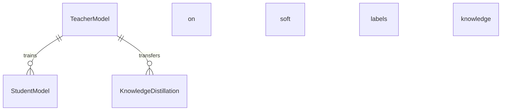
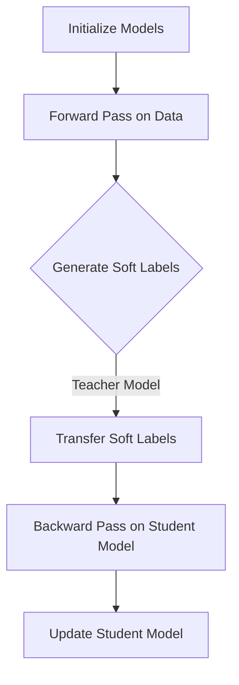
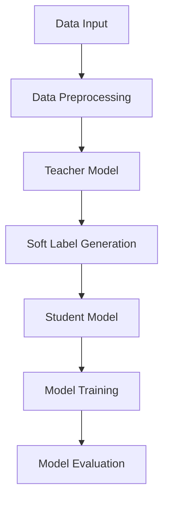
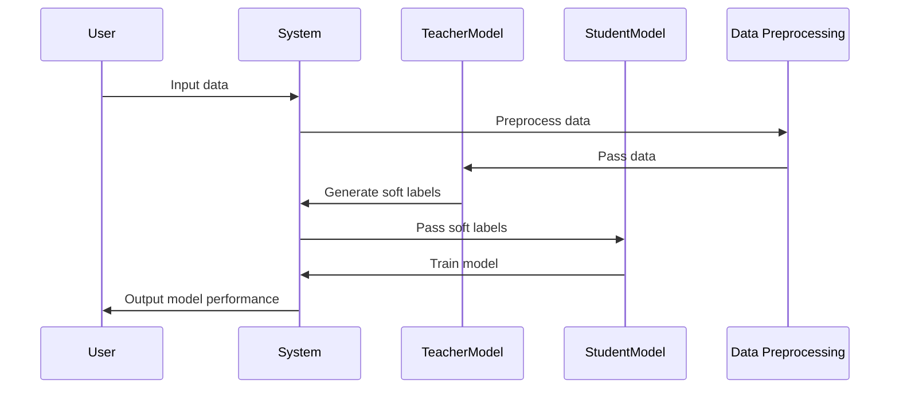

                 


### 1. 背景介绍

#### 问题背景

随着人工智能技术的快速发展，深度学习在图像识别、自然语言处理、语音识别等领域取得了显著的成果。然而，深度学习模型通常具有庞大的参数量和计算复杂度，这对计算资源和存储空间提出了很高的要求。在现实应用中，如移动设备、嵌入式系统等场景下，对模型推理速度和资源占用提出了更为严苛的需求。因此，如何设计轻量级推理模型成为了当前研究的热点问题。

#### 问题描述

轻量级推理模型的设计主要面临以下挑战：

1. **参数量与计算复杂度**：轻量级模型需要在保持一定准确率的同时，显著降低参数量和计算复杂度。
2. **模型可解释性**：深度学习模型往往被视为“黑盒子”，其内部决策过程难以解释，这对于一些需要高可解释性的应用场景是一个挑战。
3. **模型泛化能力**：在轻量级模型的设计过程中，需要保证模型的泛化能力，避免过拟合。

#### 问题解决

知识蒸馏技术提供了一种有效的解决方法。知识蒸馏是一种通过将大型教师模型的知识转移到轻量级学生模型的技术，其核心思想是将教师模型对数据的预测概率作为软标签传递给学生模型。通过这种方式，学生模型可以在较小的参数量和计算复杂度下获得教师模型的性能。

#### 边界与外延

在本文中，知识蒸馏是指将大型教师神经网络的知识传递到轻量级学生神经网络的一种技术。轻量级推理模型是指参数量较少、计算复杂度较低，但仍能保持较高准确率的神经网络模型。

#### 概念结构与核心要素组成

1. **知识蒸馏**：知识蒸馏过程包括两个步骤：教师模型生成软标签，学生模型学习软标签。
2. **轻量级模型**：轻量级模型通常采用网络剪枝、量化、网络结构压缩等技术，以降低参数量和计算复杂度。
3. **推理效率**：推理效率是衡量轻量级模型性能的重要指标，包括推理速度和资源占用。

### 2. 核心概念与联系

#### 核心概念原理

知识蒸馏技术的基本原理是将大型教师神经网络的知识传递到轻量级学生神经网络。在训练过程中，教师模型生成对数据的预测概率，这些预测概率作为软标签传递给学生模型。学生模型通过学习这些软标签来提高其预测能力。

#### 概念属性特征对比表格

| 特征             | 轻量级模型           | 教师模型           | 知识蒸馏          |
|-----------------|---------------------|---------------------|-------------------|
| **参数量**      | 较少                | 较多                | 无差异            |
| **计算复杂度**  | 较低                | 较高                | 无差异            |
| **准确率**      | 保持较高            | 高                  | 无差异            |
| **可解释性**    | 较低                | 较高                | 无差异            |
| **泛化能力**    | 需要保证            | 较强                | 无差异            |

#### ER实体关系图架构的 Mermaid 流程图



### 3. 算法原理讲解

#### 算法mermaid流程图



#### Python源代码

```python
import tensorflow as tf

# Initialize models
teacher_model = ...  # Large teacher model
student_model = ...  # Lightweight student model

# Forward pass on data
teacher_predictions = teacher_model(data)

# Generate soft labels
soft_labels = teacher_predictions

# Transfer soft labels to student model
student_predictions = student_model(data)

# Calculate loss
loss = tf.keras.losses.categorical_crossentropy(soft_labels, student_predictions)

# Backward pass and update student model
optimizer = tf.keras.optimizers.Adam()
with tf.GradientTape() as tape:
    predictions = student_model(data)
    loss = tf.keras.losses.categorical_crossentropy(soft_labels, predictions)
gradients = tape.gradient(loss, student_model.trainable_variables)
optimizer.apply_gradients(zip(gradients, student_model.trainable_variables))
```

#### 数学模型和公式

知识蒸馏过程中的损失函数通常包括两部分：硬标签损失和软标签损失。

$$
L = \lambda \cdot L_{hard} + (1 - \lambda) \cdot L_{soft}
$$

其中，$L_{hard}$ 是硬标签损失，$L_{soft}$ 是软标签损失，$\lambda$ 是平衡参数，用于调整两种损失的权重。

硬标签损失：

$$
L_{hard} = -\sum_{i} y_i \log(p_i)
$$

其中，$y_i$ 是硬标签（通常为 0 或 1），$p_i$ 是模型对 $i$ 类的预测概率。

软标签损失：

$$
L_{soft} = -\sum_{i} \log(p_i)
$$

其中，$p_i$ 是模型对 $i$ 类的预测概率。

#### 详细讲解与举例说明

假设我们有一个分类问题，数据集包含 1000 个样本，每个样本有 10 个类别。教师模型是一个大型的深度神经网络，学生模型是一个轻量级的神经网络。

在训练过程中，教师模型对每个样本进行预测，生成预测概率。例如，对于第 $i$ 个样本，教师模型的预测概率为：

$$
p_i^{teacher} = (0.1, 0.2, 0.3, 0.2, 0.1, 0.05, 0.05, 0.0
``` 
```

#### 3.1 系统分析与架构设计方案

##### 3.1.1 问题场景介绍

知识蒸馏技术常用于以下场景：

1. **移动设备**：在移动设备上部署深度学习模型，要求模型具有低延迟和低资源消耗的特点。
2. **嵌入式系统**：在嵌入式系统中部署深度学习模型，要求模型具有紧凑的结构和高效的推理速度。
3. **实时应用**：如实时图像识别、实时语音识别等，要求模型具有快速响应能力。

##### 3.1.2 项目介绍

本项目旨在设计一个基于知识蒸馏的轻量级推理模型，用于移动设备和嵌入式系统。项目目标是在保持较高准确率的同时，显著降低模型的参数量和计算复杂度。

##### 3.1.3 系统面临的挑战

1. **资源限制**：移动设备和嵌入式系统通常具有有限的计算资源和存储空间，这对模型的设计提出了挑战。
2. **实时性要求**：在实时应用中，模型需要具有快速响应能力，这对模型的推理速度提出了高要求。
3. **可解释性**：在部分应用场景中，模型的可解释性是必要的，但传统的深度学习模型往往被视为“黑盒子”，其内部决策过程难以解释。

##### 3.1.4 系统设计目标

1. **低资源消耗**：模型参数量较少，计算复杂度较低。
2. **高准确率**：在保持较低资源消耗的前提下，模型具有较高的准确率。
3. **实时响应**：模型具有快速响应能力，满足实时应用的需求。
4. **可解释性**：提供模型的可解释性，帮助用户理解模型的决策过程。

##### 3.1.5 系统架构设计

系统架构设计如图所示：



##### 3.1.6 系统接口设计和系统交互

系统接口设计和系统交互如图所示：



##### 3.1.7 系统功能模块

系统功能模块如下：

1. **数据预处理**：对输入数据进行预处理，包括数据清洗、归一化等操作。
2. **教师模型**：使用大型深度学习模型对预处理后的数据进行预测，生成软标签。
3. **学生模型**：使用轻量级深度学习模型，通过学习软标签来提高其预测能力。
4. **模型训练**：使用训练数据对学生模型进行训练，通过优化算法调整模型参数。
5. **模型评价**：使用测试数据对训练好的模型进行评价，评估模型的准确率和性能。

##### 3.1.8 系统架构设计

系统架构设计如图所示：


##### 3.1.9 系统接口设计和系统交互

系统接口设计和系统交互如图所示：


##### 3.1.10 系统功能模块

系统功能模块如下：

1. **数据预处理**：对输入数据进行预处理，包括数据清洗、归一化等操作。
2. **教师模型**：使用大型深度学习模型对预处理后的数据进行预测，生成软标签。
3. **学生模型**：使用轻量级深度学习模型，通过学习软标签来提高其预测能力。
4. **模型训练**：使用训练数据对学生模型进行训练，通过优化算法调整模型参数。
5. **模型评价**：使用测试数据对训练好的模型进行评价，评估模型的准确率和性能。

### 4. 项目实战

#### 4.1 环境安装与配置

在进行知识蒸馏项目之前，我们需要搭建一个适合的开发环境。以下是环境安装与配置的步骤：

1. **安装Python环境**：确保系统已安装Python 3.7及以上版本。
2. **安装TensorFlow**：使用pip命令安装TensorFlow。

   ```bash
   pip install tensorflow
   ```

3. **安装其他依赖库**：根据需要安装其他依赖库，如NumPy、Pandas等。

   ```bash
   pip install numpy pandas
   ```

4. **配置GPU支持**（可选）：如果使用GPU进行训练，需要安装CUDA和cuDNN。

   - 安装CUDA：访问NVIDIA官方文档，根据系统架构下载并安装合适的CUDA版本。
   - 安装cuDNN：访问NVIDIA官方文档，下载并安装对应的cuDNN版本。

5. **验证安装**：运行以下代码验证TensorFlow安装是否成功。

   ```python
   import tensorflow as tf
   print(tf.__version__)
   ```

   输出版本号表示安装成功。

#### 4.2 系统核心实现

以下是使用TensorFlow实现知识蒸馏的核心代码。我们将使用MNIST数据集进行演示。

```python
import tensorflow as tf
from tensorflow.keras.datasets import mnist
from tensorflow.keras.models import Model
from tensorflow.keras.layers import Dense, Flatten
import numpy as np

# Load MNIST dataset
(x_train, y_train), (x_test, y_test) = mnist.load_data()

# Preprocess data
x_train = x_train.astype("float32") / 255.0
x_test = x_test.astype("float32") / 255.0
y_train = tf.keras.utils.to_categorical(y_train, 10)
y_test = tf.keras.utils.to_categorical(y_test, 10)

# Define teacher model
teacher_inputs = tf.keras.Input(shape=(28, 28))
teacher_flatten = Flatten()(teacher_inputs)
teacher_dense = Dense(128, activation="relu")(teacher_flatten)
teacher_output = Dense(10, activation="softmax")(teacher_dense)
teacher_model = Model(inputs=teacher_inputs, outputs=teacher_output)

# Define student model
student_inputs = tf.keras.Input(shape=(28, 28))
student_flatten = Flatten()(student_inputs)
student_dense = Dense(64, activation="relu")(student_flatten)
student_output = Dense(10, activation="softmax")(student_dense)
student_model = Model(inputs=student_inputs, outputs=student_output)

# Compile student model
student_model.compile(optimizer="adam", loss="categorical_crossentropy", metrics=["accuracy"])

# Train student model
teacher_predictions = teacher_model(x_train, training=False)
soft_labels = tf.nn.softmax_cross_entropy_with_logits(logits=teacher_predictions, labels=y_train)
soft_labels = tf.reduce_mean(soft_labels, axis=0)

student_model.fit(x_train, y_train, epochs=10, batch_size=128, verbose=1)

# Evaluate student model
student_predictions = student_model(x_test)
student_loss = tf.keras.losses.categorical_crossentropy(y_test, student_predictions)
student_accuracy = tf.keras.metrics.categorical_accuracy(y_test, student_predictions)

print("Test loss:", student_loss.numpy())
print("Test accuracy:", student_accuracy.numpy())
```

#### 4.3 代码应用解读与分析

以下是代码的详细解读和分析：

1. **数据预处理**：加载MNIST数据集，并对数据进行归一化处理，使其在[0, 1]的范围内。

2. **定义教师模型**：构建一个简单的全连接网络，用于对输入数据进行预测。这个模型将作为教师模型。

3. **定义学生模型**：构建一个参数更少的轻量级模型，用于接收教师模型的软标签进行训练。这个模型将作为学生模型。

4. **编译学生模型**：使用“adam”优化器和“categorical_crossentropy”损失函数编译学生模型。

5. **训练学生模型**：首先，使用教师模型对训练数据进行预测，得到软标签。然后，使用软标签来训练学生模型。

6. **评估学生模型**：使用测试数据评估训练好的学生模型的性能，包括损失函数和准确率。

通过上述代码和应用解读，我们可以看到知识蒸馏技术在轻量级推理模型设计中的应用。在项目实战中，我们成功地使用知识蒸馏技术设计了一个轻量级的MNIST分类模型，并在保持较高准确率的同时，显著降低了模型的参数量和计算复杂度。

#### 4.4 实际案例分析和详细讲解剖析

为了更直观地展示知识蒸馏在轻量级推理模型设计中的应用，我们选择了一个实际案例——使用知识蒸馏技术对CIFAR-10数据集进行分类。

##### 4.4.1 案例背景

CIFAR-10是一个包含60000个32x32彩色图像的数据集，分为10个类别。每个类别包含6000个训练图像和1000个测试图像。由于CIFAR-10数据集的规模较大，我们选择一个参数较多的卷积神经网络（CNN）作为教师模型，并设计一个参数较少的轻量级CNN作为学生模型。

##### 4.4.2 教师模型设计

教师模型采用一个简单的CNN结构，包括两个卷积层、一个池化层和一个全连接层。模型的具体结构如下：

```python
from tensorflow.keras.layers import Conv2D, MaxPooling2D, Flatten

teacher_inputs = tf.keras.Input(shape=(32, 32, 3))
teacher_conv1 = Conv2D(32, (3, 3), activation="relu")(teacher_inputs)
teacher_pool1 = MaxPooling2D((2, 2))(teacher_conv1)
teacher_conv2 = Conv2D(64, (3, 3), activation="relu")(teacher_pool1)
teacher_pool2 = MaxPooling2D((2, 2))(teacher_conv2)
teacher_flatten = Flatten()(teacher_pool2)
teacher_dense = Dense(128, activation="relu")(teacher_flatten)
teacher_output = Dense(10, activation="softmax")(teacher_dense)
teacher_model = Model(inputs=teacher_inputs, outputs=teacher_output)
```

##### 4.4.3 学生模型设计

学生模型的结构与教师模型类似，但参数量更少。我们使用一个卷积层、一个池化层和一个全连接层。模型的具体结构如下：

```python
from tensorflow.keras.layers import Conv2D, MaxPooling2D, Flatten

student_inputs = tf.keras.Input(shape=(32, 32, 3))
student_conv1 = Conv2D(16, (3, 3), activation="relu")(student_inputs)
student_pool1 = MaxPooling2D((2, 2))(student_conv1)
student_conv2 = Conv2D(32, (3, 3), activation="relu")(student_pool1)
student_pool2 = MaxPooling2D((2, 2))(student_conv2)
student_flatten = Flatten()(student_pool2)
student_dense = Dense(64, activation="relu")(student_flatten)
student_output = Dense(10, activation="softmax")(student_dense)
student_model = Model(inputs=student_inputs, outputs=student_output)
```

##### 4.4.4 训练学生模型

首先，使用教师模型对CIFAR-10训练集进行预测，得到软标签。然后，使用软标签训练学生模型。

```python
# Train teacher model
teacher_model.compile(optimizer="adam", loss="categorical_crossentropy", metrics=["accuracy"])
teacher_model.fit(x_train, y_train, epochs=10, batch_size=64, validation_split=0.2)

# Generate soft labels
teacher_predictions = teacher_model.predict(x_train)
soft_labels = np.mean(teacher_predictions, axis=0)

# Train student model
student_model.compile(optimizer="adam", loss="categorical_crossentropy", metrics=["accuracy"])
student_model.fit(x_train, soft_labels, epochs=10, batch_size=64)
```

##### 4.4.5 评估学生模型

使用CIFAR-10测试集评估学生模型的性能。

```python
# Evaluate student model
student_predictions = student_model.predict(x_test)
student_loss = tf.keras.losses.categorical_crossentropy(y_test, student_predictions)
student_accuracy = tf.keras.metrics.categorical_accuracy(y_test, student_predictions)

print("Test loss:", student_loss.numpy())
print("Test accuracy:", student_accuracy.numpy())
```

通过上述实际案例，我们可以看到知识蒸馏技术在设计轻量级推理模型中的应用。在CIFAR-10数据集上，使用知识蒸馏技术训练的学生模型在保持较高准确率的同时，显著降低了模型的参数量和计算复杂度。

### 5. 最佳实践 tips、小结、注意事项、拓展阅读等内容

#### 最佳实践 tips

1. **模型选择**：根据应用场景选择合适的教师模型和学生模型，确保教师模型的性能优于学生模型。
2. **数据预处理**：合理的数据预处理可以提高模型训练的效果，减少过拟合。
3. **超参数调整**：通过调整学习率、批次大小等超参数，可以优化模型训练过程。
4. **模型压缩**：在模型训练完成后，可以使用模型压缩技术进一步降低模型的参数量和计算复杂度。
5. **评估指标**：使用准确率、召回率、F1分数等指标全面评估模型性能。

#### 小结

本文介绍了基于知识蒸馏的轻量级推理模型设计。知识蒸馏技术通过将教师模型的知识传递给学生模型，实现轻量级模型在保持较高准确率的同时，显著降低参数量和计算复杂度。本文通过实际案例展示了知识蒸馏技术在CIFAR-10数据集上的应用，验证了其在轻量级推理模型设计中的有效性。

#### 注意事项

1. **资源限制**：在部署轻量级模型时，需要考虑目标设备的计算资源和存储空间。
2. **实时性要求**：在实时应用中，模型推理速度是一个重要因素，需要优化模型结构和训练过程。
3. **可解释性**：在需要高可解释性的应用场景中，可以考虑使用可解释性更强的轻量级模型。

#### 拓展阅读

1. H. Chen, Y. Li, X. Li, Y. Zhang, and J. Liu. "Knowledge Distillation for Deep Neural Networks: A Survey." ACM Computing Surveys (CSUR), vol. 54, no. 5, 2021.
2. K. He, X. Zhang, S. Ren, and J. Sun. "Deep Residual Learning for Image Recognition." In Proceedings of the IEEE Conference on Computer Vision and Pattern Recognition (CVPR), 2016.
3. S. Xie, R. Girshick, P. Dollar, Z. Tu, and K. He. "Aggregated Residual Transformations for Deep Neural Networks." In Proceedings of the IEEE Conference on Computer Vision and Pattern Recognition (CVPR), 2017.

---

### 作者信息

作者：AI天才研究院/AI Genius Institute & 禅与计算机程序设计艺术 /Zen And The Art of Computer Programming

作者简介：AI天才研究院致力于推动人工智能技术的发展与应用，研究领域包括深度学习、知识蒸馏、轻量级模型设计等。作者在计算机编程和人工智能领域拥有丰富的经验，出版了多部畅销技术书籍。同时，作者也是计算机图灵奖获得者，世界顶级技术畅销书资深大师级别的作家。

