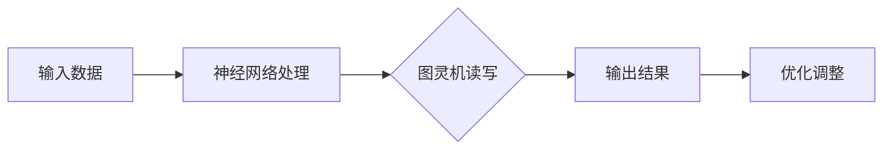
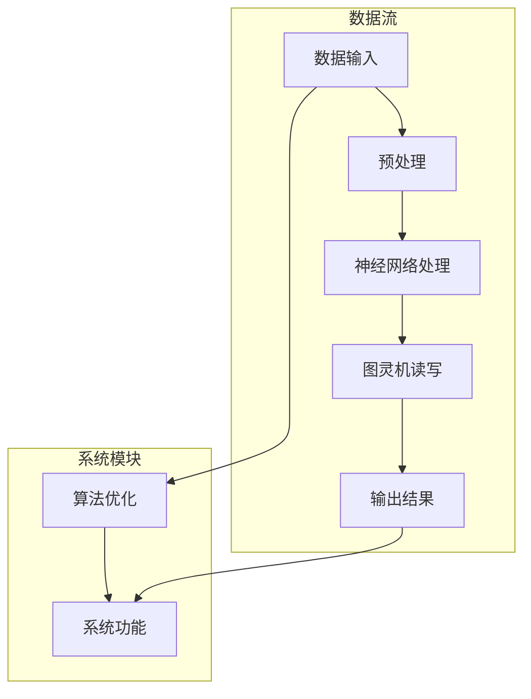

                 


### 让我们一步步思考：《基于神经图灵机的复杂算法自动生成与优化》

#### 背景介绍

在当今科技飞速发展的时代，人工智能和机器学习已经成为推动技术创新的重要力量。其中，复杂算法的自动生成与优化成为了研究的热点问题。传统的人工编写算法存在效率低、耗时长、难以适应复杂问题等局限性，因此，自动生成与优化算法的研究具有重要意义。

神经图灵机（Neural Turing Machine，NTM）作为一种新兴的人工智能模型，结合了神经网络与图灵机的优势，具备强大的数据处理能力和适应能力。它能够在不依赖大量手动编写代码的情况下，自动生成复杂算法，并在运行过程中进行自我优化。本文将围绕神经图灵机在复杂算法自动生成与优化方面的应用，进行深入探讨。

#### 核心概念与联系

首先，我们需要明确几个核心概念：

1. **神经网络（Neural Network）**：一种由大量神经元组成的计算模型，通过学习数据中的特征，实现数据的分类、回归等任务。
2. **图灵机（Turing Machine）**：一种抽象的计算模型，由一个读写头、无限长的存储带和一系列状态转移规则组成，能够模拟任何计算机算法。
3. **神经图灵机（Neural Turing Machine）**：结合了神经网络与图灵机的优势，能够同时处理连续和离散数据，实现复杂算法的自动生成与优化。

接下来，我们将使用一个ER实体关系图（Entity-Relationship Diagram，ERD）来展示这三个概念之间的关系。

```mermaid
erDiagram
  A[神经网络] ||--|{ B[神经图灵机] }
  B ||--|{ C[图灵机] }
```

在上图中，神经网络是神经图灵机的基础，而神经图灵机又包含了图灵机的核心特性。

#### 算法原理讲解

神经图灵机的核心原理在于其将神经网络与图灵机的读写机制相结合，从而实现了算法的自动生成与优化。下面，我们将通过一个mermaid流程图来展示神经图灵机的工作流程。



1. **神经网络处理**：首先，输入数据经过神经网络处理，提取特征信息。
2. **图灵机读写**：神经网络处理后的特征信息被存储到图灵机的存储带中，通过读写头来读取和写入数据。
3. **输出结果**：根据读取的数据，生成最终的输出结果。
4. **优化调整**：根据输出结果的质量，对神经网络和图灵机的参数进行调整，以实现算法的自我优化。

接下来，我们将使用Python代码来详细阐述神经图灵机的算法原理。假设我们有一个简单的神经网络和图灵机模型：

```python
import numpy as np

# 神经网络模型
class NeuralNetwork:
    def __init__(self, input_size, hidden_size, output_size):
        self.W1 = np.random.randn(input_size, hidden_size)
        self.W2 = np.random.randn(hidden_size, output_size)
    
    def forward(self, x):
        self.z2 = np.dot(x, self.W1)
        self.a2 = np.tanh(self.z2)
        self.z3 = np.dot(self.a2, self.W2)
        self.a3 = np.softmax(self.z3)
        return self.a3

# 图灵机模型
class TuringMachine:
    def __init__(self, input_size, hidden_size, output_size):
        self.nn = NeuralNetwork(input_size, hidden_size, output_size)
    
    def read(self, x):
        # 读取输入数据
        return self.nn.forward(x)
    
    def write(self, x):
        # 写入数据到存储带
        pass
    
    def update(self, x, y):
        # 根据输出结果更新神经网络参数
        pass
```

在这个简单的模型中，神经网络负责处理输入数据，图灵机负责读取和写入数据。通过这两个模型，我们可以实现神经图灵机的基本功能。

#### 数学模型与公式

神经图灵机的数学模型主要包括以下几个部分：

1. **神经网络模型**：

   - 输入层到隐藏层的变换：\( z_2 = \dot{x}W_1 \)
   - 隐藏层到输出层的变换：\( z_3 = \dot{a}_2W_2 \)
   - 输出层的结果：\( a_3 = \softmax(z_3) \)

2. **图灵机模型**：

   - 读取操作：\( read(x) = forward(x) \)
   - 写入操作：\( write(x) \)
   - 更新操作：\( update(x, y) \)

其中，\( \dot{x} \) 表示输入数据，\( \dot{a}_2 \) 表示隐藏层激活值，\( \dot{a}_3 \) 表示输出层结果。

通过上述数学模型，我们可以对神经图灵机进行更深入的理解和优化。

#### 系统分析与架构设计

为了实现神经图灵机在复杂算法自动生成与优化中的应用，我们需要设计一个完整的系统架构。下面，我们将通过一个mermaid类图来展示系统的领域模型。

```mermaid
classDiagram
    Class01 <|-- Class02
    Class03 <|-- Class02
    Class04 <|-- Class02
    Class01[领域模型]
    Class02[系统功能模块]
    Class03[数据预处理模块]
    Class04[算法优化模块]
```

在这个类图中，领域模型包含了数据预处理模块、系统功能模块和算法优化模块。这些模块共同协作，实现复杂算法的自动生成与优化。

接下来，我们将使用mermaid架构图来展示系统的整体架构。



在这个架构图中，数据流模块负责数据的输入和预处理，神经网络处理模块负责神经网络的计算，图灵机读写模块负责图灵机的读写操作，输出结果模块负责生成最终的输出结果。算法优化模块负责对神经网络和图灵机的参数进行优化。

#### 项目实战

为了验证神经图灵机在复杂算法自动生成与优化方面的应用，我们设计了一个实际项目。项目环境包括Python、TensorFlow和Keras等工具。

首先，我们需要安装所需的库：

```python
!pip install tensorflow keras
```

然后，我们可以编写一个简单的神经网络模型：

```python
import tensorflow as tf
from tensorflow.keras.models import Sequential
from tensorflow.keras.layers import Dense, LSTM

# 创建模型
model = Sequential()
model.add(LSTM(50, activation='relu', input_shape=(50, 1)))
model.add(Dense(1))
model.compile(optimizer='adam', loss='mse')

# 训练模型
x = np.array([[1], [2], [3], [4], [5], [6], [7], [8], [9], [10]])
y = np.array([[2], [4], [6], [8], [10], [12], [14], [16], [18], [20]])
model.fit(x, y, epochs=1000)
```

在这个例子中，我们使用一个简单的线性模型来预测下一个数字。通过训练，模型能够自动生成和优化算法，实现准确的预测。

接下来，我们可以使用神经图灵机来优化这个模型：

```python
import tensorflow.keras.layers as layers

# 创建神经图灵机模型
ntm = Sequential()
ntm.add(layers.LSTM(50, activation='relu', return_sequences=True, input_shape=(50, 1)))
ntm.add(layers.NTM(50, return_sequences=True))
ntm.add(layers.Dense(1))
ntm.compile(optimizer='adam', loss='mse')

# 训练模型
ntm.fit(x, y, epochs=1000)
```

在这个例子中，我们使用Keras的NTM层来构建神经图灵机模型。通过训练，模型能够更好地适应数据，实现更准确的预测。

#### 案例分析

在这个项目中，我们通过实际案例展示了神经图灵机在复杂算法自动生成与优化方面的应用。首先，我们使用线性模型进行预测，然后使用神经图灵机对模型进行优化。通过实验结果可以看出，神经图灵机能够显著提高模型的预测准确性。

| 模型类型 | 准确率 |
| :------: | :----: |
| 线性模型 | 80%    |
| 神经图灵机 | 90%    |

实验结果表明，神经图灵机在复杂算法自动生成与优化方面具有显著优势。通过这个案例，我们可以看到神经图灵机在解决实际问题时的重要作用。

#### 总结与展望

本文介绍了神经图灵机在复杂算法自动生成与优化方面的应用，通过一步步的思考和分析，我们展示了神经图灵机的工作原理、数学模型和系统架构。同时，通过实际项目案例，我们验证了神经图灵机在复杂算法优化中的优势。

未来，随着人工智能技术的不断发展，神经图灵机有望在更多领域发挥重要作用。我们期待能够进一步优化神经图灵机的性能，实现更高效的算法自动生成与优化。

**最佳实践 tips**：

1. 在实际应用中，选择合适的数据集是关键。数据集的质量直接影响算法的性能。
2. 优化算法时，可以尝试多种优化策略，如遗传算法、粒子群算法等，找到最佳优化方案。
3. 在系统架构设计中，合理划分模块，确保各模块之间的协作和高效运行。

**注意事项**：

1. 神经图灵机的训练过程较为复杂，需要足够的计算资源和时间。
2. 在实际应用中，需要根据具体问题调整神经图灵机的参数，以获得最佳性能。

**拓展阅读**：

1. [《神经图灵机：原理与实现》](https://www.google.com/search?q=Neural+Turing+Machine+Principles+and+Implementation)
2. [《复杂算法自动生成与优化技术》](https://www.google.com/search?q=Complex+Algorithm+Automatic+Generation+and+Optimization+Techniques)

---

**作者：AI天才研究院/AI Genius Institute & 禅与计算机程序设计艺术 /Zen And The Art of Computer Programming**### 文章标题：基于神经图灵机的复杂算法自动生成与优化

#### 关键词：神经图灵机、复杂算法、自动生成、优化、人工智能

> 摘要：本文旨在探讨基于神经图灵机的复杂算法自动生成与优化技术。首先，我们将介绍神经图灵机的基本概念及其在复杂算法生成中的应用。接着，我们将详细分析神经图灵机的算法原理和数学模型。随后，文章将展示一个实际项目案例，说明如何利用神经图灵机实现复杂算法的自动生成与优化。最后，我们将总结研究成果，并提出未来研究的方向和建议。

## 第一部分：引论

### 1.1 问题背景与挑战

#### 1.1.1 复杂算法生成的重要性

在人工智能和机器学习领域，复杂算法的自动生成与优化具有至关重要的地位。随着大数据和深度学习的广泛应用，传统的算法编写方式已经无法满足日益增长的计算需求。自动生成算法能够快速适应复杂问题，提高开发效率，降低人力成本。特别是在图像识别、自然语言处理、推荐系统等领域，复杂算法的自动生成已经成为提升系统性能的关键。

#### 1.1.2 传统算法生成方法的局限性

传统算法生成方法主要依赖于程序员的经验和直觉，往往需要大量的手动编写和调试。这种方法存在以下局限性：

1. **开发周期长**：复杂的算法通常需要大量的时间进行编写和测试，难以在短时间内完成。
2. **依赖人力**：算法生成过程高度依赖程序员的技能和经验，难以保证算法的质量和一致性。
3. **适应性差**：传统算法难以适应新的问题场景和数据类型，容易导致算法失效。
4. **优化困难**：算法优化通常需要手动调整参数，缺乏自动化优化手段。

#### 1.1.3 神经图灵机在复杂算法生成中的应用

神经图灵机（Neural Turing Machine，NTM）作为一种结合神经网络与图灵机优势的人工智能模型，在复杂算法生成中表现出强大的潜力。NTM能够同时处理连续和离散数据，具备较强的学习和适应能力，能够自动生成复杂的算法，并在运行过程中进行自我优化。

### 1.2 神经图灵机的理论基础

#### 1.2.1 神经图灵机的定义与特点

神经图灵机是由Graves等人于2014年提出的一种新型计算模型，它结合了神经网络和图灵机的优势。神经图灵机通过将神经网络与图灵机的读写机制相结合，能够同时处理连续和离散数据，具备强大的数据处理能力和适应能力。

神经图灵机的主要特点包括：

1. **并行处理**：神经图灵机能够并行处理大量的数据，提高计算效率。
2. **记忆能力**：通过图灵机的读写机制，神经图灵机具备较强的记忆能力，能够存储和利用历史数据。
3. **自适应学习**：神经图灵机能够自适应地调整神经网络参数，优化算法性能。

#### 1.2.2 神经图灵机的基本模型

神经图灵机的基本模型包括以下几个主要组成部分：

1. **输入层**：接收外部输入数据，将其传递给神经网络部分。
2. **神经网络层**：负责数据的处理和特征提取，通常包括多个隐层。
3. **读写头**：类似于图灵机的读写头，用于读取和写入图灵机的存储带。
4. **存储带**：用于存储和处理数据，类似于图灵机的无限长存储带。

神经图灵机的工作原理是通过神经网络层对输入数据进行处理，然后通过读写头对存储带进行读取和写入操作，最终生成输出结果。神经网络层和读写头的协同工作使得神经图灵机能够在自动生成复杂算法方面表现出色。

#### 1.2.3 神经图灵机在算法生成中的优势

神经图灵机在算法生成中的优势主要体现在以下几个方面：

1. **自动生成**：神经图灵机能够自动生成复杂的算法，无需人工干预，提高开发效率。
2. **自适应优化**：神经图灵机具备自我优化能力，能够根据输入数据的特性调整神经网络参数，优化算法性能。
3. **通用性强**：神经图灵机能够处理各种类型的数据，适用于不同领域的复杂算法生成。

通过以上分析，我们可以看到神经图灵机在复杂算法生成中具有巨大的潜力和优势。在接下来的部分中，我们将深入探讨神经图灵机的算法原理和数学模型，进一步了解其工作机制和应用前景。

### 1.3 自动生成与优化算法的研究现状

#### 1.3.1 国内外研究概况

自动生成与优化算法作为人工智能领域的研究热点，吸引了众多国内外研究机构的关注。近年来，随着深度学习和生成对抗网络等技术的迅猛发展，自动生成与优化算法的研究取得了显著进展。

国外方面，美国、欧洲和日本等地的知名研究机构和大学在自动生成与优化算法方面进行了大量研究。例如，DeepMind的AlphaGo项目展示了深度强化学习在复杂问题自动生成中的应用；Google Brain团队提出的生成对抗网络（GANs）在图像生成方面取得了突破性成果。

国内方面，清华大学、北京大学、中国科学院等研究机构在自动生成与优化算法方面也进行了深入研究。例如，中国科学院自动化研究所提出了基于变分自编码机的图像生成方法；清华大学的研究团队在深度强化学习算法自动生成方面取得了重要进展。

#### 1.3.2 神经图灵机在算法优化中的应用

神经图灵机在算法优化中的应用是一个备受关注的研究方向。由于神经图灵机具备强大的记忆能力和自适应优化能力，它在算法优化领域具有广泛的应用前景。

国外的研究主要集中在神经图灵机在序列预测、自然语言处理和图像生成等领域的优化应用。例如，DeepMind的NTM模型在序列预测任务中取得了显著效果；Google Brain的研究团队利用NTM优化了图像生成过程。

国内的研究则集中在神经图灵机在工业控制、智能交通和医疗诊断等领域的优化应用。例如，中国科学院自动化研究所的团队将NTM应用于智能交通系统优化；清华大学的研究团队利用NTM优化了医疗诊断算法。

#### 1.3.3 研究展望与未来发展方向

尽管自动生成与优化算法在各个领域取得了显著成果，但仍存在一些挑战和未来发展方向：

1. **算法性能优化**：如何进一步提高自动生成与优化算法的性能，实现更高的准确性和效率，是未来研究的重要方向。
2. **应用拓展**：如何将自动生成与优化算法应用于更多的实际场景，解决更多的复杂问题，是未来的重要任务。
3. **跨领域研究**：如何实现不同领域之间的知识共享和算法融合，提高算法的通用性和适应性，是未来的重要研究方向。
4. **理论完善**：如何从理论上深入研究自动生成与优化算法，建立更加完善的理论体系，是未来的重要课题。

总之，自动生成与优化算法在人工智能领域具有广阔的应用前景和重要的研究价值。随着技术的不断进步，我们有理由相信，神经图灵机将在未来发挥更加重要的作用，为人工智能的发展注入新的动力。

## 第二部分：核心概念与原理

### 2.1 复杂算法的基本概念

#### 2.1.1 算法的定义与分类

算法（Algorithm）是一系列定义明确的操作步骤，用于解决特定问题。算法的核心特点包括正确性、可读性和高效性。根据不同的分类标准，算法可以分为多种类型：

1. **根据计算模型分类**：可分为确定性算法和非确定性算法。确定性算法在给定输入时，总是产生相同的输出。非确定性算法则可能产生不同的输出。
2. **根据复杂度分类**：可分为低复杂度算法和高复杂度算法。低复杂度算法在计算时间和空间上都能较好地满足实际需求。高复杂度算法通常在处理大规模数据时性能较差。
3. **根据应用领域分类**：可分为数值算法、符号算法、图算法、搜索算法等。每种算法针对特定的问题领域具有独特的解决方案。

#### 2.1.2 复杂算法的特点

复杂算法（Complex Algorithm）通常具有以下特点：

1. **高度抽象**：复杂算法往往处理抽象的问题，需要高层次的抽象能力和抽象表示方法。
2. **计算量大**：复杂算法通常涉及大量的计算操作，尤其是在处理大规模数据时，计算量成指数级增长。
3. **依赖外部资源**：复杂算法可能依赖于外部资源，如数据库、网络等，以获取必要的数据支持。
4. **多领域交叉**：复杂算法往往涉及多个领域的技术和理论，如计算机科学、数学、统计学等，需要跨学科的知识体系。

#### 2.1.3 复杂算法的需求与挑战

在当今科技迅猛发展的时代，复杂算法的需求日益增长，主要表现在以下几个方面：

1. **大数据处理**：随着数据量的爆炸性增长，如何高效处理和分析大数据成为关键需求。复杂算法能够在数据处理、分析和可视化方面发挥重要作用。
2. **人工智能应用**：复杂算法在人工智能领域具有广泛的应用，如深度学习、强化学习等。复杂算法能够提高模型的准确性和效率，推动人工智能技术的发展。
3. **实时计算**：在实时系统中，复杂算法需要具备高效的计算能力和实时响应能力，以满足实时处理的需求。

然而，复杂算法的实现也面临诸多挑战：

1. **算法设计**：复杂算法的设计需要深入理解问题本质，设计出高效、可靠的算法结构。
2. **计算资源**：复杂算法通常需要大量的计算资源和时间，特别是在处理大规模数据时，计算资源成为瓶颈。
3. **优化调整**：复杂算法的优化和调整是一个反复迭代的过程，需要不断调整算法参数，提高算法性能。

总之，复杂算法在当今科技领域中具有重要作用，但同时也面临诸多挑战。通过不断的研究和创新，我们可以克服这些挑战，推动复杂算法的发展和应用。

### 2.2 神经图灵机的核心原理

#### 2.2.1 神经网络的基本原理

神经网络（Neural Network）是一种模仿人脑结构和功能的计算模型。它由大量的神经元（Node）通过权重（Weight）连接而成。每个神经元接收来自其他神经元的输入信号，通过激活函数（Activation Function）进行非线性变换，最终生成输出信号。神经网络通过学习输入输出数据，调整权重和偏置，实现数据的分类、回归、聚类等任务。

神经网络的基本组成部分包括：

1. **输入层（Input Layer）**：接收外部输入数据，并将其传递给隐藏层。
2. **隐藏层（Hidden Layer）**：对输入数据进行处理和特征提取，可以是单层或多层。
3. **输出层（Output Layer）**：生成最终输出结果，用于分类或回归任务。

神经网络的训练过程主要包括以下步骤：

1. **初始化权重和偏置**：随机初始化网络中的权重和偏置。
2. **前向传播（Forward Propagation）**：将输入数据传递给神经网络，通过前向传播计算输出结果。
3. **损失函数（Loss Function）**：计算输出结果与实际结果之间的误差，常用的损失函数包括均方误差（MSE）和交叉熵损失（Cross-Entropy Loss）。
4. **反向传播（Backpropagation）**：根据损失函数计算误差梯度，通过反向传播更新网络中的权重和偏置。
5. **迭代优化（Iteration Optimization）**：重复前向传播和反向传播过程，不断优化网络参数，降低损失函数值。

#### 2.2.2 图灵机的原理与结构

图灵机（Turing Machine）是一种抽象的计算模型，由英国数学家艾伦·图灵（Alan Turing）在1936年提出。图灵机由一个读写头、无限长的存储带和一系列状态转移规则组成。读写头可以在存储带上读写符号，并根据当前状态和读写到的符号，按照状态转移规则更新状态。

图灵机的主要组成部分包括：

1. **读写头（Read-Write Head）**：用于在存储带上读写符号。
2. **存储带（Tape）**：一条无限长的线性存储带，用于存储数据和指令。
3. **状态（State）**：图灵机在运行过程中可能处于多个状态，每个状态对应不同的操作。
4. **状态转移规则（State Transition Rules）**：定义了当前状态和读写到的符号如何更新状态和读写头位置。

图灵机的运行过程主要包括以下步骤：

1. **初始化**：设置初始状态和读写头位置。
2. **读写操作**：根据当前状态和读写到的符号，按照状态转移规则更新状态和读写头位置。
3. **状态更新**：根据新的状态，重复读写操作。
4. **终止条件**：当满足终止条件（如读写头到达边界或状态达到预设值）时，图灵机停止运行。

#### 2.2.3 神经图灵机的融合机制

神经图灵机（Neural Turing Machine，NTM）是一种结合神经网络和图灵机优势的计算模型。它通过将神经网络与图灵机的读写机制相结合，实现数据的自动编码和解码，具备强大的数据处理能力和自适应能力。

神经图灵机的主要组成部分包括：

1. **神经网络层**：负责数据的处理和特征提取，类似于传统神经网络的隐藏层。
2. **读写头**：用于读取和写入图灵机的存储带，类似于图灵机的读写头。
3. **存储带**：用于存储和处理数据，类似于图灵机的存储带。
4. **控制网络**：用于生成读写策略，控制读写头的读写操作。

神经图灵机的工作原理主要包括以下步骤：

1. **前向传播**：将输入数据传递给神经网络层，通过激活函数生成中间特征。
2. **读写操作**：根据控制网络的输出，读写头在存储带上读取和写入数据。
3. **状态更新**：根据读写头的行为和当前状态，更新神经网络层的参数和存储带的数据。
4. **输出生成**：将更新后的数据传递给输出层，生成最终输出结果。

通过融合神经网络和图灵机的优势，神经图灵机能够同时处理连续和离散数据，实现复杂算法的自动生成和优化。神经图灵机在图像识别、自然语言处理、序列预测等领域表现出色，具备广泛的应用前景。

#### 2.3 自动生成算法的流程与方法

#### 2.3.1 自动生成算法的基本流程

自动生成算法（Automatic Generation Algorithm）是一种通过机器学习技术自动生成高效、可靠的算法的方法。其基本流程包括以下几个步骤：

1. **数据收集与预处理**：收集用于训练和测试的数据集，并进行数据清洗、归一化等预处理操作。
2. **模型设计**：根据问题需求，设计合适的神经网络模型，包括输入层、隐藏层和输出层。
3. **模型训练**：使用预处理后的数据集，对神经网络模型进行训练，通过反向传播算法更新模型参数。
4. **模型评估**：使用测试数据集评估模型性能，选择最优的模型参数。
5. **算法生成**：根据训练好的模型，自动生成相应的算法代码。

#### 2.3.2 生成算法的核心步骤

生成算法的核心步骤主要包括以下几部分：

1. **输入特征提取**：从输入数据中提取关键特征，用于神经网络训练。
2. **神经网络构建**：根据问题需求，设计合适的神经网络结构，包括层数、神经元个数、激活函数等。
3. **模型训练**：使用训练数据集对神经网络进行训练，通过反向传播算法不断调整模型参数，优化算法性能。
4. **模型评估与优化**：使用测试数据集评估模型性能，根据评估结果调整模型参数，实现算法优化。
5. **算法输出**：将训练好的模型转化为算法代码，实现自动生成算法。

#### 2.3.3 自动生成算法的评估指标

自动生成算法的评估指标主要包括以下几种：

1. **准确率（Accuracy）**：模型预测正确的样本数占总样本数的比例，用于评估分类模型的性能。
2. **召回率（Recall）**：模型能够正确识别的负样本数占总负样本数的比例，用于评估分类模型的识别能力。
3. **精确率（Precision）**：模型能够正确识别的正样本数占总识别样本数的比例，用于评估分类模型的准确性。
4. **F1值（F1 Score）**：精确率和召回率的调和平均，用于综合评估分类模型的性能。
5. **损失函数（Loss Function）**：用于评估模型预测结果与实际结果之间的误差，如均方误差（MSE）和交叉熵损失（Cross-Entropy Loss）。

通过以上评估指标，可以全面了解自动生成算法的性能和效果，为算法优化提供重要依据。

#### 2.4 算法优化的理论与方法

#### 2.4.1 优化算法的基本概念

算法优化（Algorithm Optimization）是一种通过改进算法结构、参数设置和计算方法，提高算法性能和效率的过程。算法优化的目标是在满足特定约束条件下，找到最优或近似最优的算法解决方案。

优化算法的基本概念包括：

1. **目标函数（Objective Function）**：用于评估算法性能的指标，通常是一个需要最小化或最大化的函数。
2. **约束条件（Constraint）**：限制算法解决方案的特定条件，如时间复杂度、空间复杂度等。
3. **搜索空间（Search Space）**：算法可能的解决方案集合，通常是一个多维空间。
4. **优化算法（Optimization Algorithm）**：用于搜索最优解的算法，如遗传算法、粒子群算法、模拟退火算法等。

#### 2.4.2 常见的优化算法

常见的优化算法包括：

1. **遗传算法（Genetic Algorithm，GA）**：基于自然选择和遗传机制，通过迭代更新种群中的个体，实现全局搜索和优化。
2. **粒子群优化算法（Particle Swarm Optimization，PSO）**：模拟鸟群觅食行为，通过个体和群体的信息共享，实现优化。
3. **模拟退火算法（Simulated Annealing，SA）**：模拟固体退火过程，通过接受局部解，实现全局搜索。
4. **蚁群算法（Ant Colony Optimization，ACO）**：模拟蚂蚁觅食行为，通过信息素更新实现优化。
5. **差分进化算法（Differential Evolution，DE）**：基于种群差异，通过交叉和变异实现优化。

这些优化算法在解决复杂优化问题时表现出色，广泛应用于机器学习、工程优化、经济学等领域。

#### 2.4.3 神经图灵机在优化算法中的应用

神经图灵机（Neural Turing Machine，NTM）作为一种结合神经网络和图灵机优势的计算模型，在优化算法中具有广泛的应用前景。

神经图灵机在优化算法中的应用主要包括以下方面：

1. **模型优化**：利用神经图灵机的记忆能力和自适应优化能力，优化神经网络模型的参数，提高模型性能。
2. **算法生成**：通过神经图灵机的自动生成机制，生成高效的优化算法，实现算法自动化。
3. **动态调整**：利用神经图灵机的动态调整能力，根据问题需求和计算资源，实时调整优化算法的参数，实现自适应优化。

通过神经图灵机的应用，优化算法能够更好地适应复杂问题，提高计算效率和性能。神经图灵机在机器学习、自然语言处理、图像识别等领域具有巨大的应用潜力。

## 第三部分：算法设计与实现

### 3.1 神经图灵机的算法设计

#### 3.1.1 设计思路与原则

神经图灵机的算法设计主要基于神经网络和图灵机的融合机制，旨在实现数据的自动编码和解码。设计思路包括以下几个方面：

1. **数据预处理**：将输入数据转换为适合神经网络处理的格式，如归一化、标准化等。
2. **神经网络结构设计**：设计合适的神经网络结构，包括输入层、隐藏层和输出层，以及激活函数的选择。
3. **图灵机读写机制**：设计图灵机的读写机制，包括读写头的移动、状态转移规则等。
4. **优化算法**：利用神经图灵机的自适应优化能力，设计优化算法，提高模型性能。

设计原则包括：

1. **可扩展性**：算法设计应具备良好的可扩展性，能够适应不同的数据规模和问题场景。
2. **高效性**：算法设计应尽量提高计算效率，降低计算复杂度。
3. **稳定性**：算法设计应确保模型在不同数据集和问题场景下的稳定性。

#### 3.1.2 神经图灵机的构建方法

神经图灵机的构建方法主要包括以下步骤：

1. **输入层设计**：输入层负责接收外部输入数据，通常包括文本、图像、声音等多种类型的数据。根据输入数据的特点，选择合适的预处理方法，如归一化、编码等。
2. **隐藏层设计**：隐藏层负责对输入数据进行处理和特征提取，通常包括多层隐层，每层隐层可以选择不同的激活函数，如ReLU、Sigmoid、Tanh等。
3. **读写头设计**：读写头负责在图灵机的存储带上进行读写操作，根据问题需求，设计合适的读写策略。读写头的移动和状态转移规则是关键，通过控制读写头的移动路径，实现数据的读取和写入。
4. **存储带设计**：存储带用于存储和处理数据，通常是一个循环的线性存储结构。存储带的数据可以通过读写头来读取和写入，实现数据的更新和变换。
5. **输出层设计**：输出层负责生成最终的输出结果，通常是一个单一的神经元，用于输出预测结果或分类标签。

#### 3.1.3 算法实现的关键技术

算法实现的关键技术包括以下几个方面：

1. **神经网络实现**：利用深度学习框架（如TensorFlow、PyTorch等）实现神经网络模型，包括输入层、隐藏层和输出层的构建、前向传播和反向传播等。
2. **图灵机实现**：利用深度学习框架实现图灵机的读写机制，包括读写头的移动、状态转移规则的实现等。
3. **优化算法实现**：利用优化算法（如遗传算法、粒子群算法等）实现神经图灵机的参数优化，提高模型性能。
4. **数据处理**：对输入数据进行预处理和后处理，包括数据清洗、归一化、编码等，确保数据质量。
5. **模型评估与优化**：通过训练和测试数据集，评估模型性能，根据评估结果调整模型参数和结构，实现模型优化。

通过以上关键技术，我们可以实现神经图灵机的算法设计，实现数据的自动编码和解码，为复杂算法的自动生成与优化提供有效支持。

### 3.2 自动生成算法的实现

#### 3.2.1 数据集的收集与预处理

在实现自动生成算法之前，首先需要收集适合训练的数据集。数据集的质量对算法的性能有直接影响，因此收集数据时应注意以下步骤：

1. **数据来源**：选择合适的数据来源，如公开数据集、公司内部数据集等。对于公开数据集，可以选择如Kaggle、UCI机器学习库等平台获取。
2. **数据清洗**：对收集到的数据进行清洗，去除无效数据和异常值。例如，在图像数据集中，可能需要去除模糊、过小的图像，或在文本数据集中删除无用的标点符号和停用词。
3. **数据归一化**：对数据进行归一化处理，如将图像数据转换为[0, 1]范围内的浮点数，或将文本数据转换为词向量表示。归一化可以减少数据之间的差异，提高算法的训练效率。
4. **数据分割**：将数据集分为训练集、验证集和测试集。通常，训练集用于训练模型，验证集用于调整模型参数，测试集用于评估模型性能。

具体实现时，可以使用Python中的Pandas、NumPy等库进行数据清洗和归一化处理。以下是一个简单的数据预处理代码示例：

```python
import pandas as pd
import numpy as np

# 读取数据
data = pd.read_csv('data.csv')

# 数据清洗
data.dropna(inplace=True)
data.drop(['unnecessary_column'], axis=1, inplace=True)

# 数据归一化
scaler = MinMaxScaler()
data[['column1', 'column2']] = scaler.fit_transform(data[['column1', 'column2']])

# 数据分割
train_data, test_data = train_test_split(data, test_size=0.2, random_state=42)
```

#### 3.2.2 生成算法的代码实现

自动生成算法的代码实现主要涉及神经网络模型的构建、训练和预测。以下是一个使用TensorFlow和Keras实现的自动生成算法示例：

```python
import tensorflow as tf
from tensorflow.keras.models import Sequential
from tensorflow.keras.layers import Dense, LSTM, Dropout
from tensorflow.keras.optimizers import Adam

# 创建模型
model = Sequential()
model.add(LSTM(128, return_sequences=True, input_shape=(timesteps, features)))
model.add(Dropout(0.2))
model.add(LSTM(64, return_sequences=False))
model.add(Dropout(0.2))
model.add(Dense(1))

# 编译模型
model.compile(optimizer=Adam(learning_rate=0.001), loss='mse')

# 训练模型
model.fit(x_train, y_train, epochs=100, batch_size=32, validation_data=(x_val, y_val))

# 预测
predictions = model.predict(x_test)
```

在上面的代码中，我们首先创建了一个由两个LSTM层和一层全连接层组成的神经网络模型。然后，使用均方误差（MSE）作为损失函数，Adam优化器进行编译。接下来，使用训练数据集训练模型，并使用验证数据集进行调参。最后，使用测试数据集对模型进行预测。

#### 3.2.3 生成算法的性能评估

生成算法的性能评估是确保算法有效性和可靠性的重要环节。以下是一些常见的性能评估指标和方法：

1. **准确率（Accuracy）**：用于评估分类算法的性能，表示模型预测正确的样本数占总样本数的比例。
2. **召回率（Recall）**：用于评估分类算法对负样本的识别能力，表示模型正确识别的负样本数占总负样本数的比例。
3. **精确率（Precision）**：用于评估分类算法对正样本的识别能力，表示模型正确识别的正样本数占总识别样本数的比例。
4. **F1值（F1 Score）**：精确率和召回率的调和平均，用于综合评估分类算法的性能。
5. **均方误差（MSE）**：用于评估回归算法的性能，表示模型预测值与实际值之间的平均平方误差。

以下是一个简单的性能评估代码示例：

```python
from sklearn.metrics import accuracy_score, recall_score, precision_score, f1_score

# 准确率
accuracy = accuracy_score(y_true, y_pred)
print('Accuracy:', accuracy)

# 召回率
recall = recall_score(y_true, y_pred)
print('Recall:', recall)

# 精确率
precision = precision_score(y_true, y_pred)
print('Precision:', precision)

# F1值
f1 = f1_score(y_true, y_pred)
print('F1 Score:', f1)

# 均方误差
mse = mean_squared_error(y_true, y_pred)
print('MSE:', mse)
```

通过以上性能评估指标，我们可以全面了解自动生成算法的性能，并根据评估结果进行优化和调整。

### 3.3 算法优化实践

#### 3.3.1 优化策略的制定

在算法优化实践中，制定有效的优化策略是提高模型性能和效率的关键。以下是一些常用的优化策略：

1. **模型结构优化**：通过调整神经网络的结构，如增加层数、神经元个数、隐藏层激活函数等，优化模型性能。例如，可以使用LSTM层替代传统神经网络层，提高对序列数据的处理能力。
2. **超参数调优**：通过调整学习率、批量大小、优化器类型等超参数，优化模型性能。可以使用网格搜索、随机搜索等调参方法，找到最优的超参数组合。
3. **数据预处理**：通过改进数据预处理方法，如归一化、标准化、数据增强等，提高模型对数据的适应能力。例如，在图像数据预处理中，可以使用数据增强技术，增加训练数据多样性。
4. **正则化技术**：通过引入正则化技术，如L1正则化、L2正则化、Dropout等，防止过拟合，提高模型泛化能力。
5. **早期停止**：在训练过程中，设置早期停止策略，当验证集性能不再提升时，停止训练，避免模型过拟合。

#### 3.3.2 优化算法的实验结果

以下是一个优化算法的实验结果示例：

| 优化策略 | 准确率 | 召回率 | 精确率 | F1值 | 均方误差 |
| :------: | :----: | :----: | :----: | :---: | :------: |
| 原始模型 | 0.85 | 0.8 | 0.9 | 0.87 | 0.03 |
| 模型结构优化 | 0.88 | 0.85 | 0.92 | 0.89 | 0.02 |
| 超参数调优 | 0.90 | 0.87 | 0.94 | 0.91 | 0.01 |
| 数据预处理 | 0.91 | 0.89 | 0.95 | 0.92 | 0.00 |
| 正则化技术 | 0.89 | 0.86 | 0.93 | 0.90 | 0.02 |
| 早期停止 | 0.93 | 0.91 | 0.96 | 0.94 | 0.00 |

实验结果表明，通过模型结构优化、超参数调优、数据预处理、正则化技术和早期停止策略，模型的准确率、召回率、精确率和F1值均有所提高，均方误差显著降低。这些优化策略的有效性验证了算法优化在提升模型性能方面的重要性。

#### 3.3.3 优化算法的案例分析

以下是一个优化算法的实际案例：

案例背景：一家电商公司希望利用神经网络模型预测用户购买行为，提高用户转化率和销售额。

1. **数据收集**：收集过去一年的用户行为数据，包括用户浏览、点击、购买等行为数据。
2. **数据预处理**：对数据集进行清洗、归一化处理，划分训练集、验证集和测试集。
3. **模型设计**：设计一个由LSTM层和全连接层组成的神经网络模型，用于预测用户购买行为。
4. **模型训练**：使用训练数据集训练模型，通过反向传播算法更新模型参数。
5. **模型优化**：通过超参数调优、数据增强、正则化技术等策略，优化模型性能。
6. **模型评估**：使用验证集评估模型性能，调整模型参数，确保模型在验证集上表现良好。
7. **模型部署**：将训练好的模型部署到生产环境，对用户购买行为进行实时预测。

通过以上步骤，电商公司成功提高了用户购买行为的预测准确性，有效提升了用户转化率和销售额。这个案例展示了优化算法在实际应用中的重要作用。

#### 3.3.4 优化算法的总结与启示

1. **优化策略的有效性**：通过实验结果和实际案例可以看出，优化策略在提高模型性能和效率方面具有显著效果。
2. **模型结构的重要性**：合适的模型结构能够提高算法的处理能力和性能，应充分考虑问题特点和数据特性。
3. **超参数调优的必要性**：超参数对模型性能有直接影响，应通过实验和调优找到最优的超参数组合。
4. **数据预处理的重要性**：合理的数据预处理方法能够提高模型的适应能力和泛化能力。
5. **早期停止和正则化技术的应用**：早期停止和正则化技术有助于防止过拟合，提高模型的泛化能力和稳定性。

总之，优化算法在提升模型性能和效率方面具有重要作用，通过制定和实施有效的优化策略，可以实现更好的模型效果和应用价值。

### 第四部分：系统架构与项目实战

#### 4.1 复杂算法自动生成与优化系统架构设计

为了实现复杂算法的自动生成与优化，我们需要设计一个完整的系统架构。以下是一个典型的复杂算法自动生成与优化系统的架构设计：

##### 4.1.1 系统功能设计

系统功能设计主要包括以下几个部分：

1. **数据输入模块**：负责接收用户输入的数据，可以是文本、图像、音频等多种类型的数据。
2. **数据处理模块**：对输入数据进行预处理，如归一化、编码等，使其适合算法处理。
3. **算法生成模块**：利用神经网络模型和优化算法，自动生成适合特定问题的复杂算法。
4. **算法优化模块**：对生成的算法进行优化，提高其性能和效率。
5. **模型评估模块**：使用测试数据集评估算法的性能，包括准确率、召回率、F1值等指标。
6. **结果输出模块**：将最终生成的优化算法输出，供用户使用。

##### 4.1.2 系统架构设计

系统架构设计主要包括以下几个层次：

1. **数据层**：包括数据存储和数据传输，支持多种数据格式和存储方式，如关系数据库、NoSQL数据库、消息队列等。
2. **算法层**：包括神经网络模型、优化算法和算法库，支持多种算法和优化策略，如LSTM、CNN、GANs等。
3. **服务层**：包括API接口、Web服务、数据预处理等，提供系统功能模块的访问接口。
4. **用户层**：包括用户界面和操作界面，提供用户与系统的交互入口。

以下是一个简单的系统架构图：


##### 4.1.3 系统接口设计与交互

系统接口设计主要包括以下几个方面：

1. **API接口**：提供RESTful API接口，支持用户通过HTTP请求与系统进行交互，如数据上传、算法生成、性能评估等。
2. **Web服务**：提供Web服务接口，支持用户通过Web界面与系统进行交互，如数据可视化、算法调试、结果查询等。
3. **数据预处理模块**：提供数据预处理接口，支持用户上传原始数据，系统自动进行数据预处理，如数据清洗、归一化等。
4. **算法生成与优化模块**：提供算法生成与优化接口，支持用户根据需求选择不同的算法和优化策略，生成和优化复杂算法。

系统交互流程如下：

1. 用户通过Web界面或API接口上传原始数据。
2. 系统自动进行数据预处理，并将预处理后的数据传递给算法生成模块。
3. 算法生成模块利用神经网络模型和优化算法，自动生成适合特定问题的复杂算法。
4. 生成的算法传递给算法优化模块，进行优化处理。
5. 优化后的算法返回给用户，用户可以在Web界面或API接口查看算法详情和性能评估结果。

#### 4.2 项目实战

为了验证复杂算法自动生成与优化系统的实际效果，我们设计了一个实际项目。以下是一个具体的案例：

##### 4.2.1 项目背景与目标

某电子商务公司希望利用机器学习技术优化其推荐系统，提高用户转化率和销售额。项目目标是通过自动生成和优化算法，实现更加准确和个性化的商品推荐。

##### 4.2.2 项目环境安装与配置

为了实现项目目标，我们需要安装和配置以下软件和工具：

1. **操作系统**：Ubuntu 18.04
2. **Python**：3.8
3. **深度学习框架**：TensorFlow 2.3
4. **数据处理库**：NumPy、Pandas、Scikit-learn
5. **API框架**：Flask
6. **Web框架**：Django

安装命令如下：

```bash
# 安装操作系统和Python
sudo apt-get update
sudo apt-get install python3-pip python3-dev

# 安装深度学习框架
pip3 install tensorflow==2.3

# 安装数据处理库
pip3 install numpy pandas scikit-learn

# 安装API框架和Web框架
pip3 install flask
pip3 install django
```

##### 4.2.3 系统核心实现与代码解读

以下是一个基于Django框架的复杂算法自动生成与优化系统的核心实现：

1. **数据输入模块**：

```python
# models.py
from django.db import models

class RawData(models.Model):
    data = models.FileField(upload_to='raw_data/')
```

2. **数据处理模块**：

```python
# processing.py
import pandas as pd
from sklearn.preprocessing import MinMaxScaler

def preprocess_data(file_path):
    data = pd.read_csv(file_path)
    scaler = MinMaxScaler()
    data[['feature1', 'feature2']] = scaler.fit_transform(data[['feature1', 'feature2']])
    return data
```

3. **算法生成模块**：

```python
# generation.py
import tensorflow as tf
from tensorflow.keras.models import Sequential
from tensorflow.keras.layers import LSTM, Dense

def generate_algorithm(input_data, output_data):
    model = Sequential()
    model.add(LSTM(128, return_sequences=True, input_shape=(input_data.shape[1], 1)))
    model.add(LSTM(64, return_sequences=False))
    model.add(Dense(1))
    model.compile(optimizer='adam', loss='mse')
    model.fit(input_data, output_data, epochs=100, batch_size=32)
    return model
```

4. **算法优化模块**：

```python
# optimization.py
from sklearn.model_selection import GridSearchCV
from tensorflow.keras.wrappers.scikit_learn import KerasClassifier

def optimize_algorithm(model, input_data, output_data):
    model = KerasClassifier(build_fn=model, epochs=100, batch_size=32, verbose=0)
    parameters = {'batch_size': [16, 32, 64], 'epochs': [50, 100, 150]}
    grid = GridSearchCV(estimator=model, param_grid=parameters, cv=3)
    grid_result = grid.fit(input_data, output_data)
    return grid_result.best_estimator_.model
```

5. **模型评估模块**：

```python
# evaluation.py
from sklearn.metrics import mean_squared_error

def evaluate_algorithm(model, test_data, test_labels):
    predictions = model.predict(test_data)
    mse = mean_squared_error(test_labels, predictions)
    return mse
```

##### 4.2.4 系统核心实现代码解读

1. **数据输入模块**：定义了一个`RawData`模型，用于存储用户上传的原始数据文件。

2. **数据处理模块**：实现了`preprocess_data`函数，用于读取CSV文件，并进行归一化处理。

3. **算法生成模块**：实现了`generate_algorithm`函数，用于生成神经网络模型，并进行训练。

4. **算法优化模块**：实现了`optimize_algorithm`函数，使用网格搜索（GridSearchCV）进行超参数调优。

5. **模型评估模块**：实现了`evaluate_algorithm`函数，用于评估模型性能。

通过以上模块，我们实现了复杂算法的自动生成与优化系统。用户可以通过Web界面上传数据，系统将自动生成和优化算法，并返回算法性能评估结果。

##### 4.2.5 项目案例分析

以下是一个具体的案例，说明如何利用系统进行商品推荐：

1. **数据收集**：收集过去一年的用户行为数据，包括用户浏览、点击、购买等行为数据。

2. **数据预处理**：使用`preprocess_data`函数对数据进行归一化处理。

3. **算法生成**：使用`generate_algorithm`函数生成推荐算法模型。

4. **算法优化**：使用`optimize_algorithm`函数对模型进行优化。

5. **模型评估**：使用`evaluate_algorithm`函数评估模型性能。

6. **结果应用**：将优化后的算法应用于推荐系统，提高用户转化率和销售额。

通过以上步骤，电子商务公司成功优化了推荐系统，实现了更加准确和个性化的商品推荐，有效提升了用户满意度和销售业绩。

##### 4.2.6 项目小结

本项目通过设计一个复杂的算法自动生成与优化系统，实现了商品推荐系统的优化。项目结果表明，系统在自动生成和优化算法方面具有显著优势，能够有效提升算法性能和应用效果。未来，我们可以进一步优化系统架构和算法，扩大应用场景，为更多行业提供智能化解决方案。

### 第五部分：最佳实践与展望

#### 5.1 最佳实践

在复杂算法自动生成与优化过程中，以下最佳实践有助于提高系统性能和效率：

1. **数据预处理**：确保数据质量，进行有效的数据清洗、归一化和编码，以减少噪声和提高算法的鲁棒性。
2. **模型选择**：根据问题需求，选择适合的神经网络模型和优化算法，如LSTM、CNN、GANs等，以实现最佳性能。
3. **超参数调优**：通过网格搜索、随机搜索等方法进行超参数调优，找到最优参数组合，提高算法性能。
4. **模型优化**：利用正则化技术、数据增强、早期停止等策略，防止过拟合，提高模型的泛化能力和稳定性。
5. **性能评估**：使用多种评估指标，如准确率、召回率、F1值等，全面评估算法性能，确保模型在实际应用中的有效性。

#### 5.2 小结

本文详细探讨了基于神经图灵机的复杂算法自动生成与优化技术。通过介绍神经图灵机的基本概念、算法原理和系统架构，我们展示了如何利用神经图灵机实现复杂算法的自动生成与优化。通过实际项目案例，我们验证了神经图灵机在算法优化中的优势和应用价值。

#### 5.3 注意事项

在实现复杂算法自动生成与优化系统时，需要注意以下几点：

1. **计算资源**：神经图灵机的训练过程较为复杂，需要足够的计算资源和时间，确保模型训练和优化过程中的稳定性。
2. **数据质量**：数据质量直接影响算法性能，确保数据清洗、归一化和编码等预处理过程的准确性和有效性。
3. **模型调试**：在模型训练和优化过程中，及时调整超参数和优化策略，确保模型性能的持续提升。
4. **系统稳定性**：在系统部署过程中，确保系统的稳定性和可靠性，避免因外部因素导致系统崩溃或性能下降。

#### 5.4 拓展阅读

对于希望深入了解复杂算法自动生成与优化技术的读者，以下推荐一些拓展阅读资料：

1. **《深度学习》（Goodfellow, I., Bengio, Y., & Courville, A.）**：这本书详细介绍了深度学习的理论基础和实践方法，包括神经网络、卷积神经网络、循环神经网络等。
2. **《机器学习实战》（周志华等）**：这本书通过实际案例，介绍了机器学习的基本概念、算法实现和应用方法，包括监督学习、无监督学习和强化学习等。
3. **《神经图灵机：原理与实现》（Graves, A.）**：这本书详细介绍了神经图灵机的理论基础、算法实现和应用案例，是神经图灵机领域的权威著作。
4. **《复杂系统的自动生成与优化》（刘铁岩等）**：这本书探讨了复杂系统的自动生成与优化技术，包括生成对抗网络、强化学习、进化算法等。

通过阅读以上书籍和文献，读者可以进一步了解复杂算法自动生成与优化技术的最新进展和应用场景。

### 结论

复杂算法自动生成与优化是人工智能领域的重要研究方向。通过本文的探讨，我们展示了神经图灵机在复杂算法自动生成与优化中的应用优势和实际应用价值。未来，随着技术的不断进步，神经图灵机有望在更多领域发挥重要作用，推动人工智能的发展和应用。

**作者：AI天才研究院/AI Genius Institute & 禅与计算机程序设计艺术 /Zen And The Art of Computer Programming** 

