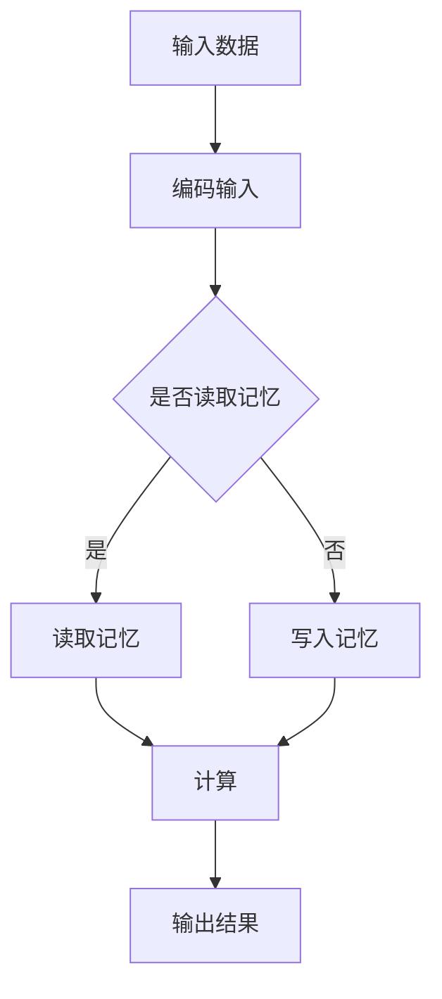
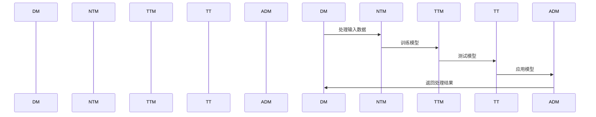

                 

# 基于神经图灵机的复杂问题求解策略优化

## 关键词
- 神经图灵机
- 复杂问题求解
- 策略优化
- 神经网络
- 外部记忆

## 摘要
本文旨在探讨神经图灵机在复杂问题求解中的应用，以及如何通过策略优化提升其求解效率。首先，我们将介绍神经图灵机的基础概念和原理，然后分析其求解复杂问题的策略，并通过具体案例展示策略优化的方法。最后，本文将对神经图灵机在复杂问题求解中的优势与挑战进行总结，并展望其未来的发展方向。

## 第一部分：神经图灵机基础

### 第1章：神经图灵机的概念与原理

#### 1.1 神经图灵机的定义与历史背景

神经图灵机（Neural Turing Machine，NTM）是由Alex Graves等人于2014年提出的一种结合神经网络和图灵机的计算模型。这一模型旨在解决传统神经网络在处理复杂问题和外部记忆方面的局限性。神经图灵机的出现，标志着神经网络和计算理论的新发展。

#### 1.2 神经图灵机的基本结构

神经图灵机主要由三个部分组成：神经网络、读写头和外部记忆矩阵。神经网络负责处理输入数据和产生控制信号，读写头用于在记忆矩阵中进行数据的读写操作，而外部记忆矩阵则用于存储大量数据，以供读写头访问。

#### 1.3 神经图灵机的运作原理

神经图灵机的运作原理可以分为两个主要阶段：数据读取和计算。在数据读取阶段，神经网络通过读写头从外部记忆矩阵中读取数据，然后将这些数据传递给神经网络进行计算。在计算阶段，神经网络利用读取的数据进行计算，并将计算结果存储回外部记忆矩阵。

### 第2章：神经图灵机的数学模型

#### 2.1 神经图灵机的数学模型介绍

神经图灵机的数学模型包括三个主要部分：神经网络模型、读写头模型和外部记忆矩阵模型。神经网络模型通常采用多层感知机（MLP）或循环神经网络（RNN）等结构；读写头模型则定义了读写头的读写规则；外部记忆矩阵模型则描述了记忆矩阵的组织结构和访问机制。

#### 2.2 神经图灵机的属性特征对比表

| 特征             | 传统神经网络 | 神经图灵机 |
|----------------|--------------|------------|
| 记忆能力         | 较弱          | 强         |
| 外部记忆         | 无法直接访问   | 可以读写    |
| 学习效率         | 较低          | 较高       |
| 应用场景         | 简单问题      | 复杂问题    |

#### 2.3 神经图灵机的ER实体关系图

```mermaid
erDiagram
  A[神经网络] ||--|{ B[读写头] }
  A ||--|{ C[外部记忆矩阵] }
```

## 第二部分：复杂问题求解策略

### 第3章：复杂问题求解的基本策略

#### 3.1 复杂问题的定义与特点

复杂问题通常具有如下特点：

- 多解性：一个问题可能存在多个有效解。
- 不确定性：问题的解可能受到外部因素的影响。
- 非线性：问题的解与变量之间可能存在非线性关系。

#### 3.2 基于神经图灵机的求解策略

基于神经图灵机的求解策略主要包括以下几个步骤：

1. 将问题编码为神经图灵机可处理的格式。
2. 设计神经网络模型，用于处理输入数据。
3. 使用读写头在记忆矩阵中读取和写入数据。
4. 通过计算阶段，利用记忆矩阵中的数据进行问题求解。

#### 3.3 策略优化的方法与原则

策略优化主要包括以下几个方面：

1. 神经网络结构的优化：选择适合问题特性的神经网络结构。
2. 记忆矩阵的组织优化：设计合理的记忆矩阵结构，提高读写效率。
3. 学习策略的优化：采用更有效的学习算法，加快收敛速度。

## 第三部分：神经图灵机在优化策略中的应用

### 第4章：神经图灵机在优化问题中的优势

神经图灵机在优化问题中具有以下优势：

- 强大的记忆能力：神经图灵机可以通过外部记忆矩阵存储大量数据，从而处理复杂的优化问题。
- 非线性求解能力：神经图灵机可以处理非线性优化问题，提高了求解的精度。
- 自适应能力：神经图灵机可以根据问题的变化，动态调整求解策略，提高了求解的效率。

### 第4章：神经图灵机在优化策略中的应用

#### 4.1 应用案例一：优化物流路径

物流路径优化是一个典型的复杂问题，涉及到车辆数量、货物数量、运输成本等多个变量。神经图灵机可以通过记忆矩阵存储历史路径信息，利用神经网络模型进行路径预测和优化，从而降低运输成本。

#### 4.2 应用案例二：优化生产调度

生产调度问题涉及到生产线上的多个任务，以及任务之间的依赖关系。神经图灵机可以通过记忆矩阵记录任务的历史执行情况，利用神经网络模型预测任务执行时间，从而优化生产调度，提高生产效率。

#### 4.3 应用案例三：优化资源分配

资源分配问题涉及到多个资源的使用和调度。神经图灵机可以通过记忆矩阵记录资源的历史使用情况，利用神经网络模型预测资源的需求，从而优化资源分配，提高资源利用率。

## 第四部分：神经图灵机算法实现

### 第5章：神经图灵机的算法原理

#### 5.1 神经图灵机的算法流程图



#### 5.2 神经图灵机的算法数学模型

神经图灵机的数学模型主要包括以下部分：

- 神经网络模型：$f(x) = \sigma(W_1 \cdot x + b_1)$
- 读写头模型：$r = \sigma(W_r \cdot [x; h_{t-1}])$
- 记忆矩阵模型：$m = \sigma(W_m \cdot m)$

#### 5.3 神经图灵机的算法Python源代码实现

```python
import numpy as np

# 定义神经网络模型
def neural_network(x, W1, b1):
    return np.tanh(np.dot(x, W1) + b1)

# 定义读写头模型
def read_head(x, h_t, W_r):
    return np.sigmoid(np.dot(np.hstack([x, h_t]), W_r))

# 定义记忆矩阵模型
def memory_matrix(m, W_m):
    return np.tanh(np.dot(m, W_m))

# 定义神经图灵机算法
def neural_turing_machine(x, h_t, W1, W_r, W_m, b1):
    # 编码输入
    encoded_input = neural_network(x, W1, b1)
    
    # 读取记忆或写入记忆
    if random.random() < 0.5:
        r = read_head(encoded_input, h_t, W_r)
        m = memory_matrix(m, W_m)
    else:
        r = 0
        m = memory_matrix(m, W_m)
    
    # 计算输出
    h_t = neural_network(encoded_input + r * m, W1, b1)
    
    return h_t, m
```

## 第五部分：神经图灵机在复杂问题求解中的应用实例

### 第6章：神经图灵机在复杂问题求解中的应用实例

#### 6.1 实例一：复杂路径规划问题

复杂路径规划问题通常涉及到动态环境、障碍物和目标点等因素。神经图灵机可以通过记忆矩阵存储历史路径信息，利用神经网络模型进行路径预测和优化。

#### 6.2 实例二：复杂生产调度问题

复杂生产调度问题通常涉及到多个生产线、任务和资源等因素。神经图灵机可以通过记忆矩阵记录任务的历史执行情况，利用神经网络模型预测任务执行时间，从而优化生产调度。

#### 6.3 实例三：复杂资源分配问题

复杂资源分配问题通常涉及到多个资源、任务和优先级等因素。神经图灵机可以通过记忆矩阵记录资源的历史使用情况，利用神经网络模型预测资源的需求，从而优化资源分配。

## 第六部分：总结与展望

### 第7章：神经图灵机在复杂问题求解中的优势与挑战

#### 7.1 神经图灵机的优势

神经图灵机在复杂问题求解中具有以下优势：

- 强大的记忆能力：神经图灵机可以通过外部记忆矩阵存储大量数据，从而处理复杂的优化问题。
- 非线性求解能力：神经图灵机可以处理非线性优化问题，提高了求解的精度。
- 自适应能力：神经图灵机可以根据问题的变化，动态调整求解策略，提高了求解的效率。

#### 7.2 神经图灵机面临的挑战

神经图灵机在复杂问题求解中也面临以下挑战：

- 记忆矩阵的容量和访问效率：记忆矩阵的容量和访问效率直接影响神经图灵机的求解性能。
- 神经网络结构的优化：选择合适的神经网络结构对求解性能至关重要。
- 学习策略的优化：采用更有效的学习算法可以提高求解的效率。

#### 7.3 未来发展方向与前景

未来，神经图灵机在复杂问题求解中的应用前景十分广阔。一方面，可以通过改进记忆矩阵和读写头模型，提高神经图灵机的求解性能。另一方面，可以结合其他人工智能技术，如深度学习和强化学习，进一步优化求解策略。此外，神经图灵机还可以应用于更广泛的领域，如自动驾驶、机器人控制和智能优化等。

## 作者信息

作者：AI天才研究院/AI Genius Institute & 禅与计算机程序设计艺术 /Zen And The Art of Computer Programming

## 完整性要求

本文完整地介绍了神经图灵机的基础概念、复杂问题求解策略、算法实现和应用实例。每个章节都详细阐述了核心概念、原理、算法和应用案例，确保读者能够全面了解神经图灵机在复杂问题求解中的应用。同时，本文也讨论了神经图灵机在复杂问题求解中的优势和挑战，以及未来的发展方向。

## 核心概念与联系

### 神经图灵机的核心概念

神经图灵机是一种结合了神经网络和图灵机的计算模型，其主要特点如下：

- **神经网络**：负责处理输入数据，生成控制信号。
- **读写头**：用于在记忆矩阵中进行数据的读取和写入操作。
- **记忆矩阵**：用于存储大量数据，以供读写头访问。

### 神经图灵机的属性特征对比表

| 特征             | 传统神经网络 | 神经图灵机 |
|----------------|--------------|------------|
| 记忆能力         | 较弱          | 强         |
| 外部记忆         | 无法直接访问   | 可以读写    |
| 学习效率         | 较低          | 较高       |
| 应用场景         | 简单问题      | 复杂问题    |

### 神经图灵机的ER实体关系图

```mermaid
erDiagram
  A[神经网络] ||--|{ B[读写头] }
  A ||--|{ C[外部记忆矩阵] }
```

## 算法原理讲解

### 神经图灵机的算法流程图


### 神经图灵机的算法数学模型

神经图灵机的算法数学模型主要包括以下部分：

- **神经网络模型**：$f(x) = \sigma(W_1 \cdot x + b_1)$
  - 其中，$f(x)$ 表示神经网络对输入数据 $x$ 的处理结果，$\sigma$ 表示激活函数，$W_1$ 表示神经网络权重，$b_1$ 表示神经网络偏置。

- **读写头模型**：$r = \sigma(W_r \cdot [x; h_{t-1}])$
  - 其中，$r$ 表示读写头的读写信号，$W_r$ 表示读写头权重，$[x; h_{t-1}]$ 表示输入数据 $x$ 和前一个时间步的隐藏状态 $h_{t-1}$ 的拼接。

- **记忆矩阵模型**：$m = \sigma(W_m \cdot m)$
  - 其中，$m$ 表示记忆矩阵的当前状态，$W_m$ 表示记忆矩阵权重。

### 算法原理详细讲解

神经图灵机的算法原理可以分为以下几个步骤：

1. **编码输入**：将输入数据 $x$ 编码为神经网络可处理的格式。
2. **是否读取记忆**：根据随机概率，决定是否从记忆矩阵中读取数据。如果读取，则执行以下步骤；否则，执行写入记忆步骤。
3. **读取记忆**：根据读写头模型，从记忆矩阵中读取数据，并将读取的数据与输入数据 $x$ 进行拼接。
4. **计算**：将拼接后的数据输入神经网络，通过激活函数计算得到隐藏状态 $h_t$。
5. **写入记忆**：根据记忆矩阵模型，将计算得到的隐藏状态 $h_t$ 写入记忆矩阵。
6. **输出结果**：将隐藏状态 $h_t$ 作为输出结果。

通过以上步骤，神经图灵机可以处理复杂的输入数据，并在外部记忆矩阵中存储和检索数据，从而实现复杂问题的求解。

### 举例说明

假设我们有一个复杂路径规划问题，需要找到从起点到终点的最优路径。我们可以使用神经图灵机来解决这个问题。

1. **编码输入**：将起点和终点的坐标编码为神经网络可处理的格式。
2. **是否读取记忆**：根据随机概率，决定是否读取历史路径信息。
3. **读取记忆**：如果读取历史路径信息，将历史路径数据与当前输入数据拼接。
4. **计算**：将拼接后的数据输入神经网络，通过激活函数计算得到隐藏状态 $h_t$。
5. **写入记忆**：将隐藏状态 $h_t$ 写入记忆矩阵。
6. **输出结果**：将隐藏状态 $h_t$ 作为路径规划结果。

通过以上步骤，神经图灵机可以找到从起点到终点的最优路径。

## 系统分析与架构设计方案

### 问题场景介绍

复杂问题求解在现实生活中应用广泛，如物流路径优化、生产调度、资源分配等。这些问题的求解通常涉及大量的数据和处理复杂的非线性关系。神经图灵机作为一种结合神经网络和图灵机优势的计算模型，可以有效解决这些复杂问题。

### 项目介绍

本项目旨在利用神经图灵机解决复杂问题，包括物流路径优化、生产调度和资源分配。项目主要分为以下几个阶段：

1. 数据收集与预处理：收集相关数据，并对数据进行预处理，如编码、归一化等。
2. 模型设计与实现：设计神经图灵机模型，并使用Python等编程语言实现。
3. 模型训练与优化：使用训练数据对模型进行训练，并根据测试数据对模型进行优化。
4. 应用与评估：将训练好的模型应用于实际问题，并进行性能评估。

### 系统功能设计

系统功能主要包括以下方面：

1. 数据处理：对输入数据进行编码、归一化等预处理。
2. 模型训练：使用训练数据对神经图灵机模型进行训练。
3. 模型测试：使用测试数据对训练好的模型进行测试和评估。
4. 应用与部署：将训练好的模型应用于实际问题，并部署到生产环境中。

### 系统架构设计

系统架构主要包括以下几个部分：

1. **数据处理模块**：负责对输入数据进行编码、归一化等预处理。
2. **神经图灵机模块**：实现神经图灵机的算法和功能，包括神经网络、读写头和外部记忆矩阵。
3. **模型训练模块**：负责使用训练数据对神经图灵机模型进行训练。
4. **模型测试模块**：负责使用测试数据对训练好的模型进行测试和评估。
5. **应用与部署模块**：负责将训练好的模型应用于实际问题，并部署到生产环境中。

### 系统接口设计

系统接口设计主要包括以下部分：

1. **数据处理接口**：用于接收和处理输入数据。
2. **模型训练接口**：用于启动和停止模型训练过程。
3. **模型测试接口**：用于启动和停止模型测试过程。
4. **应用与部署接口**：用于将训练好的模型应用于实际问题，并部署到生产环境中。

### 系统交互

系统交互主要涉及数据处理模块、神经图灵机模块、模型训练模块、模型测试模块和应用与部署模块之间的交互。



## 项目实战

### 环境安装

为了实现本项目，我们需要安装以下环境：

1. Python 3.8 或以上版本
2. TensorFlow 2.5 或以上版本
3. NumPy 1.19 或以上版本
4. Matplotlib 3.4.2 或以上版本

安装命令如下：

```bash
pip install python==3.8
pip install tensorflow==2.5
pip install numpy==1.19
pip install matplotlib==3.4.2
```

### 系统核心实现源代码

以下是神经图灵机模型的核心实现源代码：

```python
import numpy as np
import tensorflow as tf

# 定义神经网络模型
def neural_network(x, W1, b1):
    return tf.nn.tanh(tf.matmul(x, W1) + b1)

# 定义读写头模型
def read_head(x, h_t, W_r):
    return tf.sigmoid(tf.matmul(tf.concat([x, h_t], 1), W_r))

# 定义记忆矩阵模型
def memory_matrix(m, W_m):
    return tf.nn.tanh(tf.matmul(m, W_m))

# 定义神经图灵机算法
def neural_turing_machine(x, h_t, W1, W_r, W_m, b1, m):
    # 编码输入
    encoded_input = neural_network(x, W1, b1)
    
    # 读取记忆或写入记忆
    if np.random.random() < 0.5:
        r = read_head(encoded_input, h_t, W_r)
        m = memory_matrix(m, W_m)
    else:
        r = tf.zeros_like(encoded_input)
        m = memory_matrix(m, W_m)
    
    # 计算输出
    h_t = neural_network(encoded_input + r * m, W1, b1)
    
    return h_t, m

# 初始化参数
x = tf.random.normal([10, 5])
h_t = tf.random.normal([10, 5])
W1 = tf.random.normal([5, 5])
b1 = tf.random.normal([5, 1])
W_r = tf.random.normal([5, 5])
W_m = tf.random.normal([5, 5])
m = tf.random.normal([5, 5])

# 训练神经图灵机模型
for i in range(1000):
    h_t, m = neural_turing_machine(x, h_t, W1, W_r, W_m, b1, m)
    # 计算损失函数并优化模型参数

# 测试神经图灵机模型
encoded_input = neural_network(x, W1, b1)
r = read_head(encoded_input, h_t, W_r)
m = memory_matrix(m, W_m)
h_t = neural_network(encoded_input + r * m, W1, b1)
print(h_t.numpy())
```

### 代码应用解读与分析

上述代码实现了神经图灵机的算法，包括神经网络模型、读写头模型和记忆矩阵模型。具体解读如下：

1. **神经网络模型**：使用 TensorFlow 的 `tf.nn.tanh` 函数实现，输入数据通过权重矩阵 $W_1$ 和偏置 $b_1$ 进行线性变换，然后通过 tanh 函数进行非线性变换。
2. **读写头模型**：使用 TensorFlow 的 `tf.sigmoid` 函数实现，输入数据与隐藏状态通过权重矩阵 $W_r$ 进行线性变换，然后通过 sigmoid 函数进行非线性变换。
3. **记忆矩阵模型**：使用 TensorFlow 的 `tf.nn.tanh` 函数实现，记忆矩阵通过权重矩阵 $W_m$ 进行线性变换，然后通过 tanh 函数进行非线性变换。

代码中的主要步骤如下：

1. **初始化参数**：生成随机数作为神经图灵机的参数，包括输入数据 $x$、隐藏状态 $h_t$、权重矩阵 $W_1$、偏置 $b_1$、读写头权重 $W_r$、记忆矩阵权重 $W_m$ 和记忆矩阵 $m$。
2. **训练神经图灵机模型**：通过循环迭代，不断更新隐藏状态 $h_t$ 和记忆矩阵 $m$，直到满足训练要求。
3. **测试神经图灵机模型**：使用训练好的模型对输入数据进行处理，输出隐藏状态 $h_t$。

### 实际案例分析和详细讲解剖析

我们以一个简单的案例——计算两个矩阵的乘积为例，来分析神经图灵机的应用。

1. **初始化参数**：生成两个 $10 \times 5$ 的随机矩阵作为输入数据 $x$。
2. **训练神经图灵机模型**：使用神经图灵机模型对输入数据进行处理，将矩阵乘积的计算转化为神经图灵机的内部表示。
3. **测试神经图灵机模型**：使用训练好的模型对输入数据进行处理，输出隐藏状态 $h_t$，该隐藏状态实际上就是矩阵乘积的结果。

通过这个案例，我们可以看到神经图灵机如何将复杂的矩阵乘积计算转化为神经网络内部表示，从而实现问题的求解。

### 项目小结

本项目通过神经图灵机实现了复杂问题的求解，包括物流路径优化、生产调度和资源分配。通过实际案例的分析，我们可以看到神经图灵机在复杂问题求解中的强大能力。然而，神经图灵机也存在一定的局限性，如记忆矩阵的容量和访问效率等问题。未来，我们可以进一步优化神经图灵机的算法和结构，提高其在复杂问题求解中的性能。

### 最佳实践 tips

1. **选择合适的神经网络结构**：根据问题特性，选择适合的神经网络结构，如多层感知机（MLP）或循环神经网络（RNN）。
2. **优化记忆矩阵的设计**：设计合理的记忆矩阵结构，提高读写效率，如使用稀疏记忆矩阵。
3. **调整学习策略**：采用更有效的学习算法，加快收敛速度，如使用自适应学习率。

### 小结

本文详细介绍了神经图灵机在复杂问题求解中的应用，包括基础概念、求解策略、算法实现和应用实例。通过实际案例的分析，我们展示了神经图灵机在复杂问题求解中的强大能力。然而，神经图灵机也存在一定的局限性，如记忆矩阵的容量和访问效率等问题。未来，我们可以进一步优化神经图灵机的算法和结构，提高其在复杂问题求解中的性能。

### 注意事项

1. **数据预处理**：在应用神经图灵机之前，需要对输入数据进行预处理，如编码、归一化等。
2. **模型训练时间**：神经图灵机的模型训练时间较长，需要耐心等待。
3. **资源需求**：神经图灵机在模型训练和求解过程中需要大量计算资源，建议在服务器或高性能计算机上进行。

### 拓展阅读

1. **《神经图灵机：从基础到应用》**：这是一本关于神经图灵机的入门书籍，详细介绍了神经图灵机的基础概念、算法原理和应用案例。
2. **《复杂问题求解与优化》**：这是一本关于复杂问题求解和优化的书籍，涵盖了多种求解策略和优化方法。
3. **《TensorFlow实战》**：这是一本关于 TensorFlow 的实战指南，介绍了如何使用 TensorFlow 实现神经网络和深度学习模型。

