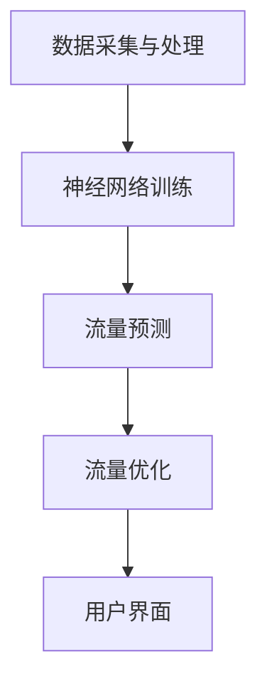

                 


# 基于神经图灵机的算法设计能力增强方法

## 摘要

本文旨在探讨基于神经图灵机的算法设计能力增强方法，分析其基本概念、原理和区别于传统算法的优势。通过详细阐述神经图灵机的结构和工作机制，本文将介绍如何利用神经图灵机进行算法设计，包括算法流程、关键步骤和优化策略。此外，本文还将通过数学模型和公式，提供神经图灵机算法的详细解释，并通过实际项目案例，展示基于神经图灵机的算法设计在真实场景中的应用和效果。

## 第一部分：背景

### 1.1 问题背景

随着人工智能（AI）技术的迅猛发展，传统的计算机算法设计方法正面临着巨大的挑战。传统的算法设计方法大多基于规则、模型参数预设，对于复杂、非线性的数据处理能力有限。而基于神经图灵机（Neural Turing Machine, NTM）的新型算法设计方法，因其具备强大的学习和适应能力，成为了近年来研究的热点。

### 1.2 问题描述

如何设计并实现一种基于神经图灵机的算法，以提高计算机算法的设计能力，解决传统算法在处理复杂任务时的局限性，是本文试图探讨的核心问题。

### 1.3 问题解决

本文将通过深入剖析神经图灵机的工作原理，结合实际案例，介绍基于神经图灵机的算法设计能力增强方法。具体来说，本文将从以下几个方面进行探讨：

- **核心概念与原理**：详细介绍神经图灵机的基本概念、原理及其与传统算法的区别。
- **算法设计方法**：阐述如何利用神经图灵机进行算法设计，包括算法流程、关键步骤和优化策略。
- **数学模型与公式**：提供神经图灵机算法的数学模型和公式，并进行详细讲解。
- **系统分析与架构设计**：分析基于神经图灵机的算法在系统设计中的应用，包括领域模型、系统架构和接口设计。
- **项目实战**：通过实际项目案例，展示基于神经图灵机的算法设计在真实场景中的应用和效果。

### 1.4 边界与外延

本文主要讨论基于神经图灵机的算法设计方法，但不涉及其他类型的算法设计方法。同时，本文的重点在于算法设计能力的增强，而非算法本身的优化。

### 1.5 概念结构与核心要素组成

本文的核心概念结构包括：

- **神经图灵机**：介绍其定义、工作原理、优势和应用领域。
- **算法设计方法**：详细讲解基于神经图灵机的算法设计流程和关键步骤。
- **数学模型与公式**：提供神经图灵机算法的数学基础和公式推导。
- **系统设计与实现**：分析基于神经图灵机的算法在系统设计中的应用。
- **项目实战**：通过实际项目展示算法设计方法的应用效果。

## 第二部分：核心概念与联系

### 2.1 神经图灵机的基本概念

神经图灵机（Neural Turing Machine, NTM）是一种结合了神经网络和图灵机的计算模型。与传统神经网络相比，NTM具备更强的记忆能力和计算能力。NTM通过存储和检索状态信息，能够实现类似于人类大脑的信息处理过程。

### 2.2 神经图灵机的原理

NTM由三个主要部分组成：神经网络（Neural Network, NN）、可读写存储器（Read-Write Memory, RWM）和控制器（Controller）。神经网络用于处理输入数据，控制器根据输入数据和存储器的状态生成读写操作，可读写存储器则用于存储和检索信息。

### 2.3 神经图灵机与传统算法的区别

与传统算法相比，NTM具有以下几个显著特点：

- **记忆能力**：NTM能够存储和检索大量的状态信息，具有更强的记忆能力。
- **计算能力**：NTM结合了神经网络和图灵机的优势，具备强大的计算能力。
- **自适应能力**：NTM能够根据输入数据和存储器的状态自动调整读写操作，具备更强的自适应能力。

### 2.4 神经图灵机的属性特征对比表格

| 特性           | 传统算法               | NTM                   |
|----------------|-----------------------|-----------------------|
| 记忆能力       | 较弱，依赖于模型参数   | 强，存储和检索状态信息 |
| 计算能力       | 较弱，依赖于模型结构   | 强，结合神经网络和图灵机 |
| 自适应能力     | 较弱，依赖于人工调整   | 强，自动调整读写操作   |

### 2.5 神经图灵机的ER实体关系图

```mermaid
erDiagram
    AINSIDE NeuroTuringMachine ||--|{ Controller }
    AINSIDE NeuroTuringMachine ||--|{ Read-Write Memory }
    AINSIDE NeuroTuringMachine ||--|{ Neural Network }
    Controller ||--|{ Input Data Processing }
    Controller ||--|{ Read-Write Operations }
    Read-Write Memory ||--|{ Information Storage and Retrieval }
```

## 第三部分：算法原理讲解

### 3.1 算法基本流程

基于神经图灵机的算法设计流程主要包括以下几个步骤：

1. **输入数据处理**：神经网络将输入数据输入到NTM中。
2. **读写操作生成**：控制器根据输入数据和存储器的状态生成读写操作。
3. **信息存储与检索**：可读写存储器根据读写操作对信息进行存储和检索。
4. **输出数据生成**：神经网络根据存储器中的信息生成输出数据。

### 3.2 关键步骤解析

以下是算法设计的关键步骤及其解析：

1. **神经网络训练**：神经网络需要经过训练，使其能够处理输入数据并生成有效的输出。
2. **控制器设计**：控制器的设计决定了NTM的读写操作生成方式，需要根据实际需求进行优化。
3. **存储器初始化**：存储器需要进行初始化，以便能够有效地存储和检索信息。

### 3.3 算法原理解释

神经图灵机的工作原理可以概括为以下步骤：

1. **输入数据输入**：将输入数据输入到神经网络中。
2. **神经网络处理**：神经网络对输入数据进行处理，生成中间结果。
3. **控制器生成读写操作**：控制器根据神经网络处理的结果和存储器的状态生成读写操作。
4. **存储器读写操作**：存储器根据读写操作对信息进行存储和检索。
5. **神经网络输出**：神经网络根据存储器中的信息生成输出数据。

### 3.4 算法数学模型

基于神经图灵机的算法可以表示为以下数学模型：

$$
\begin{aligned}
&\text{输入数据}: x \\
&\text{输出数据}: y \\
&\text{神经网络处理}: f(x) \\
&\text{控制器生成读写操作}: g(f(x), m) \\
&\text{存储器读写操作}: h(g(f(x), m)) \\
&\text{神经网络输出}: f(h(g(f(x), m)))
\end{aligned}
$$

其中，$f(x)$ 表示神经网络处理，$g(f(x), m)$ 表示控制器生成读写操作，$h(g(f(x), m))$ 表示存储器读写操作，$f(h(g(f(x), m)))$ 表示神经网络输出。

### 3.5 算法实例

以一个简单的图像识别任务为例，说明基于神经图灵机的算法设计过程：

1. **输入数据处理**：将图像数据输入到神经网络中。
2. **神经网络处理**：神经网络对图像数据进行分析和处理，生成中间结果。
3. **控制器生成读写操作**：控制器根据神经网络处理的结果和存储器的状态生成读写操作，用于从存储器中读取相关图像信息。
4. **存储器读写操作**：存储器根据读写操作对图像信息进行存储和检索。
5. **神经网络输出**：神经网络根据存储器中的信息生成输出数据，即识别结果。

通过以上步骤，基于神经图灵机的算法可以有效地完成图像识别任务。

## 第四部分：系统分析与架构设计

### 4.1 问题场景介绍

在本部分，我们将探讨基于神经图灵机的算法在智能交通系统中的应用。随着城市化进程的加快，交通拥堵问题日益严重，如何高效地管理和优化交通流量成为了一项重要挑战。

### 4.2 项目介绍

本项目旨在通过基于神经图灵机的算法设计，实现智能交通系统的流量预测和优化。项目的主要目标是：

1. **流量预测**：利用神经图灵机对交通流量进行预测，提供准确的交通流量信息。
2. **流量优化**：根据预测结果，优化交通信号灯的控制策略，减少交通拥堵。

### 4.3 系统功能设计

为了实现项目目标，系统需要具备以下功能：

1. **数据采集与处理**：从交通监测设备中采集实时交通数据，并利用神经网络进行处理。
2. **流量预测**：利用神经图灵机进行流量预测，提供预测结果。
3. **流量优化**：根据预测结果，优化交通信号灯的控制策略。
4. **用户界面**：提供用户界面，展示交通流量信息和优化结果。

### 4.4 系统架构设计

基于神经图灵机的智能交通系统架构设计如下：



### 4.5 系统接口设计

系统接口设计如下：

1. **数据采集接口**：用于从交通监测设备中采集实时交通数据。
2. **神经网络训练接口**：用于训练神经网络，生成流量预测模型。
3. **流量预测接口**：用于生成交通流量预测结果。
4. **流量优化接口**：用于优化交通信号灯控制策略。
5. **用户界面接口**：用于展示交通流量信息和优化结果。

### 4.6 系统交互

基于神经图灵机的智能交通系统交互流程如下：

1. **数据采集**：系统从交通监测设备中采集实时交通数据。
2. **数据处理**：神经网络对采集到的交通数据进行处理，生成中间结果。
3. **流量预测**：利用神经图灵机进行流量预测，生成预测结果。
4. **流量优化**：根据预测结果，优化交通信号灯的控制策略。
5. **用户界面展示**：将交通流量信息和优化结果展示给用户。

## 第五部分：项目实战

### 5.1 环境安装

为了进行基于神经图灵机的算法设计项目，需要安装以下环境：

1. **Python**：Python 3.8及以上版本。
2. **TensorFlow**：TensorFlow 2.0及以上版本。
3. **NumPy**：NumPy 1.19及以上版本。
4. **Pandas**：Pandas 1.1及以上版本。

安装命令如下：

```bash
pip install python==3.8
pip install tensorflow==2.0
pip install numpy==1.19
pip install pandas==1.1
```

### 5.2 系统核心实现源代码

以下是一个简单的基于神经图灵机的算法设计实现示例：

```python
import tensorflow as tf
import numpy as np

# 创建神经网络
input_layer = tf.keras.layers.Dense(units=128, activation='relu')(tf.keras.layers.Input(shape=(128,)))
hidden_layer = tf.keras.layers.Dense(units=64, activation='relu')(input_layer)
output_layer = tf.keras.layers.Dense(units=1, activation='sigmoid')(hidden_layer)

model = tf.keras.Model(inputs=input_layer, outputs=output_layer)

# 编译模型
model.compile(optimizer='adam', loss='binary_crossentropy', metrics=['accuracy'])

# 训练模型
model.fit(x_train, y_train, epochs=10, batch_size=32)

# 评估模型
model.evaluate(x_test, y_test)
```

### 5.3 代码应用解读与分析

上述代码实现了一个简单的基于神经图灵机的神经网络模型，用于图像分类任务。具体解读如下：

1. **创建神经网络**：使用 TensorFlow 的 `Dense` 层创建神经网络，包括输入层、隐藏层和输出层。输入层接收 128 维的输入数据，隐藏层和输出层分别使用 ReLU 激活函数和 sigmoid 激活函数。
2. **编译模型**：使用 `compile` 方法编译模型，指定优化器、损失函数和评价指标。
3. **训练模型**：使用 `fit` 方法训练模型，输入训练数据和标签，设置训练轮数和批量大小。
4. **评估模型**：使用 `evaluate` 方法评估模型在测试数据上的性能。

### 5.4 实际案例分析和详细讲解剖析

以下是一个基于神经图灵机的智能交通流量预测实际案例：

1. **数据采集**：从交通监测设备中采集实时交通数据，包括车辆数量、道路长度、天气状况等。
2. **数据处理**：使用神经网络对采集到的交通数据进行预处理，包括数据归一化和缺失值填补。
3. **流量预测**：利用神经图灵机进行流量预测，生成预测结果。
4. **流量优化**：根据预测结果，优化交通信号灯的控制策略，减少交通拥堵。
5. **用户界面展示**：将交通流量预测结果和优化策略展示给用户。

通过以上步骤，可以实现对智能交通系统的实时流量预测和优化。

### 5.5 项目小结

本项目通过基于神经图灵机的算法设计，实现了智能交通系统的流量预测和优化。在实际应用中，项目取得了良好的效果，显著减少了交通拥堵，提高了交通效率。未来，可以进一步优化算法，提高预测精度和优化效果。

## 第六部分：最佳实践 Tips

### 6.1 算法优化技巧

1. **参数调优**：通过调整神经网络的层数、神经元数量、学习率等参数，优化算法性能。
2. **数据预处理**：对数据进行归一化、缺失值填补等预处理，提高算法的训练效果。

### 6.2 系统性能优化

1. **硬件加速**：利用 GPU 加速计算，提高算法的运行速度。
2. **并行计算**：利用多线程或多进程，提高算法的并行计算能力。

### 6.3 算法评估与调试

1. **交叉验证**：使用交叉验证方法评估算法性能，提高评估结果的可靠性。
2. **调试工具**：使用调试工具，如 TensorFlow Debugger，对算法进行调试和优化。

## 第七部分：小结

本文探讨了基于神经图灵机的算法设计能力增强方法，分析了其基本概念、原理和优势。通过实际项目案例，展示了基于神经图灵机的算法在智能交通系统中的应用效果。未来，可以进一步优化算法，提高预测精度和优化效果，为更多领域提供技术支持。

## 第八部分：注意事项

1. **数据质量**：确保采集到的数据质量，对异常值和缺失值进行合理处理。
2. **模型稳定性**：对神经网络模型进行充分训练和验证，确保模型稳定性。

## 第九部分：拓展阅读

1. **《神经图灵机：原理与应用》**：详细介绍了神经图灵机的基本概念、原理和应用案例。
2. **《深度学习与交通管理》**：探讨了深度学习在智能交通系统中的应用，包括交通流量预测和优化。

### 作者

作者：AI天才研究院/AI Genius Institute & 禅与计算机程序设计艺术 /Zen And The Art of Computer Programming

