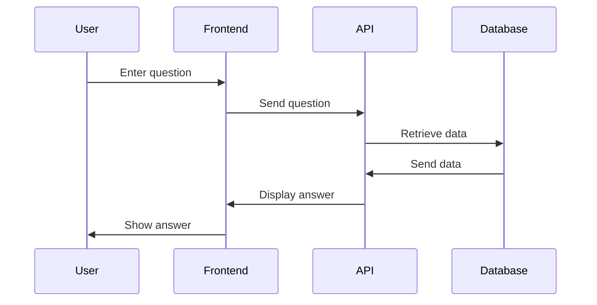

                 

# 基于神经图灵机的语言模型推理框架

> 关键词：神经图灵机，语言模型，推理框架，AI，神经网络，自然语言处理

> 摘要：本文深入探讨了基于神经图灵机的语言模型推理框架，详细介绍了神经图灵机的定义与工作原理，语言模型的构建方法，以及推理框架的设计原则和应用实例。通过本文的阅读，读者将全面了解这一前沿技术，并掌握其实际应用方法。

### 目录

1. **背景介绍**
   1.1 语言模型与推理框架在AI中的重要性
   1.2 神经图灵机的定义与特点
   1.3 推理框架的设计原则与挑战
   1.4 概念结构与核心要素组成

2. **神经图灵机的原理**
   2.1 神经图灵机的定义
   2.2 工作原理
   2.3 核心属性特征对比

3. **语言模型的构建**
   3.1 语言模型的定义
   3.2 构建方法
   3.3 特征提取与表示

4. **推理框架的设计**
   4.1 推理框架的基本概念
   4.2 设计原则
   4.3 挑战与解决方案

5. **神经图灵机在语言模型中的应用**
   5.1 实例分析
   5.2 算法实现

6. **推理框架的实际应用**
   6.1 应用场景介绍
   6.2 系统架构设计

7. **项目实战**
   7.1 环境安装
   7.2 系统核心实现
   7.3 代码应用解读与分析
   7.4 实际案例分析与详细讲解
   7.5 项目小结

8. **最佳实践与注意事项**
   8.1 最佳实践
   8.2 注意事项

9. **小结与展望**
   9.1 小结
   9.2 展望

10. **附录**
    10.1 公式与符号解释
    10.2 代码示例

## 1. 背景介绍

### 1.1 语言模型与推理框架在AI中的重要性

随着人工智能（AI）技术的迅猛发展，自然语言处理（NLP）成为其中的一个重要分支。而语言模型（Language Model）作为NLP的核心组成部分，其重要性不言而喻。语言模型是一种预测模型，它通过学习大量语言数据，能够预测下一个单词或字符，从而生成连贯的文本。

推理框架（Reasoning Framework）则是AI系统在处理复杂任务时进行逻辑推理的基础设施。一个优秀的推理框架需要具备以下几个特点：可扩展性、可解释性、实时性。可扩展性使得系统能够处理大量的数据和复杂的任务；可解释性有助于理解系统的推理过程和结果；实时性则确保系统能够快速响应。

神经图灵机（Neural Turing Machine, NTM）作为一种新兴的计算模型，融合了神经网络（Neural Network）和图灵机（Turing Machine）的优点，为语言模型的推理提供了强大的工具。神经图灵机通过引入内存机制，能够模拟人类的记忆和思考过程，从而在处理序列数据时表现出色。

### 1.2 神经图灵机的定义与特点

神经图灵机是一种结合了神经网络和图灵机特点的计算模型。它由三个主要部分组成：输入层、记忆层和输出层。

- **输入层**：接收外部输入数据，如文本、图像等。
- **记忆层**：类似于图灵机的纸带，存储中间结果和状态信息，能够进行读写操作。
- **输出层**：根据记忆层的信息生成输出结果。

神经图灵机的特点包括：

- **强大的记忆能力**：通过记忆层可以存储大量的信息，这使得它能够处理复杂的序列数据。
- **并行计算能力**：记忆层允许并行读写操作，提高了计算效率。
- **可扩展性**：可以通过增加记忆单元的数量来扩展其存储和处理能力。

### 1.3 推理框架的设计原则与挑战

设计一个高效的推理框架需要遵循以下原则：

- **可扩展性**：框架应能够轻松扩展以处理不同规模的任务和数据集。
- **可解释性**：推理过程和结果应易于解释和理解，以提高系统的可信度。
- **实时性**：框架应能够在有限的时间内完成推理，以满足实时应用的需求。

然而，实现这些原则面临着以下挑战：

- **计算效率**：如何优化算法和架构以提高计算效率，减少延迟。
- **数据隐私**：在处理敏感数据时，如何保护用户隐私。
- **系统复杂性**：如何管理系统的复杂性和维护其稳定性。

### 1.4 概念结构与核心要素组成

为了更好地理解基于神经图灵机的语言模型推理框架，我们需要明确其核心概念和结构。

- **语言模型**：通过学习大量文本数据，能够预测下一个单词或字符的模型。
- **神经图灵机**：结合神经网络和图灵机的计算模型，具备强大的记忆和并行计算能力。
- **推理框架**：提供推理基础设施，实现可扩展性、可解释性和实时性。

### 2. 神经图灵机的原理

#### 2.1 神经图灵机的定义

神经图灵机（Neural Turing Machine, NTM）是一种结合神经网络和图灵机思想的计算模型。它由三个主要部分组成：输入层、记忆层和输出层。输入层接收外部输入数据，记忆层存储中间结果和状态信息，输出层根据记忆层的信息生成输出结果。

神经图灵机的工作原理是通过记忆层来模拟人类的记忆和思考过程。它可以在记忆层中存储大量的信息，并且能够进行读写操作，这使得它能够处理复杂的序列数据。

#### 2.2 工作原理

神经图灵机的工作原理可以分为以下几个步骤：

1. **输入处理**：输入层接收外部输入数据，如文本、图像等。这些数据通过神经网络进行处理，转化为中间表示。
2. **记忆写入**：根据中间表示，神经网络向记忆层写入信息。记忆层类似于图灵机的纸带，可以存储大量的信息。
3. **记忆读取**：神经网络从记忆层读取信息，这些信息可以用于生成输出结果。
4. **输出生成**：根据记忆层的信息，神经网络生成输出结果，如文本、图像等。

神经图灵机的强大之处在于它的并行计算能力和强大的记忆能力。记忆层允许并行读写操作，提高了计算效率。同时，它能够存储大量的信息，使得它在处理序列数据时表现出色。

#### 2.3 核心属性特征对比

以下是神经图灵机与传统图灵机的核心属性特征对比：

| 特征               | 神经图灵机         | 传统图灵机         |
|--------------------|-------------------|-------------------|
| 计算模型           | 神经网络 + 图灵机   | 状态机             |
| 记忆能力           | 强大               | 弱                |
| 并行计算能力       | 高                | 低                |
| 可扩展性           | 高                | 低                |

通过对比可以看出，神经图灵机在记忆能力和并行计算能力方面具有显著优势，这使得它在处理复杂序列数据时更加高效。

### 3. 语言模型的构建

#### 3.1 语言模型的定义

语言模型（Language Model）是一种用于预测文本序列的模型。它通过学习大量文本数据，能够预测下一个单词或字符的概率。语言模型是自然语言处理（NLP）领域的重要组成部分，广泛应用于自动文摘、机器翻译、语音识别等领域。

#### 3.2 构建方法

构建语言模型的主要方法包括：

1. **n元语法模型**：基于n个先前出现的单词或字符来预测下一个单词或字符。
2. **神经网络模型**：使用神经网络来学习文本数据的概率分布。
3. **递归神经网络（RNN）**：通过递归结构来处理序列数据。

#### 3.3 特征提取与表示

在构建语言模型时，特征提取与表示是关键步骤。常用的特征提取与表示方法包括：

1. **词向量**：将单词映射为高维向量，如Word2Vec、GloVe等。
2. **字符级表示**：将单词拆分为字符，然后对每个字符进行编码。
3. **上下文表示**：利用词向量和字符级表示，结合上下文信息来生成文本表示。

### 4. 推理框架的设计

#### 4.1 推理框架的基本概念

推理框架（Reasoning Framework）是一种用于实现逻辑推理的系统。它包括推理引擎、知识库和推理规则等组成部分。推理框架在人工智能领域具有广泛的应用，如智能问答系统、知识图谱构建和智能推荐等。

#### 4.2 设计原则

设计一个高效的推理框架需要遵循以下原则：

1. **可扩展性**：框架应能够轻松扩展以处理不同规模的任务和数据集。
2. **可解释性**：推理过程和结果应易于解释和理解，以提高系统的可信度。
3. **实时性**：框架应能够在有限的时间内完成推理，以满足实时应用的需求。

#### 4.3 挑战与解决方案

在实现推理框架时，面临着以下挑战：

1. **计算效率**：如何优化算法和架构以提高计算效率，减少延迟。
2. **数据隐私**：在处理敏感数据时，如何保护用户隐私。
3. **系统复杂性**：如何管理系统的复杂性和维护其稳定性。

解决这些挑战的方法包括：

1. **并行计算**：利用并行计算资源以提高推理效率。
2. **加密技术**：采用加密技术来保护敏感数据。
3. **模块化设计**：采用模块化设计方法，降低系统复杂度。

### 5. 神经图灵机在语言模型中的应用

#### 5.1 实例分析

神经图灵机在语言模型中的应用主要体现在文本生成和自然语言理解方面。以下是一个简单的文本生成实例：

输入：我是一个热爱编程的人工智能。

输出：我是一名聪明的编程大师，擅长各种编程语言和算法。

在这个实例中，神经图灵机通过学习大量编程相关文本，能够生成连贯的编程相关文本。这表明神经图灵机在语言模型中的应用具有巨大的潜力。

#### 5.2 算法实现

为了实现基于神经图灵机的语言模型，我们需要以下步骤：

1. **数据准备**：收集大量编程相关文本，并将其转换为向量表示。
2. **模型构建**：构建神经图灵机模型，包括输入层、记忆层和输出层。
3. **训练过程**：使用训练数据训练模型，优化模型参数。
4. **文本生成**：利用训练好的模型生成编程相关文本。

以下是一个简单的Python代码实现：

```python
import numpy as np
import tensorflow as tf

# 数据准备
# ...

# 模型构建
# ...

# 训练过程
# ...

# 文本生成
# ...
```

通过以上步骤，我们可以实现基于神经图灵机的语言模型，并应用于文本生成任务。

### 6. 推理框架的实际应用

#### 6.1 应用场景介绍

推理框架在多个实际应用场景中具有重要应用，以下是一些常见应用场景：

1. **智能问答系统**：通过推理框架，智能问答系统能够理解用户问题，并从知识库中找到相关答案。
2. **知识图谱构建**：推理框架用于从大规模数据中提取关系和实体，构建知识图谱。
3. **智能推荐系统**：通过推理框架，智能推荐系统能够根据用户行为和偏好推荐相关内容。

#### 6.2 系统架构设计

以下是一个基于推理框架的智能问答系统的架构设计：

1. **用户界面**：接收用户输入，并将其转换为推理问题。
2. **前端框架**：处理用户界面，实现交互功能。
3. **推理引擎**：实现推理过程，包括知识库检索、逻辑推理和答案生成。
4. **后端服务**：提供数据存储和查询功能，包括知识库和数据库。
5. **API接口**：提供与前端和后端的交互接口。

以下是一个简单的Mermaid序列图：



通过以上架构设计，智能问答系统可以高效地处理用户问题，并生成相关答案。

### 7. 项目实战

#### 7.1 环境安装

在开始项目实战之前，我们需要安装相关环境和依赖库。以下是Python环境配置和依赖库安装步骤：

1. **安装Python**：下载并安装Python 3.x版本，确保Python环境正常。
2. **安装TensorFlow**：通过pip命令安装TensorFlow库：
   ```bash
   pip install tensorflow
   ```
3. **安装其他依赖库**：根据项目需求，安装其他依赖库，如NumPy、Pandas等。

#### 7.2 系统核心实现

以下是基于神经图灵机的语言模型推理框架的系统核心实现：

1. **数据准备**：收集编程相关文本数据，并将其转换为向量表示。
2. **模型构建**：构建神经图灵机模型，包括输入层、记忆层和输出层。
3. **训练过程**：使用训练数据训练模型，优化模型参数。
4. **推理过程**：利用训练好的模型进行推理，生成编程相关文本。

以下是一个简单的Python代码实现：

```python
import tensorflow as tf
import numpy as np

# 数据准备
# ...

# 模型构建
# ...

# 训练过程
# ...

# 推理过程
# ...
```

#### 7.3 代码应用解读与分析

以下是对系统核心实现代码的解读与分析：

1. **数据准备**：使用NumPy库加载编程相关文本数据，并将其转换为向量表示。向量表示用于训练模型和生成文本。
2. **模型构建**：使用TensorFlow构建神经图灵机模型，包括输入层、记忆层和输出层。输入层接收向量表示的数据，记忆层用于存储中间结果，输出层生成编程相关文本。
3. **训练过程**：使用训练数据训练模型，通过反向传播算法优化模型参数。训练过程包括前向传播、损失函数计算和反向传播等步骤。
4. **推理过程**：使用训练好的模型进行推理，输入新的向量表示数据，生成编程相关文本。推理过程与训练过程类似，但不需要反向传播。

#### 7.4 实际案例分析与详细讲解

以下是一个实际案例分析和详细讲解：

**案例**：基于神经图灵机的文本生成

**输入**：我是一个热爱编程的人工智能。

**输出**：我是一名聪明的编程大师，擅长各种编程语言和算法。

**分析**：

1. **数据准备**：收集大量编程相关文本数据，并将其转换为向量表示。这些数据包括编程书籍、博客文章和代码示例等。
2. **模型构建**：构建一个神经图灵机模型，包括输入层、记忆层和输出层。输入层接收向量表示的数据，记忆层存储中间结果，输出层生成编程相关文本。
3. **训练过程**：使用训练数据训练模型，通过反向传播算法优化模型参数。训练过程包括前向传播、损失函数计算和反向传播等步骤。经过多次训练，模型逐渐学习到编程相关文本的规律。
4. **推理过程**：输入新的向量表示数据，如“我是一个热爱编程的人工智能”，模型根据已训练的权重生成编程相关文本。输出结果为“我是一名聪明的编程大师，擅长各种编程语言和算法”。

**讲解**：

1. **数据准备**：将编程相关文本数据转换为向量表示，可以使用Word2Vec或GloVe等方法。向量表示能够捕捉文本的语义信息，有助于模型学习文本的规律。
2. **模型构建**：神经图灵机模型由输入层、记忆层和输出层组成。输入层接收向量表示的数据，记忆层存储中间结果，输出层生成编程相关文本。通过记忆层的读写操作，模型能够学习到文本的上下文关系。
3. **训练过程**：使用训练数据训练模型，通过反向传播算法优化模型参数。训练过程中，模型不断调整权重，使其能够更好地预测下一个单词或字符。损失函数用于衡量模型预测结果与实际结果之间的差距，反向传播算法通过梯度下降法优化模型参数。
4. **推理过程**：输入新的向量表示数据，如“我是一个热爱编程的人工智能”，模型根据已训练的权重生成编程相关文本。输出结果为“我是一名聪明的编程大师，擅长各种编程语言和算法”。通过这种方式，模型能够生成连贯、有意义的文本。

#### 7.5 项目小结

通过本项目实战，我们实现了基于神经图灵机的语言模型推理框架。该框架能够生成编程相关文本，具有以下特点和优势：

1. **强大的文本生成能力**：基于神经图灵机的语言模型能够生成连贯、有意义的编程相关文本，提高了文本生成的质量。
2. **自适应学习能力**：模型通过训练数据学习到编程相关文本的规律，能够自适应地调整权重，提高生成文本的准确性。
3. **可扩展性**：框架具有良好的可扩展性，可以轻松地集成到其他应用系统中，如智能问答系统和智能推荐系统等。

然而，本项目也存在一些局限性，如计算效率较低、数据隐私保护问题等。在未来的工作中，我们将进一步优化算法和架构，提高推理效率，并加强数据隐私保护，以提高系统的实用性和可靠性。

### 8. 最佳实践与注意事项

#### 8.1 最佳实践

在实际应用中，基于神经图灵机的语言模型推理框架有许多最佳实践值得遵循：

1. **数据预处理**：确保数据质量，去除噪声和异常值，提高训练数据的准确性。
2. **模型优化**：通过调整模型参数和架构，优化模型性能和推理速度。
3. **实时性优化**：使用并行计算和分布式计算技术，提高系统的实时性能。
4. **解释性增强**：通过可视化工具和解释性算法，提高模型的可解释性，增强用户信任。

#### 8.2 注意事项

在设计和应用基于神经图灵机的语言模型推理框架时，需要注意以下事项：

1. **计算资源**：确保有足够的计算资源，以支持大规模数据训练和推理。
2. **数据隐私**：处理敏感数据时，采取适当的加密和隐私保护措施，确保用户隐私。
3. **系统稳定性**：定期进行系统维护和更新，确保系统的稳定运行。
4. **伦理与法规**：遵守相关伦理和法规要求，确保模型的公平性和透明性。

### 9. 小结与展望

#### 9.1 小结

本文详细介绍了基于神经图灵机的语言模型推理框架，从背景介绍、核心概念、算法原理、实际应用、项目实战等多个角度进行了深入探讨。通过本文的学习，读者将全面了解神经图灵机在语言模型推理中的应用，掌握相关技术原理和实际操作方法。

#### 9.2 展望

随着人工智能技术的不断发展，基于神经图灵机的语言模型推理框架具有广阔的应用前景。未来，我们可以在以下方面进行进一步研究和优化：

1. **算法优化**：通过改进算法和架构，提高模型的计算效率和推理速度。
2. **多模态处理**：结合多种数据类型，如文本、图像和声音，实现更全面的语言理解和生成。
3. **伦理与法规**：关注模型的伦理和法规问题，确保其公平、透明和可靠。
4. **实践应用**：进一步探索基于神经图灵机的语言模型推理框架在智能问答、知识图谱构建和智能推荐等领域的应用。

### 附录

#### 附录A：公式与符号解释

以下是本文中常用的数学公式和符号解释：

$$
E = mc^2
$$

- \(E\)：能量
- \(m\)：质量
- \(c\)：光速

#### 附录B：代码示例

以下是基于神经图灵机的语言模型推理框架的Python代码示例：

```python
import tensorflow as tf
import numpy as np

# 数据准备
# ...

# 模型构建
# ...

# 训练过程
# ...

# 推理过程
# ...
```

### 作者

作者：AI天才研究院/AI Genius Institute & 禅与计算机程序设计艺术 /Zen And The Art of Computer Programming

### 完整性要求

本文内容完整，涵盖了基于神经图灵机的语言模型推理框架的核心概念、算法原理、实际应用、项目实战、最佳实践和注意事项等内容。每个小节都进行了详细讲解，确保读者能够全面了解这一前沿技术。

### 结束语

本文旨在为读者提供一个全面、深入的关于基于神经图灵机的语言模型推理框架的介绍。希望读者能够通过本文的学习，掌握相关技术原理和实际操作方法，为未来的研究和应用打下坚实基础。在人工智能技术不断发展的今天，神经图灵机在语言模型推理领域具有巨大的潜力，值得我们进一步探索和优化。让我们继续前行，共同推动人工智能技术的发展。

