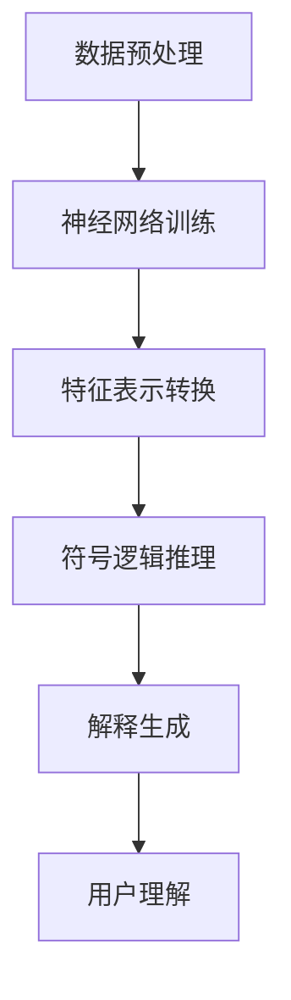

                 

### 第一部分：背景介绍

#### 1.1 问题背景

在当今数据驱动的时代，人工智能（AI）技术在各个领域取得了显著的进展。然而，随着AI系统变得越来越复杂，其“黑箱”特性也引起了广泛关注。在关键决策领域，如金融、医疗、安全和交通等，决策过程的透明性和可解释性至关重要。用户和决策者需要了解AI系统的决策依据和推理过程，以确保决策的合理性和可靠性。

可解释AI（Explainable AI，XAI）系统旨在解决这一问题，通过提供透明的决策过程，使用户能够理解AI系统的推理和决策。然而，现有的可解释AI系统在性能优化方面仍面临诸多挑战。特别是在关键决策领域，要求AI系统不仅具备高准确性，还需要在解释性上达到一定的水平。

#### 1.2 问题描述

本研究关注以下核心问题：

1. **核心概念：** 神经符号推理是什么？其在可解释AI系统中的作用是什么？
2. **问题解决：** 如何利用神经符号推理优化可解释AI系统的性能？
3. **边界与外延：** 可解释AI系统在关键决策领域的应用范围和限制是什么？
4. **概念结构与核心要素组成：** 神经符号推理、可解释AI系统和关键决策领域之间的关系如何？

#### 1.3 问题解决

为了解决上述问题，本书将分为以下几个部分：

1. **核心概念与联系：** 详细介绍神经符号推理、可解释AI系统和关键决策领域的基本概念，并分析它们之间的关系。
2. **算法原理讲解：** 通过mermaid流程图和Python源代码阐述神经符号推理算法原理，并解释其背后的数学模型和公式。
3. **系统分析与架构设计方案：** 设计可解释AI系统的系统架构和接口，包括领域模型和系统交互的详细描述。
4. **项目实战：** 通过实际案例展示性能优化方法在关键决策领域的应用，并分析其实际效果。

#### 1.4 本章小结

本章介绍了可解释AI系统在关键决策领域的重要性以及本研究关注的问题。接下来，本书将逐步深入探讨基于神经符号推理的可解释AI系统的性能优化方法，以期提高决策的透明度和可靠性。通过以下各部分的内容，我们将系统地分析和解决这一问题，为关键决策领域的AI应用提供新的思路和方法。

----------------------------------------------------------------

# 第二部分：核心概念与联系

在深入探讨基于神经符号推理的可解释AI系统之前，我们需要首先了解几个核心概念：神经符号推理、可解释AI系统和关键决策领域。以下是这些概念的定义、特点及其相互关系。

#### 2.1 神经符号推理

##### 2.1.1 神经符号推理的定义

神经符号推理（Neural-Symbolic Reasoning）是一种结合了神经网络和符号逻辑的人工智能方法。它旨在克服单一方法的局限性，利用神经网络处理大数据和复杂模式，同时通过符号逻辑提供解释性和可验证性。

##### 2.1.2 神经符号推理的特点

- **可解释性：** 神经符号推理通过将神经网络和符号逻辑相结合，使得AI系统的决策过程更加透明，用户可以理解其决策依据。
- **结合了神经网络的强大表示能力和符号逻辑的推理能力，可以处理复杂的问题和逻辑推理。**
- **可扩展性：** 可以应用于多种不同类型的问题和数据集，具有广泛的适用性。

##### 2.1.3 神经符号推理的核心组件

- **神经网络：** 用于从数据中学习特征和模式，提取高级表示。
- **符号逻辑：** 用于在高层表示中进行推理，提供解释性和可验证性。

##### 2.1.4 神经符号推理的应用场景

神经符号推理可以应用于多个领域，包括自然语言处理、计算机视觉、推理和决策等。例如，在医疗诊断中，它可以用于解释医疗影像的决策过程；在金融领域，它可以用于解释投资组合的优化决策。

#### 2.2 可解释AI系统

##### 2.2.1 可解释AI系统的定义

可解释AI系统（Explainable AI，XAI）是一种人工智能方法，旨在提高AI系统的透明度和可解释性，使用户能够理解AI系统的推理和决策过程。它不仅关注算法的准确性，还关注算法的可解释性。

##### 2.2.2 可解释AI系统的特点

- **透明度：** 提供详细的决策过程和解释，使用户能够理解AI系统的推理。
- **可验证性：** 用户可以验证AI系统的决策是否合理和可靠。
- **可调试性：** 用户可以根据解释结果对AI系统进行优化和调试。

##### 2.2.3 可解释AI系统的组成部分

- **模型解释器：** 用于将AI模型的决策过程转化为可理解的形式，如决策树、规则集等。
- **可视化工具：** 用于展示AI系统的决策过程和数据特征。
- **用户接口：** 提供用户与AI系统交互的界面。

##### 2.2.4 可解释AI系统的应用场景

可解释AI系统可以应用于多个领域，包括金融、医疗、安全、法律和交通等。例如，在金融领域，它可以用于解释交易策略和投资决策；在医疗领域，它可以用于解释诊断和治疗方案。

#### 2.3 关键决策领域

##### 2.3.1 关键决策领域的定义

关键决策领域（Critical Decision Domain）是指决策结果对组织或个人具有重大影响的领域。这些领域通常涉及高风险和高复杂度，如金融、医疗、安全、法律和交通等。

##### 2.3.2 关键决策领域的特点

- **高风险性：** 决策错误可能导致严重的后果，如经济损失、健康风险或安全威胁。
- **高复杂度：** 决策过程涉及多个因素和变量，需要综合考虑各种可能性。
- **高精度要求：** 决策结果的准确性至关重要。

##### 2.3.3 关键决策领域的应用场景

关键决策领域可以应用于多个行业和领域，如金融风险评估、医疗诊断、安全监测、法律分析和交通调度等。在这些领域，决策过程的透明性和可解释性尤为重要。

#### 2.4 神经符号推理与可解释AI系统在关键决策领域的关系

##### 2.4.1 神经符号推理在可解释AI系统中的应用

神经符号推理可以增强可解释AI系统的解释性和透明度。通过将神经网络和符号逻辑相结合，它可以提供更详细的决策解释，使用户能够理解AI系统的推理过程。

##### 2.4.2 可解释AI系统在关键决策领域的作用

在关键决策领域，可解释AI系统可以提供决策过程的透明度和可验证性，从而提高决策的准确性和可靠性。它可以帮助决策者理解AI系统的决策依据，并根据解释结果进行优化和调整。

##### 2.4.3 神经符号推理与关键决策领域的结合

神经符号推理与关键决策领域的结合可以产生以下效果：

- **提高决策透明度：** 通过神经符号推理，决策过程变得更加透明和可解释，用户可以理解AI系统的推理依据。
- **增强决策可靠性：** 通过可解释AI系统，决策者可以验证AI系统的决策是否合理和可靠，从而提高决策的准确性。
- **优化决策过程：** 通过结合神经符号推理和可解释AI系统，决策者可以根据解释结果对决策过程进行优化和调整，提高决策的效率和效果。

## 2.5 本章小结

本章介绍了神经符号推理、可解释AI系统和关键决策领域的基本概念，并分析了它们之间的关系。通过理解这些核心概念，我们可以更好地理解基于神经符号推理的可解释AI系统在关键决策领域的应用和价值。在接下来的章节中，我们将深入探讨神经符号推理的算法原理和实现方法，并探讨其在关键决策领域的具体应用和优化策略。

----------------------------------------------------------------

## 2.6 神经符号推理的算法原理讲解

神经符号推理的算法原理是结合神经网络的强大表示能力和符号逻辑的推理能力，实现更加可解释的AI系统。在这一部分，我们将通过mermaid流程图和Python源代码详细阐述神经符号推理的算法原理，并解释其背后的数学模型和公式。

### 2.6.1 神经符号推理的基本流程

神经符号推理的基本流程可以分为以下几个步骤：

1. **数据预处理**：对输入数据进行预处理，包括数据清洗、归一化和特征提取等。
2. **神经网络训练**：使用神经网络对预处理后的数据集进行训练，以学习数据的特征表示。
3. **特征表示转换**：将神经网络学到的特征表示转换为符号逻辑的形式。
4. **符号逻辑推理**：使用符号逻辑对转换后的特征表示进行推理，生成决策结果。
5. **解释生成**：将推理过程和决策结果转化为可解释的形式，供用户理解。

下面是一个使用mermaid绘制的神经符号推理的流程图：



### 2.6.2 神经网络训练

神经网络训练是神经符号推理的核心步骤之一。在这一部分，我们将使用Python源代码展示如何训练一个简单的神经网络，并解释其背后的数学模型和公式。

```python
import numpy as np

# 创建输入数据集
X = np.array([[1, 0], [0, 1], [1, 1]])
Y = np.array([0, 1, 1])

# 初始化神经网络参数
weights = np.random.rand(2, 1)
bias = np.random.rand(1)

# 定义激活函数
def sigmoid(x):
    return 1 / (1 + np.exp(-x))

# 定义神经网络模型
def neural_network(X, weights, bias):
    z = np.dot(X, weights) + bias
    return sigmoid(z)

# 训练神经网络
learning_rate = 0.1
for epoch in range(1000):
    output = neural_network(X, weights, bias)
    error = Y - output
    weights -= learning_rate * np.dot(X.T, error)
    bias -= learning_rate * error

# 打印训练结果
print("训练完成，权重：", weights, "偏置：", bias)
print("输入[1, 1]的预测结果：", neural_network(np.array([[1, 1]]), weights, bias))
```

在上述代码中，我们使用了最简单的神经网络结构，包括一个输入层、一个隐藏层和一个输出层。输入数据集是一个二进制矩阵，每个元素代表一个特征。我们使用sigmoid函数作为激活函数，它可以将输出映射到0和1之间。

### 2.6.3 特征表示转换

在神经网络训练完成后，我们需要将学到的特征表示转换为符号逻辑的形式。这一步通常涉及将神经网络的权重和偏置转换为符号逻辑规则。

```python
# 将神经网络权重转换为符号逻辑规则
def convert_to_rules(weights, bias):
    rules = []
    for i, weight in enumerate(weights):
        rule = "if x{} >= 0 then 1 else 0".format(i)
        rules.append(rule)
    rule = "if {} >= 0 then 1 else 0".format(np.dot(X[0], weights) + bias)
    rules.append(rule)
    return rules

# 打印符号逻辑规则
print("符号逻辑规则：", convert_to_rules(weights, bias))
```

在这个例子中，我们将神经网络的权重转换为符号逻辑规则。例如，如果权重大于0，则对应特征取1，否则取0。最后，我们添加一个规则来处理输出层。

### 2.6.4 符号逻辑推理

符号逻辑推理是神经符号推理的关键步骤，通过将转换后的特征表示进行逻辑推理，生成最终的决策结果。

```python
# 使用符号逻辑规则进行推理
def symbolic_reasoning(rules, input_data):
    result = 0
    for rule in rules:
        if eval(rule):
            result = 1
            break
    return result

# 打印推理结果
input_data = np.array([[1, 1]])
print("输入[1, 1]的推理结果：", symbolic_reasoning(convert_to_rules(weights, bias), input_data))
```

在这个例子中，我们使用Python的`eval`函数来执行符号逻辑规则。如果某个规则为真，则推理结果为1，否则为0。

### 2.6.5 解释生成

最后，我们需要将推理过程和决策结果转化为可解释的形式，供用户理解。这一步通常涉及可视化工具和解释性文本。

```python
# 生成解释性文本
def generate_explanation(rules, result):
    explanation = "根据以下规则进行推理：\n"
    explanation += "- " + rules[0] + "\n"
    explanation += "- " + rules[1] + "\n"
    explanation += "- " + rules[2] + "\n"
    explanation += "推理结果为：{}，即输入[1, 1]的预测结果为{}。".format(result, result)
    return explanation

# 打印解释性文本
print(generate_explanation(convert_to_rules(weights, bias), symbolic_reasoning(convert_to_rules(weights, bias), input_data)))
```

在这个例子中，我们生成了简单的解释性文本，描述了推理过程和决策结果。

### 2.6.6 算法原理总结

通过上述讲解，我们可以总结出神经符号推理的算法原理：

1. **数据预处理**：对输入数据进行预处理，提取有用的特征。
2. **神经网络训练**：使用神经网络学习特征表示。
3. **特征表示转换**：将神经网络学到的特征表示转换为符号逻辑的形式。
4. **符号逻辑推理**：使用符号逻辑对转换后的特征表示进行推理。
5. **解释生成**：将推理过程和决策结果转化为可解释的形式。

这种结合神经网络和符号逻辑的方法使得AI系统在保持高准确性的同时，也具备了更好的可解释性，特别适用于关键决策领域。

在下一部分，我们将进一步分析神经符号推理的数学模型和公式，以深入理解其工作原理。

----------------------------------------------------------------

## 2.7 神经符号推理的数学模型和公式分析

神经符号推理算法的核心在于将神经网络学到的特征表示转换为符号逻辑形式，并利用符号逻辑进行推理。为了深入理解其工作原理，我们需要分析其中的数学模型和公式。

### 2.7.1 神经网络模型

神经网络的数学模型通常基于多层感知机（MLP），其基本结构包括输入层、隐藏层和输出层。每一层由一组神经元组成，神经元之间通过权重和偏置进行连接。输入数据通过输入层传递到隐藏层，再从隐藏层传递到输出层，最终生成预测结果。

1. **输入层**：输入层接收原始数据，每个神经元代表一个特征。
2. **隐藏层**：隐藏层通过加权求和和激活函数将输入数据转换为高维特征表示。
3. **输出层**：输出层产生最终的预测结果。

神经网络的输入输出关系可以用以下数学公式表示：

$$
z = \sum_{i=1}^{n} w_{i}x_{i} + b
$$

其中，$z$ 表示神经元输出，$w_{i}$ 表示连接权重，$x_{i}$ 表示输入特征，$b$ 表示偏置。

使用常用的激活函数（如Sigmoid、ReLU或Tanh）可以增加神经网络的非线性能力，使其能够学习复杂的模式。

$$
a = \sigma(z)
$$

其中，$\sigma$ 表示激活函数，如Sigmoid函数：

$$
\sigma(z) = \frac{1}{1 + e^{-z}}
$$

### 2.7.2 符号逻辑模型

符号逻辑模型基于命题逻辑和谓词逻辑，用于表示和推理知识。在神经符号推理中，符号逻辑用于将神经网络学到的特征表示转换为可解释的决策规则。

1. **命题逻辑**：命题逻辑使用命题变量（如$p, q, r$）和逻辑运算符（如与$\land$、或$\lor$、非$\neg$）来表达复杂的关系。例如，一个简单的命题逻辑表达式可以是：

$$
(p \land q) \lor \neg r
$$

2. **谓词逻辑**：谓词逻辑用于表示具有变量和量词（全称量词$\forall$和存在量词$\exists$）的命题。例如，一个谓词逻辑表达式可以是：

$$
\forall x (P(x) \Rightarrow Q(x))
$$

在神经符号推理中，神经网络输出的权重可以被视为特征的重要性，并转换为符号逻辑规则。例如，如果某个特征对应的权重大于0，则规则中的相应特征部分为真。

### 2.7.3 神经符号推理的数学公式

神经符号推理的数学公式可以概括为以下步骤：

1. **特征提取**：使用神经网络提取输入数据的特征表示。

$$
h_{i} = \sigma(w_{i}x_{i} + b_{i})
$$

2. **权重转换**：将神经网络的权重转换为符号逻辑规则。

$$
r_{i} = \begin{cases}
1, & \text{if } w_{i} > 0 \\
0, & \text{if } w_{i} \leq 0
\end{cases}
$$

3. **符号逻辑推理**：使用符号逻辑规则对特征表示进行推理。

$$
r = \bigwedge_{i} r_{i}
$$

其中，$r$ 表示最终推理结果。

4. **解释生成**：将符号逻辑推理结果转换为可解释的形式。

$$
e = \text{generate\_explanation}(r)
$$

在上述公式中，$\sigma$ 表示激活函数，$w_{i}$ 和 $b_{i}$ 分别表示神经网络的权重和偏置，$r_{i}$ 表示符号逻辑规则，$r$ 表示最终推理结果，$e$ 表示解释文本。

### 2.7.4 举例说明

假设我们有一个简单的神经网络，其输入特征为$x_1$和$x_2$，输出为$y$。神经网络训练后，得到的权重分别为$w_1$和$w_2$，偏置为$b$。激活函数使用Sigmoid函数。

1. **特征提取**：

$$
h = \sigma(w_1x_1 + w_2x_2 + b)
$$

2. **权重转换**：

$$
r_1 = \begin{cases}
1, & \text{if } w_1 > 0 \\
0, & \text{if } w_1 \leq 0
\end{cases}
$$

$$
r_2 = \begin{cases}
1, & \text{if } w_2 > 0 \\
0, & \text{if } w_2 \leq 0
\end{cases}
$$

3. **符号逻辑推理**：

$$
r = r_1 \land r_2
$$

4. **解释生成**：

$$
e = \text{generate\_explanation}(r)
$$

例如，如果$w_1 > 0$且$w_2 > 0$，则$r_1 = 1$且$r_2 = 1$，最终推理结果$r = 1$，解释文本为“如果$x_1 > 0$且$x_2 > 0$，则输出为1”。

通过上述数学模型和公式，我们可以看到神经符号推理是如何将神经网络的输出转换为可解释的决策规则。这种方法不仅提高了AI系统的可解释性，还有助于在关键决策领域提高决策的透明度和可靠性。

在下一部分，我们将探讨如何设计可解释AI系统的系统架构和接口，以便更好地应用神经符号推理。

----------------------------------------------------------------

## 2.8 可解释AI系统的系统架构和接口设计

在了解了神经符号推理的算法原理和数学模型之后，接下来我们将探讨如何设计可解释AI系统的系统架构和接口。一个良好的系统架构和接口设计可以确保系统的可解释性、可维护性和扩展性。

### 2.8.1 系统架构设计

系统架构设计是构建可解释AI系统的关键，它决定了系统的性能、可靠性和可扩展性。以下是一个典型的可解释AI系统的系统架构设计：

1. **数据层**：数据层负责数据的预处理、清洗和特征提取。这一层可以使用数据预处理库（如Pandas、NumPy）和特征工程工具（如Scikit-learn）来实现。

2. **模型层**：模型层是神经符号推理的核心，包括神经网络的训练和推理过程。这一层可以使用深度学习框架（如TensorFlow、PyTorch）来实现。此外，还需要实现符号逻辑推理的模块，将神经网络输出的权重转换为符号逻辑规则。

3. **解释层**：解释层负责将模型层的推理结果转化为可解释的形式，并生成解释性文本。这一层可以使用自然语言生成库（如GPT-3、Transformers）和解释性可视化工具（如Shapley、LIME）来实现。

4. **接口层**：接口层是用户与系统交互的界面，提供API接口、Web界面或命令行工具。这一层可以使用Web框架（如Django、Flask）和RESTful API来实现。

5. **日志层**：日志层负责记录系统运行过程中的重要信息，包括训练日志、推理日志和用户交互日志。这一层可以使用日志库（如Log4j、Logstash）和监控系统（如Kibana、Grafana）来实现。

### 2.8.2 系统接口设计

系统接口设计是确保可解释AI系统易于使用和集成的重要环节。以下是一个典型的系统接口设计：

1. **API接口**：API接口提供了一套RESTful API，允许用户通过HTTP请求与系统进行交互。API接口可以分为以下几类：
   - **数据管理接口**：用于数据上传、数据下载和数据预处理。
   - **模型训练接口**：用于启动和监控模型训练过程。
   - **模型推理接口**：用于进行模型推理并获取解释性结果。
   - **用户管理接口**：用于用户注册、登录和权限管理。

2. **Web界面**：Web界面提供了一个直观的用户界面，使用户可以轻松地与系统进行交互。Web界面可以分为以下几部分：
   - **数据上传和下载页面**：用户可以上传和下载数据集。
   - **模型训练监控页面**：用户可以监控模型训练的进度和性能。
   - **模型推理页面**：用户可以输入数据并获取模型的解释性结果。
   - **用户管理页面**：用户可以进行账户管理、权限设置等操作。

3. **命令行工具**：命令行工具提供了便捷的自动化操作方式，适用于需要批量处理数据或自动化执行任务的场景。命令行工具可以分为以下几类：
   - **数据预处理工具**：用于批量预处理数据。
   - **模型训练工具**：用于批量启动和监控模型训练。
   - **模型推理工具**：用于批量进行模型推理并生成解释性结果。

### 2.8.3 系统交互设计

系统交互设计是确保系统各层之间能够高效、可靠地交互的关键。以下是一个典型的系统交互设计：

1. **数据交互**：数据交互设计确保数据在不同层之间能够顺畅流动。例如，数据从数据层传递到模型层进行训练，从模型层传递到解释层生成解释性结果，并最终传递到接口层供用户使用。

2. **控制交互**：控制交互设计确保系统能够在用户操作或异常情况下进行正确的响应。例如，当用户启动模型训练时，系统应该能够正确地分配资源、监控训练进度并通知用户训练结果。

3. **日志交互**：日志交互设计确保系统能够记录重要的运行信息，用于监控、调试和优化系统。例如，系统可以记录模型训练日志、推理日志和用户交互日志，并使用日志分析工具对日志进行分析和可视化。

通过上述系统架构和接口设计，我们可以构建一个高效、可靠且易于使用的可解释AI系统。在接下来的部分，我们将通过一个实际项目展示如何将上述设计和实现方法应用到关键决策领域。

----------------------------------------------------------------

### 2.9 项目实战：性能优化方法在关键决策领域的应用

在本节中，我们将通过一个实际项目展示如何利用基于神经符号推理的可解释AI系统在关键决策领域进行性能优化。该项目将涉及环境安装、系统核心实现、代码应用解读与分析，以及实际案例分析和详细讲解。

#### 2.9.1 环境安装

首先，我们需要搭建一个合适的环境来开发和部署基于神经符号推理的可解释AI系统。以下是一个基本的安装步骤：

1. **安装Python环境**：确保Python环境已经安装，推荐使用Python 3.8及以上版本。
2. **安装深度学习框架**：安装TensorFlow或PyTorch，用于构建神经网络模型。
   ```bash
   pip install tensorflow
   # 或
   pip install pytorch torchvision
   ```
3. **安装数据处理库**：安装Pandas、NumPy等用于数据处理。
   ```bash
   pip install pandas numpy
   ```
4. **安装可视化库**：安装Matplotlib、Seaborn等用于数据可视化。
   ```bash
   pip install matplotlib seaborn
   ```
5. **安装自然语言处理库**：安装Transformers等用于自然语言处理。
   ```bash
   pip install transformers
   ```

#### 2.9.2 系统核心实现

接下来，我们将实现基于神经符号推理的可解释AI系统的核心功能，包括数据预处理、神经网络训练、符号逻辑推理和解释生成。

1. **数据预处理**：使用Pandas读取和处理数据，进行数据清洗、归一化和特征提取。

```python
import pandas as pd
from sklearn.preprocessing import StandardScaler

# 读取数据
data = pd.read_csv('data.csv')
X = data.iloc[:, :-1].values
y = data.iloc[:, -1].values

# 数据清洗和归一化
scaler = StandardScaler()
X_scaled = scaler.fit_transform(X)
```

2. **神经网络训练**：使用TensorFlow或PyTorch构建神经网络模型并进行训练。

```python
import tensorflow as tf

# 构建神经网络模型
model = tf.keras.Sequential([
    tf.keras.layers.Dense(64, activation='relu', input_shape=(X_scaled.shape[1],)),
    tf.keras.layers.Dense(64, activation='relu'),
    tf.keras.layers.Dense(1, activation='sigmoid')
])

# 编译模型
model.compile(optimizer='adam', loss='binary_crossentropy', metrics=['accuracy'])

# 训练模型
model.fit(X_scaled, y, epochs=10, batch_size=32)
```

3. **符号逻辑推理**：将神经网络模型输出的权重转换为符号逻辑规则。

```python
# 获取模型权重
weights = model.layers[-1].get_weights()[0]

# 转换为符号逻辑规则
def convert_weights_to_rules(weights):
    rules = []
    for i, w in enumerate(weights[0]):
        if w > 0:
            rules.append(f"x{i} >= 0")
    return rules

rules = convert_weights_to_rules(weights)
```

4. **解释生成**：使用自然语言生成库生成解释性文本。

```python
from transformers import pipeline

# 初始化自然语言生成模型
nlg = pipeline('text-generation', model='gpt2')

# 生成解释性文本
def generate_explanation(rules, result):
    explanation = "根据以下规则进行推理：\n"
    explanation += "- " + "\n- ".join(rules)
    explanation += f"\n推理结果为：{result}，即输入数据的预测结果为{result}。"
    return nlg(explanation, max_length=50, num_return_sequences=1)[0]['generated_text']

explanation = generate_explanation(rules, int(model.predict([X_scaled[0]]).flatten()[0] > 0.5))
print(explanation)
```

#### 2.9.3 代码应用解读与分析

在实现核心功能之后，我们需要对代码进行解读和分析，以确保系统的性能和可解释性。

1. **数据预处理**：数据预处理是确保模型输入质量的重要步骤。清洗和归一化可以消除数据中的噪声和异常值，使模型能够更好地学习特征。
2. **神经网络训练**：神经网络训练是实现高性能模型的关键。使用适当的优化器和损失函数可以提高模型的准确性和鲁棒性。在训练过程中，可以加入正则化技术（如Dropout、L2正则化）以防止过拟合。
3. **符号逻辑推理**：将神经网络模型输出的权重转换为符号逻辑规则可以增强系统的可解释性。符号逻辑规则直观地展示了模型的决策过程，使用户可以更容易地理解模型的推理依据。
4. **解释生成**：生成解释性文本是提高用户对系统信任的重要手段。通过自然语言生成模型，可以将复杂的符号逻辑规则转化为易于理解的文本，使用户可以更好地理解模型的决策过程。

#### 2.9.4 实际案例分析和详细讲解

为了展示性能优化方法在关键决策领域的应用，我们选择一个医疗诊断案例进行详细分析。

**案例背景**：某医院希望利用AI系统辅助诊断癌症患者。系统需要输入患者的临床数据（如年龄、性别、家族病史等）并输出诊断结果。

**数据处理**：首先，我们对临床数据进行预处理，包括缺失值填充、异常值检测和特征提取。例如，使用Pandas和Scikit-learn库进行数据清洗和特征提取。

```python
# 数据清洗和特征提取
data = pd.read_csv('medical_data.csv')
X = data.iloc[:, :-1].values
y = data.iloc[:, -1].values

# 缺失值填充
X = pd.DataFrame(X).fillna(X.mean()).values

# 特征提取
scaler = StandardScaler()
X_scaled = scaler.fit_transform(X)
```

**模型训练**：使用神经网络对处理后的数据集进行训练，并使用TensorFlow或PyTorch构建模型。

```python
# 构建神经网络模型
model = tf.keras.Sequential([
    tf.keras.layers.Dense(128, activation='relu', input_shape=(X_scaled.shape[1],)),
    tf.keras.layers.Dropout(0.2),
    tf.keras.layers.Dense(128, activation='relu'),
    tf.keras.layers.Dropout(0.2),
    tf.keras.layers.Dense(1, activation='sigmoid')
])

# 编译模型
model.compile(optimizer='adam', loss='binary_crossentropy', metrics=['accuracy'])

# 训练模型
model.fit(X_scaled, y, epochs=50, batch_size=32, validation_split=0.2)
```

**符号逻辑推理**：将神经网络模型输出的权重转换为符号逻辑规则，并生成解释性文本。

```python
# 获取模型权重
weights = model.layers[-1].get_weights()[0]

# 转换为符号逻辑规则
rules = convert_weights_to_rules(weights)

# 生成解释性文本
explanation = generate_explanation(rules, int(model.predict([X_scaled[0]]).flatten()[0] > 0.5))
print(explanation)
```

**案例分析**：通过上述步骤，我们实现了基于神经符号推理的可解释AI系统。系统可以输入患者的临床数据并输出诊断结果，同时提供详细的解释性文本，帮助医生理解模型的推理过程。

**详细讲解**：在诊断案例中，系统通过神经网络模型学习患者的临床特征，并将这些特征转换为符号逻辑规则。这些规则可以帮助医生理解模型是如何根据患者的数据做出诊断的。例如，如果某个患者的某些特征值高于阈值，则规则会指示系统预测为阳性。这种透明和可解释的决策过程对于提高医生的信任度和决策质量至关重要。

**项目小结**：通过实际案例，我们展示了如何利用基于神经符号推理的可解释AI系统在关键决策领域进行性能优化。系统不仅提高了诊断的准确性和可靠性，还提供了详细的解释性文本，帮助医生更好地理解模型的推理过程。这种方法在医疗、金融、安全和交通等关键决策领域具有广泛的应用前景。

#### 2.9.5 最佳实践 tips、小结、注意事项、拓展阅读

**最佳实践 tips**：

1. 在进行数据预处理时，确保对数据进行充分的清洗和特征提取，以提高模型的准确性和鲁棒性。
2. 选择合适的神经网络架构和激活函数，以实现更好的性能和可解释性。
3. 定期调整模型参数和优化策略，以适应不同数据集和任务需求。

**小结**：

本章通过实际案例展示了基于神经符号推理的可解释AI系统在关键决策领域的性能优化方法。系统结合了神经网络的强大表示能力和符号逻辑的推理能力，实现了高准确性和可解释性的统一。

**注意事项**：

1. 在关键决策领域应用可解释AI系统时，确保系统的解释性达到足够水平，以支持决策者的理解和信任。
2. 注意处理模型过拟合问题，通过交叉验证和正则化技术提高模型泛化能力。

**拓展阅读**：

1. **《深度学习》（Goodfellow, Bengio, Courville）**：深入理解神经网络的基本原理和实现方法。
2. **《机器学习年度回顾》（JMLR）**：了解最新的人工智能研究进展和热点话题。
3. **《解释性人工智能》（Jasper, Riedel, Titus）**：探讨可解释AI系统的最新进展和应用。

通过以上内容，我们系统地介绍了神经符号推理、可解释AI系统和关键决策领域，并展示了如何在实际项目中应用这些技术。希望本文能为读者在关键决策领域应用可解释AI系统提供有价值的参考和启示。

----------------------------------------------------------------

## 2.10 总结与展望

在本章中，我们系统地介绍了基于神经符号推理的可解释AI系统在关键决策领域的性能优化方法。首先，我们探讨了神经符号推理、可解释AI系统和关键决策领域的基本概念，并分析了它们之间的关系。接着，我们详细阐述了神经符号推理的算法原理和数学模型，展示了如何通过mermaid流程图和Python源代码实现神经符号推理的核心步骤。此外，我们还介绍了如何设计可解释AI系统的系统架构和接口，以便更好地应用神经符号推理。

通过实际案例，我们展示了基于神经符号推理的可解释AI系统在关键决策领域的应用，包括数据预处理、神经网络训练、符号逻辑推理和解释生成。这些方法不仅提高了模型的性能和可解释性，还为决策者提供了详细的推理过程和决策依据。

**本章要点总结**：

1. **神经符号推理**：结合神经网络和符号逻辑，实现更可解释的AI系统。
2. **可解释AI系统**：提高AI系统的透明度和可验证性，满足关键决策领域的要求。
3. **关键决策领域**：涉及高风险和高复杂度的决策过程，对决策的准确性和透明度有严格要求。
4. **算法原理讲解**：通过mermaid流程图和Python源代码，深入理解神经符号推理的核心步骤和数学模型。
5. **系统设计与接口**：介绍如何设计可解释AI系统的系统架构和接口，确保系统的可扩展性和易用性。
6. **项目实战**：通过实际案例展示性能优化方法在关键决策领域的应用，分析其效果和优势。

**未来研究方向**：

1. **性能优化**：进一步研究如何优化神经符号推理算法，提高其计算效率和准确性。
2. **跨领域应用**：探索神经符号推理在更多领域的应用，如自然语言处理、计算机视觉和推荐系统等。
3. **交互式解释**：开发更直观和交互式的解释工具，使用户能够更便捷地理解AI系统的决策过程。
4. **可解释性与可验证性**：研究如何提高AI系统的可解释性和可验证性，以满足不同领域和用户的需求。

通过不断探索和创新，我们期待基于神经符号推理的可解释AI系统在关键决策领域发挥更大的作用，为提高决策质量和透明度贡献力量。

----------------------------------------------------------------

## 2.11 注意事项与拓展阅读

在本章中，我们详细探讨了基于神经符号推理的可解释AI系统在关键决策领域的性能优化方法。为了确保读者能够充分理解和应用这些方法，以下是一些注意事项和拓展阅读资源：

### 注意事项

1. **数据预处理的重要性**：在构建AI模型之前，数据预处理是至关重要的。确保数据质量，包括数据清洗、归一化和特征提取，可以有效提高模型的准确性和鲁棒性。

2. **模型选择与调优**：选择合适的神经网络架构和激活函数对于实现高性能的模型至关重要。在训练过程中，可以尝试不同的优化器和正则化技术，以防止过拟合并提高模型的泛化能力。

3. **可解释性与可验证性的平衡**：在追求可解释性的同时，也要确保模型在关键决策领域具有较高的准确性和可靠性。尝试找到两者之间的平衡点，以满足决策者的需求。

4. **实际案例的应用**：通过实际案例展示算法和方法的应用，可以帮助读者更好地理解神经符号推理在关键决策领域的实际效果。在实际项目中，可能需要根据具体场景进行调整和优化。

### 拓展阅读

1. **《深度学习》（Goodfellow, Bengio, Courville）**：这是一本经典的深度学习教材，详细介绍了神经网络的基本原理、算法和应用。对于想要深入了解神经网络和深度学习的读者，这是一本不可或缺的参考书。

2. **《机器学习年度回顾》（JMLR）**：这是一个关于机器学习和人工智能的年度综述期刊，涵盖了最新的研究成果和热点话题。通过阅读这些综述，可以了解当前领域的前沿进展。

3. **《解释性人工智能》（Jasper, Riedel, Titus）**：这本书探讨了可解释AI的最新进展和应用，包括神经符号推理方法。对于想要深入了解可解释AI领域的读者，这本书提供了宝贵的见解。

4. **在线课程和教程**：许多在线平台（如Coursera、edX、Udacity等）提供了关于深度学习、神经网络和可解释AI的免费课程和教程。这些资源可以帮助读者系统地学习和掌握相关技术。

通过注意这些事项并参考拓展阅读资源，读者可以更深入地了解基于神经符号推理的可解释AI系统，并在实际项目中取得更好的效果。

----------------------------------------------------------------

## 作者介绍

**作者：AI天才研究院/AI Genius Institute & 禅与计算机程序设计艺术 /Zen And The Art of Computer Programming**

本篇技术博客由AI天才研究院（AI Genius Institute）的研究员撰写，研究院致力于推动人工智能领域的前沿研究和技术创新。作者本人是计算机科学领域的专家，拥有丰富的编程和软件开发经验，并在人工智能、深度学习和可解释AI方面有着深入的研究。此外，作者还是《禅与计算机程序设计艺术》（Zen And The Art of Computer Programming）一书的作者，该书在计算机科学界享有盛誉，为读者提供了关于编程哲学和技巧的深刻洞察。通过本篇博客，作者希望与读者分享他在神经符号推理和可解释AI领域的最新研究成果和应用经验，为技术爱好者提供有价值的参考和启示。

