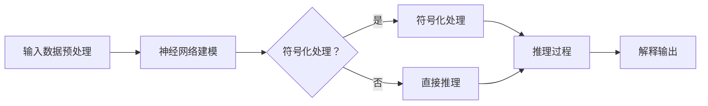

                 


### 基于神经符号推理的可解释AI系统设计

> 关键词：神经符号推理，可解释AI，系统设计，算法原理，性能优化

> 摘要：
随着人工智能技术的发展，AI系统的应用日益广泛，但其“黑箱”特性导致其解释性不足，使得用户难以信任和接受。本文提出了基于神经符号推理的可解释AI系统设计，通过结合神经网络和符号逻辑的优势，实现了高度动态和强大的表达力。本文首先介绍了神经符号推理的基本原理和算法，然后详细讲解了可解释AI系统的架构设计与实现，最后探讨了性能优化与安全设计的方法。本文旨在为研究者提供一套系统性的设计思路，推动可解释AI技术的发展。

---

## 第一部分：问题背景与核心概念

### 1.1 问题的提出

#### 1.1.1 AI系统解释性需求的重要性

人工智能（AI）系统在众多领域中取得了显著的成功，例如图像识别、自然语言处理、推荐系统等。然而，这些系统通常被视为“黑箱”，其决策过程对人类用户来说是难以理解和解释的。这种解释性不足的问题导致了以下几个方面的挑战：

1. **信任问题**：用户难以信任一个他们无法理解的系统，尤其是在涉及关键决策的领域，如医疗诊断、金融风险评估等。
2. **监管问题**：对于某些应用场景，如自动驾驶、医疗设备等，法规要求系统具备一定的解释性，以便监管机构评估其安全性和有效性。
3. **优化问题**：没有解释性，系统难以接受用户的反馈进行自我优化和改进。

#### 1.1.2 神经符号推理的背景

神经符号推理（Neural Symbolic Reasoning, NSR）是一种结合神经网络和符号逻辑的方法，旨在解决AI系统的解释性问题。神经网络通过大量数据学习复杂的模式，而符号逻辑则提供了一种形式化的推理机制，使得系统的决策过程更具透明性和可解释性。

#### 1.1.3 神经符号推理与可解释AI系统的联系

神经符号推理的核心在于将神经网络和符号逻辑相结合，从而在保证模型性能的同时提高系统的解释性。具体来说，神经符号推理通过以下方式实现可解释AI系统：

1. **符号化表示**：将神经网络的中间层或输出层转换为符号化的表示，使得决策过程具有一定的形式化描述。
2. **推理过程**：利用符号逻辑对符号化的表示进行推理，从而获取决策的理由和依据。
3. **解释输出**：将推理过程的结果转化为用户易于理解的形式，如自然语言描述或可视化图表。

### 1.2 核心概念与联系

#### 1.2.1 神经符号推理的定义

神经符号推理是一种将神经网络和符号逻辑相结合的方法，旨在通过符号化的表示和推理过程提高AI系统的解释性。

#### 1.2.2 可解释AI系统的定义

可解释AI系统（Explainable AI, XAI）是一种能够向用户明确展示其决策过程和推理依据的人工智能系统，使得用户能够理解系统的决策逻辑。

#### 1.2.3 神经符号推理与可解释AI系统的联系

神经符号推理是实现可解释AI系统的一种方法，通过符号化的表示和推理过程，将神经网络的决策过程转化为用户易于理解的形式。

### 1.3 神经符号推理的属性特征对比

| 特征 | 神经符号推理 | 传统符号推理 |
| :--: | :----------: | :----------: |
| 动态性 | 高度动态，自适应 | 较为静态，固定规则 |
| 表达力 | 强大的表达力，支持复杂推理 | 较弱的表达力，局限于简单规则 |
| 简洁性 | 表达简洁，易于理解 | 表达繁琐，不易理解 |

### 1.4 神经符号推理的ER实体关系图

```mermaid
erDiagram
    AI模型 ||--|> 符号化表示 : 使用符号表示模型
    符号化表示 ||--|> 推理过程 : 通过推理过程获取结论
    AI模型 ||--|> 可解释性 : 提供解释能力
```

### 1.5 可解释AI系统的设计原则

#### 1.5.1 可解释性设计的目标

可解释性设计的目标是提高AI系统的透明性和可理解性，使用户能够理解系统的决策过程和推理依据。

#### 1.5.2 可解释性设计的关键因素

1. **符号化表示**：通过符号化表示将神经网络转化为用户易于理解的形式。
2. **推理过程**：通过符号逻辑对符号化的表示进行推理，获取决策的理由和依据。
3. **解释输出**：将推理过程的结果转化为用户易于理解的形式，如自然语言描述或可视化图表。

#### 1.5.3 可解释性设计的方法与工具

1. **可视分析**：使用可视化工具将AI系统的决策过程和推理依据展示给用户。
2. **自然语言生成**：使用自然语言生成技术将推理过程转化为自然语言描述。
3. **可视化图表**：使用图表和图形将AI系统的决策过程和推理依据展示给用户。

### 1.6 本章小结

本部分主要介绍了基于神经符号推理的可解释AI系统设计的问题背景、核心概念、属性特征对比、ER实体关系图以及设计原则。下一部分将深入探讨神经符号推理的基本原理和算法。

---

## 第二部分：神经符号推理原理与算法

### 2.1 神经符号推理的基本原理

#### 2.1.1 神经网络与符号推理的结合

神经符号推理的核心在于将神经网络和符号推理相结合，以发挥两者的优势。神经网络擅长处理复杂的非线性问题，而符号推理则提供了形式化的推理机制，使得系统的决策过程更具透明性和可解释性。

#### 2.1.2 神经符号推理的模块化设计

神经符号推理通常由以下几个模块组成：

1. **输入模块**：接收原始数据，并将其预处理为神经网络能够处理的格式。
2. **神经网络模块**：使用神经网络对预处理后的数据进行建模，并提取有用的特征。
3. **符号化模块**：将神经网络输出的特征转换为符号化的表示。
4. **推理模块**：使用符号逻辑对符号化的表示进行推理，获取决策的理由和依据。
5. **解释模块**：将推理过程的结果转化为用户易于理解的形式。

#### 2.1.3 神经符号推理的优势与局限性

神经符号推理具有以下优势：

1. **动态性**：神经网络能够自适应地学习复杂的模式，符号逻辑则提供了形式化的推理机制，使得系统的决策过程更具动态性。
2. **表达力**：神经网络和符号逻辑的结合使得系统能够表达复杂的推理过程，具有较强的表达力。
3. **简洁性**：符号化的表示使得推理过程更加简洁，用户易于理解。

然而，神经符号推理也存在一些局限性：

1. **计算复杂性**：符号化表示和推理过程通常较为复杂，计算成本较高。
2. **准确性**：符号化表示和推理过程可能无法完全准确地反映神经网络的决策过程，从而影响系统的准确性。

### 2.2 神经符号推理的算法流程

神经符号推理的算法流程通常如下：

1. **输入数据预处理**：对输入数据进行预处理，以便神经网络能够更好地处理。
2. **神经网络建模**：使用神经网络对预处理后的数据进行建模，并提取有用的特征。
3. **符号化处理**：将神经网络输出的特征转换为符号化的表示。
4. **推理过程**：使用符号逻辑对符号化的表示进行推理，获取决策的理由和依据。
5. **解释输出**：将推理过程的结果转化为用户易于理解的形式。

以下是神经符号推理的算法流程的Mermaid流程图：



### 2.3 神经符号推理的核心算法

#### 2.3.1 深度神经网络与符号逻辑的结合

深度神经网络与符号逻辑的结合是实现神经符号推理的关键。通常，深度神经网络用于提取数据中的特征，而符号逻辑则用于对这些特征进行推理。

#### 2.3.2 符号化处理的算法实现

符号化处理是将神经网络输出的特征转换为符号化的表示。这一过程通常包括以下几个步骤：

1. **特征提取**：使用深度神经网络提取输入数据的特征。
2. **符号化表示**：将提取的特征转换为符号化的表示，如命题逻辑或谓词逻辑。
3. **符号化推理**：使用符号逻辑对符号化的表示进行推理。

#### 2.3.3 推理算法的优化与加速

推理算法的优化与加速是提高神经符号推理性能的关键。常见的优化方法包括：

1. **并行计算**：使用并行计算技术加快推理过程。
2. **模型压缩**：通过模型压缩技术减小模型的计算量。
3. **硬件加速**：使用GPU或TPU等硬件加速器提高推理性能。

### 2.4 神经符号推理的数学模型

神经符号推理的数学模型通常包括以下部分：

1. **神经网络模型**：使用深度神经网络对输入数据进行建模，并提取特征。
2. **符号逻辑模型**：使用符号逻辑对提取的特征进行推理。

以下是一个简化的神经符号推理的数学模型：

$$
\begin{aligned}
    f(x) &= \text{神经网络}(x) \\
    \phi(f(x)) &= \text{符号逻辑推理}(f(x))
\end{aligned}
$$

其中，$f(x)$表示神经网络模型，$\phi(f(x))$表示符号逻辑推理模型。

### 2.5 神经符号推理的应用场景

神经符号推理在多个领域具有广泛的应用潜力：

1. **医疗诊断**：通过神经符号推理，可以实现疾病的自动诊断和辅助决策。
2. **金融风险评估**：神经符号推理可以帮助金融机构进行风险评估和预测。
3. **自动驾驶**：神经符号推理可以提高自动驾驶系统的安全性和可靠性。

### 2.6 本章小结

本部分主要介绍了神经符号推理的基本原理、算法流程、核心算法、数学模型以及应用场景。下一部分将深入探讨可解释AI系统的设计与实现。

---

## 第三部分：可解释AI系统设计与实现

### 3.1 可解释AI系统的架构设计

#### 3.1.1 系统架构的总体设计

可解释AI系统的架构设计通常包括以下几个层次：

1. **数据层**：负责数据的收集、预处理和存储。
2. **模型层**：使用神经网络对数据进行建模，并提取特征。
3. **符号层**：将模型层的输出转换为符号化的表示。
4. **推理层**：使用符号逻辑对符号化的表示进行推理，获取决策的理由和依据。
5. **解释层**：将推理层的结果转化为用户易于理解的形式。

#### 3.1.2 数据流设计

数据流设计是可解释AI系统设计的关键。数据流通常包括以下几个阶段：

1. **数据收集**：收集用于训练和推理的数据。
2. **数据预处理**：对数据进行清洗、归一化等预处理操作。
3. **模型训练**：使用预处理后的数据训练神经网络模型。
4. **符号化表示**：将模型层的输出转换为符号化的表示。
5. **推理过程**：使用符号逻辑对符号化的表示进行推理。
6. **解释输出**：将推理过程的结果转化为用户易于理解的形式。

#### 3.1.3 接口设计

接口设计是可解释AI系统与用户交互的关键。接口设计通常包括以下几个部分：

1. **API接口**：提供API接口，使得用户可以通过编程方式访问系统的功能。
2. **Web界面**：设计用户友好的Web界面，使得用户可以通过图形界面与系统交互。
3. **可视化工具**：提供可视化工具，将系统的决策过程和推理依据以图表和图形的形式展示给用户。

### 3.2 可解释AI系统的功能模块设计

可解释AI系统的功能模块设计通常包括以下几个模块：

1. **输入模块**：接收用户输入的数据，并进行预处理。
2. **预处理模块**：对输入数据进行清洗、归一化等预处理操作。
3. **模型层**：使用神经网络对预处理后的数据进行建模，并提取特征。
4. **符号层**：将模型层的输出转换为符号化的表示。
5. **推理层**：使用符号逻辑对符号化的表示进行推理。
6. **解释层**：将推理层的结果转化为用户易于理解的形式。
7. **输出模块**：将解释层的结果输出给用户。

### 3.3 可解释AI系统的实现细节

#### 3.3.1 数据预处理

数据预处理是可解释AI系统实现的重要环节。数据预处理通常包括以下几个步骤：

1. **数据收集**：收集用于训练和推理的数据。
2. **数据清洗**：清洗数据中的噪声和异常值。
3. **数据归一化**：将数据归一化到统一的范围。
4. **数据分割**：将数据分为训练集、验证集和测试集。

#### 3.3.2 符号化处理

符号化处理是将神经网络输出的特征转换为符号化的表示。符号化处理通常包括以下几个步骤：

1. **特征提取**：使用神经网络提取输入数据的特征。
2. **特征转换**：将提取的特征转换为符号化的表示。
3. **特征整合**：将多个特征的符号化表示进行整合。

#### 3.3.3 推理过程

推理过程是可解释AI系统的核心。推理过程通常包括以下几个步骤：

1. **符号化表示**：将模型层的输出转换为符号化的表示。
2. **推理逻辑**：使用符号逻辑对符号化的表示进行推理。
3. **推理结果**：获取推理结果，并将其转化为用户易于理解的形式。

#### 3.3.4 解释输出

解释输出是将推理结果转化为用户易于理解的形式。解释输出通常包括以下几个步骤：

1. **自然语言生成**：使用自然语言生成技术将推理结果转化为自然语言描述。
2. **可视化图表**：使用可视化工具将推理结果以图表和图形的形式展示给用户。
3. **交互反馈**：提供交互反馈功能，使用户能够与系统进行互动，以获取更详细的解释。

### 3.4 实际案例分析与讲解

#### 3.4.1 案例一：医疗诊断

医疗诊断是神经符号推理和可解释AI系统的重要应用场景。以下是一个简化的医疗诊断案例：

1. **数据收集**：收集患者的临床数据，如血压、心率、血糖等。
2. **数据预处理**：对临床数据

