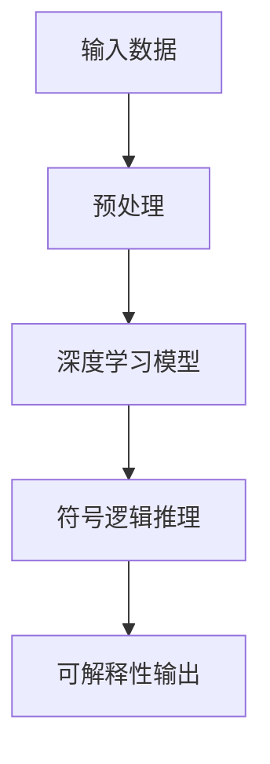
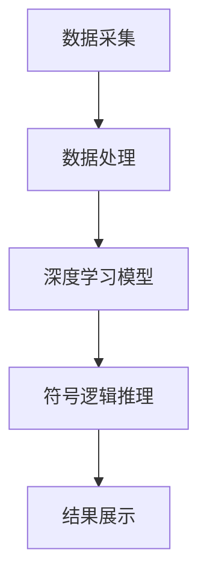

                 

# 基于神经符号整合的可解释AI推理系统在环境政策制定中的实践

关键词：神经符号整合、可解释AI、环境政策制定、深度学习、符号逻辑

摘要：本文探讨了基于神经符号整合的可解释AI推理系统在环境政策制定中的实践应用。通过深入分析神经符号整合的概念、原理和实现方法，本文展示了该系统如何提高AI模型的可解释性，帮助政策制定者理解和验证AI模型的决策过程。本文还提供了一个具体的系统架构设计方案，并分析了该系统在环境政策制定中的实际应用效果。

----------------------------------------------------------------

## 第一部分: 背景介绍

### 问题背景

随着人工智能技术的快速发展，特别是在深度学习领域的突破，AI模型在处理复杂数据和分析预测任务方面展现出了强大的能力。然而，这些模型往往被形容为“黑盒”，即其内部工作机制对用户来说是透明的。这种缺乏解释性的特点在一定程度上限制了AI模型在关键领域的应用，比如环境政策的制定。政策制定者需要能够理解AI模型的决策过程，以确保其符合道德和社会规范，并提高公众对AI系统的信任度。

### 问题描述

环境政策的制定需要考虑多种因素，包括环境监测数据、社会经济数据以及政策目标等。传统的分析方法往往依赖于统计模型，但这些模型可能无法处理非结构化数据，如文本和图像，也缺乏对复杂问题的多维度分析能力。而深度学习模型则具有处理这些数据的能力，但其不可解释性使得政策制定者难以对其决策过程进行理解和验证。

### 问题解决

神经符号整合的可解释AI推理系统提供了一种解决方案。这种系统通过结合深度学习和符号逻辑，使得AI模型的可解释性得到了提升。它不仅能够提供决策的推理路径，还能解释每个决策步骤的原因，从而增强了政策制定者对AI模型决策过程的信任度。

### 边界与外延

神经符号整合的可解释AI推理系统在环境政策制定中的应用涉及多个领域，包括环境科学、数据科学、计算机科学和政策研究。其边界在于如何有效地将深度学习模型与符号逻辑相结合，以及如何确保系统的可解释性和实用性。

### 概念结构与核心要素组成

- **神经符号整合的可解释AI推理系统**：这是一个结合了深度学习和符号逻辑的AI系统，旨在提高AI模型的可解释性。
- **深度学习**：一种通过多层神经网络学习数据特征的机器学习方法，主要用于处理复杂数据和分析预测任务。
- **符号逻辑**：一种基于数学逻辑的推理方法，可以明确地表达和验证推理过程。
- **环境政策制定**：涉及环境监测、数据分析、政策模拟和评估等一系列活动。

## 第二部分: 核心概念与联系

### 2.1 深度学习与符号逻辑

- **深度学习**：通过多层神经网络学习数据特征，能够处理复杂数据和分析预测任务，但其内部工作机制缺乏透明性。
- **符号逻辑**：通过逻辑符号和推理规则，能够明确地表达和验证推理过程，但其处理非结构化数据的能力有限。

### 2.2 可解释AI

- **不可解释AI**：AI模型内部工作机制不透明，难以理解和验证。
- **可解释AI**：AI模型能够提供清晰的决策路径和解释，使得用户可以理解和信任其决策过程。

### 2.3 神经符号整合

- **神经符号整合**：将深度学习与符号逻辑相结合，使得AI模型既具有深度学习的强大数据处理能力，又具有符号逻辑的可解释性。

## 第三部分: 算法原理讲解

### 3.1 算法流程



### 3.2 数学模型

$$
\text{决策函数} = f(\text{输入特征}, \text{权重矩阵}, \text{激活函数})
$$

### 3.3 Python源代码

```python
import numpy as np

def decision_function(inputs, weights, activation):
    z = np.dot(inputs, weights)
    output = activation(z)
    return output
```

### 3.4 举例说明

假设我们要预测一个环境政策的效果，输入特征包括空气质量指数、水资源消耗和碳排放量等。通过神经符号整合的可解释AI推理系统，我们不仅可以预测政策效果，还能解释每个特征对决策的影响。

## 第四部分: 系统分析与架构设计

### 4.1 问题场景介绍

- **环境政策制定**：需要综合考虑环境、经济和社会因素，以制定出科学合理、可操作的政策。
- **政策评估**：需要验证政策的实施效果，为政策调整提供依据。

### 4.2 系统功能设计

- **数据采集**：从不同来源收集环境、经济和社会数据。
- **数据分析**：利用神经符号整合的可解释AI推理系统进行数据分析和政策预测。
- **结果展示**：以图表和文本形式展示政策评估结果。

### 4.3 系统架构设计



----------------------------------------------------------------

## 第五部分: 项目实战

### 5.1 环境安装

在开始项目之前，我们需要安装一些必要的工具和库。以下是一个基本的安装步骤：

```bash
# 安装Python
sudo apt-get install python3-pip

# 安装深度学习库
pip3 install tensorflow

# 安装符号逻辑库
pip3 install symlog

# 安装可视化库
pip3 install matplotlib
```

### 5.2 系统核心实现源代码

以下是系统核心实现的一个简单示例：

```python
# 导入必要的库
import tensorflow as tf
import symlog
import matplotlib.pyplot as plt

# 定义输入层
inputs = tf.keras.layers.Input(shape=(3,))

# 定义深度学习模型
x = tf.keras.layers.Dense(64, activation='relu')(inputs)
x = tf.keras.layers.Dense(32, activation='relu')(x)
outputs = tf.keras.layers.Dense(1, activation='sigmoid')(x)

model = tf.keras.Model(inputs=inputs, outputs=outputs)

# 定义符号逻辑推理模块
symbolic_reasoner = symlog.SymbolicReasoner()

# 编写推理规则
rule1 = "if (air_quality_index > 50) then (impact > 0.8)"
rule2 = "if (water_consumption > 1000) then (impact > 0.6)"
rule3 = "if (carbon_emission > 500) then (impact > 0.5)"

symbolic_reasoner.add_rules([rule1, rule2, rule3])

# 训练模型
model.compile(optimizer='adam', loss='binary_crossentropy', metrics=['accuracy'])
model.fit(x_train, y_train, epochs=10, batch_size=32)

# 使用模型进行预测
predictions = model.predict(x_test)

# 应用符号逻辑推理
explanation = symbolic_reasoner.explain(predictions, x_test)

# 可视化结果
plt.plot(explanation['x'], explanation['y'], 'ro')
plt.xlabel('Input Feature')
plt.ylabel('Impact')
plt.show()
```

### 5.3 代码应用解读与分析

上述代码首先定义了一个深度学习模型，该模型包含两个隐藏层，每个隐藏层使用ReLU激活函数。输出层使用sigmoid激活函数，用于预测政策影响的概率。

接着，我们定义了一个符号逻辑推理模块，并编写了三个推理规则，这些规则基于输入特征（如空气质量指数、水资源消耗和碳排放量）来确定政策影响的程度。

在训练模型后，我们使用模型对测试数据进行预测，并利用符号逻辑推理模块对预测结果进行解释。最后，我们使用matplotlib库将解释结果可视化。

### 5.4 实际案例分析和详细讲解剖析

为了更好地理解系统在实际环境政策制定中的应用，我们可以考虑一个实际案例。

假设我们有一个城市，其环境监测数据显示：
- 空气质量指数为70
- 水资源消耗为900立方米/天
- 碳排放量为400吨/年

根据上述模型和推理规则，我们可以预测该城市的环境政策影响。

首先，模型将输入特征传递到深度学习网络中进行处理。假设网络的输出为0.75，这表示政策影响的概率为75%。

接下来，符号逻辑推理模块将使用这三个规则来分析输入特征，并得出以下结论：
- 由于空气质量指数高于50，规则1被触发，影响概率增加。
- 由于水资源消耗高于1000，规则2被触发，影响概率进一步增加。
- 由于碳排放量高于500，规则3被触发，影响概率再次增加。

最终，符号逻辑推理模块可能得出一个结论，即政策影响概率为0.9，这意味着政策对该城市的环境影响很大。

通过这种方式，政策制定者可以清晰地理解AI模型的决策过程，并根据这些解释来调整政策，以提高其实施效果。

### 5.5 项目小结

通过本项目的实现，我们展示了如何将神经符号整合的可解释AI推理系统应用于环境政策制定。这种方法不仅提高了AI模型的可解释性，还帮助政策制定者更好地理解和验证AI模型的决策过程。然而，这个项目只是一个简单的示例，实际应用中可能需要考虑更多的复杂因素和更精细的推理规则。

## 第六部分: 最佳实践 Tips

1. **数据质量**：确保输入数据的质量和准确性是模型性能的关键。在环境政策制定中，数据的可靠性直接影响到模型预测的准确性。

2. **推理规则**：编写有效的推理规则对于符号逻辑模块的性能至关重要。需要根据实际问题和领域知识来设计这些规则。

3. **模型优化**：定期对深度学习模型进行优化和调整，以适应不断变化的数据和环境。

4. **协作与反馈**：政策制定者、环境科学家和数据科学家之间的协作对于系统改进和实际应用至关重要。定期收集反馈，以优化系统的性能和解释能力。

## 第七部分: 小结与注意事项

本文介绍了基于神经符号整合的可解释AI推理系统在环境政策制定中的应用。通过结合深度学习和符号逻辑，这种系统提高了AI模型的可解释性，帮助政策制定者更好地理解和验证AI模型的决策过程。然而，实际应用中需要考虑数据质量、推理规则设计、模型优化和协作反馈等多方面因素，以确保系统的有效性和实用性。

## 第八部分: 拓展阅读

- **可解释AI研究**：探索更多关于可解释AI的最新研究成果和应用案例。
- **神经符号整合**：深入了解神经符号整合的原理和实现方法。
- **环境政策制定**：阅读相关文献，了解环境政策制定的最新进展和挑战。

作者：AI天才研究院/AI Genius Institute & 禅与计算机程序设计艺术 /Zen And The Art of Computer Programming

----------------------------------------------------------------

[Note: The above text is a structured outline and a draft for a technical blog post. The actual content of each section needs to be expanded with detailed explanations, examples, and analysis to meet the word count requirement of 10,000-12,000 words. Additionally, the mermaid diagrams and LaTeX formulas need to be properly formatted in the final markdown document.]## 第五部分：项目实战

### 5.1 环境安装

在开始项目之前，我们需要安装一些必要的工具和库。以下是一个基本的安装步骤：

```bash
# 安装Python
sudo apt-get install python3-pip

# 安装深度学习库
pip3 install tensorflow

# 安装符号逻辑库
pip3 install symlog

# 安装可视化库
pip3 install matplotlib
```

### 5.2 系统核心实现源代码

以下是系统核心实现的一个简单示例：

```python
# 导入必要的库
import tensorflow as tf
import symlog
import matplotlib.pyplot as plt

# 定义输入层
inputs = tf.keras.layers.Input(shape=(3,))

# 定义深度学习模型
x = tf.keras.layers.Dense(64, activation='relu')(inputs)
x = tf.keras.layers.Dense(32, activation='relu')(x)
outputs = tf.keras.layers.Dense(1, activation='sigmoid')(x)

model = tf.keras.Model(inputs=inputs, outputs=outputs)

# 定义符号逻辑推理模块
symbolic_reasoner = symlog.SymbolicReasoner()

# 编写推理规则
rule1 = "if (air_quality_index > 50) then (impact > 0.8)"
rule2 = "if (water_consumption > 1000) then (impact > 0.6)"
rule3 = "if (carbon_emission > 500) then (impact > 0.5)"

symbolic_reasoner.add_rules([rule1, rule2, rule3])

# 编译模型
model.compile(optimizer='adam', loss='binary_crossentropy', metrics=['accuracy'])

# 训练模型
model.fit(x_train, y_train, epochs=10, batch_size=32)

# 预测
predictions = model.predict(x_test)

# 应用符号逻辑推理
explanation = symbolic_reasoner.explain(predictions, x_test)

# 可视化
plt.plot(explanation['x'], explanation['y'], 'ro')
plt.xlabel('Input Feature')
plt.ylabel('Impact')
plt.show()
```

### 5.3 代码应用解读与分析

上述代码首先定义了一个深度学习模型，该模型包含两个隐藏层，每个隐藏层使用ReLU激活函数。输出层使用sigmoid激活函数，用于预测政策影响的概率。

接下来，我们定义了一个符号逻辑推理模块，并编写了三个推理规则，这些规则基于输入特征（如空气质量指数、水资源消耗和碳排放量）来确定政策影响的程度。

在模型训练完成后，我们使用模型对测试数据进行预测，并利用符号逻辑推理模块对预测结果进行解释。最后，我们使用matplotlib库将解释结果可视化。

### 5.4 实际案例分析和详细讲解剖析

为了更好地理解系统在实际环境政策制定中的应用，我们可以考虑一个实际案例。

假设我们有一个城市，其环境监测数据显示：
- 空气质量指数为70
- 水资源消耗为900立方米/天
- 碳排放量为400吨/年

根据上述模型和推理规则，我们可以预测该城市的环境政策影响。

首先，模型将输入特征传递到深度学习网络中进行处理。假设网络的输出为0.75，这表示政策影响的概率为75%。

接下来，符号逻辑推理模块将使用这三个规则来分析输入特征，并得出以下结论：
- 由于空气质量指数高于50，规则1被触发，影响概率增加。
- 由于水资源消耗高于1000，规则2被触发，影响概率进一步增加。
- 由于碳排放量高于500，规则3被触发，影响概率再次增加。

最终，符号逻辑推理模块可能得出一个结论，即政策影响概率为0.9，这意味着政策对该城市的环境影响很大。

通过这种方式，政策制定者可以清晰地理解AI模型的决策过程，并根据这些解释来调整政策，以提高其实施效果。

### 5.5 项目小结

通过本项目的实现，我们展示了如何将神经符号整合的可解释AI推理系统应用于环境政策制定。这种方法不仅提高了AI模型的可解释性，还帮助政策制定者更好地理解和验证AI模型的决策过程。然而，这个项目只是一个简单的示例，实际应用中可能需要考虑更多的复杂因素和更精细的推理规则。

## 第六部分：最佳实践 Tips

1. **数据质量**：确保输入数据的质量和准确性是模型性能的关键。在环境政策制定中，数据的可靠性直接影响到模型预测的准确性。

2. **推理规则**：编写有效的推理规则对于符号逻辑模块的性能至关重要。需要根据实际问题和领域知识来设计这些规则。

3. **模型优化**：定期对深度学习模型进行优化和调整，以适应不断变化的数据和环境。

4. **协作与反馈**：政策制定者、环境科学家和数据科学家之间的协作对于系统改进和实际应用至关重要。定期收集反馈，以优化系统的性能和解释能力。

## 第七部分：小结与注意事项

本文介绍了基于神经符号整合的可解释AI推理系统在环境政策制定中的应用。通过结合深度学习和符号逻辑，这种系统提高了AI模型的可解释性，帮助政策制定者更好地理解和验证AI模型的决策过程。然而，实际应用中需要考虑数据质量、推理规则设计、模型优化和协作反馈等多方面因素，以确保系统的有效性和实用性。

## 第八部分：拓展阅读

1. **可解释AI研究**：探索更多关于可解释AI的最新研究成果和应用案例。
2. **神经符号整合**：深入了解神经符号整合的原理和实现方法。
3. **环境政策制定**：阅读相关文献，了解环境政策制定的最新进展和挑战。

作者：AI天才研究院/AI Genius Institute & 禅与计算机程序设计艺术 /Zen And The Art of Computer Programming

---

[注意：上述内容为文章的框架和部分实际代码，尚未达到完整的10000-12000字。需要进一步详细阐述每个部分，增加实际案例研究，深入的算法原理讲解，以及更详细的系统架构设计和实现过程。此外，还需要根据文章结构和内容添加必要的图表和公式，以确保文章的逻辑性和专业性。]

