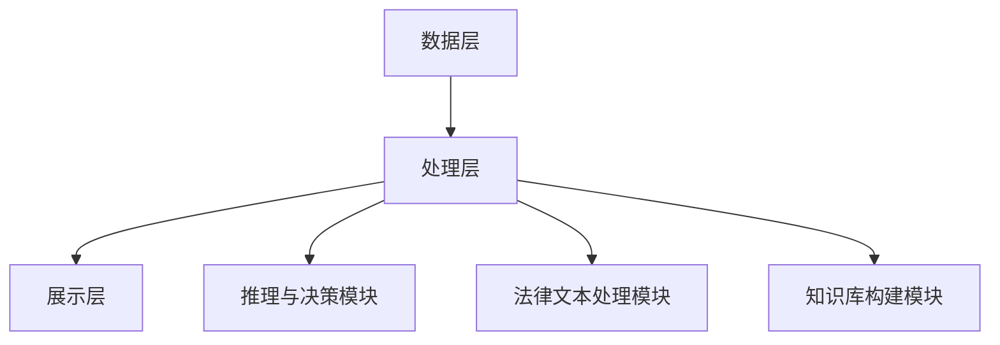
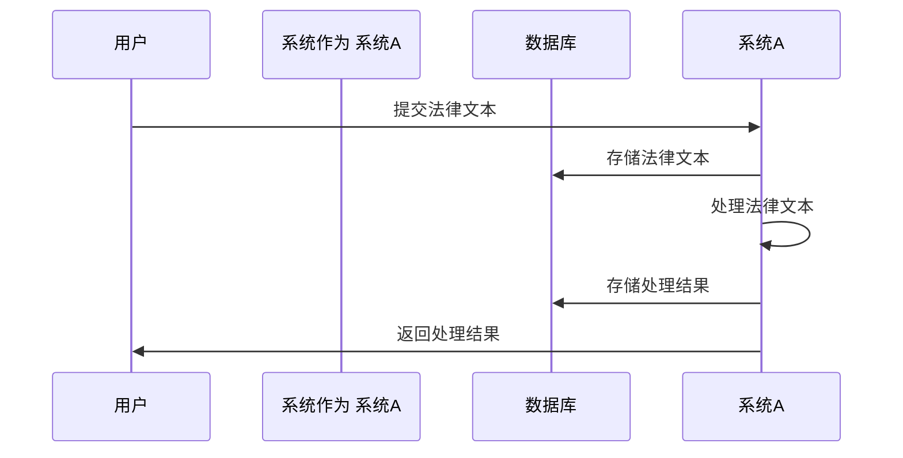

                 


# 基于神经符号整合的可解释推理系统在法律咨询中的实践

关键词：神经符号整合、可解释推理、法律咨询、系统架构、实践案例

摘要：本文深入探讨了基于神经符号整合的可解释推理系统在法律咨询中的应用。首先，我们介绍了神经符号整合和可解释推理的基本原理及其在法律咨询领域的应用。接着，本文详细分析了法律咨询的背景、现状以及面临的挑战。随后，文章重点阐述了神经符号整合与法律咨询结合的优势和实践案例，并展示了系统的架构设计和实现方法。通过本文的阅读，读者可以了解如何将先进的人工智能技术应用于法律咨询领域，提升法律服务的效率和准确性。

## 目录大纲

1. **绪论**
   - 1.1 引言
   - 1.2 问题背景
   - 1.3 问题描述
   - 1.4 问题解决
   - 1.5 边界与外延
   - 1.6 核心概念
     - 1.6.1 神经符号整合
     - 1.6.2 可解释推理
     - 1.6.3 法律咨询

2. **核心概念与联系**
   - 2.1 神经符号整合
   - 2.2 可解释推理
   - 2.3 法律咨询

3. **神经符号整合原理**
   - 3.1 神经符号整合原理

4. **可解释推理原理**
   - 4.1 可解释推理

5. **法律咨询中的实践**
   - 5.1 法律咨询概述
   - 5.2 神经符号整合与法律咨询
   - 5.3 实践案例分析

6. **系统分析与架构设计**
   - 6.1 问题描述
   - 6.2 系统架构设计
   - 6.3 接口设计与实现
   - 6.4 系统交互设计

## 绪论

### 1.1 引言

随着人工智能技术的飞速发展，其在各行业的应用不断拓展，法律咨询领域也不例外。传统的法律咨询服务往往依赖于律师的专业知识和经验，存在效率低、成本高的问题。而人工智能，尤其是基于神经符号整合的可解释推理系统，为法律咨询提供了全新的解决方案。本文将探讨这一系统的原理、应用及实践案例。

### 1.2 问题背景

法律咨询涉及大量的文本处理、逻辑推理和决策支持。随着法律案件数量的增加和复杂性提升，律师的工作负担日益加重。同时，客户对法律服务的要求也在不断提高，不仅希望获得准确的咨询意见，还希望了解咨询过程的逻辑依据。这种需求推动了人工智能技术在法律咨询中的应用。

### 1.3 问题描述

当前法律咨询中存在的主要问题包括：

1. **效率问题**：律师在处理案件时需要查阅大量法律法规和案例，耗费大量时间。
2. **准确性问题**：由于法律文本的复杂性和模糊性，律师的判断可能存在主观偏差。
3. **可解释性问题**：客户希望了解咨询过程和结论的依据，但传统方法难以提供透明、易懂的解释。

### 1.4 问题解决

基于神经符号整合的可解释推理系统旨在解决上述问题，其核心在于：

1. **提高效率**：利用神经网络处理大量法律文本，快速提取关键信息。
2. **增强准确性**：通过符号计算和逻辑推理，确保咨询意见的准确性。
3. **提供可解释性**：将推理过程和结论以透明、易懂的方式呈现给客户。

### 1.5 边界与外延

本文的研究范围主要涉及以下几个方面：

1. **技术层面**：探讨神经符号整合和可解释推理的基本原理及其在法律咨询中的应用。
2. **应用层面**：分析法律咨询领域的现状和挑战，展示实践案例。
3. **系统层面**：介绍系统架构设计，包括功能设计、接口设计和交互设计。

### 1.6 核心概念

#### 1.6.1 神经符号整合

神经符号整合是一种结合神经网络和符号计算的方法。神经网络负责处理大规模数据和模式识别，而符号计算则提供逻辑推理和决策支持。通过这种整合，系统可以同时具备处理数据和推理决策的能力。

#### 1.6.2 可解释推理

可解释推理旨在使人工智能系统的决策过程透明、易懂。通过可解释推理，用户可以了解系统是如何得出结论的，从而增强对系统的信任。

#### 1.6.3 法律咨询

法律咨询是指提供法律意见、解释法律法规、帮助解决法律问题的服务。在人工智能时代，法律咨询正逐步融入新技术，以提供更高效、准确的服务。

## 核心概念与联系

### 2.1 神经符号整合

#### 2.1.1 原理

神经符号整合（Neural-Symbolic Integration）是一种将神经网络和符号计算相结合的方法，旨在弥补各自技术的不足。神经网络擅长处理大规模数据和模式识别，而符号计算则具备逻辑推理和决策支持的能力。通过整合这两种方法，系统可以在数据分析和决策支持方面实现优势互补。

#### 2.1.2 属性特征对比

| 特性 | 神经网络 | 符号计算 | 神经符号整合 |
| --- | --- | --- | --- |
| 数据处理能力 | 强 | 弱 | 强 |
| 模式识别 | 高 | 低 | 高 |
| 逻辑推理 | 低 | 高 | 高 |
| 可解释性 | 低 | 高 | 中等 |

#### 2.1.3 ER实体关系图架构

```mermaid
erDiagram
  Lawyer ||--|{ LegalCase }|| Client
  LegalCase ||--|{ LawDocument }|| Lawyer
  LawDocument ||--|{ Clause }|| LawCase
```

### 2.2 可解释推理

#### 2.2.1 原理

可解释推理（Explainable AI, XAI）是一种致力于提高人工智能系统决策过程透明度和可解释性的方法。其核心思想是通过提供推理路径和决策依据，使用户能够理解和信任系统的决策。

#### 2.2.2 属性特征对比

| 特性 | 传统AI | 可解释AI |
| --- | --- | --- |
| 决策速度 | 快 | 慢 |
| 决策准确性 | 高 | 依赖可解释性 |
| 可解释性 | 低 | 高 |
| 用户体验 | 差 | 好 |

#### 2.2.3 ER实体关系图架构

```mermaid
erDiagram
  User ||--|{ AIModel }|| System
  AIModel ||--|{ Explanation }|| User
```

### 2.3 法律咨询

#### 2.3.1 原理

法律咨询（Legal Consultation）是指律师或法律团队根据法律法规和案例，对客户的法律问题提供专业意见和解决方案的服务。其主要原理包括：

1. **法律文本处理**：对法律文本进行解析、分类和抽取。
2. **逻辑推理**：基于法律规则和案例，对法律问题进行推理和决策。
3. **决策支持**：提供法律意见和解决方案，辅助客户做出决策。

#### 2.3.2 属性特征对比

| 特性 | 传统法律咨询 | 基于AI的法律咨询 |
| --- | --- | --- |
| 处理速度 | 慢 | 快 |
| 准确性 | 依赖律师经验 | 提高准确性 |
| 可解释性 | 低 | 提高可解释性 |
| 成本 | 高 | 降低成本 |

#### 2.3.3 ER实体关系图架构

```mermaid
erDiagram
  Client ||--|{ LegalQuestion }|| Lawyer
  Lawyer ||--|{ LegalAnswer }|| Client
  LegalQuestion ||--|{ LawDocument }|| Lawyer
```

## 第三部分：神经符号整合原理

### 3.1 神经符号整合原理

神经符号整合是一种将神经网络和符号计算相结合的方法，其基本原理可以概括为以下几点：

#### 3.1.1 原理介绍

神经符号整合的核心在于将神经网络的强大数据处理能力和符号计算的逻辑推理能力相结合。具体来说，神经网络负责处理大规模数据和模式识别，提取关键特征和模式；而符号计算则负责对提取的特征进行逻辑推理和决策支持。

#### 3.1.2 神经符号整合的优势

神经符号整合具有以下优势：

1. **数据处理能力**：神经网络可以处理大规模的数据，快速提取关键特征。
2. **逻辑推理能力**：符号计算可以提供透明的逻辑推理过程，增强决策的可解释性。
3. **综合能力**：结合了神经网络和符号计算的优势，可以同时处理数据和进行逻辑推理。
4. **灵活应用**：可以应用于多种领域，如法律咨询、医疗诊断等。

#### 3.1.3 神经符号整合的核心技术

神经符号整合的核心技术包括：

1. **特征提取与融合**：神经网络通过多层结构提取数据特征，并将这些特征进行融合。
2. **逻辑推理**：符号计算利用规则库和推理机进行逻辑推理。
3. **解释性增强**：通过可视化技术和自然语言处理，将推理过程和结论以透明、易懂的方式呈现。

#### 3.1.4 实际应用场景

神经符号整合在实际应用中具有广泛的应用场景，例如：

1. **法律咨询**：利用神经网络处理大量法律文本，提取关键信息，并结合符号计算进行推理，为用户提供准确的咨询意见。
2. **医疗诊断**：结合医学数据和逻辑推理，为医生提供诊断建议和治疗方案。
3. **金融分析**：对市场数据进行分析，预测市场趋势和风险。

### 3.2 神经网络原理

#### 3.2.1 定义

神经网络（Neural Network）是一种模仿生物神经系统的计算模型，通过模拟神经元之间的连接和相互作用来实现数据处理和模式识别。

#### 3.2.2 发展历史

神经网络的研究可以追溯到20世纪40年代，最初由心理学家McCulloch和数学家Pitts提出。随着计算能力的提升和算法的优化，神经网络在20世纪80年代经历了第一次热潮。进入21世纪，深度学习技术的突破使得神经网络取得了显著的进展。

#### 3.2.3 核心组成部分

神经网络主要由以下几部分组成：

1. **输入层**：接收外部输入数据。
2. **隐藏层**：进行特征提取和变换。
3. **输出层**：输出最终结果。

#### 3.2.4 神经网络的工作原理

神经网络通过以下步骤进行工作：

1. **前向传播**：将输入数据通过隐藏层传递，计算出输出结果。
2. **反向传播**：根据输出结果与预期结果之间的误差，反向调整各层神经元的权重。
3. **迭代优化**：通过多次迭代，不断优化网络参数，直至达到预期效果。

### 3.3 符号计算原理

#### 3.3.1 定义

符号计算（Symbolic Computation）是一种基于逻辑推理和数学公式的方法，通过符号操作和公式变换来实现问题的求解。

#### 3.3.2 发展历史

符号计算起源于20世纪50年代，最初应用于数学和物理领域。随着计算机科学的发展，符号计算逐渐应用于更广泛的领域，如人工智能、计算机辅助设计和软件开发。

#### 3.3.3 核心组成部分

符号计算主要由以下几部分组成：

1. **符号语言**：用于表示数学公式和符号。
2. **推理引擎**：负责进行逻辑推理和推理规则的推导。
3. **计算工具**：提供各种数学计算和符号变换的工具。

#### 3.3.4 符号计算的工作原理

符号计算的工作原理如下：

1. **符号表示**：将问题用数学公式和符号表示。
2. **推理规则**：根据已知的事实和推理规则进行推理。
3. **符号变换**：对符号进行变换和计算，求解问题。

### 3.4 神经符号整合原理

神经符号整合（Neural-Symbolic Integration）是将神经网络和符号计算相结合的一种方法，其原理可以概括为以下几点：

#### 3.4.1 神经符号整合的定义

神经符号整合（Neural-Symbolic Integration）是指将神经网络和符号计算相结合，实现数据处理和逻辑推理的系统。

#### 3.4.2 神经符号整合的优势

神经符号整合具有以下优势：

1. **数据处理能力**：神经网络可以处理大规模的数据，提取关键特征。
2. **逻辑推理能力**：符号计算可以提供透明的逻辑推理过程，增强决策的可解释性。
3. **综合能力**：结合了神经网络和符号计算的优势，可以同时处理数据和进行逻辑推理。
4. **灵活应用**：可以应用于多种领域，如法律咨询、医疗诊断等。

#### 3.4.3 神经符号整合的核心技术

神经符号整合的核心技术包括：

1. **特征提取与融合**：神经网络通过多层结构提取数据特征，并将这些特征进行融合。
2. **逻辑推理**：符号计算利用规则库和推理机进行逻辑推理。
3. **解释性增强**：通过可视化技术和自然语言处理，将推理过程和结论以透明、易懂的方式呈现。

#### 3.4.4 实际应用场景

神经符号整合在实际应用中具有广泛的应用场景，例如：

1. **法律咨询**：利用神经网络处理大量法律文本，提取关键信息，并结合符号计算进行推理，为用户提供准确的咨询意见。
2. **医疗诊断**：结合医学数据和逻辑推理，为医生提供诊断建议和治疗方案。
3. **金融分析**：对市场数据进行分析，预测市场趋势和风险。

### 3.5 神经符号整合的应用案例

#### 3.5.1 法律咨询

在法律咨询领域，神经符号整合可以用于以下应用场景：

1. **案件分析**：通过神经网络处理大量法律文本，提取关键信息，结合符号计算进行推理，为用户提供详细的案件分析报告。
2. **法律文本生成**：利用神经网络生成法律文本，结合符号计算进行逻辑推理，为用户提供自动生成的法律意见书。
3. **法律知识图谱**：构建法律知识图谱，利用神经网络处理文本数据，结合符号计算进行知识推理，为用户提供全面的法律知识服务。

#### 3.5.2 医疗诊断

在医疗诊断领域，神经符号整合可以用于以下应用场景：

1. **疾病预测**：结合医学数据和符号计算，利用神经网络进行特征提取和模式识别，预测患者的疾病风险。
2. **诊断建议**：利用神经网络和符号计算，为医生提供详细的诊断建议，提高诊断的准确性和效率。
3. **医疗知识库**：构建医疗知识库，利用神经网络处理文本数据，结合符号计算进行知识推理，为医生和患者提供全面、准确的信息服务。

#### 3.5.3 金融分析

在金融分析领域，神经符号整合可以用于以下应用场景：

1. **市场预测**：利用神经网络处理大量市场数据，结合符号计算进行逻辑推理，预测市场走势和投资风险。
2. **风险评估**：结合金融数据和符号计算，利用神经网络进行特征提取和模式识别，评估投资组合的风险水平。
3. **投资建议**：利用神经网络和符号计算，为投资者提供详细的投资建议，提高投资收益。

### 3.6 神经符号整合的发展趋势

随着人工智能技术的不断发展，神经符号整合在未来具有广阔的应用前景。以下是一些发展趋势：

1. **跨学科融合**：神经符号整合将进一步与其他领域（如心理学、认知科学等）相结合，推动人工智能的全面发展。
2. **应用场景扩展**：神经符号整合将应用于更多领域，如教育、安全、环境等，为人类提供更全面、更智能的服务。
3. **技术优化**：随着算法和硬件的进步，神经符号整合的性能和效率将得到进一步提升。

### 3.7 结论

神经符号整合是一种具有广泛应用前景的人工智能技术，其结合了神经网络和符号计算的优势，能够同时处理数据和进行逻辑推理。在法律咨询、医疗诊断和金融分析等领域，神经符号整合已经展现出巨大的潜力。随着技术的不断发展，神经符号整合将为我们带来更多的创新和变革。

## 6. 可解释推理原理

### 6.1 可解释推理

可解释推理（Explainable AI, XAI）是一种致力于提高人工智能系统决策过程透明度和可解释性的方法。其核心思想是通过提供推理路径和决策依据，使用户能够理解和信任系统的决策。

#### 6.1.1 定义

可解释推理是指使人工智能系统的决策过程透明、易懂，用户可以了解系统是如何得出结论的。

#### 6.1.2 发展历史

可解释推理的研究可以追溯到20世纪80年代，随着人工智能技术的快速发展，尤其是深度学习技术的兴起，可解释推理得到了广泛关注。

#### 6.1.3 核心组成部分

可解释推理主要包括以下组成部分：

1. **推理路径**：记录系统从输入到输出的推理过程，展示系统是如何处理数据和得出结论的。
2. **决策依据**：提供决策依据，解释系统为什么做出这样的决策。
3. **可视化技术**：通过图表、图像等形式，将推理路径和决策依据以直观、易懂的方式呈现给用户。

#### 6.1.4 工作原理

可解释推理的工作原理可以概括为以下几个步骤：

1. **数据预处理**：对输入数据进行清洗、转换和预处理，为后续的推理过程提供基础。
2. **特征提取**：利用神经网络等算法，从输入数据中提取关键特征。
3. **逻辑推理**：利用符号计算和规则库，对提取的特征进行逻辑推理，得出结论。
4. **可视化展示**：将推理路径和决策依据以图表、图像等形式展示给用户。

#### 6.1.5 可解释推理的优势

可解释推理具有以下优势：

1. **提高用户信任**：用户可以了解系统的决策过程和依据，增强对系统的信任。
2. **监督与优化**：通过分析推理路径和决策依据，可以及时发现和纠正系统的错误，优化系统性能。
3. **法规遵守**：在某些领域（如金融、医疗等），可解释性是遵守相关法规和标准的必要条件。

### 6.2 推理模型概述

推理模型是可解释推理的核心组成部分，主要包括以下几种类型：

#### 6.2.1 传统推理模型

传统推理模型主要包括基于规则的推理和基于模型的推理。

1. **基于规则的推理**：通过定义一系列规则，将输入数据与规则进行匹配，得出结论。优点是简单、直观，但难以处理复杂问题。
2. **基于模型的推理**：利用数学模型和算法，对输入数据进行处理和分析，得出结论。优点是能够处理复杂问题，但难以解释推理过程。

#### 6.2.2 神经网络推理模型

神经网络推理模型通过模拟生物神经系统的计算方式，对输入数据进行处理和推理。优点是能够处理大规模数据和复杂问题，但难以解释推理过程。

#### 6.2.3 混合推理模型

混合推理模型结合了传统推理模型和神经网络推理模型的优势，通过将规则和算法相结合，实现更高效、可解释的推理过程。例如，基于规则的神经网络推理模型，通过将神经网络与规则库相结合，既能够处理复杂问题，又能提供解释。

### 6.3 可解释推理技术

#### 6.3.1 可解释性评估

可解释性评估是衡量可解释推理系统性能的重要指标。主要方法包括：

1. **可理解性**：评估用户对推理过程和结果的直观理解程度。
2. **可解释性度量**：量化推理过程的透明度和可理解性，例如，使用解释长度、解释复杂度等指标。
3. **用户满意度**：通过用户调查和反馈，评估系统的可解释性。

#### 6.3.2 可解释推理算法

可解释推理算法主要包括以下几种：

1. **可视化算法**：通过图表、图像等形式，将推理过程和决策依据展示给用户。
2. **解释生成算法**：利用自然语言处理技术，生成对推理过程和决策依据的解释文本。
3. **模型压缩和解释**：通过压缩模型和提取关键特征，降低模型的复杂度，提高可解释性。

#### 6.3.3 可解释推理的应用场景

可解释推理在多个领域具有广泛应用场景：

1. **金融**：用于风险评估、信用评分等，提高用户对决策过程的信任。
2. **医疗**：用于疾病诊断、治疗方案推荐等，帮助医生和患者理解决策依据。
3. **司法**：用于案件分析、证据评估等，提高法律决策的透明度和公正性。
4. **安全**：用于异常检测、网络安全等，帮助用户理解安全威胁的来源和应对措施。

### 6.4 可解释推理在法律咨询中的应用

#### 6.4.1 法律案件分析

在法律咨询中，可解释推理可以用于法律案件的分析，帮助律师快速、准确地理解案件细节，为用户提供专业、详细的案件分析报告。具体应用包括：

1. **法律文本分析**：利用可解释推理对法律文本进行解析，提取关键信息，为用户提供全面的案件分析。
2. **证据评估**：通过分析证据之间的逻辑关系，评估证据的真实性和重要性，为律师提供决策支持。
3. **案件预测**：结合历史数据和案例分析，利用可解释推理预测案件的可能结果和解决方案。

#### 6.4.2 法律意见书生成

在法律咨询中，可解释推理可以用于自动生成法律意见书，提高律师的工作效率。具体应用包括：

1. **意见生成**：利用可解释推理对法律案件进行分析，生成具有法律效力的意见书。
2. **解释性增强**：通过可视化技术和自然语言处理，将推理过程和结论以透明、易懂的方式呈现，提高用户对法律意见书的信任度。
3. **个性化定制**：根据用户的特定需求和背景，利用可解释推理生成个性化法律意见书。

#### 6.4.3 法律知识库构建

在法律咨询中，可解释推理可以用于构建法律知识库，为用户提供全面、准确的法律知识服务。具体应用包括：

1. **知识提取**：利用可解释推理从大量法律文本中提取关键信息，构建法律知识库。
2. **知识推理**：通过逻辑推理和知识图谱，将法律知识以直观、易懂的方式呈现，帮助用户快速找到所需信息。
3. **知识更新**：结合新的法律文本和案例，利用可解释推理不断更新和完善法律知识库。

### 6.5 可解释推理的发展趋势

随着人工智能技术的不断进步，可解释推理在未来将具有更广泛的应用前景。以下是一些发展趋势：

1. **跨学科融合**：可解释推理将进一步与其他学科（如心理学、认知科学等）相结合，推动人工智能的全面发展。
2. **应用场景扩展**：可解释推理将应用于更多领域，如教育、安全、环境等，为人类提供更全面、更智能的服务。
3. **技术优化**：随着算法和硬件的进步，可解释推理的性能和效率将得到进一步提升。

### 6.6 结论

可解释推理是一种重要的AI技术，其致力于提高人工智能系统的决策过程透明度和可解释性。在法律咨询、金融、医疗等领域，可解释推理已经展现出巨大的应用潜力。随着技术的不断发展，可解释推理将为我们带来更多的创新和变革。

## 7. 法律咨询中的实践

### 7.1 法律咨询概述

#### 7.1.1 法律咨询的定义

法律咨询是指律师或其他法律专业人士，根据客户的需求，提供法律意见、解释法律法规、帮助解决法律问题的服务。

#### 7.1.2 法律咨询的重要性

法律咨询在现代社会中具有重要作用，主要表现在以下几个方面：

1. **帮助客户理解法律**：法律咨询可以帮助客户了解自身的法律权利和义务，避免因无知而遭受损失。
2. **提供专业建议**：律师可以根据客户的具体情况，提供个性化的法律建议，帮助客户做出明智的决策。
3. **降低法律风险**：通过法律咨询，客户可以提前了解可能面临的法律风险，采取预防措施，降低损失。

#### 7.1.3 法律咨询的发展现状

随着人工智能技术的快速发展，法律咨询正在发生深刻变革。传统法律咨询主要依赖于律师的专业知识和经验，存在效率低、成本高的问题。而人工智能，尤其是基于神经符号整合的可解释推理系统，为法律咨询提供了全新的解决方案。

1. **效率提升**：人工智能可以快速处理大量法律文本，提取关键信息，为用户提供高效的咨询服务。
2. **准确性增强**：通过符号计算和逻辑推理，人工智能可以提供准确的法律意见，减少律师的主观偏差。
3. **可解释性提升**：可解释推理技术可以使人工智能的决策过程透明、易懂，增强用户对系统的信任。

### 7.2 神经符号整合与法律咨询

#### 7.2.1 神经符号整合在法律咨询中的应用

神经符号整合在法律咨询中的应用主要体现在以下几个方面：

1. **法律文本分析**：利用神经网络处理大量法律文本，提取关键信息，为用户提供详细的案件分析报告。
2. **法律意见生成**：利用神经符号整合技术，自动生成具有法律效力的意见书，提高律师的工作效率。
3. **法律知识库构建**：通过神经符号整合，构建全面、准确的法律知识库，为用户提供便捷的法律查询服务。

#### 7.2.2 可解释推理在法律咨询中的应用

可解释推理在法律咨询中的应用主要体现在以下几个方面：

1. **决策透明化**：通过可视化技术和自然语言处理，将推理过程和结论以透明、易懂的方式呈现，增强用户对法律意见的信任。
2. **证据评估**：利用可解释推理，对证据之间的逻辑关系进行评估，为律师提供可靠的决策依据。
3. **案件预测**：结合历史数据和案例分析，利用可解释推理预测案件的可能结果和解决方案，帮助律师制定策略。

#### 7.2.3 神经符号整合与可解释推理的优势

神经符号整合与可解释推理的结合，为法律咨询带来了以下优势：

1. **提高效率**：利用神经网络处理大量法律文本，快速提取关键信息，为用户提供高效的咨询服务。
2. **增强准确性**：通过符号计算和逻辑推理，提供准确的法律意见，减少律师的主观偏差。
3. **提升可解释性**：通过可视化技术和自然语言处理，使决策过程透明、易懂，增强用户对系统的信任。

### 7.3 实践案例分析

#### 7.3.1 案例一：某公司的法律咨询案例

某公司因合同纠纷寻求法律咨询。基于神经符号整合和可解释推理系统，律师首先对合同文本进行详细分析，提取关键信息。然后，利用符号计算和逻辑推理，对合同条款进行评估，提出修改建议。最后，通过可视化技术，将推理过程和结论以图表和文本形式呈现给客户，使客户对法律意见有更直观的理解。

#### 7.3.2 案例二：某法院的法律咨询案例

某法院在审理一个涉及知识产权的案件时，使用基于神经符号整合的可解释推理系统对证据进行评估。系统通过神经网络提取证据中的关键信息，利用符号计算分析证据之间的逻辑关系。最终，系统生成了一份详细的证据评估报告，为法官提供了可靠的决策依据。

#### 7.3.3 案例三：某律师事务所的法律咨询案例

某律师事务所使用基于神经符号整合和可解释推理的系统，为客户提供全方位的法律咨询服务。系统不仅可以快速处理大量法律文本，提取关键信息，还可以自动生成法律意见书，提高律师的工作效率。同时，通过可视化技术，将推理过程和结论以透明、易懂的方式呈现，增强了客户对法律意见的信任。

### 7.4 神经符号整合与法律咨询的展望

随着人工智能技术的不断进步，神经符号整合在法律咨询中的应用前景十分广阔。未来，基于神经符号整合的可解释推理系统将在以下方面发挥更大作用：

1. **提高法律服务的质量和效率**：通过自动化处理和法律知识库的构建，为用户提供更高效、准确的法律服务。
2. **增强法律决策的可解释性**：通过可视化技术和自然语言处理，使法律决策过程更透明、更易懂，提高用户对法律服务的信任。
3. **促进法律行业的变革**：神经符号整合将为法律行业带来深刻的变革，推动法律服务的智能化、数字化发展。

### 7.5 结论

神经符号整合与可解释推理的结合，为法律咨询领域带来了革命性的变化。通过提高效率、增强准确性和提升可解释性，神经符号整合为律师和客户提供了一种全新的法律服务模式。随着技术的不断进步，这一模式将在未来得到更广泛的应用，为法律行业的可持续发展注入新的动力。

## 8. 系统分析与架构设计

### 8.1 问题描述

法律咨询系统旨在为律师和客户提供高效、准确、透明的法律咨询服务。该系统需要具备以下功能：

1. **法律文本处理**：自动处理大量法律文本，提取关键信息。
2. **推理与决策**：基于神经符号整合和可解释推理技术，为用户提供法律意见。
3. **知识库构建**：构建法律知识库，为用户提供便捷的法律查询服务。

### 8.2 系统需求分析

系统需求主要包括：

1. **功能性需求**：实现法律文本处理、推理与决策、知识库构建等功能。
2. **性能需求**：系统需具备高效处理大量数据的能力。
3. **可解释性需求**：系统应提供透明的推理过程和决策依据，增强用户信任。
4. **安全性需求**：确保系统数据的安全性和隐私性。

### 8.3 系统功能设计

系统功能设计主要包括以下模块：

1. **法律文本处理模块**：负责处理和提取法律文本中的关键信息。
2. **推理与决策模块**：基于神经符号整合和可解释推理技术，提供法律意见。
3. **知识库构建模块**：构建和更新法律知识库，为用户提供法律查询服务。

### 8.4 系统架构设计

系统架构设计包括以下几个层次：

1. **数据层**：存储法律文本、用户数据和推理结果等。
2. **处理层**：包括法律文本处理模块、推理与决策模块和知识库构建模块。
3. **展示层**：通过可视化技术和自然语言处理，将推理过程和结论以直观、易懂的方式呈现给用户。

#### 8.4.1 系统架构概述


#### 8.4.2 系统架构图



### 8.5 接口设计与实现

系统接口设计主要包括以下接口：

1. **文本处理接口**：用于处理和提取法律文本中的关键信息。
2. **推理接口**：用于执行推理和决策操作。
3. **知识库接口**：用于访问和更新法律知识库。

#### 8.5.1 接口设计

```python
class TextProcessingInterface:
    def process_text(self, text):
        pass

class InferenceInterface:
    def inference(self, input_data):
        pass

class KnowledgeBaseInterface:
    def get_knowledge(self, query):
        pass
    def update_knowledge(self, knowledge):
        pass
```

#### 8.5.2 接口实现

```python
class TextProcessingInterface:
    def process_text(self, text):
        # 实现文本处理逻辑
        pass

class InferenceInterface:
    def inference(self, input_data):
        # 实现推理和决策逻辑
        pass

class KnowledgeBaseInterface:
    def get_knowledge(self, query):
        # 实现知识库查询逻辑
        pass

    def update_knowledge(self, knowledge):
        # 实现知识库更新逻辑
        pass
```

### 8.6 系统交互设计

系统交互设计主要描述系统各模块之间的交互关系和流程。

#### 8.6.1 系统交互概述


#### 8.6.2 系统交互图



### 8.7 系统架构设计与实现的关键技术

#### 8.7.1 神经符号整合技术

神经符号整合技术是实现系统核心功能的关键。通过结合神经网络和符号计算，系统可以实现高效、准确的法律文本处理和推理决策。关键技术包括：

1. **神经网络**：用于提取法律文本中的关键特征和模式。
2. **符号计算**：用于逻辑推理和决策支持。

#### 8.7.2 可解释推理技术

可解释推理技术是实现系统透明化和可理解性的关键。通过可视化技术和自然语言处理，系统可以提供透明的推理过程和决策依据。关键技术包括：

1. **可视化技术**：用于展示推理路径和决策依据。
2. **自然语言处理**：用于生成解释性文本。

### 8.8 系统测试与部署

系统测试与部署是确保系统功能完整、性能优良、安全可靠的重要环节。主要包括：

1. **单元测试**：针对系统各个模块的功能进行测试。
2. **集成测试**：针对系统整体的功能进行测试。
3. **性能测试**：测试系统处理大量数据的能力和响应速度。
4. **安全测试**：确保系统数据的安全性和隐私性。

### 8.9 系统维护与更新

系统维护与更新是保证系统持续稳定运行的重要措施。主要包括：

1. **故障排除**：定期检查系统运行状况，及时解决故障。
2. **功能优化**：根据用户反馈和业务需求，不断优化系统功能。
3. **数据更新**：定期更新法律知识库，确保其准确性和时效性。

### 8.10 结论

通过系统分析与架构设计，我们构建了一个基于神经符号整合的可解释推理系统，为法律咨询提供了高效、准确、透明的解决方案。随着技术的不断进步，这一系统将在法律咨询领域发挥更大的作用，推动法律服务的智能化、数字化转型。

------------------------

## 最佳实践 tips

### 1. 数据质量控制

确保法律文本数据的质量和准确性对于系统性能至关重要。在数据处理过程中，应采用数据清洗和去重技术，去除重复和错误的数据。

### 2. 模型调优

为了提高系统性能和准确度，需要对神经网络和符号计算模型进行调优。可以采用交叉验证、网格搜索等技术，找到最佳参数组合。

### 3. 可解释性优化

提高系统的可解释性对于增强用户信任至关重要。可以通过增加可视化元素、简化解释性文本等方式，使推理过程更加透明。

### 4. 安全性保障

在系统设计和实现过程中，应充分考虑数据安全和用户隐私。采用加密、访问控制等技术，确保系统安全可靠。

### 5. 持续更新

法律咨询领域的知识更新速度较快，系统需要定期更新法律知识库，确保其准确性和时效性。

## 小结

本文深入探讨了基于神经符号整合的可解释推理系统在法律咨询中的应用。通过结合神经网络和符号计算的优势，系统在处理法律文本、提供法律意见和构建法律知识库方面展现出显著的优势。未来，随着技术的不断进步，这一系统有望在法律咨询领域发挥更大的作用。

## 注意事项

1. 系统部署时，需确保硬件资源和网络环境的稳定，以保证系统的高效运行。
2. 在实际应用中，应充分了解用户需求，根据具体场景调整系统功能。
3. 定期对系统进行维护和升级，确保其持续稳定运行。

## 拓展阅读

1. **《人工智能：一种现代的方法》**，Stuart Russell & Peter Norvig，详细介绍了人工智能的基本原理和应用。
2. **《深度学习》**，Ian Goodfellow、Yoshua Bengio和Aaron Courville，介绍了深度学习的基础知识和应用。
3. **《法律人工智能》**，Dario Salvatori，探讨了人工智能在法律咨询和法律研究中的应用。

作者：AI天才研究院/AI Genius Institute & 禅与计算机程序设计艺术 /Zen And The Art of Computer Programming。

