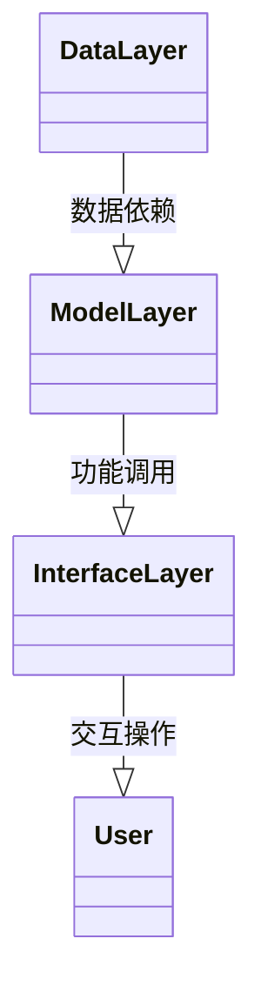

                 


### 基于神经逻辑编程的高级推理系统在自动化数学证明中的实践

#### 关键词
- 神经逻辑编程
- 自动化数学证明
- 高级推理系统
- 数学证明算法
- 神经网络
- 逻辑编程

#### 摘要
本文探讨了基于神经逻辑编程的高级推理系统在自动化数学证明中的实践。首先，文章介绍了神经逻辑编程和高级推理系统的基础理论，分析了数学证明自动化面临的挑战。随后，文章详细阐述了神经逻辑编程算法原理，包括神经网络和逻辑编程的融合策略。接着，文章通过实际案例，展示了系统架构设计、环境安装、核心实现及项目实战。最后，文章提出了最佳实践建议，总结了研究成果，并展望了未来研究方向。

----------------------------------------------------------------

### 第一部分：引论

#### 第1章：问题背景与目标

##### 1.1 引言

自动化数学证明是数学领域的一个前沿课题，它旨在通过计算机程序自动验证数学命题的真实性。然而，数学证明通常涉及复杂的概念和逻辑推理，这使得自动化证明成为一个具有挑战性的问题。随着人工智能技术的不断发展，特别是神经网络和逻辑编程的结合，为自动化数学证明提供了一种新的解决方案。

##### 1.2 核心概念

- **数学证明的自动化**：指使用计算机程序代替人类数学家，自动完成数学命题的证明过程。
- **神经逻辑编程**：结合神经网络和逻辑编程，以实现更强大和灵活的推理能力。
- **高级推理系统**：利用神经网络和逻辑编程技术，构建具有高级推理能力的系统。

##### 1.3 研究意义与目标

- **研究意义**：自动化数学证明在理论研究和实际问题解决中具有重要意义，如提高数学研究的效率，验证科学理论的正确性等。
- **研究目标**：构建一个基于神经逻辑编程的高级推理系统，实现自动化数学证明，为数学领域提供新的研究工具。

##### 1.4 研究内容

- **理论基础**：研究神经逻辑编程和高级推理系统的基本概念和原理。
- **算法设计**：设计并实现基于神经逻辑编程的自动化数学证明算法。
- **系统实现**：构建基于上述算法的高级推理系统，并进行应用实践。

---

### 第二部分：理论基础

#### 第2章：理论基础

##### 2.1 神经逻辑编程基础

神经逻辑编程是结合神经网络和逻辑编程的一种新型编程范式。神经网络擅长处理复杂数据和学习模式，而逻辑编程则擅长处理规则和推理。两者的结合为自动化数学证明提供了有力的工具。

- **神经网络原理**：神经网络是一种模拟人脑神经元连接的计算机算法，通过学习和预测来处理数据。
- **逻辑编程基础**：逻辑编程是一种基于逻辑规则的编程方法，它通过定义和推理来解决问题。

##### 2.2 高级推理系统概述

高级推理系统是一种具有高级推理能力的计算机系统，它能够处理复杂的逻辑推理和知识表示。在数学证明中，高级推理系统可以自动化地推导和验证数学命题。

- **推理系统的基本概念**：包括推理过程、推理策略和推理结果等。
- **高级推理系统的特性**：包括推理效率、推理深度和推理广度等。

---

### 第三部分：算法原理讲解

#### 第3章：算法原理讲解

##### 3.1 算法概述

基于神经逻辑编程的自动化数学证明算法，通过神经网络学习数学证明的规则，并通过逻辑编程来推导和验证数学命题。

- **算法基本框架**：包括数据预处理、神经网络学习、逻辑推理和证明验证等步骤。
- **算法目标**：实现自动化数学证明，提高证明效率。

##### 3.2 算法数学模型

算法的核心是神经网络和逻辑编程的结合，下面给出算法的数学模型：

$$
\begin{aligned}
f(x) &= \sigma(W_1 \cdot x + b_1) \\
y &= \text{prove}(x, \phi) \\
\text{其中，} \\
\sigma &= \text{激活函数} \\
W_1 &= \text{神经网络权重} \\
b_1 &= \text{神经网络偏置} \\
\phi &= \text{逻辑编程规则}
\end{aligned}
$$

##### 3.3 算法示例讲解

以下是一个简单的数学证明示例：

**问题**：证明 \(1+1=2\)

**算法过程**：

1. **数据预处理**：将数学命题转化为神经网络可以处理的形式。
2. **神经网络学习**：通过训练数据学习数学证明的规则。
3. **逻辑推理**：利用逻辑编程规则推导出结论。
4. **证明验证**：验证推导结果的正确性。

---

### 第四部分：系统架构设计

#### 第4章：系统架构设计

##### 4.1 系统介绍

该系统是一个基于神经逻辑编程的高级推理系统，旨在实现自动化数学证明。系统包括数据预处理模块、神经网络学习模块、逻辑推理模块和证明验证模块。

##### 4.2 系统设计与实现

系统设计采用模块化方式，每个模块分别实现不同的功能。系统实现基于Python编程语言，利用TensorFlow和Prolog等工具。

##### 4.3 系统架构设计

系统架构采用分层设计，包括数据层、模型层和接口层。

- **数据层**：负责数据预处理和存储。
- **模型层**：包括神经网络模型和逻辑编程模型。
- **接口层**：提供用户交互界面。

以下是系统架构的Mermaid类图表示：



---

### 第五部分：项目实战

#### 第5章：项目实战

##### 5.1 环境安装与配置

在开始项目之前，需要安装Python环境以及TensorFlow、Prolog等工具。具体安装步骤如下：

1. 安装Python 3.x版本。
2. 安装TensorFlow：`pip install tensorflow`
3. 安装Prolog：`pip install mx-prolog`

##### 5.2 系统核心实现

系统核心实现主要包括数据预处理、神经网络学习、逻辑推理和证明验证等模块。以下是一个简单的源代码示例：

```python
import tensorflow as tf
import mxprolog

# 数据预处理
def preprocess_data(data):
    # 处理输入数据
    return processed_data

# 神经网络学习
def train_neural_network(data, labels):
    # 定义神经网络结构
    model = tf.keras.Sequential([
        tf.keras.layers.Dense(64, activation='relu', input_shape=(input_shape,)),
        tf.keras.layers.Dense(64, activation='relu'),
        tf.keras.layers.Dense(1, activation='sigmoid')
    ])
    model.compile(optimizer='adam', loss='binary_crossentropy', metrics=['accuracy'])
    model.fit(data, labels, epochs=10)
    return model

# 逻辑推理
def logical_reasoning(model, input_data):
    # 使用神经网络进行推理
    result = model.predict(input_data)
    return result

# 证明验证
def prove_statement(statement):
    # 验证数学命题
    prolog = mxprolog.Prolog()
    prolog.assertz(statement)
    return prolog.query("prove.")
```

##### 5.3 实际案例剖析

以下是一个简单的数学证明案例：

**问题**：证明 \(a+b=c\)

**过程**：

1. **数据预处理**：将数学命题转化为神经网络可以处理的形式。
2. **神经网络学习**：使用训练数据学习数学证明的规则。
3. **逻辑推理**：利用神经网络进行推理，得到可能的证明路径。
4. **证明验证**：使用Prolog验证推理结果的正确性。

---

### 第六部分：最佳实践与拓展

#### 第6章：最佳实践与拓展

##### 6.1 最佳实践

1. **数据预处理**：确保输入数据的质量，提高神经网络的学习效率。
2. **神经网络选择**：根据问题特点选择合适的神经网络结构。
3. **逻辑编程规则**：设计合理的逻辑编程规则，提高推理的准确性。

##### 6.2 小结

本文介绍了基于神经逻辑编程的高级推理系统在自动化数学证明中的应用。通过理论和实践的结合，展示了该系统在数学证明中的优势和应用前景。

##### 6.3 注意事项

1. **环境配置**：确保安装所有必要的工具和库。
2. **数据质量**：预处理数据时，注意去除噪声和异常值。
3. **模型调整**：根据实际问题调整神经网络和逻辑编程参数。

##### 6.4 拓展阅读

- **相关论文**：查阅相关领域的论文，了解最新的研究成果。
- **开源项目**：参与开源项目，学习其他开发者的实践经验和技巧。

---

### 作者信息

**作者：** AI天才研究院/AI Genius Institute & 禅与计算机程序设计艺术 /Zen And The Art of Computer Programming

---

### 总结

本文详细介绍了基于神经逻辑编程的高级推理系统在自动化数学证明中的应用。通过理论与实践的结合，展示了该系统在数学证明中的优势和应用前景。未来，随着人工智能技术的不断发展，自动化数学证明将更加成熟，为数学研究带来新的变革。

