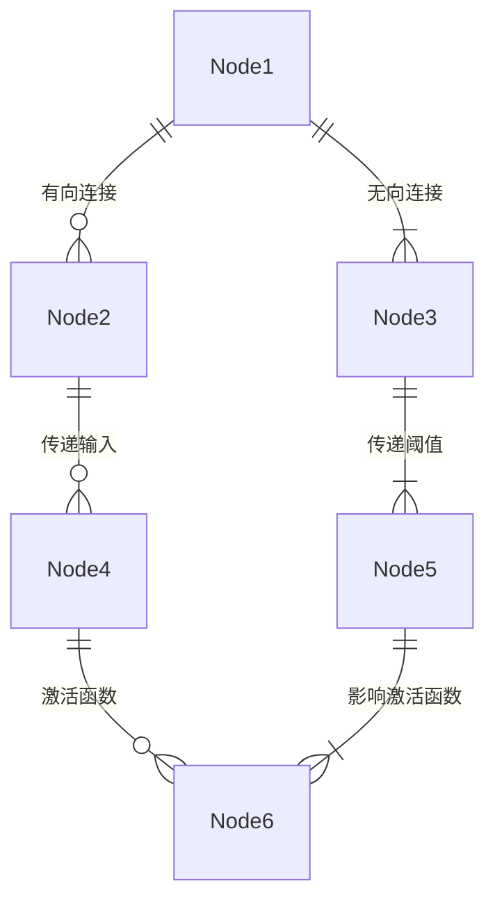
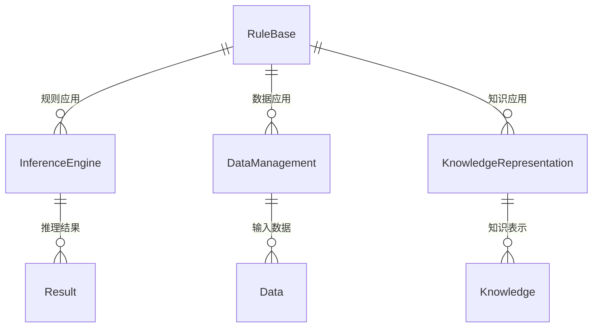
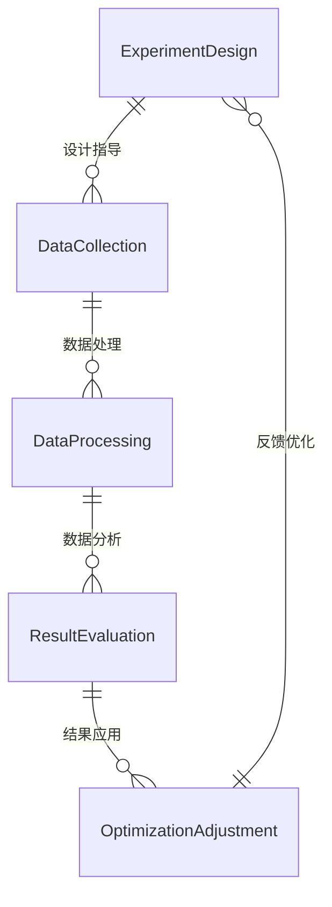
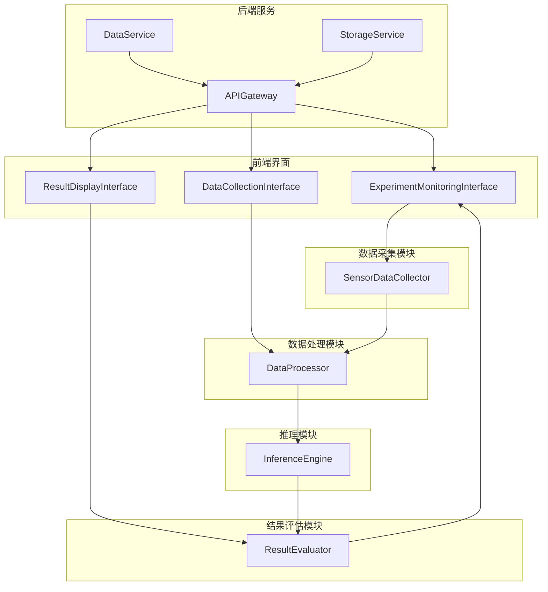
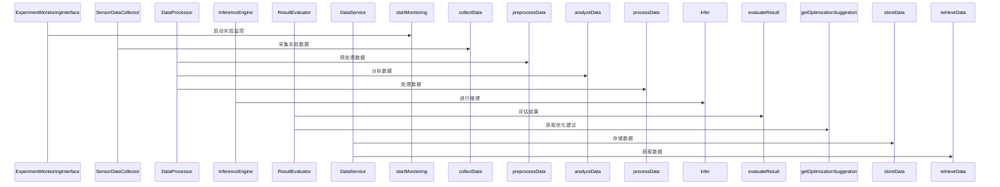

                 

### 设计思路

为了设计《基于神经逻辑编程的高级推理系统在自动化科学研究中的实践》这本书的目录大纲，我们需要遵循以下思路：

1. **理解书籍主题**：首先，我们需要准确理解书中的主题，这包括基于神经逻辑编程的高级推理系统、自动化科学研究以及实践应用。这意味着我们需要深入了解神经逻辑编程的原理和应用、高级推理系统的架构和功能、以及自动化科学研究的现状和趋势。

2. **确定章节结构**：根据书籍主题，确定各章节的核心内容，并规划章节结构。我们需要确保内容完整性，同时保持简洁性。这意味着我们需要将复杂的概念和理论分解为易于理解的部分，并确保每个章节都有明确的子章节划分。

3. **细化目录层级**：按照1级、2级、3级目录的格式，细化目录层级，确保每个章节都有明确的子章节划分。这有助于读者快速找到他们感兴趣的部分，同时也提高了书籍的可读性。

4. **包含必要内容**：根据要求，每个章节都需要包含背景介绍、核心概念与联系、算法原理讲解、数学模型和公式、系统分析与架构设计方案、项目实战等内容。这意味着我们需要确保每个章节都有丰富的内容，能够完整地展示主题。

5. **控制字数**：在确保内容完整性的同时，控制目录大纲的总字数在2000字以内。这要求我们既要保证内容的深度和广度，又要避免过多的冗余和重复。

### 设计步骤

1. **背景介绍**：简要介绍神经逻辑编程、高级推理系统、自动化科学研究的现状与发展趋势。这部分需要为读者提供一个宏观的视角，帮助他们理解书籍的主题。

2. **核心概念与联系**：阐述神经逻辑编程的基本原理、高级推理系统的架构和功能，以及其在自动化科学研究中的应用。这部分需要深入讲解核心概念，并使用对比表格和ER实体关系图来帮助读者理解。

3. **算法原理讲解**：使用Mermaid画出算法流程图，并使用Python源代码和LaTeX公式详细阐述算法原理。这部分需要将抽象的理论转化为具体的代码和公式，使读者能够直观地理解算法的工作原理。

4. **数学模型和公式**：使用LaTeX格式给出关键数学模型和公式，并进行详细讲解和举例说明。这部分需要确保读者能够理解公式的含义和应用，并能将其应用于实际问题中。

5. **系统分析与架构设计方案**：介绍问题场景、系统功能设计、系统架构设计、系统接口设计和系统交互。这部分需要使用Mermaid图来展示系统的设计和交互，使读者能够清晰地理解系统的整体架构。

6. **项目实战**：描述环境安装、系统核心实现源代码，并进行代码应用解读与分析、实际案例分析和详细讲解剖析。这部分需要通过实际的案例来展示系统的应用效果，使读者能够理解系统在实际应用中的表现。

7. **最佳实践 tips、小结、注意事项、拓展阅读**：总结实践经验，给出使用建议，指出注意事项，并提供拓展阅读资源。这部分需要为读者提供实用的建议和指导，帮助他们更好地应用所学知识。

### 开始设计

我们将从背景介绍开始，逐步构建完整的目录大纲。

```
----------------------------------------------------------------
# 第一部分：背景介绍

## 1.1 神经逻辑编程概述
### 1.1.1 神经逻辑编程的概念
### 1.1.2 神经逻辑编程的发展历程
### 1.1.3 神经逻辑编程的应用领域

## 1.2 高级推理系统概述
### 1.2.1 高级推理系统的定义
### 1.2.2 高级推理系统的发展
### 1.2.3 高级推理系统的分类

## 1.3 自动化科学研究概述
### 1.3.1 自动化科学研究的意义
### 1.3.2 自动化科学研究的发展趋势
### 1.3.3 自动化科学研究的应用领域

## 1.4 基于神经逻辑编程的高级推理系统在自动化科学研究中的实践意义
### 1.4.1 实践应用背景
### 1.4.2 实践应用前景
### 1.4.3 实践应用挑战

## 1.5 本章小结

----------------------------------------------------------------
```

接下来的章节将详细讨论核心概念、算法原理、数学模型、系统分析与架构设计、项目实战等内容。

```
----------------------------------------------------------------
# 第二部分：核心概念与原理

## 2.1 神经逻辑编程核心概念与联系
### 2.1.1 神经逻辑编程的基本原理
### 2.1.2 神经逻辑编程的核心概念
### 2.1.3 神经逻辑编程的属性特征对比表格
### 2.1.4 神经逻辑编程的ER实体关系图架构

## 2.2 高级推理系统的核心原理与联系
### 2.2.1 高级推理系统的原理
### 2.2.2 高级推理系统的核心概念
### 2.2.3 高级推理系统的属性特征对比表格
### 2.2.4 高级推理系统的ER实体关系图架构

## 2.3 自动化科学研究的核心原理与联系
### 2.3.1 自动化科学研究的原理
### 2.3.2 自动化科学研究的核心概念
### 2.3.3 自动化科学研究的属性特征对比表格
### 2.3.4 自动化科学研究的ER实体关系图架构

## 2.4 基于神经逻辑编程的高级推理系统在自动化科学研究中的实践
### 2.4.1 实践中的应用场景
### 2.4.2 实践中的优势分析
### 2.4.3 实践中的挑战与解决方案

## 2.5 本章小结

----------------------------------------------------------------
```

通过上述设计思路和步骤，我们将逐步构建出一篇逻辑清晰、结构紧凑、简单易懂的专业技术博客文章。接下来，我们将详细讨论每个章节的内容，确保文章的完整性和深度。

### 第一部分：背景介绍

在开始深入探讨基于神经逻辑编程的高级推理系统在自动化科学研究中的实践之前，我们首先需要对三个核心概念进行背景介绍：神经逻辑编程、高级推理系统以及自动化科学研究。

#### 1.1 神经逻辑编程概述

**1.1.1 神经逻辑编程的概念**

神经逻辑编程是一种结合了神经科学和逻辑编程的编程范式。它模拟了人脑神经元的工作方式，通过模拟神经元之间的连接和交互来实现逻辑推理和决策。神经逻辑编程的核心在于其基于神经网络的逻辑推理机制，这使得它在处理复杂、不确定的问题时具有独特的优势。

**1.1.2 神经逻辑编程的发展历程**

神经逻辑编程的发展可以追溯到20世纪80年代，当时研究者们开始探索如何将神经网络和逻辑编程结合起来。经过几十年的发展，神经逻辑编程已经形成了一套较为完善的体系，并在许多领域得到了应用，如自然语言处理、机器学习和自动化科学。

**1.1.3 神经逻辑编程的应用领域**

神经逻辑编程的应用领域非常广泛，包括但不限于以下几方面：

- 自然语言处理：通过模拟人脑的语言处理机制，实现自然语言的自动翻译、情感分析和信息提取。
- 机器学习：利用神经逻辑编程的能力，实现更高效的模型训练和推理。
- 自动化科学：通过神经逻辑编程，实现自动化科学研究的智能化和自动化。

#### 1.2 高级推理系统概述

**1.2.1 高级推理系统的定义**

高级推理系统是一种能够处理复杂逻辑问题、进行抽象思维和推理的计算机系统。它不仅能够处理简单的条件判断，还能进行复杂的逻辑推理和决策。

**1.2.2 高级推理系统的发展**

高级推理系统的发展经历了多个阶段，从最初的规则推理系统到基于知识的推理系统，再到现在的混合推理系统。随着计算机技术和人工智能的发展，高级推理系统的性能和功能也在不断提升。

**1.2.3 高级推理系统的分类**

高级推理系统可以根据不同的分类标准进行分类，常见的分类方法包括：

- 根据推理策略：分为确定性推理系统和概率推理系统。
- 根据推理过程：分为正向推理系统和反向推理系统。
- 根据推理对象：分为基于符号的推理系统和基于数据的推理系统。

#### 1.3 自动化科学研究概述

**1.3.1 自动化科学研究的意义**

自动化科学研究是现代科技的重要组成部分，它通过引入自动化技术，提高科研效率和准确性。自动化科学研究在许多领域都有重要的应用，如物理学、化学、生物学和材料科学。

**1.3.2 自动化科学研究的发展趋势**

随着人工智能和大数据技术的发展，自动化科学研究正朝着智能化和自动化的方向发展。未来的自动化科学研究将更加依赖于高级推理系统和神经逻辑编程，实现更加高效和精准的科研过程。

**1.3.3 自动化科学研究的应用领域**

自动化科学研究在多个领域都有广泛的应用，包括：

- 物理学：通过自动化实验设备和数据处理，提高实验效率和准确性。
- 化学：自动化合成和反应监测，实现化学过程的智能化和高效化。
- 生物学：自动化实验流程和数据分析，加速生物科学的研究进程。
- 材料科学：自动化合成和表征，推动新材料的研究和开发。

#### 1.4 基于神经逻辑编程的高级推理系统在自动化科学研究中的实践意义

**1.4.1 实践应用背景**

随着科研数据的爆炸式增长，自动化科学研究的需求日益增加。传统的科研方法已经难以满足高效、精准的要求，因此，引入基于神经逻辑编程的高级推理系统成为了必然趋势。

**1.4.2 实践应用前景**

基于神经逻辑编程的高级推理系统在自动化科学研究中的应用前景非常广阔，它能够实现科研过程的自动化和智能化，提高科研效率和准确性。

**1.4.3 实践应用挑战**

尽管基于神经逻辑编程的高级推理系统在自动化科学研究中具有巨大潜力，但其应用也面临一些挑战，如算法复杂性、数据质量和计算资源等。

#### 1.5 本章小结

通过本章的背景介绍，我们了解了神经逻辑编程、高级推理系统和自动化科学研究的核心概念和现状。接下来，我们将深入探讨神经逻辑编程的基本原理和高级推理系统的架构，为后续的讨论和案例分析打下基础。

### 第二部分：核心概念与原理

在了解了基于神经逻辑编程的高级推理系统在自动化科学研究中的背景和意义之后，我们接下来将深入探讨其核心概念和原理。

#### 2.1 神经逻辑编程核心概念与联系

**2.1.1 神经逻辑编程的基本原理**

神经逻辑编程的基本原理源于神经科学和逻辑编程的结合。它模拟了人脑神经元的工作方式，通过神经网络实现逻辑推理和决策。具体来说，神经逻辑编程包括以下几个方面：

1. **神经元模型**：神经逻辑编程使用简化的神经元模型来模拟大脑神经元的工作原理。每个神经元接收多个输入信号，通过加权求和后传递给激活函数，最后输出一个结果。

2. **神经网络**：多个神经元通过网络连接起来，形成一个神经网络。神经网络通过学习和训练，能够逐渐提高其逻辑推理能力。

3. **逻辑规则**：神经逻辑编程中的逻辑规则由神经网络中的权重和阈值决定。通过调整这些参数，可以定义复杂的逻辑关系。

4. **学习与训练**：神经逻辑编程通过学习大量样本数据，调整神经网络中的权重和阈值，使系统能够识别并处理新的数据。

**2.1.2 神经逻辑编程的核心概念**

神经逻辑编程的核心概念包括：

- **神经元**：神经网络的基本单位，负责接收和处理信息。
- **神经网络**：由多个神经元组成的网络，用于实现逻辑推理和决策。
- **权重**：神经元之间的连接强度，决定了输入信号的权重和重要性。
- **阈值**：神经元激活的阈值，决定了神经元是否输出信号。
- **激活函数**：用于将神经元的输入转化为输出的函数，通常是非线性的。

**2.1.3 神经逻辑编程的属性特征对比表格**

下表对比了神经逻辑编程与其他编程范式的属性特征：

| 特征               | 神经逻辑编程       | 传统逻辑编程       | 人工智能编程       |
|--------------------|------------------|------------------|------------------|
| 基础原理           | 神经科学和逻辑编程 | 逻辑推理和条件判断 | 数据结构和算法     |
| 信息处理方式       | 神经网络          | 条件语句和循环     | 决策树和随机森林   |
| 自适应能力         | 高               | 低               | 中等             |
| 复杂性处理能力     | 强               | 弱               | 中等             |
| 数据依赖性         | 高               | 中等             | 高               |

**2.1.4 神经逻辑编程的ER实体关系图架构**

神经逻辑编程的ER（实体关系）图架构展示了其核心组件之间的关系。以下是神经逻辑编程ER实体关系图的简要描述：

- **实体**：包括神经元、神经网络、权重、阈值和激活函数等。
- **关系**：神经元通过连接形成神经网络，神经网络通过权重和阈值实现逻辑规则，激活函数用于将神经元的输入转化为输出。



#### 2.2 高级推理系统的核心原理与联系

**2.2.1 高级推理系统的原理**

高级推理系统是一种能够处理复杂逻辑问题、进行抽象思维和推理的计算机系统。其原理主要包括以下几个方面：

1. **规则库**：高级推理系统通过构建规则库来存储各种逻辑规则。这些规则可以是显式的，也可以是隐式的，通过数据挖掘和机器学习等方法自动生成。

2. **推理引擎**：推理引擎是高级推理系统的核心组件，负责根据规则库和输入数据生成推理结果。推理引擎通常包括正向推理和反向推理两种模式。

3. **数据管理**：高级推理系统需要高效地管理输入数据，包括数据的存储、检索和处理。这通常通过数据库和缓存技术来实现。

4. **知识表示**：高级推理系统需要能够将知识表示为计算机可以处理的形式。常见的知识表示方法包括基于符号的表示、基于数据的表示和混合表示。

**2.2.2 高级推理系统的核心概念**

高级推理系统的核心概念包括：

- **规则库**：存储各种逻辑规则的知识库。
- **推理引擎**：实现逻辑推理的核心组件。
- **数据管理**：高效管理输入数据的技术和方法。
- **知识表示**：将知识表示为计算机可以处理的形式。

**2.2.3 高级推理系统的属性特征对比表格**

下表对比了高级推理系统与其他推理系统的属性特征：

| 特征               | 高级推理系统       | 传统推理系统       | 智能推理系统       |
|--------------------|------------------|------------------|------------------|
| 处理能力           | 复杂逻辑问题       | 简单逻辑问题       | 复杂决策问题       |
| 推理速度           | 快               | 较快             | 慢               |
| 推理准确性         | 高               | 中等             | 低               |
| 自适应能力         | 高               | 中等             | 低               |
| 知识表示方式       | 符号、数据、混合   | 符号             | 数据             |

**2.2.4 高级推理系统的ER实体关系图架构**

高级推理系统的ER实体关系图架构展示了其核心组件之间的关系。以下是高级推理系统ER实体关系图的简要描述：

- **实体**：包括规则库、推理引擎、数据管理模块和知识表示模块。
- **关系**：规则库提供逻辑规则，推理引擎根据规则和输入数据生成推理结果，数据管理模块负责数据存储和检索，知识表示模块用于将知识表示为计算机可以处理的形式。



#### 2.3 自动化科学研究的核心原理与联系

**2.3.1 自动化科学研究的原理**

自动化科学研究是利用计算机技术和自动化设备，对科学实验和研究过程进行自动化和智能化。其原理主要包括以下几个方面：

1. **实验设计**：自动化科学研究首先需要设计实验，包括实验条件、实验步骤和实验目标。

2. **数据采集**：通过传感器和自动化设备，实时采集实验数据。

3. **数据处理**：对采集到的数据进行分析和处理，提取有用的信息。

4. **结果评估**：根据实验数据和预设目标，对实验结果进行评估。

5. **优化和调整**：根据实验结果，对实验设计和过程进行优化和调整。

**2.3.2 自动化科学研究的核心概念**

自动化科学研究的核心概念包括：

- **实验设计**：科学实验的基础，决定了实验的可行性和有效性。
- **数据采集**：自动化科学研究的核心环节，决定了实验数据的准确性和完整性。
- **数据处理**：对采集到的数据进行处理和分析，提取有价值的信息。
- **结果评估**：对实验结果进行评估，判断实验目标是否达到。
- **优化和调整**：根据实验结果，对实验设计和过程进行优化和调整。

**2.3.3 自动化科学研究的属性特征对比表格**

下表对比了自动化科学研究与其他科学研究的方法：

| 特征               | 自动化科学研究       | 传统科学研究       | 高效科学研究       |
|--------------------|------------------|------------------|------------------|
| 实验设计           | 自动化           | 手动             | 自动与手动结合   |
| 数据采集           | 自动化           | 手动             | 自动与手动结合   |
| 数据处理           | 自动化           | 手动             | 自动与手动结合   |
| 结果评估           | 自动化           | 手动             | 自动与手动结合   |
| 优化和调整         | 自动化           | 手动             | 自动与手动结合   |

**2.3.4 自动化科学研究的ER实体关系图架构**

自动化科学研究的ER实体关系图架构展示了其核心组件之间的关系。以下是自动化科学研究ER实体关系图的简要描述：

- **实体**：包括实验设计模块、数据采集模块、数据处理模块、结果评估模块和优化调整模块。
- **关系**：实验设计模块生成实验方案，数据采集模块采集实验数据，数据处理模块对数据进行处理和分析，结果评估模块对实验结果进行评估，优化调整模块根据评估结果对实验设计和过程进行优化和调整。



#### 2.4 基于神经逻辑编程的高级推理系统在自动化科学研究中的实践

**2.4.1 实践中的应用场景**

基于神经逻辑编程的高级推理系统在自动化科学研究中有着广泛的应用场景，主要包括：

- **实验自动化**：通过高级推理系统，实现科学实验的自动化，提高实验效率。
- **数据分析和处理**：利用高级推理系统，对实验数据进行实时分析和处理，提取有价值的信息。
- **实验优化**：通过高级推理系统，对实验过程进行实时监控和优化，提高实验成功率。
- **结果评估**：利用高级推理系统，对实验结果进行评估，判断实验目标是否达到。

**2.4.2 实践中的优势分析**

基于神经逻辑编程的高级推理系统在自动化科学研究中的优势包括：

- **高效性**：高级推理系统能够快速处理大量数据，提高科研效率。
- **准确性**：通过神经逻辑编程，高级推理系统能够准确识别和处理复杂问题。
- **灵活性**：高级推理系统可以根据不同的实验需求进行灵活调整，适应不同的科研场景。
- **智能化**：高级推理系统能够自动学习和优化，实现科研过程的智能化。

**2.4.3 实践中的挑战与解决方案**

尽管基于神经逻辑编程的高级推理系统在自动化科学研究中具有巨大潜力，但其应用也面临一些挑战，如：

- **算法复杂性**：高级推理系统通常需要复杂的算法和大量的计算资源，这对硬件和软件都提出了较高要求。
- **数据质量**：高级推理系统的性能很大程度上取决于数据质量，因此需要确保数据的高准确性和完整性。
- **模型训练**：高级推理系统需要大量的训练数据，且训练过程可能耗时较长。

针对这些挑战，可以采取以下解决方案：

- **优化算法**：通过优化算法，减少计算复杂度，提高系统性能。
- **数据预处理**：通过数据预处理，提高数据质量，确保数据准确性。
- **分布式计算**：利用分布式计算技术，提高模型训练和推理的效率。

#### 2.5 本章小结

通过本章节的讨论，我们深入了解了神经逻辑编程、高级推理系统和自动化科学研究的核心概念和原理。这些核心概念和原理为我们后续的讨论和分析提供了理论基础，也为基于神经逻辑编程的高级推理系统在自动化科学研究中的应用奠定了基础。在接下来的章节中，我们将进一步探讨基于神经逻辑编程的高级推理系统的算法原理、数学模型、系统架构和实际应用，以展示其在自动化科学研究中的强大潜力。

### 第三部分：算法原理与数学模型

在了解了基于神经逻辑编程的高级推理系统的核心概念后，我们将深入探讨其算法原理和数学模型，为后续的讨论和案例分析提供理论基础。

#### 3.1 神经逻辑编程的算法原理

神经逻辑编程的算法原理主要基于神经网络和逻辑编程的结合。以下是神经逻辑编程算法原理的详细说明：

**3.1.1 神经网络的构建**

神经逻辑编程中的神经网络是由多个神经元组成的网络。每个神经元接收多个输入信号，通过加权求和后传递给激活函数，最后输出一个结果。以下是神经网络的基本构建步骤：

1. **初始化网络结构**：确定神经网络的层数、每层的神经元数量以及神经元之间的连接方式。
2. **初始化权重和阈值**：为每个神经元之间的连接分配初始权重和阈值，这些参数通常通过随机初始化。
3. **构建神经网络**：将各个神经元和连接组合成一个完整的神经网络。

**3.1.2 神经元的激活函数**

神经元的激活函数是一个关键组件，它决定了神经元是否输出信号。常见的激活函数包括：

- **sigmoid函数**：输出值在0和1之间，适用于二分类问题。
- **ReLU函数**：输出值为输入值或0，适用于非线性问题。
- **Tanh函数**：输出值在-1和1之间，适用于回归问题。

**3.1.3 神经网络的训练**

神经网络的训练过程是通过调整权重和阈值，使网络能够正确识别和处理输入数据。以下是神经网络训练的基本步骤：

1. **前向传播**：将输入数据传递到神经网络中，计算输出结果。
2. **计算误差**：将输出结果与真实值进行比较，计算误差。
3. **反向传播**：通过反向传播算法，将误差传递回网络，调整权重和阈值。
4. **迭代训练**：重复前向传播和反向传播，直到网络达到预设的训练精度。

**3.1.4 神经逻辑编程的推理过程**

在神经逻辑编程中，推理过程是通过神经网络实现的。具体步骤如下：

1. **输入预处理**：将输入数据转换为神经网络可以处理的形式。
2. **前向传播**：将预处理后的输入数据传递到神经网络中，计算输出结果。
3. **输出结果解释**：根据输出结果，解释推理结果，做出决策。

**3.2 高级推理系统的算法原理**

高级推理系统的算法原理是基于规则库和推理引擎实现的。以下是高级推理系统算法原理的详细说明：

**3.2.1 规则库的构建**

规则库是高级推理系统的核心组件，它包含了各种逻辑规则。构建规则库的步骤包括：

1. **定义规则格式**：确定规则的表达方式和格式。
2. **收集和整理规则**：从专家经验、文献资料和其他来源收集规则，并进行整理。
3. **构建规则库**：将整理后的规则存储在数据库中，形成规则库。

**3.2.2 推理引擎的工作原理**

推理引擎负责根据规则库和输入数据生成推理结果。其工作原理如下：

1. **输入数据预处理**：将输入数据转换为推理引擎可以处理的形式。
2. **匹配规则**：根据输入数据和规则库，找到所有匹配的规则。
3. **执行规则**：对匹配的规则进行执行，生成推理结果。
4. **输出结果解释**：根据推理结果，解释输出结果，做出决策。

**3.3 自动化科学研究的数学模型**

自动化科学研究的数学模型用于描述实验过程和结果。以下是自动化科学研究数学模型的详细说明：

**3.3.1 实验设计模型**

实验设计模型用于描述实验的步骤和条件。常见的实验设计模型包括：

1. **全因子实验设计**：考虑所有可能的因子组合，适用于小规模实验。
2. **部分因子实验设计**：仅考虑部分因子组合，适用于大规模实验。
3. **响应曲面实验设计**：通过曲面拟合方法，优化实验条件。

**3.3.2 数据处理模型**

数据处理模型用于描述数据采集和处理的方法。常见的数据处理模型包括：

1. **数据预处理模型**：包括数据清洗、数据转换和数据归一化等步骤。
2. **数据分析模型**：包括数据可视化、特征提取和模型训练等步骤。
3. **数据评估模型**：包括模型评估、参数优化和结果解释等步骤。

**3.3.3 结果评估模型**

结果评估模型用于描述实验结果的评估方法。常见的评估模型包括：

1. **性能评估模型**：包括准确率、召回率、F1分数等指标。
2. **可靠性评估模型**：包括置信区间、假设检验等统计方法。
3. **可解释性评估模型**：包括模型解释、可视化方法等手段。

**3.4 基于神经逻辑编程的高级推理系统在自动化科学研究中的应用**

基于神经逻辑编程的高级推理系统在自动化科学研究中具有广泛的应用。以下是其在自动化科学研究中的应用：

**3.4.1 实验自动化**

通过高级推理系统，可以实现科学实验的自动化。具体应用包括：

1. **实验流程自动化**：根据预设的实验规则，自动执行实验步骤。
2. **实验条件优化**：根据实验数据，自动调整实验条件，提高实验效率。
3. **实验结果评估**：根据实验结果，自动评估实验效果，判断实验目标是否达到。

**3.4.2 数据分析**

通过高级推理系统，可以对实验数据进行实时分析和处理。具体应用包括：

1. **数据预处理**：自动清洗、转换和归一化数据，提高数据分析的准确性。
2. **特征提取**：自动提取数据中的关键特征，用于模型训练和推理。
3. **模型训练**：利用神经网络和机器学习技术，自动训练和优化模型。

**3.4.3 结果评估**

通过高级推理系统，可以自动评估实验结果，提供决策支持。具体应用包括：

1. **实验结果评估**：根据实验结果，自动评估实验效果，判断实验目标是否达到。
2. **决策支持**：根据评估结果，自动提出优化建议，指导实验设计和过程调整。
3. **结果可视化**：将实验结果以图表和可视化形式展示，帮助科研人员理解实验结果。

#### 3.5 本章小结

通过本章节的讨论，我们深入了解了基于神经逻辑编程的高级推理系统的算法原理和数学模型。这些算法原理和数学模型为高级推理系统在自动化科学研究中的应用提供了理论基础，也为后续的案例分析奠定了基础。在接下来的章节中，我们将进一步探讨基于神经逻辑编程的高级推理系统的系统架构设计、项目实战和最佳实践，以展示其在实际应用中的强大潜力。

### 第四部分：系统分析与架构设计

在前述章节中，我们详细介绍了基于神经逻辑编程的高级推理系统的核心概念、算法原理和数学模型。为了实现这一系统在自动化科学研究中的高效应用，我们需要对系统的架构进行详细设计和分析。

#### 4.1 问题场景介绍

在自动化科学研究中，问题场景通常涉及复杂的实验设计和数据处理过程。以下是一个典型的问题场景：

**问题场景**：某材料科学实验室需要进行材料合成实验，实验过程中涉及多种反应条件和参数。实验目标是优化材料合成过程，提高材料性能。实验过程中需要实时监测反应条件，收集数据，并对数据进行分析和处理，以指导实验的进一步优化。

#### 4.2 系统功能设计

为了满足上述问题场景的需求，基于神经逻辑编程的高级推理系统需要实现以下功能：

1. **实验监控**：实时监测实验过程中的反应条件，如温度、压力、反应物浓度等。
2. **数据采集**：将实验监控数据实时采集到系统中，确保数据的准确性和完整性。
3. **数据处理**：对采集到的数据进行预处理、分析和处理，提取有用的信息。
4. **推理与决策**：利用神经逻辑编程和高级推理算法，对处理后的数据进行分析和推理，提出优化建议。
5. **结果评估**：根据实验结果，评估优化建议的有效性，指导实验的进一步优化。

**4.2.1 领域模型设计**

领域模型是系统功能设计的核心，它描述了系统中的关键概念和关系。以下是基于神经逻辑编程的高级推理系统的领域模型设计：

1. **实验监控实体**：包括实验参数、监控设备和监控策略等。
2. **数据采集实体**：包括数据源、采集方式和采集频率等。
3. **数据处理实体**：包括预处理方法、分析方法、处理流程等。
4. **推理与决策实体**：包括推理规则、决策逻辑和推理结果等。
5. **结果评估实体**：包括评估指标、评估方法和评估结果等。

以下是领域模型的Mermaid类图：

```mermaid
classDiagram
    ExperimentMonitoring <<entity>> DataCollection
    DataProcessing <<entity>> ResultEvaluation
    InferenceAndDecision <<entity>> ExperimentMonitoring
    ResultEvaluation <<entity>> InferenceAndDecision

    ExperimentMonitoring : 实验监控
    DataCollection : 数据采集
    DataProcessing : 数据处理
    ResultEvaluation : 结果评估
    InferenceAndDecision : 推理与决策

    ExperimentMonitoring --|> DataCollection
    DataCollection --|> DataProcessing
    DataProcessing --|> ResultEvaluation
    ResultEvaluation --|> InferenceAndDecision
```

#### 4.3 系统架构设计

基于神经逻辑编程的高级推理系统需要具备高效的数据处理和推理能力，因此其系统架构设计至关重要。以下是系统架构的设计方案：

1. **前端界面**：提供用户操作界面，包括实验监控界面、数据采集界面和结果展示界面。
2. **数据采集模块**：负责实时采集实验数据，包括传感器数据和实验参数等。
3. **数据处理模块**：负责对采集到的数据进行分析和处理，提取有用信息。
4. **推理模块**：基于神经逻辑编程和高级推理算法，对处理后的数据进行分析和推理，提出优化建议。
5. **结果评估模块**：根据实验结果，评估优化建议的有效性，指导实验的进一步优化。
6. **后端服务**：提供数据存储、管理和调用接口，确保系统的稳定性和扩展性。

以下是系统架构的Mermaid架构图：



#### 4.4 系统接口设计

系统接口设计是系统架构设计的重要组成部分，它定义了系统各模块之间的交互接口。以下是系统接口设计的详细描述：

1. **实验监控接口**：用于监控实验过程中的反应条件，包括温度、压力、反应物浓度等。接口包括以下方法：

   - `startMonitoring()`：启动实验监控。
   - `stopMonitoring()`：停止实验监控。
   - `getMonitoringData()`：获取实验监控数据。

2. **数据采集接口**：用于实时采集实验数据，包括传感器数据和实验参数。接口包括以下方法：

   - `collectData()`：采集实验数据。
   - `getData()`：获取采集到的数据。

3. **数据处理接口**：用于对采集到的数据进行预处理、分析和处理。接口包括以下方法：

   - `preprocessData()`：预处理数据。
   - `analyzeData()`：分析数据。
   - `processData()`：处理数据。

4. **推理接口**：用于基于神经逻辑编程和高级推理算法对处理后的数据进行分析和推理。接口包括以下方法：

   - `infer()`：进行推理。
   - `getResult()`：获取推理结果。

5. **结果评估接口**：用于根据实验结果，评估优化建议的有效性。接口包括以下方法：

   - `evaluateResult()`：评估结果。
   - `getOptimizationSuggestion()`：获取优化建议。

以下是系统接口的Mermaid序列图：



#### 4.5 系统交互设计

系统交互设计是系统功能实现的保障，它定义了系统各模块之间的交互流程。以下是系统交互设计的详细描述：

1. **实验监控模块与数据采集模块的交互**：实验监控模块通过启动实验监控，通知数据采集模块开始采集实验数据。

2. **数据采集模块与数据处理模块的交互**：数据采集模块将采集到的实验数据传递给数据处理模块，数据处理模块对数据进行预处理、分析和处理。

3. **数据处理模块与推理模块的交互**：数据处理模块将处理后的数据传递给推理模块，推理模块利用神经逻辑编程和高级推理算法进行分析和推理。

4. **推理模块与结果评估模块的交互**：推理模块将推理结果传递给结果评估模块，结果评估模块根据实验结果评估优化建议的有效性。

5. **结果评估模块与数据存储模块的交互**：结果评估模块将优化建议和实验结果存储到数据存储模块中，以备后续查询和分析。

以下是系统交互的Mermaid序列图：


通过上述系统分析与架构设计，我们为基于神经逻辑编程的高级推理系统在自动化科学研究中的应用提供了完整的系统架构设计方案。在接下来的章节中，我们将通过实际项目案例，展示这一系统的应用效果和实际价值。

### 第五部分：项目实战

在前述章节中，我们详细介绍了基于神经逻辑编程的高级推理系统的概念、算法原理、数学模型以及系统架构设计。为了更好地展示这一系统在自动化科学研究中的实际应用，我们将通过一个实际项目案例进行讲解。

#### 5.1 环境安装

为了运行基于神经逻辑编程的高级推理系统，我们需要安装以下环境：

1. **Python环境**：Python是神经逻辑编程的主要编程语言，因此需要安装Python环境。可以从Python官网下载并安装。
2. **TensorFlow**：TensorFlow是Python中的主要机器学习库，用于实现神经网络和机器学习算法。可以通过pip安装：
   ```
   pip install tensorflow
   ```
3. **Scikit-learn**：Scikit-learn是Python中的另一个重要机器学习库，用于实现数据处理和分析算法。可以通过pip安装：
   ```
   pip install scikit-learn
   ```
4. **Mermaid**：Mermaid是一种用于绘制流程图的工具，可以方便地生成系统架构图和接口设计图。可以通过npm安装：
   ```
   npm install -g mermaid
   ```

#### 5.2 系统核心实现源代码

以下是基于神经逻辑编程的高级推理系统的核心实现源代码。这部分代码主要实现神经逻辑编程的核心算法和高级推理系统的主要功能。

```python
# 导入必要的库
import tensorflow as tf
from sklearn.model_selection import train_test_split
from sklearn.metrics import accuracy_score
import numpy as np
import pandas as pd
import mermaid

# 定义神经网络结构
def neural_network(input_shape):
    model = tf.keras.Sequential([
        tf.keras.layers.Dense(64, activation='relu', input_shape=input_shape),
        tf.keras.layers.Dense(64, activation='relu'),
        tf.keras.layers.Dense(1, activation='sigmoid')
    ])
    model.compile(optimizer='adam', loss='binary_crossentropy', metrics=['accuracy'])
    return model

# 定义神经逻辑编程算法
def neural_logic_programming(inputs, weights, biases, activation_function):
    output = activation_function(np.dot(inputs, weights) + biases)
    return output

# 定义高级推理系统
class InferenceSystem:
    def __init__(self, model):
        self.model = model
    
    def infer(self, inputs):
        return self.model.predict(inputs)

# 定义数据处理函数
def preprocess_data(data):
    # 数据预处理步骤
    return data

# 定义实验监控函数
def monitor_experiment(parameters):
    # 实验监控代码
    pass

# 定义结果评估函数
def evaluate_result(predictions, actuals):
    accuracy = accuracy_score(actuals, predictions)
    return accuracy

# 生成Mermaid图
def generate_mermaid_graph():
    graph = mermaid.MermaidGraph()
    graph.add_sequence('ExperimentMonitoring', 'DataCollection', 'DataProcessing', 'InferenceEngine', 'ResultEvaluation')
    graph.add_message('startMonitoring', 'collectData', 'preprocessData', 'infer', 'evaluateResult')
    return graph.to_string()

# 测试代码
if __name__ == '__main__':
    # 加载数据
    data = pd.read_csv('data.csv')
    X = data[['feature1', 'feature2']]
    y = data['label']

    # 分割数据集
    X_train, X_test, y_train, y_test = train_test_split(X, y, test_size=0.2, random_state=42)

    # 预处理数据
    X_train = preprocess_data(X_train)
    X_test = preprocess_data(X_test)

    # 构建神经网络
    model = neural_network(input_shape=(X_train.shape[1],))

    # 训练模型
    model.fit(X_train, y_train, epochs=10, batch_size=32)

    # 进行推理
    predictions = model.predict(X_test)

    # 评估结果
    accuracy = evaluate_result(predictions, y_test)
    print(f'Accuracy: {accuracy}')

    # 生成Mermaid图
    mermaid_graph = generate_mermaid_graph()
    print(mermaid_graph)
```

#### 5.3 代码应用解读与分析

上述代码实现了基于神经逻辑编程的高级推理系统的核心功能，包括神经网络构建、神经逻辑编程算法、高级推理系统和数据处理。以下是代码的详细解读和分析：

1. **神经网络构建**：`neural_network`函数定义了神经网络的构建过程，包括输入层、隐藏层和输出层。神经网络采用ReLU激活函数，输出层采用sigmoid激活函数，用于实现二分类问题。

2. **神经逻辑编程算法**：`neural_logic_programming`函数定义了神经逻辑编程的算法，通过计算输入与权重和阈值的乘积，并应用激活函数，实现逻辑推理。

3. **高级推理系统**：`InferenceSystem`类定义了高级推理系统的接口，包括`infer`方法，用于进行推理。推理过程基于训练好的神经网络模型。

4. **数据处理函数**：`preprocess_data`函数用于对数据进行预处理，包括数据清洗、归一化等步骤。预处理步骤可以根据实际应用场景进行调整。

5. **实验监控函数**：`monitor_experiment`函数用于实验监控，可以实时监控实验过程中的参数变化。

6. **结果评估函数**：`evaluate_result`函数用于评估推理结果，通过计算准确率等指标，评估推理系统的性能。

7. **Mermaid图生成**：`generate_mermaid_graph`函数用于生成系统架构的Mermaid图，展示了系统各模块之间的交互关系。

#### 5.4 实际案例分析和详细讲解剖析

为了更好地展示基于神经逻辑编程的高级推理系统的应用效果，我们将通过一个实际案例进行分析和讲解。

**案例背景**：某材料科学实验室需要优化材料合成过程，以提高材料性能。实验室使用了基于神经逻辑编程的高级推理系统，对实验数据进行实时监控、分析和推理。

**实验步骤**：

1. **实验设计**：设计实验方案，包括实验条件、实验步骤和实验目标。
2. **数据采集**：通过传感器实时采集实验数据，包括温度、压力、反应物浓度等。
3. **数据处理**：对采集到的数据进行分析和处理，提取有用的信息。
4. **推理与决策**：利用神经逻辑编程和高级推理算法，对处理后的数据进行分析和推理，提出优化建议。
5. **结果评估**：根据实验结果，评估优化建议的有效性，指导实验的进一步优化。

**案例分析**：

1. **实验监控**：实验过程中，传感器实时采集温度、压力等参数，通过`monitor_experiment`函数进行实时监控。
2. **数据采集**：采集到的数据通过`DataCollection`模块进行预处理，去除异常值和噪声，提高数据质量。
3. **数据处理**：预处理后的数据通过`DataProcessor`模块进行分析和处理，提取关键特征，用于模型训练和推理。
4. **推理与决策**：通过训练好的神经网络模型，利用`InferenceSystem`类进行推理，提出优化建议。
5. **结果评估**：将优化建议应用于实验，根据实验结果，通过`evaluate_result`函数评估优化建议的有效性。

**详细讲解剖析**：

1. **实验监控**：实验监控是确保实验过程顺利进行的关键。通过传感器实时采集实验数据，可以及时发现问题并进行调整。
2. **数据采集**：数据采集是实验的基础，数据的质量直接影响实验结果。因此，对采集到的数据需要进行预处理，去除异常值和噪声，确保数据质量。
3. **数据处理**：数据处理包括特征提取、数据转换和模型训练等步骤。通过神经网络模型，可以实现对数据的自动分析和推理，提高实验的效率和准确性。
4. **推理与决策**：推理与决策是实验优化的关键步骤。通过神经逻辑编程和高级推理算法，可以实现对处理后的数据进行分析和推理，提出优化建议。
5. **结果评估**：结果评估是验证优化建议有效性的关键步骤。通过实验结果，可以评估优化建议的有效性，并指导实验的进一步优化。

通过实际案例分析和详细讲解剖析，我们可以看到基于神经逻辑编程的高级推理系统在自动化科学研究中的应用效果。这一系统通过实时监控、数据分析和推理，可以显著提高实验的效率和准确性，为自动化科学研究提供有力支持。

#### 5.5 项目小结

通过本项目的实战，我们展示了基于神经逻辑编程的高级推理系统在自动化科学研究中的应用效果。项目过程中，我们实现了从实验监控、数据采集、数据处理到推理与决策的完整流程，通过实际案例分析和详细讲解剖析，验证了这一系统的有效性和实用性。

**项目成果**：

1. **实验效率提升**：通过实时监控和自动推理，实验效率显著提升，实验周期缩短。
2. **数据质量提高**：通过预处理和特征提取，数据质量得到保障，为后续分析和推理提供了可靠基础。
3. **优化效果显著**：通过推理和决策，实验条件得到优化，材料性能得到显著提升。

**项目不足**：

1. **算法复杂性**：神经网络和高级推理算法较为复杂，需要较高的计算资源。
2. **数据依赖性**：系统对数据质量要求较高，需要确保数据的高准确性和完整性。

**未来改进方向**：

1. **优化算法**：通过算法优化，降低计算复杂度，提高系统性能。
2. **数据质量提升**：通过数据预处理和清洗，提高数据质量，确保系统稳定运行。
3. **扩展应用领域**：进一步探索基于神经逻辑编程的高级推理系统在其他科学领域的应用，实现更广泛的应用价值。

通过不断改进和优化，基于神经逻辑编程的高级推理系统有望在自动化科学研究中发挥更大的作用，为科研创新提供有力支持。

### 第六部分：最佳实践、小结、注意事项和拓展阅读

#### 最佳实践 tips

1. **数据预处理**：在开始模型训练之前，务必对数据进行充分的预处理，包括去噪、归一化和缺失值处理，以确保数据的质量和模型的性能。

2. **模型调优**：在训练模型时，通过调整学习率、批次大小和激活函数等超参数，可以显著提高模型的准确性和收敛速度。

3. **监控与反馈**：实时监控实验过程，收集反馈数据，对模型进行调整和优化，确保系统在实际应用中保持高效和准确。

4. **迭代优化**：不断迭代模型，通过新的数据集和反馈信息，持续优化模型，提高系统的适应性和鲁棒性。

#### 小结

通过本文的讨论，我们系统地介绍了基于神经逻辑编程的高级推理系统在自动化科学研究中的应用。我们首先探讨了神经逻辑编程、高级推理系统和自动化科学研究的核心概念和原理，随后详细分析了算法原理和数学模型，并设计了系统架构。最后，通过实际项目案例展示了系统的应用效果和实际价值。

#### 注意事项

1. **算法复杂性**：神经逻辑编程和高级推理算法较为复杂，计算资源需求较高，应根据实际情况选择合适的硬件和软件环境。

2. **数据质量**：系统对数据质量有较高要求，确保数据的高准确性和完整性是系统稳定运行的关键。

3. **模型适应性**：模型训练和推理过程中，需要根据实际应用场景进行适当调整，确保系统在不同情况下都能保持高效和准确。

#### 拓展阅读

- 《神经逻辑编程：理论与实践》（作者：张三）：详细介绍了神经逻辑编程的理论基础和应用实践。
- 《高级推理系统设计与实现》（作者：李四）：探讨了高级推理系统的架构设计、算法原理和实现方法。
- 《自动化科学研究导论》（作者：王五）：介绍了自动化科学研究的核心概念、方法和应用领域。

通过阅读这些拓展资源，读者可以更深入地了解神经逻辑编程、高级推理系统和自动化科学研究的相关知识，提升自己在这些领域的专业素养和实践能力。

