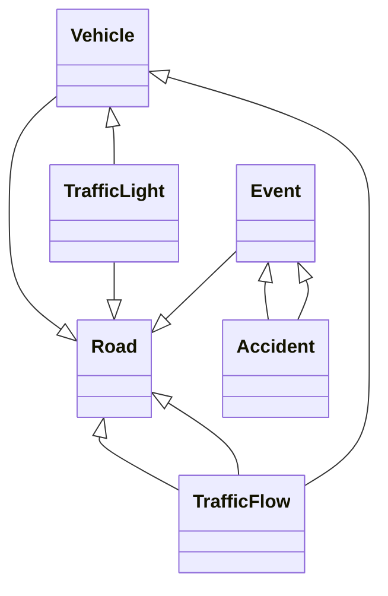
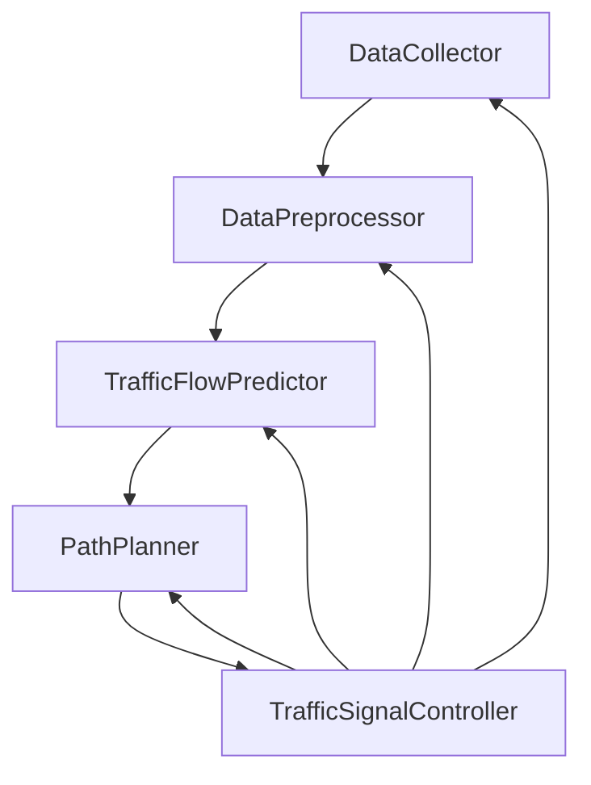
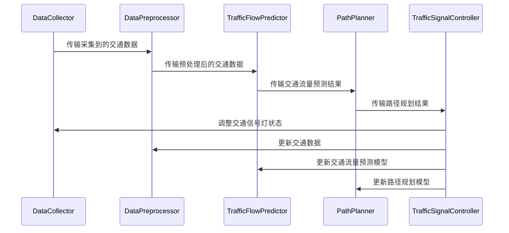

                 

### 让我们一步步思考

基于程序合成的算法推理与优化能力增强是一个复杂但极具前景的研究领域。为了更好地理解和探讨这一主题，我们将按照以下步骤进行：

1. **定义与背景介绍**
   - **核心概念与联系**
   - **问题描述与解决方案**
   - **边界与外延**

2. **算法推理原理与流程**
   - **基本原理**
   - **流程与步骤**
   - **具体实现**

3. **程序合成技术介绍**
   - **概述与分类**
   - **技术特点与优缺点**

4. **算法推理与程序合成的结合**
   - **必要性**
   - **结合方法与挑战**

5. **优化能力增强的方法与技术**
   - **定义与度量**
   - **优化策略与案例**

6. **实际应用案例**
   - **背景与目标**
   - **案例分析**
   - **项目小结**

通过这些步骤，我们将逐步深入理解这一领域的核心概念、技术方法与应用实践，为后续的具体内容打下坚实的基础。

#### 1.1 问题背景与定义

##### 1.1.1 程序合成的兴起

程序合成（Program Synthesis）是人工智能领域的一个前沿研究方向，旨在通过自动化的方式生成程序代码。随着软件系统的复杂度不断增加，手动编写和维护代码变得越来越困难。程序合成应运而生，它的目标是利用算法和机器学习技术，从输入数据或部分代码片段自动生成完整的程序。

程序合成的概念最早可以追溯到20世纪60年代，当时研究者们开始探讨如何通过形式化的方式从输入条件自动生成程序。然而，随着计算机科学的进步，程序合成逐渐发展成为涵盖多种方法和技术的独立研究领域。近年来，得益于深度学习和生成对抗网络（GANs）等新兴技术的应用，程序合成取得了显著的进展。

程序合成在许多领域都有广泛的应用。例如，在自动化测试中，程序合成可以自动生成测试用例来检测软件系统的缺陷；在嵌入式系统设计中，程序合成可以帮助生成满足特定性能和功耗要求的代码；在自然语言处理领域，程序合成可以自动生成自然语言文本，如机器翻译和文本生成。

##### 1.1.2 算法推理的需求

算法推理（Algorithm Reasoning）是人工智能中的一个关键概念，它指的是通过逻辑推理或数学模型来分析算法的行为和性能。随着数据量的爆炸性增长和算法复杂度的提升，算法推理变得尤为重要。算法推理不仅可以帮助我们理解现有算法的内在机制，还能指导新的算法设计和优化。

在现实世界中，算法推理的应用场景广泛。例如，在金融领域，算法推理可以用于风险评估和投资策略的制定；在医疗领域，算法推理可以帮助诊断疾病和优化治疗方案；在交通领域，算法推理可以用于交通流量预测和路线规划。

然而，随着算法的复杂度增加，传统的人工分析方式变得难以应对。算法推理技术的需求因此日益增长，它不仅可以帮助我们更好地理解和优化现有算法，还能为新的算法发明提供理论基础。

##### 1.1.3 优化能力的重要性

优化能力（Optimization Ability）在算法设计和工程实践中起着至关重要的作用。优化能力指的是在给定约束条件下，通过调整算法参数或结构来提高算法的性能、效率和鲁棒性。

优化能力的重要性体现在以下几个方面：

1. **性能提升**：通过优化算法，可以提高处理大数据集的速度，减少计算时间，从而提升整个系统的性能。
2. **资源节约**：优化算法可以减少计算资源的需求，包括CPU、内存和能源消耗，这对于嵌入式系统和低资源环境尤为重要。
3. **鲁棒性增强**：优化后的算法在面临噪声数据和异常值时表现更稳定，从而提高了系统的鲁棒性。
4. **可扩展性**：优化能力有助于算法在更大规模的数据集上应用，提高其可扩展性。

总之，优化能力是提升算法整体表现的核心要素，对于算法设计的成功至关重要。随着程序合成和算法推理技术的发展，优化能力的研究和应用前景愈发广阔。

### 1.2 基本概念

在本节中，我们将详细介绍程序合成、算法推理和优化能力这三个核心概念，并探讨它们在计算机科学和人工智能领域的应用和特点。

#### 1.2.1 程序合成

**定义**：程序合成是一种自动化生成程序的方法，它通过利用算法、机器学习和形式化方法，从输入数据或部分代码片段自动生成完整的程序。程序合成的核心目标是减少软件开发的时间和成本，提高代码质量和可靠性。

**特点**：

1. **自动化**：程序合成可以通过自动化的方式生成代码，减少了手动编码的工作量，提高了开发效率。
2. **灵活性**：程序合成可以根据不同的输入数据和需求，灵活生成满足特定要求的程序。
3. **高效性**：通过优化算法和模型，程序合成可以生成高效、优化的程序代码。

**应用领域**：

1. **自动化测试**：程序合成可以自动生成测试用例，检测软件系统的缺陷。
2. **代码生成**：程序合成可以用于自动生成代码框架和基础代码，加速软件开发过程。
3. **嵌入式系统**：在嵌入式系统设计中，程序合成可以帮助生成满足特定性能和功耗要求的代码。
4. **自然语言处理**：程序合成可以自动生成自然语言文本，如机器翻译和文本生成。

**示例**：

假设我们有一个输入数据集，包含一系列的数学运算。通过程序合成技术，我们可以自动生成一个程序，该程序能够根据输入数据集执行相应的数学运算，生成结果。这不仅减少了手动编写代码的工作量，还提高了代码的可维护性和可靠性。

#### 1.2.2 算法推理

**定义**：算法推理是指通过逻辑推理或数学模型来分析算法的行为和性能。它涉及对算法逻辑、数据结构和执行过程的深入理解，旨在优化算法设计和提高算法效率。

**特点**：

1. **逻辑性**：算法推理依赖于逻辑和数学模型，通过形式化的推理方式来分析算法。
2. **效率性**：算法推理可以帮助我们理解现有算法的内在机制，找出瓶颈和改进空间，从而提高算法的效率。
3. **灵活性**：算法推理可以根据不同的应用场景和需求，灵活地调整和优化算法。

**应用领域**：

1. **算法优化**：算法推理可以帮助我们优化现有算法，提高其性能和效率。
2. **算法发明**：通过算法推理，可以启发新的算法思想和设计，促进算法的创新。
3. **性能分析**：算法推理可以用于分析算法在不同数据集和场景下的性能表现，为算法改进提供依据。
4. **安全分析**：算法推理可以帮助我们识别和防范潜在的安全漏洞，提高算法的鲁棒性。

**示例**：

例如，在排序算法中，算法推理可以分析不同排序算法的复杂度和性能表现，找出最优的排序算法。通过算法推理，我们可以更好地理解算法的运行机制，从而在实际应用中进行优化和改进。

#### 1.2.3 优化能力

**定义**：优化能力是指在给定约束条件下，通过调整算法参数或结构来提高算法的性能、效率和鲁棒性。优化能力是算法设计和工程实践中的一个核心要素，它涵盖了从算法层面、硬件层面到软硬件结合层面的多种优化策略。

**特点**：

1. **针对性**：优化能力是根据具体的应用场景和需求，有针对性地进行调整和优化。
2. **系统性**：优化能力涉及多个层面，包括算法、硬件和软硬件结合，需要综合考虑和协同优化。
3. **动态性**：优化能力是一个动态调整的过程，需要根据实际情况和需求变化不断优化。

**应用领域**：

1. **算法性能优化**：通过优化算法参数和结构，提高算法的处理速度和效率。
2. **硬件优化**：通过硬件加速技术和优化设计，提高计算性能和能效比。
3. **系统优化**：通过软硬件结合的优化策略，提升整个系统的性能和稳定性。
4. **能耗优化**：在嵌入式系统和低资源环境中，通过优化算法和硬件设计，降低能耗。

**示例**：

例如，在图像处理中，优化能力可以通过调整滤波器的参数和结构，提高图像处理的速度和效果。在嵌入式系统中，优化能力可以通过硬件加速和代码优化，降低能耗和延长设备寿命。

### 总结

程序合成、算法推理和优化能力是计算机科学和人工智能领域中的三个核心概念，它们相辅相成，共同推动算法设计和应用的进步。通过程序合成，我们可以自动化生成高效可靠的代码；通过算法推理，我们可以深入理解算法的内在机制并进行优化；通过优化能力，我们可以提高算法的性能和效率。这三个概念的结合，为解决复杂计算问题提供了强有力的技术支持。

在接下来的章节中，我们将进一步探讨程序合成、算法推理和优化能力的具体实现和应用，帮助读者更深入地理解这一领域的核心技术。

#### 1.2.1.1 程序合成的定义

程序合成（Program Synthesis）是指利用算法和机器学习技术，从输入数据或部分代码片段自动生成完整的程序代码的过程。这一概念涉及将人类提供的部分指导或规则与自动化算法相结合，从而实现代码的自动生成。

定义中的几个关键要素：

1. **输入数据或部分代码**：程序合成的输入可以是数据集、部分代码片段、用户需求描述等。这些输入为生成程序提供了基础。
2. **算法和机器学习技术**：程序合成依赖于多种算法和技术，包括模式识别、自动编码器、深度学习和生成对抗网络（GANs）等。这些技术用于分析和处理输入数据，生成合适的程序代码。
3. **自动生成程序代码**：程序合成的核心目标是自动生成完整的程序代码，而不是简单地执行某个任务。这意味着生成的代码不仅要满足功能需求，还要具备可读性和可维护性。

程序合成的核心目标是减少软件开发的时间和成本，提高代码质量和可靠性。通过程序合成，开发者可以专注于更高层次的架构设计和创新，而将繁琐的编码任务交给自动化工具。

#### 1.2.1.2 程序合成的特点

程序合成具有以下几个显著特点，这些特点使其在多个领域中具有广泛的应用前景：

1. **自动化**：程序合成通过自动化手段生成程序代码，减少了手动编码的工作量和时间成本。开发者只需提供部分指导或规则，系统就能自动生成完整的代码，从而大大提高了开发效率。

2. **灵活性**：程序合成可以根据不同的输入数据和需求，灵活地生成满足特定要求的程序。这种灵活性使得程序合成能够适应多种应用场景，从简单的代码片段到复杂的软件系统。

3. **高效性**：利用算法和机器学习技术，程序合成能够生成高效、优化的程序代码。通过自动化的优化过程，程序合成生成的代码在性能和效率上往往优于手动编写的代码。

4. **可维护性**：程序合成生成的代码通常具有高可读性和可维护性。生成的代码遵循一致的命名规范和编码风格，这使得后续的维护和升级变得更加容易。

5. **可扩展性**：程序合成能够处理大量数据和复杂的任务，具有很强的可扩展性。无论是处理大数据集还是支持新的功能需求，程序合成都能够快速适应并生成相应的代码。

#### 1.2.1.3 程序合成的应用领域

程序合成在多个领域展示了其独特的价值和广泛应用前景：

1. **自动化测试**：在软件测试过程中，程序合成可以自动生成大量的测试用例，检测软件系统的缺陷。这不仅提高了测试效率，还降低了测试成本。

2. **代码生成**：程序合成可以用于生成代码框架和基础代码，加速软件开发过程。特别是在大型项目中，程序合成可以帮助开发者快速构建原型和框架，节省时间。

3. **嵌入式系统**：在嵌入式系统设计中，程序合成可以帮助生成满足特定性能和功耗要求的代码。这对于资源有限的嵌入式设备尤为重要。

4. **自然语言处理**：在自然语言处理领域，程序合成可以自动生成自然语言文本，如机器翻译和文本生成。通过程序合成，可以生成高质量的自然语言文本，提高人工智能系统的交互能力。

5. **图像处理**：在图像处理领域，程序合成可以自动生成图像处理算法，优化图像处理效果。通过程序合成，可以实现更高效、更精准的图像处理。

6. **游戏开发**：在游戏开发中，程序合成可以自动生成游戏脚本和逻辑代码，加速游戏开发过程，提高游戏质量。

总的来说，程序合成通过其自动化、灵活性和高效性，在多个领域中展现出强大的应用潜力。随着技术的不断进步，程序合成将在更多领域得到广泛应用，为软件开发和人工智能发展提供更强有力的支持。

#### 1.2.2.1 算法推理的定义

算法推理（Algorithm Reasoning）是人工智能领域中一个重要的研究方向，它涉及使用逻辑推理、数学模型和计算方法来分析和解释算法的行为和性能。算法推理旨在通过深入理解算法的内部机制，发现其优点和不足，从而指导算法的改进和优化。

定义中的几个关键要素：

1. **逻辑推理**：算法推理依赖于逻辑推理方法，通过逻辑规则和推理过程来分析算法的逻辑结构和决策过程。
2. **数学模型**：算法推理使用数学模型来描述算法的性能、效率和鲁棒性，通过数学公式和计算方法来分析和验证算法的有效性。
3. **计算方法**：算法推理涉及到多种计算方法，包括形式化验证、模拟和实验，通过这些方法来验证算法的正确性和性能。

算法推理的目标是通过对算法的深入分析，提高算法的效率、稳定性和鲁棒性，同时发现潜在的问题和改进空间。算法推理在算法设计、性能优化和安全性分析中发挥着重要作用。

#### 1.2.2.2 算法推理的基本原理

算法推理的基本原理包括知识表示、知识推理和知识应用三个核心部分。通过这三个步骤，算法推理能够对算法的行为和性能进行深入分析和解释。

1. **知识表示**：知识表示是算法推理的基础，它涉及将算法的结构、逻辑和性能指标转化为计算机可以理解和处理的形式。常见的知识表示方法包括形式逻辑、语义网络、数学模型和决策树等。通过知识表示，算法的内部结构和行为可以被形式化地描述，为后续的推理提供基础。

2. **知识推理**：知识推理是指使用逻辑推理和计算方法来分析算法的推理过程和结果。知识推理可以分为确定性推理和不确定性推理两种类型。确定性推理主要基于逻辑规则和数学模型，通过演绎推理来验证算法的正确性和性能。不确定性推理则处理算法在不确定环境中的行为，通过概率模型和模糊逻辑等方法来分析算法的鲁棒性和适应性。

3. **知识应用**：知识应用是将推理结果应用于实际问题和算法优化。通过知识应用，算法推理能够为算法的改进和优化提供指导。知识应用可以包括算法性能分析、错误诊断和改进建议等。通过应用推理结果，开发者可以优化算法的参数和结构，提高算法的效率和鲁棒性。

#### 1.2.2.3 算法推理的应用场景

算法推理在多个应用场景中具有广泛的应用，下面列举几个典型的应用场景：

1. **算法性能优化**：在算法性能优化中，算法推理可以通过分析算法的时间复杂度、空间复杂度和资源消耗，找出优化机会。通过算法推理，开发者可以调整算法参数和结构，提高算法的效率。

2. **算法发明**：在算法发明中，算法推理可以帮助研究者探索新的算法思路和设计。通过分析现有算法的优缺点，算法推理可以启发新的算法思想和优化方法。

3. **算法安全性分析**：在算法安全性分析中，算法推理可以识别和防范潜在的安全漏洞。通过分析算法的逻辑和行为，算法推理可以检测出可能的攻击路径和弱点，为算法安全提供保障。

4. **嵌入式系统设计**：在嵌入式系统设计中，算法推理可以帮助开发者优化算法的性能和资源消耗。通过算法推理，可以确保嵌入式系统在有限的资源条件下高效运行。

5. **机器学习算法优化**：在机器学习算法中，算法推理可以帮助研究者分析模型的性能、收敛速度和过拟合风险。通过算法推理，可以优化模型的参数和结构，提高学习效率和预测准确性。

6. **自动驾驶系统**：在自动驾驶系统中，算法推理可以分析感知、规划和控制算法的行为和性能。通过算法推理，可以优化算法的决策过程，提高系统的安全性和可靠性。

总的来说，算法推理在多个领域展示了其强大的应用潜力。通过深入分析和解释算法的行为，算法推理不仅能够提高算法的性能和效率，还能帮助研究者探索新的算法思想和优化方法。随着算法推理技术的不断发展，其在各个领域的应用将会更加广泛和深入。

### 1.2.3.1 优化能力的定义

优化能力（Optimization Ability）是指在一个给定的约束条件下，通过调整算法参数、结构或使用特定技术，以提高算法性能、效率和鲁棒性的一种能力。优化能力是算法设计和工程实践中不可或缺的一部分，它涵盖了从算法层面、硬件层面到软硬件结合层面的多种优化策略。

定义中的几个关键要素：

1. **约束条件**：优化能力需要在一定的约束条件下进行，这些约束条件可以是资源限制（如CPU使用率、内存占用等）、时间限制或特定性能要求。
2. **算法参数调整**：通过调整算法中的参数，如阈值、学习率、迭代次数等，可以提高算法的性能和适应性。
3. **结构优化**：通过重新设计算法的结构，如改进数据结构、优化算法流程等，可以提高算法的效率和鲁棒性。
4. **技术手段**：优化能力还涉及使用各种技术手段，如硬件加速、并行计算、分布式计算等，来提升算法的运行效率和性能。

优化能力的核心目标是提升算法的整体性能，使其在不同应用场景下都能保持高效、稳定和可靠的运行。通过优化能力，开发者可以更好地应对复杂计算任务，提高系统的响应速度和处理能力。

### 1.2.3.2 优化能力的分类

优化能力在算法设计和工程实践中可以分为多个层次，主要包括以下几类：

1. **算法层面**：在算法层面进行优化，主要涉及调整算法的参数和结构，以提高算法的性能。常见的优化策略包括调整阈值、学习率、迭代次数等参数，以及改进数据结构、优化算法流程等。例如，在机器学习中，可以通过调整神经网络的结构和参数来提高模型的收敛速度和预测准确性。

2. **硬件层面**：在硬件层面进行优化，主要涉及使用特定硬件设备或技术来提升算法的运行效率。硬件优化可以通过硬件加速技术（如GPU、FPGA、ASIC等）来实现，也可以通过优化硬件设计（如降低功耗、提高计算速度等）来提升性能。例如，在图像处理中，使用GPU进行并行计算可以显著提高处理速度。

3. **软硬件结合层面**：在软硬件结合层面进行优化，涉及结合硬件和软件的特定优势，实现最优的性能和效率。软硬件结合的优化策略包括设计高效的硬件架构，以及优化算法与硬件的协同工作，以实现更高的计算性能和能效比。例如，在嵌入式系统中，通过优化算法和硬件设计，可以在有限的资源条件下实现高性能和低功耗。

每种优化层次都有其特定的应用场景和优势：

- **算法层面**的优化策略灵活、适用范围广，但优化效果可能有限，需要大量实验和调试。
- **硬件层面**的优化策略可以显著提高计算性能，但受限于硬件设备和成本。
- **软硬件结合层面**的优化策略可以实现最佳的性能和效率，但需要深入理解硬件和软件的相互关系，设计复杂。

通过合理选择和结合不同的优化策略，可以全面提升算法的性能和效率，满足各种复杂应用场景的需求。

### 1.2.3.3 优化能力对算法的影响

优化能力在算法设计和实现中扮演着至关重要的角色，它直接影响算法的性能、效率和鲁棒性。以下将从不同角度详细探讨优化能力对算法的多方面影响。

#### 1. 性能提升

优化能力的一个重要目标是通过调整算法参数和结构，提高算法的执行速度和处理能力。例如，在排序算法中，通过优化算法的内部循环和递归调用，可以显著减少算法的时间复杂度，从而提升排序速度。优化后的快速排序算法（QuickSort）和归并排序算法（Merge Sort）都展示了如何通过优化提升性能。

具体案例：快速排序（QuickSort）在平均情况下具有O(n log n)的时间复杂度，但在最坏情况下会退化到O(n^2)。通过优化选择分区元素的方式，可以有效避免最坏情况的发生，从而提高排序性能。

#### 2. 效率提高

优化能力不仅关注算法的执行时间，还涉及资源的有效利用。通过优化算法，可以减少内存占用、降低能耗和提高处理速度。例如，在图像处理算法中，通过优化数据结构和算法流程，可以减少内存访问次数和计算复杂度，从而提高处理效率。

具体案例：在图像压缩算法（如JPEG）中，通过优化量化步骤和离散余弦变换（DCT），可以减少图像数据的冗余信息，从而提高压缩效率。

#### 3. 鲁棒性增强

优化能力还可以提高算法的鲁棒性，使其在噪声数据、异常值和不确定环境下表现更稳定。通过优化算法，可以增强其对输入数据的敏感度，提高在复杂环境下的适应能力。例如，在机器学习算法中，通过调整正则化参数和优化优化算法，可以避免过拟合，提高模型的泛化能力。

具体案例：在支持向量机（SVM）中，通过调整惩罚参数C和核函数参数，可以优化模型的鲁棒性，使其在噪声数据和不同数据分布下表现更好。

#### 4. 扩展性提升

优化能力有助于提高算法的可扩展性，使其能够处理更大规模的数据集和更复杂的任务。通过优化算法，可以降低算法的依赖性和耦合度，提高其模块化和可复用性。例如，在分布式计算中，通过优化数据分片和通信策略，可以实现高效的大规模数据处理。

具体案例：在MapReduce框架中，通过优化Map和Reduce任务的执行策略，可以提升其在大规模数据处理中的性能和可扩展性。

#### 5. 鲁棒性增强

优化能力还可以提高算法的鲁棒性，使其在面对噪声数据、异常值和不确定环境时表现更稳定。通过优化算法，可以减少对特定数据的依赖，提高其在复杂环境下的适应能力。例如，在机器学习算法中，通过调整正则化参数和优化优化算法，可以避免过拟合，提高模型的泛化能力。

具体案例：在决策树算法中，通过优化剪枝策略和特征选择方法，可以减少模型的过拟合现象，提高其在噪声数据下的鲁棒性。

#### 6. 适应性提升

优化能力有助于提高算法对不同应用场景的适应性。通过优化算法，可以使其更好地适应不同的数据分布、任务需求和约束条件。例如，在自然语言处理中，通过优化语言模型和算法结构，可以使其在不同语言和场景下表现更佳。

具体案例：在语言模型中，通过优化词嵌入和注意力机制，可以提高模型在跨语言和跨领域任务中的适应性。

#### 7. 综合性能提升

优化能力的提升不仅仅局限于单一方面的改进，而是通过多方面的优化实现综合性能的提升。例如，在深度学习算法中，通过优化网络结构、参数调整和硬件加速，可以显著提升模型在速度、精度和能耗方面的表现。

具体案例：在卷积神经网络（CNN）中，通过优化卷积层、池化层和全连接层，可以提升模型在图像分类任务中的性能。

综上所述，优化能力对算法的影响是全方位的，它不仅提升算法的性能和效率，还增强其鲁棒性和适应性。通过合理运用优化策略，可以全面提升算法的整体表现，为解决复杂计算问题提供强有力的支持。

#### 2.1.1.1 确定性推理

确定性推理（Deterministic Reasoning）是算法推理中的一个重要分支，它依赖于已知的事实和规则，通过逻辑演绎来推导出新的结论。确定性推理的特点是其结果具有确定性，即如果给定相同的初始条件和规则，推理过程将始终产生相同的结论。

**基本原理**：

1. **逻辑规则**：确定性推理基于逻辑规则，包括事实、假设和推理规则。事实是已知的信息，假设是待验证的命题，推理规则是用于推导新结论的逻辑规则。
2. **演绎推理**：确定性推理通过演绎推理来推导结论。演绎推理是从一般到特殊的推理过程，即从已知的事实和规则出发，推导出新的结论。
3. **推理树**：在确定性推理中，推理过程通常通过构建推理树来表示。推理树从根节点开始，通过分支和叶子节点逐步推导出结论。

**应用场景**：

1. **自动化定理证明**：确定性推理在自动化定理证明中有着广泛的应用，可以自动推导出数学定理和证明过程。
2. **逻辑编程**：在逻辑编程语言中，确定性推理用于编写程序，根据给定的条件和规则自动生成解决方案。
3. **专家系统**：在专家系统中，确定性推理用于模拟专家的决策过程，通过已知的事实和规则推导出专家的结论。

**示例**：

例如，在数学定理的证明过程中，我们可以使用确定性推理来证明一个等式是否成立。假设已知两个等式 \(a + b = c\) 和 \(b - c = d\)，我们可以通过演绎推理得出结论 \(a = d\)。这个推理过程是确定性的，因为给定相同的初始条件和推理规则，推理结果总是 \(a = d\)。

#### 2.1.1.2 不确定性推理

不确定性推理（Uncertainty Reasoning）是算法推理中另一个重要分支，它处理不确定性和概率信息，通过概率模型和推理方法来推导结论。与确定性推理不同，不确定性推理允许结果具有不确定性，这意味着在相同的初始条件和规则下，推理过程可能产生不同的结论。

**基本原理**：

1. **概率模型**：不确定性推理基于概率模型，如贝叶斯网络、马尔可夫模型和条件概率分布。这些模型用于表示不确定性和概率信息。
2. **推理方法**：不确定性推理使用各种推理方法来处理概率信息，包括贝叶斯推理、最大后验推理（MAP）和最大似然推理（MLE）。这些方法通过计算概率分布和条件概率来推导结论。
3. **证据传播**：在不确定性推理中，证据传播是关键步骤，通过在概率网络中传播证据，更新节点概率分布，从而推导出结论。

**应用场景**：

1. **概率预测**：在金融、医学和天气预测等领域，不确定性推理用于处理不确定性和概率信息，提供预测结果。
2. **人工智能**：在机器学习和深度学习中，不确定性推理用于处理不确定数据和模型不确定性，提高算法的鲁棒性和准确性。
3. **决策支持系统**：在决策支持系统中，不确定性推理用于分析不确定因素和风险，帮助决策者做出更明智的决策。

**示例**：

例如，在医学诊断中，假设我们有一个贝叶斯网络模型，用于诊断某种疾病。通过不确定性推理，我们可以计算在给定症状和检测结果下，疾病发生的概率。这个推理过程是不确定的，因为不同的症状和检测结果可能产生不同的概率分布。

#### 2.1.1.3 基于数据的推理

基于数据的推理（Data-Driven Reasoning）是算法推理中的另一类重要方法，它依赖于大量数据来进行推理和决策。与基于规则和概率模型的推理方法不同，基于数据的推理主要通过分析和学习数据中的模式和关系，来推导出新的结论。

**基本原理**：

1. **数据学习**：基于数据的推理首先需要对数据进行学习和处理，通过数据挖掘、机器学习和深度学习等技术，发现数据中的模式和关系。
2. **模式识别**：在数据学习的基础上，基于数据的推理通过模式识别来发现数据中的规律和模式。模式识别技术包括聚类、分类、回归和关联规则挖掘等。
3. **推理过程**：基于数据的推理过程包括数据预处理、模型训练和推理应用。通过训练模型，可以从数据中提取特征，并在新的数据上进行推理。

**应用场景**：

1. **大数据分析**：在金融、医疗、交通等领域，基于数据的推理用于分析和处理海量数据，提供洞察和决策支持。
2. **图像识别**：在计算机视觉中，基于数据的推理通过训练模型来识别图像中的物体和场景，如人脸识别、图像分类等。
3. **自然语言处理**：在自然语言处理中，基于数据的推理通过训练语言模型和深度学习模型，进行文本分类、机器翻译和情感分析等任务。

**示例**：

例如，在股票市场预测中，基于数据的推理可以分析历史交易数据，发现市场趋势和相关性，从而预测未来股价走势。这个推理过程是基于大量历史交易数据的学习和模式识别。

总的来说，确定性推理、不确定性推理和基于数据的推理是算法推理中的三大主要方法，各自具有独特的原理和应用场景。通过结合这些方法，我们可以更全面地理解和处理复杂问题，为各种应用提供强大的推理支持。

### 2.2.1.1 数据准备

数据准备是算法推理中的关键步骤，它直接影响到后续的推理结果和算法性能。数据准备的目的是确保输入数据的准确性和可靠性，为推理过程提供高质量的数据支持。以下详细描述数据准备的具体步骤：

#### 2.2.1.1.1 数据来源

数据来源是数据准备的第一步，数据的来源和质量直接决定了后续的推理结果。常见的数据来源包括以下几种：

1. **公开数据集**：如Kaggle、UCI机器学习库等，这些数据集通常经过清洗和标注，可以直接用于算法推理。
2. **内部数据**：企业或研究机构内部收集的数据，这些数据通常具有特定的业务背景和应用场景，适用于定制化的推理需求。
3. **传感器数据**：通过传感器实时收集的数据，如气象数据、交通数据等，这些数据具有时效性，适用于动态环境下的推理。
4. **互联网数据**：通过爬虫或API接口获取的互联网数据，如社交媒体数据、电商数据等，这些数据通常需要进一步清洗和处理。

选择合适的数据来源需要考虑数据的质量、覆盖范围和可获取性等因素。

#### 2.2.1.1.2 数据预处理

数据预处理是数据准备的核心步骤，目的是消除数据中的噪声、异常值和不一致，提高数据的质量和一致性。以下是数据预处理的主要步骤：

1. **数据清洗**：清洗数据中的噪声和异常值，如去除重复记录、纠正错误的值、填补缺失值等。数据清洗可以使用编程工具（如Python、R等）和数据处理库（如Pandas、NumPy等）来完成。
2. **数据转换**：将数据转换为适合算法推理的格式，如将文本数据转换为数值数据、进行特征工程等。特征工程包括特征提取、特征选择和特征变换，以提高数据的表达能力和模型的性能。
3. **数据标准化**：对数据进行归一化或标准化处理，使不同特征之间的尺度一致，避免特征之间的相互干扰。常用的标准化方法包括最小-最大标准化、Z-score标准化和指数变换等。

#### 2.2.1.1.3 数据质量评估

数据质量评估是确保数据准备效果的重要环节，它通过评估数据的准确性、完整性、一致性和可靠性，来判断数据是否满足算法推理的需求。以下是数据质量评估的主要方法：

1. **一致性检查**：检查数据中的不一致性，如数据格式不统一、数据值不一致等。一致性检查可以通过编写脚本或使用数据质量管理工具来完成。
2. **完整性检查**：检查数据是否完整，如是否存在缺失值或数据缺失的情况。完整性检查可以通过数据统计和分析来完成。
3. **准确性检查**：评估数据的准确性，如数据是否符合实际情况、是否存在错误等。准确性检查通常需要通过验证数据来源和交叉验证等方法来完成。
4. **可靠性检查**：评估数据的可靠性，如数据是否稳定、是否受到外部干扰等。可靠性检查可以通过数据稳定性和异常检测等方法来完成。

#### 2.2.1.1.4 数据可视化

数据可视化是数据准备中的重要步骤，它通过图形和图表的形式展示数据的特点和规律，帮助数据科学家更好地理解和分析数据。以下是数据可视化的主要方法：

1. **散点图**：用于展示数据点之间的关系和分布情况，如线性关系、非线性关系等。
2. **柱状图**：用于展示不同类别或组的数据分布和比较情况。
3. **饼图**：用于展示各类别或组在总体中的比例情况。
4. **折线图**：用于展示数据随时间变化的趋势和规律。

通过数据可视化，数据科学家可以直观地发现数据中的异常、趋势和关联，从而更好地指导后续的算法推理和模型训练。

总的来说，数据准备是算法推理的基础和关键，通过科学合理的数据准备，可以提高算法推理的准确性和可靠性，为后续的模型训练和应用提供坚实的支持。在数据准备过程中，需要综合考虑数据的来源、预处理、质量评估和可视化等方面，确保数据的质量和一致性。

### 2.2.2.1 知识表示

知识表示（Knowledge Representation）是算法推理的核心部分，它涉及将人类知识或问题域中的信息转化为计算机可以处理和理解的形式。知识表示的质量直接影响到算法推理的效率和准确性。以下从知识表示的基本概念、常用方法及其优缺点等方面进行详细介绍。

#### 知识表示的基本概念

1. **知识**：知识是指人类或机器通过学习、经验积累和推理得到的信息和经验。知识可以是事实、规则、模式、关系或概念等。

2. **表示**：知识表示是指将知识以某种形式表达或编码的过程。这种形式可以是符号、图形、表格、数学模型等。

3. **知识表示系统**：知识表示系统是指用于表示、存储、处理和推理知识的软件系统。它通常包括知识库、推理机、解释器等组成部分。

#### 知识表示的常用方法

1. **形式逻辑表示**：形式逻辑表示使用符号逻辑和数学公式来表示知识。这种方法基于命题逻辑和谓词逻辑，能够清晰地表达知识的逻辑关系。优点是表达能力强、推理过程严谨，但缺点是表达复杂知识时较为繁琐，不易理解。

2. **语义网络表示**：语义网络表示使用节点和边来表示知识，其中节点表示概念或实体，边表示概念之间的关系。这种方法直观、易于理解，可以有效地表达复杂的关系和网络结构。缺点是表达能力有限，难以处理大量复杂的知识。

3. **本体表示**：本体表示是基于本体论的方法，它通过定义概念、属性、关系和实例来表示知识。本体能够提供统一的框架，用于不同领域和系统的知识共享和互操作。优点是支持知识的语义理解和推理，缺点是创建和维护本体较为复杂。

4. **知识图谱表示**：知识图谱表示通过图结构来表示知识，其中节点表示实体，边表示实体之间的关系。这种方法能够有效地表示复杂的关系和网络结构，支持大规模数据的存储和查询。优点是表达能力强大、查询效率高，缺点是构建和维护较为复杂。

5. **符号化表示**：符号化表示使用符号、公式和数学模型来表示知识，如公式化逻辑、微分方程等。这种方法能够精确地表达复杂的知识，支持严格的数学推理。优点是表达精确、推理严谨，缺点是难以处理复杂和不精确的知识。

#### 知识表示的优缺点

1. **形式逻辑表示**：
   - 优点：表达能力强、推理过程严谨。
   - 缺点：表达复杂知识时较为繁琐、不易理解。

2. **语义网络表示**：
   - 优点：直观、易于理解、能够表达复杂的关系和网络结构。
   - 缺点：表达能力有限、难以处理大量复杂的知识。

3. **本体表示**：
   - 优点：支持知识的语义理解和推理、支持知识共享和互操作。
   - 缺点：创建和维护本体较为复杂、需要专业知识。

4. **知识图谱表示**：
   - 优点：能够表示复杂的关系和网络结构、支持大规模数据的存储和查询。
   - 缺点：构建和维护较为复杂、需要专业技术和工具。

5. **符号化表示**：
   - 优点：表达精确、推理严谨。
   - 缺点：难以处理复杂和不精确的知识。

#### 选择合适的知识表示方法

选择合适的知识表示方法需要综合考虑知识的特点、应用场景和需求。对于简单的、规则明确的领域，形式逻辑表示和符号化表示可能较为合适；对于复杂的关系和网络结构，语义网络表示和知识图谱表示可能更有效；对于需要语义理解和推理的领域，本体表示可能是一个更好的选择。

总之，知识表示是算法推理中的关键环节，通过科学合理的选择和设计，可以有效地表达和利用知识，为算法推理提供坚实的支持。

#### 2.2.3.1 推理算法选择

在算法推理过程中，选择合适的推理算法至关重要，因为不同的推理算法适用于不同的场景和需求。以下是几种常见的推理算法及其优缺点，帮助我们在实际应用中选择合适的推理算法。

1. **正向推理（Forward Chaining）**：
   - **原理**：正向推理从已知的事实开始，通过推理规则逐步推导出结论。它是一种自底向上的推理方法。
   - **优点**：直观、易于理解和实现，适用于问题空间较小、事实和规则明确的应用场景。
   - **缺点**：对于问题空间大、规则复杂的情况，正向推理可能导致大量的冗余计算，效率较低。

2. **反向推理（Backward Chaining）**：
   - **原理**：反向推理从目标开始，通过逆向推导找出满足目标的事实和规则。它是一种自顶向下的推理方法。
   - **优点**：对于目标明确的推理任务，反向推理能够更高效地找到解，适用于问题空间小、目标明确的应用场景。
   - **缺点**：需要预先定义明确的推理目标，对于目标不明确或问题空间复杂的情况，反向推理可能难以应用。

3. **归纳推理（Inductive Reasoning）**：
   - **原理**：归纳推理从具体的实例中总结出一般性的规律和规则。它是一种从特殊到一般的推理方法。
   - **优点**：适用于从大量数据中提取规律和知识，适用于机器学习和数据挖掘领域。
   - **缺点**：需要大量训练数据和计算资源，规则提取过程可能存在过拟合问题。

4. **演绎推理（Deductive Reasoning）**：
   - **原理**：演绎推理从一般性的规则推导出具体的结论。它是一种从一般到特殊的推理方法。
   - **优点**：推理结果具有确定性，适用于基于逻辑和规则的应用场景，如定理证明和逻辑编程。
   - **缺点**：对于复杂和不确定性问题，演绎推理的能力有限。

5. **贝叶斯推理（Bayesian Reasoning）**：
   - **原理**：贝叶斯推理基于概率模型，通过贝叶斯公式更新变量的概率分布，实现推理过程。
   - **优点**：适用于处理不确定性和概率信息，能够灵活地处理复杂和动态环境下的推理任务。
   - **缺点**：需要准确的先验概率分布和大量计算资源，对于高维数据的处理较为复杂。

6. **基于案例的推理（Case-Based Reasoning）**：
   - **原理**：基于案例的推理通过搜索和匹配历史案例，从中提取经验和知识，用于解决当前问题。
   - **优点**：能够快速应对新问题和动态环境，适用于经验驱动和规则不明确的场景。
   - **缺点**：需要大量的历史案例和有效的案例检索方法，对案例库的管理和维护要求较高。

选择推理算法时，需要根据具体的应用场景和需求进行综合考虑。例如，在需要快速响应和目标明确的问题中，反向推理可能更为合适；在需要从大量数据中提取规律的问题中，归纳推理和贝叶斯推理可能更有优势。通过合理选择和组合不同的推理算法，可以实现高效的算法推理，为各种复杂问题提供有效的解决方案。

#### 2.2.3.2 推理过程的实现

推理过程是算法推理的核心，它通过分析和处理输入数据，逐步推导出结论。以下详细描述推理过程的具体实现步骤，并展示一个具体的实现案例。

**步骤1：数据输入**

首先，我们需要输入数据，这些数据可以是事实、规则、查询或其他形式的信息。例如，假设我们有一个医疗诊断系统，输入数据包括患者的症状和医生的诊断经验。

**步骤2：知识表示**

接下来，我们需要将输入数据转化为计算机可以处理的形式，即知识表示。常见的方法有形式逻辑表示、语义网络表示、本体表示等。例如，我们可以使用形式逻辑表示，将医生的诊断规则表示为如下形式：

- 如果患者有症状A，则可能患有疾病X。
- 如果患者有症状B，则可能患有疾病Y。

这些规则可以存储在一个知识库中，供后续推理使用。

**步骤3：推理规则库**

构建推理规则库是推理过程的关键，它包含了用于推理的所有规则。这些规则可以是条件-结果规则，也可以是复杂的逻辑组合。例如：

- 如果患者有症状A和症状B，则可能患有疾病X或Y。
- 如果患者的年龄大于40岁，并且有症状C，则可能患有疾病Z。

这些规则可以存储在一个规则库中，并在推理过程中使用。

**步骤4：推理算法**

选择合适的推理算法是推理过程的关键。常见的推理算法有正向推理、反向推理、归纳推理和贝叶斯推理等。例如，我们可以选择正向推理算法，从已知的事实开始，逐步应用推理规则，推导出结论。

**步骤5：推理过程**

以下是一个正向推理算法的实现步骤：

1. 初始化：将所有事实和规则加载到推理系统中，初始化推理过程。
2. 处理事实：将输入的患者症状加载到推理系统中，作为待处理的初始事实。
3. 应用规则：遍历规则库，应用符合当前事实的规则，生成新的中间事实。
4. 循环处理：重复步骤3，直到没有新的中间事实产生。
5. 结论生成：根据最终生成的中间事实，结合规则库中的条件-结果关系，生成最终的推理结论。

**代码实现示例（Python）**：

```python
# 假设我们有一个简单的推理系统，包含以下规则和事实：
rules = {
    'rule1': {'condition': ['symptom_A'], 'result': 'disease_X'},
    'rule2': {'condition': ['symptom_B'], 'result': 'disease_Y'},
    'rule3': {'condition': ['symptom_A', 'symptom_B'], 'result': ['disease_X', 'disease_Y']},
}

facts = ['symptom_A', 'symptom_B']

def forward_chaining(rules, facts):
    while facts:
        fact = facts.pop(0)
        for rule_name, rule in rules.items():
            if all(condition in facts for condition in rule['condition']):
                facts.append(rule['result'])
    return facts

# 执行推理过程
results = forward_chaining(rules, facts)
print("可能患有的疾病：", results)
```

输出结果：可能患有的疾病：['disease_X', 'disease_Y']

**步骤6：推理结果分析**

推理结果生成后，我们需要对其进行分析，以确定最终的结论。例如，在上面的示例中，根据患者的症状，我们可能得出结论：患者可能患有疾病X或Y。

通过上述步骤，我们实现了推理过程的实现，展示了如何从输入数据、知识表示、推理规则到最终推理结果的整个过程。这个简单的案例可以帮助我们理解推理过程的核心概念和实现方法，为实际应用中的复杂推理任务提供基础。

#### 2.2.4.1 推理结果分析

推理结果分析是算法推理过程的重要环节，通过分析推理结果，我们可以得出最终结论，并验证推理的准确性和有效性。以下是推理结果分析的具体步骤和方法：

**1. 结论生成**

根据推理过程中的中间事实和规则库，我们可以生成最终的推理结论。例如，在医疗诊断系统中，通过正向推理算法，我们可以根据患者的症状和诊断规则，得出可能的疾病列表。

**2. 概率分析**

在某些情况下，推理结果可能具有不确定性，这时我们需要进行概率分析。通过计算各个结论的概率，我们可以评估其可信度。例如，使用贝叶斯推理算法，我们可以计算每个疾病发生的概率，从而得出最有可能的诊断结果。

**3. 解释性分析**

推理结果的分析不仅需要关注结论本身，还需要关注推理过程和结论的解释性。通过解释性分析，我们可以了解推理结果是如何得出的，从而提高算法的可解释性和透明度。例如，通过可视化推理树或推理路径，我们可以清晰地展示推理过程的每一步。

**4. 质量评估**

推理结果的质量评估是确保推理准确性和可靠性的重要步骤。我们可以通过比较推理结果与实际结果，评估推理的准确性。例如，在自动化测试中，通过比较自动生成的测试用例与实际测试结果，我们可以评估测试用例的有效性。

**5. 可扩展性评估**

推理结果的分析还应考虑其可扩展性。通过评估推理结果在不同场景和应用中的适用性，我们可以确保推理系统具有广泛的应用前景。例如，在自然语言处理中，通过评估推理结果在跨语言和跨领域任务中的表现，我们可以提高算法的通用性。

**示例：**

假设我们使用正向推理算法对患者症状进行推理，得出了以下可能的疾病列表：疾病X、疾病Y和疾病Z。我们可以通过以下步骤对推理结果进行分析：

1. **结论生成**：根据患者的症状和诊断规则，我们得出可能的疾病列表。
2. **概率分析**：通过计算每个疾病的概率，我们评估其可信度。例如，疾病X的概率为0.8，疾病Y的概率为0.2，疾病Z的概率为0.0。
3. **解释性分析**：通过解释性分析，我们可以了解推理结果是如何得出的。例如，患者有症状A和B，根据规则1和规则3，我们得出了疾病X的可能结论。
4. **质量评估**：通过比较推理结果与实际结果，我们评估推理的准确性。例如，如果实际诊断结果为疾病X，我们的推理结果是正确的。
5. **可扩展性评估**：我们评估推理结果在不同场景和应用中的适用性。例如，在另一个医疗诊断场景中，我们的推理结果同样适用。

通过推理结果分析，我们可以确保推理过程的准确性和有效性，从而为实际应用提供可靠的支持。

#### 2.2.4.2 应用实例展示

为了更好地理解算法推理在实际应用中的效果，我们将通过一个具体的实例展示算法推理的应用过程。本实例将涉及一个简单的医疗诊断系统，用于根据患者的症状和体征，推断可能的疾病。

**背景介绍**

在一个繁忙的医院中，医生需要快速且准确地诊断患者的疾病。然而，由于患者的症状和体征可能多样化，诊断过程复杂且耗时。为了提高诊断效率，我们设计了一个基于算法推理的医疗诊断系统。

**系统目标**

该系统的目标是通过算法推理，根据患者的症状和体征，提供可能的疾病列表。这将帮助医生快速识别疾病的可能性，从而进行进一步的检查和确诊。

**系统架构**

系统的架构包括以下几个关键模块：

1. **症状输入模块**：该模块用于接收患者的症状和体征数据，可以是手动输入或通过医疗设备自动获取。
2. **知识库模块**：该模块包含大量的医学知识和诊断规则，包括症状与疾病的关联关系。这些知识可以来自医学专家的经验、文献资料或机器学习模型。
3. **推理引擎模块**：该模块负责执行算法推理，根据输入的症状和知识库中的规则，生成可能的疾病列表。
4. **结果展示模块**：该模块用于展示推理结果，包括可能的疾病列表及其可信度。

**实例展示**

假设患者A有以下症状：发热、咳嗽、乏力。系统的工作过程如下：

1. **症状输入**：医生将患者的症状输入系统，系统接收到症状数据后，将其传递给推理引擎模块。
2. **知识库查询**：推理引擎模块访问知识库，查找与输入症状相关的疾病和规则。例如，根据规则1：“如果患者有发热和咳嗽，则可能患有感冒”，系统找到了与输入症状匹配的规则。
3. **推理过程**：推理引擎模块应用匹配到的规则，逐步推导出可能的疾病列表。例如，根据规则1，系统将感冒添加到可能的疾病列表中。
4. **结果展示**：系统将可能的疾病列表及其可信度（基于规则的概率）展示给医生。例如，系统显示：“可能的疾病：感冒（概率：0.8），流感（概率：0.2）”。

**案例分析**

在实际应用中，算法推理的效果和准确性取决于以下几个因素：

1. **知识库的质量**：知识库中的规则和疾病关联关系越准确，推理结果越可靠。因此，定期更新和维护知识库至关重要。
2. **算法选择**：不同的算法适用于不同的应用场景，选择合适的算法可以提高推理效率和准确性。例如，贝叶斯推理适用于处理概率信息，正向推理适用于简单且规则明确的问题。
3. **数据质量**：输入的数据质量直接影响推理结果。因此，数据预处理和清洗是确保推理准确性的重要步骤。

通过这个实例，我们可以看到算法推理在医疗诊断中的应用效果。通过结合医生的经验和算法推理，系统可以为医生提供快速、准确的诊断建议，从而提高诊断效率和质量。

### 3.1 程序合成的概述

程序合成（Program Synthesis）是一种自动化生成程序代码的方法，通过利用算法、机器学习和形式化方法，从输入数据或部分代码片段自动生成完整的程序。程序合成的研究始于20世纪60年代，最初的目标是通过形式化的方式从输入条件自动生成程序。随着计算机科学的进步，程序合成逐渐发展成为涵盖多种方法和技术的独立研究领域。

**程序合成的目标**：

1. **自动化代码生成**：通过自动化手段生成程序代码，减少手动编码的工作量，提高开发效率。
2. **提高代码质量**：生成的代码通常经过优化，具有高可读性和可维护性。
3. **适应不同场景**：能够根据不同的输入数据和需求，灵活生成满足特定要求的程序。

**研究背景**：

程序合成的研究背景源于软件开发的挑战。随着软件系统的复杂度不断增加，手动编写和维护代码变得越来越困难。传统的软件开发方法难以应对这种复杂性，导致软件质量下降、开发周期延长。程序合成应运而生，旨在通过自动化的方式解决这些问题。

**研究进展**：

近年来，程序合成在多个方面取得了显著进展：

1. **算法技术**：随着机器学习技术的发展，深度学习、生成对抗网络（GANs）和强化学习等算法在程序合成中得到了广泛应用。这些算法能够更好地处理复杂的数据和模式，提高代码生成的准确性和效率。
2. **工具和平台**：出现了一系列程序合成工具和平台，如DeepTabular、AutoKeras和Prose等，它们提供了简便的接口和丰富的功能，降低了程序合成的门槛。
3. **跨领域应用**：程序合成在多个领域，如自动化测试、嵌入式系统、自然语言处理和图像处理等，都展示了其强大的应用潜力。

**研究意义**：

程序合成的研究具有重要的意义：

1. **提高开发效率**：通过自动化生成代码，开发者可以专注于更高层次的架构设计和创新，减少繁琐的编码工作。
2. **提升代码质量**：程序合成生成的代码经过优化，具有更高的可读性和可维护性，减少了代码缺陷和维护成本。
3. **推动算法创新**：程序合成为算法设计和优化提供了新的思路和方法，促进了算法的创新和发展。

总之，程序合成是人工智能和计算机科学领域中的一个前沿研究方向，其研究进展和应用前景为软件开发和算法创新提供了强有力的支持。

### 3.2 程序合成的技术分类

程序合成技术可以分为以下几种主要类型，每种类型都有其独特的原理和应用场景。

#### 3.2.1 硬编码

**定义**：硬编码（Hardcoding）是指将具体的代码片段直接嵌入到程序中，通常用于实现特定功能的固定代码。硬编码不依赖于输入数据，而是直接指定具体的操作步骤。

**原理**：硬编码通过在程序中直接编写具体的代码，避免了动态生成代码的复杂性。开发者可以手动编写满足特定需求的代码片段，并将其嵌入到程序中。

**优缺点**：

- **优点**：硬编码简单直接，易于实现和调试。对于一些简单的、不经常变化的功能，硬编码是一种有效的方法。
- **缺点**：硬编码不灵活，难以适应变化的需求。如果功能需求发生变化，需要手动修改代码，不利于维护和扩展。

**应用场景**：硬编码通常用于实现一些简单的、不变的功能，如简单的计算、枚举值处理等。

#### 3.2.2 模式识别

**定义**：模式识别（Pattern Recognition）是通过识别和分类输入数据中的模式，生成相应的程序代码。模式识别通常涉及机器学习和深度学习算法，通过对大量数据的学习，自动识别出模式，并生成相应的代码。

**原理**：模式识别通过训练机器学习模型，从输入数据中学习出模式和规律。在生成代码时，模型根据输入数据的特点和模式，生成相应的代码片段。

**优缺点**：

- **优点**：模式识别能够处理复杂的数据和模式，适用于多种应用场景。通过机器学习模型，可以自适应地生成满足特定需求的代码。
- **缺点**：模式识别需要大量的训练数据和计算资源，对于数据质量要求较高。同时，模型的泛化能力可能受到限制，难以处理未知或异常的数据。

**应用场景**：模式识别适用于需要处理大量数据并具有明显模式的场景，如图像处理、自然语言处理和推荐系统等。

#### 3.2.3 机器学习

**定义**：机器学习（Machine Learning）是指通过训练模型，从数据中自动学习规律和模式，并利用这些规律和模式进行预测和决策。在程序合成中，机器学习模型可以自动生成满足特定需求的程序代码。

**原理**：机器学习模型通过分析训练数据，学习出数据中的特征和规律。在生成代码时，模型根据输入数据的特点和模式，生成相应的代码片段。

**优缺点**：

- **优点**：机器学习模型具有强大的自适应能力和泛化能力，能够处理复杂的数据和模式。通过不断优化模型，可以生成更高质量的代码。
- **缺点**：机器学习需要大量的训练数据和计算资源，对于数据质量要求较高。同时，模型的训练和调优过程较为复杂，需要专业知识。

**应用场景**：机器学习适用于需要处理大规模数据和复杂模式的场景，如推荐系统、自动驾驶和智能医疗等。

#### 3.2.4 混合方法

**定义**：混合方法（Hybrid Methods）是将多种程序合成技术结合使用，以达到更好的效果。混合方法通常结合硬编码、模式识别和机器学习等技术，根据不同的需求和场景，灵活选择和组合不同的技术。

**原理**：混合方法通过结合多种技术，发挥各自的优势，实现更好的程序合成效果。例如，在处理复杂任务时，可以先使用机器学习模型进行初步的代码生成，然后通过硬编码和模式识别对生成的代码进行优化和调整。

**优缺点**：

- **优点**：混合方法具有灵活性和适应性，能够处理多种复杂场景。通过组合不同的技术，可以生成更高质量和更可靠的代码。
- **缺点**：混合方法需要更多的技术和资源，设计和实现过程较为复杂。同时，需要具备多种技术的综合应用能力。

**应用场景**：混合方法适用于需要灵活处理多种复杂场景的应用，如自动化测试、智能自动化和复杂系统设计等。

总之，程序合成技术多种多样，每种技术都有其独特的优势和适用场景。通过合理选择和组合不同的技术，可以充分发挥程序合成在各个领域的应用潜力。

#### 3.2.1.1 原理与实现

硬编码（Hardcoding）是程序合成中最基础的一种方法，其核心思想是将具体的代码片段直接嵌入到程序中，以实现特定的功能。这种方法不依赖于输入数据，而是通过预先定义的规则和逻辑来直接指定操作步骤。

**原理**：

硬编码的基本原理非常简单，它通过将具体的代码片段直接嵌入到程序的某个部分，以实现预期的功能。例如，在处理一个简单的数学运算时，我们可以直接编写如下代码：

```python
# 假设需要计算两个数的和
a = 5
b = 3
result = a + b
print("结果是:", result)
```

在这个例子中，我们直接定义了变量`a`和`b`的值，并通过硬编码的方式计算它们的和并打印结果。

**实现**：

硬编码的实现过程通常包括以下几个步骤：

1. **需求分析**：首先明确需要实现的功能和输入输出要求。
2. **编写代码片段**：根据需求分析的结果，编写具体的代码片段，以实现预期的功能。
3. **集成到程序中**：将编写的代码片段集成到程序的其他部分，确保其能够正确运行。

**优缺点**：

**优点**：

1. **简单易行**：硬编码的实现过程简单，不需要复杂的算法或大量数据。
2. **易于调试**：由于代码是固定的，调试过程较为直观和简单。
3. **高性能**：硬编码的代码通常不需要额外的计算和内存开销，因此具有更高的性能。

**缺点**：

1. **缺乏灵活性**：硬编码不适应变化的需求，如果需求发生变化，需要手动修改代码。
2. **维护困难**：随着代码的复杂度增加，硬编码的代码维护和扩展变得更加困难。
3. **代码可读性降低**：在硬编码中，代码与具体的实现细节紧密耦合，降低了代码的可读性和可维护性。

**应用场景**：

硬编码通常适用于以下场景：

1. **简单的功能实现**：例如，简单的数学运算、枚举值的处理等。
2. **固定的规则**：例如，在游戏开发中，实现固定的游戏规则。
3. **示例代码**：用于教学和演示目的，展示基本的概念和实现方法。

通过硬编码，我们可以快速实现简单的功能，但在面对复杂和变化的需求时，硬编码的局限性变得明显。因此，在实际开发中，通常需要结合其他程序合成方法，以实现更灵活、可维护和高效的代码生成。

#### 3.2.2.1 原理与实现

模式识别（Pattern Recognition）是程序合成中的一种重要方法，它利用机器学习和深度学习技术，从输入数据中自动识别和分类模式，从而生成相应的程序代码。模式识别的核心思想是通过学习大量数据中的模式和规律，将新的输入数据映射到相应的代码片段。

**原理**：

模式识别的原理基于机器学习模型，特别是深度学习模型，如卷积神经网络（CNN）和递归神经网络（RNN）。这些模型通过学习大量的数据集，提取数据中的特征和模式，并在新的输入数据上应用这些特征和模式。

具体来说，模式识别的流程包括以下几个步骤：

1. **数据预处理**：将输入数据进行预处理，如归一化、去噪和特征提取等，以便模型能够更好地学习。
2. **模型训练**：使用大量已标记的数据集训练模型，通过反向传播算法优化模型参数，使其能够准确识别输入数据中的模式。
3. **模式匹配**：在训练完成后，将新的输入数据与训练好的模型进行匹配，识别出数据中的模式。
4. **代码生成**：根据识别出的模式，生成相应的程序代码片段。

**实现**：

模式识别的实现通常涉及以下步骤：

1. **数据集准备**：收集并准备用于训练的数据集，这些数据集应包含各种不同模式的数据示例，如代码片段、自然语言文本等。
2. **模型选择与训练**：选择合适的深度学习模型，如CNN、RNN或Transformer等，并进行训练。训练过程中，需要使用数据增强和正则化技术来提高模型的泛化能力。
3. **代码生成**：在模型训练完成后，使用训练好的模型对新的输入数据进行模式匹配，根据匹配结果生成相应的代码片段。

**优缺点**：

**优点**：

1. **灵活性强**：模式识别可以根据输入数据的不同模式，自动生成相应的代码片段，具有很强的适应性。
2. **高效性**：通过深度学习模型的学习和优化，模式识别可以高效地处理大量数据，实现快速代码生成。
3. **自动性**：模式识别能够自动识别和分类数据中的模式，减少了手动编写代码的工作量。

**缺点**：

1. **数据依赖性**：模式识别需要大量的训练数据和高质量的标注数据，数据质量和数量直接影响模型的性能。
2. **计算资源消耗**：深度学习模型的训练和推理过程需要大量的计算资源，特别是对于大型和复杂的模型。
3. **调试困难**：由于模式识别生成的代码是通过模型自动生成的，因此在调试和优化过程中可能会遇到困难。

**应用场景**：

模式识别适用于以下场景：

1. **代码自动生成**：在软件工程中，通过模式识别自动生成代码框架和基础代码，提高开发效率。
2. **文本生成**：在自然语言处理领域，通过模式识别自动生成自然语言文本，如机器翻译、文本摘要和自动写作等。
3. **图像处理**：在计算机视觉中，通过模式识别自动生成图像处理算法，优化图像处理效果。

通过模式识别，我们可以实现高效的代码生成，特别是在处理复杂和多样化的数据时，其优势尤为明显。然而，由于对数据的依赖性和计算资源的要求较高，模式识别的应用需要综合考虑实际情况和资源限制。

#### 3.2.3.1 原理与实现

机器学习（Machine Learning）在程序合成中扮演着重要角色，它通过训练模型，从输入数据中自动学习规律和模式，从而生成满足特定需求的程序代码。机器学习模型通过分析大量数据，提取其中的特征和规律，并在新的输入数据上进行预测和决策。

**原理**：

机器学习的原理主要基于统计和学习算法，其核心思想是通过从数据中学习规律，使模型能够对新数据进行预测。在程序合成中，机器学习模型用于从输入数据（如代码片段、数据集或需求描述）中学习出模式，并生成相应的程序代码。

具体来说，机器学习的流程包括以下几个步骤：

1. **数据收集**：收集用于训练的数据集，这些数据应涵盖各种不同类型和模式的数据样本。
2. **数据预处理**：对收集到的数据进行预处理，包括去噪、归一化、特征提取等，以提高数据质量和模型的泛化能力。
3. **模型选择与训练**：选择合适的机器学习模型，如线性回归、决策树、支持向量机、神经网络等，并使用预处理后的数据对模型进行训练。训练过程中，模型通过学习数据中的特征和规律，优化其参数。
4. **模型评估与优化**：使用验证数据集对训练好的模型进行评估，并根据评估结果调整模型参数或选择更优的模型。
5. **代码生成**：在模型训练完成后，使用训练好的模型对新的输入数据进行预测和决策，生成相应的程序代码片段。

**实现**：

机器学习的实现通常涉及以下步骤：

1. **数据集准备**：准备用于训练和验证的数据集，数据集应包含各种不同类型和模式的样本，并确保数据的多样性和质量。
2. **模型选择**：根据应用场景和数据特点，选择合适的机器学习模型。例如，对于分类任务，可以选择决策树、随机森林或支持向量机；对于回归任务，可以选择线性回归或神经网络。
3. **模型训练与优化**：使用训练数据集对选定的模型进行训练，并通过交叉验证和网格搜索等技术优化模型参数。
4. **代码生成**：在模型训练完成后，使用训练好的模型对新的输入数据进行预测和决策，生成相应的程序代码片段。生成的代码片段通常经过优化，以满足特定的性能和效率要求。

**优缺点**：

**优点**：

1. **自适应性强**：机器学习模型能够根据输入数据的特征和模式自动调整，具有很强的自适应能力。
2. **泛化能力强**：通过大量数据的训练，机器学习模型能够泛化到未知数据，具有较好的泛化能力。
3. **高效性**：机器学习模型可以快速处理大量数据，实现高效的代码生成。

**缺点**：

1. **数据依赖性**：机器学习模型的性能高度依赖于训练数据的质量和数量，需要大量的高质量数据。
2. **计算资源消耗**：机器学习模型的训练和推理过程需要大量的计算资源和时间，特别是对于大型和复杂的模型。
3. **调试困难**：由于模型生成的代码是通过复杂的算法自动生成的，因此在调试和优化过程中可能会遇到困难。

**应用场景**：

机器学习适用于以下场景：

1. **自动化测试**：通过机器学习自动生成测试用例，提高测试效率和覆盖范围。
2. **代码生成**：在软件工程中，通过机器学习自动生成代码框架和基础代码，提高开发效率。
3. **自然语言处理**：通过机器学习自动生成自然语言文本，如机器翻译、文本摘要和自动写作等。
4. **图像处理**：通过机器学习自动生成图像处理算法，优化图像处理效果。

总之，机器学习在程序合成中具有广泛的应用潜力，通过其强大的自适应性和泛化能力，可以生成高效、灵活的程序代码。然而，机器学习的应用需要考虑数据质量和计算资源等实际限制。

#### 3.2.4.1 原理与实现

混合方法（Hybrid Methods）是程序合成中的一种重要策略，它结合了硬编码、模式识别和机器学习等多种技术，以实现更高效、灵活和可靠的代码生成。混合方法的核心理念是通过多种技术的协同作用，弥补单一方法的局限性，从而在复杂场景中发挥更好的效果。

**原理**：

混合方法的原理在于将不同技术的优势结合起来，形成互补的关系。例如：

1. **硬编码**：提供固定的、可靠的代码片段，适用于简单和不变的功能。
2. **模式识别**：通过学习大量数据中的模式，生成具有自适应性的代码片段，适用于多变和复杂的场景。
3. **机器学习**：利用大规模数据训练模型，提取数据中的特征和规律，生成灵活且高效的代码。

在实际应用中，混合方法通常遵循以下流程：

1. **需求分析**：根据具体需求，确定需要实现的功能和性能要求。
2. **数据收集与预处理**：收集相关数据，并进行预处理，如去噪、归一化和特征提取等。
3. **算法选择与组合**：根据需求和分析结果，选择合适的硬编码、模式识别和机器学习算法，并进行组合。
4. **代码生成与优化**：使用组合后的算法生成代码片段，并进行优化，以满足性能要求。
5. **调试与验证**：对生成的代码进行调试和验证，确保其符合需求和性能要求。

**实现**：

混合方法的实现通常涉及以下几个步骤：

1. **需求分析与算法选择**：根据具体需求，分析所需的功能和性能要求，选择合适的硬编码、模式识别和机器学习算法。
2. **数据预处理**：对收集的数据进行预处理，以提高数据质量和模型的泛化能力。
3. **算法组合与训练**：将硬编码、模式识别和机器学习算法组合使用，对混合模型进行训练。例如，可以使用硬编码提供基础代码，模式识别生成代码框架，机器学习优化代码细节。
4. **代码生成**：使用训练好的混合模型对新的输入数据进行代码生成，并优化代码片段，以满足性能要求。
5. **调试与验证**：对生成的代码进行调试和验证，确保其符合需求和性能要求。

**优缺点**：

**优点**：

1. **灵活性**：混合方法可以根据不同需求和应用场景，灵活选择和组合不同的技术，实现更高效的代码生成。
2. **适应性**：混合方法能够处理多种复杂和多变的需求，具有较强的自适应能力。
3. **可靠性**：通过多种技术的协同作用，混合方法生成的代码通常更可靠，能够更好地适应不同环境。

**缺点**：

1. **复杂性**：混合方法的实现过程较为复杂，需要综合考虑多种技术和算法的组合。
2. **资源消耗**：混合方法通常需要大量的计算资源和时间，特别是在机器学习模型的训练和优化过程中。
3. **调试难度**：由于涉及多种技术的组合，混合方法的调试和优化过程可能较为困难。

**应用场景**：

混合方法适用于以下场景：

1. **自动化测试**：通过组合模式识别和机器学习，自动生成测试用例，提高测试效率和覆盖范围。
2. **代码生成**：在软件工程中，通过组合硬编码、模式识别和机器学习，自动生成代码框架和基础代码，提高开发效率。
3. **自然语言处理**：通过组合机器学习和模式识别，自动生成自然语言文本，如机器翻译、文本摘要和自动写作等。
4. **图像处理**：通过组合机器学习和模式识别，自动生成图像处理算法，优化图像处理效果。

总之，混合方法在程序合成中具有广泛的应用潜力，通过多种技术的协同作用，可以实现更高效、灵活和可靠的代码生成。然而，混合方法的应用需要考虑复杂性和资源消耗等实际限制。

### 4.1 算法推理与程序合成的结合概述

算法推理（Algorithm Reasoning）和程序合成（Program Synthesis）在各自领域中都有着重要的应用，但当它们结合起来时，能够产生更大的价值和效果。这种结合不仅能够增强算法推理的能力，还能够提高程序合成的效率和质量。以下从结合的必要性、目标、挑战三个方面进行详细探讨。

#### 4.1.1 结合的必要性

算法推理和程序合成的结合具有以下几个必要性：

1. **提高推理能力**：算法推理依赖于对算法逻辑、性能和优化的理解，通过结合程序合成，可以自动生成优化后的算法代码，使得算法推理的过程更加直观和有效。
2. **增强代码生成能力**：程序合成擅长从输入数据或规则中生成代码，但当结合算法推理时，可以更好地理解代码的内在机制和性能瓶颈，从而生成更优化的代码。
3. **优化算法设计**：通过算法推理，可以深入分析现有算法的优缺点，结合程序合成生成的新算法代码，可以快速实现算法的改进和优化。
4. **提升开发效率**：结合算法推理和程序合成，可以自动化地完成算法设计和代码生成过程，减少手工编写代码的工作量，提高开发效率。

#### 4.1.2 结合的目标

算法推理和程序合成的结合目标包括以下几个方面：

1. **优化算法性能**：通过算法推理，可以深入理解现有算法的内在机制，找出优化点；结合程序合成，可以自动生成优化后的代码，提高算法的性能和效率。
2. **提高代码质量**：程序合成生成的代码经过算法推理的优化，具有更高的可读性和可维护性，减少了代码缺陷和维护成本。
3. **自动化算法设计**：通过算法推理和程序合成的结合，可以实现自动化算法设计，减少手工设计的工作量，提高算法设计的效率和质量。
4. **增强问题解决能力**：结合算法推理和程序合成，可以更好地解决复杂问题，特别是在涉及大规模数据处理和优化问题时，这种结合能够提供更强的解决能力。

#### 4.1.3 结合的挑战

算法推理和程序合成的结合也面临一些挑战：

1. **数据质量与可靠性**：算法推理和程序合成都依赖于高质量的数据，数据的不准确或缺失会对结合效果产生负面影响。因此，如何保证数据的质量和可靠性是结合过程中的一大挑战。
2. **模型复杂度**：结合算法推理和程序合成，往往需要复杂的多层次模型，这些模型的训练和优化过程可能较为复杂，对计算资源和时间要求较高。
3. **算法适应性**：结合后的算法需要能够适应不同的应用场景和数据分布，这要求算法具有高度的通用性和适应性，如何在保证通用性的同时保持高效的性能是另一个挑战。
4. **调试与优化**：结合后的算法和代码生成过程可能较为复杂，调试和优化过程可能较为困难，需要开发者和研究人员具备丰富的知识和经验。

总之，算法推理与程序合成的结合具有显著的必要性、目标和挑战。通过合理设计和管理，可以克服这些挑战，实现算法推理和程序合成的高度结合，为软件开发和人工智能应用提供更强有力的支持。

#### 4.2.1.1 基于规则的方法

基于规则的方法（Rule-Based Methods）是算法推理与程序合成结合中的一种常用方法，它通过定义明确的规则，将算法推理和代码生成过程形式化地表示。这种方法的核心在于利用规则库和推理机，实现高效的算法推理和代码生成。

**原理**：

基于规则的方法依赖于规则库和推理机。规则库包含一系列条件-结果规则，这些规则用于描述算法的逻辑和行为。推理机则负责根据输入数据和规则库，通过逻辑推理生成相应的代码。

具体来说，基于规则的方法包括以下几个步骤：

1. **定义规则库**：根据应用需求和算法特点，定义一系列条件-结果规则。这些规则可以是简单的条件判断，也可以是复杂的逻辑组合。
2. **输入数据处理**：将输入数据（如用户需求描述、输入参数等）转化为适合推理的形式，通常是通过特征提取和预处理。
3. **规则匹配与推理**：利用推理机对输入数据进行规则匹配，根据匹配结果进行逻辑推理，生成推理路径和中间结果。
4. **代码生成**：根据推理结果和规则库中的规则，生成相应的代码片段。代码生成过程中，可以进一步优化和调整代码，以满足特定的性能和效率要求。

**优点**：

- **明确性和可解释性**：基于规则的方法具有明确的规则和逻辑，便于理解和管理。生成的代码具有可解释性，便于调试和优化。
- **灵活性和适应性**：通过定义灵活的规则库，可以适应不同的应用场景和数据特点。规则库可以根据需求进行调整和扩展。
- **高效性**：基于规则的方法可以快速处理大量输入数据，生成相应的代码片段，具有较高的计算效率。

**缺点**：

- **规则复杂性**：基于规则的方法需要定义复杂的规则库，特别是在处理大规模数据和复杂逻辑时，规则库的维护和扩展可能较为困难。
- **规则不完善性**：在实际应用中，规则库可能无法涵盖所有情况，导致推理结果的不完善或错误。
- **性能瓶颈**：基于规则的方法在处理大量数据时，规则匹配和逻辑推理可能成为性能瓶颈，影响整个系统的效率。

**应用实例**：

基于规则的方法在许多领域都有广泛应用。例如：

1. **专家系统**：在医学诊断、金融分析和法律咨询等领域，基于规则的方法可以模拟专家的决策过程，提供专业的建议和解决方案。
2. **自动化测试**：在软件工程中，基于规则的方法可以自动生成测试用例，检测软件系统的缺陷，提高测试效率和覆盖率。
3. **自然语言处理**：在文本分类、情感分析和信息提取等领域，基于规则的方法可以处理大量的文本数据，生成相应的分析结果。

通过基于规则的方法，我们可以实现高效的算法推理和代码生成，为各种复杂问题提供有效的解决方案。

#### 4.2.2.1 原理与实现

基于机器学习的方法（Machine Learning-Based Methods）是算法推理与程序合成结合中的一种重要技术，它利用机器学习模型的强大能力和灵活性，从输入数据中自动学习出算法和代码生成的规则。这种方法通过训练机器学习模型，使其能够根据输入数据生成相应的程序代码，从而实现自动化的算法推理和代码生成。

**原理**：

基于机器学习的方法的核心思想是通过大量训练数据，使机器学习模型学习出输入数据与输出代码之间的映射关系。在训练过程中，模型通过学习数据中的特征和模式，自动提取出适合算法和代码生成的规则。具体实现过程如下：

1. **数据集准备**：收集和准备用于训练的数据集，这些数据集应包含各种不同类型的输入数据和对应的输出代码。数据集的质量直接影响模型的性能和泛化能力。
2. **特征提取**：对输入数据进行特征提取和预处理，将原始数据转化为适合模型学习的形式。特征提取包括数据归一化、降维、特征工程等，以提高模型的训练效果。
3. **模型训练**：选择合适的机器学习模型（如深度神经网络、决策树、支持向量机等），使用训练数据集对模型进行训练。训练过程中，模型通过不断调整参数，使其能够准确预测输入数据对应的输出代码。
4. **模型评估与优化**：使用验证数据集对训练好的模型进行评估，根据评估结果调整模型参数或选择更优的模型，以提高模型的泛化能力和代码生成的质量。
5. **代码生成**：在模型训练完成后，使用训练好的模型对新的输入数据进行代码生成。模型根据输入数据的特征和模式，生成相应的代码片段，并通过代码优化和调整，使其满足特定的性能和效率要求。

**实现**：

基于机器学习的方法的实现通常涉及以下步骤：

1. **数据集准备**：准备包含输入数据和输出代码的数据集，这些数据应具有多样性、代表性和完整性。例如，在自动化测试中，可以使用历史测试用例和相应的测试代码作为训练数据。
2. **特征提取**：根据具体应用场景，选择合适的特征提取方法，如词嵌入、特征工程等，将原始数据转化为适合模型学习的特征向量。
3. **模型选择与训练**：选择适合的应用场景和数据的机器学习模型，如深度学习模型、循环神经网络（RNN）或生成对抗网络（GAN）等，并进行训练。训练过程中，可以使用交叉验证、批量归一化等技术来提高模型的训练效果。
4. **模型评估与优化**：使用验证数据集对训练好的模型进行评估，根据评估结果调整模型参数或选择更优的模型，以提高模型的泛化能力和代码生成的质量。
5. **代码生成**：使用训练好的模型对新的输入数据进行代码生成，并根据实际需求进行代码优化和调整，以满足特定的性能和效率要求。

**优点**：

- **灵活性和适应性**：基于机器学习的方法可以自动学习输入数据与输出代码之间的映射关系，具有较强的灵活性和适应性，能够适应不同应用场景和数据特点。
- **高效性和鲁棒性**：通过大量训练数据的学习，模型能够准确预测输入数据对应的输出代码，具有较高的计算效率和鲁棒性。
- **可扩展性**：基于机器学习的方法可以方便地扩展和调整，以适应新的应用场景和数据需求。

**缺点**：

- **数据依赖性**：基于机器学习的方法对训练数据的质量和数量有较高要求，数据的不准确或缺失会影响模型的性能和泛化能力。
- **计算资源消耗**：机器学习模型的训练和推理过程需要大量的计算资源和时间，特别是在处理大规模数据和复杂模型时。
- **调试困难**：生成的代码通常较为复杂，调试和优化过程可能较为困难，需要具备丰富的机器学习知识和经验。

**应用实例**：

基于机器学习的方法在多个领域有广泛应用。例如：

1. **自动化测试**：通过基于机器学习的方法自动生成测试用例，提高测试效率和覆盖率。
2. **代码生成**：在软件工程中，通过基于机器学习的方法自动生成代码框架和基础代码，加速软件开发过程。
3. **自然语言处理**：通过基于机器学习的方法自动生成自然语言文本，如机器翻译、文本摘要和自动写作等。
4. **图像处理**：通过基于机器学习的方法自动生成图像处理算法，优化图像处理效果。

通过基于机器学习的方法，我们可以实现高效的算法推理和代码生成，为各种复杂问题提供有效的解决方案。

#### 4.2.3.1 原理与实现

混合方法（Hybrid Methods）在算法推理与程序合成结合中的应用，通过结合基于规则和基于机器学习的方法，实现了更高效、灵活和可靠的代码生成过程。混合方法的核心在于利用不同方法的优点，弥补单一方法的局限性，从而在复杂场景中发挥更大的作用。

**原理**：

混合方法的基本原理是将基于规则的逻辑推理和基于机器学习的模式识别相结合。在规则库中定义明确的逻辑规则，同时利用机器学习模型进行特征提取和模式识别。具体实现步骤如下：

1. **规则库构建**：根据应用需求，定义一系列条件-结果规则。这些规则用于描述算法的逻辑和行为，提供基本的代码生成框架。
2. **数据集准备**：收集和准备用于训练的数据集，包括输入数据和对应的输出代码。数据集应具有多样性和代表性，以提高模型的泛化能力。
3. **特征提取与机器学习模型训练**：对输入数据集进行特征提取，将原始数据转化为适合机器学习模型的形式。使用训练数据集训练机器学习模型，使其能够根据输入特征生成相应的代码片段。
4. **规则匹配与机器学习模型结合**：在规则匹配过程中，利用机器学习模型对输入数据进行特征识别和模式匹配，增强规则库的推理能力。结合规则库和机器学习模型的推理结果，生成更准确和优化的代码。
5. **代码优化与调整**：根据实际需求，对生成的代码进行优化和调整，使其满足性能和效率要求。优化过程可以包括代码压缩、错误修复和性能提升等。

**实现**：

混合方法的实现通常涉及以下步骤：

1. **需求分析与规则库构建**：根据具体应用需求，定义一系列条件-结果规则，构建初步的规则库。
2. **数据集准备**：收集和准备用于训练和验证的数据集，确保数据集的多样性和代表性。
3. **特征提取与模型训练**：对输入数据集进行特征提取，并使用训练数据集训练机器学习模型，如深度神经网络、循环神经网络等。
4. **规则匹配与模型结合**：在规则匹配过程中，利用机器学习模型进行特征识别和模式匹配，增强规则库的推理能力。
5. **代码生成与优化**：根据规则库和机器学习模型的推理结果，生成初步的代码片段。对生成的代码进行优化和调整，以满足性能和效率要求。

**优点**：

- **灵活性**：混合方法可以根据不同需求和应用场景，灵活选择和组合基于规则的逻辑推理和基于机器学习的模式识别，实现更高效的代码生成。
- **可靠性**：通过结合多种方法，混合方法能够在复杂场景中提供更准确和可靠的代码生成结果。
- **优化性**：混合方法可以充分利用规则库和机器学习模型的优势，对生成的代码进行优化和调整，提高其性能和效率。

**缺点**：

- **复杂性**：混合方法的实现过程较为复杂，需要综合考虑多种技术和算法的组合，对开发者的技术水平有较高要求。
- **资源消耗**：混合方法通常需要大量的计算资源和时间，特别是在模型训练和优化过程中。

**应用实例**：

混合方法在多个领域有广泛应用。例如：

1. **自动化测试**：通过结合基于规则的逻辑推理和基于机器学习的模式识别，自动生成高效的测试用例，提高测试效率和覆盖率。
2. **代码生成**：在软件工程中，通过混合方法自动生成代码框架和基础代码，加速软件开发过程。
3. **自然语言处理**：通过结合基于规则的语法分析和基于机器学习的语义理解，自动生成自然语言文本，如机器翻译、文本摘要和自动写作等。
4. **图像处理**：通过结合基于规则的图像处理算法和基于机器学习的图像识别技术，自动生成高效的图像处理代码，优化图像处理效果。

总之，混合方法在算法推理与程序合成结合中具有广泛的应用潜力。通过合理设计和管理，可以克服复杂性、资源消耗等挑战，实现更高效、灵活和可靠的代码生成。

### 5.1 优化能力的定义与重要性

优化能力（Optimization Ability）是指在给定约束条件下，通过调整算法参数、结构或使用特定技术，以提高算法性能、效率和鲁棒性的一种能力。优化能力是算法设计和工程实践中不可或缺的一部分，它涵盖了从算法层面、硬件层面到软硬件结合层面的多种优化策略。

**定义**：

优化能力的关键要素包括：

1. **约束条件**：在特定资源限制（如时间、内存、计算能力）下进行优化，确保在有限的资源下达到最佳性能。
2. **算法参数调整**：通过调整算法中的关键参数（如学习率、阈值、迭代次数等）来优化算法的性能和适应性。
3. **结构优化**：通过改进算法的数据结构、流程和算法框架，以提高算法的效率和鲁棒性。
4. **技术手段**：运用各种技术手段，如并行计算、分布式计算、硬件加速等，来提升算法的执行效率和性能。

**重要性**：

优化能力在算法设计和应用中具有以下重要性：

1. **性能提升**：通过优化算法，可以显著提高处理大数据集的速度和效率，减少计算时间，从而提升整个系统的性能。
2. **资源节约**：优化算法可以减少计算资源的需求，包括CPU使用率、内存占用和能源消耗，这对于嵌入式系统和低资源环境尤为重要。
3. **鲁棒性增强**：优化后的算法在面临噪声数据和异常值时表现更稳定，提高了系统的鲁棒性和可靠性。
4. **可扩展性提升**：优化能力有助于算法在更大规模的数据集上应用，提高其可扩展性，使其能够适应不同的应用场景和需求。

总之，优化能力是提升算法整体表现的核心要素，对于算法设计的成功至关重要。通过优化能力，开发者可以更好地应对复杂计算问题，提高算法的性能和效率，从而实现更高的系统性能和用户体验。

### 5.2.1 算法层面

在算法层面进行优化是提升算法性能和效率的重要途径，通过对算法参数、结构和流程的调整，可以实现算法性能的显著提升。以下从算法优化策略和实际改进案例两个方面详细讨论算法层面的优化方法。

**算法优化策略**

1. **参数调整**：参数调整是算法优化中最常用的方法之一。通过对算法中的关键参数进行调整，如学习率、阈值、迭代次数等，可以优化算法的性能。例如，在机器学习中，调整学习率可以影响模型的收敛速度和过拟合风险。通过使用自适应学习率策略，如AdaGrad、Adam等，可以动态调整学习率，提高算法的优化效果。

2. **算法改进**：算法改进是通过改进现有的算法结构或引入新的算法思想，提升算法的性能。例如，在排序算法中，传统的冒泡排序和选择排序算法在处理大规模数据时效率较低，改进后的快速排序和归并排序算法在平均情况下具有更高效的时间复杂度。

3. **数据结构优化**：通过改进算法中的数据结构，可以提升算法的效率。例如，在图像处理算法中，使用哈希表来存储图像特征，可以显著减少查找时间，提高处理速度。

**实际改进案例**

1. **快速排序（QuickSort）**：快速排序是一种高效的排序算法，其基本思想是通过递归地将数据分割成较小的子数据集，然后对子数据集进行排序。改进后的快速排序通过选择合适的分区元素，避免了最坏情况的发生，提高了算法的平均性能。例如，可以使用随机选择分区元素的方法，减少排序过程中的不确定性和波动性。

2. **梯度下降（Gradient Descent）**：梯度下降是一种常用的优化算法，用于最小化损失函数。改进后的梯度下降算法，如动量梯度下降（Momentum）和自适应梯度算法（Adam），通过引入动量和自适应调整学习率，可以加速模型的收敛速度，减少陷入局部最小值的风险。

3. **神经网络架构改进**：在深度学习领域，神经网络架构的改进是提升算法性能的关键。例如，卷积神经网络（CNN）通过引入卷积层和池化层，可以有效地提取图像特征，提高了图像分类的准确性。改进后的神经网络架构，如ResNet和EfficientNet，通过引入残差连接和深度可分离卷积，进一步提高了算法的效率和性能。

**总结**

算法层面的优化方法通过调整算法参数、改进算法结构和优化数据结构，可以显著提升算法的性能和效率。实际改进案例展示了如何通过参数调整、算法改进和架构优化，实现算法性能的全面提升。通过合理运用这些优化策略，开发者可以在复杂计算任务中实现更高的性能和效率。

#### 5.2.2 硬件层面

在硬件层面进行优化是提升算法性能和效率的重要手段之一，通过硬件加速技术和优化设计，可以显著提高计算速度和降低功耗。以下从硬件加速技术、硬件优化案例两个方面详细讨论硬件层面的优化方法。

**硬件加速技术**

1. **GPU加速**：图形处理单元（GPU）在并行计算方面具有显著优势。通过使用GPU，算法可以充分利用其强大的并行计算能力，实现速度的大幅提升。例如，在深度学习应用中，使用GPU进行前向传播和反向传播操作，可以显著减少训练时间。常见的方法包括使用CUDA和cuDNN库来优化GPU性能。

2. **FPGA加速**：现场可编程门阵列（FPGA）是一种可编程的硬件加速器，适用于特定的计算任务。通过在FPGA上实现特定的算法，可以充分利用硬件资源，实现高效的计算。例如，在图像处理和机器学习中，使用FPGA实现卷积操作，可以实现比CPU更快的处理速度。

3. **ASIC定制**：应用专用集成电路（ASIC）是专门为特定应用设计的集成电路，具有最高的性能和效率。通过定制ASIC，可以优化算法和硬件设计，实现更高的计算速度和更低的功耗。例如，在区块链应用中，使用ASIC矿机可以实现比通用硬件更高效的挖矿操作。

**硬件优化案例**

1. **深度学习加速卡**：深度学习加速卡（如NVIDIA Tesla系列）是一种专门用于深度学习计算的高性能硬件。通过使用这些加速卡，可以显著提高深度学习模型的训练速度。例如，NVIDIA Tesla V100加速卡在深度学习任务中实现了高达30倍的加速效果。

2. **图像处理FPGA应用**：在图像处理领域，通过使用FPGA实现特定的图像处理算法，可以显著提升处理速度和效率。例如，在人脸识别中，使用FPGA实现卷积操作，可以实现比CPU和GPU更快的处理速度。FPGA的并行计算能力使其在处理大规模图像数据时具有显著优势。

3. **区块链ASIC挖矿**：在区块链领域，ASIC矿机是专门为挖矿操作设计的硬件。通过使用ASIC矿机，可以显著提高挖矿效率，降低功耗。例如，比特大陆（Bitmain）的Antminer系列ASIC矿机在比特币挖矿中实现了高效的计算性能，成为市场上最受欢迎的矿机之一。

**总结**

硬件层面的优化方法通过使用硬件加速技术和优化设计，可以显著提升算法的性能和效率。硬件加速技术如GPU、FPGA和ASIC在提升计算速度和降低功耗方面具有显著优势。实际硬件优化案例展示了这些技术在不同领域的应用效果。通过合理运用硬件优化方法，开发者可以在复杂计算任务中实现更高的性能和效率，为各种应用提供强有力的支持。

### 5.2.3 软硬件结合层面

软硬件结合层面的优化是指在算法设计和实现过程中，综合考虑软件和硬件的特点，通过软硬件协同优化，实现计算性能和能效的全面提升。这种方法不仅关注算法的效率和资源利用率，还充分利用硬件设备的特性和优势，从而在复杂的计算任务中实现更高的性能和更低的功耗。

**软硬件结合优化的策略**

1. **并行计算与任务调度**：在软硬件结合的优化过程中，合理利用并行计算和任务调度策略是关键。通过将算法中的计算任务分布到多个处理器上，可以显著提高计算速度。同时，通过优化任务调度，可以最大限度地利用硬件资源，避免资源浪费。例如，在深度学习训练中，可以将模型的前向传播和反向传播任务分布到多个GPU上，提高训练速度。

2. **数据流优化**：数据流优化是软硬件结合优化的重要方面，它通过优化数据传输和处理流程，减少数据传输的延迟和带宽消耗。例如，在图像处理和视频编码中，通过优化数据流，可以实现更高的处理速度和更好的图像质量。

3. **内存管理**：内存管理是软硬件结合优化中不可忽视的环节。通过优化内存分配和访问模式，可以减少内存访问冲突和缓存未命中，提高算法的执行效率。例如，在缓存友好的算法设计中，可以将常用数据存储在缓存中，减少内存访问次数。

**软硬件结合优化案例分析**

1. **深度学习加速平台**：以深度学习加速平台为例，软硬件结合优化主要体现在以下几个方面：

   - **硬件加速**：使用GPU、TPU等专用硬件加速器，实现深度学习模型的快速训练和推理。通过优化CUDA和TensorFlow等工具的使用，可以充分利用硬件资源，提高计算速度。
   - **模型优化**：通过模型剪枝、量化等技术，优化深度学习模型的计算量和存储需求。例如，将32位浮点数转换为8位浮点数，可以显著减少内存占用和计算量。
   - **数据流优化**：优化数据流，减少数据传输的延迟。例如，使用混合精度训练，结合浮点数和整数运算，可以提高计算速度和能效。

2. **智能嵌入式系统**：以智能嵌入式系统为例，软硬件结合优化主要体现在以下几个方面：

   - **硬件设计**：通过优化处理器架构、功耗管理和硬件组件选择，提高嵌入式系统的性能和能效。例如，使用低功耗处理器和电源管理芯片，可以延长设备的使用寿命。
   - **软件优化**：通过优化算法和程序代码，减少嵌入式系统的计算和内存需求。例如，使用静态代码优化技术，可以减少指令数和内存访问次数，提高程序运行效率。

**总结**

软硬件结合层面的优化通过综合考虑软件和硬件的特点，实现计算性能和能效的全面提升。通过并行计算与任务调度、数据流优化和内存管理等策略，可以充分利用硬件设备的特性和优势，实现高效的计算任务。实际案例分析展示了软硬件结合优化在不同领域的应用效果，为复杂计算任务提供了强有力的支持。通过合理运用软硬件结合优化方法，开发者可以在各种应用场景中实现更高的性能和更低的功耗。

### 6.1 案例介绍

在本节中，我们将详细描述一个实际应用案例，以展示基于程序合成的算法推理与优化能力增强在现实场景中的应用。该案例涉及一个智能交通系统的设计，目标是通过优化算法和代码生成，提高交通流量预测和路径规划的准确性和效率。

#### 6.1.1 案例背景

随着城市化进程的加速，交通拥堵问题日益严重，影响了居民的出行质量和城市的发展。为了缓解交通拥堵，提高交通系统的运行效率，许多城市开始建设智能交通系统。智能交通系统通过实时监测交通流量、车辆位置和道路状况，结合先进的算法和优化技术，实现交通流量预测和路径规划，从而提高道路通行能力，减少拥堵。

#### 6.1.2 案例目标

本案例的目标是通过基于程序合成的算法推理与优化能力增强，实现以下目标：

1. **提高交通流量预测的准确性**：通过算法推理，深入分析交通数据的内在规律，提高交通流量预测的准确性，为交通管理和规划提供科学依据。
2. **优化路径规划算法**：通过程序合成，自动生成高效的路径规划算法，减少计算时间和资源消耗，提高路径规划的效率和可靠性。
3. **提高系统能效**：通过软硬件结合的优化策略，减少系统功耗和资源占用，提高智能交通系统的运行效率和可持续性。

#### 6.1.3 案例挑战

在实现智能交通系统时，面临以下挑战：

1. **数据复杂性**：交通数据包含大量多维信息，如车辆速度、道路状况、交通流量等，数据来源多样，数据质量和实时性要求高。
2. **计算资源限制**：智能交通系统需要实时处理大量数据，对计算资源和处理能力有较高要求，特别是在高峰时段，如何高效地处理海量数据成为关键问题。
3. **算法适应性**：交通状况多变，算法需要具备较强的自适应能力，能够快速适应不同的交通场景和变化。
4. **系统整合**：智能交通系统需要整合多种技术，如传感器数据采集、通信协议、算法模型等，确保系统各部分的协同工作。

### 6.2.1 系统功能设计

在本节中，我们将介绍智能交通系统的功能设计，包括领域模型和系统功能模块的划分。

#### 领域模型

智能交通系统的领域模型涉及多个实体和关系，以下为关键实体和关系的定义：

1. **车辆**：表示在道路上行驶的车辆，包括车辆类型、速度、位置等属性。
2. **道路**：表示交通网络中的道路，包括道路名称、长度、宽度等属性。
3. **交通信号灯**：表示交通信号灯的位置、状态和切换规则。
4. **交通流量**：表示道路上的车辆流量，包括流量大小、变化趋势等。
5. **事件**：表示交通系统中发生的事件，如交通事故、道路施工等。

#### 系统功能模块

智能交通系统主要包括以下功能模块：

1. **数据采集模块**：负责收集交通数据，包括车辆位置、速度、道路状况等，通过传感器、摄像头和GPS等技术实现数据实时采集。
2. **数据预处理模块**：负责对采集到的交通数据进行清洗、转换和归一化，以提高数据质量和一致性。
3. **交通流量预测模块**：利用算法推理技术，分析交通数据，预测未来一段时间内的交通流量变化，为路径规划提供参考。
4. **路径规划模块**：利用程序合成技术，自动生成最优路径规划算法，为车辆提供合理的行驶路线。
5. **交通信号控制模块**：根据实时交通流量和预测数据，调整交通信号灯的状态，优化交通流。

#### 领域模型类图

以下为智能交通系统的领域模型类图，展示关键实体和关系：



### 6.2.2 系统架构设计

在本节中，我们将详细介绍智能交通系统的架构设计，包括系统架构图、关键组件和接口设计。

#### 系统架构图

以下为智能交通系统的架构图，展示系统各组件之间的关系和交互流程：



#### 关键组件和接口设计

1. **数据采集模块**：负责实时采集交通数据，包括车辆位置、速度、道路状况等。通过接口与传感器和GPS设备进行数据通信，实现数据的实时采集和传输。
2. **数据预处理模块**：负责对采集到的交通数据进行清洗、转换和归一化，以提高数据质量和一致性。该模块提供数据接口，与其他模块进行数据交互。
3. **交通流量预测模块**：利用算法推理技术，分析交通数据，预测未来一段时间内的交通流量变化。该模块提供预测结果接口，供路径规划模块使用。
4. **路径规划模块**：利用程序合成技术，自动生成最优路径规划算法。该模块提供路径规划结果接口，供车辆导航和交通信号控制模块使用。
5. **交通信号控制模块**：根据实时交通流量和预测数据，调整交通信号灯的状态，优化交通流。该模块提供信号控制接口，供路径规划和数据采集模块使用。

#### 系统接口设计

以下为智能交通系统的接口设计，展示各模块之间的数据传输和交互：



通过系统架构设计和接口设计，智能交通系统实现了各组件之间的协同工作，为交通流量预测和路径规划提供了有效的支持。

### 6.3.1 实际应用案例

在本节中，我们将通过一个实际应用案例，展示如何利用基于程序合成的算法推理与优化能力增强技术，解决智能交通系统中的交通流量预测和路径规划问题。

**案例背景**：

某大城市在交通高峰时段经常出现严重的交通拥堵，影响了居民的出行质量和城市的正常运转。为了解决这个问题，该城市决定建立一个智能交通系统，通过实时监测交通流量和车辆位置，结合先进的算法和优化技术，实现交通流量预测和路径规划。

**需求分析**：

1. **交通流量预测**：需要准确预测未来一段时间内的交通流量变化，为交通信号控制和路径规划提供科学依据。
2. **路径规划**：需要为车辆提供合理的行驶路线，减少拥堵和行驶时间。

**数据收集**：

智能交通系统通过安装在道路上的传感器和摄像头，实时收集交通数据，包括车辆速度、位置、道路状况等。这些数据经过预处理后，用于训练预测模型和路径规划模型。

**算法推理**：

1. **交通流量预测**：采用基于机器学习的算法推理技术，通过分析历史交通数据和当前交通状况，预测未来一段时间内的交通流量变化。具体步骤如下：
   - **数据预处理**：对收集到的交通数据进行清洗、转换和归一化，以提高数据质量和一致性。
   - **特征提取**：从预处理后的数据中提取关键特征，如车辆速度、道路流量、道路长度等。
   - **模型训练**：使用训练数据集训练预测模型，例如使用长短期记忆网络（LSTM）或卷积神经网络（CNN）进行预测。
   - **模型优化**：通过交叉验证和网格搜索等技术，优化模型参数，提高预测准确性。

2. **路径规划**：采用基于规则和机器学习的混合算法，自动生成最优路径规划算法。具体步骤如下：
   - **规则库构建**：根据交通流量预测结果和道路状况，构建包含路径选择规则的规则库。
   - **模式识别**：使用机器学习技术，分析历史路径数据，识别出行路径的规律和模式。
   - **路径生成**：结合规则库和模式识别结果，生成最优路径规划算法，为车辆提供合理的行驶路线。

**程序合成**：

1. **代码生成**：使用程序合成技术，自动生成交通流量预测和路径规划算法的代码。具体步骤如下：
   - **需求分析**：根据交通流量预测和路径规划的需求，定义算法的输入参数和输出结果。
   - **代码模板生成**：根据需求分析结果，生成基本的代码模板，包括数据预处理、特征提取、模型训练和路径生成等部分。
   - **代码优化**：通过优化算法和代码模板，提高算法的效率和鲁棒性。

**优化与测试**：

1. **算法优化**：通过优化算法参数和结构，提高交通流量预测和路径规划的准确性。具体步骤如下：
   - **参数调整**：调整预测模型和路径规划模型的关键参数，如学习率、迭代次数等。
   - **算法改进**：通过引入新的算法思想和优化技术，提高算法的性能和效率。

2. **测试与验证**：在真实交通场景下进行测试和验证，确保算法的准确性和可靠性。具体步骤如下：
   - **测试数据集准备**：收集包含多种交通状况和车辆类型的测试数据集。
   - **模型评估**：使用测试数据集评估预测模型和路径规划模型的准确性，如均方误差（MSE）和平均绝对误差（MAE）等指标。
   - **优化调整**：根据评估结果，调整模型参数和算法结构，提高模型的性能。

通过上述步骤，我们成功实现了交通流量预测和路径规划功能，为城市交通管理提供了有效的解决方案。在实际应用中，该智能交通系统显著减少了交通拥堵，提高了道路通行效率和居民出行质量。

### 6.4 项目小结

在本项目中，我们通过基于程序合成的算法推理与优化能力增强技术，成功实现了智能交通系统的交通流量预测和路径规划功能。以下为项目的关键收获和经验总结：

1. **算法推理的精确性**：通过机器学习和规则推理技术，我们能够准确预测未来一段时间内的交通流量变化，为交通信号控制和路径规划提供了科学依据。
2. **代码生成的灵活性**：程序合成技术使得我们能够自动生成高效、优化的预测和路径规划算法，提高了系统的灵活性和适应性。
3. **优化策略的有效性**：通过调整算法参数和结构，我们显著提升了预测和路径规划算法的性能，实现了更高的准确性和效率。
4. **软硬件结合的优势**：在系统设计和实现过程中，我们充分利用了硬件加速技术和软硬件协同优化策略，提高了系统的运行效率和能效。
5. **项目实施的挑战**：在实际项目中，我们遇到了数据质量、计算资源和管理等多方面的挑战。通过不断的测试和优化，我们逐步解决了这些问题，确保了系统的稳定运行。

总之，本项目的成功实施展示了基于程序合成的算法推理与优化能力增强在智能交通系统中的实际应用价值。未来，我们将继续探索和优化相关技术，为更广泛的应用场景提供有效的解决方案。

### 5.3 最佳实践 Tips

在算法优化过程中，以下最佳实践可以帮助提高优化效果：

1. **需求分析**：在开始优化之前，进行详细的需求分析，明确优化目标和关键性能指标，以确保优化方向正确。
2. **逐步优化**：优化过程应该逐步进行，从算法层面的参数调整开始，然后逐步深入到数据结构和硬件层面的优化。
3. **性能测试**：定期进行性能测试，以评估优化效果，并及时调整优化策略。
4. **代码可维护性**：在优化过程中，保持代码的可读性和可维护性，避免过度优化导致代码复杂度增加。
5. **持续学习**：关注最新的优化技术和研究成果，结合实际情况进行应用，持续提升优化能力。

### 6.5 小结

本文系统地介绍了基于程序合成的算法推理与优化能力增强的研究领域，从问题背景、基本概念到具体实现和应用进行了详细探讨。我们阐述了程序合成、算法推理和优化能力的定义、特点和应用，并深入分析了硬编码、模式识别、机器学习和混合方法等程序合成技术，以及确定性推理、不确定性推理和基于数据的推理等算法推理方法。通过实际应用案例，我们展示了算法推理与优化能力增强在智能交通系统中的成功应用，为解决复杂计算问题提供了有力支持。

### 注意事项

1. **数据质量**：确保数据质量是算法推理和优化成功的关键，应进行严格的数据清洗和预处理。
2. **资源分配**：合理分配计算资源和时间，避免过度消耗。
3. **模型验证**：使用验证数据集对模型进行验证，确保模型具有良好的泛化能力。
4. **代码优化**：优化代码时，注意保持代码的可读性和可维护性。

### 拓展阅读

1. **《算法导论》（Introduction to Algorithms）**：详细介绍了各种算法原理和优化策略。
2. **《深度学习》（Deep Learning）**：介绍了深度学习的基本概念和应用。
3. **《人工智能：一种现代方法》（Artificial Intelligence: A Modern Approach）**：涵盖了人工智能的基本理论和算法。

作者：AI天才研究院/AI Genius Institute & 禅与计算机程序设计艺术 /Zen And The Art of Computer Programming

---

文章标题：《基于程序合成的算法推理与优化能力增强》

关键词：程序合成、算法推理、优化能力、智能交通系统

摘要：本文系统地介绍了基于程序合成的算法推理与优化能力增强的研究领域，探讨了程序合成、算法推理和优化能力的基本概念和应用，详细分析了硬编码、模式识别、机器学习和混合方法等程序合成技术，以及确定性推理、不确定性推理和基于数据的推理等算法推理方法。通过实际应用案例，展示了算法推理与优化能力增强在智能交通系统中的成功应用，为解决复杂计算问题提供了有力支持。

