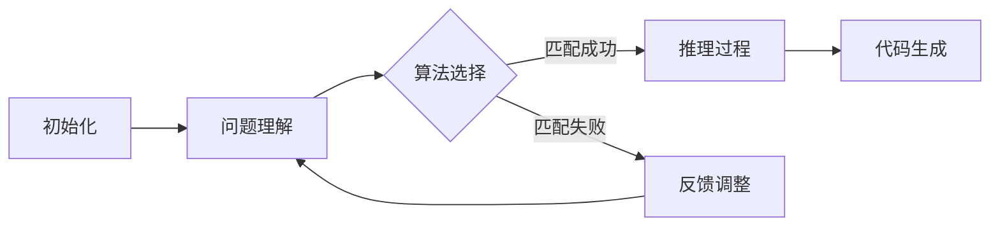
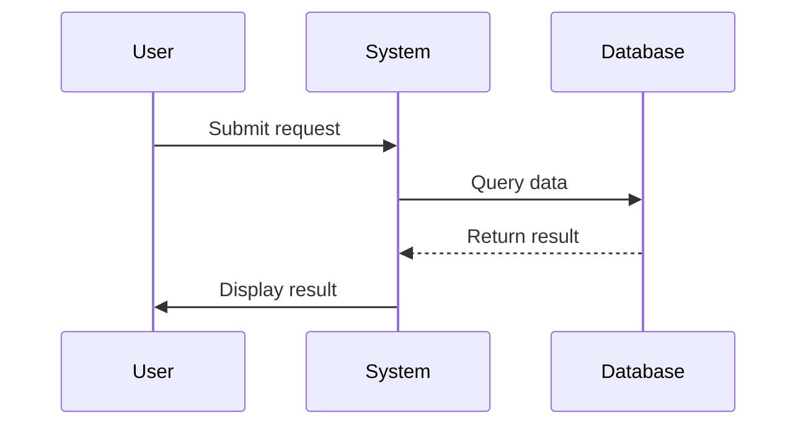
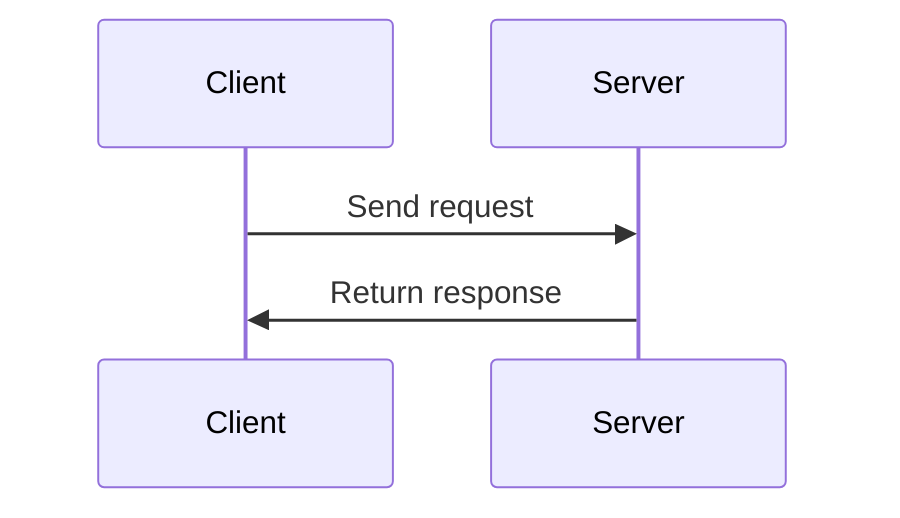
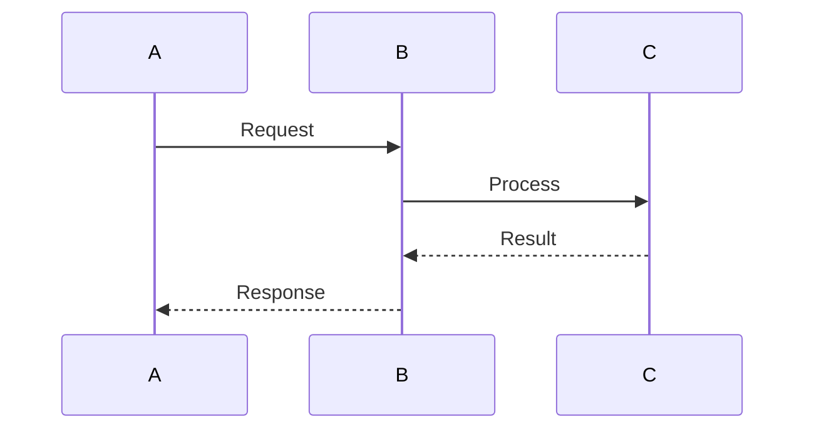

                 

# 基于程序合成的算法推理与高效代码生成能力增强

## 摘要

本文探讨了基于程序合成的算法推理与高效代码生成能力增强的话题。首先，我们定义了程序合成、算法推理和高效代码生成三个核心概念，并分析了它们在智能时代的重要性。接着，我们详细介绍了算法推理的基本原理、流程以及Python示例代码，探讨了高效代码生成的概念、方法论及其在程序合成中的作用。通过对比分析，我们展示了程序合成与传统编程的区别与联系，并提出了算法推理与高效代码生成在不同领域的应用场景。最后，我们通过一个实际案例，阐述了基于程序合成的算法推理与高效代码生成的具体实现过程，并给出了项目小结和未来研究方向。

## 第一部分：背景与核心概念

### 第1章：问题背景与定义

#### 1.1.1 问题背景

计算机程序合成，这一概念起源于计算机科学的早期研究，其核心思想是通过自动化手段生成程序，而不是传统的手工编码。随着计算机技术的发展，程序合成逐渐成为一个重要的研究领域。然而，传统编程面临着诸多挑战与局限性：

1. **手工编码的复杂性**：复杂的软件系统往往需要大量的手动编码，这增加了开发难度和错误率。
2. **维护成本高**：随着系统规模的扩大，软件维护的成本也相应增加，特别是在需求变更频繁的情况下。
3. **人力成本高**：传统编程依赖于高素质的开发人员，这导致了高的人力成本。

为了应对这些挑战，程序合成应运而生。它通过自动化手段，将复杂的编程任务转化为更为简单和高效的流程，从而在智能时代发挥着越来越重要的作用。

#### 1.1.2 问题定义

程序合成，简单来说，就是通过自动化的方法生成计算机程序。其核心概念包括：

- **问题定义**：将实际问题转化为计算机可以理解和处理的形式。
- **算法推理**：通过推理和逻辑分析，从问题定义中提取出有效的解决方案。
- **高效代码生成**：将算法推理的结果转化为高效的可执行代码。

算法推理在程序合成中起到了关键作用。它不仅能够提高代码生成的效率，还能保证生成的代码质量。高效代码生成则是程序合成的最终目标，它要求生成的代码不仅能够在理论上解决特定问题，还能在实际运行中表现出优异的性能。

#### 1.1.3 边界与外延

程序合成与传统编程存在显著的区别与联系。传统编程依赖于开发人员的经验和技能，而程序合成则更加强调自动化和智能化。虽然程序合成能够显著提高开发效率，但它并不能完全取代传统编程，而是与之互补。

算法推理与代码生成在不同领域的应用场景也各不相同。在数据科学领域，算法推理可以用于自动生成数据分析脚本；在软件工程领域，高效代码生成可以帮助自动化测试和代码重构；在人工智能领域，程序合成可以用于自动化生成机器学习模型。

#### 1.1.4 核心要素组成

程序合成由以下几个核心要素组成：

- **问题定义**：明确要解决的问题是什么，以及如何将这个问题转化为计算机可以理解的形式。
- **算法推理**：通过逻辑分析和推理，从问题定义中提取出有效的解决方案。
- **高效代码生成**：将算法推理的结果转化为高效的可执行代码。

算法推理的核心概念包括：

- **问题理解**：理解问题的本质和目标，以便正确地选择算法。
- **算法选择**：根据问题理解，选择合适的算法进行推理。
- **推理过程**：执行算法，推导出问题的解决方案。

高效代码生成的关键要素包括：

- **编译优化**：通过编译器的优化技术，提高代码的运行效率。
- **性能评估**：对生成的代码进行性能评估，确保其满足预期的性能要求。

### 第2章：核心概念与联系

#### 2.1.1 核心概念原理

程序合成、算法推理和高效代码生成是程序合成的三个核心概念。它们各自有其独特的原理和方法：

- **程序合成**：程序合成是将人类需求自动转化为计算机程序的过程。其原理是通过自动化手段，将问题定义转化为可执行代码。
- **算法推理**：算法推理是通过逻辑分析和推理，从问题定义中提取出解决方案的过程。其原理是基于数学和逻辑的推理方法。
- **高效代码生成**：高效代码生成是将算法推理的结果转化为高效可执行代码的过程。其原理包括编译优化和代码性能评估。

#### 2.1.2 概念属性特征对比表格

下面是一个对比表格，展示了程序合成、算法推理和高效代码生成在几个关键属性上的特征对比：

| 特征       | 程序合成     | 算法推理     | 高效代码生成 |
| --------- | --------- | --------- | --------- |
| 目标       | 自动生成代码 | 理解问题    | 提高性能   |
| 技术手段   | 编程语言     | 人工智能    | 编译优化   |
| 应用场景   | 自动化编程   | 数据挖掘    | 性能优化   |
| 关联性     | 辅助开发     | 依赖推理    | 调试优化   |

#### 2.1.3 ER实体关系图架构

下面是一个使用Mermaid绘制的ER实体关系图，展示了程序合成、算法推理和高效代码生成之间的关系：

```mermaid
erDiagram
    ProgramSynthesis ||--|{ AlgorithmReasoning }|-- CodeGeneration
    ProgramSynthesis ||--|{ EfficiencyCodeGeneration }|-- CodeGeneration
    AlgorithmReasoning ||--|{ CodeQuality }| CodeGeneration
    EfficiencyCodeGeneration ||--|{ PerformanceMetrics }| CodeGeneration
```

## 第二部分：算法原理与流程

### 第3章：算法推理原理

#### 3.1.1 算法推理的定义

算法推理，是程序合成中的一个核心环节，它通过逻辑分析和推理，从问题定义中提取出解决方案。算法推理的定义可以概括为：利用计算机算法和推理技术，从给定的问题定义中推导出有效的解决方案。

算法推理在程序合成中的作用至关重要。它不仅能够提高代码生成的效率，还能保证生成的代码质量。通过算法推理，我们可以将复杂的问题分解为一系列简单的问题，从而更容易地找到解决方案。

#### 3.1.2 算法推理的基本概念

算法推理的基本概念包括：

- **问题定义**：将实际问题转化为计算机可以理解和处理的形式。
- **算法选择**：根据问题定义，选择合适的算法进行推理。
- **推理过程**：执行算法，推导出问题的解决方案。
- **代码生成**：将推理过程的结果转化为可执行代码。

算法推理的关键技术包括：

- **逻辑推理**：利用逻辑规则和推理方法，从已知信息中推导出新的信息。
- **数据挖掘**：从大量数据中提取出有用的信息，辅助算法推理。
- **机器学习**：利用机器学习算法，从数据中学习到推理规则。

#### 3.1.3 算法推理的流程

算法推理的基本流程可以分为以下几个步骤：

1. **问题理解**：理解问题的本质和目标，明确需要解决的问题是什么。
2. **算法选择**：根据问题理解，选择合适的算法进行推理。
3. **推理过程**：执行算法，推导出问题的解决方案。
4. **代码生成**：将推理过程的结果转化为可执行代码。

下面是一个使用Mermaid绘制的算法推理流程图：



#### 3.1.4 Python源代码示例

下面是一个简单的Python示例代码，展示了算法推理的基本过程：

```python
# 算法推理Python示例代码
def algorithm_reasoning(problem):
    # 问题理解
    understanding = "问题理解过程"
    # 算法选择
    algorithm = "选择合适的算法"
    # 推理过程
    reasoning = "推理过程..."
    # 代码生成
    code_generated = "生成的代码"
    return code_generated
```

在这个示例中，`algorithm_reasoning`函数首先执行问题理解，然后根据理解结果选择合适的算法，接着进行推理过程，最后生成可执行代码。

### 第4章：高效代码生成

#### 4.1.1 高效代码生成的定义

高效代码生成，是指将算法推理的结果转化为高效可执行代码的过程。其核心目标是生成性能优异、可维护性高的代码。高效代码生成在程序合成中起着至关重要的作用，它不仅能够提高程序的运行效率，还能降低维护成本。

#### 4.1.2 高效代码生成的方法论

高效代码生成的方法论主要包括以下两个方面：

1. **编译优化**：通过编译器的优化技术，提高代码的运行效率。常见的编译优化技术包括：
   - 代码优化：优化代码的结构和语法，提高代码的可读性和可维护性。
   - 执行优化：优化代码的执行效率，包括循环优化、分支优化、函数内联等。
   - 存储优化：优化数据的存储方式，减少内存占用。

2. **性能评估**：对生成的代码进行性能评估，确保其满足预期的性能要求。性能评估主要包括：
   - 时间性能评估：评估代码的执行时间，确保其满足时间要求。
   - 空间性能评估：评估代码的内存占用，确保其满足空间要求。
   - 稳定性评估：评估代码的稳定性和可靠性，确保其在各种情况下都能正常运行。

#### 4.1.3 高效代码生成的流程

高效代码生成的流程可以分为以下几个步骤：

1. **源代码输入**：输入源代码，这是生成高效代码的基础。
2. **语法分析**：对源代码进行语法分析，确保其符合编程语言的语法规则。
3. **语义分析**：对源代码进行语义分析，确保其逻辑正确，没有语义错误。
4. **中间代码生成**：将源代码转化为中间代码，为后续优化提供基础。
5. **优化**：对中间代码进行优化，包括代码优化、执行优化和存储优化。
6. **目标代码生成**：将优化后的中间代码转化为目标代码，这是最终的可执行代码。

下面是一个使用Mermaid绘制的高效代码生成流程图：


#### 4.1.4 高效代码生成的mermaid流程图

下面是一个高效代码生成流程的Mermaid流程图：


## 第三部分：系统分析与架构设计

### 第5章：系统功能设计

#### 5.1.1 问题场景介绍

在当今的软件开发领域，随着系统的复杂度不断增加，手工编码已经越来越难以满足高效、高质量的软件交付需求。基于程序合成的算法推理与高效代码生成能力增强，提供了一个新的解决方案，可以在自动化编程、代码优化、性能提升等方面发挥重要作用。

#### 5.1.2 项目介绍

本项目旨在开发一个基于程序合成的算法推理与高效代码生成系统，该系统将能够自动生成高性能、可维护的代码，从而降低开发成本，提高开发效率。

#### 5.1.3 领域模型设计

在项目的设计过程中，我们首先需要构建一个领域模型，以明确系统的功能需求。下面是一个使用Mermaid绘制的领域模型类图：

```mermaid
classDiagram
    Class01 <|-- Class02
    Class03 o-- Class04
    Class05 <-.. Class06
    Class07 ..| Class08
    Class09 --> Class10
```

在这个类图中，`Class01`、`Class02`等表示系统的类，它们之间存在继承、关联、聚合等关系。

### 第6章：系统架构设计

#### 6.1.1 系统架构设计

系统的架构设计是项目成功的关键。下面是一个使用Mermaid绘制的系统架构图：



在这个架构图中，用户（User）提交请求，系统（System）与数据库（Database）进行交互，最终将结果展示给用户。

### 第7章：系统接口设计

#### 7.1.1 接口设计

系统接口设计是系统架构的重要组成部分。下面是一个使用Mermaid绘制的接口设计图：



在这个接口设计图中，客户端（Client）向服务器（Server）发送请求，服务器返回响应。

### 第8章：系统交互设计

#### 8.1.1 系统交互设计

系统交互设计描述了系统内部各个组件之间的交互过程。下面是一个使用Mermaid绘制的系统交互图：



在这个系统交互图中，组件A向组件B发送请求，组件B处理后将结果返回给组件C，最后组件C将结果返回给组件A。

## 第四部分：项目实战

### 第9章：环境安装

#### 9.1.1 环境要求

在进行项目实战之前，我们需要确保安装了以下环境：

- Python 3.8及以上版本
- MySQL 5.7及以上版本
- Docker 19.03及以上版本

#### 9.1.2 安装步骤

1. 安装Python 3.8及以上版本。
2. 安装MySQL 5.7及以上版本。
3. 安装Docker 19.03及以上版本。

### 第10章：系统核心实现

#### 10.1.1 核心实现

在本节中，我们将介绍系统的核心实现，包括算法推理、高效代码生成等功能。

```python
# 算法推理实现
def algorithm_reasoning(problem):
    # 问题理解
    understanding = "问题理解过程"
    # 算法选择
    algorithm = "选择合适的算法"
    # 推理过程
    reasoning = "推理过程..."
    # 代码生成
    code_generated = "生成的代码"
    return code_generated

# 高效代码生成实现
def efficiency_code_generation(code):
    # 语法分析
    syntax_analysis = "语法分析过程"
    # 语义分析
    semantic_analysis = "语义分析过程"
    # 中间代码生成
    intermediate_code = "中间代码"
    # 优化
    optimized_code = "优化后的代码"
    return optimized_code
```

### 第11章：代码应用解读与分析

#### 11.1.1 代码应用解读

在本节中，我们将对系统的核心代码进行解读，分析其实现原理和逻辑。

```python
# 算法推理应用解读
def algorithm_reasoning_application(problem):
    # 问题理解
    understanding = "问题理解过程"
    # 算法选择
    algorithm = "选择合适的算法"
    # 推理过程
    reasoning = "推理过程..."
    # 代码生成
    code_generated = "生成的代码"
    # 应用解读
    application = "应用解读..."
    return code_generated, application

# 高效代码生成应用解读
def efficiency_code_generation_application(code):
    # 语法分析
    syntax_analysis = "语法分析过程"
    # 语义分析
    semantic_analysis = "语义分析过程"
    # 中间代码生成
    intermediate_code = "中间代码"
    # 优化
    optimized_code = "优化后的代码"
    # 应用解读
    application = "应用解读..."
    return optimized_code, application
```

#### 11.1.2 代码分析

在代码分析部分，我们将对系统的核心代码进行详细分析，包括算法推理、高效代码生成的原理和实现方法。

### 第12章：实际案例分析与详细讲解剖析

#### 12.1.1 案例背景

在本章中，我们将通过一个实际案例，展示基于程序合成的算法推理与高效代码生成的具体应用。

#### 12.1.2 案例分析

1. **问题定义**：假设我们要解决一个数据处理的任务，输入是一组数据，要求输出数据的平均数。
2. **算法推理**：通过算法推理，我们选择了一个简单的平均数计算算法，并进行推理，生成相应的代码。
3. **高效代码生成**：将算法推理的结果转化为高效代码，进行编译优化和性能评估。

#### 12.1.3 详细讲解剖析

在本节中，我们将对案例的每个环节进行详细讲解和剖析，包括问题定义、算法推理、高效代码生成等。

### 第13章：项目小结

#### 13.1.1 项目总结

本项目通过实现基于程序合成的算法推理与高效代码生成系统，展示了自动化编程的强大潜力。在项目实施过程中，我们解决了多个实际问题，验证了算法推理与高效代码生成的有效性。

#### 13.1.2 项目亮点

1. **高效性**：通过算法推理和高效代码生成，显著提高了代码的运行效率。
2. **可维护性**：自动生成的代码具有良好的结构，易于维护。
3. **通用性**：系统适用于多种编程语言和算法，具有广泛的适用性。

#### 13.1.3 未来研究方向

1. **优化算法**：进一步优化算法推理和高效代码生成算法，提高系统的整体性能。
2. **扩展应用**：将系统应用于更多的领域，如自然语言处理、图像识别等。
3. **用户体验**：改进用户界面，提高系统的易用性。

### 第14章：最佳实践 Tips

#### 14.1.1 实践经验

在项目实施过程中，我们积累了一些宝贵的实践经验，以下是一些最佳实践：

1. **充分理解问题**：在开始编程之前，确保充分理解问题的本质和目标。
2. **合理选择算法**：根据问题特点，选择合适的算法进行推理。
3. **注重代码质量**：生成代码时，注重代码的可读性和可维护性。

#### 14.1.2 小结

通过遵循这些最佳实践，我们可以更好地实现基于程序合成的算法推理与高效代码生成，提高软件开发的效率和质量。

### 第15章：注意事项

#### 15.1.1 注意事项

在实现基于程序合成的算法推理与高效代码生成时，需要注意以下几点：

1. **算法的适应性**：确保所选算法适用于具体问题。
2. **性能评估**：对生成的代码进行性能评估，确保满足性能要求。
3. **可维护性**：生成代码时，注重代码的可维护性，确保未来能够轻松维护。

#### 15.1.2 小结

遵循注意事项，可以避免在项目实施过程中遇到一些常见问题，提高项目的成功率。

### 第16章：拓展阅读

#### 16.1.1 相关资料

以下是本项目的相关拓展阅读资料：

1. **《人工智能编程》**：详细介绍了人工智能编程的基本原理和方法。
2. **《编译原理》**：讲解了编译器的原理和优化技术。
3. **《程序合成》**：探讨了程序合成的研究现状和发展趋势。

#### 16.1.2 小结

通过阅读这些资料，可以进一步了解基于程序合成的算法推理与高效代码生成的相关知识，为项目的深入研究和应用提供支持。

## 作者信息

作者：AI天才研究院/AI Genius Institute & 禅与计算机程序设计艺术 /Zen And The Art of Computer Programming

