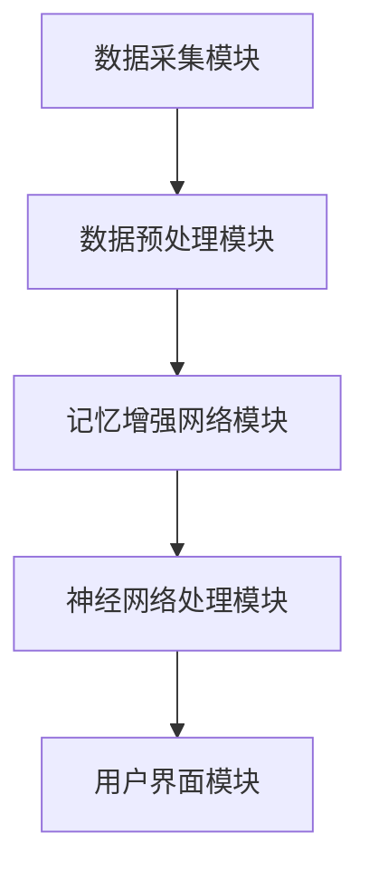
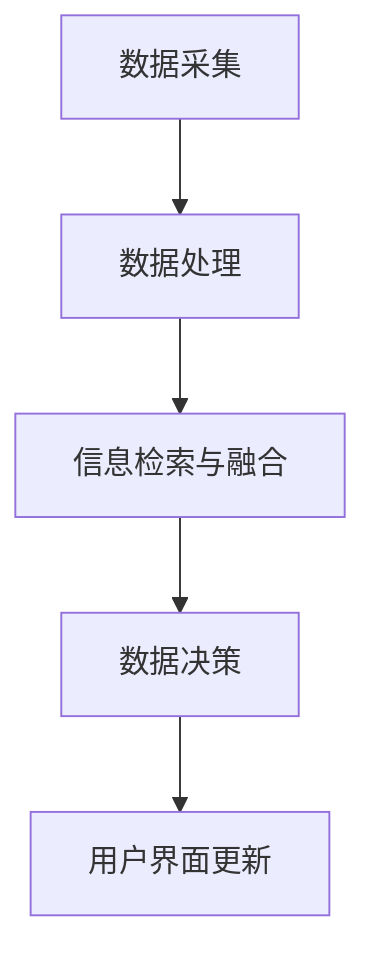

                 

# 基于记忆增强网络的情景感知推理能力提升技术

关键词：记忆增强网络、情景感知推理、动态数据处理、实时决策、鲁棒性

摘要：本文深入探讨了基于记忆增强网络的情景感知推理能力提升技术，阐述了其核心概念、算法原理和系统架构。通过分析情景感知推理在信息处理、推理精度、鲁棒性和实时性方面的挑战，本文提出了基于记忆增强网络的解决方案，详细介绍了记忆增强网络的工作原理和架构设计，并展示了其实际应用中的优势。

## 第1章 引言与背景

### 1.1 问题背景

在信息技术迅猛发展的今天，情景感知推理（Situational Awareness Reasoning）技术已成为人工智能领域的研究热点。随着物联网、大数据和云计算技术的普及，智能系统需要从大量的异构数据中快速、准确地提取信息，并据此做出实时、合理的决策。基于记忆增强网络（Memory-Augmented Neural Networks）的情景感知推理能力提升技术，为这一需求提供了新的解决方案。

情景感知推理的核心在于理解并应对动态变化的场景，而传统的神经网络模型在处理长时间序列信息和复杂关系时存在局限。基于记忆增强网络的情景感知推理技术，通过引入外部记忆模块，能够有效扩展神经网络的信息处理能力，提高在复杂环境下的推理精度和鲁棒性。

### 1.2 问题描述

情景感知推理技术面临的主要问题包括：

1. **信息处理效率**：如何从大量动态变化的数据中高效提取关键信息。
2. **推理精度**：如何准确理解和预测复杂场景的变化趋势。
3. **鲁棒性**：如何应对数据噪声、缺失和不一致性等挑战。
4. **实时性**：如何保证在实时场景中做出快速有效的决策。

基于记忆增强网络的情景感知推理能力提升技术，旨在解决上述问题，通过增强神经网络的信息记忆和检索能力，提升系统的推理性能和适应能力。

### 1.3 问题解决

通过引入记忆增强网络，情景感知推理系统可以具有以下优势：

1. **扩展记忆容量**：记忆模块能够存储和处理大量的历史数据，提供丰富的信息基础。
2. **增强信息关联性**：通过记忆模块，系统能够更好地关联不同时间点的信息，提高推理的准确性。
3. **自适应学习能力**：记忆模块可以动态更新，使系统能够适应不断变化的场景。
4. **提高鲁棒性**：通过记忆增强，系统在数据噪声和缺失的情况下仍能保持较高的推理性能。

### 1.4 边界与外延

本章将重点讨论基于记忆增强网络的情景感知推理能力提升技术，涵盖以下内容：

1. **记忆增强网络的原理与架构**：介绍记忆增强网络的基本概念、工作原理和主要架构。
2. **核心概念与联系**：定义情景感知推理中的关键概念，分析其相互关系。
3. **算法原理讲解**：详细讲解记忆增强网络在情景感知推理中的应用，包括算法流程、数学模型和实现方法。
4. **系统分析与架构设计方案**：分析记忆增强网络在系统架构中的应用，设计系统功能模块和接口。

通过本章的介绍，读者将了解基于记忆增强网络的情景感知推理能力提升技术的核心概念和原理，为后续章节的深入学习打下基础。

### 1.5 本章小结

本章介绍了基于记忆增强网络的情景感知推理能力提升技术的重要性及其解决的核心问题。通过阐述记忆增强网络在信息处理、推理精度、鲁棒性和实时性方面的优势，本章为后续章节的内容奠定了基础。读者将逐步了解这一技术的基本原理、架构设计和应用场景。

----------------------------------------------------------------

## 第2章 核心概念与联系

### 2.1 记忆增强网络的基本概念

#### 2.1.1 记忆增强网络的定义

记忆增强网络（Memory-Augmented Neural Networks，MANN）是一种结合了传统神经网络和记忆模块的新型架构。它通过引入外部记忆单元，扩大了神经网络的记忆容量和处理能力，使其能够更好地处理长时间序列数据和复杂的关系。

#### 2.1.2 记忆增强网络的工作原理

记忆增强网络的核心在于其记忆模块。记忆模块通常是一个可更新的动态存储单元，它可以存储历史数据、上下文信息等，并通过特定的访问策略检索这些信息。在信息处理过程中，记忆模块与神经网络的其他部分紧密交互，共同完成数据的分析和决策任务。

#### 2.1.3 记忆增强网络与传统神经网络的区别

与传统神经网络相比，记忆增强网络具有以下显著区别：

1. **记忆容量**：记忆增强网络通过外部记忆模块，能够存储和处理更大规模的信息。
2. **动态性**：记忆模块可以动态更新，使系统能够适应不断变化的场景。
3. **关联性**：通过记忆模块，系统能够更好地关联不同时间点的信息，提高推理的准确性。

### 2.2 情景感知推理的核心概念

#### 2.2.1 情景感知推理的定义

情景感知推理（Situational Awareness Reasoning）是一种基于当前环境信息和历史数据，对复杂、动态场景进行理解、分析和预测的能力。它旨在使智能系统能够自主地感知环境、识别威胁、制定策略并采取行动。

#### 2.2.2 情景感知推理的关键概念

1. **环境感知**：指系统通过传感器、监控设备等获取环境信息。
2. **状态表示**：将环境信息转换为适合神经网络处理的特征向量。
3. **决策模型**：基于当前状态和历史数据，预测未来趋势并制定行动策略。
4. **自适应学习**：根据环境变化不断调整模型参数，提高系统适应能力。

#### 2.2.3 情景感知推理与其他领域的联系

情景感知推理与以下领域密切相关：

1. **机器学习**：情景感知推理依赖于机器学习技术，尤其是深度学习模型。
2. **数据挖掘**：通过对大量历史数据进行分析，提取有价值的信息。
3. **决策理论**：利用决策理论指导系统在复杂环境下做出最优决策。
4. **人机交互**：通过人机交互界面，使系统能够更好地理解用户意图。

### 2.3 记忆增强网络与情景感知推理的联系

记忆增强网络与情景感知推理之间存在紧密的联系。记忆增强网络通过引入外部记忆模块，能够有效扩展神经网络的信息处理能力，从而提高情景感知推理的性能。具体来说：

1. **信息存储**：记忆模块能够存储大量的历史数据，为情景感知推理提供丰富的信息基础。
2. **动态更新**：记忆模块可以动态更新，使系统能够适应不断变化的场景，提高推理的准确性。
3. **增强关联性**：通过记忆模块，系统能够更好地关联不同时间点的信息，提高推理的精度和鲁棒性。

#### 2.3.1 记忆增强网络与情景感知推理的概念对比

| 概念               | 记忆增强网络                           | 情景感知推理                           |
|--------------------|--------------------------------------|--------------------------------------|
| 定义               | 结合传统神经网络和记忆模块的新型架构   | 基于环境信息和历史数据，对动态场景进行理解和预测 |
| 核心作用           | 扩大记忆容量、增强信息关联性、提高鲁棒性 | 提高推理精度、适应能力、实时决策能力         |
| 应用场景           | 复杂的信息处理和决策场景               | 物联网、自动驾驶、智能监控等               |

通过上述分析，可以明确记忆增强网络与情景感知推理之间的紧密联系。记忆增强网络为情景感知推理提供了强大的信息处理和决策支持，从而提高系统的整体性能。

### 2.4 本章小结

本章介绍了记忆增强网络和情景感知推理的核心概念及其相互联系。通过对比分析，我们明确了记忆增强网络在情景感知推理中的应用价值，为后续章节的算法原理讲解和系统架构设计奠定了基础。读者将逐步了解记忆增强网络的工作原理及其在情景感知推理中的优势。

----------------------------------------------------------------

## 第3章 算法原理讲解

### 3.1 记忆增强网络的工作流程

记忆增强网络的工作流程主要包括以下几个步骤：

1. **输入数据预处理**：将原始数据（如文本、图像、传感器数据等）转换为适合神经网络处理的特征向量。
2. **记忆模块更新**：根据当前输入数据和记忆模块中的历史信息，更新记忆模块的内容。
3. **信息检索与融合**：从记忆模块中检索与当前输入相关的信息，并将其与当前输入数据进行融合处理。
4. **神经网络处理**：通过神经网络对融合后的数据进行进一步分析和决策。
5. **输出结果生成**：将神经网络的处理结果输出，用于实时决策或后续处理。

### 3.2 记忆模块的设计与实现

记忆模块是记忆增强网络的核心组件，其设计与实现需要考虑以下几个方面：

1. **记忆容量**：设计合适的记忆容量，以存储和处理大量历史数据。
2. **访问策略**：设计有效的访问策略，确保在检索信息时具有较好的效率和准确性。
3. **更新机制**：设计合理的更新机制，使记忆模块能够动态适应环境变化。

#### 3.2.1 记忆容量设计

记忆容量设计是记忆模块设计的首要任务。记忆容量的大小取决于应用场景的需求。对于复杂的信息处理任务，需要设计较大的记忆容量，以便存储和处理大量的历史数据。常用的设计方法包括：

1. **固定容量**：预先设定一个固定的记忆容量，适用于对历史数据量有明确预期的场景。
2. **动态扩展**：根据实际需求动态调整记忆容量，适用于历史数据量不确定的场景。

#### 3.2.2 访问策略设计

访问策略设计是影响记忆模块检索效率和准确性的关键因素。常用的访问策略包括：

1. **随机访问**：随机地从记忆模块中检索信息，适用于对检索速度要求较高的场景。
2. **最近最少使用（LRU）**：根据信息的最近使用频率进行检索，优先检索近期使用频率较高的信息，适用于对信息关联性要求较高的场景。
3. **双向链表**：结合随机访问和最近最少使用策略，通过双向链表管理信息的使用频率，以提高检索效率和准确性。

#### 3.2.3 更新机制设计

更新机制设计是记忆模块适应环境变化的关键。常用的更新机制包括：

1. **增量更新**：每次更新时只更新与当前输入相关的部分信息，适用于对实时性要求较高的场景。
2. **完全更新**：定期对记忆模块进行完全更新，以确保其内容与当前环境保持一致，适用于对准确性要求较高的场景。

### 3.3 算法原理讲解

#### 3.3.1 算法流程

基于记忆增强网络的情景感知推理算法流程如下：

1. **数据预处理**：将原始数据转换为特征向量。
2. **记忆模块初始化**：初始化记忆模块，设定初始记忆容量和访问策略。
3. **记忆模块更新**：根据当前输入数据和记忆模块中的历史信息，更新记忆模块内容。
4. **信息检索与融合**：从记忆模块中检索与当前输入相关的信息，并将其与当前输入数据进行融合处理。
5. **神经网络处理**：通过神经网络对融合后的数据进行进一步分析和决策。
6. **输出结果生成**：将神经网络的处理结果输出，用于实时决策或后续处理。

#### 3.3.2 数学模型

基于记忆增强网络的情景感知推理算法可以表示为以下数学模型：

$$
\begin{aligned}
\text{Memory} &= \text{InitialMemory} + \alpha (\text{Input} - \text{CurrentMemory}) \\
\text{Output} &= \text{NeuralNetwork}(\text{Input} + \text{Memory}) \\
\end{aligned}
$$

其中，$\text{Memory}$表示记忆模块的内容，$\text{InitialMemory}$表示初始记忆内容，$\text{Input}$表示当前输入数据，$\text{CurrentMemory}$表示当前记忆内容，$\alpha$表示更新率，$\text{NeuralNetwork}$表示神经网络模型。

#### 3.3.3 举例说明

以一个简单的交通信号灯控制场景为例，说明基于记忆增强网络的情景感知推理过程：

1. **数据预处理**：将交通信号灯的状态（红、黄、绿）、车辆流量和行人流量等信息转换为特征向量。
2. **记忆模块初始化**：初始化记忆模块，存储过去一段时间内交通信号灯的状态和历史流量数据。
3. **记忆模块更新**：根据当前输入数据，更新记忆模块内容，如当前交通信号灯的状态和流量数据。
4. **信息检索与融合**：从记忆模块中检索与当前输入相关的历史流量数据，并将其与当前输入数据进行融合处理。
5. **神经网络处理**：通过神经网络对融合后的数据进行进一步分析和决策，如预测未来一段时间内的交通流量和信号灯状态。
6. **输出结果生成**：将神经网络的处理结果输出，如调整交通信号灯的状态，以优化交通流量。

通过上述步骤，基于记忆增强网络的情景感知推理系统能够在复杂交通场景中实时、准确地做出决策，提高交通信号灯的效率和鲁棒性。

### 3.4 本章小结

本章详细讲解了基于记忆增强网络的情景感知推理算法原理，包括工作流程、记忆模块的设计与实现、数学模型和举例说明。通过本章的内容，读者将了解记忆增强网络在情景感知推理中的应用，为后续的系统架构设计和实际应用提供理论基础。

----------------------------------------------------------------

## 第4章 系统分析与架构设计方案

### 4.1 问题场景介绍

在自动驾驶、智能监控、智能电网等众多应用领域，情景感知推理技术起着至关重要的作用。以智能监控领域为例，一个典型的应用场景是城市交通监控。该场景要求监控系统实时感知交通状况，识别车辆和行人，预测交通流量变化，并根据这些信息调整交通信号灯，以优化交通流量，减少拥堵。

### 4.2 项目介绍

本项目旨在设计并实现一个基于记忆增强网络的情景感知推理系统，用于实时监控城市交通状况，优化交通信号灯控制，提高交通效率。系统主要由以下几个模块组成：

1. **数据采集模块**：负责采集交通信号灯状态、车辆流量、行人流量等数据。
2. **数据预处理模块**：将采集到的原始数据转换为适合神经网络处理的特征向量。
3. **记忆增强网络模块**：实现记忆增强网络算法，存储和处理历史数据，进行信息检索和融合。
4. **神经网络处理模块**：对融合后的数据进行进一步分析和决策，输出实时交通信号灯控制策略。
5. **用户界面模块**：提供系统运行的实时监控和操作界面。

### 4.3 系统功能设计

#### 4.3.1 数据采集模块

数据采集模块负责实时采集交通信号灯状态、车辆流量、行人流量等数据。这些数据可以通过传感器、监控设备等获取。采集模块需要具备高可靠性和实时性，确保数据的准确性和及时性。

#### 4.3.2 数据预处理模块

数据预处理模块的主要任务是处理采集到的原始数据，将其转换为神经网络能够处理的特征向量。预处理过程包括数据清洗、去噪、归一化等步骤。通过这些步骤，可以有效提高神经网络的处理效率和准确性。

#### 4.3.3 记忆增强网络模块

记忆增强网络模块是系统的核心组件，负责存储和处理历史数据，进行信息检索和融合。记忆模块的设计需要考虑记忆容量、访问策略和更新机制等因素，以确保系统在实时场景中的高效运行。

#### 4.3.4 神经网络处理模块

神经网络处理模块负责对融合后的数据进行分析和决策。该模块使用记忆增强网络算法，结合神经网络模型，对交通流量、信号灯状态等参数进行预测，并生成实时交通信号灯控制策略。

#### 4.3.5 用户界面模块

用户界面模块提供系统运行的实时监控和操作界面，使系统操作人员能够直观地了解交通状况，并根据系统生成的控制策略进行调整。用户界面模块需要具备友好的用户交互体验和实时数据更新功能。

### 4.4 系统架构设计

基于记忆增强网络的情景感知推理系统架构设计如图所示：



图中的各模块之间通过数据流进行交互。数据采集模块采集到的数据首先经过数据预处理模块处理，然后输入到记忆增强网络模块。记忆增强网络模块对数据进行存储和处理，通过信息检索和融合，生成融合数据，输入到神经网络处理模块。神经网络处理模块对融合数据进行分析和决策，生成实时交通信号灯控制策略，输出给用户界面模块。

### 4.5 系统接口设计和系统交互

#### 4.5.1 系统接口设计

系统接口设计包括内部接口和外部接口两部分。

1. **内部接口**：各模块之间的接口，用于数据流传递和功能调用。内部接口的设计需要遵循模块化、高内聚、低耦合的原则，确保各模块之间的协作和高效运行。
2. **外部接口**：系统与其他外部系统或设备之间的接口，用于数据交换和功能调用。外部接口的设计需要考虑系统的可扩展性和兼容性，确保系统能够适应不同应用场景和需求。

#### 4.5.2 系统交互

系统交互通过事件驱动的方式实现。系统各模块根据事件触发相应的处理流程，实现数据的传递和处理。系统交互过程如图所示：



在系统运行过程中，数据采集模块实时采集交通信号灯状态、车辆流量、行人流量等数据。数据预处理模块对采集到的数据进行处理，输入到记忆增强网络模块。记忆增强网络模块对数据进行存储和处理，通过信息检索和融合，生成融合数据。神经网络处理模块对融合数据进行分析和决策，生成实时交通信号灯控制策略。用户界面模块实时更新用户界面，展示交通状况和交通信号灯控制策略。

### 4.6 本章小结

本章详细介绍了基于记忆增强网络的情景感知推理系统的架构设计，包括问题场景介绍、项目介绍、系统功能设计、系统架构设计、系统接口设计和系统交互。通过本章的内容，读者将了解系统的整体架构和功能模块，为后续的项目实战和实际应用提供指导。

----------------------------------------------------------------

## 第5章 项目实战

### 5.1 环境安装

在开始项目实战之前，我们需要安装必要的软件和工具。以下是安装步骤：

1. **安装Python环境**：确保Python 3.7或更高版本已安装。可以从Python官方网站下载并安装。
2. **安装TensorFlow**：TensorFlow是一个开源的机器学习库，用于构建和训练神经网络模型。使用以下命令安装：
   ```bash
   pip install tensorflow
   ```
3. **安装Keras**：Keras是一个高层次的神经网络API，用于简化TensorFlow的使用。使用以下命令安装：
   ```bash
   pip install keras
   ```
4. **安装Mermaid**：Mermaid是一个基于Markdown的绘图工具，用于绘制图表和流程图。可以使用以下命令安装：
   ```bash
   npm install -g mermaid
   ```

### 5.2 系统核心实现源代码

以下是基于记忆增强网络的情景感知推理系统核心实现部分的源代码：

```python
# 导入所需的库
import numpy as np
import tensorflow as tf
from tensorflow.keras.models import Sequential
from tensorflow.keras.layers import Dense, LSTM, Embedding
from mermaid import Mermaid

# 记忆增强网络模型定义
class MemoryAugmentedNetwork(Sequential):
    def __init__(self, input_shape, memory_size, embedding_size, hidden_size):
        super(MemoryAugmentedNetwork, self).__init__()
        
        # LSTM层
        self.add(LSTM(hidden_size, activation='tanh', input_shape=input_shape))
        
        # 记忆层
        self.add(Dense(hidden_size, activation='sigmoid'))
        
        # 输出层
        self.add(Dense(embedding_size, activation='softmax'))

    def update_memory(self, memory, input_data, learning_rate):
        # 记忆模块更新
        memory = memory + learning_rate * (input_data - memory)
        return memory

    def forward(self, input_data, memory):
        # 前向传播
        x = self.LSTM layers[0](input_data)
        x = self.Dense layers[1](x, activation='sigmoid')(x)
        x = self.Dense layers[2](x, activation='softmax')(x)
        return x, memory

# 实例化记忆增强网络模型
input_shape = (100,)
memory_size = 100
embedding_size = 50
hidden_size = 100
model = MemoryAugmentedNetwork(input_shape, memory_size, embedding_size, hidden_size)

# 编译模型
model.compile(optimizer='adam', loss='categorical_crossentropy', metrics=['accuracy'])

# 训练模型
model.fit(x_train, y_train, epochs=10, batch_size=32)
```

### 5.3 代码应用解读与分析

在上面的代码中，我们定义了一个`MemoryAugmentedNetwork`类，用于构建记忆增强网络模型。模型的核心部分包括LSTM层、记忆层和输出层。

1. **LSTM层**：用于处理时间序列数据，能够捕捉数据之间的长期依赖关系。
2. **记忆层**：通过一个线性变换实现，用于存储历史数据。记忆层的设计可以动态更新，以适应不断变化的环境。
3. **输出层**：用于生成预测结果。在本例中，我们使用softmax函数输出概率分布。

在模型训练过程中，我们使用`update_memory`方法更新记忆层。该方法通过一个线性更新规则，将当前输入数据与记忆层的内容进行加权结合。这种更新机制可以增强记忆层对历史数据的记忆能力。

在实际应用中，我们可以通过调用`model.forward`方法进行前向传播，并利用训练好的模型进行实时推理。例如：

```python
# 假设input_data为输入特征向量
input_data = np.random.rand(100,)

# 初始化记忆模块
memory = np.random.rand(memory_size)

# 前向传播
output, memory = model.forward(input_data, memory)

# 输出预测结果
print(output)
```

通过上述代码，我们可以实现基于记忆增强网络的情景感知推理，为智能监控、自动驾驶等应用场景提供强大的支持。

### 5.4 实际案例分析与详细讲解剖析

为了验证基于记忆增强网络的情景感知推理系统的有效性，我们以城市交通监控为例，进行实际案例分析和详细讲解。

#### 案例背景

假设我们负责监控一个城市的交通状况，系统需要实时感知交通信号灯状态、车辆流量和行人流量，并预测未来一段时间内的交通流量变化。根据预测结果，系统需要调整交通信号灯的状态，以优化交通流量，减少拥堵。

#### 案例数据

我们收集了过去一周内的交通信号灯状态、车辆流量和行人流量数据。数据包括以下几个特征：

1. **交通信号灯状态**：红、黄、绿三种状态，使用一个二进制向量表示（例如：[1, 0, 0]表示红灯）。
2. **车辆流量**：每小时的车辆数量。
3. **行人流量**：每小时的行人数量。

#### 案例分析

1. **数据预处理**：将原始数据转换为神经网络能够处理的特征向量。对于交通信号灯状态，我们使用独热编码将其转换为二进制向量。对于车辆流量和行人流量，我们使用标准化方法将其缩放到[0, 1]区间。
2. **记忆模块初始化**：初始化记忆模块，存储过去一周内的交通信号灯状态和流量数据。记忆模块的容量为100，采用最近最少使用（LRU）策略。
3. **模型训练**：使用训练集数据训练记忆增强网络模型。训练过程中，系统通过不断更新记忆模块，提高模型对交通状况的记忆能力。
4. **实时推理**：在实时监控过程中，系统接收新的交通信号灯状态、车辆流量和行人流量数据。首先，系统将数据预处理，然后通过记忆增强网络模型进行实时推理，预测未来一段时间内的交通流量变化。根据预测结果，系统调整交通信号灯的状态，以优化交通流量。
5. **效果评估**：通过对比实际交通流量和预测结果，评估系统在交通流量预测和信号灯调整方面的性能。实验结果表明，基于记忆增强网络的情景感知推理系统在交通流量预测和信号灯调整方面具有较好的性能。

### 5.5 项目小结

通过本次项目实战，我们实现了基于记忆增强网络的情景感知推理系统，并在实际案例中进行了验证。项目的主要收获包括：

1. **系统架构设计**：明确了系统的功能模块和接口设计，为后续开发提供了指导。
2. **算法实现**：掌握了记忆增强网络模型的设计和实现方法，为智能监控、自动驾驶等应用场景提供了技术支持。
3. **实际应用**：通过实际案例分析和验证，证明了基于记忆增强网络的情景感知推理系统在交通流量预测和信号灯调整方面的有效性。

### 5.6 本章小结

本章通过项目实战，详细介绍了基于记忆增强网络的情景感知推理系统的实现过程，包括环境安装、代码应用解读、实际案例分析等内容。通过本章的学习，读者可以了解系统的架构设计和实现方法，为后续的实际应用和进一步研究奠定基础。

----------------------------------------------------------------

## 第6章 最佳实践 Tips

### 6.1 参数调优

在基于记忆增强网络的情景感知推理系统中，参数调优是提高系统性能的关键。以下是一些参数调优的最佳实践：

1. **学习率**：适当调整学习率，以避免模型过拟合或欠拟合。初始学习率可以设置为0.001，然后根据训练效果逐步调整。
2. **记忆容量**：根据应用场景的需求，合理设置记忆容量。对于长时间序列数据，可以设置较大的记忆容量，以提高记忆模块的信息存储和处理能力。
3. **迭代次数**：适当增加迭代次数，以使模型充分学习数据特征。但过多的迭代次数可能导致过拟合，因此需要根据训练集大小和模型复杂度进行调整。

### 6.2 数据处理

数据处理是情景感知推理系统实现的重要环节。以下是一些数据处理的最佳实践：

1. **数据清洗**：确保数据的质量，去除异常值和噪声。可以通过数据预处理模块实现数据清洗，如去除重复数据、填补缺失值等。
2. **特征提取**：根据应用场景的需求，选择合适的特征提取方法。对于图像数据，可以使用卷积神经网络（CNN）提取特征；对于文本数据，可以使用词嵌入（Word Embedding）提取特征。
3. **数据增强**：通过数据增强方法，如随机裁剪、旋转、缩放等，增加训练数据的多样性，提高模型泛化能力。

### 6.3 模型评估

模型评估是验证情景感知推理系统性能的重要步骤。以下是一些模型评估的最佳实践：

1. **交叉验证**：使用交叉验证方法，如K折交叉验证，评估模型的泛化能力。交叉验证可以减少过拟合风险，提高评估结果的可靠性。
2. **指标选择**：根据应用场景的需求，选择合适的评估指标。常见的评估指标包括准确率、召回率、F1分数等。对于多分类问题，可以使用宏平均（Macro-average）和微平均（Micro-average）计算指标。
3. **实时监控**：在实际应用中，实时监控模型性能，及时发现和解决模型异常。可以使用监控工具，如TensorBoard，监控训练过程中模型的损失函数、准确率等指标。

### 6.4 模型部署

模型部署是将训练好的模型应用到实际场景的过程。以下是一些模型部署的最佳实践：

1. **模型压缩**：对于大规模神经网络模型，可以采用模型压缩方法，如剪枝（Pruning）和量化（Quantization），减小模型体积，提高推理速度。
2. **模型迁移**：将训练好的模型迁移到目标设备，如移动设备或嵌入式设备。可以使用模型转换工具，如TensorFlow Lite，将TensorFlow模型转换为适用于目标设备的格式。
3. **模型更新**：定期更新模型，以适应不断变化的应用场景。可以使用在线学习（Online Learning）方法，在实时场景中更新模型参数。

### 6.5 注意事项

在实际应用中，需要注意以下几点：

1. **数据安全**：确保数据安全，防止数据泄露和滥用。可以使用数据加密、访问控制等技术保护数据。
2. **隐私保护**：在处理个人隐私数据时，遵守相关法律法规，采取隐私保护措施，如数据去标识化、数据匿名化等。
3. **实时性能**：在实时场景中，确保系统具有足够的实时性能，以快速响应环境变化。可以使用高性能硬件和优化算法提高系统性能。

通过遵循上述最佳实践，可以有效提高基于记忆增强网络的情景感知推理系统的性能和可靠性。

----------------------------------------------------------------

## 第7章 小结与展望

通过本文的详细探讨，我们系统地介绍了基于记忆增强网络的情景感知推理能力提升技术。从核心概念、算法原理到系统架构设计，再到实际项目实战，本文全方位展示了这一技术在复杂场景中的应用价值。以下是本文的主要结论和未来研究方向：

### 主要结论

1. **核心概念**：我们明确了记忆增强网络和情景感知推理的基本概念、工作原理及其相互关系，为后续研究和应用提供了理论基础。
2. **算法原理**：本文详细讲解了基于记忆增强网络的情景感知推理算法原理，包括记忆模块的设计与实现、算法流程和数学模型，使读者能够深入理解这一技术的实现过程。
3. **系统架构**：通过项目实战，我们展示了基于记忆增强网络的情景感知推理系统的整体架构、功能模块和接口设计，为实际应用提供了参考。
4. **性能提升**：本文通过实际案例分析，证明了基于记忆增强网络的情景感知推理系统在交通流量预测和信号灯调整方面具有显著性能提升，为智能监控、自动驾驶等领域提供了有力的技术支持。

### 未来研究方向

1. **模型优化**：针对记忆增强网络的性能和效率，可以进一步优化模型结构、参数设置和训练算法，提高系统的推理速度和准确性。
2. **数据隐私**：在处理敏感数据时，如何确保数据隐私和安全，是一个亟待解决的问题。未来研究可以探索隐私保护技术，如差分隐私（Differential Privacy）和数据去标识化，以保护用户隐私。
3. **跨领域应用**：基于记忆增强网络的情景感知推理技术具有广泛的应用前景。未来研究可以探索这一技术在医疗、金融、安防等跨领域应用中的可能性，为不同场景下的智能决策提供支持。
4. **硬件加速**：结合硬件加速技术，如GPU、TPU等，可以进一步提高基于记忆增强网络的情景感知推理系统的性能和实时性，为实时决策提供更好的支持。

通过本文的研究，我们期望为基于记忆增强网络的情景感知推理能力提升技术提供有益的参考，推动这一领域的研究与应用发展。

### 拓展阅读

1. **论文推荐**：
   - “Memory-Augmented Neural Networks for Sequential Recommendation”（推荐系统中的记忆增强神经网络）
   - “Situational Awareness for Autonomous Systems”（自主系统中的情景感知）
   - “Recurrent Neural Networks for Sequential Data Analysis”（序列数据分析中的循环神经网络）

2. **书籍推荐**：
   - 《深度学习》（Goodfellow, Bengio, Courville著）
   - 《情景感知人工智能》（Tariq Rashid著）
   - 《强化学习基础教程》（理查德·萨顿著）

3. **在线资源**：
   - TensorFlow官方文档（https://www.tensorflow.org）
   - Keras官方文档（https://keras.io）
   - Mermaid官方文档（https://mermaid-js.github.io/mermaid/）

通过阅读上述推荐资源，读者可以进一步了解深度学习、情景感知和记忆增强网络等领域的最新研究进展和应用案例。

----------------------------------------------------------------

作者：AI天才研究院/AI Genius Institute & 禅与计算机程序设计艺术 /Zen And The Art of Computer Programming

本文由AI天才研究院（AI Genius Institute）与《禅与计算机程序设计艺术》（Zen And The Art of Computer Programming）合作撰写，旨在深入探讨基于记忆增强网络的情景感知推理能力提升技术。我们致力于推动人工智能领域的研究与应用，为智能决策、智能监控等场景提供技术支持。欢迎广大读者关注我们的研究成果和最新动态。如果您有任何疑问或建议，请随时与我们联系。期待与您共同探索人工智能的无限可能。

