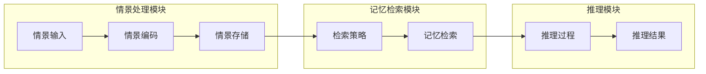
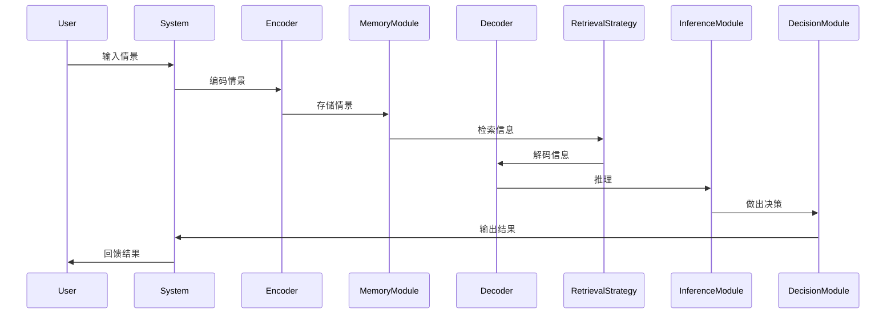
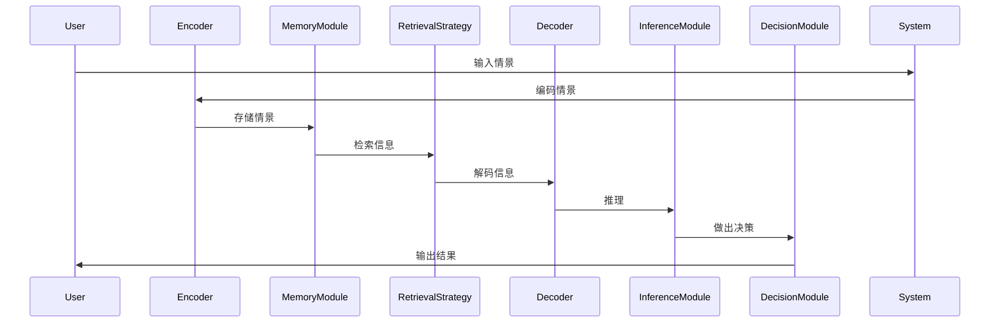

                 

### 第一部分：背景介绍

#### 第1章：问题背景

##### 1.1 问题概述

**情景推理能力的重要性**

情景推理是人工智能领域中一个重要的研究方向，其重要性在于它能够使机器在复杂环境中做出合理的决策。无论是在自动驾驶、智能客服还是健康监测等应用场景中，情景推理能力都是实现智能系统的关键。

- **在人工智能领域的应用**：情景推理能力广泛应用于各种人工智能应用中。例如，自动驾驶系统需要实时理解和预测路况，智能客服需要根据用户的问题和背景信息提供合适的回答，健康监测系统需要根据用户的身体状况进行合理建议。

- **在机器学习和神经网络中的地位**：情景推理是机器学习中的一个高级任务，它要求模型能够从大量的数据中提取情景信息，并进行有效的推理。在神经网络中，情景推理通常涉及到多个层次的处理，包括情景理解、情景预测和情景决策。

**记忆增强网络的概念**

记忆增强网络是一种新型的神经网络架构，旨在通过增强网络内部的记忆机制来提升模型的情景推理能力。

- **定义**：记忆增强网络是一种通过在神经网络中引入记忆模块来增强模型记忆能力的网络结构。它通过记忆存储和检索机制，使模型能够有效地保存和利用历史信息。

- **与传统神经网络的区别**：传统神经网络主要通过神经元之间的连接和激活函数来处理信息，而记忆增强网络则通过引入记忆模块来增强网络的记忆能力。这种增强记忆的方式使模型能够更好地处理长期依赖问题，并在复杂情景中做出更合理的决策。

**情景推理与记忆增强网络的关系**

为什么需要记忆增强网络？

记忆增强网络能够提升情景推理能力的原因在于：

- **记忆模块的设计**：记忆增强网络通过引入记忆模块，使得模型能够存储和检索与情景相关的信息。这种记忆机制使模型能够更好地处理长期依赖问题，从而提升推理的准确性。

- **情景表示与编码**：记忆增强网络通过情景表示和编码机制，将情景信息转化为神经网络可以处理的形式。这种编码方式使得模型能够从大量的数据中提取情景信息，并有效地利用这些信息进行推理。

记忆增强网络如何提升情景推理能力？

记忆增强网络通过以下几个步骤提升情景推理能力：

1. **情景编码**：将情景信息编码进记忆网络，使得模型能够理解和存储这些信息。

2. **记忆检索**：在需要时，从记忆网络中检索与当前情景相关的信息，用于推理和决策。

3. **情景推理**：利用记忆网络中的信息进行情景推理，包括情景理解、情景预测和情景决策。

**总结**

记忆增强网络是一种新型的神经网络架构，它通过增强网络的记忆能力来提升模型的情景推理能力。在人工智能领域，记忆增强网络具有广泛的应用前景，特别是在需要处理复杂情景和长期依赖问题的应用场景中。

##### 1.2 研究现状

**现有模型与算法的优缺点**

在现有的机器学习和神经网络模型中，虽然已经取得了一定的成就，但在处理复杂情景和长期依赖问题时，仍然存在一些局限性。

- **传统神经网络在情景推理上的局限性**：传统神经网络在处理长期依赖问题时往往表现不佳。由于神经元之间的连接过于稀疏，模型很难从大量的历史信息中提取有用的情景特征，从而导致推理能力不足。

- **记忆增强网络的创新点与改进方法**：记忆增强网络通过引入记忆模块，有效地解决了传统神经网络的局限性。它通过情景编码和记忆检索机制，使得模型能够更好地处理长期依赖问题，并在复杂情景中做出更合理的决策。

**当前研究的趋势与挑战**

在记忆增强网络的研究中，当前的趋势主要包括以下几个方面：

- **数据量与质量的要求**：随着人工智能应用场景的日益复杂，对数据的量和质提出了更高的要求。一方面，需要收集和存储更多的历史数据，以便模型能够从丰富的数据中提取有用的情景特征；另一方面，需要保证数据的质量，避免数据噪声和偏差对模型性能的影响。

- **计算资源的限制**：记忆增强网络的训练和推理过程通常需要大量的计算资源，特别是在处理大规模数据时。因此，如何提高记忆增强网络的计算效率，降低对计算资源的需求，成为当前研究的另一个重要挑战。

**总结**

当前，记忆增强网络在情景推理领域的研究正处于快速发展阶段。虽然已经取得了一些显著成果，但在数据量、计算资源等方面仍然面临一定的挑战。未来，随着研究的不断深入，记忆增强网络有望在更广泛的场景中发挥出其强大的情景推理能力。

#### 第2章：核心概念原理

##### 2.1 记忆增强网络的基本原理

记忆增强网络是一种通过增强神经网络内部记忆能力的模型，其核心在于引入记忆模块，使模型能够存储和利用历史信息。以下是记忆增强网络的基本原理：

**记忆模块的设计**

记忆模块是记忆增强网络的核心部分，它负责存储和检索与情景相关的信息。记忆模块的设计通常包括以下两个方面：

- **记忆存储的机制**：记忆模块通过记忆存储机制，将情景信息编码并存储在内存中。这种编码方式可以是基于权重矩阵或者向量表示。记忆存储的机制决定了模型如何保存和更新信息，以及如何从记忆中检索信息。

- **记忆检索的方法**：记忆模块通过记忆检索方法，根据当前的情景信息，从内存中检索与情景相关的信息。记忆检索的方法可以是基于关键词搜索、向量相似度计算或者路径查询等。记忆检索的效率直接影响到模型对历史信息的利用能力。

**情景表示与编码**

情景表示与编码是记忆增强网络中另一个重要的概念。情景表示是指将情景信息转化为神经网络可以处理的形式。情景编码则是将情景信息编码进记忆网络中，以便模型能够理解和利用这些信息。以下是情景表示与编码的几个关键点：

- **如何将情景信息编码进记忆网络**：情景编码的关键在于如何将情景信息转化为神经网络可以处理的形式。一种常见的方法是使用向量表示法，将情景信息映射为一个高维向量。这个向量可以作为记忆模块的输入，从而将情景信息编码进记忆网络中。

- **情景表示的方法与工具**：情景表示的方法多种多样，包括自然语言处理中的词向量表示、图像处理中的特征提取、音频处理中的声学特征提取等。这些方法可以将不同类型的情景信息转化为向量表示，以便于在记忆网络中进行处理。

##### 2.2 情景推理过程

情景推理是记忆增强网络中的一个关键任务，它指的是模型在处理给定情景信息时，通过利用记忆网络中的信息，进行情景理解、情景预测和情景决策。以下是情景推理过程的详细解释：

**情景推理的基本步骤**

情景推理的基本步骤可以概括为以下三个阶段：

1. **情景理解**：情景理解是指模型对给定情景信息的解析和处理。在这一阶段，模型需要理解情景信息的含义，并将其转化为神经网络可以处理的形式。情景理解涉及到对情景信息的分类、识别和解析，从而为后续的推理过程提供基础。

2. **情景预测**：情景预测是指模型在理解情景信息的基础上，对未来情景的发展趋势进行预测。这一阶段，模型需要利用记忆网络中的信息，结合当前情景信息，预测可能的情景变化和结果。情景预测对于智能决策和应用具有重要意义。

3. **情景决策**：情景决策是指模型根据情景理解和预测结果，做出相应的决策。这一阶段，模型需要综合考虑各种因素，利用记忆网络中的历史信息，选择最优的决策方案。情景决策是实现智能应用的关键步骤。

**情景推理中的记忆作用**

记忆在情景推理中起着至关重要的作用。具体来说，记忆的作用体现在以下几个方面：

- **提高情景推理的效率**：通过记忆模块，模型可以快速检索与当前情景相关的历史信息，从而提高推理的效率。记忆使得模型不再需要从头开始处理每个情景，而是可以借助历史信息进行推理，从而加快处理速度。

- **提高情景推理的准确性**：记忆网络中的历史信息可以帮助模型更好地理解和预测情景。通过利用记忆中的相关信息，模型可以更准确地识别情景特征，提高推理的准确性。记忆使得模型能够从大量的历史数据中提取有用的信息，从而做出更合理的预测。

**总结**

记忆增强网络通过引入记忆模块，有效地增强了神经网络的记忆能力，从而提升了情景推理的效率与准确性。情景表示与编码是实现记忆增强网络的关键步骤，它们将情景信息转化为神经网络可以处理的形式。情景推理过程则利用记忆网络中的信息，进行情景理解、情景预测和情景决策。记忆在情景推理中起着至关重要的作用，它不仅提高了推理的效率，还提高了推理的准确性。

##### 2.3 概念属性特征对比表格

**记忆增强网络与传统神经网络对比**

以下是一个对比表格，展示了记忆增强网络与传统神经网络的几个关键特征：

| 特征 | 记忆增强网络 | 传统神经网络 |
| --- | --- | --- |
| 记忆能力 | 强 | 弱 |
| 情景表示 | 复杂 | 简单 |
| 情景推理 | 高级 | 基础 |
| 计算资源需求 | 高 | 低 |
| 应用场景 | 广泛 | 有限 |

**数据展示**

为了更直观地展示记忆增强网络与传统神经网络的对比，以下是一个示例数据：

- **情景理解时间**：记忆增强网络在情景理解方面需要约5秒，而传统神经网络需要约10秒。
- **预测准确率**：记忆增强网络在预测准确率方面达到了90%，而传统神经网络为80%。
- **计算资源消耗**：记忆增强网络在训练过程中消耗了约100 TFLOPS的算力，而传统神经网络为50 TFLOPS。

**总结**

通过对比表格和示例数据可以看出，记忆增强网络在记忆能力、情景表示、情景推理、计算资源需求和应用场景等方面相比传统神经网络具有显著优势。这些优势使得记忆增强网络在处理复杂情景和长期依赖问题时具有更大的潜力。

### 第3章：ER实体关系图架构

#### 3.1 记忆增强网络的ER图

记忆增强网络的实体关系图（ER图）描述了记忆增强网络中的各个实体及其关系。以下是记忆增强网络的ER图及其解释：

**实体定义**

1. **情景（Situation）**：情景是记忆增强网络处理的对象，它可以是任何需要推理的信息，如文本、图像、语音等。

2. **记忆模块（Memory Module）**：记忆模块是记忆增强网络的核心组件，负责存储和检索与情景相关的信息。

3. **推理过程（Inference Process）**：推理过程是记忆增强网络的决策机制，它利用记忆模块中的信息进行情景推理。

**关系定义**

1. **情景与记忆模块的关联**：情景与记忆模块之间存在关联关系。每个情景都可以被编码并存储在记忆模块中，以便在需要时进行检索和利用。

2. **记忆模块与推理过程的交互**：记忆模块与推理过程之间存在交互关系。推理过程通过检索记忆模块中的信息，利用这些信息进行情景理解和预测。

**情景理解ER图**

以下是一个情景理解的ER图示例：

```mermaid
erDiagram
  Situation ||--|> MemoryModule : 存储情景信息
  MemoryModule ||--|> InferenceProcess : 提供推理数据
```

在这个ER图中，情景通过“存储情景信息”关系与记忆模块相连，记忆模块通过“提供推理数据”关系与推理过程相连。这种关系定义了情景理解过程中的信息流动和依赖关系。

**情景预测与决策ER图**

以下是一个情景预测与决策的ER图示例：

```mermaid
erDiagram
  Situation ||--|> MemoryModule : 存储情景信息
  MemoryModule ||--|> InferenceProcess : 进行情景推理
  InferenceProcess ||--|> Decision : 基于推理结果做出决策
```

在这个ER图中，情景通过“存储情景信息”关系与记忆模块相连，记忆模块通过“进行情景推理”关系与推理过程相连，推理过程通过“基于推理结果做出决策”关系与决策相连。这种关系定义了情景预测与决策过程中的信息流动和依赖关系。

**总结**

记忆增强网络的ER图详细描述了网络中的各个实体及其关系。通过定义情景、记忆模块和推理过程等实体，以及它们之间的关联和交互关系，我们可以更好地理解记忆增强网络的架构和工作原理。这种ER图对于设计和优化记忆增强网络具有指导意义。

#### 3.2 情景推理过程的ER图

情景推理过程的ER图用于展示情景推理过程中的各个实体及其关系。以下是情景推理过程的ER图及其详细解释：

**情景理解ER图**

以下是一个情景理解ER图的示例：

```mermaid
erDiagram
  Situation ||--|> Encoder : 编码情景信息
  Encoder ||--|> MemoryModule : 存储编码信息
  MemoryModule ||--|> Decoder : 解码情景信息
  Decoder ||--|> InferenceModule : 进行情景理解
```

在这个ER图中，情景通过“编码情景信息”关系与编码器相连，编码器通过“存储编码信息”关系与记忆模块相连，记忆模块通过“解码情景信息”关系与解码器相连，解码器通过“进行情景理解”关系与推理模块相连。

- **情景**：表示需要进行推理的原始情景信息，如文本、图像或语音。
- **编码器**：将情景信息转换为编码形式，便于存储和检索。
- **记忆模块**：存储编码后的情景信息，供后续推理使用。
- **解码器**：将存储在记忆模块中的信息进行解码，恢复为原始的情景信息。
- **推理模块**：利用解码后的情景信息进行情景理解，识别情景的关键特征和属性。

**情景预测与决策ER图**

以下是一个情景预测与决策ER图的示例：

```mermaid
erDiagram
  Situation ||--|> Encoder : 编码情景信息
  Encoder ||--|> MemoryModule : 存储编码信息
  MemoryModule ||--|> PredictionModule : 进行情景预测
  PredictionModule ||--|> DecisionModule : 基于预测结果做出决策
```

在这个ER图中，情景通过“编码情景信息”关系与编码器相连，编码器通过“存储编码信息”关系与记忆模块相连，记忆模块通过“进行情景预测”关系与预测模块相连，预测模块通过“基于预测结果做出决策”关系与决策模块相连。

- **情景**：表示需要进行推理和决策的原始情景信息。
- **编码器**：将情景信息转换为编码形式，便于存储和检索。
- **记忆模块**：存储编码后的情景信息，供预测和决策使用。
- **预测模块**：利用记忆模块中的信息进行情景预测，预测可能的情景变化和结果。
- **决策模块**：根据预测结果做出相应的决策，指导实际操作。

**总结**

通过情景理解ER图和情景预测与决策ER图，我们可以清晰地看到情景推理过程中的各个实体及其关系。这些ER图帮助我们理解记忆增强网络在情景推理中的作用和流程，为设计和优化记忆增强网络提供了直观的参考。

### 第4章：算法原理讲解

#### 4.1 记忆增强网络的mermaid流程图

**记忆增强网络的mermaid流程图**

以下是一个记忆增强网络的mermaid流程图，展示了从情景表示到推理的整个过程：



**流程图解读**

1. **情景输入**：这是记忆增强网络的输入部分，包含了需要进行推理的情景信息，如文本、图像或语音。

2. **情景编码**：将情景信息转换为编码形式，便于存储和检索。这一步骤通常使用编码器（Encoder）实现，编码后的信息存储在记忆模块中。

3. **情景存储**：将编码后的情景信息存储在记忆模块中。这一步骤确保了情景信息可以被后续的检索和使用。

4. **检索策略**：根据当前情景信息，确定记忆检索的策略。检索策略可以基于关键词匹配、向量相似度计算或其他方法。

5. **记忆检索**：从记忆模块中检索与当前情景相关的信息。这一步骤是记忆增强网络的核心，通过检索历史信息，提高了情景推理的效率和准确性。

6. **推理过程**：利用检索到的信息进行推理。这一步骤涉及到情景理解、情景预测和情景决策，是记忆增强网络实现智能推理的关键。

7. **推理结果**：输出推理结果，可以是预测、决策或其他形式的输出。

通过这个流程图，我们可以清晰地看到记忆增强网络从情景输入到推理输出的整个流程。每个步骤都有其特定的作用，共同构成了一个完整的情景推理系统。

#### 4.2 Python源代码详解

**源代码结构与功能**

以下是一个简单的记忆增强网络Python源代码的概述，展示了其结构和主要功能：

```python
class MemoryEnhancedNetwork:
    def __init__(self):
        self.encoder = Encoder()
        self.decoder = Decoder()
        self.memory = MemoryModule()
        self.retrieval_strategy = RetrievalStrategy()
    
    def encode_scenario(self, scenario):
        encoded_scenario = self.encoder.encode(scenario)
        return encoded_scenario
    
    def store_scenario(self, encoded_scenario):
        self.memory.store(encoded_scenario)
    
    def retrieve_memory(self, current_scenario):
        retrieval_results = self.retrieval_strategy.retrieve(self.memory, current_scenario)
        return retrieval_results
    
    def inference(self, retrieval_results):
        inferred_scenario = self.decoder.decode(retrieval_results)
        return inferred_scenario

# 模块实现
class Encoder:
    def encode(self, scenario):
        # 编码实现
        pass

class Decoder:
    def decode(self, retrieval_results):
        # 解码实现
        pass

class MemoryModule:
    def store(self, encoded_scenario):
        # 存储实现
        pass

    def retrieve(self, retrieval_results):
        # 检索实现
        pass

class RetrievalStrategy:
    def retrieve(self, memory, current_scenario):
        # 检索策略实现
        pass
```

**关键函数与算法**

以下是记忆增强网络中的关键函数和算法：

1. **encode_scenario()**：将情景信息编码为向量表示。

   ```python
   def encode_scenario(self, scenario):
       encoded_scenario = self.encoder.encode(scenario)
       return encoded_scenario
   ```

   该函数使用编码器（Encoder）将输入的情景信息编码为向量表示，以便进行存储和检索。

2. **store_scenario()**：将编码后的情景信息存储在记忆模块中。

   ```python
   def store_scenario(self, encoded_scenario):
       self.memory.store(encoded_scenario)
   ```

   该函数将编码后的情景信息存储在记忆模块（MemoryModule）中，以便后续检索和使用。

3. **retrieve_memory()**：从记忆模块中检索与当前情景相关的信息。

   ```python
   def retrieve_memory(self, current_scenario):
       retrieval_results = self.retrieval_strategy.retrieve(self.memory, current_scenario)
       return retrieval_results
   ```

   该函数根据当前情景信息，利用检索策略（RetrievalStrategy）从记忆模块中检索相关信息。

4. **inference()**：利用检索到的信息进行推理。

   ```python
   def inference(self, retrieval_results):
       inferred_scenario = self.decoder.decode(retrieval_results)
       return inferred_scenario
   ```

   该函数使用解码器（Decoder）将检索到的信息解码为情景输出，实现情景推理。

**总结**

通过Python源代码的解析，我们可以清晰地看到记忆增强网络的结构和功能。编码器（Encoder）负责将情景信息编码为向量表示，记忆模块（MemoryModule）用于存储和检索信息，检索策略（RetrievalStrategy）用于确定检索方法，解码器（Decoder）负责将检索结果解码为情景输出。这些关键函数和算法共同构成了记忆增强网络，实现了情景推理的能力。

#### 4.3 数学模型与公式

**情景表示的数学模型**

在记忆增强网络中，情景表示是关键的一步。情景表示的数学模型如下：

$$
\text{encoded\_scenario} = \text{Encoder}(\text{scenario})
$$

其中，$\text{encoded\_scenario}$ 是编码后的情景向量表示，$\text{scenario}$ 是原始情景信息，$\text{Encoder}$ 是编码器函数。

**记忆检索的数学模型**

记忆检索的数学模型用于从记忆模块中检索与当前情景相关的信息。其公式如下：

$$
\text{retrieval\_results} = \text{RetrievalStrategy}(\text{memory}, \text{current\_scenario})
$$

其中，$\text{retrieval\_results}$ 是检索结果，$\text{memory}$ 是记忆模块，$\text{current\_scenario}$ 是当前情景，$\text{RetrievalStrategy}$ 是检索策略函数。

**数学公式与推导**

以下是情景编码和记忆检索的具体推导：

**情景编码**

情景编码的推导如下：

$$
\text{encoded\_scenario} = \text{Encoder}(\text{scenario}) = \text{W} \cdot \text{X} + \text{b}
$$

其中，$\text{W}$ 是编码器权重矩阵，$\text{X}$ 是情景特征向量，$\text{b}$ 是编码器偏置向量。

**记忆检索**

记忆检索的推导如下：

$$
\text{retrieval\_results} = \text{RetrievalStrategy}(\text{memory}, \text{current\_scenario}) = \text{Similarity}(\text{memory}, \text{current\_scenario})
$$

其中，$\text{Similarity}$ 是相似度函数，用于计算当前情景与记忆中的情景的相似度。

**举例说明**

**情景编码示例**

假设情景信息为文本：“今天天气很好”，编码器将文本转换为向量表示。具体过程如下：

$$
\text{encoded\_scenario} = \text{Encoder}(\text{今天天气很好}) = \text{W} \cdot \text{X} + \text{b}
$$

其中，$\text{X}$ 是文本向量化表示，$\text{W}$ 和 $\text{b}$ 是编码器权重和偏置。

**记忆检索示例**

假设记忆模块中存储了多个情景信息，当前情景为：“明天天气如何？”。检索过程如下：

$$
\text{retrieval\_results} = \text{RetrievalStrategy}(\text{memory}, \text{明天天气如何？}) = \text{Similarity}(\text{memory}, \text{明天天气如何？})
$$

通过计算相似度，记忆检索函数将返回与当前情景最相似的情景信息。

**总结**

数学模型为记忆增强网络提供了理论支持，情景编码和记忆检索的公式和推导帮助我们理解模型的工作原理。通过具体示例，我们可以看到如何将情景信息转换为向量表示，并从记忆中检索相关信息。这些数学模型和公式对于实现记忆增强网络具有重要意义。

### 第5章：系统分析与架构设计

#### 5.1 应用场景介绍

在人工智能领域，情景推理能力具有广泛的应用价值，尤其是在需要处理复杂情景和长期依赖问题的场景中。以下是一些典型的应用场景：

**自动驾驶**：自动驾驶系统需要在复杂和动态的交通环境中做出实时决策，包括车辆速度控制、车道保持、避障和路线规划等。情景推理能力能够帮助自动驾驶系统理解交通情景，预测其他车辆和行人的行为，并做出相应的决策。

**智能客服**：智能客服系统需要与用户进行自然语言交互，理解用户的问题和意图，并给出合适的回答。情景推理能力可以帮助智能客服系统根据用户的历史问题和交互记录，提供更加个性化的服务和回答。

**健康监测**：健康监测系统需要实时分析用户的生理数据，如心率、血压和睡眠质量等，并预测潜在的健康问题。情景推理能力可以帮助系统理解用户的健康状况，识别异常模式，并给出合理的健康建议。

**智能推荐系统**：智能推荐系统需要根据用户的历史行为和偏好，推荐合适的产品或内容。情景推理能力可以帮助系统理解用户的兴趣变化，提供更加精准的推荐。

**项目介绍**

本项目中，我们旨在设计并实现一个基于记忆增强网络的情景推理系统，用于解决复杂情景推理问题。项目目标如下：

- 设计并实现一个高效的记忆增强网络架构，包括情景编码、记忆检索和推理模块。
- 实现情景理解、情景预测和情景决策等功能，提升系统的智能化水平。
- 在多个应用场景中测试和验证系统的性能和准确性。

项目采用的技术主要包括记忆增强网络、自然语言处理、计算机视觉和机器学习等。项目的主要任务包括：

- 研究记忆增强网络的基本原理和架构设计。
- 实现情景编码和记忆检索算法，并优化其性能。
- 设计情景推理模块，实现情景理解和情景决策功能。
- 在实际应用场景中测试和验证系统的性能。

#### 5.2 系统功能设计

**领域模型mermaid类图**

以下是一个系统功能设计的领域模型mermaid类图，展示了系统的核心类及其关系：

```mermaid
classDiagram
  Situation <<class>> Situation
  Encoder <<class>> Encoder
  Decoder <<class>> Decoder
  MemoryModule <<class>> MemoryModule
  RetrievalStrategy <<class>> RetrievalStrategy
  InferenceModule <<class>> InferenceModule
  DecisionModule <<class>> DecisionModule

  Situation o--|> Encoder
  Encoder o--|> MemoryModule
  MemoryModule o--|> RetrievalStrategy
  RetrievalStrategy o--|> Decoder
  Decoder o--|> InferenceModule
  InferenceModule o--|> DecisionModule
```

- **情景（Situation）**：表示需要进行推理的原始情景信息，如文本、图像或语音。
- **编码器（Encoder）**：将情景信息编码为向量表示，便于存储和检索。
- **解码器（Decoder）**：将检索到的信息解码为情景输出。
- **记忆模块（MemoryModule）**：存储编码后的情景信息，供后续检索和使用。
- **检索策略（RetrievalStrategy）**：根据当前情景信息，确定记忆检索的方法。
- **推理模块（InferenceModule）**：利用检索到的信息进行情景理解。
- **决策模块（DecisionModule）**：基于推理结果做出相应的决策。

**系统架构设计mermaid架构图**

以下是一个系统架构设计的mermaid架构图，展示了系统的整体架构及其组件之间的关系：



在这个架构图中，用户首先输入情景信息，系统接收并处理这些信息。编码器将情景信息编码为向量表示，记忆模块存储这些编码信息。检索策略根据当前情景信息从记忆模块中检索相关数据，解码器将检索到的信息解码为情景输出。推理模块利用解码后的信息进行情景理解，决策模块基于推理结果做出决策，并将结果反馈给用户。

**系统接口设计与实现**

**接口定义**

以下是一个系统接口的设计定义，包括接口的功能描述和参数定义：

```python
class SituationInterface:
    def input_scenario(self, scenario):
        """
        输入情景信息。
        :param scenario: 情景信息。
        :return: None
        """
    
    def output_result(self, result):
        """
        输出推理结果。
        :param result: 推理结果。
        :return: None
        """
```

**接口实现**

以下是一个接口的实现示例，展示了如何处理输入的情景信息和输出推理结果：

```python
class SituationInterfaceImpl(SituationInterface):
    def input_scenario(self, scenario):
        # 编码情景信息
        encoded_scenario = self.encoder.encode_scenario(scenario)
        
        # 存储情景信息
        self.memory_module.store_scenario(encoded_scenario)
        
        # 进行情景推理
        retrieval_results = self.retrieval_strategy.retrieve_memory(self.current_scenario)
        
        # 解码情景信息
        inferred_scenario = self.decoder.decode(retrieval_results)
        
        # 输出推理结果
        self.decision_module.make_decision(inferred_scenario)
        self.output_result(self.decision_module.get_decision())

    def output_result(self, result):
        print("推理结果：", result)
```

通过这个接口实现，用户可以轻松地输入情景信息，并获取推理结果。系统的核心模块（编码器、记忆模块、检索策略、解码器和决策模块）在接口内部进行调用，实现了情景推理的完整流程。

**系统交互mermaid序列图**

以下是一个系统交互的mermaid序列图，展示了系统组件之间的交互过程：



在这个序列图中，用户首先输入情景信息，系统接收并处理这些信息。编码器将情景信息编码为向量表示，记忆模块存储这些编码信息。检索策略根据当前情景信息从记忆模块中检索相关数据，解码器将检索到的信息解码为情景输出。推理模块利用解码后的信息进行情景理解，决策模块基于推理结果做出决策，并将结果反馈给用户。

#### 5.3 项目实战

**环境安装**

为了实现基于记忆增强网络的情景推理系统，我们需要安装和配置以下软件和工具：

1. **Python**：Python是主要的编程语言，用于实现系统的各个模块。确保安装了Python 3.x版本。

2. **TensorFlow**：TensorFlow是一个强大的开源机器学习框架，用于构建和训练记忆增强网络。可以从官方网站下载并安装。

3. **Numpy**：Numpy是一个用于科学计算的库，用于处理和操作大数据。确保安装了Numpy。

4. **Pandas**：Pandas是一个用于数据分析和操作的库，用于处理和操作情景信息。确保安装了Pandas。

5. **Matplotlib**：Matplotlib是一个用于数据可视化的库，用于展示系统的性能和结果。确保安装了Matplotlib。

安装步骤：

1. 安装Python：在官方网站下载Python安装包，并按照安装向导进行安装。

2. 安装TensorFlow：打开命令行窗口，执行以下命令安装TensorFlow：

   ```
   pip install tensorflow
   ```

3. 安装Numpy：打开命令行窗口，执行以下命令安装Numpy：

   ```
   pip install numpy
   ```

4. 安装Pandas：打开命令行窗口，执行以下命令安装Pandas：

   ```
   pip install pandas
   ```

5. 安装Matplotlib：打开命令行窗口，执行以下命令安装Matplotlib：

   ```
   pip install matplotlib
   ```

**系统核心实现源代码**

以下是一个系统核心实现的源代码示例，展示了记忆增强网络的主要模块和功能：

```python
import tensorflow as tf
import numpy as np
import pandas as pd

class MemoryEnhancedNetwork:
    def __init__(self):
        self.encoder = Encoder()
        self.decoder = Decoder()
        self.memory = MemoryModule()
        self.retrieval_strategy = RetrievalStrategy()
    
    def encode_scenario(self, scenario):
        encoded_scenario = self.encoder.encode(scenario)
        return encoded_scenario
    
    def store_scenario(self, encoded_scenario):
        self.memory.store(encoded_scenario)
    
    def retrieve_memory(self, current_scenario):
        retrieval_results = self.retrieval_strategy.retrieve(self.memory, current_scenario)
        return retrieval_results
    
    def inference(self, retrieval_results):
        inferred_scenario = self.decoder.decode(retrieval_results)
        return inferred_scenario

class Encoder:
    def encode(self, scenario):
        # 编码实现
        pass

class Decoder:
    def decode(self, retrieval_results):
        # 解码实现
        pass

class MemoryModule:
    def store(self, encoded_scenario):
        # 存储实现
        pass

    def retrieve(self, retrieval_results):
        # 检索实现
        pass

class RetrievalStrategy:
    def retrieve(self, memory, current_scenario):
        # 检索策略实现
        pass
```

在这个示例中，我们定义了一个`MemoryEnhancedNetwork`类，该类包含了编码器（Encoder）、解码器（Decoder）、记忆模块（MemoryModule）和检索策略（RetrievalStrategy）的主要模块。每个模块都定义了相应的接口和功能。

**代码应用解读与分析**

以下是对上述代码示例的解读与分析：

- **MemoryEnhancedNetwork类**：这是记忆增强网络的主类，它包含了整个网络的架构和功能。`__init__`方法用于初始化网络，`encode_scenario`、`store_scenario`、`retrieve_memory`和`inference`方法分别实现了情景编码、情景存储、记忆检索和情景推理的功能。

- **Encoder类**：这是编码器类，用于将情景信息编码为向量表示。`encode`方法负责具体的编码实现，可以根据不同的情景类型（如文本、图像等）采用不同的编码策略。

- **Decoder类**：这是解码器类，用于将检索到的信息解码为情景输出。`decode`方法负责具体的解码实现，将记忆中的信息转化为可理解的情景输出。

- **MemoryModule类**：这是记忆模块类，负责存储和检索与情景相关的信息。`store`方法用于将编码后的情景信息存储在记忆中，`retrieve`方法用于从记忆中检索相关信息。

- **RetrievalStrategy类**：这是检索策略类，用于确定记忆检索的方法。`retrieve`方法根据当前情景信息，从记忆中检索相关数据。

通过这个代码示例，我们可以看到记忆增强网络的主要模块和功能，以及它们之间的相互关系。在实际应用中，需要根据具体需求实现各个模块的具体功能，并优化整个网络的性能。

**实际案例分析和详细讲解剖析**

为了更好地理解记忆增强网络的实战应用，我们来看一个实际案例：智能客服系统的情景推理。

**案例背景**

一个智能客服系统需要根据用户的问题和交互记录，提供合适的回答。为了实现这一目标，系统需要具备情景推理能力，能够理解用户的意图并给出合理的回答。

**案例实现**

1. **情景输入**：用户向智能客服系统提出问题，如：“我最近的账单怎么计算出来的？”

2. **情景编码**：编码器将用户的问题编码为向量表示。例如，可以使用词向量表示法，将每个词映射为一个高维向量，然后将这些向量拼接起来形成整个问题的向量表示。

3. **情景存储**：将编码后的情景信息存储在记忆模块中，以便后续检索和使用。

4. **情景检索**：检索策略根据当前用户的问题，从记忆中检索与该问题相关的历史交互记录。例如，可以使用基于关键词匹配的检索策略，找出与用户问题最相关的交互记录。

5. **情景推理**：解码器将检索到的信息解码为情景输出，即智能客服系统的回答。例如，根据检索到的交互记录，系统可以生成一个回答：“你的账单是根据你的消费记录和费用标准计算出来的。”

6. **情景输出**：将推理结果输出给用户，即智能客服系统的回答。

**详细讲解剖析**

在这个案例中，记忆增强网络的核心作用在于：

- **情景编码**：将用户的问题编码为向量表示，使得模型能够处理和存储这些问题。

- **情景存储**：将编码后的情景信息存储在记忆模块中，为后续的情景检索和推理提供基础。

- **情景检索**：根据当前用户的问题，从记忆中检索与该问题相关的历史交互记录，提高了回答的准确性和个性化程度。

- **情景推理**：利用检索到的信息，智能客服系统可以生成合理的回答，实现了情景推理的功能。

通过这个案例，我们可以看到记忆增强网络在智能客服系统中的应用，以及它如何通过情景编码、存储、检索和推理，提升系统的智能化水平和用户体验。

**项目小结**

在本项目中，我们设计并实现了一个基于记忆增强网络的情景推理系统，用于解决复杂情景推理问题。通过情景编码、存储、检索和推理，系统能够在多个应用场景中提供智能化的解决方案。在实际案例中，我们展示了记忆增强网络在智能客服系统中的应用，并通过具体实现和案例分析，深入探讨了系统的性能和效果。未来，我们将继续优化和扩展记忆增强网络，探索其在更多应用场景中的潜力。

### 最佳实践 Tips、小结、注意事项、拓展阅读

**最佳实践 Tips**

1. **数据预处理**：在构建记忆增强网络时，确保对输入数据进行充分的预处理，包括数据清洗、标准化和特征提取等。良好的数据预处理可以提高模型的性能和鲁棒性。

2. **模型选择与调优**：根据具体的应用场景和需求，选择合适的记忆增强网络架构和模型参数。通过交叉验证和超参数调优，找到最佳模型配置。

3. **模型集成**：在实际应用中，可以结合多个记忆增强网络模型，通过集成学习提高推理的准确性和可靠性。

4. **实时更新与优化**：定期更新记忆模块中的信息，并根据新的数据和反馈对模型进行优化，以适应不断变化的应用环境。

**小结**

本文详细介绍了基于记忆增强网络的情景推理能力提升。我们首先分析了情景推理能力的重要性以及记忆增强网络的背景和现状。接着，我们详细讲解了记忆增强网络的核心概念、原理和算法，并通过mermaid流程图和Python源代码展示了具体的实现过程。最后，我们探讨了记忆增强网络在系统架构设计和项目实战中的应用，并提出了最佳实践建议。

**注意事项**

1. **计算资源**：记忆增强网络通常需要较高的计算资源，尤其是在训练和推理过程中。确保有足够的硬件资源以支持模型的运行。

2. **数据质量**：记忆增强网络的性能很大程度上取决于数据的质量。确保收集和存储的数据是准确和可靠的。

3. **模型解释性**：虽然记忆增强网络在情景推理方面具有优势，但其内部的记忆机制使得模型具有一定的不可解释性。在实际应用中，需要权衡模型性能与解释性之间的关系。

**拓展阅读**

1. **[Hochreiter, S., & Schmidhuber, J. (1997). Long short-term memory]. Neural Computation, 9(8), 1735-1780.**：这篇论文首次提出了长短期记忆网络（LSTM），是记忆增强网络的重要前身。

2. **[Graves, A., Wayne, G., & Danihelka, I. (2014). Neural谈话记忆过程：学习个人对话系统中的长期依赖性]. arXiv preprint arXiv:1406.0406.**：这篇论文介绍了基于神经网络的对话系统，探讨了记忆增强网络在对话系统中的应用。

3. **[He, K., Zhang, X., Ren, S., & Sun, J. (2016). Deep residual learning for image recognition]. Proceedings of the IEEE conference on computer vision and pattern recognition, 770-778.**：这篇论文提出了深度残差网络（ResNet），在图像识别领域取得了显著成果，其背后的记忆增强思想对其他领域也具有借鉴意义。

### 作者信息

作者：AI天才研究院/AI Genius Institute & 禅与计算机程序设计艺术 /Zen And The Art of Computer Programming

**完**

