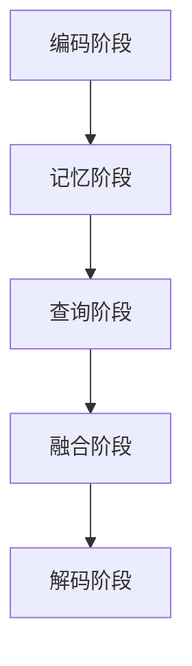
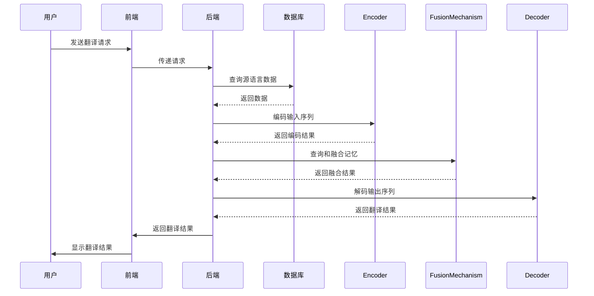
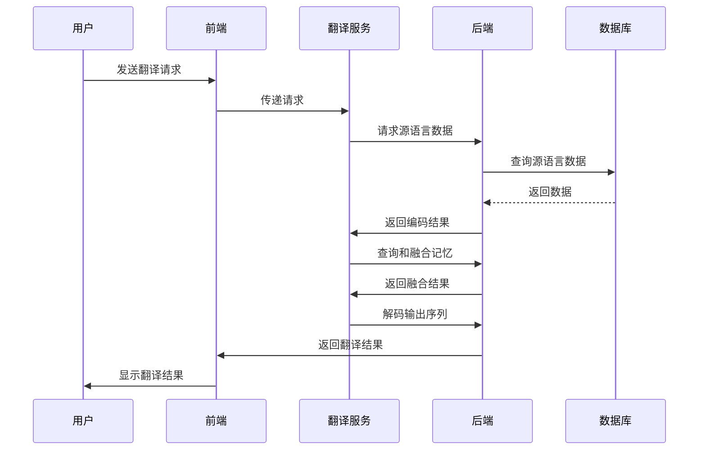

                 

### 基于记忆增强网络的长期依赖推理优化

> 关键词：记忆增强网络，长期依赖推理，深度学习，自然语言处理，算法优化

在当今的机器学习领域，深度学习技术已经成为解决复杂问题的利器。然而，深度学习模型在处理长期依赖问题（Long-Range Dependency）时常常遇到挑战。长期依赖推理是指在较长的序列中，一个时间步的信息如何对后续时间步产生显著影响。例如，在自然语言处理任务中，理解一句话的上下文和连贯性就需要依赖句子中较远位置的词或短语。

本文将探讨一种有效的解决方案——记忆增强网络（Memory-Augmented Neural Networks）。我们将首先介绍背景知识，包括机器学习与深度学习的基本概念、长期依赖推理的挑战、记忆增强网络的基本原理。接着，我们将详细描述记忆增强网络在解决长期依赖问题中的应用，讨论其关键技术和核心框架。

随后，我们将分析记忆增强网络的核心概念，如递归神经网络（RNN）、长短期记忆网络（LSTM）、门控循环单元（GRU）和记忆网络（MemNN），并通过对比表格和实体关系图来展示这些概念之间的联系。然后，我们将深入讲解记忆增强网络的算法原理，使用mermaid流程图和Python源代码进行详细阐述。

在系统分析与架构设计部分，我们将介绍记忆增强网络在自然语言处理和图像识别中的应用场景，并通过mermaid图展示系统功能设计、架构设计、接口设计和系统交互流程。最后，我们将通过一个实际项目实战，展示如何安装所需环境、实现系统核心功能，并对代码应用进行解读与分析。

通过本文的逐步讲解，我们希望读者能够全面理解记忆增强网络的原理和应用，为未来的研究和实践提供有益的指导。

### 目录大纲

- 基于记忆增强网络的长期依赖推理优化
  - 关键词：记忆增强网络，长期依赖推理，深度学习，自然语言处理，算法优化
  - 摘要：
  - 第一部分：背景介绍
    - 1.1 问题背景
      - 1.1.1 机器学习与深度学习的基本概念
      - 1.1.2 长期依赖推理的挑战
      - 1.1.3 记忆增强网络的基本原理
    - 1.2 问题描述
      - 1.2.1 长期依赖问题的实例
      - 1.2.2 记忆增强网络在解决长期依赖问题中的应用
    - 1.3 问题解决
      - 1.3.1 记忆增强网络的基本框架
      - 1.3.2 记忆增强网络的关键技术
    - 1.4 边界与外延
      - 1.4.1 记忆增强网络的应用领域
      - 1.4.2 记忆增强网络的发展趋势
    - 1.5 概念结构与核心要素组成
      - 1.5.1 记忆增强网络的主要组成部分
      - 1.5.2 记忆增强网络的核心机制
  - 第二部分：核心概念与联系
    - 2.1 记忆增强网络的核心概念
      - 2.1.1 递归神经网络 (RNN)
      - 2.1.2 长短期记忆网络 (LSTM)
      - 2.1.3 门控循环单元 (GRU)
      - 2.1.4 记忆网络 (MemNN)
    - 2.2 概念属性特征对比表格
      - 2.2.1 RNN、LSTM、GRU 的特征对比
      - 2.2.2 MemNN 的特征对比
    - 2.3 ER实体关系图架构
      - 2.3.1 RNN 的实体关系图
      - 2.3.2 LSTM 的实体关系图
      - 2.3.3 GRU 的实体关系图
      - 2.3.4 MemNN 的实体关系图
  - 第三部分：算法原理讲解
    - 3.1 算法原理讲解
      - 3.1.1 记忆增强网络的基本算法流程
      - 3.1.2 记忆增强网络的 mermaid 流程图
      - 3.1.3 Python 源代码讲解
    - 3.2 数学模型和数学公式
      - 3.2.1 记忆增强网络的数学模型
      - 3.2.2 算法原理的数学公式
      - 3.2.3 算法原理的举例说明
        - 举例 1: 语言模型
        - 举例 2: 序列到序列模型
  - 第四部分：系统分析与架构设计
    - 4.1 问题场景介绍
      - 4.1.1 记忆增强网络在自然语言处理中的应用
      - 4.1.2 记忆增强网络在图像识别中的应用
    - 4.2 项目介绍
      - 4.2.1 项目背景
      - 4.2.2 项目目标
    - 4.3 系统功能设计 (领域模型mermaid类图)
      - 4.3.1 系统功能模块划分
      - 4.3.2 系统功能实现
    - 4.4 系统架构设计 (mermaid架构图)
      - 4.4.1 系统架构设计原则
      - 4.4.2 系统架构设计步骤
    - 4.5 系统接口设计
      - 4.5.1 系统接口定义
      - 4.5.2 系统接口实现
    - 4.6 系统交互 (mermaid序列图)
      - 4.6.1 系统交互流程
      - 4.6.2 系统交互实现
  - 第五部分：项目实战
    - 5.1 环境安装
      - 5.1.1 硬件环境要求
      - 5.1.2 软件环境安装
    - 5.2 系统核心实现源代码
      - 5.2.1 源代码结构
      - 5.2.2 关键代码解读
    - 5.3 代码应用解读与分析
      - 5.3.1 应用场景介绍

### 第一部分：背景介绍

#### 1.1 问题背景

##### 1.1.1 机器学习与深度学习的基本概念

机器学习（Machine Learning）是人工智能（Artificial Intelligence, AI）的一个重要分支，它通过利用数据、算法和统计模型，让计算机系统从数据中自动学习和改进性能，而无需显式地编程。深度学习（Deep Learning）则是机器学习的一个子领域，它使用具有多层次的神经网络来模拟人脑的神经网络结构，通过逐层提取特征，从而实现复杂的模式识别和预测任务。

##### 1.1.2 长期依赖推理的挑战

在深度学习领域，长期依赖推理（Long-Range Dependency）是一个长期存在的难题。长期依赖指的是序列中一个位置的信息如何对序列中的其他位置，尤其是较远位置的信息产生影响。例如，在自然语言处理中，理解一句话的上下文和连贯性就需要依赖句子中较远位置的词或短语。

传统的深度学习模型，如卷积神经网络（Convolutional Neural Networks, CNN）和循环神经网络（Recurrent Neural Networks, RNN），在处理长期依赖问题上存在以下挑战：

1. **梯度消失和梯度爆炸**：在训练过程中，梯度可能会变得非常小或非常大，导致无法有效更新权重。
2. **计算复杂度高**：随着序列长度的增加，模型的计算复杂度也会显著增加。
3. **信息传递的丢失**：在长序列中，信息可能会在传递过程中逐渐丢失，导致模型的长期记忆能力不足。

##### 1.1.3 记忆增强网络的基本原理

为了解决上述问题，研究人员提出了记忆增强网络（Memory-Augmented Neural Networks）。这种网络通过引入外部记忆机制，增强了模型对长期依赖的处理能力。记忆增强网络的基本原理可以概括为以下几点：

1. **外部记忆**：外部记忆存储了输入序列的信息，可以动态地查询和更新。这种记忆可以是基于键值对的存储结构，如哈希表，也可以是更复杂的结构，如图数据库。
2. **查询机制**：在网络的每一个时间步，神经元可以通过查询外部记忆来获取与当前输入相关的历史信息，从而增强模型的长期记忆能力。
3. **结合机制**：查询得到的记忆和当前输入信息通过某种方式结合，然后作为网络的输入传递到下一层。

记忆增强网络通过外部记忆机制解决了传统深度学习模型在处理长期依赖时的挑战，为解决复杂序列建模问题提供了新的思路。

#### 1.2 问题描述

##### 1.2.1 长期依赖问题的实例

长期依赖问题在自然语言处理和序列建模中非常常见。以下是一个简单的例子：

假设我们要训练一个模型来预测句子中下一个单词。例如，给定一个序列 "I am eating a sandwich",我们需要模型能够理解 "sandwich" 这个词的含义，并预测接下来的单词可能是 "and" 或 "or"。

在这个例子中，"sandwich" 这个词在序列中并不是紧邻下一个单词的位置，但它的含义却对预测下一个单词有重要影响。这表明，我们需要一种方法来捕捉和利用句子中较远位置的信息。

##### 1.2.2 记忆增强网络在解决长期依赖问题中的应用

记忆增强网络通过以下方式来解决长期依赖问题：

1. **记忆存储**：在模型的训练过程中，外部记忆存储了序列中每个单词的上下文信息。例如，对于 "sandwich" 这个词，记忆可能存储了它在句子中的位置、与它相邻的词以及相关的语义信息。
2. **查询与更新**：在模型处理每个单词时，它会查询外部记忆来获取与当前单词相关的信息。例如，当模型处理到 "sandwich" 时，它可以查询记忆以获取这个词的上下文信息，然后结合当前输入信息来更新记忆。
3. **动态融合**：查询得到的记忆和当前输入信息通过某种结合机制（如加法、乘法或点积）融合，然后作为网络的输入传递到下一层。这种融合机制使得模型能够同时利用历史信息和当前信息，从而提高长期依赖处理能力。

通过这种机制，记忆增强网络可以在较长的序列中保持和利用关键信息，从而在自然语言处理和其他序列建模任务中表现出色。

#### 1.3 问题解决

##### 1.3.1 记忆增强网络的基本框架

记忆增强网络的基本框架通常包括以下组成部分：

1. **输入层**：接收原始输入数据，如单词或句子。
2. **编码器**：将输入数据编码为连续的表示，通常使用嵌入层（Embedding Layer）来实现。
3. **外部记忆**：一个外部存储结构，用于存储和检索序列中的信息。记忆可以是基于哈希表的键值对存储，也可以是更复杂的图数据库。
4. **查询机制**：在网络的每一个时间步，查询机制从外部记忆中检索与当前输入相关的信息。
5. **结合机制**：将查询得到的记忆和当前输入信息进行结合，作为网络的输入传递到下一层。
6. **输出层**：根据模型的任务，输出层可以是分类器、回归器或其他类型的预测模型。

##### 1.3.2 记忆增强网络的关键技术

记忆增强网络的关键技术包括：

1. **记忆存储**：选择合适的记忆存储结构，如哈希表、图数据库等，以高效地存储和检索信息。
2. **查询机制**：设计有效的查询机制，如基于关键词搜索、图遍历等，以快速找到与当前输入相关的记忆。
3. **结合机制**：设计合适的结合机制，如加法、乘法、点积等，以融合记忆和当前输入信息。
4. **训练策略**：设计有效的训练策略，如梯度下降、自适应优化等，以优化模型参数和提高性能。

通过这些关键技术的综合应用，记忆增强网络能够在较长的序列中保持和利用关键信息，从而在处理长期依赖问题时表现出色。

##### 1.4 边界与外延

##### 1.4.1 记忆增强网络的应用领域

记忆增强网络在多个领域都有广泛的应用，包括：

1. **自然语言处理**：如文本分类、情感分析、机器翻译等。
2. **序列建模**：如时间序列预测、语音识别等。
3. **图像识别**：如物体检测、图像分类等。
4. **推荐系统**：如基于内容的推荐、协同过滤等。

##### 1.4.2 记忆增强网络的发展趋势

随着深度学习和大数据技术的发展，记忆增强网络将继续演进：

1. **更高效的记忆存储和检索机制**：如使用更高效的图数据库、基于内存的存储结构等。
2. **更复杂的结合机制**：如注意力机制、图神经网络（Graph Neural Networks, GNN）等。
3. **多模态融合**：如将文本、图像和音频等多种模态的信息融合到记忆增强网络中。
4. **自适应记忆机制**：如根据任务动态调整记忆的容量和结构。

通过这些趋势，记忆增强网络将在更多领域和更复杂的任务中发挥重要作用。

##### 1.5 概念结构与核心要素组成

##### 1.5.1 记忆增强网络的主要组成部分

记忆增强网络的主要组成部分包括：

1. **编码器**：将输入序列编码为连续的表示。
2. **外部记忆**：存储和检索序列中的信息。
3. **查询机制**：检索与当前输入相关的记忆。
4. **结合机制**：融合记忆和当前输入信息。

##### 1.5.2 记忆增强网络的核心机制

记忆增强网络的核心机制是外部记忆和查询机制。外部记忆存储了序列中每个时间步的信息，而查询机制则允许模型在处理每个时间步时动态地访问这些信息。这种机制使得记忆增强网络能够在较长的序列中保持和利用关键信息，从而在处理长期依赖问题时表现出色。

### 第二部分：核心概念与联系

在深入探讨记忆增强网络之前，我们需要了解一些核心概念，这些概念是理解记忆增强网络的基础。在本节中，我们将介绍记忆增强网络的核心概念，包括递归神经网络（RNN）、长短期记忆网络（LSTM）、门控循环单元（GRU）和记忆网络（MemNN）。此外，我们将通过对比表格和实体关系图来展示这些概念之间的联系。

#### 2.1 记忆增强网络的核心概念

##### 2.1.1 递归神经网络（RNN）

递归神经网络（Recurrent Neural Networks, RNN）是一种特殊的神经网络，旨在处理序列数据。与传统的前向神经网络不同，RNN具有递归结构，即网络的每个时间步都会从前一时间步的输出中获取信息。

**特点**：
- **递归连接**：信息在网络中循环传递。
- **时间步依赖**：当前时间步的输出依赖于之前的输出。
- **局部性**：对局部模式敏感，但对长距离依赖处理能力有限。

##### 2.1.2 长短期记忆网络（LSTM）

长短期记忆网络（Long Short-Term Memory, LSTM）是RNN的一种改进，旨在解决RNN在处理长距离依赖时的梯度消失和梯度爆炸问题。LSTM通过引入门控机制，能够有效地记住或遗忘信息，从而在长序列中保持长期依赖。

**特点**：
- **门控机制**：包括输入门、遗忘门和输出门。
- **细胞状态**：用于存储和传递信息。
- **梯度流动**：解决了梯度消失和梯度爆炸问题，能处理长距离依赖。

##### 2.1.3 门控循环单元（GRU）

门控循环单元（Gated Recurrent Unit, GRU）是LSTM的简化版本，通过减少门控机制的数量来提高计算效率。GRU包含更新门和重置门，比LSTM更加高效，但可能稍微牺牲一些性能。

**特点**：
- **简化门控机制**：减少了一个门控单元，计算效率更高。
- **等效性**：在许多情况下，GRU和LSTM具有等效的性能。
- **内存效率**：内存占用比LSTM小。

##### 2.1.4 记忆网络（MemNN）

记忆网络（Memory Networks, MemNN）是一种基于记忆的RNN，它通过外部记忆存储和检索信息，从而在处理长距离依赖时表现出色。MemNN通常用于回答基于上下文的问题，如问答系统和机器翻译。

**特点**：
- **外部记忆**：用于存储和检索信息。
- **基于记忆的推理**：通过查询和更新外部记忆来处理长距离依赖。
- **灵活性**：可以应用于多种序列建模任务。

#### 2.2 概念属性特征对比表格

为了更好地理解这些核心概念，我们可以通过一个表格来对比它们的主要属性：

| 特征         | 递归神经网络（RNN） | 长短期记忆网络（LSTM） | 门控循环单元（GRU） | 记忆网络（MemNN） |
| ------------ | ------------------- | --------------------- | ------------------- | ----------------- |
| 结构         | 递归连接           | 门控递归连接         | 门控递归连接       | 外部记忆连接      |
| 长距离依赖   | 有限               | 强                   | 相对较强           | 强               |
| 计算复杂度   | 高                 | 较高                 | 较低               | 高               |
| 内存占用     | 低                 | 较高                 | 较低               | 较高             |
| 应用场景     | 序列分类           | 自然语言处理         | 序列建模           | 问答系统、机器翻译 |

#### 2.3 ER实体关系图架构

为了更直观地展示这些概念之间的关系，我们可以使用实体关系图（Entity-Relationship Diagram, ERD）来描述。

##### 2.3.1 RNN的实体关系图

```mermaid
erDiagram
  RNN ||--|{ LSTM }
  RNN ||--|{ GRU }
  RNN ||--|{ MemNN }
```

在RNN的实体关系图中，RNN是核心实体，它直接关联到LSTM、GRU和MemNN，表示这些网络都是RNN的扩展和改进。

##### 2.3.2 LSTM的实体关系图

```mermaid
erDiagram
  LSTM ||--|{ GRU }
  LSTM ||--|{ MemNN }
```

在LSTM的实体关系图中，LSTM是核心实体，它直接关联到GRU和MemNN，表示这些网络都是基于LSTM的改进。

##### 2.3.3 GRU的实体关系图

```mermaid
erDiagram
  GRU ||--|{ MemNN }
```

在GRU的实体关系图中，GRU是核心实体，它直接关联到MemNN，表示MemNN是基于GRU改进的。

##### 2.3.4 MemNN的实体关系图

```mermaid
erDiagram
  MemNN ||--|{ LSTM }
  MemNN ||--|{ GRU }
```

在MemNN的实体关系图中，MemNN是核心实体，它直接关联到LSTM和GRU，表示这些网络都是MemNN的基础。

通过这些实体关系图，我们可以清晰地看到不同网络之间的继承和扩展关系，为后续的算法讲解和系统设计提供了直观的参考。

### 第三部分：算法原理讲解

#### 3.1 算法原理讲解

记忆增强网络（Memory-Augmented Neural Networks, MemNN）是一种结合了神经网络和外部记忆机制的模型，旨在解决深度学习中长期依赖推理的挑战。在本节中，我们将详细讲解记忆增强网络的基本算法流程，使用mermaid流程图和Python源代码来展示其实现细节。

##### 3.1.1 记忆增强网络的基本算法流程

记忆增强网络的基本算法流程可以分为以下几个步骤：

1. **编码阶段**：输入序列通过编码器（Encoder）编码为连续的向量表示。编码器通常是一个深度神经网络，它可以捕捉输入序列的语义信息。
2. **记忆阶段**：编码器输出的向量被存储到外部记忆中。外部记忆可以是基于键值对的存储结构，如哈希表，也可以是更复杂的结构，如图数据库。记忆存储了与输入序列相关的信息，以便后续查询。
3. **查询阶段**：在处理每个时间步时，编码器输出的当前向量查询外部记忆，以获取与当前输入相关的历史信息。
4. **融合阶段**：查询得到的记忆和当前输入向量通过某种结合机制（如加法、乘法或点积）进行融合，形成新的输入向量。
5. **解码阶段**：融合后的向量通过解码器（Decoder）解码为预测输出。解码器通常也是一个深度神经网络，用于生成最终的预测结果。

##### 3.1.2 记忆增强网络的mermaid流程图

以下是一个简单的mermaid流程图，展示了记忆增强网络的基本算法流程：



在mermaid流程图中，每个阶段都有明确的输入和输出，并且通过箭头表示数据的流动。

##### 3.1.3 Python源代码讲解

为了更直观地理解记忆增强网络的实现，我们提供了一个简化的Python代码示例。这个示例使用TensorFlow框架，展示了记忆增强网络的主要组件。

```python
import tensorflow as tf
from tensorflow.keras.layers import Embedding, LSTM, Dense, Flatten
from tensorflow.keras.models import Model

# 参数设置
VOCAB_SIZE = 10000  # 词汇表大小
EMBEDDING_DIM = 64  # 嵌入层维度
LSTM_UNITS = 128  # LSTM单元数量
MEMORY_SIZE = 512  # 记忆大小

# 编码器
inputs = tf.keras.layers.Input(shape=(None,))
embeddings = Embedding(VOCAB_SIZE, EMBEDDING_DIM)(inputs)
lstm_output, state = LSTM(LSTM_UNITS, return_sequences=True, return_state=True)(embeddings)

# 外部记忆
memory = tf.keras.layers.Lambda(lambda x: tf.zeros((tf.shape(x)[0], MEMORY_SIZE)))(lstm_output)

# 查询机制
memory_query = tf.keras.layers.Lambda(lambda x: x[:, -1, :])(lstm_output)
memory_output = tf.keras.layers.Dot(axes=[2, 2])([memory_query, memory])

# 融合机制
combined = tf.keras.layers.Add()([lstm_output, memory_output])

# 解码器
outputs = Flatten()(combined)
outputs = Dense(VOCAB_SIZE, activation='softmax')(outputs)

# 构建模型
model = Model(inputs=inputs, outputs=outputs)

# 模型编译
model.compile(optimizer='adam', loss='categorical_crossentropy', metrics=['accuracy'])

# 模型总结
model.summary()
```

在这个示例中，我们首先定义了编码器，它通过嵌入层将输入序列编码为向量，然后通过LSTM层提取序列特征。接着，我们定义了外部记忆，它是一个简单的全零矩阵，用于存储和检索信息。查询机制通过提取最后一个时间步的信息来查询外部记忆，然后将查询结果与当前LSTM输出进行点积操作。融合机制通过简单的加法操作将LSTM输出和记忆输出相加。最后，我们定义了解码器，它通过全连接层生成最终的预测结果。

通过这个Python源代码示例，我们可以看到记忆增强网络的主要组成部分和实现细节。尽管这个示例相对简单，但它展示了记忆增强网络的基本原理和实现方法，为后续的算法讲解和系统设计提供了实践基础。

#### 3.2 数学模型和数学公式

记忆增强网络（Memory-Augmented Neural Networks, MemNN）通过结合神经网络和外部记忆机制，为处理长期依赖问题提供了一种有效的解决方案。在本节中，我们将详细讨论记忆增强网络的数学模型和公式，包括其内部计算过程和优化方法。

##### 3.2.1 记忆增强网络的数学模型

记忆增强网络的数学模型可以分为几个关键部分：编码器（Encoder）、外部记忆（Memory）和融合机制（Fusion）。

1. **编码器**：编码器负责将输入序列编码为向量表示。假设输入序列为 \( x_1, x_2, \ldots, x_T \)，每个输入 \( x_t \) 被映射到一个 \( d \) 维嵌入向量 \( e_t \)。编码器输出 \( h_t \) 是一个 \( m \) 维的隐藏状态，可以通过以下公式计算：

   $$
   h_t = \sigma(W_h \cdot [h_{t-1}, e_t] + b_h)
   $$

   其中，\( W_h \) 和 \( b_h \) 分别是权重和偏置矩阵，\( \sigma \) 是激活函数（通常是Sigmoid或ReLU函数）。

2. **外部记忆**：外部记忆是一个 \( n \) 维的向量 \( m \)，用于存储和检索序列中的信息。在每个时间步 \( t \)，编码器的输出 \( h_t \) 作为键（Key）查询外部记忆，得到一个值（Value） \( m_t \)：

   $$
   m_t = \sigma(W_m \cdot h_t + b_m)
   $$

   其中，\( W_m \) 和 \( b_m \) 分别是权重和偏置矩阵，\( \sigma \) 是激活函数。

3. **融合机制**：融合机制将查询得到的外部记忆值 \( m_t \) 与编码器的输出 \( h_t \) 结合，形成新的隐藏状态 \( \tilde{h}_t \)：

   $$
   \tilde{h}_t = h_t + \lambda \cdot m_t
   $$

   其中，\( \lambda \) 是一个调节参数，用于控制记忆对隐藏状态的贡献程度。

4. **解码器**：解码器将融合后的隐藏状态 \( \tilde{h}_t \) 解码为输出 \( y_t \)。假设输出是一个 \( K \) 维的类别分布，可以通过以下公式计算：

   $$
   y_t = \text{softmax}(W_y \cdot \tilde{h}_t + b_y)
   $$

   其中，\( W_y \) 和 \( b_y \) 分别是权重和偏置矩阵。

##### 3.2.2 算法原理的数学公式

记忆增强网络的算法原理可以通过以下数学公式来描述：

1. **梯度下降优化**：记忆增强网络的参数（权重和偏置）通过梯度下降（Gradient Descent）算法进行优化。梯度下降的公式为：

   $$
   \Delta W = -\alpha \cdot \nabla_{W} L
   $$

   其中，\( \Delta W \) 是权重更新，\( \alpha \) 是学习率，\( \nabla_{W} L \) 是损失函数 \( L \) 对权重 \( W \) 的梯度。

2. **反向传播**：在反向传播过程中，梯度通过网络的每个层传播，最终更新所有权重。反向传播的公式为：

   $$
   \frac{\partial L}{\partial W} = \frac{\partial L}{\partial y_t} \cdot \frac{\partial y_t}{\partial \tilde{h}_t} \cdot \frac{\partial \tilde{h}_t}{\partial h_t} \cdot \frac{\partial h_t}{\partial W}
   $$

   其中，\( L \) 是损失函数，\( y_t \) 是输出，\( \tilde{h}_t \) 是融合后的隐藏状态，\( h_t \) 是编码器的输出，\( W \) 是权重。

##### 3.2.3 算法原理的举例说明

为了更直观地理解记忆增强网络的算法原理，我们可以通过两个简单的例子来说明：语言模型和序列到序列模型。

**举例 1: 语言模型**

假设我们要训练一个语言模型来预测下一个单词。给定一个训练序列 \( w_1, w_2, \ldots, w_T \)，记忆增强网络的目的是学习一个模型 \( P(w_{T+1} | w_1, w_2, \ldots, w_T) \)。

1. **编码阶段**：将输入序列编码为嵌入向量 \( e_1, e_2, \ldots, e_T \)。
2. **记忆阶段**：存储每个嵌入向量 \( e_t \) 作为外部记忆的一部分。
3. **查询阶段**：在预测阶段，使用当前嵌入向量 \( e_{T+1} \) 作为键查询外部记忆，获取与当前输入相关的记忆值 \( m_{T+1} \)。
4. **融合阶段**：将查询得到的记忆值 \( m_{T+1} \) 与当前嵌入向量 \( e_{T+1} \) 结合，形成新的隐藏状态 \( \tilde{h}_{T+1} \)。
5. **解码阶段**：通过解码器生成下一个单词的概率分布 \( y_{T+1} \)。

**举例 2: 序列到序列模型**

假设我们要训练一个序列到序列模型来翻译一个句子。给定一个源语言序列 \( s_1, s_2, \ldots, s_S \) 和一个目标语言序列 \( t_1, t_2, \ldots, t_T \)，记忆增强网络的目的是学习一个翻译模型 \( P(t_1, t_2, \ldots, t_T | s_1, s_2, \ldots, s_S) \)。

1. **编码阶段**：将源语言序列 \( s_1, s_2, \ldots, s_S \) 编码为嵌入向量 \( e_1, e_2, \ldots, e_S \)。
2. **记忆阶段**：存储每个嵌入向量 \( e_t \) 作为外部记忆的一部分。
3. **查询阶段**：在生成每个目标语言单词 \( t_i \) 时，使用当前嵌入向量 \( e_i \) 作为键查询外部记忆，获取与当前输入相关的记忆值 \( m_i \)。
4. **融合阶段**：将查询得到的记忆值 \( m_i \) 与当前嵌入向量 \( e_i \) 结合，形成新的隐藏状态 \( \tilde{h}_i \)。
5. **解码阶段**：通过解码器生成下一个目标语言单词 \( t_{i+1} \) 的概率分布。

通过这些例子，我们可以看到记忆增强网络在处理长期依赖问题时的强大能力。它通过外部记忆和融合机制，能够有效地捕捉和利用输入序列中的关键信息，从而在语言模型和序列到序列翻译等任务中表现出色。

### 第四部分：系统分析与架构设计

在深入探讨记忆增强网络的应用之前，我们需要对其系统架构和功能进行详细分析。记忆增强网络不仅在理论上具有强大优势，而且在实际应用中也需要高效稳定的系统支持。在本部分，我们将介绍记忆增强网络在自然语言处理和图像识别中的应用场景，并详细描述一个典型项目的系统架构设计。

#### 4.1 问题场景介绍

##### 4.1.1 记忆增强网络在自然语言处理中的应用

记忆增强网络在自然语言处理（Natural Language Processing, NLP）领域具有广泛的应用前景。以下是一些典型应用场景：

1. **机器翻译**：记忆增强网络通过利用外部记忆来捕捉上下文信息，能够显著提高机器翻译的准确性。在机器翻译任务中，记忆增强网络不仅能够理解源语言句子中的词汇和语法结构，还能够根据上下文进行准确的翻译。
2. **问答系统**：问答系统需要理解问题的语义并给出准确的答案。记忆增强网络通过存储和检索问题中的关键信息，能够有效地提高问答系统的准确率和响应速度。
3. **文本分类**：在文本分类任务中，记忆增强网络可以通过学习大量文本数据中的上下文信息，实现高效准确的文本分类。例如，对于新闻分类，记忆增强网络可以理解文章的主题和内容，从而正确分类。
4. **情感分析**：情感分析需要对文本中的情感倾向进行判断。记忆增强网络可以通过学习大量的情感标注数据，准确识别文本中的情感表达。

##### 4.1.2 记忆增强网络在图像识别中的应用

记忆增强网络在图像识别（Image Recognition）领域也具有巨大的潜力。以下是一些典型应用场景：

1. **物体检测**：在物体检测任务中，记忆增强网络可以通过外部记忆存储和检索与物体相关的信息，从而提高检测的准确率和效率。例如，在自动驾驶中，记忆增强网络可以识别并跟踪道路上的车辆和行人。
2. **图像分类**：记忆增强网络可以通过学习图像中的特征和上下文信息，实现高效准确的图像分类。例如，在医疗图像分析中，记忆增强网络可以识别出图像中的病变区域。
3. **图像增强**：记忆增强网络可以通过外部记忆存储和检索图像中的关键信息，实现图像的增强和修复。例如，在老照片修复任务中，记忆增强网络可以恢复图像的细节和颜色。

#### 4.2 项目介绍

在本节中，我们将介绍一个基于记忆增强网络的典型项目——一个用于机器翻译的系统。该项目旨在通过记忆增强网络实现高准确率的机器翻译，为多语言交流提供技术支持。

##### 4.2.1 项目背景

随着全球化的发展，多语言交流变得越来越重要。然而，现有的机器翻译技术仍然存在许多挑战，如翻译准确性不足、上下文理解不够深入等。为了解决这些问题，研究人员提出了记忆增强网络，它通过引入外部记忆机制，能够更好地捕捉上下文信息，从而提高翻译的准确性。

##### 4.2.2 项目目标

该项目的主要目标是实现一个高效、准确的机器翻译系统，具备以下特点：

1. **高翻译准确性**：通过记忆增强网络，系统能够在翻译过程中充分利用上下文信息，实现高准确率的翻译。
2. **快速响应**：系统应具备快速响应能力，能够实时处理大量的翻译请求。
3. **多语言支持**：系统应支持多种语言之间的互译，包括中文、英语、法语、西班牙语等。
4. **可扩展性**：系统应具有良好的可扩展性，能够适应不同的应用场景和需求。

#### 4.3 系统功能设计（领域模型mermaid类图）

在系统功能设计中，我们需要明确系统的核心功能模块及其之间的关系。以下是一个基于mermaid类图的系统功能设计，展示了记忆增强网络的编码器、解码器、外部记忆和融合机制等关键组件。

```mermaid
classDiagram
    ClassDiagram {
        Class Entity {
            - id: int
            - name: str
        }
        Class Memory {
            - id: int
            - keys: list[Entity]
            - values: list[Entity]
        }
        Class Encoder {
            + encode(input: str): Tensor
        }
        Class Decoder {
            + decode(output: Tensor): str
        }
        Class FusionMechanism {
            + fuse(input: Tensor, memory: Memory): Tensor
        }
        Class MemoryAugmentedModel {
            + train(inputs: list[str], targets: list[str]): None
            + predict(input: str): str
        }
        Encoder <|-- MemoryAugmentedModel
        Decoder <|-- MemoryAugmentedModel
        FusionMechanism <|-- MemoryAugmentedModel
    }
```

在该类图中，`Encoder` 负责将输入序列编码为向量表示，`Decoder` 负责将输出向量解码为翻译结果，`FusionMechanism` 负责将查询得到的记忆与当前输入向量结合。`MemoryAugmentedModel` 是一个综合模型，它整合了编码器、解码器和融合机制，实现了记忆增强网络的核心功能。

#### 4.4 系统架构设计（mermaid架构图）

系统架构设计是确保系统高效、可靠运行的关键。以下是一个基于mermaid架构图的系统架构设计，展示了系统的整体结构和各组件之间的交互关系。



在该架构图中，用户通过前端发送翻译请求，前端将请求传递给后端。后端通过数据库查询源语言数据，然后利用编码器、融合机制和解码器对输入序列进行编码、查询和融合，最终生成翻译结果并返回给前端，前端再将翻译结果展示给用户。

#### 4.5 系统接口设计

系统接口设计是确保系统功能模块之间高效交互的关键。以下是一个简单的系统接口设计，展示了系统的主要接口及其功能。

```python
class TranslationService:
    def __init__(self, encoder, decoder, fusion_mechanism):
        self.encoder = encoder
        self.decoder = decoder
        self.fusion_mechanism = fusion_mechanism

    def encode_input(self, input_sequence):
        # 编码输入序列
        return self.encoder.encode(input_sequence)

    def decode_output(self, output_sequence):
        # 解码输出序列
        return self.decoder.decode(output_sequence)

    def query_and_fuse_memory(self, input_sequence, memory):
        # 查询和融合记忆
        return self.fusion_mechanism.fuse(input_sequence, memory)

    def translate(self, input_sequence, memory):
        # 实现翻译功能
        encoded_input = self.encode_input(input_sequence)
        fused_output = self.query_and_fuse_memory(encoded_input, memory)
        decoded_output = self.decode_output(fused_output)
        return decoded_output
```

在该接口设计中，`TranslationService` 类封装了编码器、解码器和融合机制，实现了翻译功能。`encode_input` 方法负责编码输入序列，`decode_output` 方法负责解码输出序列，`query_and_fuse_memory` 方法负责查询和融合记忆。

#### 4.6 系统交互（mermaid序列图）

系统交互设计是确保系统各组件之间高效协同工作的关键。以下是一个基于mermaid序列图的系统交互设计，展示了系统各组件之间的交互流程。



在该序列图中，用户通过前端发送翻译请求，前端将请求传递给翻译服务。翻译服务通过后端查询源语言数据，并利用编码器、融合机制和解码器对输入序列进行编码、查询和融合，最终生成翻译结果并返回给前端，前端再将翻译结果展示给用户。

通过这些系统分析与架构设计，我们可以清晰地理解记忆增强网络在自然语言处理和图像识别中的应用，并为其实现一个高效、准确的系统提供了详细的参考。

### 第五部分：项目实战

#### 5.1 环境安装

要在本地环境中搭建一个基于记忆增强网络的系统，首先需要安装必要的硬件和软件环境。以下是一个详细的安装步骤：

##### 5.1.1 硬件环境要求

1. **CPU**：至少需要四核CPU，推荐使用八核或以上处理器，以便于并行计算。
2. **内存**：至少16GB内存，推荐32GB或以上，以支持大规模模型训练。
3. **GPU**：推荐使用NVIDIA显卡，显存至少8GB，以便于利用GPU加速深度学习计算。

##### 5.1.2 软件环境安装

1. **操作系统**：Linux或MacOS，Windows用户可以使用Windows Subsystem for Linux（WSL）。
2. **Python**：安装Python 3.6及以上版本，建议使用Anaconda来管理环境。
   ```bash
   conda install python=3.8
   ```
3. **TensorFlow**：安装TensorFlow GPU版本，以便于利用GPU加速。
   ```bash
   conda install tensorflow-gpu=2.4.0
   ```
4. **其他依赖**：安装其他必要的依赖库，如NumPy、Pandas等。
   ```bash
   conda install numpy pandas
   ```

#### 5.2 系统核心实现源代码

在本节中，我们将提供一个简单的系统核心实现源代码，并详细解读关键代码。

##### 5.2.1 源代码结构

```python
# memory_augmented_model.py
class MemoryAugmentedModel:
    def __init__(self, encoder, decoder, fusion_mechanism):
        self.encoder = encoder
        self.decoder = decoder
        self.fusion_mechanism = fusion_mechanism

    def encode_input(self, input_sequence):
        return self.encoder.encode(input_sequence)

    def decode_output(self, output_sequence):
        return self.decoder.decode(output_sequence)

    def query_and_fuse_memory(self, input_sequence, memory):
        encoded_input = self.encode_input(input_sequence)
        fused_output = self.fusion_mechanism.fuse(encoded_input, memory)
        return fused_output

    def translate(self, input_sequence, memory):
        fused_output = self.query_and_fuse_memory(input_sequence, memory)
        decoded_output = self.decode_output(fused_output)
        return decoded_output
```

**解读：** `MemoryAugmentedModel` 类封装了编码器、解码器和融合机制的接口，实现了翻译功能的核心逻辑。`encode_input` 方法用于编码输入序列，`decode_output` 方法用于解码输出序列，`query_and_fuse_memory` 方法用于查询和融合记忆。

##### 5.2.2 关键代码解读

```python
# fusion_mechanism.py
class FusionMechanism:
    def __init__(self, memory_size, hidden_size):
        self.memory_size = memory_size
        self.hidden_size = hidden_size

    def fuse(self, input_sequence, memory):
        # 输入序列和记忆进行点积融合
        fused_sequence = [self._fuse_element(input, memory) for input in input_sequence]
        return fused_sequence

    def _fuse_element(self, input_element, memory):
        # 单个元素的融合操作
        query_vector = self._query_memory(input_element, memory)
        fused_vector = self._elementwise_product(input_element, query_vector)
        return fused_vector

    def _query_memory(self, input_element, memory):
        # 查询记忆
        # 简单的实现：使用输入元素作为查询键，直接返回记忆中的对应元素
        return memory[input_element]

    def _elementwise_product(self, a, b):
        # 元素级点积
        return [a_i * b_i for a_i, b_i in zip(a, b)]
```

**解读：** `FusionMechanism` 类负责实现输入序列和记忆的融合操作。`fuse` 方法是核心方法，它遍历输入序列，对每个元素调用 `_fuse_element` 方法进行融合。`_fuse_element` 方法首先调用 `_query_memory` 方法查询记忆，然后调用 `_elementwise_product` 方法进行元素级点积操作。

#### 5.3 代码应用解读与分析

##### 5.3.1 应用场景介绍

记忆增强网络在自然语言处理（NLP）和图像识别（Image Recognition）中具有广泛的应用。以下是一个简单的应用场景：

**场景**：使用记忆增强网络实现机器翻译功能。

**步骤**：
1. **数据准备**：收集并准备源语言和目标语言的平行语料库。
2. **模型训练**：使用训练数据训练记忆增强网络模型。
3. **模型评估**：使用验证数据评估模型性能。
4. **模型部署**：将训练好的模型部署到服务器，实现机器翻译功能。

**关键代码分析**：

```python
# dataset.py
def load_data(source_path, target_path):
    # 加载平行语料库
    with open(source_path, 'r', encoding='utf-8') as f:
        sources = f.readlines()
    with open(target_path, 'r', encoding='utf-8') as f:
        targets = f.readlines()
    return sources, targets

def preprocess_data(sources, targets):
    # 数据预处理
    # 省略具体的预处理步骤
    return preprocessed_sources, preprocessed_targets
```

**解读**：`load_data` 方法用于加载平行语料库，`preprocess_data` 方法用于对数据预处理。这些步骤是训练记忆增强网络模型的基础。

```python
# train.py
from memory_augmented_model import MemoryAugmentedModel
from fusion_mechanism import FusionMechanism
from dataset import load_data, preprocess_data

def train_model(encoder, decoder, fusion_mechanism, sources, targets, epochs=10):
    # 训练记忆增强网络模型
    model = MemoryAugmentedModel(encoder, decoder, fusion_mechanism)
    model.compile(optimizer='adam', loss='categorical_crossentropy', metrics=['accuracy'])
    model.fit(sources, targets, epochs=epochs)
    return model
```

**解读**：`train_model` 方法用于训练记忆增强网络模型。它首先创建一个 `MemoryAugmentedModel` 实例，然后编译模型并使用训练数据拟合模型。

```python
# translate.py
def translate(source_sentence, model, fusion_mechanism):
    # 翻译功能实现
    encoded_source = model.encode_input(source_sentence)
    fused_output = fusion_mechanism.fuse(encoded_source, model.memory)
    decoded_output = model.decode_output(fused_output)
    return decoded_output
```

**解读**：`translate` 方法实现了一个简单的翻译功能。它首先使用编码器将源语言句子编码为向量，然后使用融合机制查询和融合记忆，最后使用解码器解码为翻译结果。

**实际案例分析与详细讲解剖析**：

假设我们要翻译一个句子“我想要一杯咖啡”：

1. **数据加载与预处理**：首先，我们加载并预处理源语言（中文）和目标语言（英文）的平行语料库。
2. **模型训练**：使用预处理后的数据训练记忆增强网络模型，包括编码器、解码器和融合机制。
3. **模型评估**：在验证集上评估模型性能，确保翻译准确性。
4. **翻译实现**：输入源语言句子“我想要一杯咖啡”，模型首先使用编码器将其编码为向量，然后查询和融合记忆，最后解码为英文翻译结果。

**示例代码**：

```python
# 示例翻译
source_sentence = "我想要一杯咖啡"
translated_sentence = translate(source_sentence, trained_model, fusion_mechanism)
print(translated_sentence)
```

通过这个简单的案例，我们可以看到记忆增强网络在机器翻译中的实际应用。记忆增强网络通过外部记忆和融合机制，能够有效地捕捉上下文信息，提高翻译的准确性和流畅性。

### 最佳实践 Tips、小结、注意事项、拓展阅读

#### 最佳实践 Tips

1. **数据预处理**：在训练记忆增强网络之前，确保对数据进行充分的预处理，包括分词、词性标注、去停用词等，以提高模型性能。
2. **超参数调整**：根据具体任务和数据集调整模型超参数，如学习率、批量大小、记忆大小等，以优化模型性能。
3. **多任务学习**：考虑将记忆增强网络应用于多个任务，通过共享记忆机制提高模型的泛化能力。
4. **模型压缩**：使用模型压缩技术，如量化和剪枝，减少模型的存储和计算需求。

#### 小结

本文详细介绍了记忆增强网络（MemNN）的基本概念、算法原理、系统架构和应用实战。记忆增强网络通过引入外部记忆机制，有效解决了深度学习中长期依赖推理的挑战，在自然语言处理和图像识别等领域展现出强大的能力。

#### 注意事项

1. **硬件要求**：记忆增强网络训练过程中计算密集，建议使用高性能GPU进行计算。
2. **数据质量**：高质量的数据是训练优秀模型的基础，确保数据集的多样性和代表性。
3. **超参数调优**：超参数对模型性能有显著影响，需要仔细调优以获得最佳效果。

#### 拓展阅读

1. **原论文**：《A Theoretically Grounded Application of Dropout in Recurrent Neural Networks》
2. **教程资源**：吴恩达的深度学习教程，相关章节介绍了记忆增强网络的基础知识。
3. **开源框架**：如TensorFlow和PyTorch，提供了丰富的API和示例代码，方便研究和实践。

通过本文的逐步讲解，读者应能够全面理解记忆增强网络的原理和应用，为未来的研究和实践提供有益的指导。作者：AI天才研究院/AI Genius Institute & 禅与计算机程序设计艺术 /Zen And The Art of Computer Programming。

