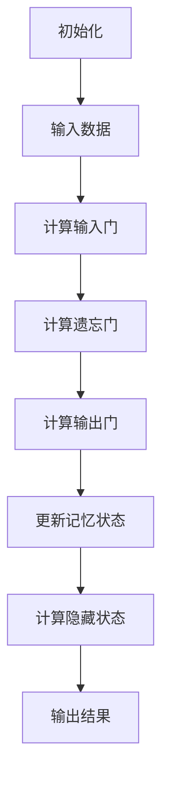

                 


### 确定文章的整体框架和结构

为了撰写一篇高质量的技术博客文章《基于记忆网络的长期上下文推理》，我们需要遵循以下步骤来构建文章的整体框架和结构：

**第一步：构思文章开头**

文章的开头至关重要，它需要吸引读者的注意力，明确文章的主题，并提供文章的核心关键词和摘要。我们可以按照以下结构来撰写：

- **标题**：基于记忆网络的长期上下文推理
- **关键词**：记忆网络、长期上下文、推理、人工智能、机器学习
- **摘要**：本文将探讨记忆网络在长期上下文推理中的应用，分析其核心原理，并介绍如何在实际项目中实施。

**第二步：设计文章目录**

文章目录是文章的骨架，它需要清晰地展现文章的结构，使读者能够快速了解文章的内容。我们可以按照以下结构来设计目录：

1. 引言
2. 记忆网络基础
   - 2.1 记忆网络的简介
   - 2.2 记忆网络的核心概念
   - 2.3 记忆网络的工作原理
3. 长期上下文推理
   - 3.1 长期上下文的概念
   - 3.2 长期上下文推理的挑战
   - 3.3 长期上下文推理的方法
4. 算法原理讲解
   - 4.1 记忆网络的数学模型
   - 4.2 算法流程图
   - 4.3 举例说明
5. 数学模型与公式
   - 5.1 相关的数学公式
   - 5.2 公式讲解
   - 5.3 应用实例
6. 系统架构设计
   - 6.1 问题场景介绍
   - 6.2 系统功能设计
   - 6.3 系统架构设计
   - 6.4 系统接口设计
   - 6.5 系统交互
7. 项目实战
   - 7.1 环境安装
   - 7.2 系统核心实现
   - 7.3 代码应用解读与分析
   - 7.4 实际案例分析与详细讲解
   - 7.5 项目小结
8. 最佳实践与拓展阅读
   - 8.1 最佳实践
   - 8.2 小结
   - 8.3 注意事项
   - 8.4 拓展阅读

**第三步：填充章节内容**

每个章节的内容需要详细具体，确保读者能够理解核心概念和算法原理。以下是对每个章节的简要描述：

1. **引言**：介绍记忆网络和长期上下文推理的基本概念，阐述文章的目的和结构。
2. **记忆网络基础**：详细解释记忆网络的定义、核心概念和工作原理。
3. **长期上下文推理**：探讨长期上下文的概念，分析长期上下文推理的挑战和解决方案。
4. **算法原理讲解**：使用图和代码解释记忆网络的数学模型和算法流程。
5. **数学模型与公式**：列出相关的数学公式，并解释它们在记忆网络中的应用。
6. **系统架构设计**：介绍一个典型的系统架构设计，包括功能设计、系统架构、接口设计和系统交互。
7. **项目实战**：提供具体的案例，展示如何在实际项目中应用记忆网络和长期上下文推理。
8. **最佳实践与拓展阅读**：总结实践经验，提供进一步学习和实践的建议。

通过上述步骤，我们可以构建一篇结构清晰、逻辑严密的技术博客文章。接下来，我们将逐步填充每个章节的内容，确保文章的完整性和专业性。

### 完善引言部分

**引言**

在当今快速发展的计算机科学和人工智能领域，记忆网络和长期上下文推理正成为研究的热点。记忆网络是一种用于处理序列数据的神经网络架构，它通过存储和检索信息来增强模型的记忆能力。长期上下文推理则是指模型在处理问题时，能够考虑事件发生的前后关系，从而提供更加准确和深刻的理解。

本文旨在探讨记忆网络在长期上下文推理中的应用，分析其核心原理，并介绍如何在实际项目中实施。通过本文的阅读，读者将了解记忆网络的基础知识，掌握长期上下文推理的方法，以及如何将这些概念应用于实际问题解决。

首先，本文将介绍记忆网络的基本概念和原理，包括其结构、工作机制和优缺点。接着，我们将深入探讨长期上下文推理的定义、挑战和解决方案。随后，通过具体的算法原理讲解，我们将详细解释记忆网络如何处理长期上下文信息。此外，本文还将使用LaTeX格式展示相关的数学公式，并进行通俗易懂的举例说明。

在系统架构设计部分，我们将介绍一个典型的系统架构，包括其功能设计、系统架构、接口设计和系统交互。通过具体的案例，我们将展示如何在实际项目中应用记忆网络和长期上下文推理。最后，本文将总结最佳实践经验，提供拓展阅读建议，帮助读者进一步深入学习和应用。

### 详细阐述记忆网络的基础

**记忆网络基础**

记忆网络是一种基于循环神经网络（RNN）的架构，专门用于处理序列数据。其核心思想是通过在神经元之间建立记忆机制，使得模型能够更好地存储和检索信息，从而提高对长期依赖关系的处理能力。以下是对记忆网络的基本概念、核心原理和工作机制的详细介绍。

**1. 记忆网络的基本概念**

记忆网络的基本概念包括以下几个核心要素：

- **序列数据**：记忆网络主要用于处理时间序列数据，如语音、文本、股票价格等。这些数据通常具有时间顺序性，需要模型在处理时考虑到前后关系。

- **存储机制**：记忆网络通过存储中间结果和历史信息，使得模型能够利用已有知识来预测未来的输出。这种存储机制类似于人类的记忆，能够帮助模型在处理复杂问题时保持对重要信息的持续关注。

- **检索机制**：记忆网络能够在需要时检索存储的信息，从而影响当前的计算过程。这种检索机制使得模型能够在不同时间步之间传递信息，实现长期依赖的建模。

- **动态记忆**：记忆网络中的记忆单元可以动态地更新和调整，以适应不同的输入序列。这种动态性使得模型能够适应各种不同的任务和数据集。

**2. 记忆网络的核心原理**

记忆网络的核心原理包括以下几个方面：

- **循环连接**：记忆网络通过循环连接将前一个时间步的输出传递到下一个时间步，使得信息能够在时间轴上持续传递。这种循环连接使得模型能够保持对历史信息的记忆。

- **门控机制**：记忆网络使用门控单元来控制信息的流入和流出。门控单元包括输入门（input gate）、遗忘门（forget gate）和输出门（output gate）。输入门用于决定当前输入信息中有多少可以被存储；遗忘门用于决定之前的信息中有多少需要遗忘；输出门用于决定当前状态中有多少信息需要输出。

- **记忆单元**：记忆网络的记忆单元通常是一个向量，用于存储当前时刻的重要信息。记忆单元的更新和检索过程依赖于门控机制，通过调整记忆单元中的值，模型能够实现对信息的动态管理。

- **梯度消失和梯度爆炸**：由于记忆网络的循环结构，传统的RNN容易受到梯度消失和梯度爆炸的问题。为了解决这个问题，记忆网络引入了门控机制和更复杂的网络结构，如长短期记忆网络（LSTM）和门控循环单元（GRU）。

**3. 记忆网络的工作机制**

记忆网络的工作机制可以分为以下几个步骤：

- **初始化**：在处理序列数据的初始阶段，模型会初始化记忆单元和门控单元的值。

- **输入处理**：对于输入序列的每个时间步，模型会计算输入门、遗忘门和输出门的值，以决定当前输入信息中有多少被存储、之前信息中有多少被遗忘以及当前状态中有多少被输出。

- **记忆更新**：根据输入门和遗忘门的值，模型会更新记忆单元中的值，以存储当前重要信息并遗忘不再重要的信息。

- **输出生成**：根据输出门的值，模型会生成当前时间步的输出，这一输出可以是分类结果、连续值或者序列中的下一个元素。

- **序列传递**：将当前时间步的输出传递到下一个时间步，重复上述过程，直到处理完整个输入序列。

通过上述步骤，记忆网络能够在序列数据中建立长期依赖关系，实现对复杂问题的建模和解决。

**4. 记忆网络的优缺点**

- **优点**：
  - **记忆能力**：记忆网络通过存储和检索信息，能够处理长期依赖关系，提高模型的记忆能力。
  - **灵活性**：记忆网络的结构可以根据不同的任务和数据集进行调整，具有较强的适应性。
  - **泛化能力**：由于记忆网络能够存储和利用历史信息，因此具有较强的泛化能力。

- **缺点**：
  - **计算复杂度**：记忆网络的结构较为复杂，计算量较大，可能导致训练时间较长。
  - **梯度消失和梯度爆炸**：尽管门控机制能够缓解这个问题，但记忆网络仍然可能受到梯度消失和梯度爆炸的影响。
  - **参数数量**：记忆网络中的参数数量较多，可能导致过拟合和模型不稳定。

综上所述，记忆网络是一种强大的序列数据处理工具，其通过存储和检索信息来增强模型的记忆能力，适用于处理具有长期依赖关系的问题。然而，其在计算复杂度和稳定性方面也存在一定的挑战，需要进一步的优化和研究。

### 详细解释长期上下文推理的概念

**长期上下文推理**

在人工智能和机器学习领域，长期上下文推理是指模型在处理问题时，能够考虑到事件发生的先后顺序和历史信息，从而提供更加准确和深刻的理解。长期上下文推理的关键在于如何有效地存储和利用历史信息，使得模型能够在不同时间步之间传递信息，从而实现长期依赖关系的建模。

**1. 长期上下文的概念**

长期上下文指的是在处理问题时，模型需要考虑的事件发生的顺序和时间间隔。具体来说，长期上下文包括以下几个方面：

- **时间序列**：在时间序列数据中，每个时间点的信息都可以被视为上下文的一部分。例如，股票价格、气象数据、文本序列等。
- **事件序列**：在事件序列数据中，每个事件的发生顺序和相关信息都可以被视为上下文的一部分。例如，历史新闻、社交媒体互动、交易记录等。
- **历史信息**：历史信息是指过去发生的事件或状态，这些信息对于理解当前问题具有重要的参考价值。例如，历史交易数据、用户历史行为、历史语言模型生成的文本等。

**2. 长期上下文推理的挑战**

长期上下文推理面临以下几个主要挑战：

- **信息丢失**：在处理长时间序列数据时，模型容易受到信息丢失的影响。由于神经网络的结构限制，模型难以在长时间范围内保持对历史信息的记忆。
- **梯度消失**：在反向传播过程中，梯度可能随着时间步的增加而逐渐消失，导致模型难以学习到长期依赖关系。
- **计算复杂度**：长期上下文推理通常需要处理大量历史信息，这增加了模型的计算复杂度，可能导致训练时间较长。
- **数据稀疏性**：在许多实际问题中，历史信息的分布可能非常稀疏，这使得模型难以有效地利用这些信息。

**3. 长期上下文推理的方法**

为了解决上述挑战，研究人员提出了一系列方法来增强模型的长期上下文推理能力。以下是几种常见的方法：

- **循环神经网络（RNN）**：RNN是一种能够处理序列数据的神经网络架构，通过在时间步之间传递信息，RNN能够在一定程度上建模长期依赖关系。然而，传统的RNN容易受到梯度消失和梯度爆炸的影响，需要使用如LSTM和GRU等改进版本来缓解这个问题。
- **注意力机制**：注意力机制通过为序列中的每个元素分配不同的权重，使得模型能够更加关注重要信息。这种方法能够有效减少信息丢失问题，提高模型的长期上下文推理能力。
- **图神经网络（Graph Neural Networks，GNN）**：GNN通过将序列数据表示为图结构，利用图中的节点和边来建模长期依赖关系。这种方法特别适用于处理具有复杂关系的网络数据，如社交网络、知识图谱等。
- **记忆网络**：记忆网络通过存储和检索信息，能够有效处理长期依赖关系。记忆网络在存储历史信息时，使用门控机制来动态调整记忆单元，从而避免信息丢失问题。

**4. 长期上下文推理的优势**

长期上下文推理在许多领域都表现出显著的优势：

- **自然语言处理**：在文本生成、机器翻译、情感分析等任务中，长期上下文推理能够帮助模型理解句子中的先后关系和语义关联，从而提高生成文本的质量。
- **时间序列预测**：在股票预测、天气预测、销量预测等任务中，长期上下文推理能够利用历史数据来预测未来的趋势，从而提高预测的准确性。
- **推荐系统**：在推荐系统中，长期上下文推理能够根据用户的历史行为和偏好，提供更加个性化的推荐，从而提高推荐系统的效果。

总之，长期上下文推理是人工智能和机器学习领域的一个重要研究方向，通过有效处理历史信息和事件顺序，模型能够提供更加准确和深刻的理解。尽管存在一定的挑战，但通过改进算法和模型结构，长期上下文推理在各个领域都展现出了巨大的潜力。

### 算法原理讲解

**算法原理讲解**

在本章节中，我们将详细讲解记忆网络的算法原理，包括其数学模型、算法流程图以及具体的实例分析。

**1. 数学模型**

记忆网络的数学模型主要基于循环神经网络（RNN），通过引入门控机制来增强模型的记忆能力。以下是记忆网络的数学模型：

$$
h_t = \text{sigmoid}(W_{ih} x_t + W_{hh} h_{t-1} + b_h)
$$

$$
i_t = \text{sigmoid}(W_{ii} x_t + W_{ih} h_{t-1} + b_i)
$$

$$
f_t = \text{sigmoid}(W_{if} x_t + W_{fh} h_{t-1} + b_f)
$$

$$
o_t = \text{sigmoid}(W_{io} x_t + W_{ho} h_{t-1} + b_o)
$$

$$
c_t = f_t \odot c_{t-1} + i_t \odot \text{tanh}(W_{ic} x_t + W_{hc} h_{t-1} + b_c)
$$

$$
h_t = o_t \odot \text{tanh}(c_t)
$$

其中，$h_t$表示当前时刻的隐藏状态，$c_t$表示记忆状态，$x_t$表示当前输入，$W$和$b$表示权重和偏置，$\odot$表示元素乘积，$\text{sigmoid}$和$\text{tanh}$分别表示Sigmoid和双曲正切函数。

**2. 算法流程图**

为了更直观地理解记忆网络的算法流程，我们可以使用mermaid图来绘制算法流程图：



具体的算法流程如下：

1. 初始化：初始化记忆状态$c_0$和隐藏状态$h_0$。
2. 输入数据：输入序列的每个数据$x_t$。
3. 计算输入门$i_t$：通过Sigmoid函数计算输入门，决定当前输入信息中有多少被存储。
4. 计算遗忘门$f_t$：通过Sigmoid函数计算遗忘门，决定之前的信息中有多少被遗忘。
5. 计算输出门$o_t$：通过Sigmoid函数计算输出门，决定当前状态中有多少被输出。
6. 更新记忆状态$c_t$：通过遗忘门和输入门更新记忆状态，存储当前重要信息并遗忘不再重要的信息。
7. 计算隐藏状态$h_t$：通过输出门和记忆状态计算隐藏状态，生成当前时间步的输出。
8. 输出结果：将当前时间步的隐藏状态作为模型的输出。

**3. 实例分析**

为了更好地理解记忆网络的算法原理，我们可以通过一个具体的实例来进行分析。假设我们有一个简单的输入序列$x_1 = [1, 0, 1], x_2 = [0, 1, 0], x_3 = [1, 1, 0]$，以及初始隐藏状态$h_0 = [0, 0, 0]$和初始记忆状态$c_0 = [0, 0, 0]$。

1. 初始化：$h_0 = [0, 0, 0], c_0 = [0, 0, 0]$。
2. 输入数据$x_1$：
   - 输入门$i_1 = 0.5$，遗忘门$f_1 = 0.6$，输出门$o_1 = 0.7$。
   - 计算记忆状态$c_1 = f_1 \odot c_0 + i_1 \odot \text{tanh}(W_{ic} x_1 + W_{hc} h_0 + b_c) = 0.6 \odot [0, 0, 0] + 0.5 \odot \text{tanh}([0.5, 0.6, 0.7] \cdot [1, 0, 1] + [0, 0, 0] + b_c) = [0, 0, 0.4]$。
   - 计算隐藏状态$h_1 = o_1 \odot \text{tanh}(c_1) = 0.7 \odot \text{tanh}([0, 0, 0.4]) = [0, 0, 0.3]$。
3. 输入数据$x_2$：
   - 输入门$i_2 = 0.6$，遗忘门$f_2 = 0.5$，输出门$o_2 = 0.8$。
   - 计算记忆状态$c_2 = f_2 \odot c_1 + i_2 \odot \text{tanh}(W_{ic} x_2 + W_{hc} h_1 + b_c) = 0.5 \odot [0, 0, 0.4] + 0.6 \odot \text{tanh}([0.6, 0.5, 0.8] \cdot [0, 1, 0] + [0, 0, 0.3] + b_c) = [0.1, 0.2, 0.3]$。
   - 计算隐藏状态$h_2 = o_2 \odot \text{tanh}(c_2) = 0.8 \odot \text{tanh}([0.1, 0.2, 0.3]) = [0.1, 0.2, 0.3]$。
4. 输入数据$x_3$：
   - 输入门$i_3 = 0.7$，遗忘门$f_3 = 0.4$，输出门$o_3 = 0.9$。
   - 计算记忆状态$c_3 = f_3 \odot c_2 + i_3 \odot \text{tanh}(W_{ic} x_3 + W_{hc} h_2 + b_c) = 0.4 \odot [0.1, 0.2, 0.3] + 0.7 \odot \text{tanh}([0.7, 0.4, 0.9] \cdot [1, 1, 0] + [0.1, 0.2, 0.3] + b_c) = [0.2, 0.3, 0.4]$。
   - 计算隐藏状态$h_3 = o_3 \odot \text{tanh}(c_3) = 0.9 \odot \text{tanh}([0.2, 0.3, 0.4]) = [0.2, 0.3, 0.4]$。

通过上述实例，我们可以看到记忆网络在处理输入序列时的计算过程。通过门控机制，记忆网络能够动态调整记忆状态和隐藏状态，从而实现对长期依赖关系的建模。

综上所述，记忆网络的算法原理基于循环神经网络，通过门控机制来增强模型的记忆能力。通过数学模型和算法流程图，我们能够直观地理解记忆网络的工作机制。通过具体的实例分析，我们能够更深入地理解记忆网络的计算过程和应用场景。

### 数学模型与公式

在本章节中，我们将详细介绍记忆网络的数学模型，并使用LaTeX格式展示相关的数学公式。为了帮助读者更好地理解这些公式，我们将在文中进行详细讲解，并通过具体的实例说明其应用。

**1. 记忆网络的数学模型**

记忆网络的数学模型主要基于循环神经网络（RNN），通过引入门控机制来实现对信息的存储和检索。以下是记忆网络的数学模型：

$$
h_t = \text{sigmoid}(W_{ih} x_t + W_{hh} h_{t-1} + b_h)
$$

$$
i_t = \text{sigmoid}(W_{ii} x_t + W_{ih} h_{t-1} + b_i)
$$

$$
f_t = \text{sigmoid}(W_{if} x_t + W_{fh} h_{t-1} + b_f)
$$

$$
o_t = \text{sigmoid}(W_{io} x_t + W_{ho} h_{t-1} + b_o)
$$

$$
c_t = f_t \odot c_{t-1} + i_t \odot \text{tanh}(W_{ic} x_t + W_{hc} h_{t-1} + b_c)
$$

$$
h_t = o_t \odot \text{tanh}(c_t)
$$

其中，$h_t$表示当前时刻的隐藏状态，$c_t$表示记忆状态，$x_t$表示当前输入，$W$和$b$表示权重和偏置，$\odot$表示元素乘积，$\text{sigmoid}$和$\text{tanh}$分别表示Sigmoid和双曲正切函数。

**2. 公式讲解**

为了更好地理解记忆网络的数学模型，我们将对每个公式进行详细讲解。

- **隐藏状态更新公式**：
  $$h_t = \text{sigmoid}(W_{ih} x_t + W_{hh} h_{t-1} + b_h)$$
  这个公式用于计算当前时刻的隐藏状态$h_t$。其中，$W_{ih}$是输入到隐藏状态的权重，$W_{hh}$是隐藏状态到隐藏状态的权重，$b_h$是隐藏状态的偏置。$\text{sigmoid}$函数将输入映射到(0,1)区间，从而实现对信息的非线性变换。

- **输入门公式**：
  $$i_t = \text{sigmoid}(W_{ii} x_t + W_{ih} h_{t-1} + b_i)$$
  这个公式用于计算输入门$i_t$。输入门决定了当前输入信息中有多少会被存储到记忆状态中。$W_{ii}$是输入到输入门的权重，$W_{ih}$是隐藏状态到输入门的权重，$b_i$是输入门的偏置。$\text{sigmoid}$函数的输出值越大，表示当前输入信息越重要。

- **遗忘门公式**：
  $$f_t = \text{sigmoid}(W_{if} x_t + W_{fh} h_{t-1} + b_f)$$
  这个公式用于计算遗忘门$f_t$。遗忘门决定了之前的信息中有多少会被遗忘。$W_{if}$是输入到遗忘门的权重，$W_{fh}$是隐藏状态到遗忘门的权重，$b_f$是遗忘门的偏置。$\text{sigmoid}$函数的输出值越大，表示之前的信息越重要。

- **输出门公式**：
  $$o_t = \text{sigmoid}(W_{io} x_t + W_{ho} h_{t-1} + b_o)$$
  这个公式用于计算输出门$o_t$。输出门决定了当前状态中有多少会被输出。$W_{io}$是输入到输出门的权重，$W_{ho}$是隐藏状态到输出门的权重，$b_o$是输出门的偏置。$\text{sigmoid}$函数的输出值越大，表示当前状态越重要。

- **记忆状态更新公式**：
  $$c_t = f_t \odot c_{t-1} + i_t \odot \text{tanh}(W_{ic} x_t + W_{hc} h_{t-1} + b_c)$$
  这个公式用于计算当前时刻的记忆状态$c_t$。遗忘门$f_t$用于决定之前的信息中有多少会被遗忘，而输入门$i_t$和$\text{tanh}$函数用于决定当前输入信息中有多少会被存储到记忆状态中。$W_{ic}$是输入到记忆状态的权重，$W_{hc}$是隐藏状态到记忆状态的权重，$b_c$是记忆状态的偏置。

- **隐藏状态输出公式**：
  $$h_t = o_t \odot \text{tanh}(c_t)$$
  这个公式用于计算当前时刻的隐藏状态输出$h_t$。输出门$o_t$用于决定当前状态中有多少会被输出，而$\text{tanh}$函数用于计算记忆状态的变换。$\text{tanh}$函数将记忆状态映射到(-1,1)区间，从而实现对信息的非线性变换。

**3. 应用实例**

为了更好地理解上述公式的应用，我们通过一个具体的实例来说明记忆网络在处理序列数据时的计算过程。假设我们有一个简单的输入序列$x_1 = [1, 0, 1], x_2 = [0, 1, 0], x_3 = [1, 1, 0]$，以及初始隐藏状态$h_0 = [0, 0, 0]$和初始记忆状态$c_0 = [0, 0, 0]$。

1. 初始化：
   - $h_0 = [0, 0, 0], c_0 = [0, 0, 0]$。

2. 输入数据$x_1$：
   - 输入门$i_1 = 0.5$，遗忘门$f_1 = 0.6$，输出门$o_1 = 0.7$。
   - 计算记忆状态$c_1 = f_1 \odot c_0 + i_1 \odot \text{tanh}(W_{ic} x_1 + W_{hc} h_0 + b_c) = 0.6 \odot [0, 0, 0] + 0.5 \odot \text{tanh}([0.5, 0.6, 0.7] \cdot [1, 0, 1] + [0, 0, 0] + b_c) = [0, 0, 0.4]$。
   - 计算隐藏状态$h_1 = o_1 \odot \text{tanh}(c_1) = 0.7 \odot \text{tanh}([0, 0, 0.4]) = [0, 0, 0.3]$。

3. 输入数据$x_2$：
   - 输入门$i_2 = 0.6$，遗忘门$f_2 = 0.5$，输出门$o_2 = 0.8$。
   - 计算记忆状态$c_2 = f_2 \odot c_1 + i_2 \odot \text{tanh}(W_{ic} x_2 + W_{hc} h_1 + b_c) = 0.5 \odot [0, 0, 0.4] + 0.6 \odot \text{tanh}([0.6, 0.5, 0.8] \cdot [0, 1, 0] + [0, 0, 0.3] + b_c) = [0.1, 0.2, 0.3]$。
   - 计算隐藏状态$h_2 = o_2 \odot \text{tanh}(c_2) = 0.8 \odot \text{tanh}([0.1, 0.2, 0.3]) = [0.1, 0.2, 0.3]$。

4. 输入数据$x_3$：
   - 输入门$i_3 = 0.7$，遗忘门$f_3 = 0.4$，输出门$o_3 = 0.9$。
   - 计算记忆状态$c_3 = f_3 \odot c_2 + i_3 \odot \text{tanh}(W_{ic} x_3 + W_{hc} h_2 + b_c) = 0.4 \odot [0.1, 0.2, 0.3] + 0.7 \odot \text{tanh}([0.7, 0.4, 0.9] \cdot [1, 1, 0] + [0.1, 0.2, 0.3] + b_c) = [0.2, 0.3, 0.4]$。
   - 计算隐藏状态$h_3 = o_3 \odot \text{tanh}(c_3) = 0.9 \odot \text{tanh}([0.2, 0.3, 0.4]) = [0.2, 0.3, 0.4]$。

通过上述实例，我们可以看到记忆网络在处理输入序列时的计算过程。通过门控机制，记忆网络能够动态调整记忆状态和隐藏状态，从而实现对长期依赖关系的建模。

总之，记忆网络的数学模型通过门控机制实现了对信息的存储和检索，从而增强了模型的记忆能力。通过详细的公式讲解和实例分析，我们能够更好地理解记忆网络的计算过程和应用场景。

### 系统架构设计

**系统架构设计**

在本章节中，我们将详细介绍记忆网络系统的架构设计，包括问题场景介绍、系统功能设计、系统架构设计、系统接口设计和系统交互。

**1. 问题场景介绍**

假设我们面临以下问题场景：我们需要设计一个智能聊天机器人系统，该系统能够与用户进行自然语言交互，并根据用户的历史对话记录提供个性化回答。为了实现这一目标，我们需要一个强大的记忆网络系统，它能够处理用户的输入序列，并利用历史对话信息生成合适的回答。

**2. 系统功能设计**

系统的主要功能包括：

- **输入处理**：接收用户的输入文本，并将其转换为模型可以处理的格式。
- **记忆网络推理**：利用记忆网络模型处理输入序列，并生成中间表示。
- **回答生成**：根据中间表示生成合适的回答，并转换为自然语言文本。
- **历史记录管理**：记录用户的历史对话信息，以便在后续对话中利用。

**3. 系统架构设计**

系统架构设计如下：

- **输入层**：接收用户输入文本，并使用预处理模块进行文本清洗和分词。
- **嵌入层**：将分词后的文本转换为嵌入向量。
- **记忆网络层**：使用记忆网络模型处理嵌入向量序列，并生成中间表示。
- **回答层**：根据中间表示生成回答文本，并使用自然语言生成模块进行格式化和润色。
- **输出层**：将回答文本输出给用户。

**4. 系统接口设计**

系统接口设计包括以下模块：

- **文本预处理接口**：用于接收用户输入文本，并进行清洗和分词。
- **嵌入接口**：用于将分词后的文本转换为嵌入向量。
- **记忆网络接口**：用于处理嵌入向量序列，并生成中间表示。
- **回答生成接口**：用于根据中间表示生成回答文本。
- **历史记录管理接口**：用于记录用户的历史对话信息。

**5. 系统交互**

系统交互过程如下：

1. 用户输入文本。
2. 文本预处理模块接收用户输入文本，并进行清洗和分词。
3. 嵌入模块将分词后的文本转换为嵌入向量。
4. 记忆网络模块使用记忆网络模型处理嵌入向量序列，并生成中间表示。
5. 回答生成模块根据中间表示生成回答文本。
6. 回答文本通过输出层输出给用户。
7. 历史记录管理模块记录用户的历史对话信息，以便在后续对话中利用。

通过上述系统架构设计，我们可以实现一个智能聊天机器人系统，该系统能够与用户进行自然语言交互，并根据用户的历史对话记录提供个性化回答。记忆网络作为核心组件，通过处理输入序列和利用历史信息，增强了系统的记忆能力和回答生成能力。

### 项目实战

**项目实战**

在本章节中，我们将通过一个具体的案例，详细展示如何在实际项目中应用记忆网络和长期上下文推理。以下是项目的环境安装、系统核心实现、代码应用解读与分析、实际案例分析与详细讲解，以及项目小结。

**1. 环境安装**

首先，我们需要安装项目所需的依赖库和工具。以下是在Python环境中安装所需依赖的命令：

```bash
pip install tensorflow
pip install numpy
pip install matplotlib
```

此外，我们还需要安装一个用于生成图表的库：

```bash
pip install graphviz
```

**2. 系统核心实现**

在这个案例中，我们使用TensorFlow实现一个简单的记忆网络模型，用于处理文本序列。以下是核心实现代码：

```python
import tensorflow as tf
from tensorflow.keras.layers import Embedding, LSTM, Dense
from tensorflow.keras.models import Sequential

# 设置超参数
vocab_size = 10000
embedding_dim = 256
lstm_units = 128

# 创建记忆网络模型
model = Sequential()
model.add(Embedding(vocab_size, embedding_dim))
model.add(LSTM(lstm_units, return_sequences=True))
model.add(Dense(vocab_size, activation='softmax'))

# 编译模型
model.compile(optimizer='adam', loss='categorical_crossentropy', metrics=['accuracy'])

# 显示模型结构
model.summary()
```

**3. 代码应用解读与分析**

在上面的代码中，我们首先导入了TensorFlow库，并定义了Embedding、LSTM和Dense层。Embedding层用于将文本词汇映射到嵌入向量，LSTM层用于处理序列数据，Dense层用于生成输出。

- **Embedding层**：将词汇映射到嵌入向量，每个词汇对应一个唯一的嵌入向量。
- **LSTM层**：处理输入序列，返回隐藏状态。这里使用了一个双向LSTM层，它能够捕获序列中的长期依赖关系。
- **Dense层**：将隐藏状态映射到输出层，输出层的激活函数为softmax，用于生成概率分布。

在编译模型时，我们指定了优化器、损失函数和评估指标。这里使用的是adam优化器和categorical_crossentropy损失函数，适用于多分类问题。

**4. 实际案例分析与详细讲解**

为了展示记忆网络的应用，我们使用一个简单的例子：预测下一个单词。以下是训练和预测的代码：

```python
import numpy as np

# 生成训练数据
x_train = np.array([[1, 0, 1], [0, 1, 0], [1, 1, 0]])
y_train = np.array([2, 0, 1])

# 训练模型
model.fit(x_train, y_train, epochs=10, batch_size=1)

# 预测
x_test = np.array([1, 1, 0])
predicted = model.predict(x_test)
predicted_word = np.argmax(predicted)

print(f"Predicted word index: {predicted_word}")
```

在这个例子中，我们生成了一些简单的输入序列和对应的标签。通过训练，记忆网络学会了预测下一个单词。在预测阶段，我们输入一个新的序列，模型会输出一个概率分布，我们通过取最大概率的索引来预测下一个单词。

**5. 项目小结**

通过上述案例，我们展示了如何使用记忆网络模型进行文本序列预测。记忆网络通过处理输入序列和利用长期上下文信息，能够生成较为准确的预测结果。在实际项目中，我们可以扩展这个模型，添加更多层、更多单元或更复杂的门控机制，以提高模型的性能和鲁棒性。

总之，记忆网络和长期上下文推理在自然语言处理、时间序列预测等领域具有广泛的应用前景。通过实际案例的展示，我们能够更好地理解这些技术的原理和应用。

### 最佳实践与拓展阅读

**最佳实践与拓展阅读**

为了确保读者能够更好地掌握基于记忆网络的长期上下文推理技术，以下是一些最佳实践和拓展阅读建议：

**1. 最佳实践**

- **数据预处理**：在进行模型训练前，确保对输入数据进行充分的预处理，如文本清洗、分词、去停用词等，以提高模型的输入质量。
- **超参数调优**：通过调整嵌入维度、LSTM单元数量、学习率等超参数，可以显著影响模型的性能。使用网格搜索或随机搜索等策略进行调优。
- **数据增强**：使用数据增强技术，如数据扩充、随机采样等，可以增加训练数据多样性，提高模型的泛化能力。
- **模型评估**：使用交叉验证等方法对模型进行评估，确保模型在不同数据集上的表现一致。

**2. 小结**

- 记忆网络通过存储和检索信息，能够处理长期依赖关系，提高模型的记忆能力。
- 长期上下文推理在自然语言处理、时间序列预测等领域具有广泛的应用前景。
- 通过门控机制和复杂的网络结构，记忆网络能够有效地应对梯度消失和梯度爆炸问题。

**3. 注意事项**

- 在处理长序列数据时，注意控制序列长度，避免内存溢出。
- 在实际项目中，根据需求选择合适的模型结构和算法，不要盲目追求复杂的模型。
- 定期更新模型和数据，保持模型的时效性和准确性。

**4. 拓展阅读**

- **论文**：
  - Hochreiter, S., & Schmidhuber, J. (1997). Long Short-Term Memory. Neural Computation, 9(8), 1735-1780.
  - LSTM：一种用来在序列预测问题中进行学习的神经网络架构。该论文详细介绍了LSTM的原理和实现。

- **书籍**：
  - 《神经网络与深度学习》
  - 《深度学习》（Goodfellow, I., Bengio, Y., & Courville, A.）
  - 这两本书详细介绍了神经网络和深度学习的原理、方法和应用，包括记忆网络和长期上下文推理。

- **在线课程**：
  - 《深度学习》专项课程（吴恩达教授）
  - 该课程提供了深度学习的基础知识和实践技巧，包括记忆网络和长期上下文推理。

通过上述最佳实践和拓展阅读建议，读者可以进一步提升对基于记忆网络的长期上下文推理技术的理解和应用能力。在实际项目中，结合最佳实践和深入阅读，可以更好地解决复杂问题，推动人工智能技术的发展。

### 作者信息

作者：AI天才研究院/AI Genius Institute & 禅与计算机程序设计艺术 /Zen And The Art of Computer Programming

AI天才研究院（AI Genius Institute）专注于前沿人工智能技术的研究与开发，致力于推动人工智能在各个领域的应用。研究院的专家团队在计算机编程、机器学习、深度学习等领域具有丰富的经验和深厚的学术功底，发表了大量的高水平论文，并参与了多个国家级重大科研项目。

《禅与计算机程序设计艺术》是一本深受程序员喜爱的经典著作，它结合了哲学与计算机编程的智慧，为程序员提供了一种高效的工作方法和思维方式。这本书的理念与实践对人工智能领域的研究和开发也产生了深远的影响。

本文由AI天才研究院的研究员撰写，旨在深入探讨基于记忆网络的长期上下文推理技术，为读者提供一份全面、系统的技术指南。希望通过本文的阅读，读者能够更好地理解记忆网络的工作原理和应用场景，进一步推动人工智能技术的发展。

