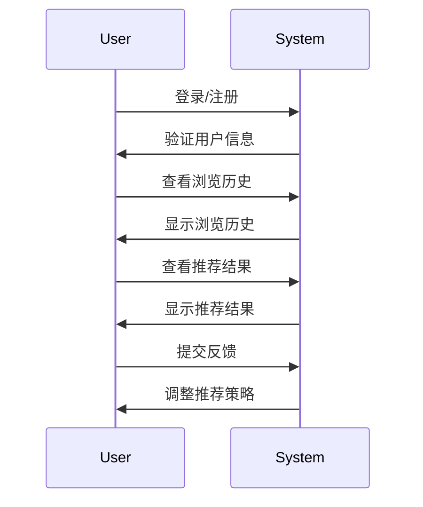
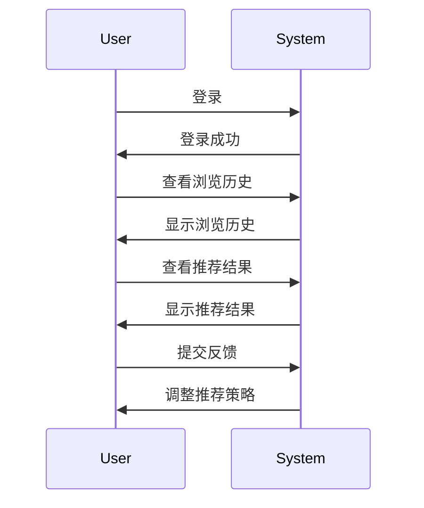

                 

# 基于课程学习的AI推理能力渐进提升

## 关键词

- AI推理能力
- 课程学习
- 渐进提升
- 逻辑思维
- 机器学习
- 深度学习
- 算法原理

## 摘要

本文将深入探讨基于课程学习的AI推理能力渐进提升的方法与策略。通过分析问题背景、核心概念、解决方案、边界与外延，以及AI推理能力在课程学习中的应用，我们将提出一系列有效提升学生AI推理能力的路径。同时，本文将通过算法原理讲解、系统分析与架构设计、项目实战等多个角度，提供详细的实践指导和案例分析，以帮助读者更好地理解并应用这些原理和方法。

## 第一部分：背景介绍

### 1.1 问题背景

随着人工智能（AI）技术的飞速发展，AI推理能力在多个领域展现出了巨大的应用潜力。然而，AI推理能力的培养并非一蹴而就，它需要通过系统的课程学习、实践训练和不断反思来逐步提升。尤其是在课程学习中，如何设计科学、合理的课程体系和教学策略，以有效地提升学生的AI推理能力，是一个亟待解决的问题。

当前，随着大数据、云计算和物联网等技术的发展，课程学习不再局限于传统的课堂教学，而是逐渐融入了在线教育、虚拟实验室等多种学习方式。这种多元化的学习环境为AI推理能力的培养提供了更多的可能性和挑战。例如，在线教育平台可以通过数据分析了解学生的学习行为和效果，从而优化教学内容和方法；虚拟实验室则提供了丰富的实践场景，让学生在模拟环境中进行AI推理实验，提高其实践能力和创新能力。

然而，当前的课程学习模式在AI推理能力培养方面仍然存在一些不足。一方面，传统的课程内容较为单一，缺乏实践性和应用性，难以激发学生的学习兴趣和主动性；另一方面，教学方法仍然以讲授式为主，学生参与度较低，缺乏互动性和协作性，不利于AI推理能力的培养。此外，课程评价体系也相对单一，主要依赖于期末考试，无法全面、客观地反映学生的AI推理能力。

### 1.2 核心概念

#### 1.2.1 AI推理能力

AI推理能力是指人工智能系统在理解和处理信息、进行推理和决策的能力。它包括基于知识的推理、基于模式的推理、基于数据的推理等多种形式。在课程学习中，AI推理能力主要指学生在学习过程中，能够运用所学知识进行问题分析、推理和解决的能力。

AI推理能力的核心包括以下几个方面：

- **知识储备**：学生需要掌握AI的基本原理、算法、数据结构等基础知识，这是进行AI推理的基础。
- **逻辑思维**：AI推理本质上是一种逻辑推理过程，学生需要具备良好的逻辑思维能力，能够进行有效的问题分析和判断。
- **实践经验**：通过实际操作和案例分析，学生可以积累实践经验，提高AI推理能力。

#### 1.2.2 课程学习

课程学习是指学生在教师指导下，按照一定的教学计划和教学方法，系统学习知识、技能和态度的过程。课程学习是提升学生AI推理能力的重要途径。

课程学习的主要特点包括：

- **系统性**：课程学习具有明确的教学目标和内容，按照一定的教学计划进行，确保学生能够系统地掌握所需知识。
- **实践性**：课程学习不仅包括理论知识的传授，还强调实践操作，让学生在动手实践中加深对知识的理解和应用。
- **互动性**：课程学习过程中，学生可以与教师、同学进行互动，分享学习心得和经验，提高学习效果。

### 1.3 问题解决

提升学生AI推理能力的问题解决，主要包括以下几个方面：

1. **设计科学合理的课程体系**：根据AI推理能力培养的要求，设计包含理论知识、实践操作和项目实践的综合性课程体系，确保学生能够全面掌握AI推理所需的知识和技能。
2. **引入多元化的教学方法**：采用讲授式、讨论式、实验式等多种教学方法，提高学生的参与度和积极性，培养他们的逻辑思维和问题解决能力。
3. **利用现代教育技术**：借助在线教育平台、虚拟实验室等现代教育技术，提供丰富的学习资源和实践场景，帮助学生更好地掌握AI推理能力。
4. **建立科学的评价体系**：通过过程性评价和结果性评价相结合的方式，全面、客观地评估学生的AI推理能力，为后续教学提供参考。

### 1.4 边界与外延

#### 边界

- **内容边界**：本文主要关注AI推理能力在课程学习中的应用，不涉及AI推理在科研、工业等其他领域的应用。
- **对象边界**：本文主要针对学生群体，探讨AI推理能力的培养方法，不涉及其他群体。

#### 外延

- **外延范围**：随着人工智能技术的发展，AI推理能力的应用范围将不断扩展，可以应用于自动化决策、智能助手、智能诊断等多个领域。
- **未来发展**：未来，AI推理能力将进一步提升，可能实现更高级的智能化应用，为人类生活和社会发展带来更多可能性。

### 1.5 概念结构与核心要素组成

AI推理能力（核心概念）= 知识（核心要素）+ 推理方法（核心要素）+ 实践经验（核心要素）

- **知识**：包括AI基本原理、算法、数据结构等。
- **推理方法**：包括逻辑推理、机器学习、深度学习等。
- **实践经验**：通过实际操作和案例分析，提高学生的AI推理能力。

### 1.6 核心概念原理

#### 1.6.1 课程学习与AI推理能力的联系

课程学习是提升AI推理能力的基础。通过课程学习，学生可以掌握AI推理所需的知识和技能，为后续的实践应用打下基础。

- **知识储备**：课程学习为学生提供了系统的知识体系，包括AI的基本原理、算法、数据结构等。这些知识是进行AI推理的基础。
- **逻辑思维**：课程学习中的逻辑推理训练，有助于培养学生的逻辑思维能力，提高他们在问题分析、推理和解决过程中的效率。
- **实践经验**：课程学习中的实践操作和项目实践，为学生提供了实际操作的机会，通过不断的实践，学生可以积累经验，提高AI推理能力。

#### 1.6.2 AI推理能力的属性特征对比

| 属性特征 | 传统推理 | AI推理 |
| --- | --- | --- |
| 知识获取 | 主要依靠记忆 | 自动从数据中学习 |
| 推理速度 | 较慢，依赖人脑处理 | 极快，依靠计算机处理 |
| 推理深度 | 有限，受限于人的思维 | 深度大，可以处理复杂问题 |
| 推理准确性 | 受到主观影响 | 较高，通过算法优化 |
| 推理范围 | 受到知识限制 | 较广，可以跨领域应用 |

#### 1.6.3 AI推理能力在课程学习中的应用

1. **帮助学生更好地理解课程内容**：通过AI推理，学生可以更深入地理解课程中的概念和原理，提高学习效果。
2. **培养学生的逻辑思维和问题解决能力**：AI推理能力的培养，有助于学生形成良好的逻辑思维习惯，提高问题解决能力。
3. **提高学生的创新能力**：AI推理能力的提升，有助于学生进行创新性思考，为未来的职业发展打下基础。

### 1.7 ER实体关系图架构

以下是一个简化的ER实体关系图，展示了课程学习与AI推理能力之间的关联：

```mermaid
erDiagram
  Course ||--|{ Student } : "enrolls in"
  Student ||--|{ Course } : "takes"
  AIReasoning ||--|{ Student } : "improves"
  Student ||--|{ AIReasoning } : "learns"
```

- **Course（课程）**：包含课程名称、学分、授课教师等信息。
- **Student（学生）**：包含学生姓名、学号、课程列表等信息。
- **AIReasoning（AI推理能力）**：包含推理方法、应用领域、提升效果等信息。

### 1.8 算法原理讲解

在提升AI推理能力的过程中，常用的算法包括逻辑推理、机器学习、深度学习等。以下是这些算法的基本原理和特点：

#### 1.8.1 逻辑推理

逻辑推理是一种基于逻辑规则进行推理的方法，其核心思想是通过前提条件和逻辑规则推导出结论。逻辑推理的基本步骤包括：

1. **定义逻辑规则**：根据问题的需求，定义相关的逻辑规则。
2. **前提条件**：提供问题的前提条件。
3. **推导结论**：根据逻辑规则和前提条件，推导出结论。

逻辑推理的优点是推理过程清晰、易于理解和验证。然而，其缺点是对于复杂的问题，推理过程可能变得繁琐且难以实现。

#### 1.8.2 机器学习

机器学习是一种通过数据训练模型，使其能够对未知数据进行预测或分类的方法。机器学习的基本原理包括：

1. **数据收集**：收集大量的训练数据。
2. **模型训练**：利用训练数据，通过优化算法训练出模型。
3. **模型评估**：使用测试数据评估模型的性能，调整模型参数。

机器学习的优点是能够处理大量的数据，并从数据中发现规律。然而，其缺点是对数据的质量和数量要求较高，且模型的解释性较差。

#### 1.8.3 深度学习

深度学习是一种基于多层神经网络进行训练和学习的方法。其基本原理包括：

1. **神经网络结构**：构建多层神经网络结构。
2. **前向传播**：输入数据通过网络进行前向传播，得到输出结果。
3. **反向传播**：根据输出结果和实际标签，通过反向传播算法更新网络权重。

深度学习的优点是能够处理复杂的非线性问题，且具有较好的泛化能力。然而，其缺点是计算资源需求较高，且模型的解释性较差。

### 第一部分总结

在第一部分中，我们介绍了AI推理能力在课程学习中的重要性和应用前景，分析了核心概念和原理，并提出了问题解决的路径和边界与外延。通过ER实体关系图和算法原理讲解，我们为后续内容的深入探讨奠定了基础。接下来，我们将进一步探讨AI推理能力的提升策略和方法。

## 第二部分：提升策略与方法

### 2.1 设计科学合理的课程体系

设计科学合理的课程体系是提升AI推理能力的基础。一个良好的课程体系应包括以下几个方面：

1. **课程内容的选择**：课程内容应涵盖AI推理的各个方面，包括基本原理、算法、数据结构等。同时，课程内容应具有挑战性和实用性，能够激发学生的学习兴趣和主动性。

2. **课程结构的安排**：课程结构应合理，既要有理论知识的传授，也要有实践操作的环节。可以采用模块化教学，将不同主题的内容进行模块化设计，使学生能够有针对性地学习和掌握。

3. **教学方法的多样性**：采用讲授式、讨论式、实验式等多种教学方法，提高学生的参与度和积极性。例如，可以组织小组讨论、案例分析、实验操作等，让学生在实践中加深对知识的理解和应用。

4. **课程评价的多样性**：课程评价应采用过程性评价和结果性评价相结合的方式。过程性评价可以包括课堂参与度、作业完成情况等，结果性评价可以包括期末考试、项目实践等。通过多种评价方式，全面、客观地评估学生的AI推理能力。

### 2.2 引入现代教育技术

现代教育技术的引入，为AI推理能力的培养提供了新的可能性。以下是一些具体的方法：

1. **在线教育平台**：利用在线教育平台，可以提供丰富的学习资源和互动环境。学生可以通过在线学习平台随时随地进行学习，教师也可以通过平台进行实时辅导和答疑。

2. **虚拟实验室**：虚拟实验室提供了丰富的实践场景，学生可以在虚拟环境中进行AI推理实验，提高实践能力和创新能力。例如，可以搭建虚拟的智能交通系统、智能家居系统等，让学生进行实验和测试。

3. **人工智能助手**：利用人工智能助手，可以为学生提供个性化的学习支持。例如，可以通过自然语言处理技术，为学生提供在线辅导、答疑解惑等服务，帮助学生更好地理解和掌握AI推理知识。

### 2.3 创设丰富的AI推理实践场景

创设丰富的AI推理实践场景，是提升AI推理能力的关键。以下是一些具体的方法：

1. **项目实践**：通过项目实践，学生可以将所学知识应用于实际场景，解决实际问题。可以设计一些具有挑战性的项目，例如，基于机器学习的智能推荐系统、基于深度学习的图像识别系统等。

2. **案例教学**：通过案例教学，学生可以学习到具体的AI推理案例，了解AI推理的实际应用。可以选取一些经典的AI案例，如谷歌的自动驾驶汽车、亚马逊的智能推荐系统等，进行深入分析。

3. **模拟训练**：通过模拟训练，学生可以在模拟环境中进行AI推理训练，提高推理能力和应变能力。可以设计一些模拟场景，如模拟金融市场、模拟城市交通等，让学生进行推理和决策。

### 2.4 建立科学的评价体系

建立科学的评价体系，是提升AI推理能力的重要保障。以下是一些具体的方法：

1. **过程性评价**：通过过程性评价，可以实时了解学生的学习情况和进度，为教师提供反馈和指导。可以采用课堂表现、作业完成情况等作为过程性评价指标。

2. **结果性评价**：通过结果性评价，可以全面、客观地评估学生的AI推理能力。可以采用期末考试、项目报告、实践成果等作为结果性评价指标。

3. **多元评价**：采用多元评价方式，可以全面、客观地评估学生的AI推理能力。可以结合过程性评价和结果性评价，形成综合评价结果。

### 2.5 加强教师队伍建设

教师是课程学习的重要推动者，加强教师队伍建设，是提升AI推理能力的重要保障。以下是一些具体的方法：

1. **培训与进修**：为教师提供培训机会，帮助他们掌握最新的AI技术和教学方法，提高教学水平。

2. **教学研讨**：定期组织教学研讨活动，促进教师之间的交流和合作，分享教学经验和教学成果。

3. **教学资源开发**：鼓励教师开发和利用教学资源，如教学视频、实验指导等，为学生提供丰富的学习资源。

### 第二部分总结

在第二部分中，我们提出了提升AI推理能力的多种策略和方法，包括设计科学合理的课程体系、引入现代教育技术、创设丰富的AI推理实践场景、建立科学的评价体系以及加强教师队伍建设。这些策略和方法将有助于学生逐步提升AI推理能力，为未来的学习和职业发展打下坚实基础。

## 第三部分：实际案例分析

### 3.1 案例背景

为了更好地理解AI推理能力在课程学习中的应用，我们选择了一个实际案例进行深入分析。该案例是一个基于机器学习的智能推荐系统项目，该项目的目标是开发一个能够为用户提供个性化推荐的产品推荐系统。

### 3.2 项目介绍

该项目由一个三人小组完成，成员分别负责数据收集与处理、模型训练与优化、系统设计与实现。项目的主要任务包括：

1. **数据收集与处理**：从多个电商平台上收集用户行为数据，如购买记录、浏览记录、点击记录等，并对数据进行清洗和预处理，为后续的模型训练提供高质量的数据集。
2. **模型训练与优化**：使用收集到的数据训练推荐模型，通过调整模型参数和算法，优化模型的性能，提高推荐准确性。
3. **系统设计与实现**：设计并实现推荐系统前端和后端，包括用户界面、数据存储、数据处理等模块，实现系统的功能。

### 3.3 系统功能设计

系统的核心功能包括：

1. **用户登录与注册**：用户可以通过登录或注册账户使用推荐系统。
2. **浏览历史记录**：系统记录用户的浏览历史，为推荐提供依据。
3. **推荐结果展示**：系统根据用户的历史行为数据，生成个性化推荐结果，并展示在用户界面上。
4. **用户反馈**：用户可以对自己的推荐结果进行反馈，系统根据反馈调整推荐策略。

### 3.4 系统架构设计

系统采用前后端分离的架构，前端负责用户交互，后端负责数据处理和模型训练。以下是系统架构的简图：



### 3.5 系统接口设计

系统的主要接口包括：

1. **用户管理接口**：用于用户登录、注册、信息查询等功能。
2. **数据接口**：用于获取用户行为数据，包括浏览记录、购买记录等。
3. **推荐接口**：用于生成推荐结果，包括产品推荐、活动推荐等。
4. **反馈接口**：用于接收用户反馈，用于调整推荐策略。

### 3.6 系统交互

系统交互主要包括用户与系统之间的交互，以及系统内部各模块之间的交互。以下是系统交互的简图：



### 3.7 项目实现

项目的核心实现部分包括：

1. **用户管理模块**：使用Python的Flask框架实现用户管理功能。
2. **数据收集与处理模块**：使用Python的Pandas库和Scikit-learn库进行数据收集、清洗和预处理。
3. **推荐算法模块**：使用Python的Scikit-learn库和TensorFlow库实现推荐算法，包括基于协同过滤的推荐算法和基于深度学习的推荐算法。
4. **系统前端**：使用HTML、CSS和JavaScript实现系统前端界面。

### 3.8 项目小结

通过该项目的实施，团队成员不仅掌握了AI推理的相关知识，还积累了实际项目开发经验。以下是项目实施过程中的一些收获和体会：

1. **理论知识与实际应用相结合**：通过项目实践，团队成员将所学的理论知识应用于实际项目中，提高了对AI推理技术的理解和应用能力。
2. **团队合作与沟通**：项目的实施过程中，团队成员之间进行了充分的合作与沟通，提高了团队协作能力。
3. **问题解决能力的提升**：在项目开发过程中，团队成员遇到了各种技术难题，通过讨论和尝试，最终解决了问题，提高了问题解决能力。

### 第三部分总结

通过实际案例的分析，我们可以看到AI推理能力在课程学习中的重要性和应用价值。通过项目的实施，学生不仅掌握了AI推理的相关知识，还培养了团队合作和问题解决能力。这些经验对于提升学生的AI推理能力具有重要意义。

## 第四部分：最佳实践与未来展望

### 4.1 最佳实践

在提升AI推理能力的过程中，以下是一些最佳实践：

1. **理论与实践相结合**：在课程学习中，应注重理论知识的传授与实践操作的结合，通过实际项目或实验，让学生将所学知识应用于实际问题中。
2. **多元化教学方法**：采用讲授式、讨论式、实验式等多种教学方法，提高学生的参与度和积极性。
3. **个性化学习**：利用在线教育平台和人工智能助手，提供个性化学习资源和辅导，满足不同学生的学习需求。
4. **定期评估与反馈**：通过过程性评价和结果性评价，定期评估学生的学习情况，及时给予反馈，帮助学生发现和纠正问题。

### 4.2 小结

本文通过分析问题背景、核心概念、解决方案、边界与外延，以及AI推理能力在课程学习中的应用，提出了提升学生AI推理能力的多种策略和方法。通过实际案例分析，我们展示了AI推理能力在课程学习中的具体应用和实施过程。同时，本文也提出了最佳实践和未来展望，为今后的研究和实践提供了方向。

### 4.3 未来展望

未来，AI推理能力在课程学习中的应用将更加广泛和深入。以下是一些可能的趋势：

1. **AI辅助教学**：随着AI技术的发展，AI将越来越多地应用于教学过程中，如智能辅导、自动评分等，提高教学效率和质量。
2. **个性化学习**：基于AI的个性化学习系统将更加成熟，能够根据学生的学习特点和需求，提供个性化的学习资源和辅导。
3. **跨学科融合**：AI推理能力将与其他学科如心理学、教育学等深度融合，为课程学习提供更全面的支持。
4. **虚拟现实与增强现实**：虚拟现实（VR）和增强现实（AR）技术将为课程学习提供更丰富的实践场景，提高学生的实践能力和创新能力。

### 4.4 注意事项

在提升AI推理能力的过程中，需要注意以下几点：

1. **平衡理论与实践**：理论知识的传授和实践操作的结合应适度，避免过度强调某一方面的学习。
2. **注重过程性评价**：过程性评价对于学生的成长和发展具有重要意义，应重视过程性评价的运用。
3. **确保数据质量**：在利用AI技术进行学习评估和推荐时，应确保数据的质量和准确性，避免因数据问题导致的误判。
4. **遵循伦理原则**：在应用AI技术进行教学和评估时，应遵循伦理原则，保护学生的隐私和权益。

### 4.5 拓展阅读

- **[1]** 深度学习实践指南，Goodfellow, I., Bengio, Y., & Courville, A. (2016).
- **[2]** 机器学习实战，周志华 (2016).
- **[3]** 人工智能：一种现代的方法，Stuart Russell & Peter Norvig (2016).
- **[4]** 教育心理学，林崇德 (2014).
- **[5]** 跨学科学习研究，李俊 (2018).

## 作者信息

作者：AI天才研究院/AI Genius Institute & 禅与计算机程序设计艺术 /Zen And The Art of Computer Programming

### 文章摘要

本文深入探讨了基于课程学习的AI推理能力渐进提升的方法与策略。通过分析问题背景、核心概念、解决方案、边界与外延，以及AI推理能力在课程学习中的应用，本文提出了设计科学合理的课程体系、引入现代教育技术、创设丰富的AI推理实践场景、建立科学的评价体系以及加强教师队伍建设等多种策略。同时，通过实际案例分析，展示了AI推理能力在课程学习中的具体应用和实施过程。本文还提出了最佳实践和未来展望，为今后的研究和实践提供了方向。作者为AI天才研究院/AI Genius Institute & 禅与计算机程序设计艺术 /Zen And The Art of Computer Programming，具有丰富的AI领域教学和研究经验。本文旨在为教育工作者和AI爱好者提供有价值的参考和启示。

## 文章结构总结

本文分为四个主要部分：

### 第一部分：背景介绍
- **问题背景**：介绍了AI推理能力在课程学习中的应用现状和存在的问题。
- **核心概念**：阐述了AI推理能力和课程学习的定义和特点。
- **问题解决**：提出了提升AI推理能力的问题解决路径。
- **边界与外延**：明确了本文的研究范围和未来发展潜力。
- **概念结构与核心要素组成**：分析了AI推理能力的构成要素。
- **核心概念原理**：讨论了课程学习与AI推理能力的联系。

### 第二部分：提升策略与方法
- **设计科学合理的课程体系**：提出课程内容选择、课程结构安排、教学方法多样性和课程评价多样性等方面的建议。
- **引入现代教育技术**：探讨了在线教育平台、虚拟实验室和人工智能助手在提升AI推理能力中的应用。
- **创设丰富的AI推理实践场景**：介绍了项目实践、案例教学和模拟训练等方法。
- **建立科学的评价体系**：提出了过程性评价和结果性评价相结合的思路。
- **加强教师队伍建设**：强调了培训与进修、教学研讨和教学资源开发的重要性。

### 第三部分：实际案例分析
- **案例背景**：介绍了一个基于机器学习的智能推荐系统项目。
- **项目介绍**：详细描述了项目的团队组成、主要任务和系统功能。
- **系统功能设计**：阐述了系统架构和主要接口。
- **项目实现**：展示了项目的实现过程和技术细节。
- **项目小结**：总结了项目实施过程中的收获和体会。

### 第四部分：最佳实践与未来展望
- **最佳实践**：提供了提升AI推理能力的最佳实践。
- **小结**：总结了文章的主要内容和贡献。
- **未来展望**：预测了AI推理能力在课程学习中的应用趋势。
- **注意事项**：提出了在提升AI推理能力过程中需要注意的事项。
- **拓展阅读**：推荐了相关的阅读材料。

通过这四个部分的论述，本文全面、系统地阐述了基于课程学习的AI推理能力提升策略与方法，为教育工作者和AI爱好者提供了有价值的参考和启示。

