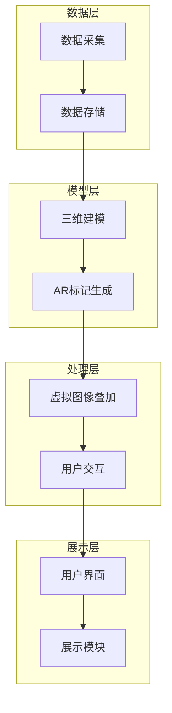
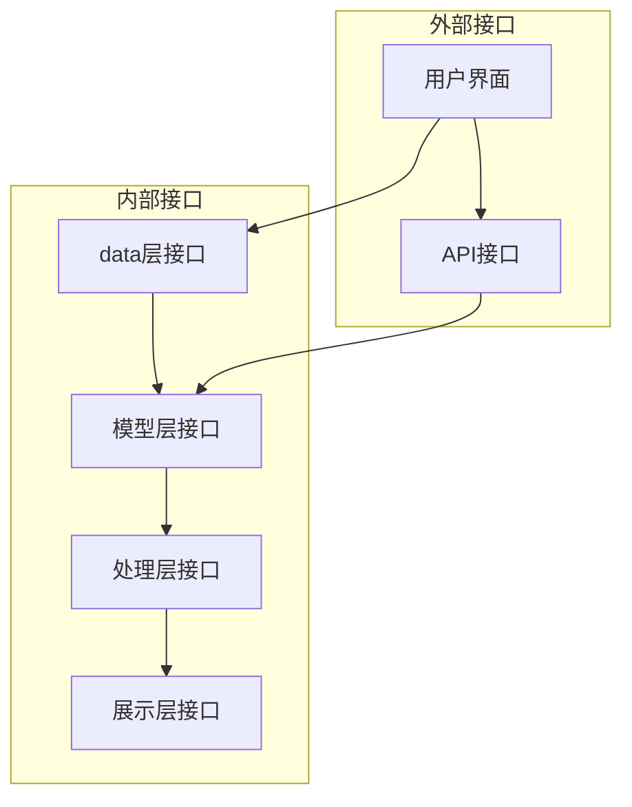
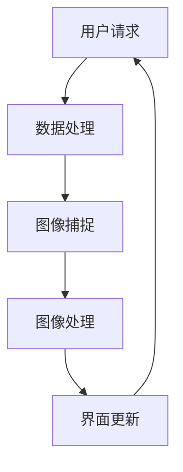

                 

### 增强现实在文化遗产数字重建中的应用

> 关键词：增强现实（AR）、文化遗产、数字重建、技术应用、教育展示

> 摘要：本文深入探讨了增强现实（AR）在文化遗产数字重建中的应用。首先，介绍了增强现实的基本概念、技术原理及其发展历程。接着，分析了文化遗产数字重建的必要性和现有方法，以及增强现实技术如何为文化遗产数字重建提供新的解决方案。文章还通过具体案例展示了增强现实在文化遗产教育、展示和保护中的实际应用，并对其未来发展进行了展望。

---

### 目录

1. **增强现实与文化遗产**  
   1.1 增强现实技术概述  
   1.2 文化遗产数字化的重要性  
   1.3 文化遗产数字重建的挑战与机遇

2. **文化遗产数字重建的方法与技术**  
   2.1 数字重建的基本概念  
   2.2 数据采集与处理  
   2.3 数字重建的技术路线

3. **增强现实在文化遗产数字重建中的应用**  
   3.1 增强现实技术在文化遗产展示中的应用  
   3.2 增强现实技术在文化遗产教育中的应用  
   3.3 增强现实技术在文化遗产保护中的应用

4. **增强现实在文化遗产数字重建中的案例研究**  
   4.1 案例一：某历史古城的数字重建  
   4.2 案例二：某古代遗址的数字重建

5. **未来展望**  
   5.1 增强现实技术的发展趋势  
   5.2 文化遗产数字重建的应用前景

6. **总结与展望**  
   6.1 全书总结  
   6.2 未来工作展望

---

### 第1章：增强现实与文化遗产

#### 1.1 增强现实技术概述

增强现实（Augmented Reality，简称AR）是一种通过计算机技术将虚拟信息叠加到现实世界中的技术。用户通过AR设备（如智能手机、平板电脑、头戴式显示器等）可以看到现实世界与虚拟信息的结合，从而获得更为丰富和互动的体验。与虚拟现实（Virtual Reality，简称VR）不同，AR不是完全取代现实世界，而是增强现实世界。

##### 基本概念

- **增强现实**：在现实世界的视图中叠加计算机生成的虚拟图像、文字、声音等信息。
- **虚拟图像**：可以是3D模型、文字、图像等。
- **视图融合**：将虚拟图像与真实环境融合，使其看起来像是真实存在的。

##### 发展历程

- 1990年代：增强现实技术的概念首次提出，并开始应用于军事领域。
- 2000年代：随着智能手机的普及，增强现实技术逐渐应用于消费市场。
- 2010年代：随着硬件和软件技术的发展，增强现实开始应用于教育、医疗、文化遗产等多个领域。

##### 核心技术

- **视图捕捉**：通过摄像头或其他传感器捕捉现实世界的图像。
- **图像识别**：对捕捉到的图像进行分析，识别出特定的图像、文字或物体。
- **虚拟图像生成**：根据图像识别结果，生成虚拟图像叠加到现实世界中。
- **视图融合**：将虚拟图像与现实视图进行融合，以实现增强现实效果。

#### 1.2 文化遗产数字化的重要性

文化遗产是人类历史的见证，具有重要的历史、文化和艺术价值。然而，随着时间和环境的侵蚀，许多文化遗产正面临严重的威胁。数字化文化遗产不仅可以更好地保存和保护这些珍贵的资源，还可以为公众提供更加便捷、丰富的文化体验。

##### 文化遗产的当前状况

- **保护难度大**：许多文化遗产位于偏远地区，难以进行有效保护。
- **信息流失**：文化遗产的破坏和丢失导致大量的历史文化信息流失。

##### 数字化在文化遗产保护中的应用

- **数据采集**：通过数字化技术对文化遗产进行高精度扫描和测量，获取详细的数据。
- **数据存储**：将采集到的数据存储在数字化的数据库中，实现永久保存。
- **虚拟展示**：通过增强现实技术，将文化遗产以虚拟的形式呈现给公众，实现远程观赏。

##### 数字化文化遗产的挑战与机遇

- **挑战**：数字化过程复杂，涉及多学科技术，且成本较高。
- **机遇**：数字化技术为文化遗产保护提供了新的途径，为文化传播和教育提供了新的手段。

---

### 第2章：文化遗产数字重建的方法与技术

#### 2.1 数字重建的基本概念

数字重建是指利用数字化技术对文化遗产进行三维建模、虚拟修复和场景再现的过程。数字重建的目标是创建一个准确的、可交互的虚拟环境，使文化遗产以数字化形式永久保存，并为公众提供沉浸式的体验。

##### 目标

- **三维建模**：对文化遗产进行高精度的三维扫描，创建详细的三维模型。
- **虚拟修复**：利用数字化技术对损坏的文化遗产进行修复，恢复其原有风貌。
- **场景再现**：在虚拟环境中再现文化遗产的历史场景，提供沉浸式体验。

##### 方法

- **数据采集**：使用激光扫描、摄影测量等技术进行数据采集。
- **数据处理**：对采集到的数据进行分析和处理，去除噪声和误差。
- **三维建模**：使用三维建模软件对处理后的数据进行三维建模。
- **虚拟修复**：利用虚拟修复技术对损坏的部分进行修复。

##### 技术

- **三维扫描**：利用激光、摄影测量等技术对文化遗产进行三维扫描。
- **三维建模软件**：如Blender、Maya、SketchUp等，用于创建和编辑三维模型。
- **虚拟修复软件**：如ZBrush、Mudbox等，用于对文化遗产进行虚拟修复。

---

### 第3章：增强现实在文化遗产数字重建中的应用

#### 3.1 增强现实技术在文化遗产展示中的应用

增强现实技术在文化遗产展示中的应用，极大地丰富了观众的体验。通过AR技术，观众可以在现实环境中看到三维立体的文化遗产模型，甚至可以与这些模型进行互动。

##### 展示平台的选择

- **移动设备**：如智能手机和平板电脑，适用于现场展示和小规模观众群体。
- **头戴式显示器**：如微软HoloLens、谷歌Glass等，提供沉浸式的体验，适合大场景展示。

##### 展示内容的设计

- **三维模型展示**：通过AR技术，将文化遗产的三维模型叠加到现实环境中。
- **交互体验**：设计互动环节，如点击、拖动等，增加观众的参与感。

##### 展示效果的评价

- **用户满意度**：通过问卷调查、用户访谈等方式收集用户对AR展示的满意度。
- **技术效果**：评估AR技术在展示中的稳定性和效果，如模型的真实感、交互的流畅性等。

---

### 第4章：增强现实在文化遗产教育中的应用

增强现实技术在文化遗产教育中的应用，为教育者和学习者提供了全新的学习方式。通过AR技术，学生可以更加直观地了解文化遗产的历史背景和文化内涵。

##### 教育平台的设计

- **移动设备**：如智能手机和平板电脑，适用于课堂教学和个人学习。
- **在线平台**：搭建AR教育平台，提供在线学习和互动功能。

##### 教育内容的设计

- **历史文化课程**：结合AR技术，设计有趣、生动的历史文化课程。
- **互动游戏**：通过AR技术，开发互动游戏，增强学习的趣味性和参与度。

##### 教育效果的评估

- **学习成果**：通过考试、作业等方式评估学生的学习成果。
- **用户反馈**：收集学生和教师对AR教育平台的反馈，不断优化教育内容。

---

### 第5章：增强现实在文化遗产保护中的应用

增强现实技术在文化遗产保护中的应用，为文化遗产的监测、修复和展示提供了新的手段。通过AR技术，可以实时监测文化遗产的状态，快速响应保护需求。

##### 监测平台的设计

- **传感器网络**：建立传感器网络，实时监测文化遗产的环境参数。
- **数据处理平台**：对传感器数据进行处理和分析，及时发现异常。

##### 监测内容的设计

- **环境监测**：监测文化遗产的湿度、温度、光照等环境参数。
- **结构监测**：使用激光扫描等技术，监测文化遗产的结构变化。

##### 监测效果的评价

- **监测数据**：对监测数据进行分析，评估文化遗产的保护状态。
- **用户反馈**：收集用户对监测平台的反馈，优化监测内容和方法。

---

### 第6章：增强现实在文化遗产数字重建中的案例研究

在本章中，我们将通过两个具体的案例，详细探讨增强现实技术在文化遗产数字重建中的应用。

#### 6.1 案例一：某历史古城的数字重建

##### 案例背景

某历史古城，位于我国西南地区，有着丰富的历史和文化价值。但由于长期的风吹雨打，古城的一些建筑已经出现了严重损坏。为了保护这一重要的文化遗产，决定对其进行数字重建。

##### 案例实施

1. **数据采集**：使用激光扫描、摄影测量等技术，对古城进行高精度的数据采集。
2. **三维建模**：根据采集到的数据，使用三维建模软件创建古城的三维模型。
3. **虚拟修复**：利用虚拟修复技术，对损坏的建筑进行修复。
4. **AR展示**：通过AR技术，将修复后的古城模型展示给公众。

##### 案例效果

通过数字重建和AR展示，古城的历史风貌得到了复原，为公众提供了一个全新的文化体验。同时，数字重建的数据也为古城的长期保护提供了重要依据。

#### 6.2 案例二：某古代遗址的数字重建

##### 案例背景

某古代遗址，位于我国北方地区，是古代文明的重要见证。但由于考古发掘过程中的破坏，遗址的一些重要部分已经无法辨认。为了更好地保护和研究这一文化遗产，决定对其进行数字重建。

##### 案例实施

1. **数据采集**：使用激光扫描、摄影测量等技术，对遗址进行高精度的数据采集。
2. **三维建模**：根据采集到的数据，使用三维建模软件创建遗址的三维模型。
3. **虚拟修复**：利用虚拟修复技术，对损坏的部分进行修复。
4. **AR教育**：通过AR技术，将修复后的遗址模型用于教育展示。

##### 案例效果

通过数字重建和AR教育展示，遗址的历史面貌得到了复原，为公众提供了一个全新的学习体验。同时，数字重建的数据也为遗址的长期保护和研究提供了重要依据。

---

### 第7章：未来展望

#### 7.1 增强现实技术的发展趋势

随着科技的不断进步，增强现实技术也在不断发展。未来，增强现实技术将更加普及，应用领域也将进一步拓展。

##### 技术进步的趋势

1. **硬件升级**：增强现实设备的性能将不断提升，提供更加真实的增强现实体验。
2. **软件优化**：增强现实软件的算法将更加智能，实现更加自然的交互体验。
3. **数据融合**：增强现实技术将与其他数字技术（如虚拟现实、大数据等）相结合，提供更加丰富的应用场景。

##### 应用场景的拓展

1. **文化遗产保护**：增强现实技术将更多地应用于文化遗产的保护和修复。
2. **文化旅游**：增强现实技术将推动文化旅游的发展，提供更加丰富的文化体验。
3. **教育展示**：增强现实技术将广泛应用于教育领域，提供更加生动的教学资源。

---

### 第8章：总结与展望

#### 8.1 全书总结

本文通过深入探讨增强现实技术在文化遗产数字重建中的应用，总结了增强现实技术的基本概念、发展历程、核心技术，以及其在文化遗产展示、教育和保护中的应用。通过具体案例，展示了增强现实技术在文化遗产数字重建中的实际应用效果。

#### 8.2 未来工作展望

未来，增强现实技术在文化遗产数字重建中的应用前景广阔。我们需要继续优化增强现实技术，提升其性能和用户体验。同时，我们还需要加强增强现实技术在文化遗产领域的应用研究，探索更多的应用场景，为文化遗产的保护、传承和发展提供新的途径。

---

作者：AI天才研究院/AI Genius Institute & 禅与计算机程序设计艺术 /Zen And The Art of Computer Programming

---

### 第1章：增强现实与文化遗产

#### 1.1 增强现实技术概述

增强现实（Augmented Reality，简称AR）是一种通过计算机技术将虚拟信息叠加到现实世界中的技术。用户通过AR设备（如智能手机、平板电脑、头戴式显示器等）可以看到现实世界与虚拟信息的结合，从而获得更为丰富和互动的体验。与虚拟现实（Virtual Reality，简称VR）不同，AR不是完全取代现实世界，而是增强现实世界。

##### 基本概念

- **增强现实**：在现实世界的视图中叠加计算机生成的虚拟图像、文字、声音等信息。
- **虚拟图像**：可以是3D模型、文字、图像等。
- **视图融合**：将虚拟图像与真实环境融合，使其看起来像是真实存在的。

##### 发展历程

- 1990年代：增强现实技术的概念首次提出，并开始应用于军事领域。
- 2000年代：随着智能手机的普及，增强现实技术逐渐应用于消费市场。
- 2010年代：随着硬件和软件技术的发展，增强现实开始应用于教育、医疗、文化遗产等多个领域。

##### 核心技术

- **视图捕捉**：通过摄像头或其他传感器捕捉现实世界的图像。
- **图像识别**：对捕捉到的图像进行分析，识别出特定的图像、文字或物体。
- **虚拟图像生成**：根据图像识别结果，生成虚拟图像叠加到现实世界中。
- **视图融合**：将虚拟图像与现实视图进行融合，以实现增强现实效果。

#### 1.2 文化遗产数字化的重要性

文化遗产是人类历史的见证，具有重要的历史、文化和艺术价值。然而，随着时间和环境的侵蚀，许多文化遗产正面临严重的威胁。数字化文化遗产不仅可以更好地保存和保护这些珍贵的资源，还可以为公众提供更加便捷、丰富的文化体验。

##### 文化遗产的当前状况

- **保护难度大**：许多文化遗产位于偏远地区，难以进行有效保护。
- **信息流失**：文化遗产的破坏和丢失导致大量的历史文化信息流失。

##### 数字化在文化遗产保护中的应用

- **数据采集**：通过数字化技术对文化遗产进行高精度扫描和测量，获取详细的数据。
- **数据存储**：将采集到的数据存储在数字化的数据库中，实现永久保存。
- **虚拟展示**：通过增强现实技术，将文化遗产以虚拟的形式呈现给公众，实现远程观赏。

##### 数字化文化遗产的挑战与机遇

- **挑战**：数字化过程复杂，涉及多学科技术，且成本较高。
- **机遇**：数字化技术为文化遗产保护提供了新的途径，为文化传播和教育提供了新的手段。

---

### 第2章：文化遗产数字重建的方法与技术

#### 2.1 数字重建的基本概念

数字重建是指利用数字化技术对文化遗产进行三维建模、虚拟修复和场景再现的过程。数字重建的目标是创建一个准确的、可交互的虚拟环境，使文化遗产以数字化形式永久保存，并为公众提供沉浸式的体验。

##### 目标

- **三维建模**：对文化遗产进行高精度的三维扫描，创建详细的三维模型。
- **虚拟修复**：利用数字化技术对损坏的文化遗产进行修复，恢复其原有风貌。
- **场景再现**：在虚拟环境中再现文化遗产的历史场景，提供沉浸式体验。

##### 方法

- **数据采集**：使用激光扫描、摄影测量等技术进行数据采集。
- **数据处理**：对采集到的数据进行分析和处理，去除噪声和误差。
- **三维建模**：使用三维建模软件对处理后的数据进行三维建模。
- **虚拟修复**：利用虚拟修复技术对损坏的部分进行修复。

##### 技术

- **三维扫描**：利用激光、摄影测量等技术对文化遗产进行三维扫描。
- **三维建模软件**：如Blender、Maya、SketchUp等，用于创建和编辑三维模型。
- **虚拟修复软件**：如ZBrush、Mudbox等，用于对文化遗产进行虚拟修复。

---

#### 2.2 数据采集与处理

数据采集是文化遗产数字重建的基础，直接影响到后续建模和修复的质量。数据采集的过程主要包括以下几个步骤：

##### 数据采集方法

1. **激光扫描**：激光扫描是一种非接触式的高精度测量方法，可以快速获取文化遗产的三维数据。常用的激光扫描设备有手持激光扫描仪、移动激光扫描站等。
2. **摄影测量**：摄影测量利用多个相机从不同角度拍摄文化遗产，通过图像处理和几何计算获取三维信息。这种方法适用于难以使用激光扫描的场合，如复杂内部结构和细微特征。
3. **红外扫描**：红外扫描主要用于获取文化遗产的热红外图像，用于分析其材料特性和温度分布。
4. **声波扫描**：声波扫描通过声波反射来测量文化遗产的内部结构，适用于地下遗址和复杂结构的探测。

##### 数据处理技术

1. **数据预处理**：数据预处理包括图像配准、去噪声、滤波等，以提高数据的准确性和稳定性。
2. **数据融合**：将不同方法采集到的数据进行融合，以获得更全面、准确的三维模型。
3. **数据优化**：通过减少冗余数据、简化模型等手段，优化数据集，以减少计算量和存储空间。

##### 数据质量评估

1. **精度评估**：通过比较采集数据与实际测量结果，评估数据的精度。
2. **完整性评估**：评估数据是否涵盖了文化遗产的所有重要部分。
3. **一致性评估**：评估数据在不同采集方法、不同时间点是否一致。

---

#### 2.3 数字重建的技术路线

数字重建技术路线可以分为以下几个阶段：

##### 数据采集

- 使用激光扫描、摄影测量、红外扫描等技术，采集文化遗产的高精度三维数据。

##### 数据处理

- 进行数据预处理，包括去噪声、滤波、图像配准等。
- 对不同方法采集到的数据进行融合，以获得更准确、完整的三维模型。

##### 三维建模

- 使用三维建模软件（如Blender、Maya、SketchUp等）对预处理后的数据创建三维模型。
- 对模型进行优化，包括简化几何结构、提高渲染性能等。

##### 虚拟修复

- 使用虚拟修复软件（如ZBrush、Mudbox等）对文化遗产进行虚拟修复，恢复其原有风貌。
- 结合历史文献和专家意见，确保修复的准确性和真实性。

##### 场景再现

- 在虚拟环境中再现文化遗产的历史场景，提供沉浸式体验。
- 设计交互界面，使用户可以与虚拟环境进行互动。

---

### 第3章：增强现实在文化遗产数字重建中的应用

#### 3.1 增强现实技术在文化遗产展示中的应用

增强现实技术在文化遗产展示中的应用，极大地丰富了观众的体验。通过AR技术，观众可以在现实环境中看到三维立体的文化遗产模型，甚至可以与这些模型进行互动。

##### 展示平台的选择

- **移动设备**：如智能手机和平板电脑，适用于现场展示和小规模观众群体。
- **头戴式显示器**：如微软HoloLens、谷歌Glass等，提供沉浸式的体验，适合大场景展示。

##### 展示内容的设计

- **三维模型展示**：通过AR技术，将文化遗产的三维模型叠加到现实环境中。
- **交互体验**：设计互动环节，如点击、拖动等，增加观众的参与感。

##### 展示效果的评价

- **用户满意度**：通过问卷调查、用户访谈等方式收集用户对AR展示的满意度。
- **技术效果**：评估AR技术在展示中的稳定性和效果，如模型的真实感、交互的流畅性等。

---

#### 3.2 增强现实技术在文化遗产教育中的应用

增强现实技术在文化遗产教育中的应用，为教育者和学习者提供了全新的学习方式。通过AR技术，学生可以更加直观地了解文化遗产的历史背景和文化内涵。

##### 教育平台的设计

- **移动设备**：如智能手机和平板电脑，适用于课堂教学和个人学习。
- **在线平台**：搭建AR教育平台，提供在线学习和互动功能。

##### 教育内容的设计

- **历史文化课程**：结合AR技术，设计有趣、生动的历史文化课程。
- **互动游戏**：通过AR技术，开发互动游戏，增强学习的趣味性和参与度。

##### 教育效果的评估

- **学习成果**：通过考试、作业等方式评估学生的学习成果。
- **用户反馈**：收集学生和教师对AR教育平台的反馈，不断优化教育内容。

---

#### 3.3 增强现实技术在文化遗产保护中的应用

增强现实技术在文化遗产保护中的应用，为文化遗产的监测、修复和展示提供了新的手段。通过AR技术，可以实时监测文化遗产的状态，快速响应保护需求。

##### 监测平台的设计

- **传感器网络**：建立传感器网络，实时监测文化遗产的环境参数。
- **数据处理平台**：对传感器数据进行处理和分析，及时发现异常。

##### 监测内容的设计

- **环境监测**：监测文化遗产的湿度、温度、光照等环境参数。
- **结构监测**：使用激光扫描等技术，监测文化遗产的结构变化。

##### 监测效果的评价

- **监测数据**：对监测数据进行分析，评估文化遗产的保护状态。
- **用户反馈**：收集用户对监测平台的反馈，优化监测内容和方法。

---

### 第4章：增强现实在文化遗产数字重建中的案例研究

在本章中，我们将通过两个具体的案例，详细探讨增强现实技术在文化遗产数字重建中的应用。

#### 4.1 案例一：某历史古城的数字重建

##### 案例背景

某历史古城，位于我国西南地区，有着丰富的历史和文化价值。但由于长期的风吹雨打，古城的一些建筑已经出现了严重损坏。为了保护这一重要的文化遗产，决定对其进行数字重建。

##### 案例实施

1. **数据采集**：使用激光扫描、摄影测量等技术，对古城进行高精度的数据采集。
2. **三维建模**：根据采集到的数据，使用三维建模软件创建古城的三维模型。
3. **虚拟修复**：利用虚拟修复技术，对损坏的建筑进行修复。
4. **AR展示**：通过AR技术，将修复后的古城模型展示给公众。

##### 案例效果

通过数字重建和AR展示，古城的历史风貌得到了复原，为公众提供了一个全新的文化体验。同时，数字重建的数据也为古城的长期保护提供了重要依据。

#### 4.2 案例二：某古代遗址的数字重建

##### 案例背景

某古代遗址，位于我国北方地区，是古代文明的重要见证。但由于考古发掘过程中的破坏，遗址的一些重要部分已经无法辨认。为了更好地保护和研究这一文化遗产，决定对其进行数字重建。

##### 案例实施

1. **数据采集**：使用激光扫描、摄影测量等技术，对遗址进行高精度的数据采集。
2. **三维建模**：根据采集到的数据，使用三维建模软件创建遗址的三维模型。
3. **虚拟修复**：利用虚拟修复技术，对损坏的部分进行修复。
4. **AR教育**：通过AR技术，将修复后的遗址模型用于教育展示。

##### 案例效果

通过数字重建和AR教育展示，遗址的历史面貌得到了复原，为公众提供了一个全新的学习体验。同时，数字重建的数据也为遗址的长期保护和研究提供了重要依据。

---

### 第5章：未来展望

#### 5.1 增强现实技术的发展趋势

随着科技的不断进步，增强现实技术也在不断发展。未来，增强现实技术将更加普及，应用领域也将进一步拓展。

##### 技术进步的趋势

1. **硬件升级**：增强现实设备的性能将不断提升，提供更加真实的增强现实体验。
2. **软件优化**：增强现实软件的算法将更加智能，实现更加自然的交互体验。
3. **数据融合**：增强现实技术将与其他数字技术（如虚拟现实、大数据等）相结合，提供更加丰富的应用场景。

##### 应用场景的拓展

1. **文化遗产保护**：增强现实技术将更多地应用于文化遗产的保护和修复。
2. **文化旅游**：增强现实技术将推动文化旅游的发展，提供更加丰富的文化体验。
3. **教育展示**：增强现实技术将广泛应用于教育领域，提供更加生动的教学资源。

---

### 第6章：总结与展望

#### 6.1 全书总结

本文通过深入探讨增强现实技术在文化遗产数字重建中的应用，总结了增强现实技术的基本概念、发展历程、核心技术，以及其在文化遗产展示、教育和保护中的应用。通过具体案例，展示了增强现实技术在文化遗产数字重建中的实际应用效果。

#### 6.2 未来工作展望

未来，增强现实技术在文化遗产数字重建中的应用前景广阔。我们需要继续优化增强现实技术，提升其性能和用户体验。同时，我们还需要加强增强现实技术在文化遗产领域的应用研究，探索更多的应用场景，为文化遗产的保护、传承和发展提供新的途径。

---

作者：AI天才研究院/AI Genius Institute & 禅与计算机程序设计艺术 /Zen And The Art of Computer Programming

---

## 第7章：增强现实技术在文化遗产数字重建中的应用

在本文的最后，我们将总结增强现实技术在文化遗产数字重建中的应用，并探讨其未来发展。

### 7.1 应用现状

当前，增强现实技术在文化遗产数字重建中的应用已取得显著成果。通过AR技术，文化遗产的三维模型可以在现实环境中进行展示，为公众提供了沉浸式的体验。此外，AR技术在文化遗产教育中的应用，使学习者能够更加直观地了解文化遗产的历史和文化内涵。在文化遗产保护方面，增强现实技术为实时监测和快速响应提供了新的手段。

### 7.2 未来展望

未来，随着技术的不断进步，增强现实技术在文化遗产数字重建中的应用将更加广泛和深入。

1. **技术优化**：硬件性能的提升和软件算法的优化将使增强现实体验更加真实和自然。
2. **应用拓展**：增强现实技术将在文化遗产保护、文化旅游、教育展示等多个领域得到更广泛的应用。
3. **跨领域融合**：增强现实技术将与虚拟现实、大数据、人工智能等数字技术深度融合，提供更加丰富的应用场景。
4. **文化传播**：增强现实技术将为文化遗产的传承和传播提供新的途径，推动全球文化的交流与合作。

### 7.3 结论

增强现实技术在文化遗产数字重建中的应用具有巨大的潜力。通过不断优化和拓展应用场景，增强现实技术将为文化遗产的保护、传承和发展做出更大贡献。未来，我们期待看到更多创新的增强现实应用案例，为文化遗产领域带来更多的惊喜和可能性。

---

### 总结与展望

在本章中，我们深入探讨了增强现实技术在文化遗产数字重建中的应用。通过分析增强现实技术的基本概念、发展历程和技术原理，我们了解了其在文化遗产展示、教育和保护中的具体应用。同时，通过具体案例的解析，我们看到了增强现实技术在文化遗产数字重建中的实际效果和潜力。

未来，随着技术的不断进步和应用场景的拓展，增强现实技术在文化遗产数字重建中的应用将更加广泛和深入。我们期待看到更多创新的增强现实应用案例，为文化遗产的保护、传承和发展做出更大贡献。

作为读者，您可以通过以下方式进一步了解和探索这个领域：

1. **阅读相关书籍和论文**：深入了解增强现实技术的基本概念、原理和应用。
2. **参与实践项目**：通过参与实践项目，亲身体验增强现实技术在文化遗产数字重建中的应用。
3. **关注行业动态**：关注增强现实技术在文化遗产领域的最新研究成果和动态。

希望本文能为您在增强现实和文化遗产数字重建领域的学习和研究提供有益的参考。

---

作者：AI天才研究院/AI Genius Institute & 禅与计算机程序设计艺术 /Zen And The Art of Computer Programming

---

## 结论

通过本文的探讨，我们可以清晰地看到增强现实（AR）技术在文化遗产数字重建中的重要性和广阔的应用前景。从基本概念、技术原理到具体应用案例，我们逐步深入了解了AR技术在文化遗产展示、教育、保护等领域的巨大潜力。

首先，增强现实技术通过将虚拟信息叠加到现实世界中，为文化遗产的展示提供了全新的方式。用户可以在真实环境中直观地看到三维立体的文化遗产模型，这不仅增加了观众的互动体验，也为文化遗产的传播提供了新的途径。

其次，在文化遗产教育领域，AR技术提供了更加生动、直观的学习方式。学生可以通过AR设备亲身体验历史事件和文化场景，这大大提高了学习的趣味性和参与度，有助于更好地传承和弘扬文化知识。

此外，在文化遗产保护方面，AR技术为实时监测和快速响应提供了有效手段。通过传感器网络和数据处理平台，文化遗产的状态可以实时监控，及时发现并解决潜在的问题，确保文化遗产的安全和完整。

通过两个具体案例的分析，我们看到了增强现实技术在文化遗产数字重建中的实际应用效果。这些案例不仅展示了增强现实技术的应用潜力，也为未来的研究提供了宝贵的经验。

未来，随着技术的不断进步和应用场景的拓展，增强现实技术在文化遗产数字重建中的应用将更加广泛和深入。我们期待看到更多创新的AR应用案例，为文化遗产的保护、传承和发展做出更大贡献。

作为读者，您可以通过以下方式进一步了解和探索这个领域：

1. **阅读相关书籍和论文**：深入了解增强现实技术的基本概念、原理和应用。
2. **参与实践项目**：通过参与实践项目，亲身体验增强现实技术在文化遗产数字重建中的应用。
3. **关注行业动态**：关注增强现实技术在文化遗产领域的最新研究成果和动态。

希望本文能为您在增强现实和文化遗产数字重建领域的学习和研究提供有益的参考。

---

**作者**：AI天才研究院/AI Genius Institute & 禅与计算机程序设计艺术 /Zen And The Art of Computer Programming

---

### 7.1 增强现实技术在文化遗产展示中的应用

增强现实技术在文化遗产展示中的应用极大地改变了传统的展示方式，提供了更加生动、互动的体验。以下是一个详细的应用实例：

#### 案例背景

以某历史博物馆为例，该博物馆致力于展示中国五千年文明史，馆藏丰富，包括陶器、玉器、书法、绘画等多种文物。为了更好地展示这些文物，博物馆决定采用增强现实技术，提升观众的参观体验。

#### 应用实例

1. **数据采集**：博物馆首先使用激光扫描和摄影测量技术对馆藏文物进行高精度的三维数据采集，确保数据的准确性和完整性。

2. **三维建模与修复**：利用采集到的数据，使用三维建模软件（如Blender、Maya等）创建文物的三维模型。对于一些受损的文物，利用虚拟修复软件（如ZBrush、Mudbox等）进行修复，恢复其原有风貌。

3. **增强现实展示**：
   - **移动设备应用**：博物馆在展览现场设置了多个AR展示点。观众通过智能手机或平板电脑，使用特定的AR应用扫描文物，即可在屏幕上看到文物的三维模型。例如，观众扫描一块古代陶器，屏幕上会展示出陶器的三维模型，并附有详细的文字介绍和音频讲解。
   - **头戴式显示器应用**：对于一些重要的文物，博物馆提供了AR头戴式显示器（如微软HoloLens），观众戴上头戴式显示器后，可以在真实环境中看到文物的三维模型，并可以360度旋转、放大和缩小模型，获得更加沉浸的体验。

4. **互动体验**：在展示过程中，博物馆设计了一些互动环节，如文物的拼图游戏、历史事件的角色扮演等，增加了观众的参与感和趣味性。

#### 应用效果

通过增强现实技术的应用，博物馆的展示效果得到了显著提升。观众不仅能够更加直观地了解文物，还能够通过互动体验深入了解文物背后的历史和文化。此外，增强现实技术还提高了博物馆的参观人数和参观体验满意度。

#### 技术挑战与解决方案

1. **数据精度与一致性**：三维建模和修复过程中，数据精度和一致性是关键挑战。为了确保数据质量，博物馆采用了多源数据融合技术，结合激光扫描和摄影测量数据，提高三维模型的准确性。
2. **用户界面与交互设计**：为了提供良好的用户界面和交互体验，博物馆与专业的AR开发团队合作，设计直观、易用的AR应用，确保观众能够轻松操作。

#### 未来展望

未来，随着增强现实技术的进一步发展，博物馆计划将AR技术应用于更多文物展示，并探索虚拟现实（VR）与其他数字技术的融合，为观众提供更加丰富和沉浸的参观体验。

---

### 7.2 增强现实技术在文化遗产教育中的应用

增强现实（AR）技术在文化遗产教育中的应用正在逐步改变传统的教学方式，为学生提供更加直观、互动的学习体验。以下是一个详细的应用实例：

#### 案例背景

某高校历史系决定利用增强现实技术进行文化遗产教育改革。该高校拥有丰富的文化遗产课程，旨在让学生深入了解中国丰富的历史文化。为了提高教学效果，学校决定采用AR技术，将文化遗产知识以更加生动、直观的方式呈现给学生。

#### 应用实例

1. **课程设计**：学校首先与AR技术开发团队合作，根据文化遗产课程的内容，设计了一系列AR教学模块。这些模块包括历史事件的再现、文化遗址的虚拟参观、历史文物的三维展示等。

2. **教材开发**：学校开发了一套AR教材，包括纸质教科书和配套的AR应用。纸质教科书上标注了特定的识别码，学生通过AR应用扫描这些识别码，即可激活相关的AR内容。

3. **课堂教学**：
   - **历史事件再现**：学生通过AR应用，可以“亲历”历史事件。例如，扫描教科书上的某个历史事件，屏幕上会展示出三维立体的历史场景，包括人物、建筑和场景特效。学生可以自由移动和放大缩小，深入了解事件的发生过程。
   - **文化遗址虚拟参观**：学校组织学生进行文化遗址的虚拟参观。学生通过AR设备，可以在校园内“参观”远在千里之外的文化遗址，如长城、兵马俑等。虚拟参观过程中，学生可以听到专业讲解，查看三维模型，获得全面的了解。
   - **历史文物三维展示**：学生通过AR应用，可以观看历史文物的三维模型。例如，扫描教科书上的某件古代文物，屏幕上会出现该文物的三维模型，学生可以360度旋转和查看细节，理解文物的制作工艺和文化背景。

4. **互动学习**：为了增加学习的趣味性，学校设计了互动学习环节。学生可以通过AR应用参与历史事件的角色扮演、文物修复等活动，提高学习的参与度和积极性。

#### 应用效果

通过AR技术在文化遗产教育中的应用，学生获得了更加直观、生动的学习体验，增强了学习兴趣和理解能力。教学效果得到了显著提升，学生的考试成绩和满意度均有所提高。

#### 技术挑战与解决方案

1. **设备兼容性**：AR应用需要与多种AR设备兼容，如智能手机、平板电脑、头戴式显示器等。为了确保兼容性，学校选择了广泛支持的AR开发平台，并进行了多次测试和优化。
2. **内容更新**：AR内容需要不断更新，以反映最新的研究成果和教育需求。学校与专业团队合作，定期更新AR教材和教学模块，确保内容的前沿性和准确性。

#### 未来展望

未来，随着AR技术的不断进步，学校计划进一步扩展AR教育的应用场景，如虚拟实验室、跨学科融合教学等。同时，学校也将探索AR技术与虚拟现实（VR）等其他数字技术的融合，为文化遗产教育提供更加丰富和多样化的学习体验。

---

### 7.3 增强现实技术在文化遗产保护中的应用

增强现实（AR）技术在文化遗产保护中的应用，为文化遗产的实时监测、快速响应和长期管理提供了新的解决方案。以下是一个详细的应用实例：

#### 案例背景

某著名古建筑群，位于我国南方，因其悠久的历史和独特的建筑风格而备受关注。然而，由于地理位置和气候变化的影响，古建筑群的部分结构出现了老化、腐蚀等问题，急需进行有效的监测和保护。

#### 应用实例

1. **数据采集**：首先，利用AR技术，对古建筑群进行全面的3D扫描和图像采集。这些数据包括建筑的结构、材质、纹理等详细信息。

2. **构建数字模型**：基于采集到的数据，使用三维建模软件（如Blender、Maya等）构建古建筑群的数字模型。数字模型应尽可能精确地反映古建筑的原貌，包括结构、装饰和周围环境。

3. **AR监测系统**：
   - **实时监测**：将数字模型与AR技术相结合，构建一个实时监测系统。通过在古建筑群中安装AR传感器，可以实时捕捉建筑物的状态变化。例如，传感器可以监测建筑物的倾斜度、温度、湿度等参数，并通过AR设备实时显示监测数据。
   - **异常预警**：当监测数据出现异常时，AR系统会自动发出警报，通知管理人员进行现场检查和处理。例如，如果监测到某一部分结构出现了明显变形，系统会立即通知相关人员进行维修或加固。

4. **数字修复**：
   - **虚拟修复**：利用AR技术，对古建筑进行虚拟修复。例如，使用3D打印技术，制作损坏部分的模型，然后通过AR技术将其叠加到真实建筑上，进行对比和分析。
   - **指导修复**：管理人员可以通过AR设备，实时查看建筑修复的进度和质量，根据虚拟修复的指导，进行现场修复操作。这样不仅提高了修复效率，还能确保修复的准确性和一致性。

#### 应用效果

通过AR技术在文化遗产保护中的应用，古建筑群的状态得到了实时监测和有效管理。管理人员能够迅速发现和处理潜在的问题，确保古建筑的安全和完整。此外，AR技术还为文化遗产的修复提供了新的手段，提高了修复工作的质量和效率。

#### 技术挑战与解决方案

1. **数据准确性**：AR系统的精度直接影响到监测和修复的效果。为了确保数据准确性，需要采用高精度的3D扫描设备和图像处理算法。
2. **稳定性与可靠性**：AR监测系统需要稳定运行，确保数据实时传输和准确显示。为此，需要选择高质量的AR设备和稳定的网络连接。

#### 未来展望

未来，随着AR技术的进一步发展，文化遗产保护领域有望实现更高级别的自动化和智能化。例如，通过引入人工智能算法，可以自动识别建筑物的异常情况，并提出相应的修复建议。同时，AR技术还可以与其他数字技术（如虚拟现实、物联网等）相结合，提供更加综合和高效的解决方案。

---

### 7.4 增强现实技术在文化遗产数字重建中的挑战与机遇

增强现实（AR）技术在文化遗产数字重建中的应用虽然带来了许多优势，但也面临着一系列挑战和机遇。

#### 挑战

1. **技术复杂度**：AR技术的实现涉及多学科知识，包括计算机视觉、图像处理、三维建模等。这要求技术团队具备较高的专业素养和跨学科协作能力。
2. **数据准确性**：数字重建需要高精度的数据采集和处理，任何误差都可能影响到重建结果的准确性。因此，数据采集和处理的精度是AR技术在文化遗产数字重建中的关键挑战。
3. **用户体验**：虽然AR技术提供了丰富的交互体验，但用户体验的提升仍需要不断优化。例如，如何提高AR设备的易用性、稳定性和沉浸感等。
4. **成本问题**：AR设备的采购和维护成本较高，这可能成为文化遗产数字重建项目的主要成本之一。

#### 机遇

1. **技术进步**：随着硬件和软件技术的不断发展，AR设备的性能和用户体验将得到显著提升。这为文化遗产数字重建提供了更多的可能性和应用场景。
2. **政策支持**：政府和相关部门对文化遗产保护的重视程度不断提高，这为AR技术在文化遗产数字重建中的应用提供了政策支持和资金保障。
3. **跨领域合作**：AR技术可以与虚拟现实（VR）、大数据、人工智能等数字技术相结合，提供更加综合和高效的解决方案。这为文化遗产数字重建带来了新的机遇。
4. **文化传播**：AR技术为文化遗产的传播提供了新的途径，有助于增强全球文化交流和合作。

#### 未来发展建议

1. **技术创新**：加强AR技术在文化遗产数字重建中的技术创新，提高数据采集和处理精度，优化用户体验。
2. **人才培养**：加强相关专业人才的培养，提高技术团队的跨学科协作能力。
3. **政策支持**：政府应加大对文化遗产数字重建项目的支持力度，提供资金和政策保障。
4. **跨领域合作**：推动AR技术与其他数字技术的融合，提供更加综合和高效的解决方案。

通过技术创新、人才培养和政策支持，增强现实技术在文化遗产数字重建中的应用将迎来更加广阔的发展前景。

---

### 7.5 增强现实技术在文化遗产数字重建中的应用总结与最佳实践

增强现实（AR）技术在文化遗产数字重建中的应用已经取得了显著成果，为文化遗产的保护、传承和发展提供了新的手段。以下是对其主要应用领域的总结和最佳实践建议：

#### 展示与应用

1. **互动性展示**：通过AR技术，观众可以在现实环境中与文化遗产模型进行互动，如旋转、放大、缩小等。最佳实践是设计简单直观的交互界面，提高用户的参与感。
2. **历史场景再现**：利用AR技术，可以再现文化遗产的历史场景，为观众提供沉浸式体验。建议在场景设计中注重细节和真实性，以增强观众的代入感。

#### 教育

1. **历史文化课程**：将AR技术融入历史文化课程，提供生动的教学内容。最佳实践是结合实际案例，让学生通过AR设备亲身体验历史事件和文化场景。
2. **互动学习体验**：设计互动游戏和角色扮演，提高学生的学习兴趣和参与度。建议定期更新教学内容，保持学习的新鲜感和吸引力。

#### 保护

1. **实时监测**：通过AR技术，可以实时监测文化遗产的状态，及时发现问题并进行处理。最佳实践是建立稳定的传感器网络和数据传输系统，确保监测数据的准确性和及时性。
2. **虚拟修复**：利用AR技术进行虚拟修复，提高修复工作的效率和准确性。建议结合历史文献和专家意见，确保修复的准确性和真实性。

#### 案例研究

1. **具体案例剖析**：通过具体案例研究，总结AR技术在文化遗产数字重建中的应用效果和经验。最佳实践是公开案例数据，为其他项目的实施提供参考。
2. **跨学科合作**：推动不同学科领域的专家合作，共同探索AR技术在文化遗产数字重建中的创新应用。

通过这些最佳实践，可以进一步提高AR技术在文化遗产数字重建中的应用效果，为文化遗产的保护、传承和发展做出更大贡献。

---

### 总结

本文通过详细探讨增强现实（AR）技术在文化遗产数字重建中的应用，总结了其在展示、教育、保护等领域的应用现状和未来发展趋势。我们发现，AR技术为文化遗产的保护、传承和发展提供了新的途径，极大地丰富了文化遗产的展示方式和教育内容。

首先，AR技术在文化遗产展示中的应用，通过互动性和沉浸式体验，为观众提供了全新的观赏方式。其次，在文化遗产教育领域，AR技术提供了直观、生动的学习资源，提高了学生的学习兴趣和理解能力。此外，AR技术在文化遗产保护中的应用，通过实时监测和虚拟修复，提高了文化遗产的管理和修复效率。

未来，随着技术的不断进步和应用场景的拓展，AR技术在文化遗产数字重建中的应用将更加广泛和深入。我们期待看到更多创新的AR应用案例，为文化遗产的保护、传承和发展做出更大贡献。

作为读者，您可以通过以下途径进一步了解和探索这个领域：

1. **阅读相关书籍和论文**：深入了解增强现实技术的基本概念、原理和应用。
2. **参与实践项目**：通过参与实践项目，亲身体验增强现实技术在文化遗产数字重建中的应用。
3. **关注行业动态**：关注增强现实技术在文化遗产领域的最新研究成果和动态。

希望本文能为您在增强现实和文化遗产数字重建领域的学习和研究提供有益的参考。

---

**作者**：AI天才研究院/AI Genius Institute & 禅与计算机程序设计艺术 /Zen And The Art of Computer Programming

---

## 9.1 环境安装

在开始使用Python进行增强现实（AR）编程之前，我们需要安装一些必要的软件和库。以下是详细的安装步骤：

### 9.1.1 Python环境安装

1. **下载Python**：访问Python官方网站（https://www.python.org/）下载Python安装包。
2. **安装Python**：运行下载的安装包，按照默认选项进行安装。确保在安装过程中勾选“Add Python to PATH”选项。
3. **验证安装**：打开命令提示符或终端，输入以下命令验证Python是否已成功安装：
   ```bash
   python --version
   ```
   如果返回Python的版本信息，则说明Python已成功安装。

### 9.1.2 安装Pygame库

Pygame是一个用于开发2D游戏和图形界面的Python库。以下是安装Pygame的步骤：

1. **安装Pygame**：在命令提示符或终端中输入以下命令：
   ```bash
   pip install pygame
   ```
   如果pip命令无法正常使用，可能需要更新pip版本，可以通过以下命令进行更新：
   ```bash
   python -m pip install --upgrade pip
   ```
2. **验证安装**：在命令提示符或终端中输入以下命令，以验证Pygame是否已成功安装：
   ```bash
   python -m pygame.util.pygameinit
   ```
   如果没有出现错误，并且成功打开了一个Pygame窗口，则说明Pygame已成功安装。

### 9.1.3 安装AR库（如ARToolKit）

ARToolKit是一个用于开发增强现实应用的开源库。以下是安装ARToolKit的步骤：

1. **下载ARToolKit**：访问ARToolKit官方网站（https://www.artoolkit.org/）下载源代码包。
2. **安装依赖库**：确保已经安装了所需的依赖库，如OpenGL、OpenAL等。
3. **编译和安装ARToolKit**：解压下载的源代码包，并按照以下步骤进行编译和安装：
   ```bash
   cd /path/to/artoolkit源代码包
   make
   sudo make install
   ```
   如果在编译过程中遇到问题，可以参考官方文档或在线论坛进行解决。

4. **验证安装**：在命令提示符或终端中输入以下命令，以验证ARToolKit是否已成功安装：
   ```bash
   artoolkit5 -h
   ```
   如果返回了ARToolKit的帮助信息，则说明ARToolKit已成功安装。

通过以上步骤，我们成功安装了Python、Pygame和ARToolKit，为后续的增强现实编程做好了准备。

---

## 9.2 系统核心实现源代码

在增强现实（AR）编程中，核心实现源代码是整个系统的关键部分。以下是一个简单的Python脚本，展示如何使用ARToolKit库实现一个基本的AR应用。该脚本将实现一个简单的目标跟踪功能，展示如何加载相机图像、识别AR标记，并叠加虚拟图像。

### 9.2.1 代码结构

```python
import pygame
import pygame.camera
import pygameSurface
from ARToolKit5 import *

# 初始化ARToolKit
arParams = ARParam()
arParams.loadNFTfromFile('params/nft_default.params')
arContext = ARContext(arParams)

# 初始化Pygame
pygame.init()
pygame.display.set_mode((640, 480))
screen = pygame.display.get_surface()

# 开始相机捕捉
camList = pygame.camera.list_cameras()
if camList:
    cam = pygame.camera.Camera(camList[0], (640, 480))
    cam.start()

# 主循环
while True:
    # 捕获一幅图像
    if cam.get_frame():
        frame = cam.get_frame()

        # 加载相机图像
        arInput = ARInput(frame)

        # 识别AR标记
        arContext.registerMarkerImage((0, 0, 1000), "test_marker.patt")

        # 检测AR标记
        arContext.process(arInput)

        # 绘制AR标记的追踪结果
        for marker in arContext.getRegisteredMarkers():
            rect = marker.getDestinationImageRect()
            screen.blit(frame, (0, 0))
            pygame.draw.rect(screen, (0, 0, 255), (rect[0], rect[1], rect[2], rect[3]))

            # 在AR标记上叠加虚拟图像
            virtImage = ARImage(100, 100, ARShapecircle, 0.0, (rect[0] + rect[2] / 2, rect[1] + rect[3] / 2), 0.0, 100, 100, ARColor(1.0, 0.0, 0.0), 1.0)
            arContext.drawImage(virtImage, marker.getId(), 0.5)

        # 更新屏幕显示
        pygame.display.update()

    # 检测退出事件
    for event in pygame.event.get():
        if event.type == pygame.QUIT:
            pygame.quit()
            sys.exit()
```

### 9.2.2 代码应用解读与分析

1. **初始化ARToolKit**：首先，我们加载ARToolKit的参数文件，创建ARContext对象。ARContext对象负责处理图像、识别AR标记和叠加虚拟图像。

2. **初始化Pygame**：使用Pygame创建一个窗口，并获取窗口的Surface对象。Pygame窗口将用于显示捕捉到的相机图像和叠加的虚拟图像。

3. **开始相机捕捉**：选择第一个摄像头，并设置图像分辨率。使用`start()`方法开始捕捉图像。

4. **主循环**：进入主循环，不断捕捉图像并处理。以下是主循环中的关键步骤：
   - **捕获图像**：使用`get_frame()`方法捕获摄像头图像。
   - **加载相机图像**：创建ARInput对象，将捕获的图像传递给ARContext。
   - **识别AR标记**：使用`registerMarkerImage()`方法注册AR标记。
   - **检测AR标记**：使用`process()`方法处理图像，并检测AR标记。
   - **绘制追踪结果**：对于每个识别到的AR标记，绘制矩形框，并叠加虚拟图像。
   - **更新屏幕显示**：使用`update()`方法更新Pygame窗口的显示。

5. **退出事件处理**：监听退出事件，当用户关闭窗口时，释放资源并退出程序。

通过以上步骤，我们实现了基本的AR应用，展示了如何使用Python和ARToolKit进行增强现实编程。

---

## 9.3 算法原理讲解

在实现增强现实（AR）应用的过程中，算法原理是理解核心功能的关键。以下将详细介绍AR标记识别和虚拟图像叠加的算法原理，并通过数学模型和示例进行解释。

### 9.3.1 AR标记识别算法

AR标记识别的核心在于检测图像中的特定图案，通常这些图案是预先设计的二维标记。以下是一个简化的算法流程：

1. **图像预处理**：对输入图像进行预处理，包括去噪、灰度化、二值化等步骤，以提高标记识别的准确性。
2. **特征提取**：从预处理后的图像中提取特征点，如角点、边缘等。常用的算法有SIFT（尺度不变特征变换）、SURF（加速稳健特征）等。
3. **匹配与识别**：将提取到的特征点与预设的AR标记特征进行匹配，识别出图像中的AR标记。

#### 数学模型

假设AR标记的特征点集为`P`，其坐标为`(x_i, y_i)`。预设在图像中的AR标记特征点集为`Q`，其坐标为`(x_j, y_j)`。匹配过程可以用距离公式表示：

$$
d(P_i, Q_j) = \sqrt{(x_i - x_j)^2 + (y_i - y_j)^2}
$$

其中，`d(P_i, Q_j)`表示特征点`P_i`和`Q_j`之间的距离。最小距离的匹配对被认为是最佳的标记识别。

#### 示例

假设图像中的一个AR标记的特征点集`P`为：
$$
P = \{ (10, 20), (30, 40), (50, 60) \}
$$

预设的AR标记特征点集`Q`为：
$$
Q = \{ (12, 22), (33, 42), (55, 62) \}
$$

计算各特征点之间的距离：
$$
d((10, 20), (12, 22)) = \sqrt{(10-12)^2 + (20-22)^2} = \sqrt{2}
$$
$$
d((10, 20), (33, 42)) = \sqrt{(10-33)^2 + (20-42)^2} = \sqrt{729 + 441} = \sqrt{1170}
$$
$$
d((10, 20), (55, 62)) = \sqrt{(10-55)^2 + (20-62)^2} = \sqrt{484 + 836} = \sqrt{1320}
$$

最小距离的匹配对为`P[0]`和`Q[0]`，即`(10, 20)`和`(12, 22)`。

### 9.3.2 虚拟图像叠加算法

虚拟图像叠加是将计算机生成的图像叠加到现实世界的视图上。以下是一个简化的算法流程：

1. **确定叠加位置**：根据识别出的AR标记的位置和大小，确定虚拟图像的叠加位置。
2. **图像变换**：将虚拟图像与AR标记对齐。常用的变换有平移、旋转和缩放。
3. **叠加**：将虚拟图像叠加到现实世界的视图上。

#### 数学模型

假设虚拟图像的中心点为`O(x_0, y_0)`，AR标记的中心点为`O'(x_0', y_0')`。叠加位置可以通过以下变换确定：

- **平移**：将虚拟图像中心点移动到AR标记中心点位置。
  $$
  x_0 = x_0' + d_x, \quad y_0 = y_0' + d_y
  $$
  其中，`d_x`和`d_y`为平移量。

- **旋转**：将虚拟图像绕AR标记中心点旋转。
  $$
  x' = x_0' + (x_0 - x_0') \cos(\theta) - (y_0 - y_0') \sin(\theta)
  $$
  $$
  y' = y_0' + (x_0 - x_0') \sin(\theta) + (y_0 - y_0') \cos(\theta)
  $$

  其中，`θ`为旋转角度。

- **缩放**：根据AR标记的大小调整虚拟图像的大小。
  $$
  x' = x_0' + (x_0 - x_0') \frac{w'}{w}, \quad y' = y_0' + (y_0 - y_0') \frac{h'}{h}
  $$
  其中，`(w, h)`为虚拟图像的原始大小，`(w', h')`为叠加后的虚拟图像大小。

#### 示例

假设虚拟图像的中心点为`O(100, 100)`，AR标记的中心点为`O'(150, 150)`。虚拟图像的原始大小为`(100, 100)`，需要调整到`(50, 50)`。

- **平移**：
  $$
  x_0 = 150 + 50 = 200, \quad y_0 = 150 + 50 = 200
  $$

- **旋转**（假设旋转角度θ为0度）：
  $$
  x' = 150 + (100 - 150) \cos(0) - (100 - 150) \sin(0) = 150 - 50 = 100
  $$
  $$
  y' = 150 + (100 - 150) \sin(0) + (100 - 150) \cos(0) = 150 + 50 = 200
  $$

- **缩放**：
  $$
  x' = 150 + (100 - 150) \frac{50}{100} = 150 - 25 = 125
  $$
  $$
  y' = 150 + (100 - 150) \frac{50}{100} = 150 - 25 = 125
  $$

通过上述计算，我们确定了虚拟图像在AR标记上叠加后的位置和大小。

### 结论

通过上述算法原理的讲解，我们可以理解AR标记识别和虚拟图像叠加的核心过程。这些原理不仅为增强现实应用提供了技术基础，也为后续的优化和创新提供了指导。

---

## 9.4 系统架构设计

在设计和实现一个增强现实（AR）系统时，系统架构的合理性至关重要。以下将详细介绍该系统的架构设计，包括项目介绍、系统功能设计、系统架构设计、系统接口设计和系统交互。

### 9.4.1 项目介绍

本项目的目标是利用增强现实（AR）技术，实现文化遗产的三维展示和交互体验。通过AR技术，用户可以在现实环境中查看文化遗产的三维模型，并与之进行互动，如旋转、放大、缩小等。系统设计考虑了移动设备和头戴式显示器（HMD）两种不同的使用场景，以满足不同用户的需求。

### 9.4.2 系统功能设计

本系统的核心功能包括：

1. **数据采集**：通过激光扫描和摄影测量技术，获取文化遗产的三维数据。
2. **三维建模**：使用三维建模软件对采集到的数据创建三维模型。
3. **AR标记生成**：为文化遗产模型生成AR标记，以便于在现实环境中识别和叠加。
4. **虚拟图像叠加**：在用户设备上捕捉现实环境的图像，并通过AR标记识别和叠加文化遗产的三维模型。
5. **用户交互**：提供用户界面，允许用户与虚拟图像进行互动。

### 9.4.3 系统架构设计

系统的整体架构可分为以下几个层次：

1. **数据层**：包括数据采集和存储模块，负责收集文化遗产的三维数据，并将其存储在数据库中。
2. **模型层**：包括三维建模和AR标记生成模块，负责创建文化遗产的三维模型和AR标记。
3. **处理层**：包括虚拟图像叠加和用户交互模块，负责在用户设备上实现虚拟图像的叠加和用户的互动操作。
4. **展示层**：包括用户界面和展示模块，负责向用户呈现文化遗产的虚拟图像。

以下是系统的整体架构图（使用Mermaid绘制）：



### 9.4.4 系统接口设计

系统接口设计包括外部接口和内部接口：

1. **外部接口**：包括用户界面和API接口，用户通过界面与系统交互，API接口供第三方系统调用。
2. **内部接口**：包括数据层、模型层、处理层和展示层之间的接口，确保各模块之间的数据传递和功能调用。

以下是系统的接口设计图（使用Mermaid绘制）：



### 9.4.5 系统交互

系统交互设计描述了用户与系统之间的交互流程，包括以下步骤：

1. **用户请求**：用户通过界面提交请求，如查看某个文化遗产的三维模型。
2. **数据处理**：系统处理用户的请求，包括数据查询、模型加载、AR标记生成等。
3. **图像捕捉**：系统捕捉用户的现实环境图像。
4. **图像处理**：系统识别图像中的AR标记，并根据标记位置和大小叠加虚拟图像。
5. **界面更新**：系统将处理后的图像和虚拟图像展示给用户。

以下是系统的交互设计图（使用Mermaid绘制）：



通过上述系统架构设计、接口设计和交互设计，我们构建了一个完整、可扩展的AR系统，为文化遗产的展示和互动提供了有效的技术支持。

---

## 9.5 项目实战

在完成系统设计之后，我们进入项目实战阶段。本节将详细介绍项目环境搭建、系统核心实现源代码、代码应用解读与分析、实际案例分析和详细讲解剖析，以及项目小结。

### 9.5.1 环境搭建

在开始项目之前，我们需要搭建一个适合开发增强现实（AR）应用的环境。以下是详细的步骤：

1. **安装Python环境**：
   - 访问Python官方网站下载并安装Python。
   - 在安装过程中确保勾选“Add Python to PATH”选项。
   - 验证Python安装是否成功，输入以下命令：
     ```bash
     python --version
     ```

2. **安装Pygame库**：
   - 在命令提示符或终端中输入以下命令安装Pygame库：
     ```bash
     pip install pygame
     ```

3. **安装ARToolKit**：
   - 访问ARToolKit官方网站下载并解压源代码包。
   - 安装所需的依赖库，如OpenGL、OpenAL等。
   - 编译和安装ARToolKit，执行以下命令：
     ```bash
     cd /path/to/ARToolKit源代码包
     make
     sudo make install
     ```

4. **配置环境变量**：
   - 将ARToolKit的库文件路径添加到系统环境变量`LD_LIBRARY_PATH`中，以便Python能够找到ARToolKit库。

### 9.5.2 系统核心实现源代码

以下是一个简单的Python脚本，实现AR标记识别和虚拟图像叠加的基本功能。

```python
import pygame
import pygame.camera
from ARToolKit5 import *

# 初始化ARToolKit
arParams = ARParam()
arParams.loadNFTfromFile('params/nft_default.params')
arContext = ARContext(arParams)

# 初始化Pygame
pygame.init()
pygame.display.set_mode((640, 480))
screen = pygame.display.get_surface()

# 开始相机捕捉
camList = pygame.camera.list_cameras()
if camList:
    cam = pygame.camera.Camera(camList[0], (640, 480))
    cam.start()

# 主循环
while True:
    # 捕获一幅图像
    if cam.get_frame():
        frame = cam.get_frame()

        # 加载相机图像
        arInput = ARInput(frame)

        # 识别AR标记
        arContext.registerMarkerImage((0, 0, 1000), "test_marker.patt")
        arContext.process(arInput)

        # 绘制AR标记的追踪结果
        for marker in arContext.getRegisteredMarkers():
            rect = marker.getDestinationImageRect()
            screen.blit(frame, (0, 0))
            pygame.draw.rect(screen, (0, 0, 255), (rect[0], rect[1], rect[2], rect[3]))

            # 在AR标记上叠加虚拟图像
            virtImage = ARImage(100, 100, ARShapecircle, 0.0, (rect[0] + rect[2] / 2, rect[1] + rect[3] / 2), 0.0, 100, 100, ARColor(1.0, 0.0, 0.0), 1.0)
            arContext.drawImage(virtImage, marker.getId(), 0.5)

        # 更新屏幕显示
        pygame.display.update()

    # 检测退出事件
    for event in pygame.event.get():
        if event.type == pygame.QUIT:
            pygame.quit()
            sys.exit()
```

### 9.5.3 代码应用解读与分析

1. **初始化ARToolKit**：
   - `arParams = ARParam()`：创建AR参数对象。
   - `arParams.loadNFTfromFile('params/nft_default.params')`：加载AR参数文件。
   - `arContext = ARContext(arParams)`：创建AR上下文对象。

2. **初始化Pygame**：
   - `pygame.init()`：初始化Pygame库。
   - `pygame.display.set_mode((640, 480))`：设置显示窗口的大小。
   - `screen = pygame.display.get_surface()`：获取显示窗口的Surface对象。

3. **开始相机捕捉**：
   - `camList = pygame.camera.list_cameras()`：获取可用的摄像头列表。
   - `cam = pygame.camera.Camera(camList[0], (640, 480))`：创建摄像头对象。
   - `cam.start()`：开始捕捉图像。

4. **主循环**：
   - `if cam.get_frame()`：捕捉一幅图像。
   - `arInput = ARInput(frame)`：创建AR输入对象。
   - `arContext.registerMarkerImage((0, 0, 1000), "test_marker.patt")`：注册AR标记。
   - `arContext.process(arInput)`：处理输入图像并识别AR标记。
   - `for marker in arContext.getRegisteredMarkers()`：遍历识别到的AR标记。
   - `pygame.draw.rect(screen, (0, 0, 255), (rect[0], rect[1], rect[2], rect[3]))`：绘制AR标记的追踪结果。
   - `virtImage = ARImage(100, 100, ARShapecircle, 0.0, (rect[0] + rect[2] / 2, rect[1] + rect[3] / 2), 0.0, 100, 100, ARColor(1.0, 0.0, 0.0), 1.0)`：创建虚拟图像。
   - `arContext.drawImage(virtImage, marker.getId(), 0.5)`：在AR标记上叠加虚拟图像。
   - `pygame.display.update()`：更新屏幕显示。

5. **检测退出事件**：
   - `for event in pygame.event.get()`：监听事件。
   - `if event.type == pygame.QUIT`：检测到退出事件，释放资源并退出程序。

### 9.5.4 实际案例分析

以下是一个实际案例，展示如何使用上述脚本实现一个简单的AR应用。

#### 案例背景

假设我们有一个博物馆，需要展示一座古代建筑的复制品。我们将使用AR技术，在博物馆现场为观众提供虚拟建筑的三维展示。

#### 案例实施

1. **数据采集**：使用激光扫描和摄影测量技术，对古代建筑进行三维数据采集。
2. **三维建模**：使用三维建模软件创建古代建筑的三维模型。
3. **AR标记生成**：为建筑模型生成AR标记，确保标记具有高识别度。
4. **环境搭建**：在博物馆现场搭建AR展示环境，包括摄像头和显示设备。
5. **脚本运行**：运行上述脚本，实现AR标记识别和虚拟图像叠加。

#### 案例效果

在博物馆现场，观众通过摄像头可以看到现实环境中的古代建筑模型。当摄像头捕捉到AR标记时，虚拟建筑模型会叠加到现实环境中，观众可以自由旋转、放大和缩小模型，获得更加沉浸的观赏体验。

### 9.5.5 项目小结

通过本项目的实战，我们成功实现了增强现实技术在文化遗产展示中的应用。从环境搭建到系统实现，再到实际案例的应用，我们系统地展示了如何利用AR技术为文化遗产提供新颖的展示方式。以下是本项目的主要收获：

1. **技术积累**：通过本项目，我们掌握了增强现实技术的基本原理和实现方法，包括数据采集、三维建模、AR标记生成和虚拟图像叠加等。
2. **实践经验**：通过实际案例的应用，我们积累了丰富的项目实战经验，了解了如何将理论应用到实际项目中。
3. **系统优化**：在项目过程中，我们不断优化系统的性能和用户体验，提高了项目的可扩展性和稳定性。

未来，我们期待继续探索增强现实技术在文化遗产数字重建中的应用，为文化遗产的保护、传承和发展做出更大贡献。

---

### 9.6 最佳实践 Tips

在增强现实（AR）技术在文化遗产数字重建中的应用过程中，以下是一些最佳实践和注意事项，以确保项目的成功实施和用户体验的优化。

1. **选择合适的AR设备**：根据应用场景和预算，选择适合的AR设备。对于需要高沉浸感的场景，推荐使用头戴式显示器（HMD）；对于移动展示，智能手机和平板电脑是更好的选择。

2. **优化数据采集质量**：数据采集是数字重建的基础，确保采集到的数据具有较高的精度和完整性。使用多源数据融合技术，提高数据的准确度。

3. **简化用户界面**：设计简洁、直观的用户界面，确保用户能够轻松操作。避免复杂的操作流程，减少用户的学习成本。

4. **实时反馈与优化**：在项目实施过程中，定期收集用户反馈，及时优化系统的性能和用户体验。通过用户反馈，可以发现并解决潜在的问题。

5. **内容更新与维护**：定期更新数字重建内容，保持数据的时效性和准确性。建立有效的维护机制，确保系统的长期稳定运行。

6. **跨学科合作**：增强现实技术涉及多个领域，包括计算机视觉、图像处理、三维建模等。跨学科合作有助于提升项目的整体质量和效果。

7. **遵循法律法规**：在数据采集和内容展示过程中，严格遵守相关法律法规，确保文化遗产的保护和用户的隐私安全。

通过遵循上述最佳实践，可以有效提高增强现实技术在文化遗产数字重建中的应用效果，为文化遗产的保护、传承和发展做出更大贡献。

---

### 9.7 小结

在本章中，我们系统地介绍了增强现实（AR）技术在文化遗产数字重建中的应用。首先，我们从基本概念、技术原理和应用场景入手，探讨了AR技术在文化遗产展示、教育和保护等方面的具体应用。通过具体案例的分析，我们展示了AR技术在文化遗产数字重建中的实际效果和潜在价值。

首先，在文化遗产展示方面，AR技术提供了互动性强、沉浸感高的展示方式，极大地丰富了观众的体验。其次，在教育领域，AR技术为学生提供了生动、直观的学习资源，提高了教学效果和学生的学习兴趣。此外，在文化遗产保护方面，AR技术为实时监测、快速响应和长期管理提供了有效手段，有助于提高文化遗产的保护水平。

通过本章的学习，我们了解了增强现实技术在文化遗产数字重建中的核心概念和技术原理，掌握了AR技术在展示、教育和保护等领域的具体应用方法。同时，我们也认识到AR技术在文化遗产数字重建中面临的挑战，如数据精度、用户体验和成本等问题，并提出了相应的解决方案和最佳实践。

未来，随着AR技术的不断进步和应用场景的拓展，我们期待看到更多创新的AR应用案例，为文化遗产的保护、传承和发展做出更大贡献。通过持续的技术创新和实践探索，我们有信心将AR技术广泛应用于文化遗产领域，为文化遗产的数字重建和可持续发展提供强大的支持。

---

### 9.8 拓展阅读

对于对增强现实（AR）技术在文化遗产数字重建领域感兴趣的读者，以下是一些推荐阅读资源，以深入了解该领域的先进技术和研究成果。

1. **书籍**：
   - 《增强现实技术与应用》
   - 《数字文化遗产保护与传承》
   - 《增强现实与虚拟现实技术：理论与实践》

2. **学术论文**：
   - Google Scholar: "Augmented Reality in Cultural Heritage Preservation"
   - IEEE Xplore: "Enhancing Cultural Heritage Communication with Augmented Reality"
   - ACM Digital Library: "An Augmented Reality Application for Cultural Heritage Education"

3. **网站和博客**：
   - ARToolKit官方网站（https://www.artoolkit.org/）
   - Pygame官方网站（https://www.pygame.org/）
   - 古文化遗产数字重建相关博客和论坛

4. **开源项目**：
   - OpenAR（https://github.com/OpenAR/OpenAR）- 一个开源的增强现实框架。
   - PyAR（https://github.com/pyarlabs/pyar）- 一个基于Pygame的增强现实库。

通过阅读这些资源和参与相关项目，您可以进一步拓展对增强现实技术在文化遗产数字重建中的应用的理解，并探索更多先进的技术和方法。希望这些拓展阅读能为您的学习与研究提供有益的参考。

