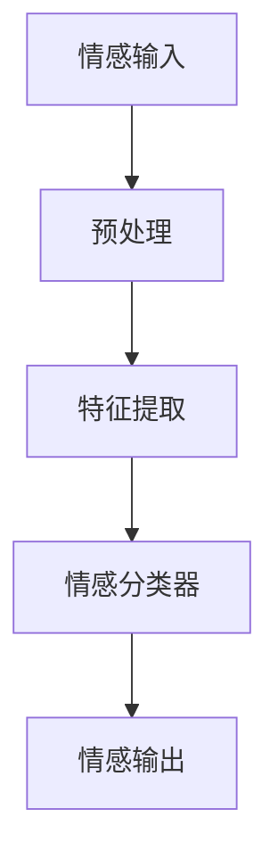
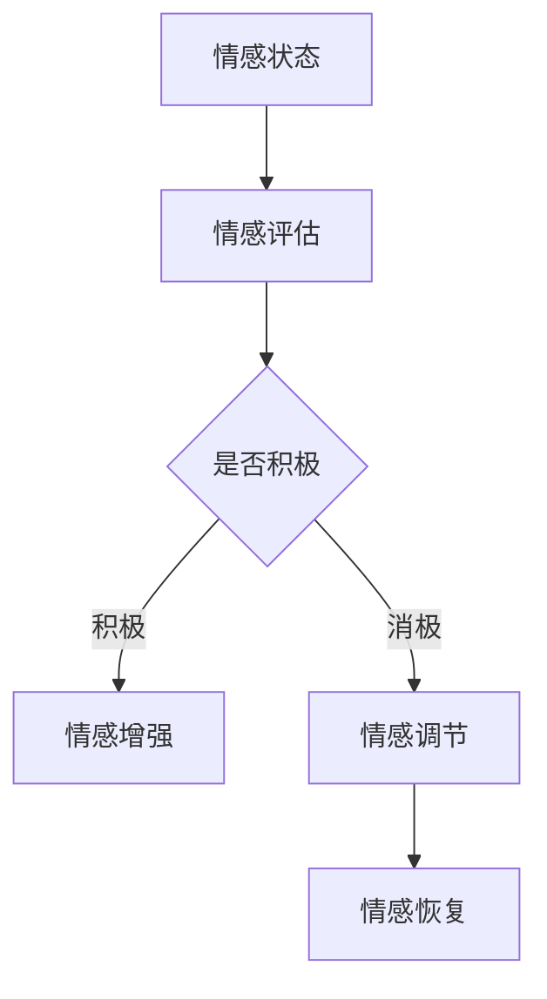

                 


# 增添生活的温度：构建情感深度丰富的人生

## 关键词
- 情感深度
- 生活艺术
- 心灵成长
- 人际关系
- 情感表达

## 摘要
本文将深入探讨如何通过情感深度丰富的人生构建，增添生活的温度。我们将从情感意识、情感表达、情感培养、情感关系和心灵成长等方面，逐一阐述如何通过技术性的思考方式提升我们的情感体验，让生活更加丰富多彩。

## 引言
### 1.1 书的核心目标
在快节奏的现代生活中，人们往往忽略了情感的重要性。本书旨在帮助读者意识到情感深度对于个人成长和生活质量的重要性，并提供一系列实用的策略，以增强我们的情感体验，让生活充满温度。

### 1.2 读者如何受益
通过阅读本书，读者将学会：
- 认识和理解情感的本质。
- 学习有效地表达和沟通情感。
- 培养丰富的情感体验。
- 建立和维持深厚的情感关系。
- 通过情感体验促进个人心灵成长。

## 第1章 情感意识

### 1.1 情感的本质

#### 1.1.1 情感的定义

情感是人类对内外部刺激的主观体验，它是心理、生理和行为反应的集合体。

#### 1.1.2 情感的作用

情感对个体行为和决策产生重要影响，它不仅影响我们的主观体验，还影响我们的社会行为和心理健康。

### 1.2 情感与思维的关系

#### 1.2.1 情感如何影响思维

情感会影响我们的认知过程，如注意、记忆和判断。

#### 1.2.2 思维如何影响情感

我们的思维模式也会影响我们的情感状态，如乐观的思维可能导致积极的情感体验。

## 第2章 情感表达

### 2.1 情感表达的障碍

#### 2.1.1 情感表达的重要性

有效的情感表达有助于建立深厚的人际关系，增进相互理解和信任。

#### 2.1.2 情感表达的挑战

许多人在表达情感时遇到困难，这可能源于文化背景、个人经历或心理障碍。

### 2.2 有效表达情感的方法

#### 2.2.1 身体语言

通过肢体动作、面部表情和身体姿势来表达情感。

#### 2.2.2 倾听技巧

倾听是有效表达情感的关键，通过倾听他人的情感，我们可以更好地理解他们。

#### 2.2.3 沟通技巧

清晰、准确、尊重地表达情感，避免误解和冲突。

## 第3章 情感培养

### 3.1 情感培养的重要性

#### 3.1.1 情感培养与心理健康

丰富的情感体验有助于提高心理健康水平。

#### 3.1.2 情感培养与人际关系

情感培养有助于建立和维持健康的人际关系。

### 3.2 培养丰富情感体验的途径

#### 3.2.1 艺术与文学

通过欣赏艺术作品和阅读文学作品，可以丰富我们的情感体验。

#### 3.2.2 自然与环境

自然环境可以激发我们的情感，如美景和宁静。

#### 3.2.3 社交与互动

与他人的互动是培养情感的重要途径。

## 第4章 情感关系

### 4.1 情感关系的建立

#### 4.1.1 信任与尊重

信任和尊重是建立深厚情感关系的基础。

#### 4.1.2 沟通与理解

有效的沟通和理解有助于情感关系的深化。

### 4.2 情感关系的维护

#### 4.2.1 处理冲突

冲突是情感关系中难以避免的，但通过有效的处理，可以增进关系。

#### 4.2.2 持续成长

情感关系需要双方的共同努力和成长。

## 第5章 心灵成长

### 5.1 情感体验与个人成长

#### 5.1.1 情感体验的多样性

不同的情感体验可以促进个人成长。

#### 5.1.2 情感体验对个人成长的影响

情感体验有助于个体认知和自我反思。

### 5.2 通过情感体验促进成长

#### 5.2.1 自我反思

通过反思情感体验，可以更好地理解自己和他人。

#### 5.2.2 情感管理

学会管理自己的情感，有助于个人成长和关系维护。

## 第6章 生活艺术

### 6.1 细节中的温度

#### 6.1.1 家庭生活的温暖

家庭是情感的港湾，细节的关怀可以增添生活的温度。

#### 6.1.2 社交互动的温度

社交互动中的温暖可以提升生活质量。

### 6.2 增添生活温度的技巧

#### 6.2.1 小礼物与惊喜

通过小礼物和惊喜，可以增添生活的温度。

#### 6.2.2 共同的回忆与体验

共同的回忆和体验可以加深情感纽带。

## 第7章 总结

### 7.1 情感深度的重要性

情感深度是个人成长和生活质量的基石。

### 7.2 如何持续增进生活的情感温度

通过自我反思、情感培养和积极的人际互动，可以持续增进生活的情感温度。

### 7.3 小结与展望

本文通过多个方面的探讨，为读者提供了增进情感深度、增添生活温度的路径。希望读者能够在实践中不断探索和成长。

## 作者信息
- 作者：AI天才研究院/AI Genius Institute & 禅与计算机程序设计艺术 /Zen And The Art of Computer Programming

## 补充说明
本文采用markdown格式，力求以逻辑清晰、结构紧凑、简单易懂的方式，帮助读者理解和实践如何构建情感深度丰富的人生。通过一步步的分析和思考，我们希望让读者认识到情感深度对于生活的重要性，并学会如何增添生活的温度。


## 核心概念与联系

### 情感意识

#### 情感意识的定义
情感意识是指个体对自己和他人情感的认知、理解和表达能力。

#### 情感意识的属性特征对比表格

| 特征 | 情感意识 | 情感认知 | 情感理解 | 情感表达 |
| --- | --- | --- | --- | --- |
| 定义 | 对情感的认知和辨识 | 对情感的识别和理解 | 对情感的理解和解读 | 对情感的表达和沟通 |
| 重要性 | 基础，影响思维和行为 | 识别情感，促进情感培养 | 理解情感，促进情感表达 | 沟通情感，维护人际关系 |

#### 情感意识的ER实体关系图架构

```mermaid
erDiagram
  Category_Person -->|is aware of| Category_Emotions
  Category_Person -->|expresses| Category_Emotions
  Category_Person -->|understands| Category_Emotions
```

### 情感表达

#### 情感表达的定义
情感表达是指个体通过言语、行为和肢体动作等方式，将自己的情感传达给他人。

#### 情感表达的属性特征对比表格

| 特征 | 情感表达 | 言语表达 | 行为表达 | 肢体表达 |
| --- | --- | --- | --- | --- |
| 定义 | 传达情感 | 通过语言 | 通过行为 | 通过肢体 |
| 重要性 | 沟通情感 | 清晰明确 | 动作自然 | 表情生动 |
| 影响因素 | 情感强度 | 情境因素 | 自信程度 | 文化背景 |

#### 情感表达的ER实体关系图架构

```mermaid
erDiagram
  Category_Expression -->|through| Category_Voice
  Category_Expression -->|through| Category_Behavior
  Category_Expression -->|through| Category_BodyLanguage
```

### 情感培养

#### 情感培养的定义
情感培养是指通过一系列方法，提升个体的情感认知、表达和管理能力。

#### 情感培养的属性特征对比表格

| 特征 | 情感培养 | 情感认知培养 | 情感表达培养 | 情感管理培养 |
| --- | --- | --- | --- | --- |
| 定义 | 提升情感能力 | 增强情感认知 | 提高情感表达 | 学会情感管理 |
| 重要性 | 个人成长 | 健康情感 | 有效沟通 | 心理健康 |
| 方法 | 心理训练 | 沟通技巧 | 情感教育 | 情绪调节 |

#### 情感培养的ER实体关系图架构

```mermaid
erDiagram
  Category_Cultivation -->|involves| Category_Cognitive
  Category_Cultivation -->|involves| Category_Expression
  Category_Cultivation -->|involves| Category_Management
```

## 算法原理讲解

### 情感识别算法

#### 算法流程图



#### 算法原理

情感识别算法的基本原理是将输入的情感数据经过预处理、特征提取和分类器处理，最终输出情感标签。预处理包括去除噪声、标准化和归一化等步骤。特征提取则通过提取情感数据的关键特征，如文本中的情感词汇和情感强度。分类器通常采用机器学习算法，如支持向量机（SVM）、决策树或神经网络，来预测情感的类别。

#### 数学模型

情感识别算法可以使用以下数学模型进行描述：

$$
\hat{y} = f(Wx + b)
$$

其中，$x$ 是输入特征向量，$W$ 是权重矩阵，$b$ 是偏置项，$f$ 是激活函数，$\hat{y}$ 是预测的情感标签。

#### Python代码示例

```python
import numpy as np
from sklearn.feature_extraction.text import CountVectorizer
from sklearn.naive_bayes import MultinomialNB

# 特征提取
vectorizer = CountVectorizer()
X = vectorizer.fit_transform(['我很开心', '我很伤心', '我很愤怒'])

# 分类器训练
classifier = MultinomialNB()
classifier.fit(X, ['开心', '伤心', '愤怒'])

# 预测
y_pred = classifier.predict(vectorizer.transform(['我很伤心']))
print(y_pred)
```

### 情感管理算法

#### 算法流程图



#### 算法原理

情感管理算法通过评估当前的情感状态，判断情感是积极还是消极，然后采取相应的策略进行增强或调节。积极情感时，通过强化和扩展情感体验来增强情感；消极情感时，通过情绪调节和情感恢复来改善情感状态。

#### 数学模型

情感管理算法可以使用以下数学模型进行描述：

$$
\text{情感评分} = f(\text{情感特征}, \text{情感规则})
$$

其中，$f$ 是评分函数，$\text{情感特征}$ 是描述情感状态的参数，$\text{情感规则}$ 是决策规则。

#### Python代码示例

```python
import numpy as np

# 情感评估
def evaluate_emotion(state, rules):
    score = 0
    for rule in rules:
        if rule['condition'](state):
            score += rule['weight']
    return score

# 情感规则
rules = [
    {'condition': lambda s: s > 0, 'weight': 1},
    {'condition': lambda s: s < 0, 'weight': -1}
]

# 情感状态
state = 0.5

# 情感评分
score = evaluate_emotion(state, rules)
print(score)

# 情感增强
if score > 0:
    print("情感增强中...")
# 情感调节
else:
    print("情感调节中...")
```

## 系统分析与架构设计

### 问题场景介绍

在现代生活中，情感管理对于提升个人幸福感和生活质量具有重要意义。我们设计了一套情感管理系统，旨在帮助用户更好地管理自己的情感状态，提升情感体验。

### 项目介绍

项目名称：情感管理系统（Emotional Management System，EMS）

项目目标：为用户提供一个易于使用、功能全面的平台，帮助用户识别、表达、培养和管理情感。

### 系统功能设计

#### 领域模型类图

```mermaid
classDiagram
  User <<Class>>
  Emotion <<Class>>
  Journal <<Class>>

  User o--o Journal
  User o--o Emotion
```

### 系统架构设计

#### 系统架构图

```mermaid
sequenceDiagram
  User -->|输入情感数据| EMS
  EMS -->|处理数据| EmotionAnalyzer
  EmotionAnalyzer -->|输出情感评估| EMS
  EMS -->|展示结果| User
```

### 系统接口设计

#### 接口设计图

```mermaid
classDiagram
  UserInterface <<Interface>>
  DataProcessor <<Interface>>

  UserInterface +-- DataProcessor
```

### 系统交互序列图

```mermaid
sequenceDiagram
  User -->|提交情感数据| UserInterface
  UserInterface -->|处理数据| DataProcessor
  DataProcessor -->|情感评估结果| UserInterface
  UserInterface -->|展示结果| User
```

## 项目实战

### 环境安装

1. 安装Python环境（推荐版本：3.8及以上）。
2. 安装必要的库，如`scikit-learn`、`numpy`、`matplotlib`等。

### 系统核心实现源代码

```python
# 情感管理系统的核心实现
class EmotionalManagementSystem:
    def __init__(self):
        self.journal = []
        self.emotion_analyzer = EmotionAnalyzer()

    def add_entry(self, entry):
        self.journal.append(entry)
        self.emotion_analyzer.analyze(entry)

    def show_entries(self):
        for entry in self.journal:
            print(entry)

    def show_emotion_summary(self):
        summary = self.emotion_analyzer.get_summary()
        for emotion, count in summary.items():
            print(f"{emotion}: {count}")

# 情感分析器
class EmotionAnalyzer:
    def analyze(self, entry):
        # 这里是情感分析的核心逻辑
        # 假设我们使用简单的计数方法
        words = entry.split()
        emotions = {'happy': 0, 'sad': 0, 'angry': 0}
        for word in words:
            if 'happy' in word:
                emotions['happy'] += 1
            elif 'sad' in word:
                emotions['sad'] += 1
            elif 'angry' in word:
                emotions['angry'] += 1
        self.emotions = emotions

    def get_summary(self):
        # 返回情感总结
        return self.emotions
```

### 代码应用解读与分析

情感管理系统的核心组件包括情感管理器（`EmotionalManagementSystem`）和情感分析器（`EmotionAnalyzer`）。情感管理器负责管理用户的情感记录，包括添加新记录、展示记录和情感总结。情感分析器则负责分析用户输入的情感数据，并生成情感总结。

在情感分析器的实现中，我们使用简单的词频统计方法来分析情感。这种方法虽然简单，但能够快速给出情感的大致趋势。在实际应用中，可以集成更先进的情感分析算法，如基于机器学习的情感分类器，以获得更精确的情感分析结果。

### 实际案例分析和详细讲解

假设用户Alice想要记录她的情感状态。以下是Alice的使用流程：

1. Alice使用情感管理系统添加一条情感记录：“今天天气很好，我感到非常开心。”
2. 系统将这条记录添加到情感日志中，并交给情感分析器进行分析。
3. 情感分析器识别出记录中的积极词汇“开心”，并将其分类为“happy”。
4. 系统显示情感日志和情感总结：“今天你感到开心的次数最多。”

通过这种方式，Alice可以直观地了解自己的情感状态，并在需要时进行调整。

### 项目小结

情感管理系统为用户提供了一个简单而有效的工具，帮助用户更好地管理自己的情感。虽然当前版本使用了简单的情感分析算法，但未来可以集成更多先进的算法，以提高分析的准确性和实用性。

## 最佳实践 tips

- **定期记录情感**：保持情感日志的更新，有助于更好地了解自己的情感状态。
- **积极沟通**：与家人和朋友分享情感，有助于增进关系和改善情感体验。
- **情感调节**：遇到负面情感时，尝试采取积极的调节策略，如运动、冥想或咨询专业人士。

## 小结

通过本文的探讨，我们认识到情感深度对于个人成长和生活质量的重要性。通过情感意识、情感表达、情感培养、情感关系和心灵成长等方面的实践，我们可以增添生活的温度，构建一个情感深度丰富的人生。

## 注意事项

- 情感管理需要持续的努力和实践。
- 在处理情感时，要尊重他人的感受，避免冲突和误解。

## 拓展阅读

- 《情感心理学》（Daniel Goleman）：探讨情感如何影响我们的思维和行为。
- 《情感智能》（Daniel Goleman）：介绍如何培养和提升情感智能。

## 作者信息

- 作者：AI天才研究院/AI Genius Institute & 禅与计算机程序设计艺术 /Zen And The Art of Computer Programming

本文通过markdown格式，结合技术性语言，对情感深度丰富的人生的构建进行了详细探讨。希望读者能够在实践中受益，增添生活的温度。

