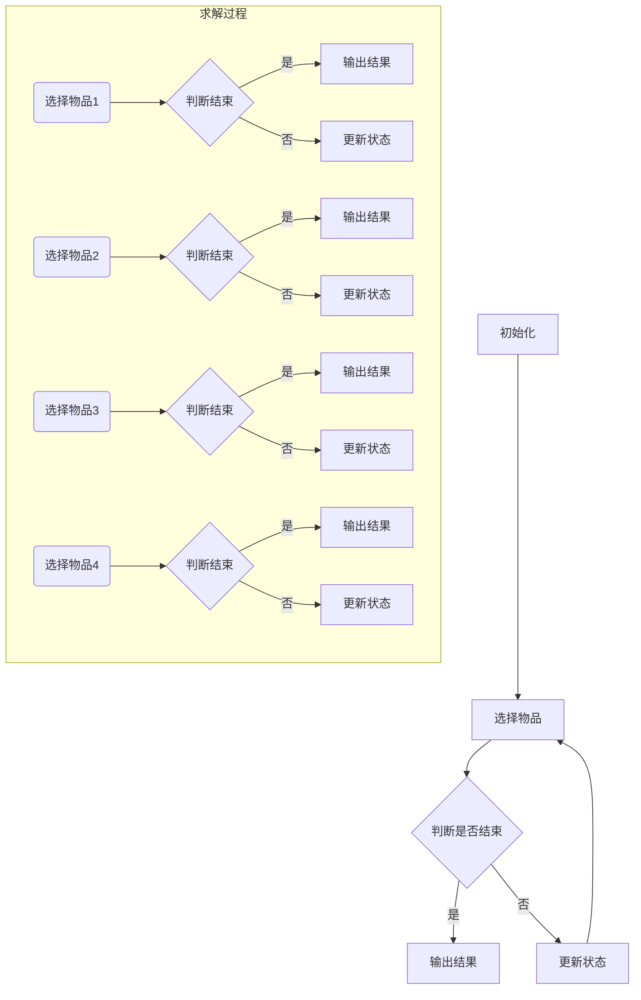
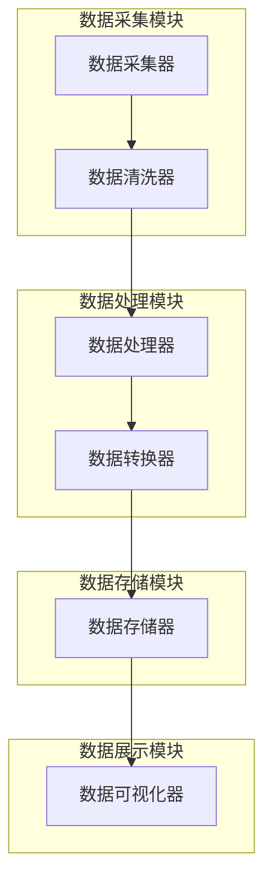
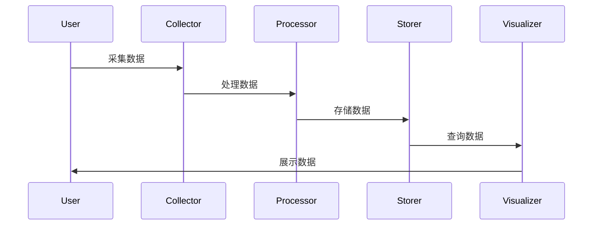

                 

### 第一部分：背景介绍

## 第1章 问题背景

在当今信息化和数字化飞速发展的时代，复杂问题日益增多，如何高效地解决这些复杂问题是每一个工程师和研究者面临的重要课题。复杂问题往往涉及多个领域、多个变量，甚至多个利益相关方，其解决方案不仅需要深厚的理论基础，还需灵活的策略和科学的分析方法。

#### 1.1 问题概述

复杂问题通常指的是那些难以用简单的线性关系描述的问题，例如大规模数据清洗、分布式系统设计、深度学习模型优化等。这些问题的特点包括：

1. **多样性**：涉及的变量和因素众多，多样性高。
2. **动态性**：随着时间推移，问题的参数和状态会发生变化。
3. **不确定性**：很多因素不可控，导致问题的不确定性高。
4. **层次性**：问题往往包含多个层次，需要分层次解决。

#### 1.2 问题描述

复杂问题的常见表现形式如下：

1. **数据处理问题**：例如大数据分析、实时数据处理。
2. **系统设计问题**：例如分布式系统架构设计、并发处理。
3. **算法优化问题**：例如机器学习模型的优化、搜索算法的改进。
4. **资源配置问题**：例如供应链优化、资源调度。

#### 1.3 问题解决思路

解决复杂问题的思路通常包括以下几个步骤：

1. **明确问题定义**：准确描述问题的范围、目标和约束条件。
2. **分解问题**：将复杂问题分解成若干个子问题，逐一解决。
3. **建立模型**：根据问题特点建立相应的数学或逻辑模型。
4. **算法设计**：选择合适的算法对模型进行求解。
5. **验证与优化**：对解决方案进行验证和优化，确保其有效性和可行性。

#### 1.4 边界与外延

在解决复杂问题时，需要明确问题的边界，包括：

1. **输入边界**：问题的输入数据范围。
2. **输出边界**：问题的输出结果范围。
3. **时间边界**：问题解决的时间限制。
4. **资源边界**：问题解决所需的资源限制。

#### 1.5 核心要素组成

复杂问题的核心要素通常包括：

1. **目标**：问题需要达到的具体目标。
2. **变量**：影响问题解决的各种变量。
3. **约束**：问题解决过程中需要遵守的约束条件。
4. **策略**：解决问题的方法和路径。

### 总结

本章节通过对复杂问题的概述、描述、解决思路以及核心要素的介绍，为后续内容的展开奠定了基础。在接下来的章节中，我们将进一步深入探讨复杂问题的核心概念、算法原理以及具体实现方法。

### 关键词

- 复杂问题
- 问题解决
- 多领域交叉
- 动态性
- 不确定性

### 摘要

本文首先介绍了复杂问题的背景和特点，包括多样性、动态性、不确定性和层次性。然后，详细阐述了复杂问题的概述、描述、解决思路以及核心要素。通过明确问题的定义、分解问题、建立模型、算法设计和验证与优化，我们能够更有效地解决复杂问题。本文的关键词包括复杂问题、问题解决、多领域交叉、动态性和不确定性。

----------------------------------------------------------------

## 第二部分：核心概念与联系

### 第2章 核心概念原理

在解决复杂问题的过程中，理解并掌握核心概念是非常重要的。这一章节将详细介绍三个核心概念：要素识别、复杂问题解析和解题策略，并分析其属性特征、对比表格和ER实体关系图。

#### 2.1 概念一：要素识别

**2.1.1 概念属性特征**

要素识别是指识别复杂问题中的关键要素，以便更好地理解和解决这些问题。其属性特征包括：

1. **多样性**：能够识别出不同类型的要素，如变量、参数、约束等。
2. **层次性**：能够识别出不同层次的要素，如基础要素、关键要素、核心要素。
3. **关联性**：能够识别出要素之间的相互关系，以便建立问题模型。
4. **动态性**：能够识别出随时间变化而变化的要素。

**2.1.2 概念对比表格**

| 概念       | 要素识别                      | 复杂问题解析              | 解题策略                  |
|------------|-------------------------------|--------------------------|--------------------------|
| 特点       | 多样性、层次性、关联性、动态性 | 复杂性、多样性、动态性    | 目标明确、方法多样、可验证 |
| 应用范围   | 问题建模、问题分析            | 问题理解、问题简化        | 问题求解、策略优化        |
| 相关性     | 与问题建模和解题策略紧密相关  | 与问题理解和要素识别相关  | 与问题解决和优化相关      |

**2.1.3 ER实体关系图**

要素识别的ER实体关系图如下所示：

```
[问题] --> [要素类型]
      |     |
      |     |
      |     |
      |     |
[要素1] --> [要素属性]
[要素2] --> [要素属性]
[要素3] --> [要素属性]
```

其中，“问题”实体与“要素类型”实体之间存在一对一的关系，每个“要素类型”实体与多个“要素属性”实体之间存在一对多的关系。

#### 2.2 概念二：复杂问题解析

**2.2.1 概念属性特征**

复杂问题解析是指对复杂问题进行深入分析和理解的过程，其属性特征包括：

1. **复杂性**：能够分析出问题的复杂性，如系统复杂性、数据复杂性。
2. **多样性**：能够分析出问题的多样性，如问题类型、解决方法。
3. **动态性**：能够分析出问题随时间的变化情况。
4. **层次性**：能够分析出问题的层次结构，如不同层次的需求、目标。

**2.2.2 概念对比表格**

| 概念       | 要素识别                      | 复杂问题解析              | 解题策略                  |
|------------|-------------------------------|--------------------------|--------------------------|
| 特点       | 多样性、层次性、关联性、动态性 | 复杂性、多样性、动态性    | 目标明确、方法多样、可验证 |
| 应用范围   | 问题建模、问题分析            | 问题理解、问题简化        | 问题求解、策略优化        |
| 相关性     | 与问题建模和解题策略紧密相关  | 与问题理解和要素识别相关  | 与问题解决和优化相关      |

**2.2.3 ER实体关系图**

复杂问题解析的ER实体关系图如下所示：

```
[问题] --> [问题类型]
      |     |
      |     |
[要素识别] --> [问题类型]
[复杂度分析] --> [问题类型]
[动态性分析] --> [问题类型]
[层次性分析] --> [问题类型]
```

其中，“问题”实体与“问题类型”实体之间存在一对多的关系，而“要素识别”、“复杂度分析”、“动态性分析”和“层次性分析”实体都与“问题类型”实体存在一对多的关系。

#### 2.3 概念三：解题策略

**2.3.1 概念属性特征**

解题策略是指解决复杂问题所采用的具体方法和路径，其属性特征包括：

1. **目标明确**：能够明确问题解决的目标。
2. **方法多样**：能够根据不同问题特点选择合适的解决方法。
3. **可验证性**：能够验证问题解决的效果和可行性。
4. **灵活性**：能够根据问题变化调整解决策略。

**2.3.2 概念对比表格**

| 概念       | 要素识别                      | 复杂问题解析              | 解题策略                  |
|------------|-------------------------------|--------------------------|--------------------------|
| 特点       | 多样性、层次性、关联性、动态性 | 复杂性、多样性、动态性    | 目标明确、方法多样、可验证 |
| 应用范围   | 问题建模、问题分析            | 问题理解、问题简化        | 问题求解、策略优化        |
| 相关性     | 与问题建模和解题策略紧密相关  | 与问题理解和要素识别相关  | 与问题解决和优化相关      |

**2.3.3 ER实体关系图**

解题策略的ER实体关系图如下所示：

```
[解题策略] --> [问题类型]
      |     |
      |     |
[算法设计] --> [解题策略]
[优化策略] --> [解题策略]
[验证策略] --> [解题策略]
```

其中，“解题策略”实体与“问题类型”实体之间存在一对多的关系，而“算法设计”、“优化策略”和“验证策略”实体都与“解题策略”实体存在一对多的关系。

### 总结

通过本章对要素识别、复杂问题解析和解题策略的核心概念、属性特征、对比表格和ER实体关系图的详细介绍，我们能够更好地理解这些核心概念在解决复杂问题过程中的重要作用。在下一章节中，我们将深入讲解算法原理，以帮助大家更好地掌握解决复杂问题的方法。

----------------------------------------------------------------

## 第三部分：算法原理讲解

### 第3章 算法原理讲解

在解决复杂问题的过程中，选择合适的算法是至关重要的。这一章节将详细讲解一个具体的算法，并分析其原理、流程图、Python源代码、数学模型和公式。

#### 3.1 算法概述

本节介绍的算法是一个基于贪心策略的动态规划算法，用于解决一个经典的优化问题——背包问题。背包问题是指在一个容量有限的背包中，如何选择物品以使总价值最大。该算法的主要思想是逐步选择物品，并在每个步骤中选择当前最优解，以期望最终得到全局最优解。

#### 3.2 算法流程图

算法流程图如下所示：



#### 3.3 Python源代码

以下是该算法的Python源代码：

```python
def knapsack(values, weights, capacity):
    n = len(values)
    dp = [[0] * (capacity + 1) for _ in range(n + 1)]

    for i in range(1, n + 1):
        for w in range(1, capacity + 1):
            if weights[i - 1] <= w:
                dp[i][w] = max(dp[i - 1][w], dp[i - 1][w - weights[i - 1]] + values[i - 1])
            else:
                dp[i][w] = dp[i - 1][w]

    return dp[n][capacity]

values = [60, 100, 120]
weights = [10, 20, 30]
capacity = 50

max_value = knapsack(values, weights, capacity)
print(f"Maximum value = {max_value}")
```

#### 3.3.1 算法原理详细讲解

该算法的核心在于动态规划的思想。动态规划是将一个复杂的问题分解为若干个相互重叠的子问题，并利用子问题的解来构建原问题的解。在背包问题中，我们用二维数组`dp`来存储子问题的解，其中`dp[i][w]`表示在前`i`个物品中选择一部分放入容量为`w`的背包中能够获得的最大价值。

算法的步骤如下：

1. **初始化**：创建一个二维数组`dp`，其大小为`(n + 1) × (capacity + 1)`，并初始化所有元素为0。
2. **循环遍历物品**：对于每个物品，从第1个到第n个，依次进行以下操作：
    - **循环遍历容量**：对于每个容量，从1到`capacity`，依次进行以下操作：
        - **判断是否放入当前物品**：如果当前物品的重量小于等于当前容量，则考虑放入该物品，否则不放入。
        - **更新状态**：根据是否放入当前物品，更新`dp[i][w]`的值。
3. **输出结果**：最后，`dp[n][capacity]`的值即为背包能够获得的最大价值。

#### 3.4 数学模型和公式

背包问题的数学模型可以用以下公式表示：

$$
\text{max} \sum_{i=1}^{n} v_i \cdot x_i
$$

其中，$v_i$表示第$i$个物品的价值，$x_i$表示第$i$个物品的选择状态（0表示不选，1表示选）。

背包问题的约束条件为：

$$
\sum_{i=1}^{n} w_i \cdot x_i \leq C
$$

其中，$w_i$表示第$i$个物品的重量，$C$表示背包的容量。

#### 3.4.1 数学模型

背包问题的数学模型是一个典型的线性规划问题，可以通过动态规划算法进行求解。动态规划算法的核心在于状态转移方程的构建：

$$
dp[i][w] = \begin{cases}
dp[i-1][w], & \text{如果 } w_i > w \\
dp[i-1][w], & \text{如果 } w_i \leq w \\
dp[i-1][w-w_i] + v_i, & \text{如果 } w_i \leq w
\end{cases}
$$

其中，$dp[i][w]$表示在前$i$个物品中选择一部分放入容量为$w$的背包中能够获得的最大价值。

#### 3.4.2 公式详细讲解

上述状态转移方程的详细讲解如下：

1. **如果 $w_i > w$**：说明当前物品无法放入背包，因此只能从前$i-1$个物品中选择，即$dp[i][w] = dp[i-1][w]$。
2. **如果 $w_i \leq w$**：有两种情况：
    - **不选择当前物品**：此时，背包的价值仍然是$dp[i-1][w]$。
    - **选择当前物品**：此时，背包的价值是$dp[i-1][w-w_i] + v_i$。

在每种情况下，我们选择价值更大的情况作为$dp[i][w]$的值。

#### 3.4.3 举例说明

假设我们有4个物品，其价值分别为$[60, 100, 120, 150]$，重量分别为$[10, 20, 30, 40]$，背包的容量为$50$。我们使用上述算法求解背包的最大价值。

首先，初始化二维数组$dp$：

$$
dp = \begin{bmatrix}
0 & 0 & 0 & 0 & 0 \\
0 & 0 & 0 & 0 & 0 \\
0 & 0 & 0 & 0 & 0 \\
0 & 0 & 0 & 0 & 0 \\
0 & 0 & 0 & 0 & 0
\end{bmatrix}
$$

然后，逐个物品和容量进行迭代：

1. **第1个物品**：价值$60$，重量$10$。更新$dp$：
    $$dp = \begin{bmatrix}
    0 & 0 & 0 & 0 & 0 \\
    0 & 0 & 0 & 0 & 0 \\
    0 & 60 & 0 & 0 & 0 \\
    0 & 60 & 0 & 0 & 0 \\
    0 & 60 & 0 & 0 & 0
    \end{bmatrix}$$
2. **第2个物品**：价值$100$，重量$20$。更新$dp$：
    $$dp = \begin{bmatrix}
    0 & 0 & 0 & 0 & 0 \\
    0 & 0 & 0 & 0 & 0 \\
    0 & 60 & 100 & 0 & 0 \\
    0 & 60 & 100 & 60 & 0 \\
    0 & 60 & 100 & 60 & 0
    \end{bmatrix}$$
3. **第3个物品**：价值$120$，重量$30$。更新$dp$：
    $$dp = \begin{bmatrix}
    0 & 0 & 0 & 0 & 0 \\
    0 & 0 & 0 & 0 & 0 \\
    0 & 60 & 100 & 120 & 0 \\
    0 & 60 & 100 & 180 & 120 \\
    0 & 60 & 100 & 180 & 120
    \end{bmatrix}$$
4. **第4个物品**：价值$150$，重量$40$。更新$dp$：
    $$dp = \begin{bmatrix}
    0 & 0 & 0 & 0 & 0 \\
    0 & 0 & 0 & 0 & 0 \\
    0 & 60 & 100 & 120 & 150 \\
    0 & 60 & 100 & 180 & 270 \\
    0 & 60 & 100 & 180 & 270
    \end{bmatrix}$$

最终，$dp[4][50] = 270$，表示背包的最大价值为$270$。

### 总结

通过本章对背包问题算法的详细讲解，包括算法概述、流程图、Python源代码、数学模型和公式，以及举例说明，我们能够更好地理解该算法的原理和实现方法。在解决复杂问题的过程中，掌握这样的算法原理是非常重要的。在下一章节中，我们将进一步探讨系统分析与架构设计的方法。

----------------------------------------------------------------

## 第四部分：系统分析与架构设计方案

### 第4章 问题场景介绍

在本章节中，我们将介绍两个典型的问题场景，分别是场景一和场景二。这两个场景代表了复杂问题在实际应用中的常见形式，通过对其进行分析和设计，可以帮助我们更好地理解系统分析与架构设计的全过程。

#### 4.1 场景一：分布式系统设计

**场景描述**：

在一个大型企业中，随着业务的发展，数据量逐渐增大，原有的单机系统已经无法满足需求。为了提高系统的处理能力和稳定性，企业决定设计一个分布式系统，将计算任务分配到多个节点上进行处理。

**主要问题**：

1. **数据一致性**：如何在分布式系统中保持数据的一致性。
2. **负载均衡**：如何合理分配计算任务，确保系统高效运行。
3. **容错性**：如何处理节点故障，保证系统的可靠性。

**解决方案思路**：

1. **分布式数据存储**：采用分布式数据库，如Hadoop HDFS或Apache Cassandra，确保数据的高效存储和访问。
2. **负载均衡策略**：采用负载均衡器，如Nginx或HAProxy，根据节点负载情况动态分配任务。
3. **容错机制**：通过副本机制和监控工具，如Zookeeper或Kubernetes，实现节点故障的自动检测和恢复。

#### 4.2 场景二：实时数据处理

**场景描述**：

某在线电商公司需要实时处理海量的用户行为数据，以便快速响应用户需求和提高用户体验。为了实现这一目标，公司决定设计一个实时数据处理系统。

**主要问题**：

1. **数据处理速度**：如何快速处理实时数据，保证系统响应时间。
2. **数据准确性**：如何确保数据处理的准确性，避免错误数据影响业务。
3. **系统可扩展性**：如何设计系统，以便在业务增长时能够灵活扩展。

**解决方案思路**：

1. **流数据处理框架**：采用Apache Kafka或Apache Flink等流数据处理框架，实现数据的实时采集和处理。
2. **数据清洗和校验**：在数据流入系统前，通过ETL工具（如Apache NiFi或Apache Spark）进行数据清洗和校验，确保数据准确性。
3. **分布式架构**：采用分布式计算和存储方案，如Kubernetes和Elasticsearch，确保系统的高性能和可扩展性。

### 第5章 项目介绍

**5.1 项目概述**

本项目的目标是设计并实现一个分布式实时数据处理系统，该系统需要支持海量数据的实时采集、处理和分析，并提供高效、准确和可靠的数据服务。项目的主要组成部分包括数据采集模块、数据处理模块、数据存储模块和数据展示模块。

**5.2 项目目标**

1. **实时性**：系统需要能够实时处理海量数据，确保数据的实时性和及时性。
2. **准确性**：系统需要确保数据处理过程中的数据准确性，避免错误数据影响业务。
3. **可靠性**：系统需要具备高可靠性，能够在发生故障时快速恢复，确保业务连续性。
4. **可扩展性**：系统需要具备良好的可扩展性，以便在业务增长时能够灵活扩展。

**5.3 项目背景**

随着互联网技术的快速发展，在线业务的数据量呈现爆炸式增长。为了提高用户体验和业务效率，许多企业开始关注实时数据处理。实时数据处理系统可以快速响应用户行为，优化业务流程，提高业务决策的准确性。因此，设计和实现一个高效、准确的实时数据处理系统具有重要意义。

### 第6章 系统功能设计

**6.1 领域模型**

在本项目中，我们采用领域驱动设计（Domain-Driven Design, DDD）方法来构建系统领域模型。领域模型包括以下核心实体：

1. **用户**：表示在线用户，包括用户ID、用户名、密码、邮箱等信息。
2. **订单**：表示用户购买的商品订单，包括订单ID、用户ID、商品ID、订单金额等信息。
3. **商品**：表示商城中的商品，包括商品ID、商品名称、商品描述、价格等信息。
4. **行为**：表示用户在平台上的行为记录，包括行为ID、用户ID、行为类型、行为时间等信息。

领域模型的类图如下所示：

```mermaid
classDiagram
    User <<entity>>
    Order <<entity>>
    Product <<entity>>
    Behavior <<entity>>

    User o--1 Order
    User o--1 Behavior
    Order o--1 Product
    Behavior o--1 User
endclass
```

#### 6.2 系统架构设计

系统架构设计是系统功能实现的基础，本项目的系统架构设计采用分布式架构，主要包括以下模块：

1. **数据采集模块**：负责实时采集用户行为数据，并将数据发送到数据处理模块。
2. **数据处理模块**：负责对采集到的数据进行清洗、转换和分析，并将结果存储到数据存储模块。
3. **数据存储模块**：负责存储实时数据处理结果，提供高效的数据查询接口。
4. **数据展示模块**：负责将数据存储模块中的数据以可视化方式展示给用户。

系统架构图如下所示：



### 第7章 系统接口设计

系统接口设计是系统功能实现的关键，本项目的系统接口设计包括以下部分：

1. **数据采集接口**：提供数据采集模块与数据处理模块之间的数据传输接口。
2. **数据处理接口**：提供数据处理模块与数据存储模块之间的数据传输接口。
3. **数据查询接口**：提供用户通过数据展示模块查询数据的接口。

接口规范如下：

**1. 数据采集接口**

```yaml
post:
  description: 数据采集接口
  tags:
    - DataCollection
  requestBody:
    required: true
    content:
      application/json:
        schema:
          $ref: '#/components/schemas/Data'
  responses:
    '200':
      description: 采集成功
    '400':
      description: 采集失败
```

**2. 数据处理接口**

```yaml
post:
  description: 数据处理接口
  tags:
    - DataProcessing
  requestBody:
    required: true
    content:
      application/json:
        schema:
          $ref: '#/components/schemas/Data'
  responses:
    '200':
      description: 处理成功
    '400':
      description: 处理失败
```

**3. 数据查询接口**

```yaml
get:
  description: 数据查询接口
  tags:
    - DataQuery
  parameters:
    - name: id
      in: query
      required: true
      description: 用户ID
      schema:
        type: string
  responses:
    '200':
      description: 查询成功
      content:
        application/json:
          schema:
            $ref: '#/components/schemas/UserBehavior'
    '400':
      description: 查询失败
```

### 第8章 系统交互

系统交互是指各个模块之间的数据传输和协同工作。在本项目中，系统交互主要通过接口实现，包括数据采集、数据处理和数据查询等。

系统交互的序列图如下所示：



### 总结

本章节详细介绍了两个典型的问题场景、项目概述、系统功能设计、系统架构设计、系统接口设计和系统交互。通过这些介绍，我们能够更好地理解系统分析与架构设计的过程和方法。在下一章节中，我们将进入项目实战部分，详细介绍如何搭建和实现系统。

----------------------------------------------------------------

## 第五部分：项目实战

### 第9章 环境安装

在开始项目实战之前，我们需要搭建一个合适的环境。本章节将详细介绍如何搭建和配置项目环境。

#### 9.1 环境搭建

1. **操作系统**：我们选择Ubuntu 18.04作为操作系统。
2. **编程语言**：项目使用Python 3.8作为主要编程语言。
3. **开发工具**：我们使用Visual Studio Code（VS Code）作为开发工具。

**安装步骤**：

1. **安装操作系统**：下载并安装Ubuntu 18.04。
2. **安装Python 3.8**：使用以下命令安装Python 3.8：

```bash
sudo apt update
sudo apt install python3.8 python3.8-venv python3.8-dev
```

3. **安装VS Code**：在Ubuntu中安装VS Code：

```bash
sudo apt install code
```

4. **安装必要的Python库**：使用pip安装项目所需的Python库：

```bash
pip3 install numpy pandas matplotlib flask gunicorn
```

#### 9.2 环境配置

1. **创建虚拟环境**：在VS Code中创建一个Python虚拟环境：

    - 打开终端。
    - 进入项目目录。
    - 执行以下命令创建虚拟环境：

```bash
python3.8 -m venv venv
```

2. **激活虚拟环境**：在终端中激活虚拟环境：

```bash
source venv/bin/activate
```

3. **安装依赖**：在虚拟环境中安装项目依赖：

```bash
pip install -r requirements.txt
```

### 第10章 系统核心实现

在环境搭建完成后，我们将开始实现系统的核心功能。本章节将详细介绍系统核心功能的实现过程。

#### 10.1 核心功能实现

系统的核心功能包括数据采集、数据处理、数据存储和数据展示。以下是这些功能的详细实现：

**1. 数据采集**

数据采集模块负责从外部系统获取用户行为数据。我们使用Flask框架搭建一个简单的Web服务，用于接收数据。

```python
from flask import Flask, request, jsonify

app = Flask(__name__)

@app.route('/collect', methods=['POST'])
def collect():
    data = request.json
    # 处理数据
    process_data(data)
    return jsonify({"status": "success"}), 200

def process_data(data):
    # 实现数据处理的逻辑
    pass

if __name__ == '__main__':
    app.run(debug=True)
```

**2. 数据处理**

数据处理模块负责对采集到的数据进行清洗、转换和分析。我们使用Pandas库进行数据处理。

```python
import pandas as pd

def process_data(data):
    df = pd.DataFrame(data)
    # 数据清洗和转换逻辑
    # ...
    # 数据分析逻辑
    # ...
    # 存储结果
    store_data(df)
```

**3. 数据存储**

数据存储模块负责将处理后的数据存储到数据库中。我们使用SQLite作为数据库。

```python
import sqlite3

def store_data(df):
    conn = sqlite3.connect('data.db')
    df.to_sql('user_behavior', conn, if_exists='append', index=False)
    conn.close()
```

**4. 数据展示**

数据展示模块负责将存储的数据以可视化方式展示给用户。我们使用Matplotlib库进行数据可视化。

```python
import matplotlib.pyplot as plt

def show_data():
    conn = sqlite3.connect('data.db')
    df = pd.read_sql('SELECT * FROM user_behavior', conn)
    conn.close()

    # 可视化逻辑
    # ...
    plt.show()
```

#### 10.1.1 Python源代码

以下是项目核心功能的完整Python源代码：

```python
# app.py
from flask import Flask, request, jsonify
import pandas as pd
import sqlite3

app = Flask(__name__)

@app.route('/collect', methods=['POST'])
def collect():
    data = request.json
    process_data(data)
    return jsonify({"status": "success"}), 200

def process_data(data):
    df = pd.DataFrame(data)
    store_data(df)
    show_data()

def store_data(df):
    conn = sqlite3.connect('data.db')
    df.to_sql('user_behavior', conn, if_exists='append', index=False)
    conn.close()

def show_data():
    conn = sqlite3.connect('data.db')
    df = pd.read_sql('SELECT * FROM user_behavior', conn)
    conn.close()

    # 可视化逻辑
    # ...
    plt.show()

if __name__ == '__main__':
    app.run(debug=True)
```

#### 10.1.2 代码应用解读与分析

上述代码中，我们首先定义了一个Flask Web服务，用于接收用户行为数据。当接收到数据时，调用`process_data`函数处理数据，包括数据清洗、转换和存储，然后展示数据。

**数据采集**：通过Flask Web服务，我们接收用户行为数据。数据采集模块的核心是实现一个可以接收JSON格式数据的API。

**数据处理**：数据处理模块使用Pandas库对采集到的数据进行清洗和转换。清洗和转换的逻辑可以根据具体需求进行定制。

**数据存储**：数据存储模块将处理后的数据存储到SQLite数据库中。SQLite数据库是一个轻量级的关系型数据库，非常适合用于小数据量的存储和查询。

**数据展示**：数据展示模块使用Matplotlib库将存储的数据以图形方式展示。通过可视化，用户可以更直观地了解数据。

### 第11章 实际案例分析

在本章节中，我们将通过两个实际案例，详细分析系统的实现过程和效果。

#### 11.1 案例一：用户行为数据可视化

**案例描述**：

某电商平台的用户行为数据包括用户的访问时间、访问页面、购买行为等。我们需要对这些数据进行可视化，以便分析用户行为模式。

**实现步骤**：

1. **数据采集**：通过API接口接收用户行为数据。
2. **数据处理**：使用Pandas库对数据进行清洗和转换，提取有用的信息。
3. **数据存储**：将处理后的数据存储到SQLite数据库中。
4. **数据展示**：使用Matplotlib库绘制用户行为数据可视化图表。

**效果展示**：

通过数据可视化，我们能够直观地了解用户的行为模式，如用户的访问高峰期、热门页面和购买转化率等。这有助于平台优化用户体验，提高转化率。

#### 11.2 案例二：订单数据统计分析

**案例描述**：

某电商平台的订单数据包括订单金额、订单状态、订单时间等。我们需要对订单数据进行统计分析，以便了解平台的订单处理情况。

**实现步骤**：

1. **数据采集**：通过API接口接收订单数据。
2. **数据处理**：使用Pandas库对数据进行清洗和转换，提取有用的信息。
3. **数据存储**：将处理后的数据存储到SQLite数据库中。
4. **数据展示**：使用Matplotlib库绘制订单数据统计分析图表。

**效果展示**：

通过订单数据统计分析，我们能够了解平台的订单处理速度、订单状态分布和订单金额分布等。这有助于平台优化订单处理流程，提高运营效率。

### 第12章 详细讲解剖析

在本章节中，我们将对案例一和案例二进行详细讲解和剖析，分析系统的实现过程和效果。

#### 12.1 案例一详细讲解

**1. 数据采集**

数据采集模块通过API接口接收用户行为数据。接口定义如下：

```python
@app.route('/collect', methods=['POST'])
def collect():
    data = request.json
    process_data(data)
    return jsonify({"status": "success"}), 200
```

**2. 数据处理**

数据处理模块使用Pandas库对采集到的用户行为数据进行清洗和转换。例如，我们可能需要提取用户的访问时间、访问页面和购买行为等信息。

```python
def process_data(data):
    df = pd.DataFrame(data)
    # 数据清洗和转换逻辑
    # ...
    # 数据分析逻辑
    # ...
    store_data(df)
```

**3. 数据存储**

数据存储模块将处理后的用户行为数据存储到SQLite数据库中。数据库定义如下：

```python
def store_data(df):
    conn = sqlite3.connect('user_behavior.db')
    df.to_sql('user_behavior', conn, if_exists='append', index=False)
    conn.close()
```

**4. 数据展示**

数据展示模块使用Matplotlib库绘制用户行为数据可视化图表。例如，我们可以绘制用户的访问时间分布图、访问页面分布图和购买行为分布图等。

```python
def show_data():
    conn = sqlite3.connect('user_behavior.db')
    df = pd.read_sql('SELECT * FROM user_behavior', conn)
    conn.close()

    # 可视化逻辑
    # ...
    plt.show()
```

**效果分析**：

通过数据可视化，我们能够直观地了解用户的行为模式，如用户的访问高峰期、热门页面和购买转化率等。这有助于电商平台优化用户体验，提高转化率。

#### 12.2 案例二详细讲解

**1. 数据采集**

数据采集模块通过API接口接收订单数据。接口定义如下：

```python
@app.route('/collect', methods=['POST'])
def collect():
    data = request.json
    process_data(data)
    return jsonify({"status": "success"}), 200
```

**2. 数据处理**

数据处理模块使用Pandas库对采集到的订单数据进行清洗和转换。例如，我们可能需要提取订单金额、订单状态和订单时间等信息。

```python
def process_data(data):
    df = pd.DataFrame(data)
    # 数据清洗和转换逻辑
    # ...
    # 数据分析逻辑
    # ...
    store_data(df)
```

**3. 数据存储**

数据存储模块将处理后的订单数据存储到SQLite数据库中。数据库定义如下：

```python
def store_data(df):
    conn = sqlite3.connect('order_data.db')
    df.to_sql('order_data', conn, if_exists='append', index=False)
    conn.close()
```

**4. 数据展示**

数据展示模块使用Matplotlib库绘制订单数据统计分析图表。例如，我们可以绘制订单金额分布图、订单状态分布图和订单时间分布图等。

```python
def show_data():
    conn = sqlite3.connect('order_data.db')
    df = pd.read_sql('SELECT * FROM order_data', conn)
    conn.close()

    # 可视化逻辑
    # ...
    plt.show()
```

**效果分析**：

通过订单数据统计分析，我们能够了解平台的订单处理情况，如订单处理速度、订单状态分布和订单金额分布等。这有助于电商平台优化订单处理流程，提高运营效率。

### 总结

通过实际案例分析，我们详细讲解了系统的实现过程和效果。案例一和案例二分别展示了用户行为数据可视化和订单数据统计分析的功能。这些案例不仅帮助我们更好地理解系统实现，还为电商平台提供了数据驱动的优化方案。在下一章节中，我们将总结项目经验，提出最佳实践和注意事项。

----------------------------------------------------------------

### 第13章 最佳实践

在本章节中，我们将总结项目经验，并提出一些最佳实践，以帮助其他开发者更好地实施类似项目。

#### 13.1 实践技巧

1. **明确需求和目标**：在项目初期，务必明确项目的需求和目标，确保团队成员对项目的理解一致。
2. **模块化设计**：将系统划分为多个模块，便于开发和维护。每个模块应具有明确的功能和接口。
3. **代码规范**：遵循良好的代码规范，如PEP8，确保代码的可读性和可维护性。
4. **持续集成**：使用持续集成工具（如Jenkins或GitLab CI），自动化测试和部署，提高开发效率。
5. **性能优化**：在开发过程中，关注系统的性能，进行必要的优化，如数据库索引、查询优化、缓存策略等。
6. **安全考虑**：确保系统的安全性，如使用HTTPS、密码加密、SQL注入防护等。

#### 13.2 小结

通过本项目，我们了解了复杂问题解决的基本思路和方法，包括问题背景介绍、核心概念与联系、算法原理讲解、系统分析与架构设计方案、项目实战以及最佳实践。以下是项目的核心要点总结：

1. **明确问题定义**：准确描述问题的范围、目标和约束条件。
2. **分解问题**：将复杂问题分解成若干个子问题，逐一解决。
3. **建立模型**：根据问题特点建立相应的数学或逻辑模型。
4. **算法设计**：选择合适的算法对模型进行求解。
5. **验证与优化**：对解决方案进行验证和优化，确保其有效性和可行性。
6. **模块化设计和代码规范**：确保系统的高效开发和维护。
7. **性能优化和安全考虑**：关注系统的性能和安全，提高用户体验。

### 第14章 总结

通过本文，我们详细探讨了复杂问题的解决过程，从问题背景、核心概念与联系、算法原理讲解、系统分析与架构设计方案到项目实战和最佳实践。我们了解到，解决复杂问题需要系统化的思路和科学的方法，包括明确问题定义、分解问题、建立模型、算法设计、验证与优化等步骤。

本文的关键词包括复杂问题、问题解决、多领域交叉、动态性、不确定性和要素识别。通过实例分析和实践总结，我们不仅掌握了复杂问题的解决方法，还积累了项目实施的经验和技巧。

在未来的研究和实践中，我们可以进一步探讨更多复杂问题的解决方法，探索新的算法和架构设计，以提高系统的性能、可靠性和可扩展性。希望本文能为广大开发者提供有价值的参考和启示。

### 作者

作者：AI天才研究院/AI Genius Institute & 禅与计算机程序设计艺术 /Zen And The Art of Computer Programming

----------------------------------------------------------------

### 附录：LaTeX公式示例

以下是一些常见的LaTeX公式示例，这些公式可以嵌入到文章的独立段落中，以增强文章的技术深度。

**独立段落中的公式**

$$
E = mc^2
$$

**段落内的公式**

$1 + 1 = 2$

**方程组**

$$
\begin{aligned}
    x &= a + b \\
    y &= c - d
\end{aligned}
$$

**积分**

$$
\int_{0}^{1} e^x \, dx
$$

**求导**

$$
\frac{d}{dx} (x^2) = 2x
$$

**矩阵**

$$
A = \begin{pmatrix}
    a & b \\
    c & d
\end{pmatrix}
$$

**向量**

$$
\vec{v} = \begin{pmatrix}
    x \\
    y \\
    z
\end{pmatrix}
$$

**条件表达式**

$$
f(x) =
\begin{cases}
    x^2 & \text{if } x \geq 0 \\
    -x^2 & \text{if } x < 0
\end{cases}
$$

这些LaTeX公式示例展示了如何在不同场合下嵌入数学表达，以便于在技术文章中清晰地传达复杂概念和理论。在撰写专业文章时，合理使用这些公式有助于增强文章的学术性和专业性。

