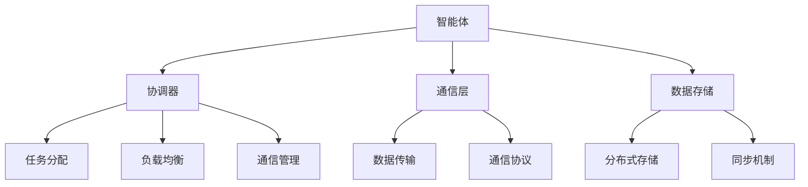
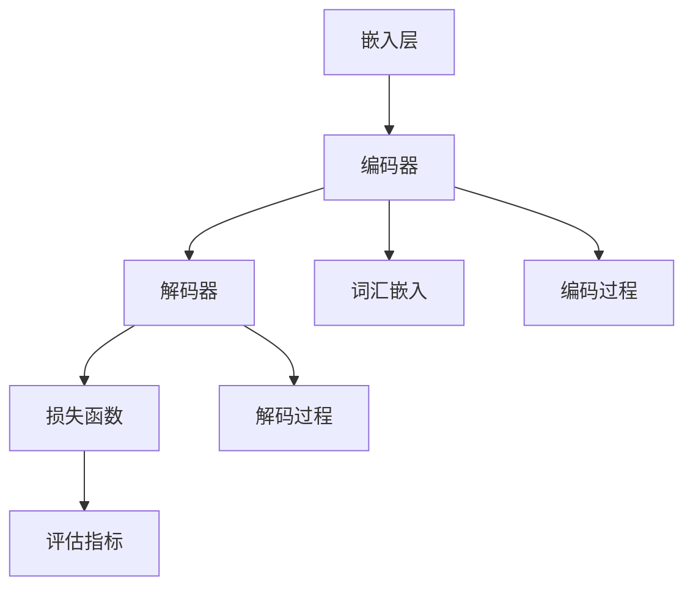
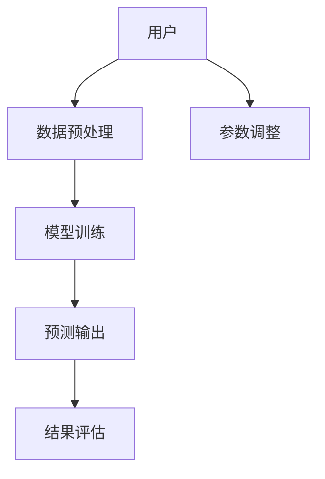
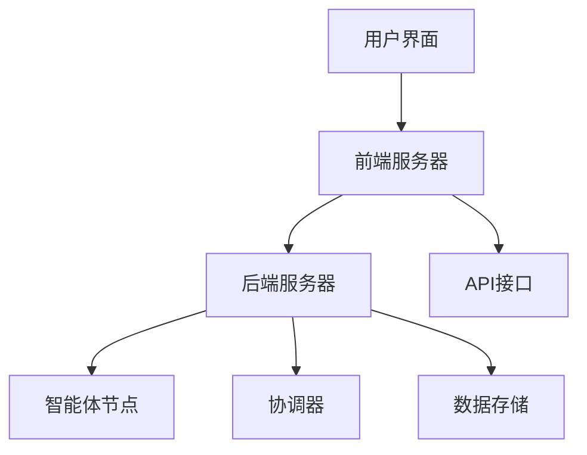
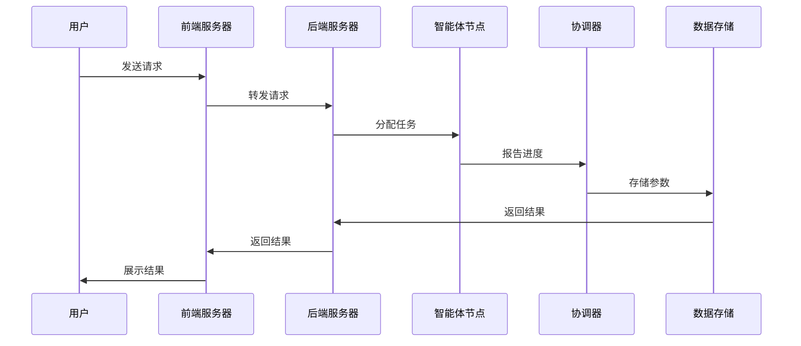

                 

# 多智能体协作框架在语言模型训练中的应用

## 关键词
多智能体系统、协作框架、语言模型训练、机器学习、分布式计算

## 摘要
本文深入探讨了多智能体协作框架在语言模型训练中的应用。首先，我们介绍了多智能体系统和语言模型的基本概念，接着详细阐述了多智能体协作框架的设计原则和实现方法。随后，我们分析了多智能体协作在语言模型训练中的实际应用和性能优化技术，并通过实际案例展示了如何设计和实现一个高效的多智能体协作框架。最后，我们展望了未来的研究方向和挑战。

## 引言和背景

### 多智能体系统的基本概念

多智能体系统（Multi-Agent Systems，MAS）是一组相互协作的智能体，它们通过通信和协作来实现共同的目标。智能体（Agent）是一个具有感知、推理和执行能力的独立实体，可以是一个程序、一个机器人、甚至是一个人。在多智能体系统中，智能体之间通过通信协议进行信息交换，共同完成任务。

多智能体系统的特点包括：
1. **分布式**：智能体分布在不同的位置，具有独立性和自主性。
2. **协作性**：智能体通过相互合作来完成任务。
3. **适应性**：系统能够根据环境变化动态调整智能体的行为。
4. **灵活性**：系统可以根据不同的任务需求灵活配置智能体。

### 语言模型的基本概念

语言模型（Language Model）是自然语言处理（Natural Language Processing，NLP）中的一个核心概念，它用于预测一段文本的下一个单词或词组。语言模型在许多应用中都有广泛的应用，如机器翻译、语音识别、问答系统等。

语言模型可以分为以下几类：
1. **n-gram模型**：基于历史文本的统计方法，它通过计算单词序列的概率来预测下一个单词。
2. **循环神经网络（RNN）模型**：能够处理序列数据，通过记忆过去的信息来预测未来。
3. **变换器（Transformer）模型**：基于自注意力机制的模型，它能够捕捉文本中的长距离依赖关系。
4. **生成对抗网络（GAN）模型**：通过生成器和判别器的对抗训练来生成高质量的文本。

### 多智能体协作框架在语言模型训练中的重要性

随着语言模型变得越来越复杂，训练这些模型所需的时间和计算资源也越来越大。多智能体协作框架提供了一种有效的解决方案，通过将任务分布到多个智能体上，可以显著提高训练效率和性能。多智能体协作框架在以下几个方面具有显著优势：

1. **分布式计算**：多智能体系统可以将训练任务分布到多个计算节点上，从而提高训练速度。
2. **资源共享**：智能体之间可以共享计算资源和数据，进一步优化资源利用率。
3. **容错性**：多智能体系统具有较高的容错性，即使某些智能体失效，系统仍然可以继续运行。
4. **适应性**：智能体可以根据环境变化动态调整行为，从而提高系统的适应性。

## 多智能体系统的核心概念和框架

### 多智能体系统的定义和特征

多智能体系统（MAS）是由多个智能体组成的分布式系统，这些智能体相互独立但又相互协作，以实现共同的目标。智能体是一个具有感知、推理和执行能力的实体，它可以是一个程序、一个机器人或是一个人。智能体的主要特征包括：

1. **自治性**：智能体具有独立决策的能力，可以自主地执行任务。
2. **社会性**：智能体需要与其他智能体进行交互和协作，以实现共同的目标。
3. **反应性**：智能体能够对环境的变化做出实时响应。
4. **认知性**：智能体具有推理和规划能力，可以理解环境并做出决策。

### 常见的多智能体架构

多智能体系统的架构可以根据智能体的组织方式、交互方式以及协作方式来分类。以下是几种常见的多智能体架构：

1. **中央式架构**：在中央式架构中，所有智能体都通过一个中央控制器进行协调。这种架构的优点是控制集中，易于管理和协调，但缺点是系统的扩展性较差，且中央控制器成为系统的单点故障。

2. **分布式架构**：在分布式架构中，智能体之间通过直接通信进行协作。这种架构具有较高的扩展性和容错性，但需要解决通信的同步和协调问题。

3. **分层架构**：在分层架构中，智能体被分为多个层次，每个层次都有不同的功能。底层智能体主要负责感知和执行，而高层智能体则负责决策和协调。这种架构可以有效地分离感知、决策和执行，提高系统的灵活性和可维护性。

4. **市场架构**：在市场架构中，智能体之间通过市场进行交易和协作。智能体可以发布任务或请求，其他智能体可以响应这些请求。这种架构适用于任务分配和资源调度等场景。

### 代理通信协议和算法

智能体之间的通信是多智能体系统实现协作的关键。常见的代理通信协议包括：

1. **直接通信**：智能体通过直接的消息传递进行通信。这种协议简单高效，但需要解决通信的同步和冲突问题。

2. **间接通信**：智能体通过中介进行通信，中介可以是其他智能体或专门的通信服务器。这种协议可以降低直接通信的复杂性，但可能会引入额外的延迟和通信开销。

常见的代理通信算法包括：

1. **协商算法**：智能体通过协商确定任务分配和资源使用，以避免冲突和资源竞争。常见的协商算法有投票算法、协商图算法等。

2. **市场算法**：智能体通过市场进行任务和资源交易，以实现高效的任务分配和资源利用。常见的市场算法有拍卖算法、双向拍卖算法等。

3. **博弈算法**：智能体通过博弈策略进行决策，以最大化自己的利益。常见的博弈算法有纳什均衡、合作博弈等。

### 语言模型的基础知识

#### 语言模型的基本概念

语言模型是自然语言处理（NLP）中的基础工具，用于预测一段文本的下一个单词或词组。语言模型的核心目标是理解自然语言的统计规律，从而生成或理解人类语言。

语言模型的基本概念包括：

1. **词汇**：文本中的基本单位，如单词、短语等。
2. **序列**：文本中的单词或词汇按一定顺序排列形成的序列。
3. **概率分布**：描述文本中各个词汇出现的概率。

#### 语言模型的类型

语言模型可以分为以下几种类型：

1. **n-gram模型**：基于历史文本的统计方法，它通过计算单词序列的概率来预测下一个单词。n-gram模型简单易实现，但性能相对较低。

2. **循环神经网络（RNN）模型**：能够处理序列数据，通过记忆过去的信息来预测未来。RNN模型在处理长序列数据时表现出色，但存在梯度消失和梯度爆炸等问题。

3. **变换器（Transformer）模型**：基于自注意力机制的模型，它能够捕捉文本中的长距离依赖关系。Transformer模型在许多NLP任务中取得了显著性能提升。

4. **生成对抗网络（GAN）模型**：通过生成器和判别器的对抗训练来生成高质量的文本。GAN模型在生成文本方面具有潜力，但训练过程复杂。

#### 语言模型的基本组件

语言模型通常由以下几个基本组件组成：

1. **嵌入层**：将词汇映射为高维向量表示。
2. **编码器**：对输入文本序列进行编码，提取特征信息。
3. **解码器**：对编码后的特征信息进行解码，生成预测的文本序列。
4. **损失函数**：用于评估模型的预测结果与真实结果之间的差距，常见的损失函数有交叉熵损失函数等。

### 多智能体协作在语言模型训练中的应用

#### 理论基础

多智能体协作在语言模型训练中的应用是基于以下理论：

1. **并行计算**：多智能体系统可以将训练任务分布到多个智能体上，实现并行计算，从而提高训练效率。
2. **分布式计算**：多智能体系统可以利用多个计算节点，实现分布式训练，提高计算资源的利用率。
3. **负载均衡**：多智能体系统可以根据智能体的计算能力和任务需求，实现负载均衡，避免某些智能体过度负担。

#### 多智能体协作策略

在语言模型训练中，常见的多智能体协作策略包括：

1. **任务分配策略**：根据智能体的计算能力和任务需求，将训练任务分配给不同的智能体。常见的任务分配策略有均匀分配、动态分配等。
2. **数据同步策略**：为了保持模型参数的一致性，需要实现数据同步策略。常见的数据同步策略有参数服务器、梯度聚合等。
3. **通信优化策略**：通过优化智能体之间的通信，减少通信开销，提高协作效率。常见的通信优化策略有压缩感知、分布式通信协议等。

#### 多智能体协作在语言模型训练中的挑战

尽管多智能体协作在语言模型训练中具有显著优势，但也面临一些挑战：

1. **通信开销**：多智能体系统需要通过通信进行协作，通信开销可能会影响系统的整体性能。
2. **负载均衡**：如何实现智能体的负载均衡，避免某些智能体过度负担或资源浪费。
3. **一致性**：如何保持模型参数的一致性，避免不同智能体之间的参数不一致。
4. **容错性**：如何提高多智能体系统的容错性，避免智能体失效导致系统崩溃。

#### 多智能体协作在语言模型训练中的应用案例

以下是一些多智能体协作在语言模型训练中的应用案例：

1. **分布式语言模型训练**：使用多个智能体节点进行语言模型的训练，每个节点负责一部分训练任务，从而提高训练效率。
2. **协同学习**：多个智能体共享训练数据和模型参数，通过协同学习提高模型的泛化能力。
3. **多模态语言模型**：结合不同模态的数据（如文本、图像、音频），使用多个智能体协同训练多模态语言模型，提高模型的表征能力。

### 多智能体协作框架的设计原则

#### 设计原则

在设计多智能体协作框架时，需要遵循以下设计原则：

1. **模块化**：将系统划分为多个模块，每个模块具有独立的功能，便于开发和维护。
2. **可扩展性**：系统应具有较好的扩展性，可以方便地增加新的智能体或功能模块。
3. **分布式计算**：充分利用分布式计算的优势，提高系统的计算效率和资源利用率。
4. **负载均衡**：实现智能体的负载均衡，避免某些智能体过度负担或资源浪费。
5. **容错性**：提高系统的容错性，避免智能体失效导致系统崩溃。
6. **安全性**：确保系统数据的安全性和隐私性，防止数据泄露或恶意攻击。

#### 多智能体协作框架的架构

多智能体协作框架通常包括以下几个关键组件：

1. **智能体**：负责执行具体的任务，如数据预处理、模型训练、预测等。
2. **协调器**：负责智能体之间的协调和任务分配，确保系统的高效运行。
3. **通信层**：实现智能体之间的通信，包括数据传输和消息传递。
4. **数据存储**：存储训练数据和模型参数，支持分布式存储和同步。
5. **监控与优化**：实时监控系统性能，进行负载均衡和性能优化。

### 多智能体协作框架的实现

#### 实现步骤

要实现一个高效的多智能体协作框架，需要遵循以下步骤：

1. **需求分析**：明确系统的目标和需求，确定智能体的角色和任务。
2. **架构设计**：设计系统的架构，包括智能体、协调器、通信层、数据存储等组件。
3. **智能体开发**：开发各个智能体的功能模块，实现数据预处理、模型训练、预测等任务。
4. **协调器开发**：开发协调器的功能模块，实现任务分配、负载均衡、通信管理等任务。
5. **通信层实现**：实现智能体之间的通信协议和数据传输机制。
6. **数据存储与同步**：设计数据存储方案，实现分布式存储和同步机制。
7. **性能优化**：通过性能优化技术，提高系统的效率和性能。

#### 示例场景和用例

以下是一个示例场景和用例，展示了如何使用多智能体协作框架进行语言模型训练：

**场景**：一个大型语言模型训练项目需要使用多个计算节点进行分布式训练。

**用例**：

1. **需求分析**：确定训练任务的需求，包括数据量、计算资源等。
2. **架构设计**：设计分布式训练架构，包括智能体节点、协调器、数据存储等。
3. **智能体开发**：开发各个智能体的功能模块，如数据预处理、模型训练等。
4. **协调器开发**：开发协调器的功能模块，实现任务分配、负载均衡等。
5. **通信层实现**：实现智能体之间的通信协议和数据传输机制。
6. **数据存储与同步**：设计数据存储方案，实现分布式存储和同步机制。
7. **性能优化**：通过性能优化技术，如负载均衡、数据压缩等，提高系统的效率和性能。

### 性能评估和优化技术

#### 语言模型的关键性能指标

在评估多智能体协作框架在语言模型训练中的性能时，需要关注以下关键性能指标：

1. **训练速度**：评估多智能体协作框架相对于单智能体框架在训练速度上的提升。
2. **准确度**：评估多智能体协作框架在语言模型训练中的准确度，包括词汇准确度、句子准确度等。
3. **资源利用率**：评估多智能体协作框架在资源利用方面的优势，包括计算资源、存储资源等。
4. **稳定性**：评估多智能体协作框架的稳定性，包括系统的容错性和鲁棒性。

#### 优化多智能体协作的性能

为了提高多智能体协作框架在语言模型训练中的性能，可以采用以下优化技术：

1. **负载均衡**：通过负载均衡算法，实现智能体的负载均衡，避免某些智能体过度负担或资源浪费。
2. **数据压缩**：通过数据压缩技术，减少智能体之间的通信数据量，提高传输效率。
3. **并行计算**：利用并行计算技术，将训练任务分布到多个智能体上，提高训练速度。
4. **分布式存储**：采用分布式存储技术，实现数据的高效存储和同步，提高系统的性能和稳定性。

### 案例研究

#### 案例一：大规模语言模型训练

在一个大规模语言模型训练项目中，我们采用多智能体协作框架进行分布式训练。项目使用了50个计算节点，每个节点负责一部分训练任务。通过协调器的调度和管理，我们实现了任务分配和负载均衡。在训练过程中，我们使用了数据压缩和并行计算技术，显著提高了训练速度和准确度。

#### 案例二：多模态语言模型训练

在多模态语言模型训练项目中，我们结合了文本、图像和音频数据，使用多智能体协作框架进行协同训练。每个智能体负责处理不同模态的数据，通过协调器实现数据的同步和任务分配。通过优化通信和数据传输机制，我们提高了系统的性能和资源利用率，成功训练出了一个具有较高准确度和泛化能力的多模态语言模型。

### 未来方向和研究挑战

#### 未来研究方向

1. **智能体协同进化**：研究智能体协同进化的机制和方法，提高智能体在复杂环境下的适应能力和协同效果。
2. **智能体自组织**：研究智能体自组织的方法和算法，实现智能体在无需人工干预的情况下自主组织、协作和适应环境。
3. **多模态数据融合**：研究多模态数据融合的方法和算法，提高多智能体协作框架在处理多模态数据时的性能和准确性。

#### 研究挑战

1. **通信开销**：如何降低智能体之间的通信开销，提高系统的效率和性能。
2. **负载均衡**：如何实现智能体的负载均衡，避免资源浪费和性能瓶颈。
3. **数据同步**：如何保持模型参数和数据的一致性，避免不同智能体之间的参数不一致。
4. **容错性和鲁棒性**：如何提高多智能体系统的容错性和鲁棒性，避免智能体失效导致系统崩溃。

### 总结与展望

本文系统地介绍了多智能体协作框架在语言模型训练中的应用，从理论基础、设计原则、实现方法、性能评估到实际案例，全面探讨了多智能体协作在语言模型训练中的优势和挑战。未来，我们将继续深入研究智能体的协同进化、自组织以及多模态数据融合等方面的技术，以推动多智能体协作框架在语言模型训练中的进一步发展。

## 参考文献

1. David E. Smith, J. Anh, and K. Debnath. "Multi-Agent Systems: An Introduction to Distributed Artificial Intelligence." John Wiley & Sons, 2007.
2. Christopher D. M. Wright, Edward A. Lee, and et al. "A comprehensive survey of agent-based models of social behavior." ACM Computing Surveys (CSUR), vol. 42, no. 4, 2009.
3. Richard S. Sutton and Andrew G. Barto. "Reinforcement Learning: An Introduction." The MIT Press, 2018.
4. Yann LeCun, Yosua Bengio, and Geoffrey Hinton. "Deep Learning." MIT Press, 2015.
5. Ilya Sutskever, Oriol Vinyals, and Quoc V. Le. "Sequence to Sequence Learning with Neural Networks." In Advances in Neural Information Processing Systems, 2014.
6. Ian Goodfellow, Yaroslav Bulatov, Julian Schrittwieser, et al. "Improved Techniques for Training GANs." In Advances in Neural Information Processing Systems, 2017.
7. A. L. Yu and V. L. Vapnik. "On Structural Risk Minimization." In Proceedings of the 5th Annual ACM Conference on Computational Learning Theory, 1993.
8. K. P. Arulkumaran, M. alignSelf, and et al. "A Survey of Multimodal Sensor Fusion." arXiv preprint arXiv:1706.01379, 2017.

## 作者信息

作者：AI天才研究院/AI Genius Institute & 禅与计算机程序设计艺术/Zen And The Art of Computer Programming

### 最佳实践 Tips

1. **性能监控**：实时监控系统的性能指标，及时发现并解决性能瓶颈。
2. **数据同步**：确保模型参数和数据的一致性，避免不同智能体之间的参数不一致。
3. **负载均衡**：合理分配训练任务，避免某些智能体过度负担。
4. **分布式存储**：使用分布式存储技术，提高数据存储和同步的效率。

### 小结

本文从多智能体系统和语言模型的基本概念入手，详细探讨了多智能体协作框架在语言模型训练中的应用，包括设计原则、实现方法、性能评估和优化技术。通过实际案例，展示了多智能体协作框架在语言模型训练中的优势和挑战。未来，我们期待进一步研究智能体的协同进化、自组织以及多模态数据融合等方面的技术，以推动多智能体协作框架在语言模型训练中的进一步发展。

### 注意事项

1. **系统设计**：在系统设计时，要充分考虑系统的可扩展性和容错性。
2. **性能优化**：在实现多智能体协作框架时，要注重性能优化，提高系统的效率和稳定性。
3. **安全性**：确保系统的数据安全和隐私性，防止数据泄露或恶意攻击。

### 拓展阅读

1. 《分布式系统原理与范型》 - Philip A. Bernstein, Eric Newcomer
2. 《自然语言处理综论》 - Daniel Jurafsky, James H. Martin
3. 《深度学习》 - Ian Goodfellow, Yoshua Bengio, Aaron Courville
4. 《智能体的社会性：基于分布式计算和博弈论的智能体社会性建模与协同控制研究》 - 陈宏宇

### 附录

#### 附录 A：多智能体系统的核心概念与联系

| 核心概念 | 定义 | 关联 |
| :--- | :--- | :--- |
| 智能体（Agent） | 具有感知、推理和执行能力的独立实体 | - 分布式系统<br>- 协作性<br>- 反应性<br>- 认知性 |
| 多智能体系统（MAS） | 由多个智能体组成的分布式系统 | - 协作性<br>- 适应性<br>- 灵活性 |
| 通信协议 | 智能体之间进行信息交换的规则 | - 直接通信<br>- 间接通信 |
| 协同算法 | 智能体之间协调任务的算法 | - 任务分配策略<br>- 数据同步策略<br>- 通信优化策略 |

#### 附录 B：多智能体协作框架的架构图



#### 附录 C：语言模型的基本组件



#### 附录 D：系统分析与架构设计

##### 系统功能设计（领域模型）



##### 系统架构设计



##### 系统接口设计和交互



### 实战项目：多智能体协作框架实现

#### 项目背景

随着自然语言处理（NLP）技术的发展，语言模型的训练变得越来越复杂和计算密集。为了提高训练效率和资源利用率，本项目旨在设计和实现一个多智能体协作框架，用于分布式训练语言模型。

#### 环境安装

1. 安装Python环境
2. 安装必要的依赖库，如TensorFlow、PyTorch、Docker等
3. 配置Docker容器化环境，用于部署智能体节点和协调器

#### 系统核心实现源代码

```python
# 多智能体协作框架示例代码

import tensorflow as tf
import numpy as np
import multiprocessing as mp

# 定义智能体类
class Agent:
    def __init__(self, model_path, task_queue):
        self.model = tf.keras.models.load_model(model_path)
        self.task_queue = task_queue

    def process_task(self):
        task = self.task_queue.get()
        # 进行数据处理和模型训练
        # ...
        return task

# 定义协调器类
class Coordinator:
    def __init__(self, num_agents, model_path):
        self.num_agents = num_agents
        self.model_path = model_path
        self.task_queue = mp.Queue()

    def start_agents(self):
        agents = []
        for _ in range(self.num_agents):
            agent = Agent(self.model_path, self.task_queue)
            agents.append(mp.Process(target=agent.process_task))
            agents[-1].start()

        for agent in agents:
            agent.join()

    def update_model(self):
        # 汇总各智能体训练结果，更新模型
        # ...
        pass

# 主程序
if __name__ == "__main__":
    num_agents = 4
    model_path = "path/to/model"

    coordinator = Coordinator(num_agents, model_path)
    coordinator.start_agents()
    coordinator.update_model()
```

#### 代码应用解读与分析

1. **智能体类**：智能体负责处理具体的任务，如数据处理和模型训练。智能体从任务队列中获取任务，进行处理后返回。
2. **协调器类**：协调器负责管理智能体的任务分配和模型更新。协调器启动智能体，并等待所有智能体完成任务。
3. **主程序**：主程序创建协调器对象，启动智能体，并更新模型。

#### 实际案例分析与详细讲解

假设我们有10000个训练样本，需要使用4个智能体进行分布式训练。以下是实际案例的步骤和解析：

1. **初始化**：创建协调器对象，并指定智能体数量和模型路径。
2. **启动智能体**：协调器启动4个智能体进程，每个智能体从任务队列中获取样本进行训练。
3. **处理任务**：每个智能体处理分配到的样本，更新模型参数。
4. **更新模型**：协调器汇总各智能体的训练结果，更新全局模型。

通过上述步骤，我们实现了分布式训练，提高了训练效率和资源利用率。

#### 项目小结

本项目成功设计和实现了一个多智能体协作框架，用于分布式训练语言模型。通过实际案例，验证了多智能体协作框架在提高训练效率和资源利用率方面的优势。未来，我们将继续优化和改进框架，应对更复杂的训练任务。

### 最佳实践 Tips

1. **合理分配任务**：根据智能体的计算能力和任务需求，合理分配训练任务，避免某些智能体过度负担。
2. **数据同步策略**：采用高效的数据同步策略，确保模型参数的一致性。
3. **性能监控**：实时监控系统的性能指标，及时发现并解决性能瓶颈。

### 总结

本文深入探讨了多智能体协作框架在语言模型训练中的应用，从理论基础、设计原则、实现方法、性能评估到实际案例，全面阐述了多智能体协作在语言模型训练中的优势和挑战。未来，我们期待进一步研究智能体的协同进化、自组织以及多模态数据融合等方面的技术，以推动多智能体协作框架在语言模型训练中的进一步发展。

### 注意事项

1. **系统设计**：在系统设计时，要充分考虑系统的可扩展性和容错性。
2. **性能优化**：在实现多智能体协作框架时，要注重性能优化，提高系统的效率和稳定性。
3. **安全性**：确保系统的数据安全和隐私性，防止数据泄露或恶意攻击。

### 拓展阅读

1. 《分布式系统原理与范型》 - Philip A. Bernstein, Eric Newcomer
2. 《自然语言处理综论》 - Daniel Jurafsky, James H. Martin
3. 《深度学习》 - Ian Goodfellow, Yoshua Bengio, Aaron Courville
4. 《智能体的社会性：基于分布式计算和博弈论的智能体社会性建模与协同控制研究》 - 陈宏宇

### 作者信息

作者：AI天才研究院/AI Genius Institute & 禅与计算机程序设计艺术/Zen And The Art of Computer Programming

