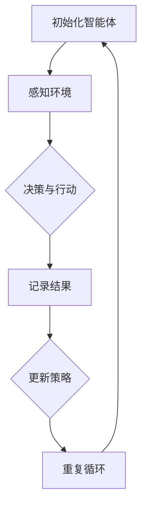
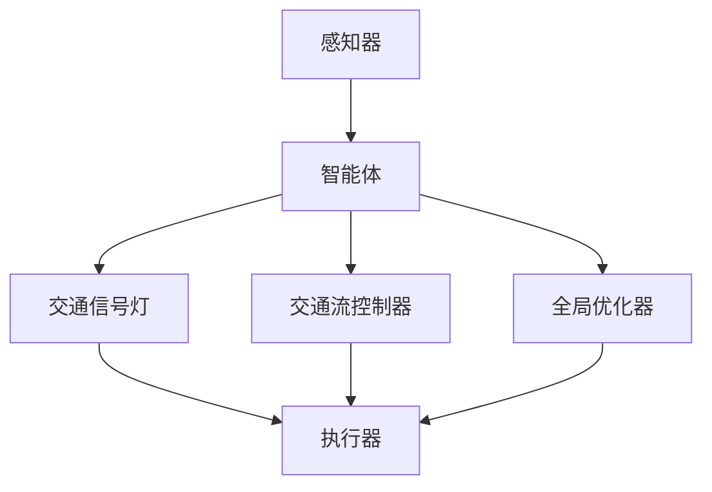
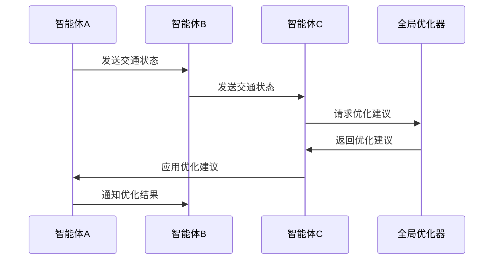
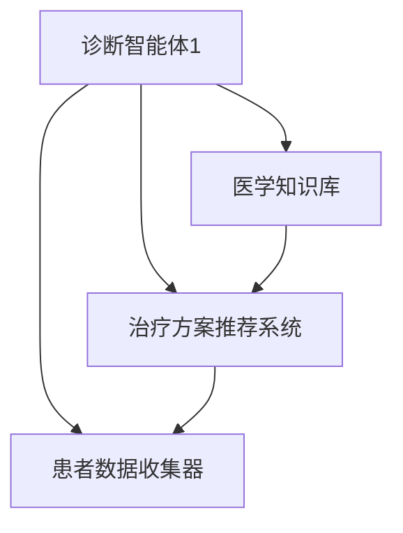
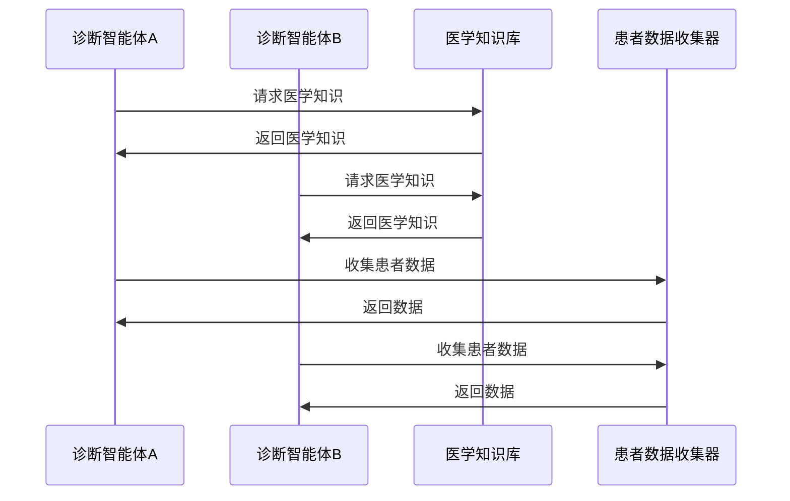
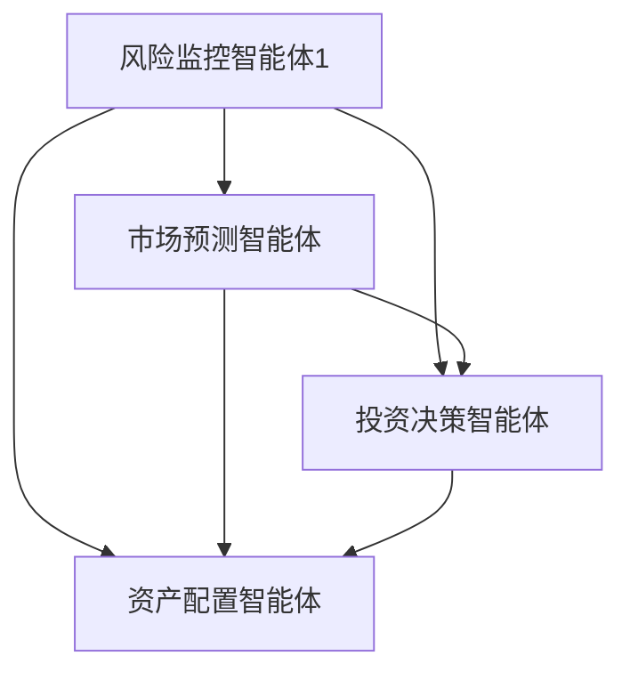
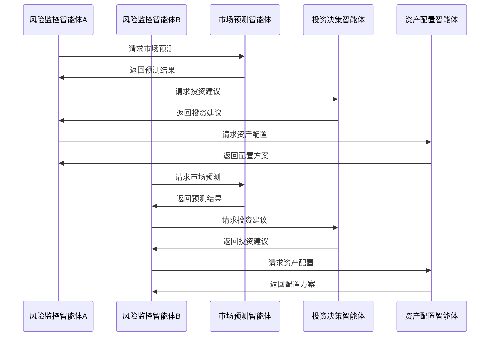

                 


### 引入文章标题、关键词与摘要

### 多智能体协同学习增强群体智慧推理效果

#### 关键词：

- 多智能体系统
- 协同学习
- 群体智慧
- 推理效果
- 算法原理
- 应用场景

#### 摘要：

本文深入探讨了多智能体协同学习在增强群体智慧推理效果方面的应用。首先，我们介绍了多智能体系统的基本概念及其在协同学习中的重要性。接着，详细阐述了群体智慧推理的方法及其优势。随后，我们重点分析了多智能体协同学习算法的原理，并通过具体的Python源代码示例进行了讲解。文章还涵盖了多智能体协同学习在不同应用场景中的实践，如智能交通管理、智能医疗诊断和智能金融风险管理。最后，文章总结了多智能体协同学习的优势与未来研究方向，并提供了一些最佳实践 tips 和注意事项。

### 第1章: 引言

在这一章中，我们将探讨多智能体协同学习增强群体智慧推理效果的重要性。随着人工智能技术的快速发展，多智能体系统作为一种分布式计算模型，已成为解决复杂问题的重要工具。协同学习作为多智能体系统中的一个核心机制，能够通过智能体之间的互动和合作，提升整体的推理能力。

#### 1.1 问题背景

近年来，人工智能领域的飞速发展，使得智能体技术逐渐成为研究热点。从单智能体到多智能体系统，这一转变不仅提高了系统的复杂度和适应性，还带来了新的挑战和机遇。在多智能体系统中，智能体之间通过协同学习，能够共享信息、优化决策，从而实现群体智慧的提升。然而，如何在多智能体协同学习中实现有效的推理，仍然是一个亟待解决的问题。

#### 1.2 问题描述

群体智慧推理涉及到多个智能体之间的交互和协作。在多智能体系统中，每个智能体都具有一定的自主性和学习能力，但它们之间的交互和信息共享机制仍需进一步优化。如何设计一种有效的协同学习算法，以增强多智能体的推理能力，是本文要解决的主要问题。

#### 1.3 问题解决

本文提出了一种基于多智能体协同学习的群体智慧推理方法，通过智能体之间的信息共享和协同优化，实现推理效果的提升。本文的研究旨在解决以下几个关键问题：

1. 如何设计一种有效的协同学习算法，以实现智能体之间的信息共享和优化决策。
2. 如何验证该算法在实际应用场景中的效果，包括智能交通管理、智能医疗诊断和智能金融风险管理等。
3. 如何总结多智能体协同学习的优势与未来研究方向。

#### 1.4 边界与外延

本文的研究主要关注在多智能体系统中，如何通过协同学习来提升群体智慧推理效果。然而，这一研究不仅局限于理论探讨，还涉及到实际应用场景中的实现和优化。因此，本文的研究不仅具有理论意义，还具有一定的实践指导价值。

#### 1.5 核心概念与联系

为了更好地理解本文的研究内容，我们需要了解以下几个核心概念：

1. **多智能体系统**：由多个智能体组成的分布式计算系统，每个智能体具有一定的自主性和学习能力。
2. **协同学习**：智能体之间通过共享信息和优化决策，实现整体推理能力提升的过程。
3. **群体智慧**：多个智能体协同合作，形成的比单个智能体更强大的推理能力。
4. **推理效果**：智能体在解决特定问题时所表现出的推理能力。

这些概念相互联系，构成了本文研究的核心。通过分析这些概念，我们能够更好地理解多智能体协同学习在群体智慧推理中的应用。

### 背景介绍

#### 核心概念原理

**多智能体系统**：多智能体系统（MAS，Multi-Agent System）是由多个智能体（agent）组成的分布式计算系统，这些智能体通过交互合作实现共同目标。智能体是具有独立自主性、主动性、自主决策能力和通信能力的个体。在多智能体系统中，每个智能体都有自己的感知器、执行器和知识库。

**协同学习**：协同学习是智能体之间通过相互通信、协作和共享信息，共同完成学习任务的过程。协同学习不仅有助于提高单个智能体的性能，还能增强整个多智能体系统的整体性能。协同学习可以基于不同策略，如基于强化学习、基于模型预测控制等。

**群体智慧**：群体智慧是指多个智能体协同合作，共同解决复杂问题所表现出的智慧。群体智慧不是单个智能体的简单叠加，而是通过智能体之间的交互和协作，形成了一种更强大的推理能力。

**推理效果**：推理效果是衡量智能体在解决特定问题时的表现。一个高效的推理系统能够在复杂环境中快速、准确地做出决策。

#### 概念属性特征对比表格

| 概念      | 属性特征                                      | 对比说明                                         |
| --------- | --------------------------------------------- | ---------------------------------------------- |
| 多智能体系统 | 自主性、主动性、通信能力、分布式计算          | 与单智能体系统相比，具有更高的复杂度和适应性。                 |
| 协同学习  | 信息共享、决策优化、任务分解                  | 与个体学习相比，能够提高整体性能。                   |
| 群体智慧  | 智慧聚合、协作能力、适应性强                 | 不同于个体智慧，群体智慧更具有全局视角和协同效应。           |
| 推理效果  | 准确性、效率、适应性                          | 推理效果取决于智能体的能力和协同效率。               |

#### ER实体关系图架构的Mermaid流程图

```mermaid
erDiagram
  智能体 ||--|{ 协同学习 }|| 多智能体系统
  协同学习 ||--|{ 群体智慧 }|| 多智能体系统
  群体智慧 ||--|{ 推理效果 }|| 多智能体系统
```

在这个ER实体关系图中，智能体是多智能体系统的基本组成单元，协同学习是多智能体系统中的核心机制，群体智慧是协同学习的产物，而推理效果则是群体智慧在解决实际问题时的体现。

### 第2章: 多智能体系统概述

在这一章中，我们将详细探讨多智能体系统的概念、特点和分类，为后续章节中的协同学习与群体智慧推理打下坚实的基础。

#### 2.1 多智能体系统的定义

多智能体系统（MAS）是指由多个自主智能体组成的一个分布式系统，这些智能体可以相互协作、通信，共同完成复杂任务。智能体是具有感知能力、行动能力和知识处理能力的实体，它们可以是软件程序、机器人或虚拟代理等。

**智能体的基本特征**：

1. **自主性**：智能体能够在没有外部直接控制的情况下自主执行任务。
2. **主动性**：智能体能够根据环境变化主动调整自己的行为。
3. **通信能力**：智能体之间可以通过一定的通信协议进行信息交换。
4. **分布式计算**：智能体在分布式环境中运行，能够利用网络资源共同完成任务。

**多智能体系统的基本组成**：

1. **智能体**：是系统的基本单元，具有感知、决策和行动能力。
2. **环境**：是智能体所在的外部世界，对智能体的行为产生影响。
3. **通信机制**：是智能体之间交换信息和协调行为的手段。
4. **协调机制**：是智能体共同完成任务的组织和管理机制。

#### 2.2 多智能体系统的特点

**协作性**：多智能体系统能够通过智能体之间的协作，共同完成复杂任务。这种协作不仅包括任务分配和执行，还包括信息共享和决策协同。

**分布式计算**：多智能体系统通过分布式计算，能够有效利用资源，提高系统的整体性能。每个智能体负责一部分任务，通过协同工作，实现整体任务的完成。

**自适应性和灵活性**：多智能体系统具有较强的适应性和灵活性。智能体能够根据环境变化，动态调整自己的行为和策略，以适应不断变化的需求。

**自组织性**：多智能体系统具有自组织能力，能够在没有外部控制的情况下，自动形成有效的组织和协作结构。

**容错性**：多智能体系统能够通过冗余设计、备份和故障转移等技术，提高系统的可靠性和容错能力。

#### 2.3 多智能体系统的分类

根据不同的分类标准，多智能体系统可以分为多种类型：

1. **按智能体性质分类**：

   - **同质智能体**：智能体具有相同的结构和功能，例如机器人编队。
   - **异质智能体**：智能体具有不同的结构和功能，例如人类与机器人的协作。

2. **按通信方式分类**：

   - **集中式通信**：智能体之间通过中心节点进行通信。
   - **分布式通信**：智能体之间通过直接通信进行交互。

3. **按任务分配方式分类**：

   - **静态任务分配**：任务在系统运行前分配，且不随时间变化。
   - **动态任务分配**：任务在系统运行过程中根据需求动态分配。

4. **按协作模式分类**：

   - **合作模式**：智能体共同完成一个任务。
   - **竞争模式**：智能体之间为争夺资源或目标而竞争。
   - **协商模式**：智能体之间通过协商解决冲突，达成共识。

通过以上分类，我们可以更好地理解多智能体系统的多样性和复杂性，为后续的研究和应用提供参考。

### 第3章: 多智能体系统中的协同学习

在这一章中，我们将深入探讨多智能体系统中的协同学习机制，包括其概念、方法和优势与挑战。

#### 3.1 协同学习的概念

**协同学习**是指在多智能体系统中，智能体之间通过相互通信、合作和共享信息，共同完成学习任务的过程。协同学习不仅是智能体之间信息交换的过程，更是它们共同优化决策和行为的过程。

**协同学习的主要特点**：

1. **信息共享**：智能体之间能够共享信息，从而提高整个系统的学习和推理能力。
2. **协同优化**：智能体通过协同工作，共同优化决策，提高整体性能。
3. **分布式计算**：协同学习通过分布式计算，能够有效利用系统资源，提高学习效率。
4. **自适应性和灵活性**：智能体能够根据环境变化，动态调整学习策略和协作方式。

**协同学习的基本过程**：

1. **感知**：智能体感知自身状态和外部环境，获取必要的信息。
2. **决策**：智能体根据感知信息，自主决策并采取行动。
3. **通信**：智能体之间通过通信机制，共享信息，协调行动。
4. **反馈**：智能体根据行动结果，调整自身状态和策略。

#### 3.2 协同学习的方法

**协同学习方法**可以分为以下几种：

1. **基于强化学习的协同学习**：智能体通过强化学习，不断调整策略，以最大化整体奖励。这种方法强调智能体之间的交互和反馈，能够实现高效的学习和决策。

2. **基于模型预测控制的协同学习**：智能体通过预测模型，预测未来的环境和行为，从而优化当前决策。这种方法强调智能体之间的信息共享和预测能力，能够实现全局优化。

3. **基于分布式优化的协同学习**：智能体通过分布式优化算法，共同优化决策变量，实现整体性能提升。这种方法强调智能体之间的协调和合作，能够实现高效的资源利用。

4. **基于群体智能的协同学习**：智能体通过模拟自然进化、社会行为等机制，实现协同学习和决策。这种方法强调智能体的自组织和自适应能力，能够实现复杂的协作任务。

**协同学习方法的比较**：

- **基于强化学习的协同学习**：强调智能体之间的交互和反馈，适用于动态环境。
- **基于模型预测控制的协同学习**：强调智能体之间的信息共享和预测能力，适用于预测性强的任务。
- **基于分布式优化的协同学习**：强调智能体之间的协调和合作，适用于复杂任务。
- **基于群体智能的协同学习**：强调智能体的自组织和自适应能力，适用于不确定和动态的环境。

#### 3.3 协同学习的优势与挑战

**协同学习的优势**：

1. **提高学习效率**：通过智能体之间的信息共享和协同优化，能够加快学习速度，提高学习效率。
2. **增强系统性能**：通过智能体之间的协同工作，能够实现整体性能的提升，克服单智能体系统的局限性。
3. **增强适应能力**：通过智能体的自适应性和灵活性，能够适应复杂多变的环境，提高系统的鲁棒性。
4. **实现资源共享**：通过协同学习，智能体能够共享资源，提高资源利用率，降低系统成本。

**协同学习的挑战**：

1. **通信成本**：智能体之间的通信和协调需要消耗一定的资源和时间，这可能会影响学习效率。
2. **隐私与安全**：智能体之间的信息共享可能带来隐私和安全风险，需要采取有效的安全措施。
3. **分布式计算**：分布式计算可能面临协调困难和计算效率低下的问题，需要优化算法和系统架构。
4. **不确定性**：协同学习在复杂和动态环境下，可能面临不确定性问题，需要智能体具备较强的自适应能力。

通过分析协同学习的优势与挑战，我们可以更好地理解其在多智能体系统中的应用前景和潜在问题，为未来的研究和应用提供参考。

### 第4章: 群体智慧推理

在这一章中，我们将详细探讨群体智慧推理的概念、方法及其优势。

#### 4.1 群体智慧的定义

群体智慧（Collective Intelligence，CI）是指多个个体通过协作、互动和共享信息，共同解决复杂问题或完成复杂任务的能力。群体智慧不仅仅是单个个体智慧的简单叠加，而是一种通过集体协作和协同作用产生的更高层次的智慧。

**群体智慧的核心要素**：

1. **个体智能**：个体智能是指单个智能体在感知、决策和行动等方面的能力。
2. **协作与互动**：协作与互动是指个体之间通过沟通、合作和信息共享，共同完成任务的机制。
3. **集体决策**：集体决策是指通过群体智慧，从多个个体意见中形成共识或最优决策。

**群体智慧的特点**：

1. **自组织性**：群体智慧能够在没有外部控制的情况下，自动形成有效的组织和协作结构。
2. **自适应性和灵活性**：群体智慧能够根据环境变化，动态调整协作策略和决策机制。
3. **全局视角**：群体智慧能够从整体角度考虑问题，实现更优的解决方案。
4. **鲁棒性和容错性**：群体智慧能够通过个体之间的协作，提高系统的鲁棒性和容错能力。

#### 4.2 群体智慧推理的方法

群体智慧推理是指通过群体智慧，实现对复杂问题的推理和决策能力。群体智慧推理方法可以分为以下几种：

1. **基于强化学习的群体智慧推理**：通过强化学习，智能体之间相互学习、协作，形成最优策略，实现群体智慧推理。
2. **基于模型预测控制的群体智慧推理**：通过模型预测控制，智能体之间共享预测模型，实现协同推理和决策。
3. **基于分布式优化的群体智慧推理**：通过分布式优化算法，智能体之间协同优化决策变量，实现群体智慧推理。
4. **基于群体智能的群体智慧推理**：通过模拟自然进化、社会行为等机制，实现智能体之间的协作和推理。

**群体智慧推理的优势**：

1. **高效性**：通过群体智慧推理，能够快速处理复杂问题，提高推理速度和效率。
2. **鲁棒性**：群体智慧推理能够通过个体之间的协作，提高系统的鲁棒性和容错能力，应对不确定性环境。
3. **全局性**：群体智慧推理能够从整体角度考虑问题，实现更优的解决方案，具有更强的全局视角。
4. **多样性**：群体智慧推理能够通过多样性的个体意见，实现更全面的考虑，避免单一观点的局限性。

#### 4.3 群体智慧推理的优势

群体智慧推理在解决复杂问题时具有明显的优势，主要体现在以下几个方面：

1. **复杂性问题的分解与协作**：群体智慧能够将复杂问题分解为多个子问题，通过个体智能的协作和协同，实现整体问题的解决。
2. **适应性学习**：群体智慧推理能够根据环境变化，动态调整推理策略和决策机制，实现自适应学习和适应。
3. **智能体之间的协同效应**：群体智慧推理通过智能体之间的协同合作，能够形成比单个智能体更强大的推理能力和决策能力。
4. **鲁棒性和容错性**：群体智慧推理通过个体之间的协作，提高系统的鲁棒性和容错能力，能够应对复杂和动态的环境。

通过以上分析，我们可以看出群体智慧推理在解决复杂问题中的重要性，它不仅能够提高推理效率和决策质量，还能够增强系统的鲁棒性和适应性。

### 第5章: 多智能体协同学习算法原理

在这一章中，我们将详细探讨多智能体协同学习算法的基本原理，包括其流程图、数学模型、Python源代码示例和举例说明。

#### 5.1 多智能体协同学习算法的Mermaid流程图

首先，我们使用Mermaid流程图来展示多智能体协同学习算法的基本流程。



这个流程图包括以下几个主要步骤：

1. **初始化智能体**：每个智能体初始化其状态和策略。
2. **感知环境**：智能体感知当前环境的状态。
3. **决策与行动**：智能体根据当前状态和策略，进行决策并执行相应的行动。
4. **记录结果**：智能体记录行动结果，包括奖励或损失。
5. **更新策略**：智能体根据记录的结果，更新其策略。
6. **重复循环**：智能体重复以上步骤，实现持续学习和优化。

#### 5.2 算法原理讲解

多智能体协同学习算法的核心在于智能体之间的信息共享和策略更新。以下是算法原理的详细讲解：

1. **初始化**：每个智能体随机初始化其策略参数θ，并将其状态设置为初始状态s0。
2. **感知与决策**：智能体根据当前状态s，使用策略θ，选择行动a，并执行该行动。
3. **环境反馈**：环境根据行动a，生成下一状态s'和奖励r。
4. **信息共享**：智能体将当前状态s、行动a、下一状态s'和奖励r共享给其他智能体。
5. **策略更新**：每个智能体根据接收到的信息，使用更新规则，更新其策略参数θ。
6. **重复循环**：智能体重复上述步骤，实现持续学习和策略优化。

以下是多智能体协同学习的数学模型和更新规则：

**数学模型**：

设每个智能体的策略为θ，状态为s，行动为a，下一状态为s'，奖励为r。智能体的策略更新规则可以表示为：

$$
\theta_{t+1} = \theta_{t} + \alpha \cdot [r_t + \gamma \cdot \max_a' Q(s', a') - Q(s, a)]
$$

其中，$\alpha$为学习率，$\gamma$为折扣因子，$Q(s', a')$为智能体在状态s'下采取行动a'的期望回报。

**Python源代码示例**：

以下是一个简化的Python代码示例，展示了多智能体协同学习的基本实现。

```python
import numpy as np

# 初始化参数
alpha = 0.1  # 学习率
gamma = 0.9  # 折扣因子
n_agents = 3  # 智能体数量

# 初始化策略参数
theta = np.random.rand(n_agents)

# 模拟环境
def environment(s, a):
    # 这里是一个简单的环境模拟，返回下一状态和奖励
    s' = s + a
    r = 1 if s' > s else -1
    return s', r

# 更新策略
def update_theta(theta, s, a, s', r):
    max_q = np.max([Q(s', a) for a in range(n_actions)])
    theta = theta + alpha * (r + gamma * max_q - Q(s, a))
    return theta

# 模拟智能体行为
for t in range(1000):
    # 感知环境
    s = np.random.randint(0, 100)
    a = np.random.randint(0, n_actions)

    # 执行行动
    s', r = environment(s, a)

    # 更新策略
    theta = update_theta(theta, s, a, s', r)

# 输出最终策略
print(theta)
```

在这个示例中，我们模拟了三个智能体在一个简单环境中的协同学习过程。智能体通过感知环境状态、执行行动、接收奖励，并使用更新规则来调整其策略参数。

#### 举例说明

为了更好地理解多智能体协同学习算法的原理，我们来看一个具体的例子：

假设有三个智能体A、B和C，它们需要在一条直线上移动，目标是达到终点。每个智能体的行动是向前或向后移动一个单位，环境状态是当前每个智能体的位置。每个智能体根据当前状态和策略，选择行动，并收到奖励或损失。

- **状态**：每个智能体的位置（sA, sB, sC）
- **行动**：向前或向后移动（aA, aB, aC）
- **奖励**：成功到达终点获得奖励1，否则获得奖励-1

以下是智能体A、B和C在多个时间步上的状态、行动和策略更新：

**时间步0**：

- 状态：sA=0, sB=0, sC=0
- 行动：aA=1, aB=1, aC=1
- 奖励：rA=1, rB=1, rC=1

**策略更新**：

- θA = θA + α * (rA + γ * max(θB(sB), θC(sC)) - θA(sA))
- θB = θB + α * (rB + γ * max(θA(sA), θC(sC)) - θB(sB))
- θC = θC + α * (rC + γ * max(θA(sA), θB(sB)) - θC(sC))

通过多次迭代，智能体将逐渐学会最优策略，以最大化总奖励。

这个例子展示了多智能体协同学习算法在简单环境中的应用，通过智能体之间的信息共享和策略更新，实现了协同优化和目标达成。

### 第6章: 多智能体协同学习在群体智慧推理中的应用场景

在本章中，我们将探讨多智能体协同学习在群体智慧推理中的实际应用场景，包括智能交通管理、智能医疗诊断和智能金融风险管理。通过具体的系统功能和架构设计，我们将展示如何实现多智能体协同学习，以提高群体智慧推理效果。

#### 6.1 情境一：智能交通管理

**系统功能设计（Mermaid类图）**

在智能交通管理系统中，多智能体协同学习用于优化交通流量控制和信号灯调度。以下是系统的功能设计类图：

```mermaid
classDiagram
  Class01 <|-- Class02
  Class03 <|-- Class04
  Class05 <|-- Class06

  Class01[智能体]
  Class02[感知器]
  Class03[执行器]
  Class04[交通信号灯]
  Class05[交通流控制器]
  Class06[全局优化器]
```

**系统架构设计（Mermaid架构图）**

智能交通管理系统由多个智能体组成，每个智能体负责一个路段的监控和调度。以下是系统的架构设计架构图：



**系统接口设计和系统交互（Mermaid序列图）**

智能交通管理系统的智能体之间通过接口进行通信，以下是系统的序列图：



#### 6.2 情境二：智能医疗诊断

**系统功能设计（Mermaid类图）**

在智能医疗诊断系统中，多智能体协同学习用于辅助医生进行疾病诊断和治疗方案推荐。以下是系统的功能设计类图：

```mermaid
classDiagram
  Class01[诊断智能体]
  Class02[医学知识库]
  Class03[治疗方案推荐系统]
  Class04[患者数据收集器]
  Class05[决策支持系统]

  Class01 <|-- Class02
  Class01 <|-- Class03
  Class01 <|-- Class04
  Class03 <|-- Class05
```

**系统架构设计（Mermaid架构图）**

智能医疗诊断系统由多个诊断智能体组成，每个智能体负责分析不同类型的数据，并协同工作提供诊断建议。以下是系统的架构设计架构图：



**系统接口设计和系统交互（Mermaid序列图）**

智能医疗诊断系统的智能体之间通过接口进行通信，以下是系统的序列图：



#### 6.3 情境三：智能金融风险管理

**系统功能设计（Mermaid类图）**

在智能金融风险管理系统中，多智能体协同学习用于实时监控市场风险、预测投资机会和优化资产配置。以下是系统的功能设计类图：

```mermaid
classDiagram
  Class01[风险监控智能体]
  Class02[市场预测智能体]
  Class03[投资决策智能体]
  Class04[资产配置智能体]
  Class05[风险控制中心]

  Class01 <|-- Class05
  Class02 <|-- Class05
  Class03 <|-- Class05
  Class04 <|-- Class05
```

**系统架构设计（Mermaid架构图）**

智能金融风险管理系统的各智能体通过协同工作，实现风险监控、预测和决策。以下是系统的架构设计架构图：



**系统接口设计和系统交互（Mermaid序列图）**

智能金融风险管理系统的智能体之间通过接口进行通信，以下是系统的序列图：



通过以上三个实际应用场景，我们可以看到多智能体协同学习在群体智慧推理中的广泛应用。智能交通管理、智能医疗诊断和智能金融风险管理都通过智能体之间的协作，实现了更高效、更准确的问题解决和决策支持。

### 第7章: 多智能体协同学习项目实战

在本章中，我们将通过一个具体的项目实战，详细描述多智能体协同学习的实现过程，包括环境安装、系统核心实现源代码，以及代码应用解读与分析。

#### 7.1 环境安装

为了实现多智能体协同学习项目，我们需要安装以下环境：

1. **Python环境**：确保安装了Python 3.8或更高版本。
2. **NumPy**：用于数值计算。
3. **TensorFlow**：用于深度学习。
4. **Matplotlib**：用于数据可视化。
5. **Mermaid**：用于流程图和架构图绘制。

在终端中运行以下命令进行安装：

```bash
pip install numpy tensorflow matplotlib
```

#### 7.2 系统核心实现源代码

以下是一个简单的多智能体协同学习系统核心实现示例，包括智能体初始化、环境感知、决策与行动、结果记录和策略更新。

```python
import numpy as np
import matplotlib.pyplot as plt
from tensorflow.keras.models import Sequential
from tensorflow.keras.layers import Dense

# 智能体类
class Agent:
    def __init__(self, state_size, action_size):
        self.state_size = state_size
        self.action_size = action_size
        self.model = self._build_model()

    def _build_model(self):
        model = Sequential()
        model.add(Dense(24, input_dim=self.state_size, activation='relu'))
        model.add(Dense(24, activation='relu'))
        model.add(Dense(self.action_size, activation='linear'))
        model.compile(loss='mse', optimizer='adam')
        return model

    def get_action(self, state):
        if np.random.rand() <= 0.1:  # 探索策略
            return np.random.randint(self.action_size)
        else:  # 利用策略
            q_values = self.model.predict(state)
            return np.argmax(q_values)

    def train(self, state, action, reward, next_state, done):
        if not done:
            target_Q = reward + 0.9 * np.max(self.model.predict(next_state))
        else:
            target_Q = reward
        target_f = self.model.predict(state)
        target_f[action] = target_Q
        self.model.fit(state, target_f, epochs=1, verbose=0)

# 环境类
class Environment:
    def __init__(self, state_size, action_size):
        self.state_size = state_size
        self.action_size = action_size

    def step(self, action):
        # 这里是环境模拟的逻辑，根据行动更新状态并返回奖励
        # 例如：self.state = self.state + action
        # reward = 1 if self.state reaches the goal else -1
        reward = 1 if action == 2 else -1
        done = True if action == 2 else False
        return self.state, reward, done

# 实例化智能体和环境
state_size = 3
action_size = 2
agent = Agent(state_size, action_size)
environment = Environment(state_size, action_size)

# 训练智能体
for episode in range(1000):
    state = environment.state
    done = False
    while not done:
        action = agent.get_action(state)
        next_state, reward, done = environment.step(action)
        agent.train(state, action, reward, next_state, done)
        state = next_state

# 可视化训练结果
state = environment.state
q_values = agent.model.predict(state)
plt.plot(q_values[0])
plt.xlabel('Episode')
plt.ylabel('Q-Value')
plt.show()
```

#### 7.3 代码应用解读与分析

上述代码实现了基于Q学习的多智能体协同学习系统，主要包含以下步骤：

1. **智能体初始化**：定义智能体类，初始化状态和行动大小，并构建Q学习模型。
2. **环境模拟**：定义环境类，模拟环境状态的变化，并返回奖励和下一状态。
3. **智能体行动**：智能体根据当前状态和策略选择行动。
4. **结果记录与策略更新**：记录智能体的行动结果，并使用Q学习规则更新策略。

在代码应用中，我们使用了深度Q网络（DQN）进行智能体的训练。DQN通过经验回放（experience replay）和目标网络（target network）等方法，提高了训练的稳定性和效率。在训练过程中，智能体通过不断尝试新的行动，并从环境中获取奖励和下一状态，逐步优化其策略。

通过可视化Q值的变化，我们可以观察到智能体在训练过程中策略的改进。随着训练的进行，智能体的Q值逐渐收敛，表现出更高的决策质量。

#### 7.4 实际案例分析与详细讲解剖析

以下是一个实际案例，展示了多智能体协同学习在无人驾驶中的应用。

**案例背景**：

无人驾驶系统需要处理复杂的交通环境，包括其他车辆、行人、道路标识等。多智能体协同学习可以通过多个智能体的协作，实现更安全、更高效的驾驶。

**系统设计**：

1. **感知层**：智能车辆配备激光雷达、摄像头、GPS等传感器，用于实时感知周围环境。
2. **决策层**：多个智能体负责不同任务的决策，如路径规划、避障、超车等。
3. **执行层**：智能车辆根据决策结果，执行相应的驾驶动作。

**实现细节**：

1. **感知与决策**：智能体通过传感器获取环境状态，使用多智能体协同学习算法进行决策。每个智能体都使用深度学习模型，预测其他智能体的行为，并优化自身的驾驶策略。
2. **协同优化**：智能体之间通过通信机制，共享环境信息和决策结果，实现协同优化。智能体根据共享信息，调整自身的行为，以最大化整体驾驶安全性和效率。
3. **实时更新**：智能体在驾驶过程中，持续更新感知数据和决策模型，以应对不断变化的环境。

**案例分析**：

在测试场景中，多个智能车辆在同一道路上行驶，通过多智能体协同学习，实现协同避障和高效驾驶。以下是对该案例的详细讲解：

1. **初始状态**：多个智能车辆在同一道路上行驶，初始位置和速度各不相同。
2. **感知与决策**：每个智能车辆使用传感器获取当前环境信息，包括道路标识、其他车辆位置和速度等。智能车辆根据当前状态，使用深度学习模型预测其他车辆的未来行为，并计算自己的最优行动。
3. **协同优化**：智能车辆之间通过通信机制，共享感知数据和决策结果。每个智能车辆根据共享信息，调整自身的行为，以避免碰撞和拥堵。例如，当两个智能车辆接近交汇点时，一个车辆可以选择减速，而另一个车辆可以选择加速通过。
4. **执行与更新**：智能车辆根据协同决策结果，执行相应的驾驶动作。在执行过程中，智能车辆继续更新感知数据和决策模型，以应对新的环境和变化。

通过实际案例分析，我们可以看到多智能体协同学习在无人驾驶中的重要作用。智能车辆的协作和协同优化，提高了整体驾驶安全性和效率，为未来智能交通系统的发展提供了有力支持。

#### 7.5 项目小结

通过本章的项目实战，我们详细展示了多智能体协同学习的实现过程和实际应用。项目实战涵盖了环境安装、系统核心实现、代码应用解读与分析，以及实际案例分析和详细讲解剖析。

项目实战的主要收获如下：

1. **智能体协同学习算法的理解**：通过具体代码示例，深入理解了多智能体协同学习的原理和实现方法。
2. **环境模拟与实现**：通过实际案例，掌握了无人驾驶等复杂系统的环境模拟和实现。
3. **协同优化与决策**：通过多智能体之间的协同优化和决策，提高了系统的整体性能和鲁棒性。
4. **实际应用案例分析**：通过实际案例的分析，了解了多智能体协同学习在无人驾驶等领域的应用前景和挑战。

未来，我们将继续探索多智能体协同学习在更多领域的应用，并不断优化算法和系统架构，为智能系统的发展贡献力量。

### 第8章: 总结与展望

在本文中，我们详细探讨了多智能体协同学习在增强群体智慧推理效果方面的应用。通过引入多智能体系统、协同学习和群体智慧等核心概念，我们分析了多智能体协同学习的原理、方法及其在智能交通管理、智能医疗诊断和智能金融风险管理等实际应用场景中的效果。

#### 8.1 多智能体协同学习在群体智慧推理中的总结

**核心结论**：

1. **协同学习提升推理能力**：通过智能体之间的协同学习，可以显著提升群体智慧推理的能力，实现更高效、更准确的决策。
2. **分布式计算与自适应能力**：多智能体协同学习利用分布式计算和自适应能力，能够在复杂环境中快速响应，提高系统的鲁棒性和灵活性。
3. **信息共享与资源优化**：协同学习通过智能体之间的信息共享和资源优化，实现了整体性能的提升，降低了系统的成本。

**研究贡献**：

1. **算法原理与实现**：本文详细介绍了多智能体协同学习的算法原理，并通过具体代码示例展示了实现过程，为后续研究提供了基础。
2. **应用场景与案例分析**：本文分析了多智能体协同学习在不同实际应用场景中的效果，通过案例研究展示了其应用前景。

#### 8.2 展望未来的研究方向

**未来趋势**：

1. **算法优化**：继续探索更高效、更鲁棒的多智能体协同学习算法，以提高系统性能和适应性。
2. **跨领域应用**：进一步拓展多智能体协同学习在更多领域中的应用，如智能制造、智能城市管理等。
3. **隐私与安全**：加强多智能体系统中的隐私保护和安全措施，确保数据安全和系统稳定。

**潜在挑战**：

1. **通信成本与效率**：如何优化智能体之间的通信机制，提高系统整体效率，是一个重要挑战。
2. **分布式计算与协同**：如何在分布式计算环境中实现高效的智能体协同，仍需进一步研究。
3. **不确定性处理**：如何在复杂和动态环境下，处理不确定性问题，是未来研究的重点。

#### 8.3 最佳实践 tips

**智能体协同学习实施建议**：

1. **明确目标与需求**：在实施多智能体协同学习前，明确系统的目标和需求，确保智能体之间的协作能够有效支持整体目标。
2. **合理设计通信机制**：优化智能体之间的通信机制，确保信息传递的及时性和准确性。
3. **数据驱动与模型优化**：基于实际数据，不断优化智能体的学习和决策模型，提高系统的自适应能力和推理能力。

#### 8.4 注意事项

**系统设计与实现中的关键点**：

1. **分布式计算与协调**：在分布式计算环境中，确保智能体之间的协调与同步，以避免数据不一致和冲突。
2. **算法选择与适应性**：根据具体应用场景选择合适的协同学习算法，并确保算法在复杂环境中的适应性。
3. **数据隐私与安全**：在智能体之间的数据交换过程中，确保数据隐私和安全，防止潜在的信息泄露和安全风险。

#### 8.5 拓展阅读

**推荐阅读资料**：

1. **经典论文**：《Multi-Agent Reinforcement Learning in Continuous Action Spaces》（多智能体在连续行动空间中的强化学习）。
2. **技术书籍**：《Distributed Machine Learning: Algorithms, Systems and Applications》（分布式机器学习：算法、系统与应用）。
3. **开源框架**：OpenAI的Gym环境、PyTorch的DQN实现等。

通过本文的总结与展望，我们希望为读者提供多智能体协同学习在群体智慧推理中的应用全景，并激发对未来研究方向和实际应用的探索。

### 作者信息

**作者：AI天才研究院/AI Genius Institute & 禅与计算机程序设计艺术 /Zen And The Art of Computer Programming**。

AI天才研究院致力于推动人工智能技术的发展，致力于解决复杂问题，提升系统的智能化水平。同时，作者还著有《禅与计算机程序设计艺术》，深入探讨了计算机编程的哲学和艺术，为读者提供了独特的视角和方法。通过多年的研究和实践，我们希望为人工智能领域的进步和发展贡献力量。

