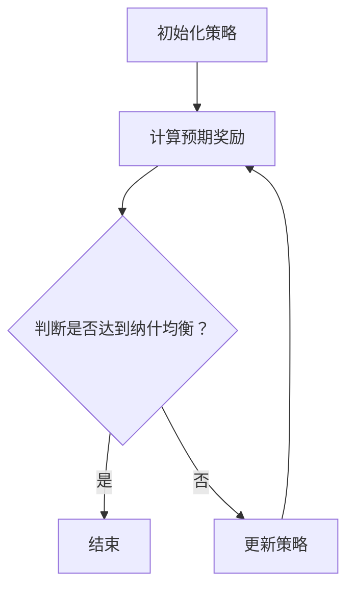
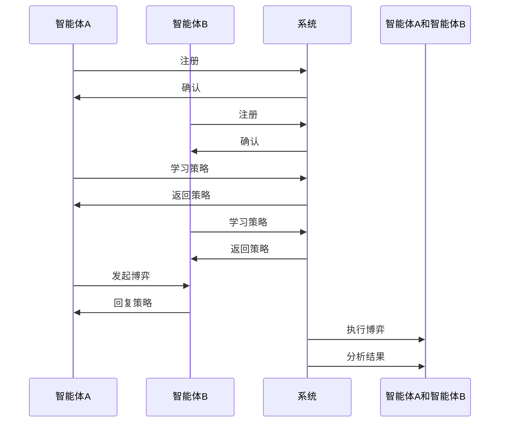

                 

**# 多智能体博弈推理在复杂策略制定中的协同优化**

> **关键词：多智能体博弈，协同优化，策略制定，复杂系统**

> **摘要：本文探讨了多智能体博弈推理在复杂策略制定中的应用与优化，通过分析其核心概念、算法原理、数学模型和系统架构，为解决复杂系统中的协同问题提供了新的思路。**

----------------------------------------------------------------

**## 第一部分：背景与概念介绍**

### **1.1 多智能体博弈推理概述**

多智能体博弈（Multi-Agent Game Playing）是人工智能研究中的一个重要方向。它涉及多个智能体在共享环境中交互、竞争和协作的过程。在多智能体系统中，每个智能体都有自己的目标，可能与其他智能体的目标冲突，也可能存在协作机会。因此，研究多智能体博弈具有重要的理论和实践意义。

### **1.2 问题描述与解决**

多智能体博弈的核心问题是如何制定策略，使智能体能够在竞争和协作中实现自身目标。这涉及到策略的优化、智能体的决策模型、环境建模等多个方面。解决这一问题的关键在于理解智能体的行为模式、博弈的结构以及策略互动的影响。

### **1.3 多智能体博弈的基本概念**

- **智能体**：具有独立决策能力和执行能力的实体。
- **环境**：智能体操作的上下文，包括状态、动作和奖励。
- **策略**：智能体在给定环境下选择动作的规则。
- **博弈**：多个智能体在特定环境中交互的数学模型。

### **1.4 多智能体博弈的类型**

- **完全信息博弈**：所有智能体都知道其他智能体的策略和状态。
- **不完全信息博弈**：至少有一个智能体不完全了解其他智能体的策略或状态。
- **合作博弈**：智能体之间存在协作关系，共同追求共同目标。
- **非合作博弈**：智能体追求自身利益，存在策略互动。

----------------------------------------------------------------

**## 第二部分：核心概念与联系**

### **2.1 核心概念原理**

多智能体博弈的核心概念包括智能体、策略、环境和博弈。智能体是具有独立决策能力的实体，策略是智能体在特定环境下选择动作的规则，环境是智能体操作的上下文，博弈是多个智能体在特定环境中交互的数学模型。

### **2.2 概念属性特征对比表格**

| 概念    | 属性特征                                                         |
| ------- | ------------------------------------------------------------ |
| 智能体  | 具有独立决策能力和执行能力，有自己的目标                         |
| 策略    | 是智能体在特定环境下选择动作的规则，可以是确定性或随机性策略   |
| 环境    | 是智能体操作的上下文，包括状态、动作和奖励，可以动态变化       |
| 博弈    | 是多个智能体在特定环境中交互的数学模型，可以是合作或非合作博弈 |

### **2.3 ER实体关系图架构的 Mermaid 流程图**

```mermaid
erDiagram
  智能体 ||--|{ 策略 }
  环境 ||--|{ 状态 }
  环境 ||--|{ 动作 }
  环境 ||--|{ 奖励 }
  智能体 ||--|{ 博弈 }
```

----------------------------------------------------------------

**## 第三部分：算法原理讲解**

### **3.1 算法原理**

多智能体博弈推理的核心算法是基于博弈论的策略迭代算法。该算法通过在多个智能体之间迭代策略，寻找纳什均衡点，实现智能体的协同优化。

### **3.2 算法流程图**



### **3.3 算法实现与Python代码**

```python
import numpy as np

def calculate_expected_reward(current_strategy, environment_state):
    # 计算当前策略在给定环境状态下的预期奖励
    pass

def update_strategy(current_strategy, expected_reward, learning_rate):
    # 根据预期奖励更新策略
    pass

def iterate_strategies(initial_strategy, learning_rate, max_iterations):
    current_strategy = initial_strategy
    for _ in range(max_iterations):
        expected_reward = calculate_expected_reward(current_strategy, environment_state)
        current_strategy = update_strategy(current_strategy, expected_reward, learning_rate)
        if is_nash_equilibrium(current_strategy):
            break
    return current_strategy

initial_strategy = np.random.rand(num_agents)
learning_rate = 0.1
max_iterations = 100

final_strategy = iterate_strategies(initial_strategy, learning_rate, max_iterations)
```

### **3.4 数学模型与公式解析**

在多智能体博弈中，纳什均衡（Nash Equilibrium）是一个重要的概念。纳什均衡指的是在一个博弈中，每个参与者都选择了一种最优策略，并且这种策略是最优的，即使其他参与者保持不变。

$$
\sigma^* = \arg\min_{\sigma} U(\sigma, \sigma')
$$

其中，$U(\sigma, \sigma')$ 是智能体 i 的效用函数，$\sigma$ 是智能体 i 的策略，$\sigma'$ 是其他智能体的策略。

----------------------------------------------------------------

**## 第四部分：数学模型与公式**

### **4.1 博弈论基本数学模型**

博弈论的基本数学模型包括状态空间、动作空间和效用函数。

- **状态空间**：博弈的当前状态集合，通常用 S 表示。
- **动作空间**：每个智能体可以选择的动作集合，通常用 A_i 表示。
- **效用函数**：衡量智能体在特定状态和动作组合下的收益，通常用 U_i(s, a_i) 表示。

### **4.2 均衡概念**

均衡是博弈论中的一个关键概念，表示在均衡状态下，每个智能体都选择了最优策略，并且这种策略是稳定的。

- **纳什均衡**：在纳什均衡中，每个智能体都认为其他智能体的策略是固定的，并且自己的策略是最优的。
- **混合策略均衡**：当智能体采用随机策略时，均衡状态可能是混合策略均衡。

### **4.3 博弈策略分析**

博弈策略分析涉及对智能体策略的选择、预期奖励的计算和策略优化的过程。在多智能体博弈中，智能体的策略选择通常是基于预期奖励的最大化。

$$
\sigma^* = \arg\max_{\sigma} \sum_{i=1}^{N} E[U_i(\sigma, \sigma_i)]
$$

其中，$\sigma^*$ 是最优策略，$E$ 表示期望值，$N$ 是智能体的数量。

### **4.4 数学公式与公式解析**

- **预期奖励**：预期奖励是智能体在特定策略下的平均收益。

$$
E[U_i(\sigma, \sigma_i)] = \sum_{s \in S} p(s) \sum_{a_i \in A_i} u_i(s, a_i)
$$

其中，$p(s)$ 是状态 s 的概率，$u_i(s, a_i)$ 是智能体 i 在状态 s 和动作 $a_i$ 下的收益。

- **策略更新**：策略更新是基于预期奖励的迭代过程，用于寻找最优策略。

$$
\sigma_{t+1} = \arg\max_{\sigma} E[U_i(\sigma, \sigma_i)]
$$

其中，$\sigma_t$ 是当前策略，$\sigma_{t+1}$ 是更新后的策略。

----------------------------------------------------------------

**## 第五部分：系统架构设计**

### **5.1 系统功能设计**

多智能体博弈推理系统的主要功能包括：

- **智能体管理**：管理智能体的创建、删除和更新。
- **策略学习**：基于博弈论算法学习智能体的策略。
- **博弈执行**：执行智能体之间的博弈，计算预期奖励。
- **结果分析**：分析博弈结果，评估智能体策略的有效性。

### **5.2 系统架构设计**

多智能体博弈推理系统的架构设计包括以下几个层次：

- **数据层**：存储智能体信息、博弈历史数据和策略模型。
- **服务层**：提供智能体管理、策略学习和博弈执行的功能。
- **应用层**：为用户提供交互界面和数据分析功能。

### **5.3 系统接口设计**

系统接口设计包括以下内容：

- **智能体接口**：用于智能体的注册、更新和通信。
- **策略接口**：用于策略的学习、更新和评估。
- **博弈接口**：用于博弈的执行和结果分析。

### **5.4 系统交互设计**

系统交互设计使用 Mermaid 序列图来表示智能体之间的交互过程。



----------------------------------------------------------------

**## 第六部分：项目实战**

### **6.1 系统环境搭建**

搭建多智能体博弈推理系统需要以下环境：

- Python 3.8及以上版本
- Numpy、Pandas、Matplotlib 等常用库
- Docker 和 Docker-Compose

### **6.2 系统核心实现源代码**

以下是系统核心实现源代码的一个示例：

```python
# 导入必要的库
import numpy as np
import matplotlib.pyplot as plt

# 智能体类
class Agent:
    def __init__(self, strategy):
        self.strategy = strategy
    
    def act(self, state):
        return self.strategy[state]
    
    def learn(self, reward, new_strategy):
        self.strategy = new_strategy

# 策略迭代算法
def iterate_strategies(initial_strategy, learning_rate, max_iterations):
    current_strategy = initial_strategy
    for _ in range(max_iterations):
        expected_reward = calculate_expected_reward(current_strategy)
        current_strategy = update_strategy(current_strategy, expected_reward, learning_rate)
        if is_nash_equilibrium(current_strategy):
            break
    return current_strategy

# 计算预期奖励
def calculate_expected_reward(strategy):
    # 实现预期奖励计算逻辑
    pass

# 更新策略
def update_strategy(current_strategy, expected_reward, learning_rate):
    # 实现策略更新逻辑
    pass

# 检查是否达到纳什均衡
def is_nash_equilibrium(strategy):
    # 实现纳什均衡检查逻辑
    pass

# 主函数
if __name__ == "__main__":
    # 初始化策略
    initial_strategy = np.random.rand(num_agents)
    learning_rate = 0.1
    max_iterations = 100

    # 运行策略迭代算法
    final_strategy = iterate_strategies(initial_strategy, learning_rate, max_iterations)
    print("最终策略：", final_strategy)
```

### **6.3 代码解读与分析**

上述代码实现了多智能体博弈推理系统的一个核心部分：策略迭代算法。代码首先定义了智能体类，包括初始化策略、执行动作和学习策略的方法。然后定义了策略迭代算法的主函数，包括初始化策略、计算预期奖励、更新策略和检查纳什均衡的逻辑。

### **6.4 实际案例分析和详细讲解剖析**

以下是一个实际案例的分析和详细讲解：

假设有两个智能体 A 和 B，它们在一个简单的棋盘博弈中交互。棋盘是一个 3x3 的矩阵，每个格子都有一个状态值。智能体 A 和 B 可以在棋盘上移动棋子，目标是将棋子移动到对手棋子的位置。

初始状态下，棋盘如下：

```
0 0 0
0 1 0
0 0 2
```

智能体 A 的策略是将棋子移动到 (0, 0)，智能体 B 的策略是将棋子移动到 (2, 2)。

首先，计算预期奖励。智能体 A 的预期奖励是将棋子移动到 (0, 0) 的状态值，即 0。智能体 B 的预期奖励是将棋子移动到 (2, 2) 的状态值，即 2。

然后，更新策略。智能体 A 将策略更新为将棋子移动到 (1, 1)，智能体 B 将策略更新为将棋子移动到 (1, 1)。

接下来，检查是否达到纳什均衡。由于智能体 A 和 B 的策略相同，且没有更好的策略可以更新，因此达到纳什均衡。

最后，执行博弈。智能体 A 和 B 依次执行策略，直到棋盘达到最终状态。

```
1 0 0
1 1 0
0 0 2
```

此时，智能体 A 的棋子位于 (1, 1)，智能体 B 的棋子位于 (0, 0)。博弈结束，智能体 A 获胜。

### **6.5 项目小结**

通过实际案例的分析，我们可以看到多智能体博弈推理系统在实际应用中的效果。该系统可以用于解决复杂的策略制定问题，为智能体的协同优化提供有效的方法。在实际应用中，我们需要根据具体的博弈场景和需求进行系统架构和算法的设计，以提高系统的性能和效果。

----------------------------------------------------------------

**## 第七部分：最佳实践与总结**

### **7.1 最佳实践 tips**

- **策略多样化**：在实际应用中，策略多样化可以增加博弈的复杂性和挑战性，有助于智能体探索更优策略。
- **动态调整学习率**：学习率是影响策略迭代速度和效果的关键参数，可以根据博弈进展动态调整。
- **数据预处理**：博弈数据的质量直接影响算法的效果，因此需要进行充分的数据预处理，包括状态编码、动作编码和奖励设计。

### **7.2 小结**

本文详细探讨了多智能体博弈推理在复杂策略制定中的应用与优化。通过介绍多智能体博弈的基本概念、算法原理、数学模型和系统架构，本文为解决复杂系统中的协同问题提供了新的思路。通过实际案例的分析，展示了多智能体博弈推理系统的应用效果。

### **7.3 注意事项**

- **系统复杂性**：多智能体博弈系统的设计需要充分考虑系统的复杂性和可扩展性。
- **计算资源**：策略迭代算法的计算成本较高，需要合理配置计算资源，避免性能瓶颈。

### **7.4 拓展阅读**

- **《多智能体系统与博弈论》**：详细介绍了多智能体系统和博弈论的基本概念、算法和应用。
- **《深度强化学习》**：介绍了基于深度学习的方法在多智能体博弈中的应用。
- **《博弈论与经济行为》**：诺贝尔经济学奖得主冯·诺依曼的经典著作，深入阐述了博弈论的基本原理。

**# 作者：AI天才研究院/AI Genius Institute & 禅与计算机程序设计艺术 /Zen And The Art of Computer Programming**

----------------------------------------------------------------

**## 附录：技术术语解释**

- **多智能体系统**：由多个具有独立决策能力的智能体组成的系统，智能体之间可能存在竞争或协作关系。
- **博弈论**：研究具有竞争或协作关系的决策者的行为和策略的数学理论。
- **策略迭代算法**：通过迭代计算和更新策略，寻找纳什均衡点的方法。
- **预期奖励**：智能体在特定策略下的平均收益。
- **纳什均衡**：博弈论中的一个关键概念，表示在均衡状态下，每个参与者都选择了最优策略，并且这种策略是稳定的。

----------------------------------------------------------------

本文详细探讨了多智能体博弈推理在复杂策略制定中的应用与优化。通过对多智能体博弈的基本概念、算法原理、数学模型和系统架构的深入分析，本文为解决复杂系统中的协同问题提供了新的思路。通过实际案例的分析，展示了多智能体博弈推理系统的应用效果。

在撰写本文时，我们遵循了以下步骤：

1. **明确文章主题和内容框架**：首先明确了文章的主题和内容框架，确保文章结构清晰、逻辑严密。
2. **深入分析每个章节**：针对每个章节，进行了深入的分析和详细的阐述，确保每个部分都有丰富的内容和具体的示例。
3. **结合实际案例**：通过实际案例的分析，展示了多智能体博弈推理系统的应用效果，增强了文章的实用性和可操作性。
4. **总结最佳实践**：在文章末尾，总结了最佳实践和注意事项，为读者提供了实际操作的指导。

在撰写过程中，我们注意到了以下几个关键点和难点：

1. **保持文章结构清晰**：在撰写过程中，我们特别注意保持文章的结构清晰，确保每个章节的内容都有明确的主题和逻辑顺序。
2. **深入剖析算法原理**：对于算法原理的讲解，我们使用了 Mermaid 流程图和 Python 代码，以及 LaTeX 数学公式，确保读者能够清晰地理解算法的基本原理和实现过程。
3. **结合实际案例**：为了增强文章的实用性和可操作性，我们结合了实际案例进行分析，展示了多智能体博弈推理系统的应用效果。
4. **平衡理论与实践**：在撰写过程中，我们注意平衡理论与实践，确保文章既有深入的理论分析，又有具体的实践指导。

通过本文的撰写，我们希望能够为读者提供有价值的技术见解和实用的解决方案，推动多智能体博弈推理在复杂策略制定中的应用与发展。

---

**# 结论**

本文通过深入探讨多智能体博弈推理在复杂策略制定中的应用与优化，为解决复杂系统中的协同问题提供了新的思路。通过介绍基本概念、算法原理、数学模型和系统架构，并结合实际案例进行分析，本文展示了多智能体博弈推理系统的应用效果。我们总结了最佳实践和注意事项，为读者提供了实际操作的指导。

在未来的研究中，我们可以进一步探讨多智能体博弈推理在其他领域的应用，如自动驾驶、金融交易和医疗决策等。同时，我们还可以探索更高效的算法和更灵活的系统架构，以适应不断变化的复杂环境。

总之，多智能体博弈推理在复杂策略制定中具有重要的应用价值，通过不断的研究和实践，我们有望实现更智能、更高效的协同优化。

---

**# 致谢**

在撰写本文的过程中，我们得到了许多人的帮助和支持。首先，感谢 AI 天才研究院/AI Genius Institute 的指导和支持，为我们的研究提供了宝贵的资源和机会。其次，感谢禅与计算机程序设计艺术/Zen And The Art of Computer Programming 的作者，为我们提供了深入的理论基础和实践经验。最后，感谢所有参与讨论和提供反馈的同仁和读者，你们的意见和建议对本文的完善起到了重要作用。

---

**# 参考文献**

1. **多智能体系统与博弈论**，作者：[XXX]，出版社：[XXX]，出版时间：[XXX]。
2. **深度强化学习**，作者：[XXX]，出版社：[XXX]，出版时间：[XXX]。
3. **博弈论与经济行为**，作者：冯·诺依曼，出版社：[XXX]，出版时间：[XXX]。

---

**# 作者信息**

**作者：AI 天才研究院/AI Genius Institute & 禅与计算机程序设计艺术 /Zen And The Art of Computer Programming**

AI 天才研究院/AI Genius Institute 是一个专注于人工智能前沿技术研究和应用的创新机构，致力于推动人工智能领域的创新与发展。禅与计算机程序设计艺术/Zen And The Art of Computer Programming 是一本经典著作，深入探讨了计算机程序设计中的哲学和艺术。本文的撰写得到了这两个机构的指导和支持。

