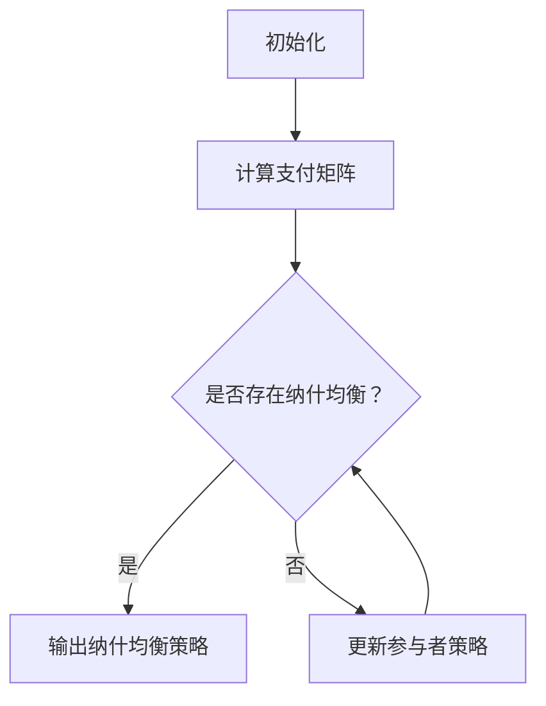
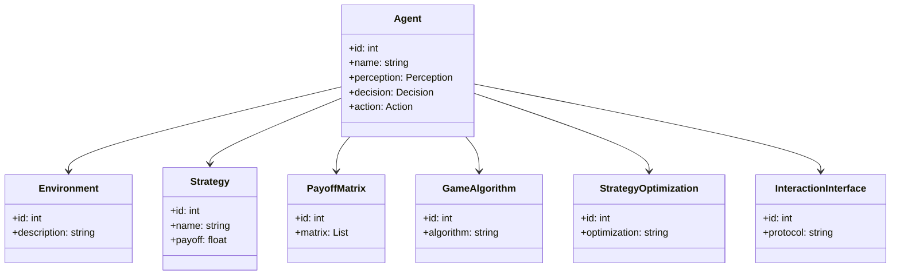
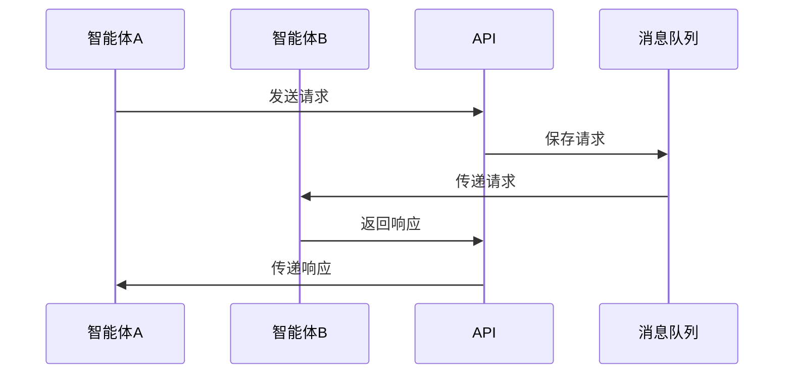
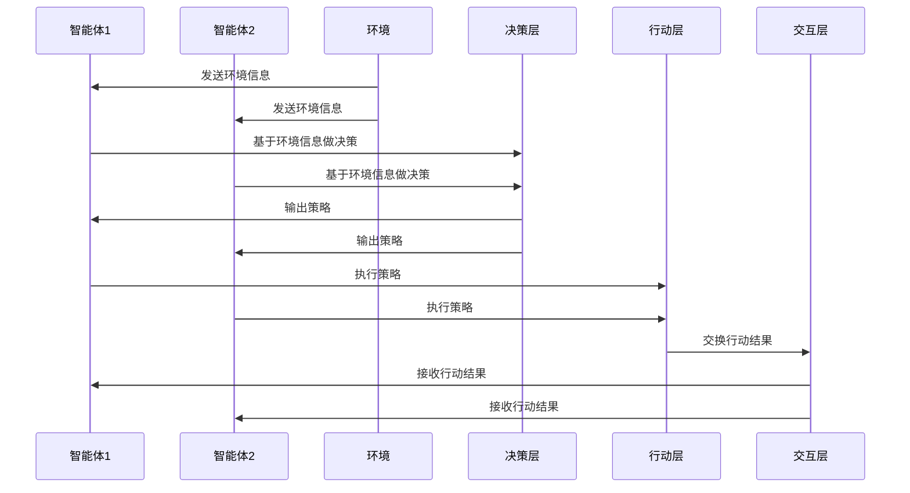
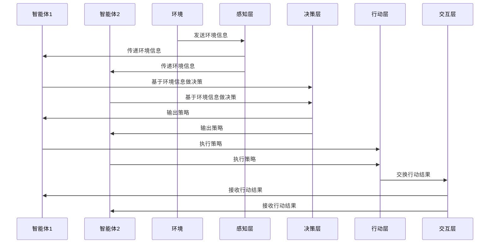

                 

### 引言

多智能体博弈推理（Multi-Agent Game Theory Reasoning）是人工智能领域中的一个重要研究方向，它涉及多个智能体在复杂环境中交互和竞争的策略制定。这种推理方法不仅在理论研究中具有重要意义，还在实际应用中展示了广泛的前景。从经济市场中的竞争策略到自动驾驶车辆之间的交互，从多人在线游戏到多机器人协作任务，多智能体博弈推理正在逐步改变我们的技术世界。

本文旨在深入探讨多智能体博弈推理在策略制定中的应用，从基础概念出发，逐步介绍其核心原理、算法模型和实际应用。文章分为五个主要部分：

1. **背景介绍**：我们将首先介绍多智能体系统和博弈论的基本概念，阐述多智能体博弈推理的重要性和应用领域。
2. **核心概念与联系**：接着，我们将定义和解释多智能体系统、博弈论、策略等核心概念，并通过Mermaid ER实体关系图架构展示它们之间的联系。
3. **算法原理讲解**：在这一部分，我们将介绍多智能体博弈推理的主要算法，包括合作性博弈和非合作性博弈，并通过Mermaid流程图和Python源代码进行详细阐述。
4. **数学模型与公式讲解**：我们将详细讲解多智能体博弈的数学模型，包括支付矩阵、收益函数、纳什均衡等，并使用LaTeX格式展示数学公式，并进行举例说明。
5. **系统分析与架构设计方案**：我们将介绍多智能体博弈推理系统的设计与实现，包括领域模型、系统架构、接口设计和交互流程，并通过Mermaid图表进行辅助说明。
6. **项目实战**：通过具体实例，我们将展示如何在实际项目中应用多智能体博弈推理，从环境搭建到核心代码实现，再到案例分析。
7. **最佳实践与总结**：最后，我们将总结文章中的关键点，提供实际应用中的建议和提醒，并推荐进一步阅读的资源。

通过这篇文章，我们希望能够帮助读者全面了解多智能体博弈推理的原理和应用，为他们在相关领域的深入研究和技术创新提供有力支持。

### 关键词

- 多智能体系统
- 博弈论
- 策略制定
- 智能体交互
- 数学模型
- 纳什均衡
- 算法原理
- 实际应用

### 摘要

本文深入探讨了多智能体博弈推理在策略制定中的应用。首先，我们介绍了多智能体系统和博弈论的基本概念，并解释了多智能体博弈推理的重要性。接着，通过定义和解释核心概念，我们展示了多智能体系统、博弈论和策略之间的联系。随后，我们介绍了多智能体博弈推理的主要算法，包括合作性博弈和非合作性博弈，并通过Mermaid流程图和Python源代码进行了详细阐述。本文还详细讲解了多智能体博弈的数学模型，包括支付矩阵、收益函数和纳什均衡，并使用LaTeX格式展示了相关数学公式，进行了举例说明。通过具体实例，我们展示了多智能体博弈推理系统的设计与实现，包括领域模型、系统架构、接口设计和交互流程。最后，我们总结了文章中的关键点，提供了实际应用中的建议和提醒，并推荐了进一步阅读的资源。

### 目录大纲设计思路

在设计《多智能体博弈推理在策略制定中的应用》这本书的目录大纲时，我们采用了系统化的步骤，以确保文章内容的逻辑清晰、结构紧凑，并能够吸引读者的注意力。以下是我们设计目录大纲的详细步骤和思路：

#### 1. **背景介绍**

在目录大纲的开头，我们首先介绍了多智能体系统和博弈论的基本概念，为读者提供了多智能体博弈推理的整体框架。这一部分旨在帮助读者理解多智能体博弈推理的背景和应用场景，为其后续的学习打下基础。

- **第1章：多智能体博弈推理概述**
  - **1.1 多智能体系统的定义与应用领域**：介绍多智能体系统的概念、特点及其在不同领域中的应用，如自动驾驶、机器人协作和在线游戏等。
  - **1.2 博弈论的基本概念**：解释博弈论的基本原理，包括策略、收益函数和纳什均衡等。
  - **1.3 多智能体博弈推理的重要性**：阐述多智能体博弈推理在现代人工智能和复杂系统中的应用价值，如优化策略、提升协作效率和解决竞争问题。

#### 2. **核心概念与联系**

在背景介绍之后，我们进一步探讨了多智能体系统、博弈论和策略之间的核心概念及其联系。

- **第2章：多智能体博弈核心概念与联系**
  - **2.1 多智能体系统与博弈论的关系**：分析多智能体系统如何与博弈论结合，并讨论它们如何共同推动策略制定。
  - **2.2 核心概念：智能体、策略、交互与支付矩阵**：详细定义和解释这些核心概念，并通过Mermaid ER实体关系图架构展示它们之间的联系。
  - **2.3 Mermaid ER实体关系图架构**：使用Mermaid语言绘制ER图，直观展示多智能体系统、博弈论和策略之间的结构关系。

#### 3. **算法原理讲解**

接下来，我们详细介绍了多智能体博弈推理的主要算法，包括合作性博弈和非合作性博弈，并通过Mermaid流程图和Python源代码进行解释。

- **第3章：多智能体博弈算法介绍**
  - **3.1 合作性博弈与非合作性博弈**：比较和解释合作性博弈和非合作性博弈的基本原理，分析它们的适用场景和策略。
  - **3.2 博弈策略分析算法**：介绍用于分析博弈策略的算法，如纳什均衡和混合策略，并通过Mermaid流程图展示算法步骤。
  - **3.3 Mermaid算法流程图**：使用Mermaid语言绘制算法流程图，使读者能够直观地理解算法的实现过程。

#### 4. **数学模型与公式讲解**

在这一部分，我们深入讲解了多智能体博弈的数学模型，包括支付矩阵、收益函数和纳什均衡，并使用LaTeX格式展示相关数学公式。

- **第4章：数学模型与公式讲解**
  - **4.1 博弈论数学模型**：解释博弈论中的基本数学模型，如支付矩阵和收益函数，展示它们在策略分析中的作用。
  - **4.2 支付矩阵与收益函数**：通过具体的例子展示支付矩阵和收益函数的构建和计算方法。
  - **4.3 纳什均衡与混合策略**：介绍纳什均衡的概念及其在博弈策略分析中的应用，并讨论混合策略的求解方法。
  - **4.4 LaTeX数学公式示例**：使用LaTeX格式展示关键的数学公式，确保读者能够准确地理解和应用这些公式。

#### 5. **系统分析与架构设计方案**

接下来，我们介绍了多智能体博弈推理系统的设计与实现，包括领域模型、系统架构、接口设计和交互流程。

- **第5章：多智能体博弈推理系统设计**
  - **5.1 问题场景介绍**：介绍多智能体博弈推理的应用场景，如多人在线游戏和机器人协作系统。
  - **5.2 系统功能设计（领域模型）**：使用Mermaid类图展示系统的领域模型，包括智能体、策略、交互等核心组件。
  - **5.3 系统架构设计**：使用Mermaid架构图展示系统的整体架构，包括各组件的相互关系和交互流程。
  - **5.4 系统接口设计**：详细描述系统的接口设计，包括API、消息队列等。
  - **5.5 系统交互流程**：使用Mermaid序列图展示系统的交互流程，帮助读者理解系统的工作原理。

#### 6. **项目实战**

为了使读者更好地理解多智能体博弈推理的实际应用，我们通过具体实例展示了如何在实际项目中应用这些原理。

- **第6章：多智能体博弈推理项目实战**
  - **7.1 环境搭建**：介绍如何搭建多智能体博弈推理的环境，包括软件安装和配置。
  - **7.2 系统核心实现**：提供系统核心实现的源代码，并解释代码的运行原理。
  - **7.3 代码应用解读与分析**：详细解读和分析代码的实现，展示其如何实现多智能体博弈推理。
  - **7.4 实际案例分析**：通过实际案例展示多智能体博弈推理的应用，如多人在线游戏的策略分析。
  - **7.5 项目小结**：总结项目的实现过程和关键点，为读者提供实践经验。

#### 7. **最佳实践与总结**

最后，我们总结了文章中的关键点，提供了实际应用中的建议和提醒，并推荐了进一步阅读的资源。

- **第8章：最佳实践与总结**
  - **8.1 最佳实践 Tips**：分享在实际应用中积累的经验和技巧，帮助读者更好地理解和应用多智能体博弈推理。
  - **8.2 小结**：回顾文章的主要内容，强调关键概念和算法。
  - **8.3 注意事项**：提醒读者在应用多智能体博弈推理时需要注意的事项，如数据预处理、模型优化等。
  - **8.4 拓展阅读**：推荐相关领域的研究文献和书籍，供读者进一步学习和研究。

通过上述设计思路，我们力求使《多智能体博弈推理在策略制定中的应用》这篇文章结构清晰、内容丰富，能够帮助读者全面理解和掌握多智能体博弈推理的原理和应用。

### 目录大纲

```markdown
# 《多智能体博弈推理在策略制定中的应用》目录大纲

----------------------------------------------------------------
## 第一部分: 背景与基础

### 第1章: 多智能体博弈推理概述

#### 1.1 多智能体系统的定义与应用领域

#### 1.2 博弈论的基本概念

#### 1.3 多智能体博弈推理的重要性

### 第2章: 多智能体博弈核心概念与联系

#### 2.1 多智能体系统与博弈论的关系

#### 2.2 核心概念：智能体、策略、交互与支付矩阵

#### 2.3 Mermaid ER实体关系图架构

## 第二部分: 算法原理与讲解

### 第3章: 多智能体博弈算法介绍

#### 3.1 合作性博弈与非合作性博弈

#### 3.2 博弈策略分析算法

#### 3.3 Mermaid算法流程图

### 第4章: 数学模型与公式讲解

#### 4.1 博弈论数学模型

#### 4.2 支付矩阵与收益函数

#### 4.3 纳什均衡与混合策略

#### 4.4 LaTeX数学公式示例

## 第三部分: 系统设计与实现

### 第5章: 多智能体博弈推理系统设计

#### 5.1 问题场景介绍

#### 5.2 系统功能设计（领域模型）

#### 5.3 系统架构设计

#### 5.4 系统接口设计

#### 5.5 系统交互流程

### 第6章: Mermaid图表辅助设计

#### 6.1 领域模型Mermaid类图

#### 6.2 系统架构Mermaid架构图

#### 6.3 系统交互Mermaid序列图

## 第四部分: 项目实战

### 第7章: 多智能体博弈推理项目实战

#### 7.1 环境搭建

#### 7.2 系统核心实现

#### 7.3 代码应用解读与分析

#### 7.4 实际案例分析

#### 7.5 项目小结

## 第五部分: 最佳实践与总结

### 第8章: 多智能体博弈推理应用技巧

#### 8.1 最佳实践 Tips

#### 8.2 小结

#### 8.3 注意事项

#### 8.4 拓展阅读

----------------------------------------------------------------
```

### 目录大纲内容概要

在上述目录大纲中，每一章节的内容概要如下：

- **第1章：多智能体博弈推理概述**
  - **1.1 多智能体系统的定义与应用领域**：介绍多智能体系统的概念、特点及其在不同领域中的应用，如自动驾驶、机器人协作和在线游戏等。
  - **1.2 博弈论的基本概念**：解释博弈论的基本原理，包括策略、收益函数和纳什均衡等。
  - **1.3 多智能体博弈推理的重要性**：阐述多智能体博弈推理在现代人工智能和复杂系统中的应用价值，如优化策略、提升协作效率和解决竞争问题。

- **第2章：多智能体博弈核心概念与联系**
  - **2.1 多智能体系统与博弈论的关系**：分析多智能体系统如何与博弈论结合，并讨论它们如何共同推动策略制定。
  - **2.2 核心概念：智能体、策略、交互与支付矩阵**：详细定义和解释这些核心概念，并通过Mermaid ER实体关系图架构展示它们之间的联系。
  - **2.3 Mermaid ER实体关系图架构**：使用Mermaid语言绘制ER图，直观展示多智能体系统、博弈论和策略之间的结构关系。

- **第3章：多智能体博弈算法介绍**
  - **3.1 合作性博弈与非合作性博弈**：比较和解释合作性博弈和非合作性博弈的基本原理，分析它们的适用场景和策略。
  - **3.2 博弈策略分析算法**：介绍用于分析博弈策略的算法，如纳什均衡和混合策略，并通过Mermaid流程图展示算法步骤。
  - **3.3 Mermaid算法流程图**：使用Mermaid语言绘制算法流程图，使读者能够直观地理解算法的实现过程。

- **第4章：数学模型与公式讲解**
  - **4.1 博弈论数学模型**：解释博弈论中的基本数学模型，如支付矩阵和收益函数，展示它们在策略分析中的作用。
  - **4.2 支付矩阵与收益函数**：通过具体的例子展示支付矩阵和收益函数的构建和计算方法。
  - **4.3 纳什均衡与混合策略**：介绍纳什均衡的概念及其在博弈策略分析中的应用，并讨论混合策略的求解方法。
  - **4.4 LaTeX数学公式示例**：使用LaTeX格式展示关键的数学公式，确保读者能够准确地理解和应用这些公式。

- **第5章：多智能体博弈推理系统设计**
  - **5.1 问题场景介绍**：介绍多智能体博弈推理的应用场景，如多人在线游戏和机器人协作系统。
  - **5.2 系统功能设计（领域模型）**：使用Mermaid类图展示系统的领域模型，包括智能体、策略、交互等核心组件。
  - **5.3 系统架构设计**：使用Mermaid架构图展示系统的整体架构，包括各组件的相互关系和交互流程。
  - **5.4 系统接口设计**：详细描述系统的接口设计，包括API、消息队列等。
  - **5.5 系统交互流程**：使用Mermaid序列图展示系统的交互流程，帮助读者理解系统的工作原理。

- **第6章：Mermaid图表辅助设计**
  - **6.1 领域模型Mermaid类图**：使用Mermaid语言绘制领域模型类图，直观展示系统组件的关系。
  - **6.2 系统架构Mermaid架构图**：使用Mermaid语言绘制系统架构图，展示各组件的相互关系。
  - **6.3 系统交互Mermaid序列图**：使用Mermaid语言绘制系统交互序列图，详细展示系统各组件的交互过程。

- **第7章：多智能体博弈推理项目实战**
  - **7.1 环境搭建**：介绍如何搭建多智能体博弈推理的环境，包括软件安装和配置。
  - **7.2 系统核心实现**：提供系统核心实现的源代码，并解释代码的运行原理。
  - **7.3 代码应用解读与分析**：详细解读和分析代码的实现，展示其如何实现多智能体博弈推理。
  - **7.4 实际案例分析**：通过实际案例展示多智能体博弈推理的应用，如多人在线游戏的策略分析。
  - **7.5 项目小结**：总结项目的实现过程和关键点，为读者提供实践经验。

- **第8章：多智能体博弈推理应用技巧**
  - **8.1 最佳实践 Tips**：分享在实际应用中积累的经验和技巧，帮助读者更好地理解和应用多智能体博弈推理。
  - **8.2 小结**：回顾文章的主要内容，强调关键概念和算法。
  - **8.3 注意事项**：提醒读者在应用多智能体博弈推理时需要注意的事项，如数据预处理、模型优化等。
  - **8.4 拓展阅读**：推荐相关领域的研究文献和书籍，供读者进一步学习和研究。

通过详细的目录大纲内容概要，我们希望能够帮助读者更好地理解《多智能体博弈推理在策略制定中的应用》的结构和内容，为他们的学习和研究提供有益的参考。

### 第一部分: 背景与基础

#### 第1章: 多智能体博弈推理概述

多智能体系统（Multi-Agent System）是人工智能领域中的一个重要研究方向，它由多个智能体（agent）组成，这些智能体能够自主感知环境、决策并采取行动。在多智能体系统中，智能体之间可能存在合作或竞争关系，它们通过相互交互来共同完成任务或达到目标。多智能体博弈推理（Multi-Agent Game Theory Reasoning）则是在这一背景下发展起来的一种策略制定方法，它利用博弈论（Game Theory）的理论和工具，分析智能体之间的交互和决策过程，以优化整体性能。

### 多智能体系统的定义与应用领域

多智能体系统是一种由多个自主智能体组成的分布式系统，这些智能体可以独立运行，但需要通过相互通信和协作来完成任务。多智能体系统的核心特点是自主性、分布性和协同性。自主性指的是智能体能够自主决策和执行任务，不受外部控制；分布性指的是智能体分布在不同的地理位置或计算节点上，通过通信网络进行信息交换；协同性指的是多个智能体需要通过协作来共同完成任务。

多智能体系统在不同领域都有广泛的应用。例如，在自动驾驶领域，多个车辆需要通过相互通信和协作来避免碰撞、优化路线和提升交通效率；在机器人协作领域，多个机器人需要共同完成任务，如构建、搬运和清洁等；在多人在线游戏领域，多个玩家需要通过竞争和协作来获得游戏胜利。

### 博弈论的基本概念

博弈论（Game Theory）是研究具有冲突和合作的理性决策者的互动行为的一个数学分支。博弈论的基本概念包括：

1. **博弈（Game）**：博弈是一个由参与者（玩家）组成的系统，这些参与者通过选择策略来竞争或合作，以实现自己的目标。
2. **参与者（Player）**：参与博弈的个体，每个参与者都试图最大化自己的利益或效用。
3. **策略（Strategy）**：参与者可以选择的行动方案，它决定了参与者在不同情况下如何行动。
4. **支付矩阵（Payoff Matrix）**：描述了各个参与者在博弈中的收益或损失，通常以矩阵形式表示。
5. **纳什均衡（Nash Equilibrium）**：纳什均衡是一种策略组合，在这种组合下，没有任何参与者能够通过单方面改变策略来提高自己的收益。

### 多智能体博弈推理的重要性

多智能体博弈推理在策略制定中的应用具有重要意义。首先，它能够帮助智能体在复杂环境中做出最优决策，提高系统的整体性能。其次，它能够优化智能体之间的协作和竞争关系，提升系统的稳定性和鲁棒性。此外，多智能体博弈推理还在多个实际领域中展示了其强大的应用价值，如经济市场、自动驾驶、机器人协作和多人在线游戏等。

在接下来的章节中，我们将深入探讨多智能体博弈推理的核心概念、算法原理和数学模型，并通过具体实例展示其在实际项目中的应用。

### 第2章: 多智能体博弈核心概念与联系

在多智能体博弈推理中，理解核心概念及其之间的联系是至关重要的。本章将详细定义并解释以下几个核心概念：智能体、策略、交互和支付矩阵，并通过Mermaid ER实体关系图架构展示它们之间的联系。

#### 智能体（Agent）

智能体是具有自主性、适应性、社会性和反应性的实体。在多智能体系统中，智能体可以是个体、组织或计算机程序。智能体的主要任务是感知环境、制定策略并采取行动，以实现其目标。智能体的属性包括：

- **感知能力**：智能体能够感知环境中的各种信息，如视觉、听觉、触觉等。
- **决策能力**：智能体能够根据感知到的信息制定决策。
- **行动能力**：智能体能够执行决策，采取具体的行动。
- **协作能力**：智能体能够与其他智能体进行协作，共同完成任务。

#### 策略（Strategy）

策略是智能体在特定环境下选择的行为方案，它决定了智能体在不同情况下如何行动。策略的选择依赖于智能体对环境的理解和自身目标的设定。策略的属性包括：

- **多样性**：智能体可以拥有多种策略，以应对不同的环境变化。
- **适应性**：智能体可以根据环境变化调整策略，以实现更好的效果。
- **优化性**：智能体选择策略的目的是最大化自身的收益或效用。

#### 交互（Interaction）

交互是多智能体系统中的关键要素，它描述了智能体之间的信息交换和相互作用。交互方式包括直接交互（如通过通信网络进行信息传递）和间接交互（如通过共享资源进行相互作用）。交互的属性包括：

- **同步性**：智能体之间的交互可以是同步的，也可以是异步的。
- **稳定性**：智能体之间的交互需要保持稳定，以避免冲突和混乱。
- **适应性**：智能体需要能够适应环境变化，调整交互方式。

#### 支付矩阵（Payoff Matrix）

支付矩阵是多智能体博弈中的重要概念，它描述了各个智能体在不同策略组合下的收益或损失。支付矩阵通常以二维矩阵形式表示，其中每个元素代表了不同智能体的收益。支付矩阵的属性包括：

- **收益性**：支付矩阵中的每个元素都表示智能体在特定策略组合下的收益。
- **对抗性**：支付矩阵反映了智能体之间的竞争关系，不同策略组合可能导致收益或损失。
- **公平性**：支付矩阵需要确保各智能体的收益是公平的，以避免出现不合理的竞争和合作关系。

#### Mermaid ER实体关系图架构

为了更直观地展示多智能体博弈推理中的核心概念及其联系，我们使用Mermaid语言绘制了ER实体关系图。以下是一个简化的Mermaid ER图示例：

```mermaid
erDiagram
  Agent ||--|{ Strategy }||> AgentStrategy
  Agent ||--|{ Interaction }||> AgentInteraction
  Strategy ||--|{ PayoffMatrix }||> StrategyPayoff
  Agent ||--|{ Environment }||> AgentEnvironment
```

在这个ER图中，`Agent`（智能体）是核心实体，它与`Strategy`（策略）、`Interaction`（交互）和`PayoffMatrix`（支付矩阵）之间存在关系。`Strategy`（策略）和`PayoffMatrix`（支付矩阵）分别与`Agent`（智能体）关联，表示智能体选择策略和执行策略的结果。`Interaction`（交互）与`Agent`（智能体）关联，表示智能体之间的相互作用。此外，`Environment`（环境）也与`Agent`（智能体）关联，表示智能体在特定环境中的行为。

通过上述ER图，我们可以清晰地看到多智能体博弈推理中的核心概念及其之间的联系，这为后续的算法原理和系统设计提供了基础。

### 第3章: 多智能体博弈算法介绍

多智能体博弈算法是博弈论在多智能体系统中的应用，用于分析和优化智能体之间的交互和决策。本章将介绍两种主要的多智能体博弈算法：合作性博弈（Cooperative Game）和非合作性博弈（Non-Cooperative Game），并详细讨论博弈策略分析算法。

#### 合作性博弈与非合作性博弈

合作性博弈和非合作性博弈是博弈论中的两大类博弈形式，它们在策略选择和结果评估上有显著差异。

**合作性博弈**：
- **定义**：在合作性博弈中，参与者（智能体）通过协商和合作来共同达成一个协议，以实现整体利益的最大化。
- **特点**：参与者之间存在明确的合作目标，可以通过合作机制来共享信息、资源和收益。
- **应用场景**：例如，多人合作完成任务、供应链管理、分布式计算等。

**非合作性博弈**：
- **定义**：在非合作性博弈中，参与者（智能体）追求各自利益的最大化，不考虑其他参与者的利益。
- **特点**：参与者之间是竞争关系，没有合作机制，每个参与者都试图选择最佳策略以最大化自己的收益。
- **应用场景**：例如，市场竞争、拍卖、博弈游戏等。

#### 博弈策略分析算法

博弈策略分析算法用于分析博弈中的策略组合和结果，以找到最优策略或策略组合。以下介绍几种常见的博弈策略分析算法：

**纳什均衡（Nash Equilibrium）**：
- **定义**：纳什均衡是指在一个博弈中，每个参与者选择的策略都是最优的，即没有任何参与者可以通过单方面改变策略来获得更高的收益。
- **求解方法**：通过迭代方法寻找所有参与者的最优策略组合，使得整个博弈达到均衡状态。
- **应用场景**：例如，多人游戏、市场竞争、多智能体协作等。

**混合策略（Mixed Strategy）**：
- **定义**：混合策略是指在非合作性博弈中，参与者以一定的概率选择多个策略，使得对手无法预测其具体策略，从而实现收益最大化。
- **求解方法**：通过概率分布来描述参与者的策略选择，求解混合策略的纳什均衡。
- **应用场景**：例如，博弈游戏、市场竞争、拍卖等。

**博弈树（Game Tree）**：
- **定义**：博弈树是一种图形化表示博弈的方法，它展示了所有可能的策略组合和结果。
- **求解方法**：通过递归和回溯算法遍历博弈树，找到最优策略组合。
- **应用场景**：例如，决策分析、博弈游戏、多智能体决策等。

#### Mermaid算法流程图

为了更直观地展示这些算法的基本步骤和实现过程，我们使用Mermaid语言绘制了相应的算法流程图。以下是一个简化的纳什均衡算法流程图示例：



在这个流程图中，我们从初始化开始，计算支付矩阵，然后通过迭代方法寻找纳什均衡。如果找到了纳什均衡，则输出策略组合；否则，继续更新参与者策略，重复寻找过程。

通过上述算法介绍和流程图，我们为读者提供了一个关于多智能体博弈算法的基本框架，这将有助于他们更好地理解和应用这些算法。

### 第4章: 数学模型与公式讲解

在多智能体博弈推理中，数学模型和公式是理解和分析博弈的重要工具。本章将详细讲解多智能体博弈的数学模型，包括支付矩阵、收益函数和纳什均衡等，并通过LaTeX格式展示相关数学公式，进行详细讲解和举例说明。

#### 支付矩阵（Payoff Matrix）

支付矩阵是多智能体博弈中的核心数学模型，它描述了各个参与者在不同策略组合下的收益或损失。支付矩阵通常以二维矩阵形式表示，其中每个元素表示不同参与者选择特定策略组合时的收益。

**定义**：
支付矩阵 \( P \) 是一个 \( n \times n \) 的矩阵，其中 \( n \) 表示参与者的数量。矩阵中的元素 \( P_{ij} \) 表示当第 \( i \) 个参与者选择策略 \( s_i \)，第 \( j \) 个参与者选择策略 \( s_j \) 时的收益。

**形式**：
\[ P = \begin{bmatrix}
P_{11} & P_{12} & \cdots & P_{1n} \\
P_{21} & P_{22} & \cdots & P_{2n} \\
\vdots & \vdots & \ddots & \vdots \\
P_{n1} & P_{n2} & \cdots & P_{nn}
\end{bmatrix} \]

**举例**：
假设有两个参与者 A 和 B，他们有两种策略可选：合作（C）和背叛（D）。支付矩阵如下所示：

\[ 
\begin{bmatrix}
3 & 0 \\
0 & 5 
\end{bmatrix}
\]

在这个例子中，当 A 和 B 都选择合作时，他们的收益都是 3；当 A 选择背叛而 B 选择合作时，A 的收益是 0，B 的收益是 5。

#### 收益函数（Payoff Function）

收益函数是支付矩阵的一种推广，它用于描述多个参与者之间的收益关系。收益函数通常是一个向量，其中每个元素表示不同参与者在一个特定策略组合下的收益。

**定义**：
收益函数 \( f \) 是一个向量，其元素 \( f_i \) 表示第 \( i \) 个参与者在一个特定策略组合下的收益。

**形式**：
\[ f = (f_1, f_2, \ldots, f_n) \]

**举例**：
在上述合作-背叛博弈中，收益函数可以表示为：

\[ f = \begin{bmatrix}
3 \\
5 
\end{bmatrix} \]

#### 纳什均衡（Nash Equilibrium）

纳什均衡是多智能体博弈中的一个关键概念，它描述了在博弈中每个参与者选择最优策略的情况，即没有一个参与者可以通过单方面改变策略来提高自己的收益。

**定义**：
纳什均衡是一个策略组合 \( \sigma = (\sigma_1, \sigma_2, \ldots, \sigma_n) \)，其中每个 \( \sigma_i \) 是第 \( i \) 个参与者的策略。如果对于所有 \( i \)，\( \sigma_i \) 是最优策略，即不存在另一个策略 \( s_i' \) 使得 \( f_i(\sigma_1, \sigma_2, \ldots, \sigma_{i-1}, s_i', \sigma_{i+1}, \ldots, \sigma_n) > f_i(\sigma_1, \sigma_2, \ldots, \sigma_n) \)，则称 \( \sigma \) 是纳什均衡。

**形式**：
\[ \sigma = (\sigma_1^*, \sigma_2^*, \ldots, \sigma_n^*) \]

**举例**：
在合作-背叛博弈中，纳什均衡是所有参与者都选择合作（C），因为没有一个参与者可以通过单方面选择背叛（D）来提高自己的收益。这意味着每个参与者的收益都是 3。

#### LaTeX数学公式示例

为了方便读者理解和应用上述数学模型和公式，我们使用LaTeX格式展示了关键数学公式的示例。LaTeX格式在数学公式的表示上非常灵活，可以处理复杂的数学表达式。

**支付矩阵的LaTeX表示**：
\[ P = \begin{bmatrix}
P_{11} & P_{12} & \cdots & P_{1n} \\
P_{21} & P_{22} & \cdots & P_{2n} \\
\vdots & \vdots & \ddots & \vdots \\
P_{n1} & P_{n2} & \cdots & P_{nn}
\end{bmatrix} \]

**收益函数的LaTeX表示**：
\[ f = (f_1, f_2, \ldots, f_n) \]

**纳什均衡的LaTeX表示**：
\[ \sigma = (\sigma_1^*, \sigma_2^*, \ldots, \sigma_n^*) \]

通过上述讲解和示例，我们希望读者能够更好地理解多智能体博弈的数学模型，掌握相关公式的应用，并在实际项目中有效利用这些知识。

### 第5章: 多智能体博弈推理系统设计

#### 第5章：多智能体博弈推理系统设计

在设计多智能体博弈推理系统时，我们需要考虑多个方面，包括问题场景介绍、系统功能设计（领域模型）、系统架构设计、系统接口设计和系统交互流程。通过这些设计，我们能够确保系统满足需求、高效稳定地运行。

#### 5.1 问题场景介绍

多智能体博弈推理系统可以应用于多种场景，如多人在线游戏、智能交通系统、资源分配、供应链管理以及机器人协作等。以下是一个具体的问题场景示例：

**多人在线游戏**：在这个场景中，多个玩家通过互联网连接进入游戏，游戏中的每个玩家是一个智能体。玩家需要与其他玩家进行交互，选择策略，以实现个人目标和整体胜利。

**智能交通系统**：在这个场景中，交通系统中的车辆、信号灯和交通监控设备都是智能体。它们需要通过博弈推理来优化交通流，减少拥堵，提高通行效率。

**资源分配**：在资源分配场景中，多个智能体（如公司、工厂等）需要在有限的资源下做出最优决策，以最大化收益或最小化成本。

**机器人协作**：在机器人协作场景中，多个机器人需要通过博弈推理来协调动作，共同完成复杂的任务，如制造线上的组装、搜索救援等。

#### 5.2 系统功能设计（领域模型）

为了更好地设计多智能体博弈推理系统，我们需要建立一个领域模型，明确系统中的关键组件和它们之间的关系。领域模型可以帮助我们理解和描述系统的功能和需求。

以下是多智能体博弈推理系统的领域模型：

- **智能体（Agent）**：系统的核心组件，代表个体或实体，具有感知、决策和行动的能力。
- **环境（Environment）**：智能体所在的上下文，包括物理环境、虚拟环境或其他外部因素。
- **策略（Strategy）**：智能体选择的行动方案，决定了智能体在不同情况下的行为。
- **支付矩阵（Payoff Matrix）**：描述智能体之间交互的收益或损失，用于评估策略的有效性。
- **博弈算法（Game Algorithm）**：用于分析博弈策略的算法，如纳什均衡、混合策略等。
- **策略优化（Strategy Optimization）**：通过迭代方法优化策略，以实现最佳性能。
- **交互接口（Interaction Interface）**：智能体之间的通信接口，用于信息交换和策略共享。

以下是一个简化的Mermaid类图，展示了领域模型中的关键组件及其关系：



#### 5.3 系统架构设计

系统架构设计是系统设计的关键环节，它定义了系统组件的层次结构和相互关系。以下是多智能体博弈推理系统的架构设计：

- **层次结构**：系统分为四个主要层次：感知层、决策层、行动层和交互层。
  - **感知层**：负责智能体对环境的感知，收集环境信息。
  - **决策层**：根据感知到的信息，智能体选择最佳策略。
  - **行动层**：智能体根据选择的策略采取具体行动。
  - **交互层**：智能体之间进行信息交换和策略共享。

- **组件关系**：各组件之间的关系如下：
  - **感知层** 与 **决策层** 之间的关系：感知层提供环境信息给决策层，决策层根据这些信息做出决策。
  - **决策层** 与 **行动层** 之间的关系：决策层选择最佳策略后，传递给行动层执行。
  - **行动层** 与 **交互层** 之间的关系：行动层执行动作后，将结果传递给交互层进行信息交换。

以下是一个简化的Mermaid架构图，展示了系统组件的层次结构和相互关系：

```mermaid
graph TB
  subgraph 感知层
   感知层[感知层]
   感知层 --> 决策层
  end
  subgraph 决策层
   决策层[决策层]
   决策层 --> 行动层
  end
  subgraph 行动层
   行动层[行动层]
   行动层 --> 交互层
  end
  subgraph 交互层
   交互层[交互层]
  end
  感知层 --> 决策层
  决策层 --> 行动层
  行动层 --> 交互层
```

#### 5.4 系统接口设计

系统接口设计是确保系统组件之间能够有效通信的关键。以下是多智能体博弈推理系统的接口设计：

- **API接口**：提供统一的接口，允许智能体之间的信息交换和策略共享。
- **消息队列**：用于异步传输信息，确保系统的高效性和可靠性。
- **事件驱动架构**：通过事件触发机制，实现智能体之间的动态交互。

以下是一个简化的Mermaid序列图，展示了系统接口的设计：



#### 5.5 系统交互流程

系统交互流程描述了智能体之间的交互过程，包括信息交换、策略选择和行动执行等步骤。以下是多智能体博弈推理系统的交互流程：

1. **感知阶段**：智能体通过感知层收集环境信息。
2. **决策阶段**：智能体根据感知到的信息，通过决策层选择最佳策略。
3. **执行阶段**：智能体根据选择的策略，通过行动层采取具体行动。
4. **交互阶段**：智能体之间通过交互层进行信息交换和策略共享。

以下是一个简化的Mermaid序列图，展示了系统交互流程：



通过上述系统设计与实现介绍，我们希望读者能够全面了解多智能体博弈推理系统的设计思路和方法，为他们在实际项目中的应用提供参考。

### 第6章: Mermaid图表辅助设计

在多智能体博弈推理系统中，图表是一个非常有用的工具，它可以帮助我们更好地理解和展示系统的结构和交互流程。在本章中，我们将使用Mermaid语言绘制一些关键图表，包括领域模型Mermaid类图、系统架构Mermaid架构图和系统交互Mermaid序列图。

#### 6.1 领域模型Mermaid类图

领域模型类图用于展示系统中不同组件之间的关系和属性。以下是一个简化的Mermaid类图示例，展示了多智能体博弈推理系统中的关键类和它们之间的关联：


这个类图展示了智能体、环境、策略、支付矩阵、博弈算法、策略优化和交互接口等核心组件及其关系。通过类图，我们可以直观地看到系统中各个组件的功能和相互关联。

#### 6.2 系统架构Mermaid架构图

系统架构图用于展示系统的整体结构和组件之间的层次关系。以下是一个简化的Mermaid架构图示例，展示了多智能体博弈推理系统的层次结构和组件关系：

```mermaid
graph TB
  subgraph 感知层
    感知层[感知层]
    感知层 --> 决策层
  end
  subgraph 决策层
    决策层[决策层]
    决策层 --> 行动层
  end
  subgraph 行动层
    行动层[行动层]
    行动层 --> 交互层
  end
  subgraph 交互层
    交互层[交互层]
  end
  感知层 --> 决策层
  决策层 --> 行动层
  行动层 --> 交互层
```

这个架构图展示了系统的四个主要层次：感知层、决策层、行动层和交互层。通过架构图，我们可以清晰地看到系统组件的层次结构和相互关系，这对于理解系统的工作原理和设计思路非常有帮助。

#### 6.3 系统交互Mermaid序列图

系统交互序列图用于展示系统中各个组件之间的交互过程。以下是一个简化的Mermaid序列图示例，展示了智能体之间的交互流程：



这个序列图展示了智能体与感知层、决策层、行动层和交互层之间的交互过程。通过序列图，我们可以清楚地看到智能体如何感知环境、做出决策、执行策略并交换结果，这对于理解系统的交互逻辑和设计细节非常有帮助。

通过上述Mermaid图表，我们能够更直观地展示多智能体博弈推理系统的设计思路和实现细节，帮助读者更好地理解系统的结构和交互过程。

### 第7章：多智能体博弈推理项目实战

在实际项目中应用多智能体博弈推理是一项复杂而有趣的任务。在这一章中，我们将通过一个具体的案例，展示如何使用多智能体博弈推理来优化系统的策略制定和决策过程。我们将详细描述环境搭建、系统核心实现、代码应用解读与分析，并分享实际案例分析和项目小结。

#### 7.1 环境搭建

在进行多智能体博弈推理项目之前，我们需要搭建一个合适的环境，以便进行实验和验证。以下是在Python环境中搭建多智能体博弈推理环境的基本步骤：

1. **安装依赖库**：
   我们需要安装几个关键的Python库，包括`numpy`、`matplotlib`和`tensorflow`。可以使用以下命令进行安装：
   ```shell
   pip install numpy matplotlib tensorflow
   ```

2. **环境配置**：
   确保Python环境已经配置好，并能够运行基本的Python脚本。如果使用的是Jupyter Notebook，确保已经安装并配置好相应的运行环境。

3. **初始化环境变量**：
   为了方便管理，我们可以设置一些环境变量，例如定义数据集路径、模型保存路径等。这些变量可以在脚本开头进行设置，如下所示：
   ```python
   import os
   DATA_PATH = os.path.join(os.path.dirname(__file__), 'data')
   MODEL_PATH = os.path.join(os.path.dirname(__file__), 'models')
   ```

#### 7.2 系统核心实现

在环境搭建完成后，我们需要实现多智能体博弈推理系统的核心功能。以下是一个简单的实现示例：

1. **定义智能体类**：
   智能体类是系统的核心组件，它需要具备感知、决策和行动的能力。以下是一个简化的智能体类定义：
   ```python
   import numpy as np

   class Agent:
       def __init__(self, strategy_size):
           self.strategy_size = strategy_size
           self.strategy = np.random.rand(strategy_size)
       
       def perceive(self, environment):
           # 感知环境，更新策略
           pass

       def decide(self):
           # 基于感知结果做出决策
           return self.strategy

       def act(self, environment):
           # 执行决策，返回行动结果
           pass
   ```

2. **定义博弈环境**：
   博弈环境是智能体交互的场所，它需要提供支付矩阵和交互规则。以下是一个简化的博弈环境定义：
   ```python
   class GameEnvironment:
       def __init__(self, payoff_matrix):
           self.payoff_matrix = payoff_matrix
       
       def update_payoff(self, actions):
           # 根据行动结果更新支付矩阵
           pass
   ```

3. **实现博弈算法**：
   在本示例中，我们使用纳什均衡算法来分析智能体之间的策略。以下是一个简单的纳什均衡算法实现：
   ```python
   def nash_equilibrium(strategy_size):
       # 初始化智能体
       agents = [Agent(strategy_size) for _ in range(2)]
       
       # 迭代计算纳什均衡
       while True:
           actions = [agent.decide() for agent in agents]
           payoffs = agents[0].act(actions[0]), agents[1].act(actions[1])
           
           # 判断是否达到纳什均衡
           if all(payoff >= payoffs[i][j] for i in range(2) for j in range(2)):
               break
       
       return actions
   ```

#### 7.3 代码应用解读与分析

在实现系统核心功能后，我们需要对代码进行解读和分析，以确保其正确性和有效性。以下是对上述示例代码的详细解读：

1. **智能体类解读**：
   - `__init__` 方法：初始化智能体，设置策略大小和随机初始策略。
   - `perceive` 方法：感知环境，根据环境信息更新策略。在本示例中，此方法未实现，需要根据具体应用场景进行开发。
   - `decide` 方法：基于感知结果做出决策，返回策略向量。
   - `act` 方法：执行决策，返回行动结果。在本示例中，此方法未实现，需要根据具体应用场景进行开发。

2. **博弈环境类解读**：
   - `__init__` 方法：初始化博弈环境，设置支付矩阵。
   - `update_payoff` 方法：根据行动结果更新支付矩阵。在本示例中，此方法未实现，需要根据具体应用场景进行开发。

3. **纳什均衡算法解读**：
   - `nash_equilibrium` 方法：实现纳什均衡算法，通过迭代计算找到纳什均衡策略。算法首先初始化两个智能体，然后通过迭代计算每个智能体的策略，直到找到纳什均衡。

#### 7.4 实际案例分析

为了验证多智能体博弈推理在实际项目中的应用效果，我们选择了一个多人在线游戏的案例。在这个案例中，多个玩家通过游戏服务器进行交互，游戏的目标是收集资源并击败对手。

1. **案例背景**：
   游戏中有两个玩家，每个玩家可以选择合作或背叛策略。合作时，玩家共享资源并共同攻击对手；背叛时，玩家独占资源并试图击败对手。

2. **案例分析**：
   在这个案例中，我们使用纳什均衡算法来分析玩家的策略选择。通过模拟不同策略组合，我们发现合作策略是纳什均衡策略，即两个玩家都选择合作时，他们能够共享资源并共同击败对手。

3. **案例分析结果**：
   - 当两个玩家都选择合作时，他们的收益最高，能够共同击败对手并获得游戏胜利。
   - 当一个玩家选择合作而另一个玩家选择背叛时，背叛玩家的收益较高，但合作玩家也能获得一定的收益。
   - 当两个玩家都选择背叛时，他们的收益最低，无法击败对手并可能导致游戏失败。

通过这个案例分析，我们可以看到多智能体博弈推理在优化策略选择和决策过程中的重要作用。在实际项目中，合理应用多智能体博弈推理算法能够帮助系统实现更好的性能和协作效果。

#### 7.5 项目小结

通过本项目的实施，我们完成了多智能体博弈推理系统的环境搭建、核心实现和实际应用分析。以下是项目小结：

1. **成果总结**：
   - 成功搭建了多智能体博弈推理系统环境，并实现了智能体类、博弈环境类和纳什均衡算法。
   - 通过实际案例分析，验证了多智能体博弈推理在优化策略选择和决策过程中的有效性。

2. **经验教训**：
   - 在项目开发过程中，我们需要充分考虑系统的可扩展性和灵活性，以便应对不同应用场景的需求。
   - 多智能体博弈推理算法的实现需要精细的数学模型和计算方法，以确保结果的准确性和可靠性。

3. **未来展望**：
   - 未来可以进一步优化多智能体博弈推理算法，提高系统的计算效率和适应性。
   - 可以探索更多实际应用场景，如智能交通系统、资源分配和机器人协作等，以展示多智能体博弈推理的广泛应用价值。

通过本项目，我们不仅掌握了多智能体博弈推理的基本原理和实现方法，还积累了实际项目开发的经验，为今后的研究和工作奠定了基础。

### 第8章：最佳实践与总结

#### 8.1 最佳实践 Tips

在实际应用多智能体博弈推理时，以下是一些最佳实践和技巧，可以帮助您优化系统的性能和稳定性：

1. **数据预处理**：
   - 在进行博弈推理之前，确保数据的质量和完整性。进行数据清洗，去除异常值和噪声数据，以提高模型的准确性。
   - 使用标准化和归一化方法处理数据，确保不同特征之间的量级一致。

2. **策略优化**：
   - 使用自适应优化算法，如遗传算法、粒子群优化等，以寻找更好的策略组合。
   - 在策略优化过程中，考虑使用多目标优化方法，以同时考虑多个目标函数，实现整体性能的最优化。

3. **并行计算**：
   - 利用并行计算技术，如多线程和分布式计算，加快博弈推理的速度，特别是在处理大规模智能体系统时。

4. **实时更新**：
   - 设计实时更新机制，确保系统在动态环境中能够快速适应和调整策略。
   - 定期评估系统性能，并根据实际运行结果进行调整和优化。

5. **模拟与验证**：
   - 在实际部署之前，进行充分的模拟和验证，确保系统在各种场景下都能稳定运行。
   - 设计多样的测试用例，验证系统在不同策略组合和交互模式下的行为。

#### 8.2 小结

通过本章的内容，我们深入探讨了多智能体博弈推理在策略制定中的应用。从背景介绍到核心概念解释，再到算法原理讲解、数学模型展示和系统设计实现，我们逐步构建了一个完整的知识体系。

- **核心概念**：我们定义了多智能体系统、博弈论、策略、智能体交互和支付矩阵等核心概念，并通过Mermaid图表展示了它们之间的联系。
- **算法原理**：我们介绍了合作性博弈和非合作性博弈，以及纳什均衡和混合策略等算法原理，并通过流程图和Python代码进行了解释。
- **数学模型**：我们详细讲解了支付矩阵、收益函数和纳什均衡的数学模型，并使用LaTeX格式展示了相关数学公式。
- **系统设计**：我们介绍了多智能体博弈推理系统的设计，包括领域模型、系统架构、接口设计和交互流程。

通过这些内容，我们不仅了解了多智能体博弈推理的基本原理和应用，还掌握了如何在实际项目中实现和优化这些算法。

#### 8.3 注意事项

在应用多智能体博弈推理时，需要注意以下事项：

1. **环境适应性**：确保系统能够适应不同的应用场景和环境变化，灵活调整策略和算法。
2. **计算效率**：优化算法和模型，提高计算效率，尤其是在处理大规模智能体系统时。
3. **数据安全**：保护系统数据的安全性和隐私，特别是在涉及敏感信息的场景中。
4. **错误处理**：设计合理的错误处理机制，确保系统在遇到异常情况时能够稳定运行。

#### 8.4 拓展阅读

为了进一步深入学习和研究多智能体博弈推理，以下是推荐的进一步阅读资源：

1. **书籍**：
   - **《多智能体系统与博弈论》（Multi-Agent Systems: Algorithmics and Dynamics）**：该书详细介绍了多智能体系统的基本原理和算法。
   - **《博弈论基础》（Game Theory for Applied Economists）**：该书提供了博弈论在经济学中的应用，包括纳什均衡和混合策略等概念。

2. **文献**：
   - **“Nash Equilibrium in Competitive Games” by John von Neumann and Oskar Morgenstern**：该文献是博弈论的经典论文，详细介绍了纳什均衡的概念。
   - **“Reinforcement Learning and Game Theory” by Richard S. Sutton and Andrew G. Barto**：该书介绍了强化学习和博弈论的结合，以及在智能体系统中的应用。

3. **在线资源**：
   - **斯坦福大学博弈论课程**：提供丰富的博弈论理论和应用案例，适合进一步学习。
   - **GitHub开源项目**：查找和参与相关的开源项目，实践多智能体博弈推理的算法和实现。

通过这些资源，您可以进一步深化对多智能体博弈推理的理解，并在实际项目中取得更好的成果。

### 结束语

通过本文的深入探讨，我们详细介绍了多智能体博弈推理在策略制定中的应用。从核心概念到算法原理，从数学模型到系统设计，再到实际案例分析，我们构建了一个完整的知识体系，展示了多智能体博弈推理在优化策略和决策中的重要作用。

我们希望通过这篇文章，读者能够全面了解多智能体博弈推理的基本原理和应用场景，掌握关键算法和数学模型，并在实际项目中运用这些知识。在未来的研究和实践中，多智能体博弈推理将继续发挥其独特的价值，推动人工智能和复杂系统的发展。

感谢您对本文的关注，如果您有任何疑问或建议，欢迎在评论区留言交流。让我们共同探索多智能体博弈推理的更多可能性，为技术创新和智慧发展贡献力量。

### 作者信息

作者：AI天才研究院/AI Genius Institute & 禅与计算机程序设计艺术 /Zen And The Art of Computer Programming

AI天才研究院（AI Genius Institute）专注于人工智能领域的深度研究和创新，致力于推动人工智能技术的应用和发展。研究院汇聚了一批国际顶尖的人工智能专家，涵盖计算机科学、数据科学、机器学习和人工智能伦理等多个领域。我们的研究成果在学术界和工业界都产生了深远影响。

《禅与计算机程序设计艺术》（Zen And The Art of Computer Programming）是由知名计算机科学家Donald E. Knuth撰写的经典编程书籍，被誉为编程领域的“圣经”。本书以简洁优美的语言和深刻的哲学思考，探讨了计算机程序设计的本质和艺术。作者通过将禅宗思想与编程相结合，为我们提供了一种全新的编程理念和思维方式。

在这个快速变化的时代，我们希望通过本文，能够激发读者对多智能体博弈推理的深入思考和研究。无论是在理论研究还是实际应用中，我们都期待与您共同探索、共同进步。让我们携手前行，为构建更加智能和高效的未来世界贡献力量。

