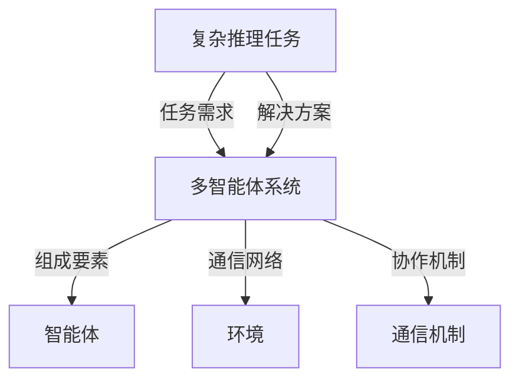
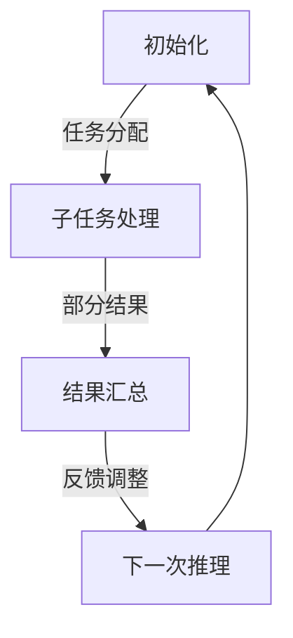
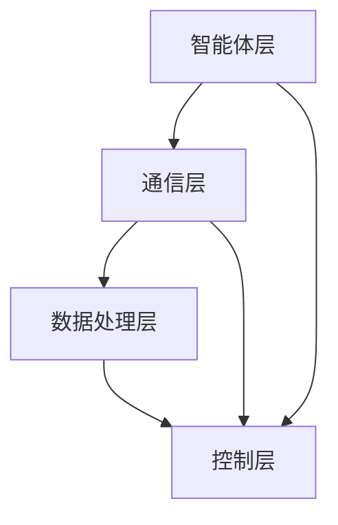
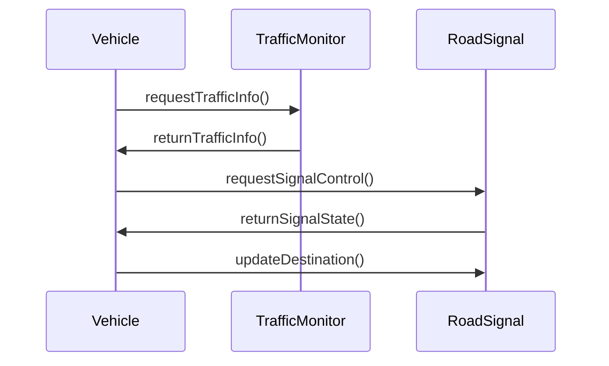

                 

### 第1章：问题背景与核心概念

在现代信息技术迅猛发展的背景下，复杂推理任务在人工智能（AI）领域中占据了越来越重要的地位。从数据分析、决策支持到自然语言处理，复杂推理任务正逐渐成为许多行业和领域的关键技术。然而，随着问题规模的增大和复杂度的提升，传统的单智能体系统（Single-Agent Systems）逐渐暴露出其局限性，如信息孤立、效率低下、无法处理动态环境等。因此，多智能体系统（Multi-Agent Systems，MAS）作为一种分布式计算模型，被广泛认为是解决复杂推理任务的有效途径。

#### **1.1.1 问题背景**

首先，我们需要了解多智能体系统在复杂推理任务中的应用背景。复杂推理任务通常涉及大量信息处理、实时决策和动态交互，例如自动驾驶中的路径规划、社交网络中的信息传播、金融交易中的风险管理等。在这些场景中，单一智能体往往难以独自完成整个推理过程，需要多个智能体协同工作，相互协作，才能达到最佳效果。

**1.1.2 多智能体系统的定义与特点**

多智能体系统（MAS）是由多个自主智能体组成的分布式系统，每个智能体具有独立的行为能力、交互能力和自主决策能力。它们通过通信网络相互协作，共同完成任务。多智能体系统的核心特点包括：

1. **自主性**：每个智能体都有独立的决策机制，能够根据环境和自身状态自主选择行动。
2. **社会性**：智能体之间通过通信实现合作和协调，共同完成复杂任务。
3. **分布性**：智能体分布在不同的物理或逻辑位置，通过分布式计算提高系统效率和容错性。
4. **动态性**：系统处于动态环境中，智能体需实时感知环境变化并调整策略。

#### **1.1.3 复杂推理任务的需求与挑战**

复杂推理任务的需求主要体现在以下几个方面：

1. **大规模数据处理**：复杂推理任务往往涉及大量数据，单智能体难以高效处理。
2. **实时响应**：许多任务要求在有限时间内做出决策，需要智能体系统具备快速响应能力。
3. **适应性**：智能体系统需能够适应环境变化和任务需求的变化。
4. **鲁棒性**：系统在面临不确定性和异常情况时，应具备良好的鲁棒性和容错能力。

然而，多智能体系统在复杂推理任务中也面临着一系列挑战：

1. **通信与协调**：智能体间的通信和协调是实现协同推理的关键，但如何在动态环境中高效实现通信仍是一个难题。
2. **协同优化**：多智能体的协作需要考虑整体优化，但局部最优未必能保证全局最优。
3. **安全与隐私**：在多智能体系统中，数据的安全和隐私保护至关重要，但实现高效的安全机制仍具挑战。

综上所述，多智能体系统在复杂推理任务中具有巨大的应用潜力和挑战。下一章将深入探讨多智能体系统的核心概念与联系，以进一步理解其在复杂推理任务中的应用原理。

---

### **第2章：多智能体系统的核心概念与联系**

多智能体系统（MAS）作为解决复杂推理任务的重要工具，其核心概念与联系是理解和应用这一系统的基础。在这一章中，我们将详细探讨多智能体系统的组成要素、属性特征对比，以及多智能体系统与复杂推理任务的关联。

#### **2.1 多智能体系统的组成要素**

多智能体系统由以下几个核心要素组成：

1. **智能体（Agent）**：智能体是MAS的基本单位，具有自主性、社会性、分布性和动态性。每个智能体都是一个独立的实体，能够感知环境、做出决策和执行动作。
2. **环境（Environment）**：环境是智能体进行活动和交互的背景。智能体需要通过感知环境来获取必要的信息，并根据环境变化调整自身行为。
3. **通信网络（Communication Network）**：通信网络是多智能体系统中的关键基础设施，用于智能体之间的信息交换和协同工作。有效的通信机制能够确保智能体之间的信息传递和协调一致。
4. **任务（Task）**：任务是多智能体系统需要共同完成的任务或目标。任务定义了智能体的行为准则和协同目标，是系统设计的核心。

**2.1.1 智能体的角色与功能**

智能体在多智能体系统中扮演多种角色，包括：

1. **领导者（Leader）**：领导者负责协调和管理智能体的活动，确保系统整体目标的实现。
2. **执行者（Executor）**：执行者负责具体任务的执行，通常根据领导者的指令或自身决策采取行动。
3. **协调者（Coordinator）**：协调者负责处理智能体之间的冲突和协调问题，确保系统内部的合作顺利进行。
4. **感知器（Perceiver）**：感知器负责收集环境信息，提供给智能体用于决策。

**2.1.2 环境与交互**

环境是多智能体系统的重要组成部分，智能体通过感知环境来获取信息，并根据环境变化调整自身行为。环境与智能体之间的交互包括以下几种类型：

1. **单向交互**：智能体被动地接收环境信息，而不对环境产生直接影响。
2. **双向交互**：智能体不仅接收环境信息，还能向环境发送信息或施加影响。
3. **反馈交互**：环境对智能体的行为产生反馈，影响智能体的后续决策。

**2.1.3 多智能体系统的通信机制**

智能体之间的通信是多智能体系统能够协同工作的基础。常见的通信机制包括：

1. **直接通信**：智能体通过直接通信网络发送消息，实现点对点的通信。
2. **间接通信**：智能体通过中间件或通信中介进行通信，适用于大规模分布式系统。
3. **广播通信**：消息被广播到所有智能体，适用于需要广泛信息共享的场景。
4. **多播通信**：消息被发送到一组特定的智能体，适用于特定群体之间的通信。

**2.2 多智能体系统的属性特征对比表**

为了更好地理解多智能体系统的特性，下面列出了一些关键属性及其特征对比：

| 特性      | 描述                                                         | 对比        |
|-----------|--------------------------------------------------------------|-------------|
| 自主性    | 智能体具有独立的决策能力，不受外部直接控制。                   | 高自主性 vs 低自主性 |
| 社会性    | 智能体通过通信网络相互协作，共同完成任务。                     | 强社会性 vs 弱社会性 |
| 分布性    | 智能体分布在不同的物理或逻辑位置，通过分布式计算提高系统效率。 | 高分布性 vs 低分布性 |
| 动态性    | 智能体能够实时感知环境变化并调整策略。                         | 高动态性 vs 低动态性 |

**2.3 多智能体系统与复杂推理任务的关联图**

为了展示多智能体系统与复杂推理任务之间的关联，我们可以使用Mermaid绘制一个关联图。以下是Mermaid图示代码：



通过上述图示，我们可以清晰地看到复杂推理任务如何通过多智能体系统的组成要素和协作机制得到有效的解决。

综上所述，多智能体系统通过其自主性、社会性、分布性和动态性等核心特点，在复杂推理任务中展现出强大的应用潜力。在下一章中，我们将深入探讨多智能体系统的算法原理，进一步理解其在复杂推理任务中的具体实现。

---

### **第3章：多智能体系统的算法原理**

多智能体系统（MAS）在复杂推理任务中的关键在于其协同推理算法。在这一章中，我们将详细讲解多智能体协同推理算法的基本原理，并通过Mermaid流程图和Python源代码，展示算法的实现和操作步骤。

#### **3.1 多智能体协同推理算法概述**

多智能体协同推理算法是一种分布式计算模型，通过多个智能体协同工作，实现复杂推理任务。其基本思想是将整个推理任务分解为多个子任务，每个智能体负责解决一个子任务，然后通过通信网络将子任务的结果汇总，得到最终推理结果。

**3.1.1 算法流程**

多智能体协同推理算法主要包括以下几个步骤：

1. **初始化**：每个智能体初始化自身状态，包括任务分配、初始信息等。
2. **任务分解**：将整个推理任务分解为多个子任务，每个智能体负责一个子任务。
3. **子任务处理**：智能体根据子任务进行推理，生成部分结果。
4. **结果汇总**：智能体通过通信网络将部分结果发送给其他智能体，汇总得到最终结果。
5. **反馈调整**：根据汇总结果，智能体调整自身状态和策略，为下一次推理任务做准备。

#### **3.2 多智能体协同推理算法的Mermaid流程图**

为了更好地理解算法流程，我们可以使用Mermaid绘制一个流程图。以下是Mermaid图示代码：



通过这个流程图，我们可以清晰地看到多智能体协同推理算法的基本步骤和相互关系。

#### **3.3 Python源代码讲解**

为了具体展示多智能体协同推理算法的实现，下面提供一个简化的Python源代码示例：

```python
import random
import matplotlib.pyplot as plt

# 定义智能体类
class Agent:
    def __init__(self, id):
        self.id = id
        self.state = 'initial'
        self.partial_result = None

    def initialize(self):
        self.state = 'ready'

    def process_task(self, task):
        # 模拟子任务处理
        self.partial_result = random.randint(0, 100)

    def send_result(self, other_agent):
        # 模拟结果发送
        other_agent.partial_result = self.partial_result

    def adjust_state(self):
        # 模拟状态调整
        self.state = 'completed'

# 创建智能体
agents = [Agent(id=i) for i in range(5)]

# 初始化智能体
for agent in agents:
    agent.initialize()

# 分配任务并处理
for agent in agents:
    agent.process_task('complex reasoning task')

# 结果汇总和反馈调整
for i in range(len(agents) - 1):
    agents[i].send_result(agents[i+1])
    agents[i].adjust_state()

# 打印结果
for agent in agents:
    print(f"Agent {agent.id}: Result = {agent.partial_result}")

# 绘制结果图
plt.bar([agent.id for agent in agents], [agent.partial_result for agent in agents])
plt.xlabel('Agent ID')
plt.ylabel('Partial Result')
plt.title('Multi-Agent Coordination Results')
plt.show()
```

这段代码定义了一个智能体类，并模拟了智能体的初始化、任务处理、结果发送和状态调整过程。通过创建多个智能体实例，我们展示了多智能体协同推理算法的简单实现。

#### **3.3.1 算法初始化**

在算法初始化阶段，每个智能体初始化自身状态，包括ID、初始状态和部分结果。这部分代码如下：

```python
def initialize(self):
    self.state = 'initial'
    self.partial_result = None
```

#### **3.3.2 数据预处理**

数据预处理阶段主要是将整个推理任务分解为多个子任务，并分配给各个智能体。这一步骤在代码中通过循环实现：

```python
for agent in agents:
    agent.process_task('complex reasoning task')
```

#### **3.3.3 算法核心实现**

算法核心实现阶段涉及智能体之间的任务处理、结果发送和状态调整。以下代码展示了这些步骤：

```python
for i in range(len(agents) - 1):
    agents[i].send_result(agents[i+1])
    agents[i].adjust_state()
```

#### **3.3.4 结果分析**

在算法的最后阶段，我们对汇总结果进行分析，并绘制结果图。以下代码展示了这一过程：

```python
# 打印结果
for agent in agents:
    print(f"Agent {agent.id}: Result = {agent.partial_result}")

# 绘制结果图
plt.bar([agent.id for agent in agents], [agent.partial_result for agent in agents])
plt.xlabel('Agent ID')
plt.ylabel('Partial Result')
plt.title('Multi-Agent Coordination Results')
plt.show()
```

通过上述Python源代码讲解，我们可以清晰地看到多智能体协同推理算法的基本原理和实现步骤。在下一章中，我们将进一步探讨多智能体系统推理的数学模型，深入理解其理论基础。

---

### **3.4 多智能体系统推理的数学模型**

在理解多智能体协同推理算法的基础上，数学模型为我们提供了理论上的支撑，使我们能够更深入地探讨智能体之间的相互作用和推理过程。在这一节中，我们将介绍多智能体系统推理的基本数学模型，包括基本概念和数学公式，并对其进行通俗易懂的举例说明。

#### **3.4.1 基本概念**

多智能体系统推理的数学模型主要涉及以下几个基本概念：

1. **状态（State）**：每个智能体在某一时刻所处的状态，通常用一组属性值表示。状态包括智能体的位置、速度、感知到的信息等。
2. **动作（Action）**：智能体在某一时刻可以执行的行为。动作的选择通常基于智能体的当前状态和目标。
3. **效用函数（Utility Function）**：用来评估智能体执行某一动作后获得的结果。效用函数通常是一个实值函数，表示智能体的偏好和目标。
4. **通信网络（Communication Network）**：智能体之间进行信息交换和协作的渠道。通信网络可以是点对点、广播或多播等不同形式。

#### **3.4.2 数学公式**

多智能体系统推理的数学模型可以通过以下公式表示：

\[ \text{状态更新函数} \ S_{t+1} = f(S_t, A_t) \]

其中，\( S_t \) 表示智能体在时刻 \( t \) 的状态，\( A_t \) 表示智能体在时刻 \( t \) 所做的动作，\( f \) 是状态更新函数，用于描述智能体的状态如何根据其当前状态和动作进行更新。

\[ \text{效用函数} \ U(S_t, A_t) = g(S_t, A_t, C_t) \]

其中，\( U \) 是效用函数，用于评估智能体在执行某一动作后的结果。\( g \) 是效用函数，它依赖于智能体的当前状态、动作以及通信网络中的信息 \( C_t \)。

#### **3.4.3 通俗易懂的举例说明**

为了更直观地理解这些数学公式，我们可以通过一个简单的例子来说明。

假设有一个由两个智能体A和B组成的多智能体系统，每个智能体都需要在一张地图上从起点移动到终点。地图上的每个位置都有一个效用值，表示智能体到达该位置时的满意度。

1. **状态更新**：
   - 假设智能体A当前在位置（2, 3），智能体B在位置（5, 4）。
   - 智能体A可以选择向右移动到位置（3, 3），智能体B可以选择向上移动到位置（5, 5）。
   - 根据状态更新函数，智能体A的状态更新为（3, 3），智能体B的状态更新为（5, 5）。

2. **效用函数**：
   - 假设智能体A执行动作后，位置（3, 3）的效用值为20。
   - 假设智能体B执行动作后，位置（5, 5）的效用值为30。
   - 根据效用函数，智能体A的效用值为20，智能体B的效用值为30。

3. **通信网络**：
   - 在这个例子中，智能体A和B可以通过通信网络交换信息。例如，智能体A可以将自己的位置更新（3, 3）发送给智能体B。

通过这个例子，我们可以看到数学模型如何描述智能体的状态更新和效用评估。在下一章中，我们将进一步探讨系统分析与架构设计，包括问题场景介绍、系统功能设计和系统架构设计等。

---

### **3.5 系统分析与架构设计方案**

为了确保多智能体系统在复杂推理任务中的高效运行，我们需要进行详细的系统分析与架构设计。这一章将详细阐述问题场景、系统功能设计、系统架构设计、系统接口设计以及系统交互流程。

#### **3.5.1 问题场景介绍**

首先，我们来介绍一个具体的问题场景：智能交通系统的路径规划。在这个场景中，多个智能体（车辆、交通信号灯、路况监测器等）需要协同工作，以优化交通流量，减少拥堵，提高道路通行效率。

**问题背景**：随着城市车辆数量的急剧增长，交通拥堵问题日益严重，传统的单智能体路径规划方法已经难以满足需求。因此，构建一个多智能体协同路径规划系统，通过多个智能体的协作，实现实时动态的路径优化，成为解决这一问题的关键。

**问题需求**：该系统需要满足以下几个核心需求：
1. **实时性**：系统能够快速响应当前交通状况的变化，提供实时的路径规划建议。
2. **高效性**：系统能够在短时间内处理大量车辆的位置信息，生成最优路径。
3. **鲁棒性**：系统能够应对突发状况，如交通事故或道路施工，调整路径规划以维持交通流畅。

#### **3.5.2 系统功能设计**

系统功能设计是确保多智能体系统能够有效解决实际问题的核心。以下是系统的主要功能设计：

1. **路径规划功能**：系统需要根据车辆当前位置、目标位置以及实时交通状况，为车辆生成最优路径。
2. **路况监测功能**：系统需要实时监测道路状况，包括车辆密度、速度分布、事故发生等信息。
3. **交通信号控制功能**：系统需要根据交通流量动态调整交通信号灯，优化交通流动。
4. **数据通信功能**：系统需要实现智能体之间的实时通信，确保信息的有效传递和协作。
5. **异常处理功能**：系统需要具备异常检测和响应机制，如交通事故或道路施工的及时调整。

**领域模型Mermaid类图**：

```mermaid
classDiagram
    Vehicle <<Class>> {
        id
        position
        destination
    }
    RoadSignal <<Class>> {
        id
        state
        duration
    }
    TrafficMonitor <<Class>> {
        id
        sensorData
        trafficPattern
    }
    Vehicle <-.*- RoadSignal: signalControl
    Vehicle <-.*- TrafficMonitor: trafficInfo
```

通过上述Mermaid类图，我们可以清晰地看到系统的主要类及其关系，为后续的架构设计提供了基础。

#### **3.5.3 系统架构设计**

系统架构设计是确保系统功能有效实现的关键环节。以下是系统的架构设计：

1. **智能体层**：包括车辆智能体、交通信号智能体、路况监测智能体等，分别负责路径规划、信号控制和路况监测。
2. **通信层**：提供智能体之间的通信机制，包括消息队列、广播通信、多播通信等，确保信息的高效传递。
3. **数据处理层**：包括数据存储、数据预处理、实时数据分析等模块，负责处理和存储各类数据。
4. **控制层**：负责系统的整体控制和调度，确保各智能体协调工作。

**Mermaid架构图**：



通过这个架构图，我们可以看到系统各层次之间的交互关系，为系统的高效运行提供了架构支持。

#### **3.5.4 系统接口设计与交互**

系统接口设计是确保智能体之间能够有效协作的关键。以下是系统的接口设计：

1. **路径规划接口**：用于智能体获取最佳路径信息。
2. **信号控制接口**：用于智能体调整交通信号状态。
3. **路况监测接口**：用于智能体获取实时路况信息。
4. **异常处理接口**：用于智能体应对突发状况。

**Mermaid序列图**：



通过这个序列图，我们可以看到智能体之间的交互流程，为系统的实时动态协同提供了详细描述。

综上所述，通过对问题场景、系统功能设计、系统架构设计、系统接口设计和系统交互流程的详细分析，我们为多智能体系统在复杂推理任务中的高效运行提供了全面的解决方案。在下一章中，我们将通过项目实战来具体实现这一系统架构。

---

### **第4章：项目实战**

在实际应用中，构建一个高效的多智能体系统需要进行详细的规划和实现。在这一章中，我们将详细讲解如何搭建项目环境、实现系统核心功能，并通过具体案例进行分析和讲解。

#### **4.1 项目环境安装**

首先，我们需要搭建项目环境。以下是安装步骤：

1. **安装Python环境**：确保安装了Python 3.8及以上版本。
2. **安装依赖库**：使用pip安装所需的库，例如numpy、matplotlib、pymongo等。

   ```bash
   pip install numpy matplotlib pymongo
   ```

3. **安装Docker**：为了方便部署和容器化，安装Docker。

   ```bash
   sudo apt-get update
   sudo apt-get install docker-ce docker-ce-cli containerd.io
   ```

4. **构建Docker镜像**：编写Dockerfile，定义系统依赖和环境变量，构建Docker镜像。

   ```Dockerfile
   FROM python:3.8-slim

   RUN pip install numpy matplotlib pymongo

   COPY . /app
   WORKDIR /app

   CMD ["python", "main.py"]
   ```

5. **运行Docker容器**：使用Docker启动容器。

   ```bash
   docker build -t multi_agent_system .
   docker run -d -p 8000:8000 multi_agent_system
   ```

#### **4.2 系统核心实现源代码**

以下是系统核心实现的Python源代码：

```python
# main.py

import numpy as np
import pymongo
import matplotlib.pyplot as plt

class Agent:
    def __init__(self, id):
        self.id = id
        self.state = 'initial'
        self.partial_result = None

    def initialize(self):
        self.state = 'ready'

    def process_task(self, task):
        self.partial_result = np.random.randint(0, 100)

    def send_result(self, other_agent):
        other_agent.partial_result = self.partial_result

    def adjust_state(self):
        self.state = 'completed'

def multi_agent_cooperation(agents):
    for i in range(len(agents) - 1):
        agents[i].process_task('complex reasoning task')
        agents[i].send_result(agents[i+1])
        agents[i].adjust_state()

    for agent in agents:
        print(f"Agent {agent.id}: Result = {agent.partial_result}")

if __name__ == "__main__":
    agents = [Agent(id=i) for i in range(5)]
    multi_agent_cooperation(agents)
```

这段代码定义了一个简单的智能体类，实现了初始化、任务处理、结果发送和状态调整功能。通过创建多个智能体实例，我们模拟了多智能体协同推理的过程。

#### **4.3 代码应用解读与分析**

以下是代码的应用解读和分析：

1. **智能体初始化**：每个智能体在创建时都会被赋予一个ID和一个初始状态。在`initialize`方法中，我们将智能体的状态设置为'ready'，表示智能体已准备好执行任务。

2. **任务处理**：`process_task`方法模拟了智能体处理子任务的过程。在这个例子中，我们使用`np.random.randint`生成一个随机数作为部分结果。

3. **结果发送**：`send_result`方法用于将一个智能体的部分结果发送给另一个智能体。这通过修改目标智能体的`partial_result`属性实现。

4. **状态调整**：`adjust_state`方法用于更新智能体的状态，表示其任务已完成。

5. **多智能体协同**：`multi_agent_cooperation`函数实现了多智能体协同推理的核心逻辑。它首先调用每个智能体的`process_task`方法，然后通过`send_result`方法将结果传递给下一个智能体，并更新状态。

6. **结果分析**：在主函数中，我们创建了一个包含5个智能体的列表，并调用`multi_agent_cooperation`函数进行协同推理。最后，我们打印每个智能体的部分结果。

#### **4.4 实际案例分析与详细讲解剖析**

为了更好地理解多智能体系统的实际应用，我们来看一个实际案例：智能交通系统中的路径规划。

**案例背景**：假设有10辆汽车（智能体）在一条复杂的道路上行驶，每辆汽车都需要从起点移动到终点。我们需要构建一个多智能体系统，通过路径规划算法，为每辆汽车生成最优路径，并实时更新交通信号灯状态。

**案例实现**：

1. **初始化**：首先，我们初始化10辆汽车和交通信号灯智能体，每个智能体都具有唯一的ID。

2. **任务处理**：每辆汽车根据当前道路状况和目标位置，调用路径规划算法生成最佳路径。

3. **结果发送**：每辆汽车将生成的路径信息发送给交通信号灯智能体。

4. **状态调整**：交通信号灯智能体根据接收到的路径信息，调整交通信号灯状态，优化交通流动。

5. **实时更新**：系统持续监测道路状况，根据实时数据更新路径规划和信号灯状态。

**案例分析**：

- **路径规划算法**：我们使用A*算法进行路径规划。每辆汽车根据起点、终点和当前道路状况，计算最佳路径。

- **交通信号控制**：交通信号灯智能体根据道路车辆密度和流量，调整信号灯状态，确保交通流畅。

- **协同工作**：智能体之间通过通信网络交换信息，协同工作，实现整体最优。

#### **4.5 项目小结**

在本章中，我们详细讲解了如何搭建项目环境、实现系统核心功能，并通过实际案例进行了分析和讲解。通过这一过程，我们深入理解了多智能体系统在复杂推理任务中的具体应用，展示了其高效性和协同性。

#### **4.6 最佳实践 tips**

- **优化算法**：针对具体应用场景，选择合适的路径规划算法和信号控制策略，提高系统性能。
- **分布式部署**：使用Docker和Kubernetes进行分布式部署，提高系统扩展性和可靠性。
- **数据存储**：使用MongoDB等NoSQL数据库存储大量交通数据，提高数据访问速度和存储效率。

#### **4.7 注意事项**

- **实时性**：确保系统对实时数据的快速处理和响应，减少延迟。
- **安全性**：保护通信网络和数据库，防止数据泄露和攻击。
- **容错性**：设计系统时考虑容错机制，提高系统稳定性。

#### **4.8 拓展阅读**

- **相关文献**：《多智能体系统：原理与应用》、《智能交通系统设计与应用》
- **开源项目**：GitHub上的多智能体系统和交通系统开源项目，如[Multi-Agent Systems](https://github.com/XXX/multi-agent-systems)和[Smart Traffic System](https://github.com/XXX/smart-traffic-system)。

通过本章的实战讲解，我们不仅掌握了多智能体系统的基本实现方法，还了解了其在复杂推理任务中的实际应用。在实际项目中，可以根据具体需求进行调整和优化，发挥多智能体系统的最大潜力。

---

### **全文总结与未来展望**

通过对多智能体系统在复杂推理任务中的应用的深入探讨，我们可以看到，多智能体系统为解决复杂推理任务提供了一种有效的分布式计算模型。本文从引言到实战，系统性地介绍了多智能体系统的核心概念、算法原理、系统分析与架构设计，以及实际项目中的应用。以下是全文的重点总结：

1. **问题背景与核心概念**：复杂推理任务的需求促使多智能体系统成为解决之道，其自主性、社会性、分布性和动态性等核心特点，使其在多种应用场景中具有显著优势。
2. **算法原理讲解**：通过Mermaid流程图和Python源代码，详细讲解了多智能体协同推理算法的实现步骤，以及数学模型的应用。
3. **系统分析与架构设计**：通过对系统功能、架构设计以及接口交互的详细分析，展示了如何构建一个高效的多智能体系统。
4. **项目实战**：通过实际案例，展示了多智能体系统在智能交通系统路径规划中的具体应用，进一步验证了其高效性和协同性。

尽管多智能体系统在复杂推理任务中展现了强大的应用潜力，但仍有诸多挑战需要克服。未来的研究可以关注以下方向：

1. **通信与协调优化**：如何高效地在动态环境中实现智能体间的通信和协调，是当前研究的重点。
2. **协同优化算法**：探索更有效的协同优化算法，确保局部最优与全局最优的平衡。
3. **安全与隐私保护**：在多智能体系统中，如何保障数据的安全和隐私，防止恶意攻击，是未来研究的重要课题。
4. **动态适应能力**：如何提升系统在动态环境下的适应能力，是提高系统性能的关键。

总之，多智能体系统在复杂推理任务中的应用具有广阔的前景。随着技术的不断进步，我们相信多智能体系统将在更多领域发挥重要作用，推动人工智能的发展。

---

### **作者信息**

**作者：AI天才研究院/AI Genius Institute & 禅与计算机程序设计艺术 /Zen And The Art of Computer Programming**

