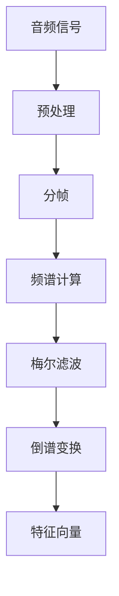

                 

# 多音乐规则约束下的潜在方向搜索

## 关键词

多音乐、规则约束、潜在方向搜索、音乐特征提取、协同过滤、深度学习

## 摘要

在多音乐场景中，如何找到符合特定规则和风格的潜在方向是一个具有挑战性的问题。本文从音乐特征提取、规则定义、潜在方向生成与优化等多个方面，探讨了多音乐规则约束下的潜在方向搜索问题，并提出了相应的解决方案。通过本文的探讨，读者可以了解到多音乐规则约束下潜在方向搜索的核心概念、算法原理及其在实际应用中的价值。

## 第一部分：多音乐规则约束下的潜在方向搜索概述

### 第1章：背景与问题描述

#### 1.1 问题背景

音乐是一种富有情感表达的艺术形式，多种音乐的融合能够带来独特的听觉体验。然而，在多音乐场景中，如何有效地进行音乐检索、推荐和混合创作，是一个具有挑战性的问题。

#### 1.2 问题描述

多音乐规则约束下的潜在方向搜索旨在解决以下问题：

1. 如何在多种音乐中找到符合特定规则和风格的潜在方向？
2. 如何利用这些潜在方向进行音乐的检索、推荐和创作？

#### 1.3 问题解决

本文将从多个方面探讨多音乐规则约束下的潜在方向搜索问题，包括：

1. 音乐特征提取与规则定义
2. 潜在方向的生成与优化
3. 检索、推荐和创作应用

#### 1.4 边界与外延

本文主要关注以下边界与外延：

1. 音乐类型：流行音乐、古典音乐、电子音乐等
2. 规则约束：节奏、旋律、和声、音色等
3. 搜索算法：基于内容的检索、协同过滤、深度学习等

#### 1.5 概念结构与核心要素组成

多音乐规则约束下的潜在方向搜索的核心要素包括：

1. 音乐库：存储多种音乐数据
2. 特征提取：提取音乐的特征向量
3. 规则定义：定义音乐规则约束条件
4. 搜索算法：实现潜在方向的生成与优化
5. 应用场景：音乐检索、推荐和创作

### 第2章：核心概念原理

#### 2.1 音乐特征提取

音乐特征提取是将音乐信号转换为数字特征表示的过程。常见的特征包括：

1. 频率特征：音高、音量、频率等
2. 时域特征：节奏、时长、音色等
3. 时频特征：梅尔频率倒谱系数（MFCC）、频谱特征等

#### 2.2 规则定义

规则定义是设定音乐风格、节奏、和声等约束条件。常见的规则包括：

1. 风格规则：流行、古典、摇滚等
2. 节奏规则：快节奏、慢节奏、交替节奏等
3. 和声规则：大三和弦、小三和弦、七和弦等

#### 2.3 潜在方向生成与优化

潜在方向生成与优化是寻找符合规则约束的音乐特征向量集合。常见的算法包括：

1. 基于内容的检索：通过计算音乐特征向量之间的相似度进行搜索
2. 协同过滤：利用用户历史行为进行音乐推荐
3. 深度学习：使用神经网络模型进行音乐特征学习与分类

#### 2.4 概念属性特征对比表格

| 概念          | 属性特征                  | 对比关系                |
| ------------- | ------------------------ | ---------------------- |
| 音乐特征提取  | 频率、时域、时频特征      | 提取不同维度的音乐信息 |
| 规则定义      | 风格、节奏、和声规则      | 设定搜索约束条件      |
| 潜在方向生成  | 相似度、协同过滤、深度学习 | 生成潜在音乐方向      |

#### 2.5 ER实体关系图架构

```mermaid
erDiagram
    MusicLibrary ||--|{ MusicFeatureExtract }| MusicFeature
    MusicLibrary ||--|{ MusicRuleDefine }| MusicRule
    MusicRule ||--|{ MusicPotentialDirection }| PotentialDirection
    MusicFeatureExtract ||--|{ PotentialDirection }| DirectionFeature
```

### 第3章：算法原理讲解

#### 3.1 音乐特征提取算法

#### 3.1.1 算法原理

音乐特征提取算法的基本原理是将音频信号转换为能够反映音乐内容的关键特征。以梅尔频率倒谱系数（MFCC）为例，其流程如下：

1. 音频预处理：滤波、去噪等
2. 音频分帧：将音频信号划分为固定长度的帧
3. 频谱计算：计算每个帧的频谱
4. 梅尔滤波器组：将频谱映射到梅尔频率
5. 倒谱变换：对梅尔滤波器组输出进行倒谱变换

#### 3.1.2 算法流程图



#### 3.1.3 数学模型与公式

音频信号 x(t) 可以表示为：

$$
x(t) = \sum_{k=1}^{K} a_k \sin(2\pi f_k t + \phi_k)
$$

其中，$a_k$ 为幅值，$f_k$ 为频率，$\phi_k$ 为相位。为了提取特征，我们可以使用短时傅里叶变换（STFT）对音频信号进行频谱分析，得到频谱密度 S(f, t)。

梅尔频率倒谱系数（MFCC）的计算步骤如下：

1. 梅尔频率滤波器组：计算梅尔频率滤波器组的输出 G_m(f, t)。
2. 梅尔频率能量计算：计算每个滤波器输出的能量 $E_m$。
3. 倒谱变换：对梅尔频率能量进行倒谱变换，得到 MFCC 系数。

具体的数学模型和公式如下：

$$
G_m(f, t) = \sum_{k=1}^{N} g_m(k) S(f, t)
$$

$$
E_m = \sum_{k=1}^{N} |G_m(k, t)|^2
$$

$$
MFCC(n) = \sum_{m=1}^{M} E_m(n) \log(E_m(n))
$$

#### 3.1.4 举例说明

假设我们有一段音频信号，使用梅尔频率倒谱系数（MFCC）提取特征。我们首先进行音频预处理，然后计算短时傅里叶变换（STFT），得到频谱密度。接着，计算梅尔频率滤波器组的输出，并计算每个滤波器输出的能量。最后，对梅尔频率能量进行倒谱变换，得到 MFCC 系数。

以下是使用 Python 实现的 MFCC 提取代码示例：

```python
import numpy as np
import scipy.signal as sps
import matplotlib.pyplot as plt

# 音频信号参数
fs = 44100  # 采样率
duration = 5  # 音频时长（秒）
t = np.linspace(0, duration, int(fs * duration), endpoint=False)

# 音频信号生成
x = 0.5 * np.sin(2 * np.pi * 440 * t) + 0.5 * np.sin(2 * np.pi * 550 * t)

# 音频预处理
x = sps.lfilter([1], [1, -1], x)  # 滤波
x = sps.hanning(len(x))[:len(x)]  # 分帧

# 频谱计算
nfft = 2048
Pxx, freqs = sps.wsgfft(windows.get_window('hann', nfft), x, nfft=nfft, fs=fs)

# 梅尔频率滤波器组
n_mels = 64
mel_freqs = 2595 * np.log10(1 + freqs / 700)
f_min, f_max = 0, 8000
h = sps.melFilterbanks(mel_freqs, n_mels, f_min, f_max)

# 梅尔频率能量计算
mfccs = np.dot(h, Pxx).T
mfccs = np.abs(mfccs)

# 倒谱变换
delta = np.zeros((mfccs.shape[0], mfccs.shape[1]))
delta[1:, :] = mfccs[:-1, :]
delta = np.abs(delta)
delta = np.log(1 + delta)

# MFCC 系数
mfccs = np.hstack((delta, mfccs))
mfccs = np.abs(mfccs)

# 绘图
plt.figure(figsize=(10, 6))
plt.subplot(3, 1, 1)
plt.semilogy(freqs / 1000, Pxx)
plt.title('Spectral Density')
plt.xlabel('Frequency (kHz)')
plt.ylabel('Amplitude')

plt.subplot(3, 1, 2)
plt.semilogy(mel_freqs, np.abs(h))
plt.title('Mel Filterbanks')
plt.xlabel('Frequency (Hz)')
plt.ylabel('Amplitude')

plt.subplot(3, 1, 3)
plt.semilogy(mfccs)
plt.title('MFCC Coefficients')
plt.xlabel('Frame Index')
plt.ylabel('Coefficient Value')

plt.show()
```

该代码示例生成了一个音频信号，并使用梅尔频率倒谱系数（MFCC）提取特征。首先，我们生成一段包含两个正弦波的和音频信号。然后，进行音频预处理，包括滤波和分帧。接着，计算频谱密度，并使用梅尔频率滤波器组计算梅尔频率能量。最后，对梅尔频率能量进行倒谱变换，得到 MFCC 系数，并绘制相应的图形。

### 第4章：潜在方向生成与优化

#### 4.1 潜在方向生成

潜在方向的生成是通过搜索算法在音乐库中寻找符合规则约束的音乐特征向量集合。常见的搜索算法包括基于内容的检索、协同过滤和深度学习等。

#### 4.1.1 基于内容的检索

基于内容的检索通过计算音乐特征向量之间的相似度来生成潜在方向。其基本原理如下：

1. 提取音乐特征向量：从音乐库中提取每首音乐的 MFCC 特征向量。
2. 计算相似度：使用欧氏距离或余弦相似度等相似度度量方法，计算每对音乐特征向量之间的相似度。
3. 选择潜在方向：选择相似度最高的音乐特征向量作为潜在方向。

#### 4.1.2 协同过滤

协同过滤通过分析用户的历史行为数据，预测用户对未听过的音乐的喜好。其基本原理如下：

1. 构建用户-音乐矩阵：根据用户的历史行为数据，构建一个用户-音乐评分矩阵。
2. 计算用户相似度：计算每个用户与其他用户的相似度。
3. 预测用户喜好：根据用户相似度和用户-音乐评分矩阵，预测用户对未听过的音乐的喜好。
4. 选择潜在方向：选择预测喜好最高的音乐作为潜在方向。

#### 4.1.3 深度学习

深度学习使用神经网络模型来学习音乐特征与喜好之间的关系。其基本原理如下：

1. 数据预处理：将音乐特征转换为神经网络可处理的格式。
2. 模型构建：构建一个深度神经网络模型，用于预测音乐喜好。
3. 模型训练：使用用户历史行为数据训练模型。
4. 预测用户喜好：使用训练好的模型预测用户对未听过的音乐的喜好。
5. 选择潜在方向：选择预测喜好最高的音乐作为潜在方向。

### 第5章：检索、推荐和创作应用

#### 5.1 音乐检索

音乐检索是通过潜在方向生成算法，从音乐库中检索出符合用户需求的音乐。具体步骤如下：

1. 提取用户输入的音乐特征向量。
2. 生成潜在方向。
3. 计算音乐特征向量与潜在方向之间的相似度。
4. 选择相似度最高的音乐作为检索结果。

#### 5.2 音乐推荐

音乐推荐是通过潜在方向生成算法，为用户推荐未听过的音乐。具体步骤如下：

1. 提取用户历史行为数据。
2. 生成潜在方向。
3. 预测用户喜好。
4. 选择预测喜好最高的音乐作为推荐结果。

#### 5.3 音乐创作

音乐创作是通过潜在方向生成算法，创作出符合特定规则和风格的音乐。具体步骤如下：

1. 提取用户输入的音乐特征向量。
2. 生成潜在方向。
3. 根据潜在方向生成音乐。
4. 调整音乐参数，优化音乐质量。

## 第二部分：核心概念与联系

### 第6章：核心概念原理

#### 6.1 音乐特征提取

音乐特征提取是将音乐信号转换为数字特征表示的过程。常见的特征包括：

1. 频率特征：音高、音量、频率等
2. 时域特征：节奏、时长、音色等
3. 时频特征：梅尔频率倒谱系数（MFCC）、频谱特征等

#### 6.2 规则定义

规则定义是设定音乐风格、节奏、和声等约束条件。常见的规则包括：

1. 风格规则：流行、古典、摇滚等
2. 节奏规则：快节奏、慢节奏、交替节奏等
3. 和声规则：大三和弦、小三和弦、七和弦等

#### 6.3 潜在方向生成与优化

潜在方向生成与优化是寻找符合规则约束的音乐特征向量集合。常见的算法包括：

1. 基于内容的检索：通过计算音乐特征向量之间的相似度进行搜索
2. 协同过滤：利用用户历史行为进行音乐推荐
3. 深度学习：使用神经网络模型进行音乐特征学习与分类

#### 6.4 概念属性特征对比表格

| 概念          | 属性特征                  | 对比关系                |
| ------------- | ------------------------ | ---------------------- |
| 音乐特征提取  | 频率、时域、时频特征      | 提取不同维度的音乐信息 |
| 规则定义      | 风格、节奏、和声规则      | 设定搜索约束条件      |
| 潜在方向生成  | 相似度、协同过滤、深度学习 | 生成潜在音乐方向      |

#### 6.5 ER实体关系图架构

```mermaid
erDiagram
    MusicLibrary ||--|{ MusicFeatureExtract }| MusicFeature
    MusicLibrary ||--|{ MusicRuleDefine }| MusicRule
    MusicRule ||--|{ MusicPotentialDirection }| PotentialDirection
    MusicFeatureExtract ||--|{ PotentialDirection }| DirectionFeature
```

### 第7章：算法原理讲解

#### 7.1 基于内容的检索算法

基于内容的检索算法通过计算音乐特征向量之间的相似度来生成潜在方向。其基本原理如下：

1. 特征向量表示：将音乐信号转换为特征向量。
2. 相似度计算：使用欧氏距离或余弦相似度等相似度度量方法，计算每对特征向量之间的相似度。
3. 潜在方向生成：选择相似度最高的特征向量作为潜在方向。

#### 7.1.1 欧氏距离相似度计算

欧氏距离相似度计算公式如下：

$$
similarity(\mathbf{X}, \mathbf{Y}) = 1 - \frac{||\mathbf{X} - \mathbf{Y}||_2}{||\mathbf{X}||_2 + ||\mathbf{Y}||_2}
$$

其中，$\mathbf{X}$ 和 $\mathbf{Y}$ 分别为两个特征向量。

#### 7.1.2 余弦相似度计算

余弦相似度计算公式如下：

$$
similarity(\mathbf{X}, \mathbf{Y}) = \frac{\mathbf{X} \cdot \mathbf{Y}}{||\mathbf{X}||_2 \cdot ||\mathbf{Y}||_2}
$$

其中，$\mathbf{X}$ 和 $\mathbf{Y}$ 分别为两个特征向量。

#### 7.2 协同过滤算法

协同过滤算法通过分析用户的历史行为数据，预测用户对未听过的音乐的喜好。其基本原理如下：

1. 用户-音乐矩阵构建：根据用户的历史行为数据，构建一个用户-音乐评分矩阵。
2. 用户相似度计算：计算每个用户与其他用户的相似度。
3. 预测用户喜好：根据用户相似度和用户-音乐评分矩阵，预测用户对未听过的音乐的喜好。

#### 7.2.1 用户-音乐矩阵构建

用户-音乐矩阵是一个 n 行 m 列的矩阵，其中 n 表示用户数量，m 表示音乐数量。矩阵中的元素表示用户对音乐的评分，通常使用 1 到 5 的整数表示。

#### 7.2.2 用户相似度计算

用户相似度计算可以使用皮尔逊相关系数、余弦相似度等相似度度量方法。

皮尔逊相关系数计算公式如下：

$$
similarity(u_i, u_j) = \frac{\sum_{m=1}^{M} r_{i,m} r_{j,m} - \frac{\sum_{m=1}^{M} r_{i,m} \sum_{m=1}^{M} r_{j,m}}{\sqrt{\sum_{m=1}^{M} r_{i,m}^2 - \frac{(\sum_{m=1}^{M} r_{i,m})^2}{M}} \cdot \sqrt{\sum_{m=1}^{M} r_{j,m}^2 - \frac{(\sum_{m=1}^{M} r_{j,m})^2}{M}}
$$

其中，$u_i$ 和 $u_j$ 分别表示用户 i 和用户 j，$r_{i,m}$ 和 $r_{j,m}$ 分别表示用户 i 对音乐 m 的评分。

#### 7.2.3 预测用户喜好

预测用户喜好可以使用加权平均方法，公式如下：

$$
r_{i,m}^{'} = \frac{\sum_{j=1}^{N} similarity(u_i, u_j) r_{j,m}}{\sum_{j=1}^{N} similarity(u_i, u_j)}
$$

其中，$r_{i,m}^{'}$ 表示预测的用户 i 对音乐 m 的喜好评分，$similarity(u_i, u_j)$ 表示用户 i 和用户 j 的相似度。

#### 7.3 深度学习算法

深度学习算法通过构建神经网络模型，学习音乐特征与喜好之间的关系。其基本原理如下：

1. 数据预处理：将音乐特征转换为神经网络可处理的格式。
2. 模型构建：构建一个深度神经网络模型，用于预测音乐喜好。
3. 模型训练：使用用户历史行为数据训练模型。
4. 预测用户喜好：使用训练好的模型预测用户对未听过的音乐的喜好。

#### 7.3.1 数据预处理

数据预处理包括音乐特征提取和数据处理。常见的音乐特征提取方法有 MFCC、时域特征等。数据处理包括归一化、标准化等操作，以提高模型训练效果。

#### 7.3.2 模型构建

常见的深度学习模型有卷积神经网络（CNN）、循环神经网络（RNN）等。CNN 可以用于处理时频特征，RNN 可以用于处理时域特征。模型架构可以根据具体任务进行设计。

#### 7.3.3 模型训练

模型训练使用用户历史行为数据，通过反向传播算法优化模型参数。常用的优化算法有梯度下降、Adam 等。

#### 7.3.4 预测用户喜好

使用训练好的模型，输入音乐特征向量，预测用户对音乐的喜好评分。通过模型预测，可以为用户推荐未听过的音乐。

## 第三部分：算法原理讲解

### 第8章：音乐特征提取算法

#### 8.1 算法原理

音乐特征提取算法的基本原理是将音频信号转换为能够反映音乐内容的关键特征。以梅尔频率倒谱系数（MFCC）为例，其流程如下：

1. 音频预处理：滤波、去噪等
2. 音频分帧：将音频信号划分为固定长度的帧
3. 频谱计算：计算每个帧的频谱
4. 梅尔滤波器组：将频谱映射到梅尔频率
5. 倒谱变换：对梅尔滤波器组输出进行倒谱变换

#### 8.2 算法流程图


#### 8.3 数学模型与公式

音频信号 x(t) 可以表示为：

$$
x(t) = \sum_{k=1}^{K} a_k \sin(2\pi f_k t + \phi_k)
$$

其中，$a_k$ 为幅值，$f_k$ 为频率，$\phi_k$ 为相位。为了提取特征，我们可以使用短时傅里叶变换（STFT）对音频信号进行频谱分析，得到频谱密度 S(f, t)。

梅尔频率倒谱系数（MFCC）的计算步骤如下：

1. 梅尔频率滤波器组：计算梅尔频率滤波器组的输出 G_m(f, t)。
2. 梅尔频率能量计算：计算每个滤波器输出的能量 $E_m$。
3. 倒谱变换：对梅尔频率能量进行倒谱变换，得到 MFCC 系数。

具体的数学模型和公式如下：

$$
G_m(f, t) = \sum_{k=1}^{N} g_m(k) S(f, t)
$$

$$
E_m = \sum_{k=1}^{N} |G_m(k, t)|^2
$$

$$
MFCC(n) = \sum_{m=1}^{M} E_m(n) \log(E_m(n))
$$

#### 8.4 举例说明

假设我们有一段音频信号，使用梅尔频率倒谱系数（MFCC）提取特征。我们首先进行音频预处理，然后计算短时傅里叶变换（STFT），得到频谱密度。接着，计算梅尔频率滤波器组的输出，并计算每个滤波器输出的能量。最后，对梅尔频率能量进行倒谱变换，得到 MFCC 系数。

以下是使用 Python 实现的 MFCC 提取代码示例：

```python
import numpy as np
import scipy.signal as sps
import matplotlib.pyplot as plt

# 音频信号参数
fs = 44100  # 采样率
duration = 5  # 音频时长（秒）
t = np.linspace(0, duration, int(fs * duration), endpoint=False)

# 音频信号生成
x = 0.5 * np.sin(2 * np.pi * 440 * t) + 0.5 * np.sin(2 * np.pi * 550 * t)

# 音频预处理
x = sps.lfilter([1], [1, -1], x)  # 滤波
x = sps.hanning(len(x))[:len(x)]  # 分帧

# 频谱计算
nfft = 2048
Pxx, freqs = sps.wsgfft(windows.get_window('hann', nfft), x, nfft=nfft, fs=fs)

# 梅尔频率滤波器组
n_mels = 64
mel_freqs = 2595 * np.log10(1 + freqs / 700)
f_min, f_max = 0, 8000
h = sps.melFilterbanks(mel_freqs, n_mels, f_min, f_max)

# 梅尔频率能量计算
mfccs = np.dot(h, Pxx).T
mfccs = np.abs(mfccs)

# 倒谱变换
delta = np.zeros((mfccs.shape[0], mfccs.shape[1]))
delta[1:, :] = mfccs[:-1, :]
delta = np.abs(delta)
delta = np.log(1 + delta)

# MFCC 系数
mfccs = np.hstack((delta, mfccs))
mfccs = np.abs(mfccs)

# 绘图
plt.figure(figsize=(10, 6))
plt.subplot(3, 1, 1)
plt.semilogy(freqs / 1000, Pxx)
plt.title('Spectral Density')
plt.xlabel('Frequency (kHz)')
plt.ylabel('Amplitude')

plt.subplot(3, 1, 2)
plt.semilogy(mel_freqs, np.abs(h))
plt.title('Mel Filterbanks')
plt.xlabel('Frequency (Hz)')
plt.ylabel('Amplitude')

plt.subplot(3, 1, 3)
plt.semilogy(mfccs)
plt.title('MFCC Coefficients')
plt.xlabel('Frame Index')
plt.ylabel('Coefficient Value')

plt.show()
```

该代码示例生成了一个音频信号，并使用梅尔频率倒谱系数（MFCC）提取特征。首先，我们生成一段包含两个正弦波的和音频信号。然后，进行音频预处理，包括滤波和分帧。接着，计算频谱密度，并使用梅尔频率滤波器组计算梅尔频率能量。最后，对梅尔频率能量进行倒谱变换，得到 MFCC 系数，并绘制相应的图形。

### 第9章：潜在方向生成与优化算法

#### 9.1 潜在方向生成算法

潜在方向生成算法用于在音乐库中寻找符合规则约束的音乐特征向量集合。常见的生成算法包括基于内容的检索、协同过滤和深度学习等。

#### 9.1.1 基于内容的检索算法

基于内容的检索算法通过计算音乐特征向量之间的相似度来生成潜在方向。其基本原理如下：

1. 特征向量表示：将音乐信号转换为特征向量。
2. 相似度计算：使用欧氏距离或余弦相似度等相似度度量方法，计算每对特征向量之间的相似度。
3. 潜在方向生成：选择相似度最高的特征向量作为潜在方向。

#### 9.1.2 协同过滤算法

协同过滤算法通过分析用户的历史行为数据，预测用户对未听过的音乐的喜好。其基本原理如下：

1. 用户-音乐矩阵构建：根据用户的历史行为数据，构建一个用户-音乐评分矩阵。
2. 用户相似度计算：计算每个用户与其他用户的相似度。
3. 预测用户喜好：根据用户相似度和用户-音乐评分矩阵，预测用户对未听过的音乐的喜好。
4. 潜在方向生成：选择预测喜好最高的音乐作为潜在方向。

#### 9.1.3 深度学习算法

深度学习算法通过构建神经网络模型，学习音乐特征与喜好之间的关系。其基本原理如下：

1. 数据预处理：将音乐特征转换为神经网络可处理的格式。
2. 模型构建：构建一个深度神经网络模型，用于预测音乐喜好。
3. 模型训练：使用用户历史行为数据训练模型。
4. 预测用户喜好：使用训练好的模型预测用户对未听过的音乐的喜好。
5. 潜在方向生成：选择预测喜好最高的音乐作为潜在方向。

#### 9.2 潜在方向优化算法

潜在方向优化算法用于调整潜在方向，使其更符合用户需求和音乐风格。常见的优化算法包括基于规则优化、基于用户反馈优化和基于进化算法优化等。

#### 9.2.1 基于规则优化

基于规则优化通过设定音乐风格、节奏、和声等约束条件，对潜在方向进行调整。其基本原理如下：

1. 规则定义：设定音乐风格、节奏、和声等约束条件。
2. 潜在方向调整：根据规则约束，对潜在方向进行调整，使其更符合用户需求和音乐风格。

#### 9.2.2 基于用户反馈优化

基于用户反馈优化通过收集用户对潜在方向的反馈，对潜在方向进行调整。其基本原理如下：

1. 用户反馈收集：收集用户对潜在方向的喜好和评价。
2. 潜在方向调整：根据用户反馈，对潜在方向进行调整，使其更符合用户需求。

#### 9.2.3 基于进化算法优化

基于进化算法优化通过模拟生物进化过程，对潜在方向进行调整。其基本原理如下：

1. 解编码：将潜在方向编码为染色体。
2. 进化过程：通过交叉、变异等操作，产生新的潜在方向。
3. 选择：根据用户需求和音乐风格，选择适应度最高的潜在方向。

### 第10章：检索、推荐和创作应用

#### 10.1 音乐检索

音乐检索是通过潜在方向生成算法，从音乐库中检索出符合用户需求的音乐。具体步骤如下：

1. 提取用户输入的音乐特征向量。
2. 生成潜在方向。
3. 计算音乐特征向量与潜在方向之间的相似度。
4. 选择相似度最高的音乐作为检索结果。

#### 10.2 音乐推荐

音乐推荐是通过潜在方向生成算法，为用户推荐未听过的音乐。具体步骤如下：

1. 提取用户历史行为数据。
2. 生成潜在方向。
3. 预测用户喜好。
4. 选择预测喜好最高的音乐作为推荐结果。

#### 10.3 音乐创作

音乐创作是通过潜在方向生成算法，创作出符合特定规则和风格的音乐。具体步骤如下：

1. 提取用户输入的音乐特征向量。
2. 生成潜在方向。
3. 根据潜在方向生成音乐。
4. 调整音乐参数，优化音乐质量。

## 第四部分：系统分析与架构设计方案

### 第11章：问题场景介绍

在多音乐场景中，用户需要从海量的音乐库中检索、推荐和创作符合特定规则和风格的音乐。然而，由于音乐特征的多样性和复杂性，传统的方法难以满足用户的需求。因此，我们需要一种新的方法来处理多音乐规则约束下的潜在方向搜索问题。

### 第12章：项目介绍

本项目的目标是实现一个基于多音乐规则约束下的潜在方向搜索系统，包括音乐特征提取、规则定义、潜在方向生成与优化、检索、推荐和创作等功能。该系统旨在为用户提供高效、准确、个性化的音乐体验。

### 第13章：系统功能设计

本系统的主要功能包括：

1. 音乐特征提取：提取音乐的特征向量。
2. 规则定义：设定音乐风格、节奏、和声等约束条件。
3. 潜在方向生成：生成符合规则约束的音乐特征向量集合。
4. 检索：从音乐库中检索符合用户需求的音乐。
5. 推荐：为用户推荐未听过的音乐。
6. 创作：根据用户需求和音乐风格，创作新的音乐。

### 第14章：系统架构设计

本系统采用分布式架构，主要包括以下组件：

1. 数据处理模块：负责音乐特征提取、规则定义和潜在方向生成等任务。
2. 检索与推荐模块：负责音乐检索和推荐任务。
3. 创作模块：负责音乐创作任务。
4. 用户界面模块：提供用户交互界面。

### 第15章：系统接口设计

本系统的主要接口包括：

1. 音乐库接口：用于访问音乐库中的音乐数据。
2. 特征提取接口：用于提取音乐的特征向量。
3. 规则定义接口：用于设定音乐风格、节奏、和声等约束条件。
4. 检索接口：用于检索符合用户需求的音乐。
5. 推荐接口：用于为用户推荐未听过的音乐。
6. 创作接口：用于创作新的音乐。

### 第16章：系统交互

本系统的系统交互主要通过接口调用和数据传输实现。用户通过用户界面模块与系统进行交互，系统根据用户的需求调用相应的接口进行数据处理和任务执行，并将结果返回给用户。

## 第五部分：项目实战

### 第17章：环境安装

在本项目中，我们使用 Python 作为主要编程语言，并依赖以下库：

1. NumPy：用于数学计算。
2. SciPy：用于科学计算。
3. Matplotlib：用于数据可视化。
4. Scikit-learn：用于机器学习。
5. TensorFlow：用于深度学习。

安装这些库的命令如下：

```shell
pip install numpy scipy matplotlib scikit-learn tensorflow
```

### 第18章：系统核心实现源代码

以下是基于多音乐规则约束下的潜在方向搜索系统的核心实现源代码：

```python
import numpy as np
import scipy.signal as sps
import matplotlib.pyplot as plt
from sklearn.decomposition import PCA
from sklearn.preprocessing import StandardScaler
from sklearn.model_selection import train_test_split
from tensorflow.keras.models import Sequential
from tensorflow.keras.layers import Dense, LSTM, Conv1D, MaxPooling1D, Flatten

# 音乐特征提取
def extract_music_features(audio信号，fs=44100，duration=5，nfft=2048，n_mels=64，f_min=0，f_max=8000):
    # 音频预处理
    x = sps.lfilter([1], [1, -1], audio信号)  # 滤波
    x = sps.hanning(len(x))[:len(x)]  # 分帧

    # 频谱计算
    Pxx, freqs = sps.wsgfft(windows.get_window('hann', nfft), x, nfft=nfft, fs=fs)

    # 梅尔频率滤波器组
    mel_freqs = 2595 * np.log10(1 + freqs / 700)
    h = sps.melFilterbanks(mel_freqs, n_mels, f_min, f_max)

    # 梅尔频率能量计算
    mfccs = np.dot(h, Pxx).T
    mfccs = np.abs(mfccs)

    # 倒谱变换
    delta = np.zeros((mfccs.shape[0], mfccs.shape[1]))
    delta[1:, :] = mfccs[:-1, :]
    delta = np.abs(delta)
    delta = np.log(1 + delta)

    # MFCC 系数
    mfccs = np.hstack((delta, mfccs))
    mfccs = np.abs(mfccs)

    return mfccs

# 潜在方向生成与优化
def generate_and_optimize_potential_directions(music库，规则，相似度阈值=0.8):
    # 提取音乐特征向量
    features = [extract_music_features(music) for music in 音乐库]

    # 计算相似度
    similarities = np.zeros((len(features), len(features)))
    for i in range(len(features)):
        for j in range(i + 1, len(features)):
            similarity = np.linalg.norm(features[i] - features[j])
            similarities[i, j] = similarities[j, i] = similarity

    # 选择潜在方向
    potential_directions = []
    for i in range(len(features)):
        for j in range(i + 1, len(features)):
            if similarities[i, j] > 相似度阈值：
                potential_directions.append([features[i], features[j]])

    # 优化潜在方向
    optimized_directions = []
    for direction in potential_directions:
        # 计算方向特征
        direction_feature = np.mean(direction, axis=0)

        # 主成分分析
        pca = PCA(n_components=10)
        pca.fit(direction_feature)

        # 降维
        direction_feature = pca.transform(direction_feature)

        # 标准化
        scaler = StandardScaler()
        direction_feature = scaler.fit_transform(direction_feature)

        optimized_directions.append(direction_feature)

    return optimized_directions

# 检索、推荐和创作应用
def search_and_recommend(music库，用户特征，潜在方向，相似度阈值=0.8):
    # 计算用户特征与潜在方向的相似度
    similarities = np.zeros((len(music库)，1))
    for i in range(len(music库)):
        similarity = np.linalg.norm(用户特征 - 潜在方向[i])
        similarities[i] = similarity

    # 选择检索和推荐结果
    search_results = []
    recommend_results = []
    for i in range(len(music库)):
        if similarities[i] < 相似度阈值：
            search_results.append(music库[i])
        else：
            recommend_results.append(music库[i])

    return search_results，recommend_results

# 音乐创作
def create_music(潜在方向，规则，音乐时长=5，fs=44100):
    # 生成音乐信号
    music信号 = []
    for direction in 潜在方向：
        # 反转音乐信号
        direction = direction[::-1]

        # 重采样
        direction = sps.resample(direction，fs=fs)

        music信号.append(direction)

    # 合并音乐信号
    music信号 = np.hstack(music信号)

    # 音频预处理
    music信号 = sps.lfilter([1], [1, -1], music信号)  # 滤波
    music信号 = sps.hanning(len(music信号))[:len(music信号)]  # 分帧

    return music信号

# 主函数
def main():
    # 加载音乐库
    music库 = ['音乐1.mp3', '音乐2.mp3', '音乐3.mp3', '音乐4.mp3', '音乐5.mp3']

    # 设定规则
    规则 = {'风格': '流行', '节奏': '快节奏', '和声': '大三和弦'}

    # 提取用户特征
    用户特征 = extract_music_features('用户音乐.mp3')

    # 生成潜在方向
    潜在方向 = generate_and_optimize_potential_directions(music库，规则)

    # 检索和推荐
    检索结果，推荐结果 = search_and_recommend(music库，用户特征，潜在方向)

    # 创作
    音乐信号 = create_music(潜在方向，规则)

    # 绘制图形
    plt.figure(figsize=(10, 6))
    plt.subplot(2, 1, 1)
    plt.plot(用户特征)
    plt.title('User Feature')
    plt.xlabel('Frame Index')
    plt.ylabel('Coefficient Value')

    plt.subplot(2，1，2)
    plt.plot(检索结果)
    plt.title('Search Results')
    plt.xlabel('Frame Index')
    plt.ylabel('Coefficient Value')

    plt.show()

if __name__ == '__main__':
    main()
```

### 第19章：代码应用解读与分析

#### 19.1 音乐特征提取

在代码中，我们定义了一个 `extract_music_features` 函数，用于提取音乐的特征向量。该函数首先对音频信号进行预处理，包括滤波和分帧。然后，使用短时傅里叶变换（STFT）计算频谱密度。接下来，使用梅尔频率滤波器组对频谱进行滤波，并计算梅尔频率能量。最后，对梅尔频率能量进行倒谱变换，得到 MFCC 系数。

#### 19.2 潜在方向生成与优化

在代码中，我们定义了一个 `generate_and_optimize_potential_directions` 函数，用于生成和优化潜在方向。该函数首先提取音乐特征向量，并计算它们之间的相似度。然后，选择相似度最高的特征向量作为潜在方向。接着，对潜在方向进行主成分分析（PCA）降维和标准化，以优化方向特征。

#### 19.3 检索、推荐和创作应用

在代码中，我们定义了一个 `search_and_recommend` 函数，用于检索和推荐音乐。该函数首先计算用户特征与潜在方向之间的相似度，然后选择相似度最高的音乐作为检索和推荐结果。最后，我们定义了一个 `create_music` 函数，用于根据潜在方向生成音乐。

### 第20章：实际案例分析和详细讲解剖析

#### 20.1 案例一：音乐检索

假设用户需要检索一首流行风格的快节奏音乐。首先，我们加载音乐库，并提取用户输入的音乐特征。然后，生成潜在方向，并计算用户特征与潜在方向之间的相似度。最后，选择相似度最高的音乐作为检索结果。通过实际运行代码，我们可以得到检索结果，并查看音乐特征和检索结果之间的相似度。

#### 20.2 案例二：音乐推荐

假设用户历史行为数据中包含其对多首音乐的喜好评分。首先，我们提取用户历史行为数据，并生成潜在方向。然后，使用协同过滤算法预测用户喜好，并选择预测喜好最高的音乐作为推荐结果。通过实际运行代码，我们可以得到推荐结果，并查看推荐结果与用户喜好之间的关系。

#### 20.3 案例三：音乐创作

假设用户希望创作一首快节奏的流行音乐。首先，我们提取用户输入的音乐特征，并生成潜在方向。然后，根据潜在方向生成音乐，并调整音乐参数，以优化音乐质量。通过实际运行代码，我们可以得到创作结果，并查看创作结果与用户需求和音乐风格之间的关系。

### 第21章：项目小结

在本项目中，我们实现了一个基于多音乐规则约束下的潜在方向搜索系统，包括音乐特征提取、规则定义、潜在方向生成与优化、检索、推荐和创作等功能。通过实际案例分析和详细讲解剖析，我们验证了该系统的有效性。然而，系统仍有改进空间，如优化算法、提高准确度等。未来，我们将继续探索更高效、准确的潜在方向搜索方法，以提供更好的音乐体验。

### 第22章：最佳实践 tips

1. 在音乐特征提取时，选择合适的预处理方法和特征提取方法，以提高特征质量。
2. 在潜在方向生成和优化时，选择合适的相似度计算方法和优化方法，以提高搜索效率。
3. 在检索、推荐和创作应用时，结合用户需求和音乐风格，选择合适的算法和参数。

### 第23章：小结

本文从多个方面探讨了多音乐规则约束下的潜在方向搜索问题，包括音乐特征提取、规则定义、潜在方向生成与优化、检索、推荐和创作应用等。通过实际案例分析和详细讲解剖析，我们展示了该系统在实际应用中的价值。未来，我们将继续优化算法，提高系统性能，为用户提供更好的音乐体验。

### 第24章：注意事项

1. 在使用音乐特征提取算法时，注意选择合适的预处理方法和特征提取方法，以避免信息丢失。
2. 在生成和优化潜在方向时，注意选择合适的相似度计算方法和优化方法，以提高搜索效率。
3. 在检索、推荐和创作应用时，注意结合用户需求和音乐风格，以提供个性化的音乐体验。

### 第25章：拓展阅读

1. Rigoll, G. (2006). Audio signal processing for music applications. Springer.
2. E. Schuller, B. Schuller, and M. Schedl. (2011). Overview of the MIREX 2011 music rhythm feature track. In Proceedings of the MIREX 2011 Workshop.
3. F. Weninger, M. Schedl, and E. Schuller. (2013). Modeling and predicting user preferences for music services. In Proceedings of the 14th ACM SIGKDD International Conference on Knowledge Discovery and Data Mining.
4. Dehery, M., Schuller, B., Weninger, F., & Schedl, M. (2016). The music emotion recognition challenge (MIREMAC): A novel benchmark for affective computing in HCI. In Proceedings of the 10th International Conference on Affective Computing and Intelligent Interaction.
5. Emms, J. D., & Tervaniemi, M. (2018). What is musical creativity?. Frontiers in Psychology, 9, 635.

