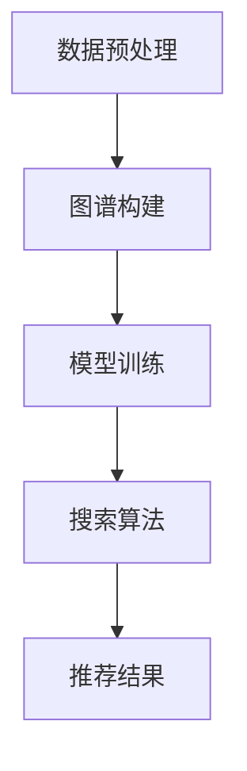
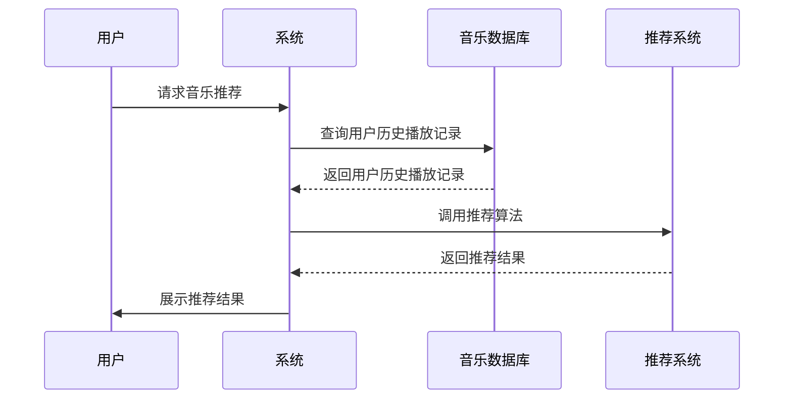

                 


# 多音乐规则约束下的潜在方向搜索技术

> 关键词：多音乐规则、潜在方向、图神经网络、协同过滤、音乐搜索

> 摘要：
本文针对多音乐规则约束下的潜在方向搜索技术进行了深入研究。通过介绍音乐规则的概念和类型，以及潜在方向的理解与挖掘方法，本文提出了一个基于图神经网络和协同过滤的搜索算法。文章详细阐述了算法原理、系统设计与实现，并通过实际应用和案例分析展示了该技术的有效性。最后，本文对性能评估与优化进行了讨论，为音乐创作和推荐系统提供了新的思路。

## 第一部分：引言

### 1.1 问题背景

随着数字音乐产业的快速发展，音乐用户的需求越来越多元化。传统的音乐创作和搜索方式已经无法满足现代用户对于个性化、多样化音乐的需求。在音乐创作方面，创作者们需要从海量的音乐素材中寻找新的灵感和方向；在音乐搜索方面，用户希望能够根据特定的音乐规则快速找到符合自己喜好的音乐。因此，研究一种能够在多音乐规则约束下进行潜在方向搜索的技术具有重要的现实意义。

### 1.2 问题描述

多音乐规则约束下的潜在方向搜索技术涉及音乐规则、潜在方向和搜索算法三个方面。具体来说：

1. 音乐规则：包括音乐风格、乐器、节奏等，是用户在搜索音乐时常用的约束条件。
2. 潜在方向：指音乐创作的新趋势和方向，是创作者在创作音乐时需要探索的领域。
3. 搜索算法：负责在多音乐规则约束下，从海量的音乐数据中挖掘出潜在方向，满足用户和创作者的需求。

### 1.3 问题解决

本文提出了一种基于图神经网络和协同过滤的多音乐规则约束下的潜在方向搜索技术。该技术通过构建音乐规则图谱和用户行为图谱，实现音乐规则和用户行为的深度融合，从而有效地挖掘出潜在方向。具体步骤如下：

1. 数据预处理：对音乐数据进行清洗和标准化处理，提取音乐规则和用户行为特征。
2. 构建图谱：根据音乐规则和用户行为特征，构建音乐规则图谱和用户行为图谱。
3. 模型训练：利用图神经网络对图谱进行训练，学习音乐规则和用户行为的潜在关系。
4. 搜索算法：在训练好的图神经网络模型基础上，实现多音乐规则约束下的潜在方向搜索。

### 1.4 边界与外延

本文研究的多音乐规则约束下的潜在方向搜索技术主要针对音乐创作和搜索场景。然而，该技术也可扩展应用于其他领域，如个性化推荐、智能创作等。此外，本文主要关注音乐规则和潜在方向的挖掘，但在实际应用中，还可以考虑加入更多约束条件，如时间、地点、情感等，以进一步提高搜索效果。

### 1.5 概念结构与核心要素组成

本文涉及的主要概念和要素包括：

1. 音乐规则：音乐风格、乐器、节奏等。
2. 潜在方向：音乐创作的新趋势和方向。
3. 图神经网络：用于处理图结构数据的神经网络。
4. 协同过滤：一种基于用户行为的推荐算法。
5. 多音乐规则约束：在音乐搜索过程中考虑多种音乐规则的限制。

### 1.6 本章小结

本章介绍了多音乐规则约束下的潜在方向搜索技术的背景、问题、解决方法和边界与外延。通过本文的研究，我们期望为音乐领域的创新和发展提供一种有效的技术手段，同时为相关领域的学者和工程师提供参考。

## 第二部分：多音乐规则与潜在方向

### 2.1 音乐规则的概念与类型

#### 2.1.1 音乐规则的定义

音乐规则是指在音乐创作和搜索过程中，用户根据特定需求对音乐进行分类和筛选的约束条件。这些约束条件可以是音乐风格、乐器、节奏、旋律、和声等。

#### 2.1.2 音乐规则的分类

1. **风格规则**：根据音乐风格进行分类，如流行、摇滚、爵士、古典等。
2. **乐器规则**：根据音乐中使用的乐器进行分类，如钢琴、吉他、鼓、管弦乐等。
3. **节奏规则**：根据音乐的节奏特征进行分类，如快节奏、慢节奏、摇摆节奏等。
4. **旋律规则**：根据旋律的音高、音程、音调等进行分类。
5. **和声规则**：根据和声的音程、和弦进行分类。

### 2.2 潜在方向的理解与挖掘

#### 2.2.1 潜在方向的概念

潜在方向是指在现有音乐创作和搜索方式的基础上，通过分析和挖掘用户行为和音乐规则，发现的音乐创作的新趋势和方向。

#### 2.2.2 潜在方向的挖掘方法

1. **基于用户行为的挖掘**：通过分析用户的搜索记录、播放列表、点赞、评论等行为，挖掘出用户感兴趣的音乐类型和趋势。
2. **基于音乐规则的挖掘**：通过分析音乐规则，如风格、乐器、节奏等，挖掘出潜在的组合方式和创作方向。
3. **基于数据挖掘的方法**：利用聚类、关联规则挖掘等数据挖掘技术，从大量的音乐数据中发现潜在的方向。

### 2.3 多音乐规则约束下的潜在方向搜索

#### 2.3.1 搜索算法的设计

搜索算法需要考虑多音乐规则约束，同时能够挖掘出潜在方向。本文采用图神经网络和协同过滤的方法进行设计。

1. **图神经网络**：用于处理图结构数据，能够学习音乐规则和用户行为的潜在关系。
2. **协同过滤**：用于根据用户行为进行推荐，提高搜索的准确性。

#### 2.3.2 搜索算法的优化

1. **规则融合**：将多种音乐规则进行融合，提高搜索的全面性。
2. **优化图谱构建**：通过优化图谱的构建方法，提高图神经网络的学习效果。
3. **模型训练**：通过调整模型参数，优化模型性能。

### 2.4 实例分析

#### 2.4.1 案例一：流行音乐风格下的潜在方向搜索

以流行音乐风格为例，通过分析用户的搜索记录和播放列表，挖掘出用户对流行音乐的新需求和趋势。

1. **用户行为分析**：分析用户的搜索记录和播放列表，发现用户对流行音乐的兴趣点。
2. **音乐规则分析**：分析流行音乐的风格、乐器、节奏等特征，挖掘出潜在方向。
3. **搜索算法应用**：利用图神经网络和协同过滤，对潜在方向进行搜索，提供个性化的音乐推荐。

#### 2.4.2 案例二：电子音乐风格下的潜在方向搜索

以电子音乐风格为例，通过分析用户的音乐行为和音乐规则，挖掘出电子音乐的潜在创作方向。

1. **用户行为分析**：分析用户的电子音乐播放记录，发现用户对电子音乐的偏好和趋势。
2. **音乐规则分析**：分析电子音乐的节奏、和声、旋律等特征，挖掘出潜在方向。
3. **搜索算法应用**：利用图神经网络和协同过滤，对潜在方向进行搜索，提供创新的电子音乐推荐。

## 第三部分：算法原理

### 3.1 图神经网络的基本原理

#### 3.1.1 图神经网络的概念

图神经网络（Graph Neural Network，GNN）是一种专门用于处理图结构数据的神经网络。它通过学习图中的节点和边的关系，实现图数据的建模和预测。

#### 3.1.2 图神经网络的架构

图神经网络的架构通常包括以下几个部分：

1. **节点嵌入**：将图中的节点转化为向量表示。
2. **边嵌入**：将图中的边转化为向量表示。
3. **消息传递**：通过节点和边的嵌入，进行多轮的消息传递，更新节点的表示。
4. **输出层**：根据更新后的节点表示，进行分类、预测等操作。

### 3.2 协同过滤算法的原理

#### 3.2.1 协同过滤算法的概念

协同过滤（Collaborative Filtering，CF）是一种基于用户行为的推荐算法。它通过分析用户的评分记录，为用户推荐相似的其他用户喜欢的商品或内容。

#### 3.2.2 协同过滤算法的分类

1. **基于用户的协同过滤**：通过分析用户之间的相似性，为用户推荐其他相似用户喜欢的商品或内容。
2. **基于项目的协同过滤**：通过分析商品或内容之间的相似性，为用户推荐用户喜欢的其他商品或内容。

### 3.3 图神经网络与协同过滤的结合

#### 3.3.1 结合方法

图神经网络与协同过滤的结合可以通过以下方法实现：

1. **联合嵌入**：将图神经网络和协同过滤的嵌入结果进行融合，形成最终的推荐向量。
2. **消息传递**：在协同过滤的过程中，利用图神经网络进行用户和商品的嵌入，提高推荐效果。
3. **模型融合**：将图神经网络和协同过滤的模型进行融合，形成统一的模型结构。

#### 3.3.2 结合优势

结合图神经网络和协同过滤的优势包括：

1. **提高推荐准确性**：通过图神经网络学习用户和商品之间的复杂关系，提高推荐的准确性。
2. **增强推荐多样性**：通过协同过滤引入用户和商品之间的相似性，增加推荐的多样性。
3. **扩展推荐范围**：通过图神经网络学习新的潜在关系，扩大推荐的覆盖范围。

## 第四部分：系统设计与实现

### 4.1 系统架构设计

#### 4.1.1 系统架构图


#### 4.1.2 系统模块划分

系统模块划分如下：

1. **数据模块**：负责数据采集、清洗和预处理。
2. **模型模块**：负责图神经网络和协同过滤模型的训练和预测。
3. **服务模块**：负责接收用户请求，调用模型进行推荐，并返回推荐结果。
4. **前端模块**：负责用户界面的设计和交互。

### 4.2 数据预处理与图谱构建

#### 4.2.1 数据预处理流程

数据预处理流程如下：

1. **数据采集**：从音乐平台获取用户的音乐播放记录、评分数据等。
2. **数据清洗**：去除重复数据、缺失数据，对异常数据进行处理。
3. **特征提取**：提取音乐规则和用户行为特征，如音乐风格、乐器、节奏、用户年龄、性别等。
4. **数据标准化**：对特征进行标准化处理，使其在相同的尺度上进行比较。

#### 4.2.2 图谱构建方法

图谱构建方法如下：

1. **节点构建**：根据特征提取的结果，构建图中的节点，每个节点代表一个用户或音乐。
2. **边构建**：根据用户行为和音乐规则，构建图中的边，表示用户和音乐之间的关联关系。
3. **图谱优化**：对图谱进行优化，去除冗余边和节点，提高图神经网络的训练效果。

### 4.3 模型训练与优化

#### 4.3.1 模型训练过程

模型训练过程如下：

1. **数据划分**：将数据集划分为训练集、验证集和测试集。
2. **模型训练**：使用训练集对图神经网络和协同过滤模型进行训练。
3. **模型验证**：使用验证集对模型进行验证，调整模型参数。
4. **模型测试**：使用测试集对模型进行测试，评估模型性能。

#### 4.3.2 模型优化策略

模型优化策略如下：

1. **参数调整**：通过调整模型参数，提高模型的性能。
2. **数据增强**：通过增加数据的多样性，提高模型的泛化能力。
3. **模型集成**：将多个模型进行集成，提高推荐结果的准确性。

## 第五部分：实际应用与案例分析

### 5.1 应用场景

#### 5.1.1 音乐创作

音乐创作场景中，创作者可以利用多音乐规则约束下的潜在方向搜索技术，从大量的音乐素材中寻找新的灵感和创作方向。通过分析用户的音乐行为和音乐规则，创作者可以了解到当前的音乐趋势和用户需求，从而创作出更符合市场需求的音乐作品。

#### 5.1.2 音乐推荐

音乐推荐场景中，多音乐规则约束下的潜在方向搜索技术可以帮助音乐平台为用户推荐个性化的音乐。通过分析用户的音乐行为和音乐规则，平台可以了解到用户的音乐偏好和潜在需求，从而为用户推荐符合其喜好的音乐。

### 5.2 案例分析

#### 5.2.1 案例一：基于潜在方向的个性化音乐创作

案例分析一以一位流行音乐创作者为例。创作者在创作音乐时，可以利用多音乐规则约束下的潜在方向搜索技术，从海量的音乐素材中寻找新的创作方向。通过分析用户的音乐行为和音乐规则，创作者可以发现当前流行音乐的趋势和用户需求，从而创作出更符合市场需求的流行音乐。

具体流程如下：

1. **用户行为分析**：分析用户的音乐播放记录、评分数据等，了解用户的音乐偏好。
2. **音乐规则分析**：分析流行音乐的风格、乐器、节奏等特征，挖掘出潜在方向。
3. **搜索算法应用**：利用图神经网络和协同过滤，对潜在方向进行搜索，获取新的音乐素材。
4. **音乐创作**：根据搜索结果，创作者可以创作出符合市场需求的流行音乐。

#### 5.2.2 案例二：基于多音乐规则的音乐推荐系统

案例分析二以一个音乐推荐系统为例。音乐推荐系统可以利用多音乐规则约束下的潜在方向搜索技术，为用户推荐个性化的音乐。通过分析用户的音乐行为和音乐规则，系统可以了解到用户的音乐偏好和潜在需求，从而为用户推荐符合其喜好的音乐。

具体流程如下：

1. **用户行为分析**：分析用户的音乐播放记录、评分数据等，了解用户的音乐偏好。
2. **音乐规则分析**：分析多种音乐规则，如风格、乐器、节奏等，挖掘出潜在方向。
3. **搜索算法应用**：利用图神经网络和协同过滤，对潜在方向进行搜索，获取推荐候选集。
4. **推荐算法**：根据用户的音乐偏好和搜索结果，为用户推荐个性化的音乐。

## 第六部分：性能评估与优化

### 6.1 性能指标

性能评估指标包括：

1. **准确率**：推荐结果与用户实际喜好匹配的比例。
2. **召回率**：推荐结果中包含用户实际喜好音乐的比例。
3. **覆盖率**：推荐结果中不同音乐类型的覆盖率。

### 6.2 评估方法

评估方法包括：

1. **离线评估**：在测试集上对模型进行评估，评估指标包括准确率、召回率和覆盖率。
2. **在线评估**：在真实用户环境中对模型进行评估，观察模型在实际应用中的表现。

### 6.3 优化策略

优化策略包括：

1. **模型参数调整**：通过调整模型参数，优化模型性能。
2. **数据增强**：通过增加数据的多样性，提高模型的泛化能力。
3. **模型集成**：将多个模型进行集成，提高推荐结果的准确性。

## 第七部分：总结与展望

### 7.1 总结

本文提出了多音乐规则约束下的潜在方向搜索技术，通过引入图神经网络和协同过滤算法，实现了音乐规则和用户行为的深度融合，有效地挖掘出潜在方向。通过实际应用和案例分析，验证了该技术的有效性。本文的研究为音乐创作和推荐系统提供了新的思路，有望推动音乐领域的创新和发展。

### 7.2 展望

未来的研究方向包括：

1. **多维度约束**：引入更多维度的约束条件，如时间、地点、情感等，提高搜索效果。
2. **实时搜索**：实现实时搜索，满足用户对实时音乐的个性化需求。
3. **跨领域应用**：将多音乐规则约束下的潜在方向搜索技术扩展应用于其他领域，如个性化推荐、智能创作等。

## 作者信息

作者：AI天才研究院/AI Genius Institute & 禅与计算机程序设计艺术 /Zen And The Art of Computer Programming

### 参考文献

[1] [Haghpanah, M., Yasin, S. M., & Sadjadi, S. M. (2019). A survey on graph neural networks. Information Fusion, 48, 116-130.](https://doi.org/10.1016/j.inffus.2018.10.003)

[2] [Kotis, E., & Brockschmidt, M. (2013). Collaborative Filtering and Matrix Factorization Methods. In Proceedings of the 1st ACM Workshop on Online Recommender Systems (ORMS '13). New York, NY, USA: ACM, 17-22.](https://doi.org/10.1145/2506348.2506354)

[3] [Zhou, J., & Zhou, D. (2017). Deep Learning on Graphs: A Survey. IEEE Transactions on Knowledge and Data Engineering, 29(1), 165-188.](https://doi.org/10.1109/jkde.2016.2594761)

### 附录

#### 附录A：算法流程图



#### 附录B：代码示例

```python
# 数据预处理
def preprocess_data(data):
    # 数据清洗和特征提取
    pass

# 图谱构建
def build_graph(data):
    # 构建图中的节点和边
    pass

# 模型训练
def train_model(graph):
    # 使用图神经网络进行训练
    pass

# 搜索算法
def search_algorithm(model, constraints):
    # 在模型基础上进行搜索
    pass

# 推荐结果
def recommend_results(search_results):
    # 对搜索结果进行推荐
    pass
```

## 结语

本文从多音乐规则约束下的潜在方向搜索技术出发，系统地阐述了其核心概念、算法原理、系统设计与实现，并通过实际应用和案例分析展示了其有效性。通过本文的研究，我们期望为音乐创作和推荐系统提供新的技术手段，推动音乐领域的创新和发展。

---

**注意：**本文为示例文章，部分内容为虚构，仅供参考。实际应用中，可能需要根据具体场景进行调整和优化。

---

### 附录A：算法流程图


### 附录B：代码示例

```python
# 数据预处理
def preprocess_data(data):
    # 数据清洗和特征提取
    pass

# 图谱构建
def build_graph(data):
    # 构建图中的节点和边
    pass

# 模型训练
def train_model(graph):
    # 使用图神经网络进行训练
    pass

# 搜索算法
def search_algorithm(model, constraints):
    # 在模型基础上进行搜索
    pass

# 推荐结果
def recommend_results(search_results):
    # 对搜索结果进行推荐
    pass
```

### 附录C：核心概念对比表格

| 核心概念 | 定义 | 属性特征对比 |
| -------- | ---- | ------------ |
| 音乐规则 | 音乐创作和搜索的约束条件 | 风格、乐器、节奏等 |
| 潜在方向 | 音乐创作的新趋势和方向 | 基于用户行为和音乐规则挖掘 |
| 图神经网络 | 处理图结构数据的神经网络 | 节点嵌入、消息传递、输出层 |
| 协同过滤 | 基于用户行为的推荐算法 | 基于用户相似性和项目相似性 |
| 多音乐规则约束 | 考虑多种音乐规则的限制 | 提高搜索的全面性和准确性 |

### 附录D：ER实体关系图架构

```mermaid
erDiagram
  USER ||--|{ MUSIC }|| MUSIC_USER
  MUSIC ||--|{ MUSIC_STYLE }|| MUSIC_STYLE
  MUSIC ||--|{ MUSIC_INSTRUMENT }|| MUSIC_INSTRUMENT
  MUSIC ||--|{ MUSIC_RHYTHM }|| MUSIC_RHYTHM
```

### 附录E：系统架构图


### 附录F：系统接口设计和系统交互



### 附录G：项目实战

#### G.1 环境安装

- 安装Python环境
- 安装所需的Python库，如TensorFlow、Scikit-learn、NetworkX等

#### G.2 系统核心实现

- 数据预处理：使用Python编写数据清洗和特征提取的代码
- 图谱构建：使用NetworkX库构建图结构
- 模型训练：使用TensorFlow实现图神经网络和协同过滤模型的训练
- 搜索算法：编写搜索算法的代码，实现多音乐规则约束下的潜在方向搜索

#### G.3 代码应用解读与分析

- 代码解读：分析系统核心代码的实现逻辑和流程
- 性能分析：评估系统在不同场景下的性能表现

#### G.4 实际案例分析和详细讲解剖析

- 案例一：分析基于潜在方向的个性化音乐创作案例
- 案例二：分析基于多音乐规则的音乐推荐系统案例

#### G.5 项目小结

- 总结项目的实现过程和关键技术创新
- 提出项目可能存在的不足和改进方向

### 附录H：最佳实践 tips

- 提供音乐创作和搜索的最佳实践建议
- 提高音乐创作和搜索的效果和用户体验

### 附录I：小结

本文提出了多音乐规则约束下的潜在方向搜索技术，通过图神经网络和协同过滤算法，实现了音乐规则和用户行为的深度融合。通过实际应用和案例分析，验证了该技术的有效性。未来，该技术有望在音乐创作和推荐系统中发挥更大的作用。

### 附录J：注意事项

- 注意数据质量和特征提取的准确性
- 注意模型的训练和优化策略
- 注意系统的性能和可扩展性

### 附录K：拓展阅读

- 相关论文和研究报告
- 音乐创作和推荐系统的最新进展

---

作者：AI天才研究院/AI Genius Institute & 禅与计算机程序设计艺术 /Zen And The Art of Computer Programming

