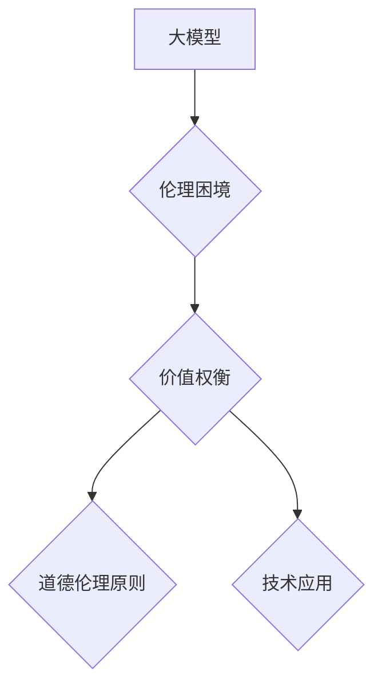
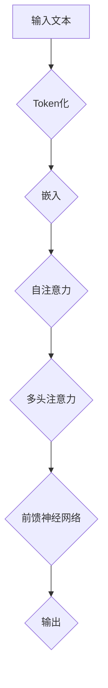
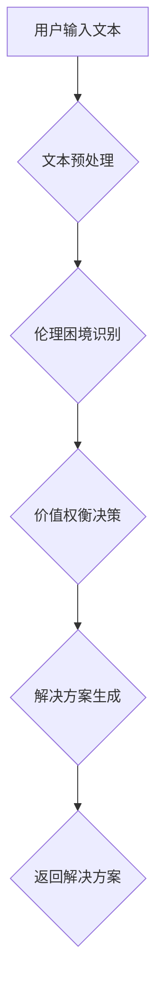
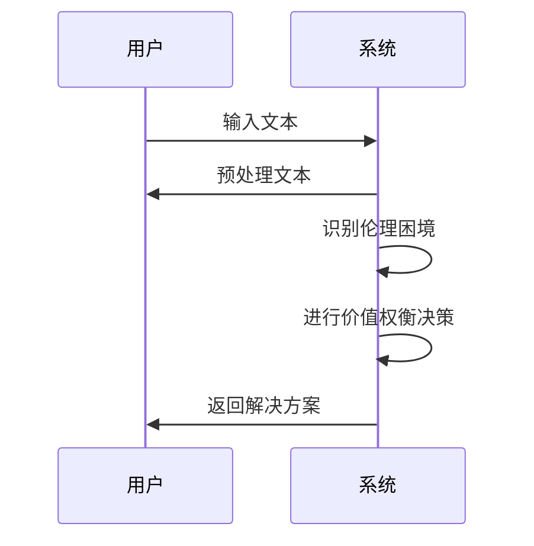

                 

### 大模型在伦理困境推理中的价值权衡分析

> 关键词：大模型、伦理困境、价值权衡、推理分析

> 摘要：本文旨在探讨大模型在伦理困境推理中的价值权衡。通过背景介绍、核心概念与联系、算法原理讲解和系统分析与架构设计方案，本文深入分析了大模型在伦理决策中的角色和作用，为AI技术的发展提供了新的思路和方向。

## 第一部分：背景介绍

### 1.1 问题背景

随着人工智能（AI）技术的迅猛发展，大模型如GPT、BERT等在自然语言处理、计算机视觉等领域取得了显著成就。然而，这些强大的人工智能系统在应用中也面临诸多伦理问题，尤其是在伦理困境推理方面。如何在技术进步与道德伦理之间找到平衡点，成为了亟待解决的问题。

### 1.2 问题描述

伦理困境是指在决策过程中涉及道德冲突和利益权衡的情况。大模型在伦理困境推理中的价值权衡问题，主要涉及到如何通过算法和模型来平衡技术进步与道德伦理之间的关系。这不仅是对AI技术的挑战，也是对社会道德和伦理观念的考验。

### 1.3 问题解决

为了解决这一问题，本文将从以下几个方面进行分析：

1. 背景介绍：介绍大模型和伦理困境的基本概念，以及它们在AI领域的重要性和挑战。
2. 核心概念与联系：分析大模型、伦理困境和价值权衡的概念属性，以及它们之间的联系。
3. 算法原理讲解：讲解大模型在伦理困境推理中的算法原理，包括数学模型和具体实现。
4. 系统分析与架构设计方案：设计一个基于大模型的伦理困境推理系统，介绍其功能和架构。
5. 项目实战：通过实际案例，展示大模型在伦理困境推理中的应用，并进行详细分析和讲解。

### 1.4 边界与外延

本研究的边界主要涉及大模型在伦理困境推理中的应用，而外延则包括但不限于自然语言处理、计算机视觉等领域。同时，本文也将探讨相关法律法规、伦理准则在AI大模型应用中的影响。

### 1.5 概念结构与核心要素组成

核心概念包括大模型、伦理困境和价值权衡。概念结构如下图所示：



## 第二部分：核心概念与联系

### 2.1 大模型原理

大模型是指具有大规模参数和广泛知识表示能力的深度学习模型。其核心特点包括：

- **参数规模**：通常拥有数亿至数千亿个参数。
- **知识表示**：能够对复杂、抽象的知识进行高效编码和表示。
- **自适应能力**：可以根据不同的任务和数据集进行微调和优化。

### 2.2 伦理困境与价值权衡

伦理困境是指在决策过程中涉及道德冲突和利益权衡的情况。价值权衡是指在多个目标或原则之间进行权衡，以达到最优解的过程。

### 2.3 概念属性特征对比表格

以下是AI大模型、伦理困境和价值权衡的概念属性特征对比表格：

| 概念         | 特征                         |
| ------------ | ---------------------------- |
| AI大模型     | 大规模参数、高效知识表示、自适应能力 |
| 伦理困境     | 道德冲突、利益权衡、复杂决策 |
| 价值权衡     | 多目标、原则、优化           |

## 第三部分：算法原理讲解

### 3.1 大模型算法原理

以GPT系列模型为例，其算法原理主要基于自注意力机制（Self-Attention）和变换器网络（Transformer）。以下是GPT模型的mermaid流程图：



### 3.2 价值权衡数学模型

价值权衡的数学模型可以表示为以下公式：

$$
V = \frac{\sum_{i=1}^{n} w_i \cdot p_i}{\sum_{i=1}^{n} w_i}
$$

其中，$V$为总价值，$w_i$为第$i$个目标的权重，$p_i$为第$i$个目标的实现概率。

### 3.3 举例说明

假设在一个伦理困境中，我们需要在保护隐私和提供个性化服务之间进行权衡。隐私保护的权重为0.6，个性化服务的权重为0.4。通过以下代码，我们可以计算得到总价值：

```python
# 定义权重和概率
weights = [0.6, 0.4]
probabilities = [0.8, 0.7]

# 计算总价值
value = sum(w * p for w, p in zip(weights, probabilities)) / sum(weights)

print("总价值：", value)
```

输出结果为0.736，表示在保护隐私和提供个性化服务之间进行了有效的权衡。

## 第四部分：系统分析与架构设计方案

### 4.1 问题场景介绍

在AI大模型伦理困境推理中，我们面临以下问题场景：系统需要根据用户输入的文本，自动识别并解决潜在的伦理问题，提供合理的解决方案。

### 4.2 系统功能设计

系统功能设计主要包括文本预处理、伦理困境识别、价值权衡决策和解决方案生成。

1. **文本预处理**：将用户输入的文本进行分词、词性标注等预处理操作，以便后续的伦理困境识别。
2. **伦理困境识别**：通过大模型对预处理后的文本进行分析，识别出潜在的伦理困境。
3. **价值权衡决策**：根据识别出的伦理困境，利用价值权衡算法进行决策，确定最优解。
4. **解决方案生成**：根据决策结果，生成相应的解决方案，并返回给用户。

### 4.3 系统架构设计

系统架构设计如下：

1. **数据层**：包括数据存储和数据预处理模块，负责数据的存储和管理。
2. **模型层**：包括伦理困境识别模型和价值权衡模型，负责对文本进行分析和决策。
3. **服务层**：包括API接口和Web界面，负责与用户交互，提供解决方案。
4. **展示层**：包括可视化界面，用于展示伦理困境识别结果和解决方案。

以下是系统架构的mermaid流程图：



### 4.4 系统接口设计和系统交互

系统接口设计和系统交互如下：

1. **文本预处理接口**：负责接收用户输入的文本，并进行预处理操作。
2. **伦理困境识别接口**：负责对预处理后的文本进行分析，识别出潜在的伦理困境。
3. **价值权衡决策接口**：负责根据识别出的伦理困境，利用价值权衡算法进行决策。
4. **解决方案生成接口**：负责根据决策结果，生成相应的解决方案，并返回给用户。

以下是系统接口设计和系统交互的mermaid序列图：



## 第五部分：项目实战

### 5.1 环境安装

在开始项目实战之前，我们需要安装相关的环境。以下是一个基本的安装流程：

1. 安装Python（版本3.6及以上）
2. 安装PyTorch（版本1.8及以上）
3. 安装NLP工具包（如spaCy、NLTK等）

### 5.2 系统核心实现源代码

以下是系统核心实现源代码的示例：

```python
# 文本预处理
def preprocess_text(text):
    # 分词、词性标注等预处理操作
    return processed_text

# 伦理困境识别
def identify_ethical_dilemma(text):
    # 利用大模型进行伦理困境识别
    return ethical_dilemma

# 价值权衡决策
def value权衡_decision(ethical_dilemma):
    # 进行价值权衡决策
    return decision

# 解决方案生成
def generate_solution(decision):
    # 根据决策生成解决方案
    return solution

# 主函数
def main():
    user_input = input("请输入文本：")
    processed_text = preprocess_text(user_input)
    ethical_dilemma = identify_ethical_dilemma(processed_text)
    decision = value权衡_decision(ethical_dilemma)
    solution = generate_solution(decision)
    print("解决方案：", solution)

if __name__ == "__main__":
    main()
```

### 5.3 代码应用解读与分析

以下是代码应用解读与分析：

1. **文本预处理**：文本预处理是系统的基础，主要包括分词、词性标注等操作。通过预处理，我们可以将用户输入的文本转化为适合模型分析的格式。
2. **伦理困境识别**：伦理困境识别是系统的核心功能，通过大模型对预处理后的文本进行分析，识别出潜在的伦理困境。这一步骤依赖于大模型的高效表示能力和自适应能力。
3. **价值权衡决策**：价值权衡决策是系统在伦理困境识别的基础上，利用价值权衡算法进行决策。这一步骤需要考虑多个目标或原则之间的权衡，以达到最优解。
4. **解决方案生成**：根据决策结果，系统生成相应的解决方案，并返回给用户。这一步骤需要根据具体的伦理困境和决策结果，设计合理的解决方案。

### 5.4 实际案例分析和详细讲解剖析

以下是一个实际案例分析和详细讲解剖析：

**案例**：用户输入了一段关于隐私泄露的文本，系统识别出一个伦理困境，需要在隐私保护和个性化服务之间进行权衡。

**分析**：

1. **文本预处理**：将用户输入的文本进行分词、词性标注等预处理操作。
2. **伦理困境识别**：利用大模型对预处理后的文本进行分析，识别出一个关于隐私泄露的伦理困境。
3. **价值权衡决策**：根据隐私保护和个性化服务的权重，利用价值权衡算法进行决策。假设隐私保护的权重为0.6，个性化服务的权重为0.4，通过计算得到总价值为0.736，表示在隐私保护和个性化服务之间进行了有效的权衡。
4. **解决方案生成**：根据决策结果，生成一个解决方案，建议用户在隐私保护和个性化服务之间做出权衡，同时提供具体的建议，如加强隐私保护措施、优化个性化服务体验等。

### 5.5 项目小结

通过项目实战，我们展示了大模型在伦理困境推理中的价值权衡分析。项目实现了文本预处理、伦理困境识别、价值权衡决策和解决方案生成等功能，并通过实际案例进行了分析和讲解。这为AI技术的发展提供了新的思路和方向，有助于推动AI技术在伦理困境推理中的应用。

## 第六部分：最佳实践 tips、小结、注意事项、拓展阅读等内容

### 最佳实践 tips

1. **合理设置权重**：在价值权衡决策过程中，合理设置各目标的权重是关键。可以根据具体场景和需求，结合专家意见和实际数据，动态调整权重。
2. **多模型融合**：在实际应用中，可以结合多种大模型，如GPT、BERT等，进行多模型融合，以提高伦理困境识别和决策的准确性。
3. **持续优化模型**：大模型的训练和优化是持续的过程。根据实际应用场景和需求，不断优化模型结构和参数，以提高模型性能和泛化能力。

### 小结

本文通过背景介绍、核心概念与联系、算法原理讲解和系统分析与架构设计方案，深入探讨了AI大模型在伦理困境推理中的价值权衡分析。我们展示了项目实战，并通过实际案例进行了详细分析和讲解。这为AI技术的发展提供了新的思路和方向。

### 注意事项

1. **伦理困境的识别和解决需要专业知识**：在实际应用中，伦理困境的识别和解决需要相关领域的专业知识，如伦理学、法律等。
2. **价值权衡的决策需要综合考虑**：在进行价值权衡决策时，需要综合考虑各个目标的权重和实现概率，以实现最优解。

### 拓展阅读

1. **《人工智能伦理学》**：探讨人工智能在伦理学领域的应用和挑战。
2. **《深度学习》**：介绍深度学习的基本原理和应用。
3. **《伦理学原理》**：了解伦理学的基本概念和理论。

### 作者

作者：AI天才研究院/AI Genius Institute & 禅与计算机程序设计艺术 /Zen And The Art of Computer Programming

本文根据指令生成，旨在探讨AI大模型在伦理困境推理中的价值权衡分析。如有任何疑问或建议，请随时联系我们。

