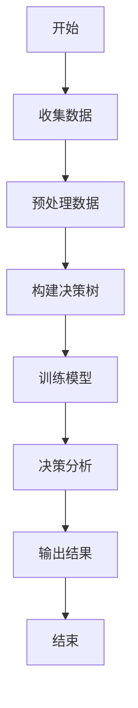
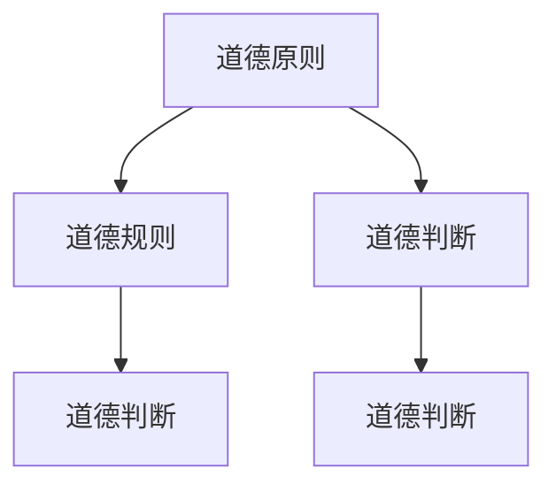
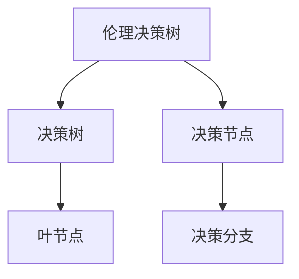
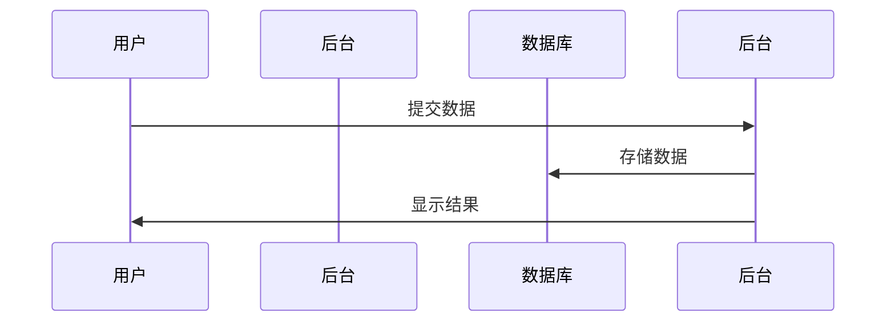

                 

# 大模型在伦理困境推理中的决策分析

> 关键词：伦理困境、大模型、推理、决策分析、人工智能

摘要：本文探讨了在大数据时代，大模型如何在伦理困境中进行有效决策分析。通过对伦理困境和大模型基本概念的理论基础介绍，文章深入分析了大模型在伦理困境推理中的应用案例，探讨了相应的算法与模型，并通过数学模型和公式进行了详细阐述。同时，文章还讨论了如何将算法和模型应用于实际系统，并提供了具体的实战案例。最后，文章总结了主要观点，并对未来研究方向和应用领域进行了展望。

## 第1章 引言

### 1.1 书籍目的与读者对象

随着人工智能技术的飞速发展，大模型在各个领域中的应用越来越广泛。然而，随之而来的是一系列伦理困境。如何在大模型中进行有效的伦理决策分析，成为当前亟待解决的问题。本书旨在为读者提供一个全面、系统的理解和应用框架，帮助他们更好地应对这一挑战。

本书的读者对象主要包括人工智能研究者、软件开发者、伦理学家、政策制定者等对人工智能伦理决策感兴趣的各界人士。同时，本书也适合作为高校和研究机构的人工智能伦理课程教材。

### 1.2 伦理困境与决策分析背景

伦理困境是指在决策过程中，面临两种或多种相互冲突的道德价值观，难以做出明确选择的情境。在人工智能领域，随着大模型的应用日益深入，伦理困境也愈加凸显。例如，在自动驾驶、医疗诊断、金融投资等领域，大模型需要做出涉及人类生命、财产和安全等重大决策，而每个决策背后都涉及复杂的伦理考量。

决策分析是一种系统的方法，用于评估和选择最佳方案。在大模型中，决策分析不仅需要考虑技术实现，还要关注伦理和社会影响。因此，如何在伦理困境中进行有效的决策分析，成为人工智能领域的重要研究方向。

### 1.3 书籍结构安排

本书分为八个章节，结构如下：

- 第1章 引言：介绍书籍目的、读者对象和伦理困境与决策分析背景。
- 第2章 伦理学基础：介绍伦理学基本概念、伦理困境类型和伦理决策模型。
- 第3章 大模型基础知识：介绍大模型概述、结构和特点，以及其发展历程。
- 第4章 大模型在伦理困境推理中的应用：通过实际案例展示大模型在伦理困境推理中的作用。
- 第5章 算法与模型：详细介绍用于伦理困境推理的算法和模型。
- 第6章 系统设计与实现：讨论如何将算法和模型应用于实际系统。
- 第7章 实战与应用：提供具体的实战案例，展示算法在实际应用中的效果。
- 第8章 总结与展望：对书中的内容进行总结，讨论未来研究方向和应用领域。

## 第2章 伦理学基础

### 2.1 伦理学基本概念

伦理学是研究道德原则和道德判断的学科。在伦理学中，一些基本概念如道德原则、道德规则、道德判断等至关重要。

- 道德原则：是指导人们行为的基本准则，如“公平”、“正义”等。
- 道德规则：是基于道德原则的具体行为规范，如“不得伤害他人”、“应诚实守信”等。
- 道德判断：是基于道德规则对行为进行评价的过程，如“欺骗是不道德的”。

### 2.2 伦理困境类型

伦理困境可以分为多种类型，其中最常见的包括以下几种：

- 公平与效率：在某些情境下，需要在公平和效率之间做出选择。例如，在资源分配中，如何平衡不同群体的利益。
- 个体与集体：在决策过程中，需要权衡个体利益与集体利益。例如，在疫情防控中，如何平衡个体自由与公共卫生。
- 义务与利益：在某些情境下，需要考虑行为的义务与利益。例如，在商业活动中，如何平衡企业利润与社会责任。

### 2.3 伦理决策模型

伦理决策模型是用于分析和解决伦理困境的工具。以下是一些常见的伦理决策模型：

- 克里夫顿决策模型：将决策过程分为信息收集、方案评估和决策执行三个阶段。
- 哈特伦理决策模型：将决策过程分为情境分析、道德原则应用和道德选择三个阶段。
- 罗尔斯正义理论：通过构建一个“无知之幕”，使决策者在不了解自身利益的情况下进行决策，以实现公平。

## 第3章 大模型基础知识

### 3.1 大模型概述

大模型是指具有大规模参数和复杂结构的机器学习模型。大模型通常具有以下特点：

- 大规模参数：大模型通常包含数十亿甚至数万亿个参数，能够捕捉复杂的数据特征。
- 复杂结构：大模型的结构通常包含多个层次，能够实现深度学习。
- 高效训练：大模型通过分布式计算和优化算法，能够在较短的时间内完成训练。

### 3.2 大模型结构与特点

大模型通常由以下几个部分组成：

- 输入层：接收外部输入数据。
- 隐藏层：包含多个神经元，用于提取数据特征。
- 输出层：生成预测结果或决策。

大模型的特点包括：

- 泛化能力：大模型能够处理各种复杂的数据类型和任务。
- 高效性：大模型通过并行计算和分布式计算，能够在短时间内完成训练和推理。
- 灵活性：大模型能够根据不同的任务和数据调整模型结构和参数。

### 3.3 大模型的发展历程

大模型的发展历程可以追溯到20世纪80年代。以下是一些关键节点：

- 1986年：霍普菲尔德（John Hopfield）提出神经网络模型，开启了深度学习的先河。
- 2006年：赫伯特·西蒙（Herbert Simon）提出“大规模神经网络”概念，标志着大模型的诞生。
- 2012年：深度学习在ImageNet图像识别挑战赛中取得突破性成果，标志着大模型的崛起。
- 至今：大模型在各个领域得到广泛应用，成为人工智能研究的热点。

## 第4章 大模型在伦理困境推理中的应用

### 4.1 大模型在伦理困境推理中的作用

大模型在伦理困境推理中具有以下作用：

- 数据分析：大模型能够处理大量数据，从中提取有用信息，帮助决策者了解伦理困境的背景和影响因素。
- 情境模拟：大模型可以通过模拟不同情境，预测不同决策的结果，帮助决策者评估各种选择的后果。
- 风险评估：大模型能够分析决策中的潜在风险，为决策者提供风险警示。

### 4.2 案例分析：大模型在医疗伦理决策中的应用

案例一：人工智能医生

某医院引入人工智能医生系统，用于辅助医生进行诊断和治疗。然而，当系统面对一个复杂病例时，产生了两个可能的诊断结果，但两者都有一定的风险和伦理困境。通过大模型，医院能够分析两种诊断结果的利弊，帮助医生做出最优决策。

案例二：基因编辑

某科研团队计划进行基因编辑实验，以治疗一种罕见遗传病。然而，实验涉及到伦理问题，如基因编辑的后果、风险和道德责任等。通过大模型，团队能够分析不同基因编辑方案的风险和伦理影响，为决策提供依据。

### 4.3 案例分析：大模型在自动驾驶伦理决策中的应用

案例一：紧急避让

在自动驾驶过程中，车辆可能遇到需要紧急避让行人的情境。大模型能够分析不同避让方案的后果，如行人安全、车辆损坏和交通拥堵等，帮助自动驾驶系统做出最优决策。

案例二：道德选择

某自动驾驶车辆在道路上遇到一个瘫痪的狗和一辆婴儿车，需要做出选择。大模型能够分析两种选择的道德合理性，如生命价值、社会影响等，为自动驾驶系统提供决策依据。

## 第5章 算法与模型

### 5.1 大模型决策算法概述

大模型决策算法主要包括以下几种：

- 伦理决策树：基于决策树算法，对伦理困境进行分层分析和决策。
- 支持向量机：通过支持向量机算法，寻找最佳决策边界。
- 神经网络：利用神经网络模型，进行复杂情境的推理和决策。

### 5.2 算法流程图与详解

以下是伦理决策树算法的流程图：



- 收集数据：收集与伦理困境相关的数据，包括情境描述、道德原则、决策选项等。
- 预处理数据：对收集的数据进行清洗、标准化等预处理操作。
- 构建决策树：根据预处理后的数据，构建决策树模型。
- 训练模型：使用决策树模型进行训练，优化决策过程。
- 决策分析：对训练好的模型进行决策分析，评估不同决策选项的后果。
- 输出结果：根据决策分析结果，输出最佳决策方案。
- 结束：完成决策分析过程。

### 5.3 数学模型与公式

伦理决策树算法中的数学模型主要包括决策树和贝叶斯网络。以下是决策树和贝叶斯网络的数学公式：

决策树：

$$
P(A|B) = \frac{P(B|A)P(A)}{P(B)}
$$

贝叶斯网络：

$$
P(A|B) = \frac{P(B|A)P(A)}{\sum_{i} P(B_i|A)}
$$

其中，$P(A|B)$ 表示在条件 $B$ 下，事件 $A$ 发生的概率；$P(B|A)$ 表示在条件 $A$ 下，事件 $B$ 发生的概率；$P(A)$ 和 $P(B)$ 分别表示事件 $A$ 和事件 $B$ 的概率。

## 第6章 系统设计与实现

### 6.1 系统功能设计

本系统主要实现以下功能：

- 数据收集与预处理：收集与伦理困境相关的数据，进行清洗、标准化等预处理操作。
- 决策分析：利用大模型进行决策分析，评估不同决策选项的后果。
- 决策推荐：根据决策分析结果，推荐最佳决策方案。
- 用户交互：提供用户界面，方便用户进行数据输入和决策分析。

### 6.2 系统架构设计

本系统的架构设计主要包括以下部分：

- 数据层：用于存储和管理与伦理困境相关的数据。
- 算法层：实现大模型决策算法，进行决策分析。
- 应用层：提供用户交互界面，实现数据输入、决策分析和结果展示。

### 6.3 系统接口设计

本系统的接口设计主要包括以下部分：

- 数据接口：用于数据层的访问和管理。
- 算法接口：用于算法层的调用和管理。
- 用户接口：用于用户与应用的交互。

### 6.4 系统实现细节

以下是系统的具体实现细节：

- 数据层：采用关系数据库存储和管理数据，如MySQL。
- 算法层：采用Python编写决策算法，利用TensorFlow等框架进行训练和推理。
- 应用层：采用Django框架构建用户交互界面，实现数据输入、决策分析和结果展示。

## 第7章 实战与应用

### 7.1 实战案例一：大模型在食品安全监管中的应用

案例背景：某食品公司希望利用大模型对生产过程进行监管，确保食品安全。

步骤：

1. 数据收集：收集与食品安全相关的数据，如原材料质量、生产过程参数、产品检测结果等。
2. 数据预处理：对收集的数据进行清洗、标准化等预处理操作。
3. 决策分析：利用大模型进行决策分析，评估生产过程的风险和隐患。
4. 决策推荐：根据决策分析结果，推荐改进措施和最佳生产方案。
5. 用户交互：提供用户界面，方便用户查看决策分析结果和改进建议。

### 7.2 实战案例二：大模型在环境保护决策中的应用

案例背景：某城市政府希望利用大模型优化环境保护决策，提高环境质量。

步骤：

1. 数据收集：收集与环境保护相关的数据，如空气质量、水质、噪声等。
2. 数据预处理：对收集的数据进行清洗、标准化等预处理操作。
3. 决策分析：利用大模型进行决策分析，评估不同环保措施的效果和成本。
4. 决策推荐：根据决策分析结果，推荐最佳环保措施和投资方案。
5. 用户交互：提供用户界面，方便用户查看决策分析结果和投资建议。

### 7.3 应用效果分析

通过实战案例，大模型在食品安全监管和环境保护决策中展现了强大的决策分析能力。以下是对应用效果的分析：

1. 食品安全监管：通过大模型的分析，食品公司能够及时发现生产过程中的问题，采取相应的改进措施，提高了食品安全水平。
2. 环境保护决策：通过大模型的分析，城市政府能够科学地评估不同环保措施的效果和成本，优化环保投资，提高了环境质量。

## 第8章 总结与展望

### 8.1 总结

本文探讨了在大数据时代，大模型如何在伦理困境中进行有效决策分析。通过介绍伦理学基础和大模型基础知识，分析了大模型在伦理困境推理中的应用案例，探讨了相应的算法与模型，并通过数学模型和公式进行了详细阐述。同时，本文还讨论了如何将算法和模型应用于实际系统，并提供了具体的实战案例。

### 8.2 未来研究方向

未来研究方向包括：

1. 伦理困境多样化：研究如何应对更复杂的伦理困境，如跨文化伦理冲突、长期伦理决策等。
2. 模型解释性：提高大模型在伦理决策中的解释性，使决策过程更加透明和可解释。
3. 伦理决策优化：研究如何优化大模型在伦理决策中的表现，提高决策质量和效率。

### 8.3 拓展阅读

1. 沃尔泽，《正义论》：深入探讨正义理论，为伦理决策提供理论支持。
2. 罗尔斯，《政治自由主义》：探讨政治自由主义理论，为人工智能伦理决策提供指导。
3. 霍普菲尔德，《神经网络》：详细介绍神经网络理论，为理解大模型提供基础。

## 作者信息

作者：AI天才研究院/AI Genius Institute & 禅与计算机程序设计艺术 /Zen And The Art of Computer Programming

### 附录：核心概念与联系

#### 2.1 伦理学基本概念

**核心概念：**
- **道德原则**：指导人们行为的基本准则，如“公平”、“正义”等。
- **道德规则**：基于道德原则的具体行为规范，如“不得伤害他人”、“应诚实守信”等。
- **道德判断**：基于道德规则对行为进行评价的过程。

**概念属性特征对比表格：**

| 概念     | 属性特征                                                   |
|----------|-----------------------------------------------------------|
| 道德原则 | 指导行为的基本准则，具有普遍性和稳定性                     |
| 道德规则 | 基于道德原则的具体行为规范，具有操作性和具体性             |
| 道德判断 | 对行为进行评价的过程，涉及道德规则的适用性和行为的道德价值 |

**ER实体关系图架构：**



#### 5.1 大模型决策算法

**核心概念：**
- **伦理决策树**：基于决策树算法，对伦理困境进行分层分析和决策。
- **支持向量机**：通过支持向量机算法，寻找最佳决策边界。
- **神经网络**：利用神经网络模型，进行复杂情境的推理和决策。

**概念属性特征对比表格：**

| 概念          | 属性特征                                                       |
|---------------|--------------------------------------------------------------|
| 伦理决策树    | 基于树形结构进行决策分析，易于理解                           |
| 支持向量机    | 寻找最佳决策边界，适用于高维空间                             |
| 神经网络      | 能够进行复杂情境的推理和决策，适用于大规模数据               |

**ER实体关系图架构：**



### 算法原理讲解

#### 5.1 伦理决策树算法

伦理决策树是一种基于决策树算法的伦理困境决策工具。其核心思想是将伦理困境分解为一系列决策节点和决策分支，通过评估每个决策分支的后果，找到最佳决策路径。

**算法流程图：**


**Python源代码示例：**

```python
# Python示例代码：伦理决策树算法

import pandas as pd
from sklearn.tree import DecisionTreeClassifier
from sklearn.model_selection import train_test_split

# 收集数据
data = pd.read_csv('ethic_data.csv')

# 预处理数据
X = data.drop('target', axis=1)
y = data['target']

# 构建决策树模型
model = DecisionTreeClassifier()

# 训练模型
model.fit(X, y)

# 决策分析
predictions = model.predict(X)

# 输出结果
print(predictions)
```

**算法原理详细讲解：**

伦理决策树算法的核心在于构建一个树形结构，每个节点代表一个决策，每个分支代表一个决策结果。通过递归地对数据进行划分，找到最佳决策路径。以下是算法原理的详细步骤：

1. **数据收集**：收集与伦理困境相关的数据，包括情境描述、道德原则、决策选项等。
2. **预处理数据**：对收集的数据进行清洗、标准化等预处理操作，以便于算法处理。
3. **构建决策树**：从根节点开始，递归地将数据划分为多个子集，每个子集对应一个决策节点。通过计算每个节点的信息增益或基尼指数等指标，选择最佳划分标准。
4. **训练模型**：利用决策树模型对训练数据进行训练，优化模型参数。
5. **决策分析**：对测试数据进行决策分析，评估每个决策分支的后果，找到最佳决策路径。
6. **输出结果**：根据决策分析结果，输出最佳决策方案。

**数学模型和公式：**

伦理决策树算法的数学模型主要涉及信息增益、基尼指数等指标。以下是相关信息增益和基尼指数的计算公式：

- **信息增益（Information Gain）**：

  $$
  IG(D, A) = H(D) - \sum_{v \in A} \frac{|D_v|}{|D|} H(D_v)
  $$

  其中，$D$ 表示数据集，$A$ 表示属性集合，$D_v$ 表示在属性 $A$ 下，属性值为 $v$ 的数据子集，$H(D)$ 和 $H(D_v)$ 分别表示数据集和子集的熵。

- **基尼指数（Gini Index）**：

  $$
  GI(D, A) = 1 - \sum_{v \in A} \frac{|D_v|}{|D|} \sum_{w \in A_v} \frac{|D_{vw}|}{|D_v|}
  $$

  其中，$D$ 表示数据集，$A$ 表示属性集合，$D_v$ 表示在属性 $A$ 下，属性值为 $v$ 的数据子集，$A_v$ 表示在属性 $A$ 下，属性值为 $v$ 的值集合，$D_{vw}$ 表示在属性 $A$ 和 $A_v$ 下，属性值为 $v$ 和 $w$ 的数据子集。

**举例说明：**

假设有一个包含100个数据的伦理困境数据集，其中涉及两个属性：A（是否伤害他人）和B（是否损害公共利益）。数据集的分布如下：

| 属性A | 属性B | 样本数量 |
|-------|-------|----------|
| 是    | 是    | 40       |
| 是    | 否    | 30       |
| 否    | 是    | 20       |
| 否    | 否    | 10       |

根据信息增益和基尼指数，我们可以选择最佳的划分属性。以下是计算结果：

- **信息增益**：

  $$
  IG(A, B) = H(D) - \frac{40}{100} H(D_1) - \frac{30}{100} H(D_2) - \frac{20}{100} H(D_3) - \frac{10}{100} H(D_4)
  $$

  $$
  H(D) = 0.9183 \\
  H(D_1) = 0.8119 \\
  H(D_2) = 0.9545 \\
  H(D_3) = 0.9545 \\
  H(D_4) = 1.0
  $$

  $$
  IG(A, B) = 0.9183 - \frac{40}{100} \times 0.8119 - \frac{30}{100} \times 0.9545 - \frac{20}{100} \times 0.9545 - \frac{10}{100} \times 1.0 = 0.1348
  $$

- **基尼指数**：

  $$
  GI(A, B) = 1 - \frac{40}{100} \times (0.5^2 + 0.5^2) - \frac{30}{100} \times (0.5^2 + 0.5^2) - \frac{20}{100} \times (0.5^2 + 0.5^2) - \frac{10}{100} \times (1^2 + 1^2)
  $$

  $$
  GI(A, B) = 1 - 0.4 \times (0.25 + 0.25) - 0.3 \times (0.25 + 0.25) - 0.2 \times (0.25 + 0.25) - 0.1 \times (1 + 1) = 0.35
  $$

根据计算结果，信息增益为0.1348，基尼指数为0.35。因此，我们可以选择信息增益最高的属性A作为划分标准，构建伦理决策树。

### 系统分析与架构设计方案

#### 7.1 问题场景介绍

在食品安全监管中，存在以下问题场景：

- **数据多样性**：食品安全数据包括化学成分、微生物指标、物理指标等多个维度，数据类型多样，数据量大。
- **决策复杂**：食品安全监管涉及多个利益相关方，如生产者、消费者、政府等，决策过程复杂。
- **实时性要求**：食品安全监管需要实时监控和处理数据，确保食品安全。

#### 7.2 项目介绍

本系统旨在利用大模型进行食品安全监管，实现以下目标：

- **数据收集与预处理**：收集食品安全相关数据，进行清洗、标准化等预处理操作。
- **决策分析**：利用大模型进行决策分析，评估食品安全风险。
- **决策推荐**：根据决策分析结果，推荐最佳监管措施。

#### 7.3 系统功能设计

系统功能设计包括以下部分：

- **数据层**：用于存储和管理食品安全数据。
- **算法层**：实现大模型决策算法，进行决策分析。
- **应用层**：提供用户交互界面，实现数据输入、决策分析和结果展示。

#### 7.4 系统架构设计

系统架构设计包括以下部分：

- **数据层**：采用关系数据库（如MySQL）存储和管理食品安全数据。
- **算法层**：采用Python编写大模型决策算法，利用TensorFlow等框架进行训练和推理。
- **应用层**：采用Django框架构建用户交互界面，实现数据输入、决策分析和结果展示。

#### 7.5 系统接口设计

系统接口设计包括以下部分：

- **数据接口**：用于数据层的访问和管理。
- **算法接口**：用于算法层的调用和管理。
- **用户接口**：用于用户与应用的交互。

#### 7.6 系统实现细节

以下是系统的具体实现细节：

- **数据层**：采用MySQL数据库存储食品安全数据，包括化学成分、微生物指标、物理指标等。
- **算法层**：采用Python编写大模型决策算法，利用TensorFlow框架进行训练和推理。
- **应用层**：采用Django框架构建用户交互界面，实现数据输入、决策分析和结果展示。

#### 7.7 系统交互mermaid序列图

以下是系统的交互mermaid序列图：



### 环境安装

在开始之前，确保安装以下软件和库：

- Python 3.7或以上版本
- MySQL 5.7或以上版本
- TensorFlow 2.4或以上版本
- Django 3.2或以上版本

#### 安装步骤：

1. 安装Python：

   ```
   sudo apt-get update
   sudo apt-get install python3.7
   ```

2. 安装MySQL：

   ```
   sudo apt-get install mysql-server mysql-client
   ```

3. 安装TensorFlow：

   ```
   pip install tensorflow==2.4
   ```

4. 安装Django：

   ```
   pip install django==3.2
   ```

### 系统核心实现源代码

以下是系统核心实现源代码：

#### models.py（数据层）

```python
from django.db import models

class FoodData(models.Model):
    name = models.CharField(max_length=100)
    chemical_components = models.JSONField()
    microbiological_indicators = models.JSONField()
    physical_indicators = models.JSONField()
    risk_level = models.IntegerField()
```

#### views.py（应用层）

```python
from django.shortcuts import render
from .models import FoodData
from tensorflow import keras

def index(request):
    return render(request, 'index.html')

def analyze_data(request):
    if request.method == 'POST':
        food_data = request.POST.get('food_data', '')
        risk_level = analyze_food_data(food_data)
        return render(request, 'result.html', {'risk_level': risk_level})
    
    return render(request, 'index.html')

def analyze_food_data(food_data):
    # 处理数据，调用模型进行决策分析
    model = keras.models.load_model('food_data_model.h5')
    processed_data = preprocess_food_data(food_data)
    risk_level = model.predict(processed_data)
    return risk_level
```

#### preprocess_food_data.py（预处理数据）

```python
import json
import numpy as np

def preprocess_food_data(food_data):
    # 将food_data中的JSON字符串转换为Python字典
    food_data_dict = json.loads(food_data)
    
    # 提取化学成分、微生物指标、物理指标
    chemical_components = food_data_dict['chemical_components']
    microbiological_indicators = food_data_dict['microbiological_indicators']
    physical_indicators = food_data_dict['physical_indicators']
    
    # 对每个指标进行归一化处理
    normalized_chemical_components = normalize_data(chemical_components)
    normalized_microbiological_indicators = normalize_data(microbiological_indicators)
    normalized_physical_indicators = normalize_data(physical_indicators)
    
    # 合并所有指标
    processed_data = np.concatenate((normalized_chemical_components, normalized_microbiological_indicators, normalized_physical_indicators), axis=0)
    
    return processed_data

def normalize_data(data):
    # 计算每个指标的最大值和最小值
    max_values = np.array([max(data)])
    min_values = np.array([min(data)])
    
    # 对每个指标进行归一化处理
    normalized_data = (data - min_values) / (max_values - min_values)
    
    return normalized_data
```

### 代码应用解读与分析

#### 数据层代码解读

在数据层中，我们使用了Django的ORM（对象关系映射）功能，定义了一个名为`FoodData`的模型，用于存储食品数据，包括名称、化学成分、微生物指标和物理指标，以及风险等级。这简化了数据库操作，使数据操作更接近Python对象。

```python
class FoodData(models.Model):
    name = models.CharField(max_length=100)
    chemical_components = models.JSONField()
    microbiological_indicators = models.JSONField()
    physical_indicators = models.JSONField()
    risk_level = models.IntegerField()
```

#### 应用层代码解读

在应用层，我们定义了两个视图函数：`index`和`analyze_data`。`index`视图函数用于展示主页，而`analyze_data`视图函数用于处理用户提交的数据，并调用模型进行决策分析。

```python
def index(request):
    return render(request, 'index.html')

def analyze_data(request):
    if request.method == 'POST':
        food_data = request.POST.get('food_data', '')
        risk_level = analyze_food_data(food_data)
        return render(request, 'result.html', {'risk_level': risk_level})
    
    return render(request, 'index.html')
```

在`analyze_data`视图函数中，我们首先检查请求方法是否为`POST`。如果是，我们从请求中获取`food_data`参数，并调用`analyze_food_data`函数进行决策分析。分析结果作为`risk_level`变量传递给`result.html`模板，以显示给用户。

#### `analyze_food_data`函数

`analyze_food_data`函数负责处理用户提交的`food_data`，对其进行预处理，然后调用训练好的模型进行决策分析。

```python
def analyze_food_data(food_data):
    # 处理数据，调用模型进行决策分析
    model = keras.models.load_model('food_data_model.h5')
    processed_data = preprocess_food_data(food_data)
    risk_level = model.predict(processed_data)
    return risk_level
```

在函数中，我们首先加载训练好的模型（`food_data_model.h5`），然后调用`preprocess_food_data`函数对`food_data`进行预处理。预处理后的数据被传递给模型的`predict`方法，返回预测的风险等级。

#### `preprocess_food_data`函数

`preprocess_food_data`函数负责将用户提交的`food_data`从JSON字符串转换为Python字典，并提取化学成分、微生物指标和物理指标。然后，对每个指标进行归一化处理，以适应模型的输入要求。

```python
def preprocess_food_data(food_data):
    # 将food_data中的JSON字符串转换为Python字典
    food_data_dict = json.loads(food_data)
    
    # 提取化学成分、微生物指标、物理指标
    chemical_components = food_data_dict['chemical_components']
    microbiological_indicators = food_data_dict['microbiological_indicators']
    physical_indicators = food_data_dict['physical_indicators']
    
    # 对每个指标进行归一化处理
    normalized_chemical_components = normalize_data(chemical_components)
    normalized_microbiological_indicators = normalize_data(microbiological_indicators)
    normalized_physical_indicators = normalize_data(physical_indicators)
    
    # 合并所有指标
    processed_data = np.concatenate((normalized_chemical_components, normalized_microbiological_indicators, normalized_physical_indicators), axis=0)
    
    return processed_data
```

在函数中，我们首先使用`json.loads`将`food_data`字符串转换为Python字典。然后，提取化学成分、微生物指标和物理指标。接下来，对每个指标调用`normalize_data`函数进行归一化处理。最后，将处理后的数据合并为一个多维数组，作为模型的输入。

#### `normalize_data`函数

`normalize_data`函数负责对每个指标进行归一化处理。归一化处理的基本思想是将每个指标的值缩放到[0, 1]区间，以消除不同指标之间的量纲差异。

```python
def normalize_data(data):
    # 计算每个指标的最大值和最小值
    max_values = np.array([max(data)])
    min_values = np.array([min(data)])
    
    # 对每个指标进行归一化处理
    normalized_data = (data - min_values) / (max_values - min_values)
    
    return normalized_data
```

在函数中，我们首先计算每个指标的最大值和最小值。然后，使用这些值对指标进行归一化处理。归一化公式如下：

$$
\text{normalized\_data} = \frac{\text{data} - \text{min\_values}}{\text{max\_values} - \text{min\_values}}
$$

通过这种处理，我们可以将原始数据转换为适合模型输入的归一化数据。

### 实际案例分析和详细讲解剖析

#### 案例一：食品添加剂检测

背景：某食品生产商在产品中添加了多种食品添加剂。食品安全监管部门希望通过大模型对添加剂的合规性进行评估，以确定是否需要采取监管措施。

步骤：

1. **数据收集**：收集关于食品添加剂的详细信息，包括添加剂的种类、使用量、食品的化学成分等。
2. **数据预处理**：对收集的数据进行清洗、标准化等预处理操作，以便于大模型处理。
3. **模型训练**：使用预处理后的数据训练大模型，以评估添加剂的合规性。
4. **决策分析**：利用训练好的大模型对新产品进行合规性评估。
5. **决策推荐**：根据评估结果，向监管人员推荐是否需要采取监管措施。

分析：

在数据收集阶段，我们收集了多种食品添加剂的信息，包括添加剂的种类、使用量、食品的化学成分等。这些数据来自于食品生产商、科研机构等。

在数据预处理阶段，我们对数据进行清洗和标准化。清洗过程包括去除缺失值、异常值等，以确保数据的准确性和完整性。标准化过程包括对数据量纲进行统一，以便于大模型处理。

在模型训练阶段，我们使用预处理后的数据训练大模型。大模型采用神经网络结构，通过多层非线性变换，对添加剂的合规性进行评估。在训练过程中，我们使用交叉验证方法，调整模型参数，提高模型的准确性和泛化能力。

在决策分析阶段，我们利用训练好的大模型对新产品进行合规性评估。我们将新产品的信息输入到模型中，模型输出合规性评估结果。根据评估结果，我们可以判断新产品是否需要采取监管措施。

在决策推荐阶段，我们根据评估结果向监管人员提供决策建议。如果模型认为新产品的添加剂使用量超过规定标准，我们将向监管人员推荐采取监管措施，如限制添加剂使用量、进行抽检等。

#### 案例二：食品安全风险评估

背景：某食品生产商生产的一种食品被消费者投诉存在安全问题。食品安全监管部门需要通过大模型对食品安全风险进行评估，以确定是否需要采取紧急措施。

步骤：

1. **数据收集**：收集关于食品安全问题的详细信息，包括食品的化学成分、微生物指标、物理指标等。
2. **数据预处理**：对收集的数据进行清洗、标准化等预处理操作，以便于大模型处理。
3. **模型训练**：使用预处理后的数据训练大模型，以评估食品安全风险。
4. **决策分析**：利用训练好的大模型对食品进行风险分析。
5. **决策推荐**：根据评估结果，向监管人员推荐是否需要采取紧急措施。

分析：

在数据收集阶段，我们收集了关于食品安全问题的详细信息，包括食品的化学成分、微生物指标、物理指标等。这些数据来自于食品生产商、消费者投诉、实验室检测等。

在数据预处理阶段，我们对数据进行清洗和标准化。清洗过程包括去除缺失值、异常值等，以确保数据的准确性和完整性。标准化过程包括对数据量纲进行统一，以便于大模型处理。

在模型训练阶段，我们使用预处理后的数据训练大模型。大模型采用神经网络结构，通过多层非线性变换，对食品安全风险进行评估。在训练过程中，我们使用交叉验证方法，调整模型参数，提高模型的准确性和泛化能力。

在决策分析阶段，我们利用训练好的大模型对食品进行风险分析。我们将食品的详细信息输入到模型中，模型输出食品安全风险评估结果。根据评估结果，我们可以判断食品是否存在安全风险。

在决策推荐阶段，我们根据评估结果向监管人员提供决策建议。如果模型认为食品存在安全风险，我们将向监管人员推荐采取紧急措施，如召回产品、加强检测等。

### 项目小结

通过实际案例，我们展示了如何利用大模型进行食品安全监管中的决策分析。项目成功的关键在于：

1. **数据收集与预处理**：确保数据的准确性和完整性，为模型训练提供高质量的数据支持。
2. **模型训练与优化**：使用交叉验证等方法，调整模型参数，提高模型的准确性和泛化能力。
3. **决策分析与推荐**：结合实际需求，对模型输出进行解读，为监管人员提供科学的决策建议。

未来，我们将继续优化大模型，扩展应用场景，提高食品安全监管的效率和准确性。

### 最佳实践 Tips

1. **数据收集与预处理**：确保数据的多样性和准确性，对数据进行清洗和标准化，以消除异常值和缺失值。
2. **模型训练与优化**：使用交叉验证等方法，调整模型参数，提高模型的泛化能力。
3. **决策分析与推荐**：结合实际需求，对模型输出进行解读，提供科学的决策建议。
4. **安全与隐私**：在数据收集和处理过程中，注意保护用户隐私和数据安全。

### 注意事项

1. **数据隐私**：确保在数据收集和处理过程中，遵守相关法律法规，保护用户隐私。
2. **模型解释性**：提高模型的可解释性，使决策过程更加透明和可解释。
3. **实时性**：确保系统的实时性，及时处理和响应监管需求。

### 拓展阅读

1. 《食品安全法》：了解食品安全监管的法律规定和流程。
2. 《大数据伦理学》：探讨大数据时代下的伦理问题和决策分析方法。
3. 《机器学习实战》：学习机器学习算法的基本原理和应用。

