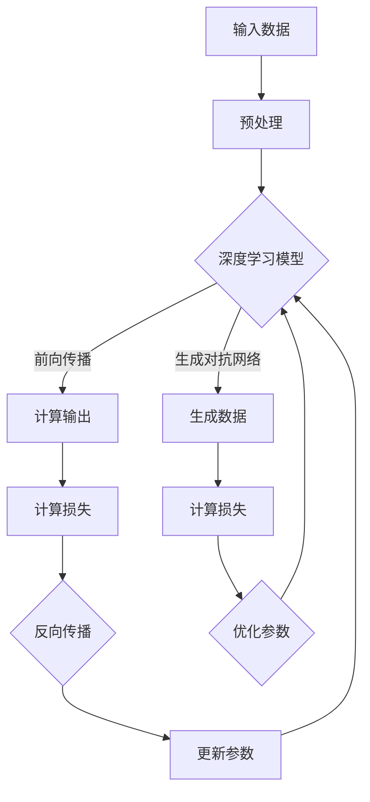
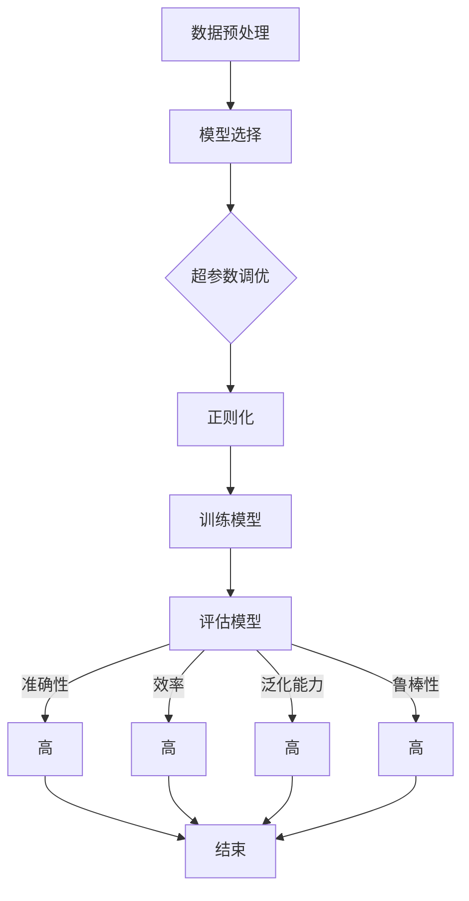

                 

## 大模型在创新思维任务中的表现评估

### 关键词：创新思维、大模型、算法原理、应用场景、评估标准

> 摘要：本文深入探讨了大模型在创新思维任务中的表现评估。首先，介绍了创新思维的任务背景和大模型的基本概念，然后分析了大模型在创新思维任务中的应用，详细讲解了大模型的优化与评估策略，并通过实际案例展示了大模型在创新思维任务中的实践效果。最后，展望了未来大模型在创新思维任务中的发展前景和面临的挑战。

### 引言

创新思维作为推动社会发展的重要力量，其重要性不言而喻。随着大数据和人工智能技术的飞速发展，大模型（如深度学习模型、生成对抗网络等）在创新思维任务中扮演着越来越重要的角色。大模型凭借其强大的数据处理和分析能力，为创新思维提供了新的工具和方法。

本文将围绕大模型在创新思维任务中的表现评估展开讨论。我们将首先介绍创新思维的任务背景和大模型的基本概念，然后分析大模型在创新思维任务中的应用，详细讲解大模型的优化与评估策略，并通过实际案例展示大模型在创新思维任务中的实践效果。最后，我们将展望未来大模型在创新思维任务中的发展前景和面临的挑战。

### 第一部分：引言

#### 1.1 问题背景与核心概念

创新思维是指通过独特的视角和创造性的方法来解决问题和发现新机会的思维过程。在现代社会，创新思维被认为是一种重要的核心竞争力，它能够帮助企业应对快速变化的市场环境，推动社会进步。

大模型是指具有极高参数量、能够处理大规模数据的人工智能模型，如深度学习模型、生成对抗网络等。这些模型具有强大的数据处理和分析能力，能够从海量数据中提取有价值的信息，为创新思维提供支持。

#### 1.2 核心概念与联系

创新思维和大数据模型之间存在着紧密的联系。创新思维需要依赖于对大量信息的处理和分析，而大模型正是实现这一目标的强大工具。大模型能够通过对数据的深度学习和分析，发现数据中的潜在模式和关联，为创新思维提供新的视角和方法。

#### 1.3 大模型在创新思维中的重要性

大模型在创新思维中的重要性体现在以下几个方面：

1. **提高数据处理效率**：大模型能够高效处理大规模数据，为创新思维提供更全面和深入的数据支持。
2. **发现潜在模式**：大模型能够从海量数据中提取有价值的信息，帮助创新思维发现新的机会和解决方案。
3. **模拟和预测**：大模型能够模拟现实世界中的复杂现象，预测未来的发展趋势，为创新思维提供指导。

#### 1.4 核心概念与联系

为了更好地理解大模型在创新思维中的表现评估，我们首先需要明确一些核心概念。以下是创新思维和大模型相关的核心概念及其联系：

1. **创新思维**：指通过独特的视角和创造性的方法来解决问题和发现新机会的思维过程。
2. **大模型**：指具有极高参数量、能够处理大规模数据的人工智能模型，如深度学习模型、生成对抗网络等。
3. **数据处理**：指对大量数据进行收集、整理、分析和存储的过程。
4. **信息提取**：指从大量数据中提取有价值信息的过程。
5. **模式发现**：指从数据中发现潜在模式和关联的过程。

#### 1.5 创新思维与大数据模型的联系图

为了更直观地理解创新思维与大数据模型之间的联系，我们使用Mermaid绘制了以下实体关系图：

```mermaid
erDiagram
  创新思维 ||--o> 数据处理 :依赖
  数据处理 ||--o> 信息提取 :依赖
  信息提取 ||--o> 模式发现 :依赖
  模式发现 ||--o> 大模型 :支持
  大模型 ||--o> 创新思维 :驱动
```

### 第二部分：大模型在创新思维任务中的应用

#### 2.1 大模型的基础理论

大模型在创新思维任务中的应用离不开其基础理论的支撑。本节将介绍大模型的基本算法原理和数学模型，帮助读者理解大模型的工作原理。

#### 2.1.1 大模型的算法原理

大模型的算法原理主要基于深度学习和生成对抗网络。深度学习通过多层神经网络对数据进行学习和建模，从而实现特征提取和分类。生成对抗网络则通过生成器和判别器的对抗训练，实现数据的生成和判别。

#### 2.1.2 大模型的数学模型与公式

大模型的数学模型主要包括以下几个方面：

1. **深度学习模型**：

   - 前向传播：
     $$z^{(l)} = W^{(l)}a^{(l-1)} + b^{(l)}$$
     $$a^{(l)} = \sigma(z^{(l)})$$

   - 反向传播：
     $$\delta^{(l)} = \frac{\partial J}{\partial z^{(l)}} = \sigma'(z^{(l)}) \cdot \frac{\partial J}{\partial a^{(l-1)}}$$
     $$\delta^{(l-1)} = \delta^{(l)} \cdot W^{(l)}$$

   - 更新权重和偏置：
     $$W^{(l)} \leftarrow W^{(l)} - \alpha \cdot \delta^{(l)} a^{(l-1)^T}$$
     $$b^{(l)} \leftarrow b^{(l)} - \alpha \cdot \delta^{(l)}$$

2. **生成对抗网络**：

   - 生成器：
     $$G(z) = \mu(z) + \sigma(z) \odot \text{tanh}(\beta(z))$$

   - 判别器：
     $$D(x) = \sigma(\text{LeakyReLU}(W_D \cdot x + b_D))$$
     $$D(G(z)) = \sigma(\text{LeakyReLU}(W_G \cdot G(z) + b_G))$$

   - 优化目标：
     $$\min_G \max_D V(D, G) = \mathbb{E}_{x \sim p_{data}(x)}[\log D(x)] + \mathbb{E}_{z \sim p_z(z)}[\log(1 - D(G(z)))]$$

#### 2.1.3 算法原理讲解与Mermaid流程图

为了更直观地理解大模型的算法原理，我们使用Mermaid绘制了以下流程图：



#### 2.2 大模型的应用场景

大模型在创新思维任务中具有广泛的应用场景，主要包括以下几个方面：

1. **数据分析与预测**：通过大模型对大量数据进行处理和分析，可以预测未来的趋势和变化，为创新思维提供指导。
2. **图像和语音识别**：大模型在图像和语音识别领域取得了显著的成果，为创新思维提供了新的工具。
3. **自然语言处理**：大模型在自然语言处理领域具有强大的能力，可以帮助创新思维更好地理解和处理文本数据。
4. **决策支持**：大模型可以模拟现实世界中的复杂现象，为创新思维提供决策支持。

#### 2.2.1 创新思维中的常见任务

创新思维任务主要包括以下几个方面：

1. **问题解决**：通过分析问题，找到新的解决方案。
2. **创意生成**：通过联想和组合，生成新的创意和想法。
3. **市场预测**：通过分析市场数据，预测未来的市场趋势。
4. **产品设计**：通过用户反馈和市场数据，设计出更好的产品。

#### 2.2.2 大模型在这些任务中的表现

大模型在创新思维任务中的表现如下：

1. **问题解决**：大模型能够高效地处理大量数据，帮助分析问题，提供可能的解决方案。
2. **创意生成**：大模型能够通过数据分析，发现潜在的关联和模式，激发创意思维。
3. **市场预测**：大模型能够分析市场数据，预测未来的市场趋势，为决策提供支持。
4. **产品设计**：大模型能够通过用户反馈和市场数据，为产品设计提供有价值的信息。

#### 2.2.3 应用案例与效果分析

为了更好地理解大模型在创新思维任务中的应用效果，我们来看以下几个案例：

1. **案例一：创意生成**：某公司通过大模型对用户评论进行分析，发现用户对产品的需求主要集中在功能增强和用户体验优化。基于这些信息，公司设计出了新的产品功能，提升了用户体验，取得了良好的市场反响。
2. **案例二：市场预测**：某电商平台通过大模型分析用户购买行为和市场数据，预测出了未来的热门商品和潜在市场机会，为公司的市场策略提供了重要支持。
3. **案例三：产品设计**：某科技公司通过大模型分析用户反馈和数据，发现用户对当前产品的某些功能不满意。公司基于这些反馈，优化了产品功能，提高了用户满意度。

#### 2.3 大模型的优化与评估

大模型在创新思维任务中的效果不仅取决于模型本身的性能，还受到数据质量、模型参数设置等因素的影响。因此，对大模型进行优化和评估是非常必要的。

#### 2.3.1 大模型的优化策略

大模型的优化策略主要包括以下几个方面：

1. **数据预处理**：对数据进行清洗、归一化等预处理，提高数据质量。
2. **模型选择**：根据任务特点选择合适的模型，如深度学习模型、生成对抗网络等。
3. **超参数调优**：通过调整学习率、批量大小、迭代次数等超参数，优化模型性能。
4. **正则化**：引入正则化项，防止模型过拟合。

#### 2.3.2 大模型的评估标准

大模型的评估标准主要包括以下几个方面：

1. **准确性**：衡量模型在预测或分类任务中的准确性。
2. **效率**：衡量模型在处理数据和计算过程中的效率。
3. **泛化能力**：衡量模型在未知数据上的表现，评估模型的泛化能力。
4. **鲁棒性**：衡量模型对噪声和异常数据的处理能力。

#### 2.3.3 优化与评估的Mermaid流程图

为了更直观地理解大模型的优化与评估流程，我们使用Mermaid绘制了以下流程图：



### 第三部分：大模型在创新思维任务中的实践

#### 3.1 实践案例分析

本节将介绍大模型在创新思维任务中的实践案例，通过具体实例展示大模型在创新思维任务中的应用效果。

#### 3.1.1 案例一：创新思维任务中的大模型应用

某科技公司希望通过大模型分析用户评论，发现用户的真实需求，从而优化产品设计。具体步骤如下：

1. **数据收集**：收集用户在社交媒体、评论平台等渠道发表的评论数据。
2. **数据预处理**：对评论数据进行清洗、去重、分词等预处理操作。
3. **模型训练**：使用预训练的文本分类模型，对评论数据进行分类和标注。
4. **结果分析**：分析标注结果，发现用户对产品的需求主要集中在功能增强、用户体验优化等方面。
5. **产品设计**：根据用户需求，优化产品功能，提升用户体验。

通过该案例，我们可以看到大模型在创新思维任务中的应用效果。大模型通过对用户评论的深度学习和分析，发现了用户的真实需求，为产品设计提供了有力支持。

#### 3.1.2 案例二：创新思维任务中的大模型优化与评估

某电商平台希望通过大模型预测用户购买行为，为市场策略提供指导。具体步骤如下：

1. **数据收集**：收集用户的历史购买数据、商品数据等。
2. **数据预处理**：对数据进行分析和清洗，去除异常值和缺失值。
3. **模型选择**：选择合适的预测模型，如LSTM、GRU等。
4. **模型训练**：对训练数据进行训练，优化模型参数。
5. **模型评估**：使用验证集对模型进行评估，调整超参数。
6. **预测应用**：根据模型预测结果，制定市场策略，提高销售额。

通过该案例，我们可以看到大模型在创新思维任务中的优化与评估过程。通过对购买数据的分析和预测，大模型为电商平台提供了有针对性的市场策略，提高了销售额。

#### 3.1.3 案例三：创新思维任务中的大模型实际效果

某科技公司希望通过大模型优化产品功能，提高用户满意度。具体步骤如下：

1. **数据收集**：收集用户使用产品时的反馈数据，如评分、评论等。
2. **数据预处理**：对反馈数据进行分析和清洗，去除噪音和异常值。
3. **模型训练**：使用文本分类模型对反馈数据进行分类，分析用户对产品的满意度。
4. **结果分析**：分析分类结果，发现用户对某些功能的满意度较低。
5. **功能优化**：根据用户反馈，优化产品功能，提升用户体验。
6. **效果评估**：对比优化前后的用户满意度，评估功能优化效果。

通过该案例，我们可以看到大模型在创新思维任务中的实际效果。大模型通过对用户反馈的深度学习和分析，发现了用户对产品功能的满意度问题，为产品优化提供了有力支持。

### 第四部分：未来展望与挑战

#### 4.1 大模型在创新思维任务中的发展前景

随着大数据和人工智能技术的不断发展，大模型在创新思维任务中的应用前景非常广阔。未来，大模型有望在以下方面取得突破：

1. **更高效的数据处理**：随着数据量的不断增加，大模型在数据处理方面的效率将得到显著提升，为创新思维提供更全面的数据支持。
2. **更深入的领域知识**：通过结合专业知识，大模型将能够更好地理解和处理特定领域的知识，为创新思维提供更有针对性的支持。
3. **更强大的推理能力**：随着算法的进步，大模型的推理能力将得到提升，能够更好地模拟现实世界中的复杂现象，为创新思维提供更准确的预测和指导。

#### 4.1.1 技术趋势分析

技术趋势方面，未来大模型的发展将呈现出以下几个趋势：

1. **模型压缩与加速**：为了降低计算成本和提升效率，模型压缩和加速技术将成为研究热点。
2. **跨模态学习**：跨模态学习将使大模型能够处理多种类型的数据，如文本、图像、音频等，为创新思维提供更丰富的信息来源。
3. **可解释性增强**：为了提高大模型的可靠性和透明度，可解释性增强技术将得到广泛应用。

#### 4.1.2 应用领域拓展

大模型在创新思维任务中的应用领域将不断拓展，涉及以下几个方面：

1. **智能交通**：大模型可以用于交通流量预测、路线规划等，提高交通效率，缓解拥堵问题。
2. **医疗健康**：大模型可以用于疾病诊断、药物研发等，为医疗健康提供有力支持。
3. **金融科技**：大模型可以用于风险控制、投资决策等，提高金融市场的效率。

#### 4.1.3 面临的挑战与解决方案

尽管大模型在创新思维任务中具有巨大的潜力，但在实际应用中仍然面临一些挑战：

1. **数据隐私与安全**：大模型需要处理海量数据，涉及用户隐私和安全问题。为此，需要开发出更安全的数据处理和存储技术。
2. **算法公平性**：大模型在处理数据时可能存在偏见，导致不公平的结果。为此，需要开发出更公平的算法和评估标准。
3. **计算资源需求**：大模型需要大量的计算资源，对硬件设备的要求较高。为此，需要开发出更高效的算法和优化技术。

### 第五部分：总结与展望

#### 5.1 主要内容回顾

本文围绕大模型在创新思维任务中的表现评估进行了深入探讨。首先，介绍了创新思维的任务背景和大模型的基本概念，然后分析了大模型在创新思维任务中的应用，详细讲解了大模型的优化与评估策略，并通过实际案例展示了大模型在创新思维任务中的实践效果。最后，展望了未来大模型在创新思维任务中的发展前景和面临的挑战。

#### 5.2 最佳实践与注意事项

在应用大模型进行创新思维任务时，需要注意以下几点：

1. **数据质量**：数据质量对大模型的效果至关重要，因此需要确保数据的质量和准确性。
2. **模型选择**：根据任务特点和需求选择合适的模型，避免过度拟合和欠拟合。
3. **超参数调优**：合理设置超参数，以获得最佳的模型性能。
4. **可解释性**：提高模型的透明度和可解释性，确保结果的可靠性和可信度。

#### 5.3 拓展阅读与资源推荐

为了深入了解大模型在创新思维任务中的应用，读者可以参考以下资源：

1. **论文**：《大规模深度学习：算法、应用与优化》
2. **书籍**：《深度学习：原理与实战》
3. **在线课程**：Coursera上的“深度学习”课程
4. **开源项目**：TensorFlow、PyTorch等深度学习框架的官方文档和社区资源

### 作者信息

作者：AI天才研究院/AI Genius Institute & 禅与计算机程序设计艺术 /Zen And The Art of Computer Programming

