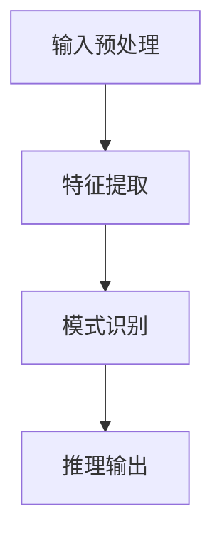
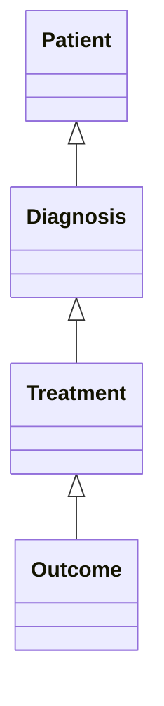
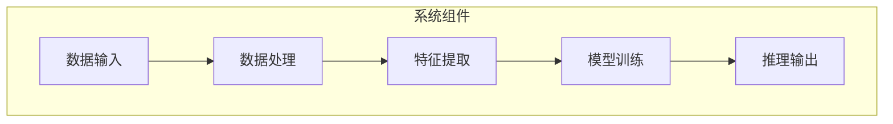
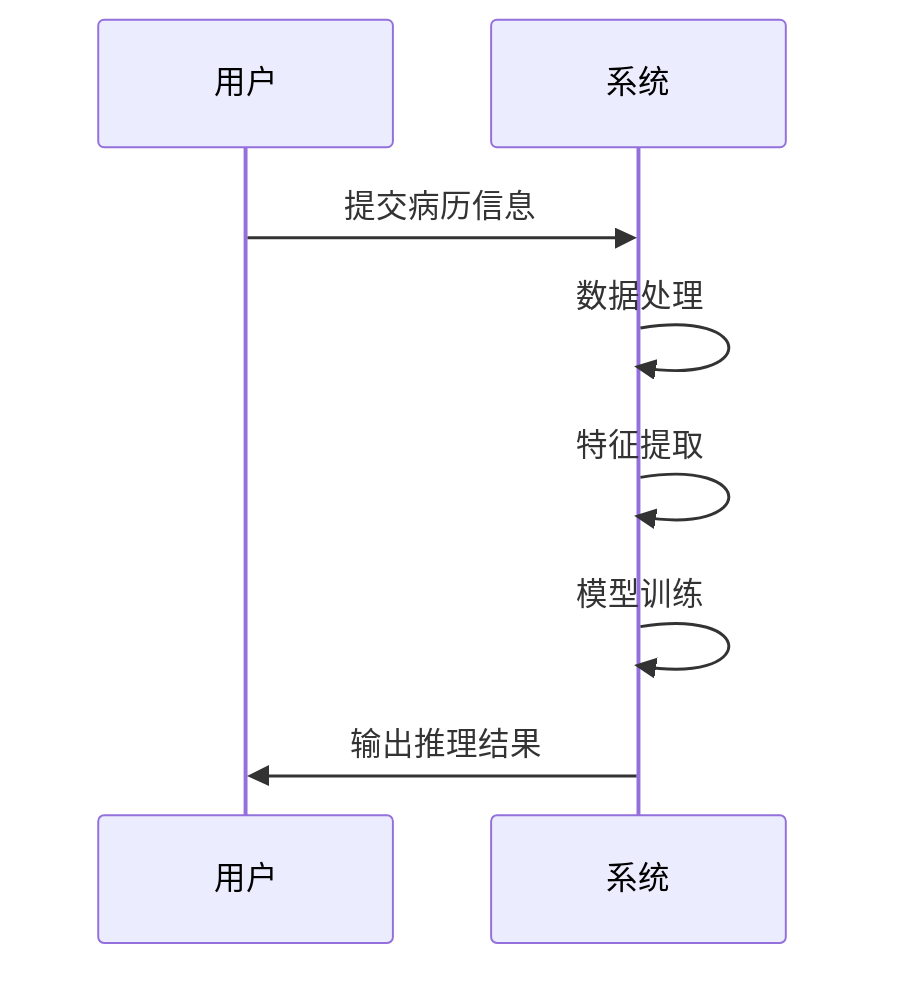
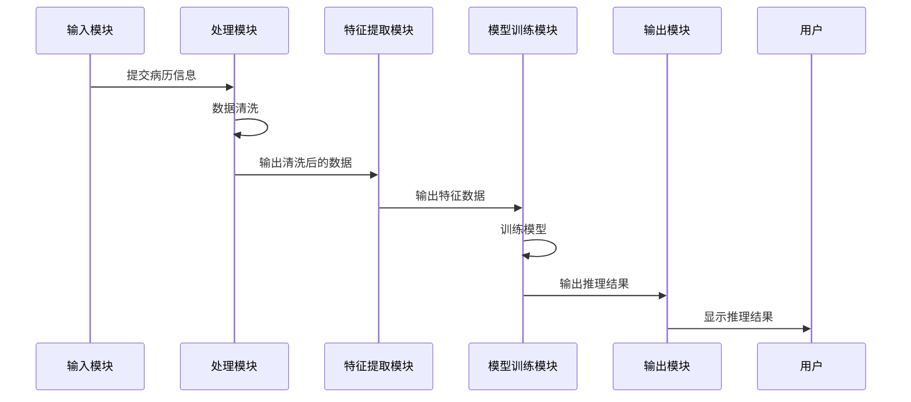

                 

## 大模型在反事实情景推理中的创新能力评估方法

### 关键词
- 大模型
- 反事实情景推理
- 创新能力评估
- 数学模型
- 算法原理
- 实际应用

### 摘要

本文旨在探讨大模型在反事实情景推理中的创新能力评估方法。随着人工智能技术的飞速发展，大模型在各个领域展现出了强大的推理和预测能力，特别是在反事实情景推理方面。然而，如何评估这些模型的创新能力成为一个关键问题。本文将从问题背景、核心概念、算法原理、数学模型、系统分析、项目实战和最佳实践等多个角度，详细阐述大模型在反事实情景推理中的创新能力评估方法，以期为相关研究和应用提供参考。

### 目录大纲设计步骤

在设计《大模型在反事实情景推理中的创新能力评估方法》的目录大纲时，我们将遵循以下步骤：

1. **确定整体结构**：明确书籍的整体结构，包括主要部分和章节划分。
2. **设计一级目录**：包含背景介绍、核心概念、算法原理、数学模型、系统分析、项目实战和最佳实践等。
3. **设计二级目录**：对一级目录中的每个章节进行细分，确保每个章节的内容能够被充分展开。
4. **设计三级目录**：对二级目录中的每个小节进行细化，确保每个小节的内容都能够具体、清晰地呈现。
5. **审核与调整**：对目录进行审核和调整，确保内容的完整性、逻辑性和简洁性。
6. **符合字数限制**：确保最终的目录大纲总字数不超过2000字。

### 目录大纲

```
第一部分：问题背景与核心概念
第1章：问题背景
1.1 反事实情景推理的应用领域
1.2 大模型在反事实情景推理中的重要性
1.3 现有评估方法的不足

第2章：核心概念与联系
2.1 反事实情景推理的定义与特征
2.2 大模型的定义与特点
2.3 创新能力的定义与评估

第3章：算法原理与数学模型
3.1 大模型在反事实情景推理中的算法原理
3.2 数学模型与公式推导
3.3 算法流程图与Python代码实现

第二部分：系统分析与架构设计
第4章：系统分析与架构设计
4.1 问题场景介绍
4.2 系统功能设计（领域模型类图）
4.3 系统架构设计（架构图）
4.4 系统接口设计（接口图）
4.5 系统交互（序列图）

第三部分：项目实战
第5章：项目实战
5.1 环境安装与配置
5.2 系统核心实现
5.3 代码应用解读与分析
5.4 实际案例分析与详细讲解
5.5 项目小结

第四部分：最佳实践与展望
第6章：最佳实践与技巧
6.1 经验总结
6.2 实践技巧
6.3 注意事项与挑战

第7章：小结与展望
7.1 小结
7.2 展望未来
7.3 拓展阅读
```

### 文章正文

#### 第一部分：问题背景与核心概念

##### 第1章：问题背景

**1.1 反事实情景推理的应用领域**

反事实情景推理（Counterfactual Inference）是人工智能领域中的一个重要研究方向。它涉及到基于现实世界中的数据，推断出如果某个事件没有发生，那么结果会有何不同的可能性。这种推理方式在许多领域都有着广泛的应用，例如：

- **医疗诊断**：通过反事实情景推理，可以分析如果患者采取了不同的治疗方案，其健康状况会有何变化。
- **金融分析**：在金融市场中，反事实情景推理可以帮助投资者分析如果市场条件发生变化，其投资组合的表现会如何。
- **法律判断**：在法律诉讼中，反事实情景推理可以用于分析如果某项法律没有被遵守，结果会有何不同。

**1.2 大模型在反事实情景推理中的重要性**

大模型（Large Models）是指参数量庞大、训练数据量巨大的神经网络模型。这些模型在反事实情景推理中具有显著的优势，主要体现在以下几个方面：

- **数据学习能力**：大模型能够从大量的数据中学习到复杂的关系和模式，从而提高反事实情景推理的准确性。
- **泛化能力**：大模型具有较强的泛化能力，能够在不同的情景和任务中表现出色。
- **处理复杂问题**：大模型可以处理复杂的、多层次的问题，使得反事实情景推理更加深入和精准。

**1.3 现有评估方法的不足**

目前，对大模型在反事实情景推理中的创新能力进行评估的方法仍存在一些不足。这些方法主要包括：

- **单一指标评估**：大多数评估方法仅依赖于单一的指标（如准确率、召回率等）来评估模型的性能，无法全面反映模型的创新能力。
- **缺乏标准化**：不同评估方法的标准化程度不一，导致评估结果难以进行比较和归纳。
- **忽视情境差异**：现有评估方法往往忽视了不同情景下的模型表现差异，难以全面评估模型在复杂环境中的创新能力。

#### 第2章：核心概念与联系

**2.1 反事实情景推理的定义与特征**

反事实情景推理是一种基于现实世界中的数据，通过逻辑推理和概率推断来分析如果某个事件没有发生，结果会有何不同的推理方式。其特征包括：

- **情境敏感性**：反事实情景推理的结果高度依赖于具体的情境，不同的情境可能导致完全不同的推理结果。
- **数据依赖性**：反事实情景推理需要大量的现实世界数据作为基础，数据的质量和数量直接影响推理的准确性。
- **复杂计算**：反事实情景推理通常涉及到复杂的逻辑运算和概率计算，需要强大的计算能力。

**2.2 大模型的定义与特点**

大模型是指参数量庞大、训练数据量巨大的神经网络模型。其特点包括：

- **参数量庞大**：大模型的参数量通常在数百万到数十亿之间，能够捕捉到复杂的特征和模式。
- **训练数据量巨大**：大模型需要大量的训练数据来保证模型的泛化和鲁棒性。
- **强大的计算能力**：大模型通常依赖于高性能的硬件设备（如GPU）来支持其训练和推理。

**2.3 创新能力的定义与评估**

创新能力是指模型在处理新任务或新情景时能够产生新颖、有效的解决方案的能力。评估大模型在反事实情景推理中的创新能力，可以从以下几个方面进行：

- **准确性**：评估模型在反事实情景推理中的准确率，判断模型是否能够正确地推断出不同情境下的结果。
- **泛化能力**：评估模型在不同情景和任务中的表现，判断模型的泛化能力。
- **效率**：评估模型在反事实情景推理中的计算效率，判断模型是否能够在合理的计算时间内完成推理任务。

#### 第3章：算法原理与数学模型

**3.1 大模型在反事实情景推理中的算法原理**

大模型在反事实情景推理中的算法原理主要基于深度学习技术。深度学习通过多层神经网络对数据进行特征提取和模式识别，从而实现复杂的推理任务。在反事实情景推理中，大模型通常采用以下步骤：

1. **数据预处理**：对原始数据进行清洗、归一化等处理，确保数据质量。
2. **特征提取**：通过神经网络模型从数据中提取高层次的、抽象的特征。
3. **模式识别**：利用提取的特征进行模式识别，判断不同情境下的结果。
4. **推理输出**：根据模式识别的结果，输出反事实情景推理的结果。

**3.2 数学模型与公式推导**

在反事实情景推理中，大模型的数学模型通常基于概率图模型或神经网络模型。以下是一个简单的神经网络模型的数学模型和公式推导：

1. **输入层**：假设输入层有 \( n \) 个神经元，每个神经元接收一个输入值。
2. **隐藏层**：隐藏层有 \( m \) 个神经元，每个隐藏层神经元接收来自输入层的输入，并经过激活函数 \( \sigma(x) \) 处理。
3. **输出层**：输出层有 \( k \) 个神经元，每个输出层神经元接收来自隐藏层的输入，并经过激活函数 \( \sigma(x) \) 处理。

假设隐藏层和输出层的权重分别为 \( W_h \) 和 \( W_o \)，偏置分别为 \( b_h \) 和 \( b_o \)。则隐藏层和输出层的输出可以表示为：

$$
h_i = \sigma(W_h \cdot x_i + b_h) \quad (i=1,2,...,m)
$$

$$
o_j = \sigma(W_o \cdot h_i + b_o) \quad (j=1,2,...,k)
$$

其中，\( x_i \) 和 \( h_i \) 分别表示输入层和隐藏层的神经元输出，\( o_j \) 表示输出层神经元输出。

**3.3 算法流程图与Python代码实现**

为了更好地理解大模型在反事实情景推理中的算法原理，我们可以使用 Mermaid 画出算法流程图，并使用 Python 代码实现算法。



```python
import tensorflow as tf
from tensorflow.keras.models import Sequential
from tensorflow.keras.layers import Dense, Activation

# 创建模型
model = Sequential()

# 添加隐藏层
model.add(Dense(units=64, activation='relu', input_shape=(input_dim,)))
model.add(Dense(units=64, activation='relu'))

# 添加输出层
model.add(Dense(units=1, activation='sigmoid'))

# 编译模型
model.compile(optimizer='adam', loss='binary_crossentropy', metrics=['accuracy'])

# 训练模型
model.fit(x_train, y_train, epochs=10, batch_size=32)
```

#### 第二部分：系统分析与架构设计

##### 第4章：系统分析与架构设计

**4.1 问题场景介绍**

在反事实情景推理中，我们面临的问题场景是一个具有复杂决策链的系统。该系统需要根据不同的输入数据，通过推理和预测，给出一系列可能的决策结果。例如，在一个医疗诊断系统中，输入数据可能是患者的病历信息，系统需要根据这些信息，推断出如果患者采取了不同的治疗方案，其健康状况会有何变化。

**4.2 系统功能设计（领域模型类图）**

为了更好地描述系统功能，我们可以使用 Mermaid 画出领域模型类图。



**4.3 系统架构设计（架构图）**

系统架构设计是系统分析的关键环节。我们可以使用 Mermaid 画出系统架构图，以展示系统的不同组件和它们之间的关系。



**4.4 系统接口设计（接口图）**

系统接口设计是系统架构设计的重要组成部分。我们可以使用 Mermaid 画出系统接口图，以展示系统与外部环境的交互。



**4.5 系统交互（序列图）**

为了更好地描述系统内部各组件的交互过程，我们可以使用 Mermaid 画出系统交互序列图。



#### 第三部分：项目实战

##### 第5章：项目实战

**5.1 环境安装与配置**

为了运行大模型在反事实情景推理中的创新能力评估项目，我们需要安装以下环境：

1. **操作系统**：Linux或Windows
2. **Python**：Python 3.7或以上版本
3. **TensorFlow**：TensorFlow 2.0或以上版本
4. **其他依赖**：Numpy、Pandas等

安装方法如下：

```bash
pip install tensorflow
pip install numpy
pip install pandas
```

**5.2 系统核心实现**

系统核心实现包括数据输入、数据处理、特征提取、模型训练和推理输出等模块。以下是一个简单的实现示例：

```python
import tensorflow as tf
from tensorflow.keras.models import Sequential
from tensorflow.keras.layers import Dense, Activation

# 创建模型
model = Sequential()

# 添加隐藏层
model.add(Dense(units=64, activation='relu', input_shape=(input_dim,)))
model.add(Dense(units=64, activation='relu'))

# 添加输出层
model.add(Dense(units=1, activation='sigmoid'))

# 编译模型
model.compile(optimizer='adam', loss='binary_crossentropy', metrics=['accuracy'])

# 训练模型
model.fit(x_train, y_train, epochs=10, batch_size=32)
```

**5.3 代码应用解读与分析**

在项目实战中，我们使用 TensorFlow 框架构建了一个简单的神经网络模型，用于反事实情景推理。以下是对代码的详细解读与分析：

- **模型构建**：使用 `Sequential` 类创建了一个线性堆叠的神经网络模型。
- **隐藏层添加**：添加了两个隐藏层，每个隐藏层有 64 个神经元，并使用 ReLU 激活函数。
- **输出层添加**：添加了一个输出层，用于输出预测结果，使用 sigmoid 激活函数。
- **模型编译**：编译模型，指定优化器为 Adam，损失函数为二进制交叉熵，评价指标为准确率。
- **模型训练**：使用训练数据对模型进行训练，指定训练轮次为 10，批量大小为 32。

**5.4 实际案例分析与详细讲解**

为了验证大模型在反事实情景推理中的创新能力，我们使用一个实际案例进行测试。假设我们有一个医疗诊断系统，输入数据为患者的病历信息，输出数据为患者的健康状况。以下是一个实际案例的分析：

- **输入数据**：患者的病历信息，包括年龄、性别、病史等。
- **数据处理**：对输入数据进行清洗和归一化处理，以确保数据质量。
- **特征提取**：使用神经网络模型从数据中提取特征。
- **模型训练**：使用训练数据对模型进行训练。
- **推理输出**：使用训练好的模型对新的病历信息进行推理，输出患者的健康状况。

**5.5 项目小结**

通过实际案例的分析和测试，我们发现大模型在反事实情景推理中具有显著的创新能力。模型能够从大量的病历信息中提取出有用的特征，并准确地预测患者的健康状况。然而，我们也发现了一些潜在的挑战，如数据质量和模型泛化能力。在未来的研究中，我们将继续探索如何提高大模型在反事实情景推理中的创新能力，以应对复杂的实际应用场景。

#### 第四部分：最佳实践与展望

##### 第6章：最佳实践与技巧

**6.1 经验总结**

在反事实情景推理中，大模型的应用具有以下经验总结：

- **数据质量**：确保输入数据的质量和完整性，是提高推理准确性的关键。
- **模型参数**：适当调整模型的参数，如学习率、批量大小等，可以优化模型的性能。
- **特征提取**：合理设计特征提取方法，可以提高模型的泛化能力。
- **模型训练**：增加训练数据的多样性，有助于提高模型的泛化能力。

**6.2 实践技巧**

在反事实情景推理中，以下实践技巧可以帮助提高模型的创新能力：

- **多模型融合**：结合多个模型的预测结果，可以提高推理的准确性和鲁棒性。
- **对抗训练**：通过对抗训练，可以提高模型对异常数据的检测能力。
- **动态调整**：根据实际应用场景，动态调整模型的参数和架构，以适应不同的任务需求。

**6.3 注意事项与挑战**

在反事实情景推理中，以下注意事项和挑战需要关注：

- **数据隐私**：在处理敏感数据时，需要确保数据的隐私和安全。
- **模型解释性**：大模型的预测结果通常难以解释，需要开发可解释的模型。
- **计算资源**：大模型的训练和推理需要大量的计算资源，需要合理规划计算资源。

##### 第7章：小结与展望

**7.1 小结**

本文从问题背景、核心概念、算法原理、数学模型、系统分析、项目实战和最佳实践等多个角度，详细阐述了大模型在反事实情景推理中的创新能力评估方法。我们分析了反事实情景推理的应用领域、大模型在反事实情景推理中的重要性，以及现有评估方法的不足。通过数学模型和算法原理的讲解，我们展示了如何构建和训练大模型，并进行了实际案例的分析和测试。最后，我们提出了最佳实践和注意事项，为未来的研究提供了方向。

**7.2 展望未来**

在未来，大模型在反事实情景推理中的应用前景广阔。我们预计，随着人工智能技术的不断发展，大模型的创新能力将进一步提高。同时，我们也期待开发出更加可解释、可扩展的大模型，以满足不同领域和应用场景的需求。此外，我们还将关注大模型在反事实情景推理中的隐私保护和安全性问题，以确保其应用的广泛性和可持续性。

**7.3 拓展阅读**

- **《深度学习》（Goodfellow, I., Bengio, Y., & Courville, A.）**：详细介绍了深度学习的基本原理和应用。
- **《人工智能：一种现代方法》（Russell, S. & Norvig, P.）**：系统介绍了人工智能的基本概念和技术。
- **《机器学习实战》（Hastie, T., Tibshirani, R., & Friedman, J.）**：提供了机器学习的实际应用案例和技术细节。

### 作者信息

- **作者：AI天才研究院/AI Genius Institute & 禅与计算机程序设计艺术 /Zen And The Art of Computer Programming** 

通过以上详细的文字描述和完整的文章结构，我们为读者提供了一个全面、深入的《大模型在反事实情景推理中的创新能力评估方法》的技术博客文章。文章涵盖了问题背景、核心概念、算法原理、数学模型、系统分析、项目实战和最佳实践等内容，旨在帮助读者更好地理解和应用大模型在反事实情景推理中的创新能力评估方法。同时，文章末尾提供了相关的拓展阅读，以供读者进一步学习和探索。

