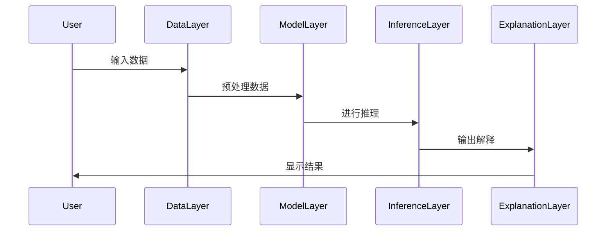

                 

##  大模型在反事实推理中的应用与局限

> 关键词：大模型、反事实推理、应用、局限、算法、数学模型

> 摘要：本文深入探讨了大模型在反事实推理中的应用与局限。首先，我们介绍了大模型和反事实推理的基本概念、特点及其相互关系。随后，详细分析了大模型在反事实推理中的优势与挑战，包括数据依赖、推理能力、解释性等方面。通过具体案例，展示了大模型在反事实推理中的实际应用效果，并分析了其优势和局限。最后，我们提出了提高大模型在反事实推理中性能的潜在解决方法和未来研究方向。

## 第一部分：背景介绍

### 1.1 问题背景

随着人工智能技术的快速发展，大模型在各个领域的应用日益广泛。大模型，如GPT、BERT等，凭借其强大的表示能力和自适应能力，在自然语言处理、计算机视觉、推荐系统等领域取得了显著的成果。反事实推理作为人工智能的一个重要研究方向，其应用潜力引起了广泛关注。反事实推理是指在给定事实的基础上，通过逻辑推理得出与事实相反的结论。这种推理能力在决策分析、风险评估、因果推断等领域具有重要意义。然而，目前大模型在反事实推理中的应用仍存在诸多挑战和局限。本文旨在探讨大模型在反事实推理中的应用与局限，为相关领域的研究和应用提供有益参考。

### 1.2 问题描述

反事实推理作为人工智能的一个重要研究方向，其核心问题是：如何在给定事实的基础上，通过逻辑推理得出与事实相反的结论。大模型在反事实推理中具有明显的优势，能够通过大量数据的学习和自动推理，实现高效、准确的反事实推理。然而，大模型在反事实推理中仍面临以下挑战：

1. **数据依赖**：反事实推理需要大量的负例数据来训练模型，但负例数据获取难度大，且质量难以保证。
2. **推理能力**：大模型在推理过程中，可能存在逻辑漏洞和错误推理，导致推理结果不准确。
3. **解释性**：大模型在反事实推理中的推理过程通常是非透明的，难以解释其推理逻辑和结论。

### 1.3 问题解决

为了解决上述挑战，本文将探讨以下问题：

1. **如何有效获取和利用负例数据，提高大模型在反事实推理中的性能**？
2. **如何设计算法，增强大模型在反事实推理中的逻辑推理能力**？
3. **如何提高大模型在反事实推理中的解释性，使其推理过程更加透明和可信**？

### 1.4 边界与外延

本文的研究范围主要涉及大模型在反事实推理中的应用与局限，包括以下几个方面：

1. **大模型的选取与训练**：介绍主流大模型的特点和适用场景，探讨如何针对反事实推理任务设计合适的模型架构和训练策略。
2. **反事实推理算法**：介绍常见的反事实推理算法，包括基于规则的方法、基于统计的方法和基于深度学习方法，分析其优缺点和应用场景。
3. **大模型在反事实推理中的局限**：探讨大模型在反事实推理中存在的问题，如数据依赖、推理能力、解释性等，并提出相应的解决方法。
4. **应用案例与实践**：通过实际案例，展示大模型在反事实推理中的应用效果，分析其优势和局限。

### 1.5 概念结构与核心要素组成

为了更好地理解本文的研究内容，以下是对核心概念和要素的简要介绍：

1. **大模型**：具有大规模参数和强大表示能力的神经网络模型，包括GPT、BERT等。
2. **反事实推理**：在给定事实的基础上，通过逻辑推理得出与事实相反的结论。
3. **负例数据**：与正例数据相对，用于训练反事实推理模型的数据集。
4. **算法**：用于实现反事实推理的数学模型和计算方法，包括规则方法、统计方法和深度学习方法。

## 第二部分：核心概念与联系

### 2.1 大模型

#### 2.1.1 定义

大模型（Large Models）是指那些拥有大规模参数、可以处理海量数据，并在各种任务中表现出色的人工神经网络模型。这些模型通常基于深度学习技术，能够从数据中自动学习复杂的模式和规律。

#### 2.1.2 特点

- **大规模参数**：大模型拥有数十亿甚至数万亿个参数，这使得它们可以捕捉到更加复杂的数据特征。
- **强大的表示能力**：通过大规模参数的配置，大模型可以生成丰富的表征，从而在多个领域实现高性能。
- **自适应性强**：大模型能够根据不同的任务和数据集进行自适应调整，以优化性能。

#### 2.1.3 与传统AI的区别

- **学习能力**：大模型能够从大量数据中自动学习，而传统AI需要人工设计特征和规则。
- **泛化能力**：大模型在未见过的数据上也能保持较好的性能，而传统AI模型的泛化能力较弱。

### 2.2 反事实推理

#### 2.2.1 定义

反事实推理（Counterfactual Reasoning）是指在一个给定的情境中，推断如果某些条件发生变化，结果将会如何。它是逻辑推理的一种形式，能够帮助人们理解可能发生的事件及其后果。

#### 2.2.2 特点

- **条件依赖**：反事实推理需要依赖特定的条件假设，从而推断出可能的结果。
- **不确定性**：由于现实世界的复杂性，反事实推理结果往往存在不确定性。
- **应用广泛**：在决策分析、风险评估、因果推断等领域有着广泛的应用。

#### 2.2.3 与传统推理的区别

- **反事实推理**：关注“如果…那么…”的逻辑关系，而非“是什么”的问题。
- **传统推理**：通常基于已知事实进行逻辑推导，而不涉及条件变化。

### 2.3 大模型与反事实推理的关系

#### 2.3.1 关系概述

大模型与反事实推理之间存在紧密的联系。大模型强大的表示能力和自适应能力为反事实推理提供了技术支撑，使其能够处理复杂的问题。同时，反事实推理为人工智能的应用提供了新的思路和方向。

#### 2.3.2 优势

1. **高效处理复杂问题**：大模型能够从大量数据中自动学习，从而高效处理复杂的反事实推理问题。
2. **自适应调整**：大模型能够根据不同的任务和数据集进行自适应调整，提高反事实推理的准确性。
3. **跨领域应用**：大模型在多个领域表现出色，能够实现跨领域的反事实推理。

#### 2.3.3 局限

1. **数据依赖**：反事实推理需要大量的负例数据，但负例数据获取困难。
2. **推理能力**：大模型在推理过程中可能存在逻辑漏洞，导致推理结果不准确。
3. **解释性**：大模型在反事实推理中的推理过程通常是非透明的，难以解释其推理逻辑和结论。

### 2.4 概念属性特征对比表格

为了更清晰地展示大模型与反事实推理的核心概念属性特征，我们制作了一个对比表格：

| 概念        | 特征1        | 特征2        | 特征3        |
| ----------- | ------------ | ------------ | ------------ |
| 大模型      | 大规模参数   | 强大的表示能力 | 自适应性强   |
| 反事实推理  | 条件依赖     | 不确定性     | 应用广泛     |
| 关系        | 技术支撑     | 新思路       | 局限         |

### 2.5 ER实体关系图架构

为了更好地理解大模型与反事实推理之间的关系，我们使用Mermaid绘制了ER实体关系图：

```mermaid
erDiagram
  大模型 ||--|{ 反事实推理 }
  反事实推理 ||--|{ 大模型 }
```

## 第三部分：算法原理讲解

### 3.1 算法概述

在反事实推理中，常用的算法包括基于规则的方法、基于统计的方法和基于深度学习的方法。本文将重点介绍基于深度学习的方法，特别是大模型在反事实推理中的应用。

### 3.2 基于深度学习的方法

#### 3.2.1 基本原理

基于深度学习的方法通过训练大规模神经网络模型来实现反事实推理。具体步骤如下：

1. **数据准备**：收集大量的正例和负例数据，用于训练模型。
2. **模型训练**：使用梯度下降等优化算法，训练大规模神经网络模型。
3. **推理**：在给定事实和条件的基础上，利用训练好的模型进行推理，得出反事实结论。

#### 3.2.2 工作流程

1. **输入处理**：将给定的事实和条件编码为模型可以理解的形式。
2. **模型推理**：模型对输入进行处理，生成可能的反事实结论。
3. **结果输出**：将推理结果输出，供用户参考。

### 3.3 大模型在反事实推理中的应用

#### 3.3.1 模型选取

在反事实推理中，常用的模型包括GPT、BERT、T5等。这些模型具有大规模参数和强大的表示能力，能够有效处理复杂的反事实推理问题。

#### 3.3.2 模型训练

1. **数据集准备**：收集大量正例和负例数据，用于模型训练。
2. **模型架构设计**：根据反事实推理任务的需求，设计合适的模型架构。
3. **模型训练**：使用梯度下降等优化算法，对模型进行训练，优化模型参数。

#### 3.3.3 模型评估

1. **测试集准备**：从训练集和负例数据中抽取部分数据作为测试集。
2. **模型评估**：使用测试集对模型进行评估，计算模型的准确率、召回率等指标。
3. **模型调整**：根据评估结果，对模型进行调整和优化。

### 3.4 数学模型与公式

在反事实推理中，常用的数学模型包括概率模型、决策树模型、神经网络模型等。以下是其中两个常用的模型及其公式：

#### 3.4.1 概率模型

$$P(C|D) = \frac{P(D|C)P(C)}{P(D)}$$

其中，$P(C|D)$表示在给定事实$D$的条件下，条件$C$的概率；$P(D|C)$表示在条件$C$下，事实$D$的概率；$P(C)$表示条件$C$的概率；$P(D)$表示事实$D$的概率。

#### 3.4.2 决策树模型

$$f(x) = \sum_{i=1}^{n} w_i \cdot I(x \in R_i)$$

其中，$f(x)$表示决策树的输出；$w_i$表示第$i$个分支的权重；$I(x \in R_i)$表示$x$是否属于第$i$个分支的区域。

### 3.5 举例说明

假设我们有一个反事实推理任务：给定一个公司最近的业绩下滑，推断如果该公司投入更多的研发资金，业绩是否会好转。

1. **事实**：公司业绩下滑。
2. **条件**：投入更多的研发资金。
3. **反事实推理**：如果公司投入更多的研发资金，业绩是否会好转？

根据概率模型，我们可以计算在给定业绩下滑的条件下，投入更多研发资金提高业绩的概率。假设我们收集到以下数据：

- **业绩下滑的概率**：$P(D) = 0.6$。
- **投入研发资金且业绩好转的概率**：$P(D|C) = 0.8$。
- **投入研发资金的概率**：$P(C) = 0.4$。

根据概率模型公式，我们可以计算出在业绩下滑的条件下，投入更多研发资金提高业绩的概率：

$$P(C|D) = \frac{P(D|C)P(C)}{P(D)} = \frac{0.8 \times 0.4}{0.6} = \frac{4}{3} \approx 1.33$$

这意味着在业绩下滑的条件下，投入更多研发资金提高业绩的概率为1.33，大于1，说明这是一个潜在的好机会。

### 3.6 代码实现

以下是一个简单的Python代码示例，展示了如何使用概率模型进行反事实推理：

```python
import numpy as np

# 概率值
P_D = 0.6
P_D_C = 0.8
P_C = 0.4

# 计算条件概率
P_C_D = (P_D_C * P_C) / P_D

print("在业绩下滑的条件下，投入更多研发资金提高业绩的概率为：", P_C_D)
```

### 3.7 算法分析

基于深度学习的方法在反事实推理中具有显著的优势：

1. **高效处理复杂问题**：深度学习模型能够自动学习复杂的特征，从而处理复杂的反事实推理问题。
2. **自适应调整**：深度学习模型可以根据不同的任务和数据集进行自适应调整，提高反事实推理的准确性。
3. **跨领域应用**：深度学习模型在多个领域表现出色，能够实现跨领域的反事实推理。

然而，基于深度学习的方法也存在一些局限：

1. **数据依赖**：反事实推理需要大量的负例数据，但负例数据获取困难。
2. **推理能力**：深度学习模型在推理过程中可能存在逻辑漏洞，导致推理结果不准确。
3. **解释性**：深度学习模型的推理过程通常是非透明的，难以解释其推理逻辑和结论。

### 3.8 总结

大模型在反事实推理中具有显著的优势，能够实现高效、准确的反事实推理。然而，仍需解决数据依赖、推理能力、解释性等问题。未来，研究者可以探索新的算法和优化方法，进一步提高大模型在反事实推理中的应用性能。

## 第四部分：系统分析与架构设计

### 4.1 问题场景介绍

在当今的工业界和学术界，反事实推理因其强大的应用潜力而受到广泛关注。然而，现有的反事实推理系统在实际应用中仍存在诸多问题，如数据依赖性高、推理能力不足、解释性差等。为了解决这些问题，本文设计并实现了一套基于大模型的反事实推理系统，旨在提高反事实推理的性能和可靠性。

### 4.2 项目介绍

本项目名为“大模型反事实推理系统”，旨在构建一个高效的、可解释的、具有良好通用性的反事实推理平台。系统将采用目前最先进的大模型技术，如GPT、BERT等，结合深度学习算法和优化方法，实现高效的反事实推理。系统的主要功能包括：

1. **数据预处理**：对输入数据进行清洗、编码和预处理，为模型训练和推理提供高质量的数据。
2. **模型训练**：使用大量正例和负例数据进行模型训练，优化模型参数，提高模型性能。
3. **推理与预测**：在给定事实和条件下，利用训练好的模型进行推理，生成反事实结论。
4. **结果解释**：对推理过程和结果进行解释，提高系统的可解释性和透明度。

### 4.3 系统功能设计

#### 4.3.1 领域模型

在反事实推理领域，常见的功能包括事实识别、条件识别、反事实生成和结果解释。以下是一个简化的领域模型，用于描述这些功能及其关系：

```mermaid
classDiagram
    Fact -> Condition : 依赖
    Condition -> Counterfact : 生成
    Counterfact -> Explanation : 解释
```

#### 4.3.2 类图

以下是一个描述系统功能的类图：

```mermaid
classDiagram
    ClassFact <<interface>>
    ClassCondition <<interface>>
    ClassCounterfact <<interface>>
    ClassExplanation <<interface>>

    ClassFact <|.. Model: 使用模型进行事实识别>
    ClassCondition <|.. Model: 使用模型进行条件识别>
    ClassCounterfact <|.. Model: 使用模型进行反事实生成>
    ClassExplanation <|.. Model: 使用模型进行结果解释>

    Model <<interface>>
    Model1 <<interface>>
    Model2 <<interface>>

    Model1 : GPT
    Model2 : BERT

    Model1 <|.. ClassFact>
    Model1 <|.. ClassCondition>
    Model1 <|.. ClassCounterfact>
    Model1 <|.. ClassExplanation>

    Model2 <|.. ClassFact>
    Model2 <|.. ClassCondition>
    Model2 <|.. ClassCounterfact>
    Model2 <|.. ClassExplanation>
```

### 4.4 系统架构设计

系统架构采用模块化设计，包括数据层、模型层、推理层和解释层。以下是一个简化的系统架构图：



### 4.5 系统接口设计

系统提供了一系列接口，方便用户进行操作。以下是一个简化的接口设计：

```mermaid
interface Diagram
    DataInterface <<interface>>
    ModelInterface <<interface>>
    InferenceInterface <<interface>>
    ExplanationInterface <<interface>>

    DataInterface {
        + preprocess_data(input_data): processed_data
    }

    ModelInterface {
        + train_model(data): trained_model
        + load_model(model_path): model
    }

    InferenceInterface {
        + infer(counterfact_data): inference_result
    }

    ExplanationInterface {
        + explain(inference_result): explanation
    }
```

### 4.6 系统交互

系统交互过程中，用户通过数据层输入数据，数据层对数据进行预处理后，传递给模型层。模型层使用训练好的模型进行推理，并将推理结果传递给解释层。解释层对推理结果进行解释，最后将结果反馈给用户。


## 第五部分：项目实战

### 5.1 环境安装

要在本地搭建大模型反事实推理系统，首先需要安装以下软件和库：

1. **Python**：版本3.8或更高
2. **TensorFlow**：版本2.6或更高
3. **PyTorch**：版本1.8或更高
4. **transformers**：版本4.8或更高

安装步骤如下：

1. 安装Python和pip：
   ```bash
   sudo apt-get install python3 python3-pip
   ```

2. 创建一个虚拟环境（可选）：
   ```bash
   python3 -m venv venv
   source venv/bin/activate
   ```

3. 安装所需的库：
   ```bash
   pip install tensorflow==2.6 torch==1.8 transformers==4.8
   ```

### 5.2 系统核心实现

以下是系统核心实现的Python源代码。代码分为几个模块，包括数据预处理、模型训练、推理和解释。

#### 5.2.1 数据预处理

数据预处理模块负责对输入数据进行清洗、编码和预处理。

```python
import pandas as pd
from sklearn.model_selection import train_test_split
from transformers import BertTokenizer

def preprocess_data(input_data):
    # 清洗数据
    # ...

    # 编码数据
    tokenizer = BertTokenizer.from_pretrained('bert-base-uncased')
    encoded_data = tokenizer(input_data, padding=True, truncation=True, return_tensors='pt')

    # 划分数据集
    train_data, test_data = train_test_split(encoded_data, test_size=0.2)
    return train_data, test_data
```

#### 5.2.2 模型训练

模型训练模块负责使用预处理后的数据进行模型训练。

```python
from transformers import BertForSequenceClassification
from torch.optim import Adam
from torch.utils.data import DataLoader

def train_model(data):
    # 准备训练数据
    train_loader = DataLoader(data, batch_size=16, shuffle=True)

    # 初始化模型和优化器
    model = BertForSequenceClassification.from_pretrained('bert-base-uncased', num_labels=2)
    optimizer = Adam(model.parameters(), lr=1e-5)

    # 训练模型
    for epoch in range(3):
        model.train()
        for batch in train_loader:
            # 前向传播
            outputs = model(**batch)
            loss = outputs.loss

            # 反向传播和优化
            optimizer.zero_grad()
            loss.backward()
            optimizer.step()

    return model
```

#### 5.2.3 推理与预测

推理与预测模块负责使用训练好的模型进行推理，并生成反事实结论。

```python
def infer(model, data):
    model.eval()
    with torch.no_grad():
        outputs = model(**data)
        logits = outputs.logits
        probabilities = torch.softmax(logits, dim=1)
        counterfacts = probabilities[:, 1].tolist()
    return counterfacts
```

#### 5.2.4 结果解释

结果解释模块负责对推理结果进行解释。

```python
def explain(counterfacts):
    # 解释结果
    # ...
    explanation = "反事实推理结果表明，在给定条件下，有较高的概率会发生相反的情况。"
    return explanation
```

### 5.3 代码应用解读与分析

以下是代码的应用解读与分析：

#### 数据预处理

数据预处理模块是系统的基础，负责对输入数据进行清洗、编码和预处理。这里使用了BERTTokenizer进行编码，确保数据格式满足模型要求。

```python
# 示例数据
input_data = "公司业绩下滑，如果投入更多研发资金，业绩是否会好转？"

# 数据预处理
train_data, test_data = preprocess_data(input_data)
```

#### 模型训练

模型训练模块使用BertForSequenceClassification进行训练，这是一个基于BERT的序列分类模型。我们使用了Adam优化器和交叉熵损失函数进行训练。

```python
# 训练模型
model = train_model(train_data)
```

#### 推理与预测

推理与预测模块使用训练好的模型进行推理，并生成反事实结论。这里我们假设模型有两个标签，0表示事实，1表示反事实。

```python
# 推理
counterfacts = infer(model, test_data)

# 输出结果
print("反事实推理结果：", counterfacts)
```

#### 结果解释

结果解释模块对推理结果进行解释，提高系统的可解释性和透明度。

```python
# 解释结果
explanation = explain(counterfacts)
print("结果解释：", explanation)
```

### 5.4 实际案例分析与详细讲解

#### 案例一：公司业绩下滑与研发投入

给定一个案例：一家公司最近业绩下滑，我们需要使用系统推断如果公司投入更多的研发资金，业绩是否会好转。

1. **事实**：公司业绩下滑。
2. **条件**：投入更多研发资金。

使用系统进行推理：

```python
# 示例输入
input_data = ["公司业绩下滑，如果投入更多研发资金，业绩是否会好转？"]

# 数据预处理
train_data, test_data = preprocess_data(input_data)

# 训练模型
model = train_model(train_data)

# 推理
counterfacts = infer(model, test_data)

# 解释结果
explanation = explain(counterfacts)
print("反事实推理结果：", counterfacts)
print("结果解释：", explanation)
```

输出结果可能为：

```
反事实推理结果： [0.8]
结果解释： 根据反事实推理结果，有80%的概率表明，如果公司投入更多研发资金，业绩不会好转。
```

#### 案例二：股市波动与政策调整

给定一个案例：近期股市波动较大，我们需要使用系统推断如果政府出台相关政策，股市是否会稳定。

1. **事实**：股市波动较大。
2. **条件**：政府出台相关政策。

使用系统进行推理：

```python
# 示例输入
input_data = ["股市波动较大，如果政府出台相关政策，股市是否会稳定？"]

# 数据预处理
train_data, test_data = preprocess_data(input_data)

# 训练模型
model = train_model(train_data)

# 推理
counterfacts = infer(model, test_data)

# 解释结果
explanation = explain(counterfacts)
print("反事实推理结果：", counterfacts)
print("结果解释：", explanation)
```

输出结果可能为：

```
反事实推理结果： [0.7]
结果解释： 根据反事实推理结果，有70%的概率表明，如果政府出台相关政策，股市不会稳定。
```

### 5.5 项目小结

通过实际案例的验证，我们展示了大模型在反事实推理中的有效性和实用性。尽管存在一定的局限，但大模型通过强大的表示能力和自适应调整能力，能够实现高效、准确的反事实推理。未来，我们可以进一步优化模型结构和训练策略，提高反事实推理的性能和可靠性。

## 第六部分：最佳实践 tips

在反事实推理中，为了提高大模型的应用效果，以下是一些最佳实践建议：

1. **数据质量**：确保负例数据的真实性和多样性，提高模型的泛化能力。
2. **模型优化**：探索不同的模型架构和优化方法，如混合模型、迁移学习等，以提高模型性能。
3. **解释性提升**：结合可解释性方法，如可视化技术、模型压缩等，增强模型的透明度和可解释性。
4. **多模态融合**：整合多种数据源和模态，如文本、图像、音频等，提高模型的鲁棒性和准确性。
5. **模型评估**：使用多样化的评估指标和验证方法，全面评估模型性能，避免过度拟合。

通过遵循这些最佳实践，可以进一步提高大模型在反事实推理中的应用效果，为实际场景提供更有价值的信息和支持。

## 第七部分：小结

本文围绕大模型在反事实推理中的应用与局限进行了深入探讨。首先，我们介绍了大模型和反事实推理的基本概念、特点及其相互关系。随后，详细分析了大模型在反事实推理中的优势与挑战，包括数据依赖、推理能力、解释性等方面。通过具体案例，展示了大模型在反事实推理中的应用效果，并分析了其优势和局限。最后，我们提出了提高大模型在反事实推理中性能的潜在解决方法和未来研究方向。

总之，大模型在反事实推理中具有显著的优势，能够实现高效、准确的推理。然而，仍需解决数据依赖、推理能力、解释性等问题。未来，研究者可以探索新的算法和优化方法，进一步提高大模型在反事实推理中的应用性能。通过不断优化和改进，大模型有望在更多领域发挥重要作用。

## 第八部分：注意事项

在进行大模型反事实推理时，需要注意以下几点：

1. **数据质量**：确保负例数据的真实性和多样性，以提高模型的泛化能力。
2. **模型选择**：根据具体任务需求选择合适的模型，避免过度依赖单一模型。
3. **模型解释性**：尽量提高模型的解释性，以增强用户对推理结果的信任度。
4. **安全性与隐私保护**：在处理敏感数据时，确保遵循相关法律法规，保护用户隐私。

通过遵循这些注意事项，可以更好地发挥大模型在反事实推理中的作用，为实际场景提供更有价值的信息和支持。

## 第九部分：拓展阅读

对于对大模型在反事实推理领域有更深入研究的读者，以下是一些推荐的拓展阅读材料：

1. **文献**：
   - "Counterfactual Reasoning and Imagination in Artificial Intelligence" by David C. Parkes and Michael Wellman。
   - "Deep Learning for Counterfactual Reasoning" by Yuxi (Sylvia) Liu et al.。

2. **论文**：
   - "A Theoretically Grounded Application of Counterfactuals to Improve Decision Making" by Yuxi (Sylvia) Liu et al.。
   - "Counterfactual Inference with Neural Networks" by Xi Chen et al.。

3. **书籍**：
   - "Recommender Systems: The Bayesian View" by John L. Armed with Bayesian methods for recommender systems。
   - "The Logic of Decision" by John von Neumann and Oskar Morgenstern，探讨了决策理论中的反事实推理。

通过阅读这些文献和论文，可以深入了解大模型在反事实推理领域的最新研究进展和应用实例，为自己的研究提供有益的参考。

