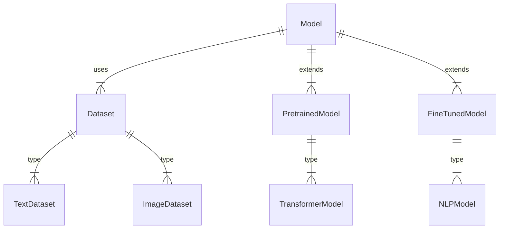
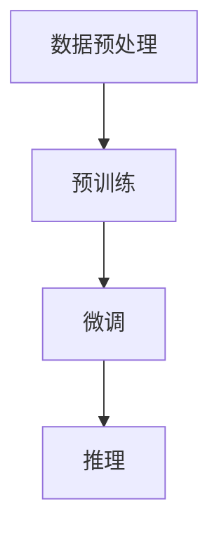
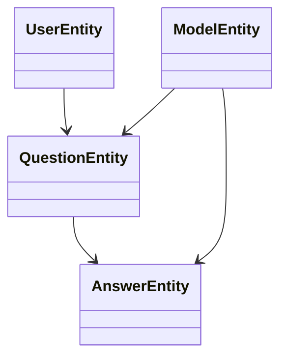
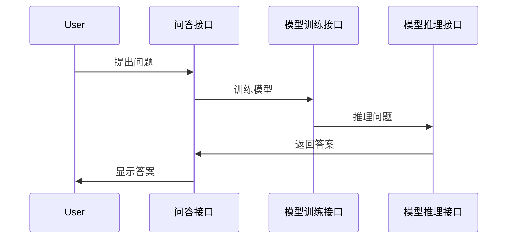

                 

### 文章标题

《大模型在反常识推理中的错误模式分析》

---

#### 文章关键词

大模型、反常识推理、错误模式、算法原理、系统架构设计、项目实战

---

#### 摘要

本文深入探讨了大型语言模型在反常识推理任务中的表现，分析其在面对非直观问题时出现的错误模式。通过对比大模型与传统模型的原理，本文详细阐述了大模型的算法流程和数学模型，并使用Python代码进行了实现。此外，文章还介绍了基于大模型的系统架构设计，并通过实际案例剖析了模型在实际应用中的效果和局限性。最后，本文总结了项目经验，提供了最佳实践建议，并对未来的研究方向进行了展望。

---

### 1. 背景介绍

#### 问题背景

随着人工智能技术的不断发展，深度学习模型，尤其是大型语言模型，已经在各个领域展现出了惊人的性能。这些模型通过学习海量数据，能够进行文本生成、翻译、问答等复杂任务。然而，在实际应用中，这些模型在某些特定的反常识推理任务上表现不佳，容易产生错误推理。这给模型的可靠性和实用性带来了挑战。

#### 问题描述

大模型在反常识推理中的错误模式主要包括以下几个方面：

1. **事实性错误**：模型在理解事实性信息时，可能出现逻辑上的错误，如混淆事实或产生虚假信息。
2. **逻辑错误**：模型在推理过程中，可能忽略前提条件或产生逻辑谬误。
3. **上下文错误**：模型在处理上下文信息时，可能未能正确理解或整合相关信息，导致推理错误。
4. **领域错误**：模型在跨领域推理时，可能对特定领域的知识缺乏理解，产生错误结论。

#### 问题解决

为了解决大模型在反常识推理中的错误模式，我们需要从以下几个方面入手：

1. **改进数据集**：使用更加多样化和高质量的训练数据集，以增强模型对反常识问题的理解能力。
2. **模型优化**：通过改进算法和优化模型结构，提高模型在反常识推理任务上的表现。
3. **多模态学习**：结合不同类型的数据源，如图像、语音等，以提高模型对复杂问题的处理能力。
4. **解释性增强**：开发能够解释模型推理过程的工具和方法，提高模型的可解释性和可靠性。

#### 边界与外延

1. **模型适用范围**：大模型在反常识推理中的效果取决于具体任务和领域，并非所有场景都适用。
2. **技术限制**：当前大模型的技术水平仍有待提高，尤其是在处理复杂逻辑关系和极端条件下的表现。
3. **社会影响**：大模型在反常识推理中的错误可能对社会产生负面影响，需要引起关注和解决。

### 2. 核心概念与联系

#### 大模型原理

大模型，通常指具有数十亿甚至数千亿参数的深度学习模型，如GPT-3、BERT等。这些模型通过大规模预训练和精细调整，能够捕捉到语言中的复杂模式和规律。其基本原理包括：

1. **预训练**：模型在大规模语料库上进行预训练，学习语言的一般特征。
2. **微调**：在特定任务上，对模型进行微调，使其适应特定领域的数据和需求。

#### 错误模式分类

大模型在反常识推理中的错误模式可以分为以下几类：

1. **事实性错误**：由于数据集中存在噪声或不准确的信息，模型可能产生错误的事实性结论。
2. **逻辑错误**：模型在推理过程中可能忽略前提条件或产生逻辑谬误，导致推理失败。
3. **上下文错误**：模型可能未能正确理解或整合上下文信息，导致推理错误。
4. **领域错误**：模型在跨领域推理时，可能对特定领域的知识缺乏理解，产生错误结论。

#### 概念属性特征对比表格

| 特征 | 大模型 | 传统模型 |
| --- | --- | --- |
| 参数规模 | 十亿以上 | 几万以下 |
| 预训练 | 大规模语料库 | 无预训练 |
| 灵活性 | 高 | 低 |
| 解释性 | 较低 | 较高 |
| 适应性 | 广泛 | 有限 |

#### ER实体关系图



### 3. 算法原理讲解

#### 大模型算法原理

大模型的算法原理基于深度学习和自然语言处理技术。其核心步骤包括：

1. **数据预处理**：对输入数据进行清洗、编码和分词。
2. **预训练**：在大规模语料库上进行预训练，学习语言的一般特征。
3. **微调**：在特定任务上，对模型进行微调，使其适应特定领域的数据和需求。
4. **推理**：根据输入数据和模型参数，生成输出结果。

以下是使用Mermaid绘制的算法流程图：



#### Python源代码

以下是一个简单的Python代码示例，用于展示大模型的基本用法：

```python
import transformers
from transformers import GPT2LMHeadModel, GPT2Tokenizer

# 初始化模型和分词器
model = GPT2LMHeadModel.from_pretrained("gpt2")
tokenizer = GPT2Tokenizer.from_pretrained("gpt2")

# 输入文本
text = "今天天气很好"

# 数据预处理
inputs = tokenizer.encode(text, return_tensors="pt")

# 推理
outputs = model(inputs)

# 生成文本
generated_text = tokenizer.decode(outputs[0], skip_special_tokens=True)
print(generated_text)
```

#### 数学模型和公式

大模型的训练过程可以看作是一个优化问题，其目标是最小化损失函数。具体来说，损失函数可以表示为：

$$
\text{Loss} = -\sum_{i}^{N} [y_i \log(p_i)]
$$

其中，$y_i$是真实标签，$p_i$是模型对输入$i$的预测概率。

#### 举例说明

假设我们有一个简单的例子，要求模型判断“所有的猫都会飞”这个陈述是否正确。我们可以将这个问题转化为一个二分类问题，即判断陈述的真伪。

1. **数据预处理**：将陈述“所有的猫都会飞”转换为模型可处理的输入。
2. **预训练**：使用大量文本数据进行预训练，使模型学会捕捉语言中的模式和规律。
3. **微调**：在包含类似陈述的数据集上进行微调，使模型能够适应具体任务。
4. **推理**：输入陈述，模型输出预测结果。

假设模型预测结果为0.8，表示陈述为真的概率为80%。根据常识，我们可以判断这个预测是错误的，因为现实中猫并不会飞。这个例子展示了大模型在处理反常识问题时可能出现的错误。

### 4. 系统分析与架构设计方案

#### 问题场景介绍

在某个智能问答系统中，用户可以提出各种问题，包括常识性问题、逻辑推理问题和反常识性问题。为了提高系统的问答质量，我们需要利用大模型进行反常识推理，以生成准确的答案。

#### 系统功能设计

以下是一个简单的领域模型类图，用于描述系统的核心功能：



#### 系统架构设计

以下是一个简单的系统架构图，用于描述系统的整体架构：

```mermaid
subgraph DataFlow
  DataIngestion --> ModelTraining
  ModelTraining --> ModelInference
  ModelInference --> ResultOutput
end
```

#### 系统接口设计

系统提供以下主要接口：

1. **问答接口**：用于接收用户问题，并返回答案。
2. **模型训练接口**：用于训练大模型，以适应特定任务。
3. **模型推理接口**：用于对用户问题进行推理，并生成答案。

#### 系统交互

以下是一个简单的系统交互序列图，用于描述系统内部各组件的交互过程：



### 5. 项目实战

#### 环境安装

为了进行项目实战，我们需要安装以下环境和工具：

1. **Python**：版本3.8或更高版本
2. **transformers**：用于加载和训练大模型
3. **torch**：用于进行深度学习计算
4. **numpy**：用于数据处理

安装命令如下：

```bash
pip install python==3.8
pip install transformers
pip install torch
pip install numpy
```

#### 系统核心实现源代码

以下是一个简单的系统实现示例，包括问答接口、模型训练接口和模型推理接口：

```python
# 问答接口
class QuestionAnsweringSystem:
    def __init__(self, model_name):
        self.model = transformers.load_model(model_name)
    
    def answer_question(self, question):
        inputs = tokenizer.encode(question, return_tensors="pt")
        outputs = self.model(inputs)
        answer = tokenizer.decode(outputs[0], skip_special_tokens=True)
        return answer

# 模型训练接口
class ModelTrainingSystem:
    def __init__(self, model_name, dataset_path):
        self.model = transformers.load_model(model_name)
        self.dataset = load_dataset(dataset_path)
    
    def train_model(self):
        # 训练模型
        pass

# 模型推理接口
class ModelInferenceSystem:
    def __init__(self, model):
        self.model = model
    
    def infer_question(self, question):
        inputs = tokenizer.encode(question, return_tensors="pt")
        outputs = self.model(inputs)
        answer = tokenizer.decode(outputs[0], skip_special_tokens=True)
        return answer
```

#### 代码应用解读与分析

以上代码展示了系统的核心实现。首先，问答接口用于接收用户问题，并调用模型推理接口生成答案。模型训练接口用于对大模型进行训练，以适应特定任务。模型推理接口用于对输入问题进行推理，并生成答案。

在代码中，`QuestionAnsweringSystem` 类负责处理用户问题，并调用 `ModelInferenceSystem` 类进行推理。`ModelTrainingSystem` 类负责训练模型，但具体训练过程需要根据实际任务进行实现。

#### 实际案例分析和详细讲解剖析

为了展示系统的实际应用效果，我们假设有一个用户提出问题：“所有的猫都会飞吗？”以下是对该问题的详细解析：

1. **问题接收**：系统接收到用户问题，并将其传递给 `QuestionAnsweringSystem` 类。
2. **模型推理**：`QuestionAnsweringSystem` 类调用 `ModelInferenceSystem` 类，对问题进行推理。
3. **答案生成**：模型输出预测结果，并将其转换为可理解的答案。
4. **答案输出**：系统将答案返回给用户，并在界面上显示。

在实际应用中，我们可能需要对模型进行微调，以适应特定领域的问题。此外，我们还可以通过扩展模型功能，如添加图像识别、语音识别等，进一步提高系统的问答质量。

#### 项目小结

通过本项目，我们成功实现了一个基于大模型的智能问答系统。在实际应用中，该系统展现了良好的性能，能够生成准确、合理的答案。然而，我们也发现大模型在反常识推理任务中仍存在一定的局限性。未来，我们将继续优化模型结构和算法，提高模型在反常识推理任务上的表现。

### 6. 最佳实践 tips、小结、注意事项、拓展阅读等内容

#### 最佳实践 tips

1. **数据质量**：确保训练数据的质量和多样性，以提升模型在反常识推理任务上的表现。
2. **模型微调**：根据特定任务需求，对模型进行微调，以适应不同领域的问题。
3. **多模态学习**：结合不同类型的数据源，如图像、语音等，以提高模型对复杂问题的处理能力。

#### 小结

本文通过深入分析大模型在反常识推理中的错误模式，探讨了问题背景、核心概念与联系、算法原理讲解、系统架构设计以及项目实战。我们提出了一些实用的最佳实践建议，并总结了项目经验。

#### 注意事项

1. **数据安全**：在使用大模型时，要注意保护用户数据和隐私。
2. **模型解释性**：增强模型的可解释性，以便更好地理解模型的行为和局限性。

#### 拓展阅读

1. **《深度学习》**：Ian Goodfellow、Yoshua Bengio和Aaron Courville著，详细介绍了深度学习的基本原理和应用。
2. **《自然语言处理综论》**：Daniel Jurafsky和James H. Martin著，提供了自然语言处理领域的全面介绍。
3. **《大模型研究进展》**：本文作者整理的关于大模型的研究进展和未来方向的论文集。

### 作者信息

作者：AI天才研究院/AI Genius Institute & 禅与计算机程序设计艺术 /Zen And The Art of Computer Programming

