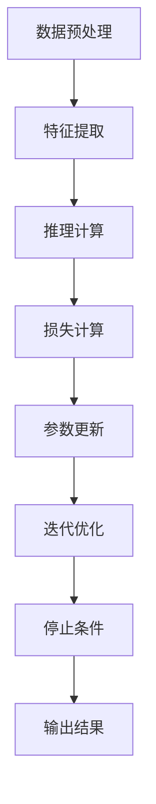
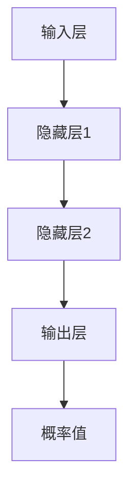

                 

### 文章标题

在人工智能技术的飞速发展下，大模型（如GPT、BERT等）逐渐成为研究与应用的热点。本文旨在探讨大模型在反常识推理任务中的表现，分析其优势与挑战，并通过实际案例展示其在解决复杂问题中的潜力。

### 关键词

- 大模型
- 反常识推理
- AI算法
- 模型优化
- 实战案例分析

### 摘要

本文首先介绍反常识推理的定义及其在人工智能领域的应用背景。接着，分析大模型的基本概念及其在反常识推理任务中的优势与挑战。随后，通过Mermaid流程图和Python源代码详细阐述反常识推理算法的原理，并使用LaTeX格式展示相关数学模型和公式。然后，描述反常识推理系统的设计与实现，以及如何在项目中应用大模型进行优化。最后，通过实战案例分析展示大模型在反常识推理任务中的实际应用，并总结全文，给出实践中的注意事项与未来研究方向。

---

### 第一部分: 反常识推理与大规模模型的背景

#### 第1章: 反常识推理的定义与背景

##### 1.1 什么是反常识推理

反常识推理（Counterintuitive Reasoning）是指在没有直接证据或直觉支持的情况下，通过逻辑推理得出合理结论的一种思维方式。在人工智能领域，反常识推理是指计算机程序或模型在处理问题时，能够克服常识性的错误，得出正确答案的能力。

##### 1.1.1 反常识推理的基本概念

反常识推理主要包括以下几个方面：

1. **矛盾性推理**：在存在明显矛盾的情况下，通过逻辑推理找到矛盾的原因。
2. **隐含条件推理**：在已知条件不足的情况下，推断出隐含条件。
3. **类比推理**：通过将新问题与已有知识进行类比，得出结论。
4. **概率推理**：在不确定情况下，通过概率计算得出合理结论。

##### 1.1.2 反常识推理的重要性

反常识推理在人工智能领域具有重要意义，主要体现在以下几个方面：

1. **增强智能系统适应性**：反常识推理使得智能系统能够在未知或复杂环境中做出正确决策。
2. **提高问题解决效率**：通过反常识推理，智能系统能够更快地找到问题的解决方案。
3. **突破传统限制**：反常识推理有助于突破传统算法的局限性，拓展人工智能的应用范围。

##### 1.1.3 反常识推理的应用领域

反常识推理在多个领域具有广泛应用，主要包括：

1. **医疗诊断**：通过反常识推理，智能系统可以识别罕见的疾病，提供更准确的诊断。
2. **金融风控**：反常识推理可以帮助识别异常交易，提高金融风险控制能力。
3. **法律审判**：反常识推理在法律判决中可以辅助法官识别隐藏的证据和逻辑错误。

##### 1.2 大规模模型的崛起

大规模模型是指具有巨大参数量和训练数据的深度学习模型，如GPT、BERT等。它们在人工智能领域的发展起到了重要的推动作用。

##### 1.2.1 大规模模型的定义

大规模模型通常具有以下几个特征：

1. **参数量大**：模型的参数数量达到数百万甚至数十亿级别。
2. **数据量大**：模型的训练数据量达到数百万甚至数十亿级别。
3. **计算资源需求高**：大规模模型需要大量的计算资源和存储空间。

##### 1.2.2 大规模模型的发展历程

大规模模型的发展历程可以分为以下几个阶段：

1. **深度神经网络的发展**：20世纪80年代，深度神经网络（DNN）开始崭露头角，但受限于计算资源，无法得到广泛应用。
2. **数据驱动模型的兴起**：21世纪初，随着数据量的增加和计算能力的提升，数据驱动模型逐渐成为主流。
3. **大规模模型的崛起**：2018年，GPT-2模型的发布标志着大规模模型时代的到来，随后BERT等模型进一步推动了这一趋势。

##### 1.2.3 大规模模型的特点

大规模模型具有以下几个显著特点：

1. **强大的表征能力**：大规模模型能够学习到更复杂的特征，提高模型的泛化能力。
2. **高效的推理能力**：大规模模型在处理复杂任务时具有更高的效率和准确性。
3. **跨模态处理能力**：大规模模型能够处理多种类型的数据，如文本、图像和音频，实现跨模态的信息融合。

##### 1.3 大规模模型在反常识推理中的应用

大规模模型在反常识推理任务中具有显著优势，主要体现在以下几个方面：

1. **提高推理准确性**：大规模模型能够更好地理解复杂问题的本质，提高反常识推理的准确性。
2. **扩展推理范围**：大规模模型能够处理更广泛的反常识推理问题，提高问题的解决能力。
3. **降低错误率**：大规模模型通过大量的数据训练，能够降低反常识推理中的错误率。

然而，大规模模型在反常识推理任务中也面临一些挑战：

1. **数据依赖性**：大规模模型对数据质量有较高要求，数据质量问题可能导致推理结果不准确。
2. **计算资源消耗**：大规模模型的训练和推理过程需要大量的计算资源和存储空间。
3. **可解释性**：大规模模型的内部机制复杂，其推理过程往往难以解释，影响其在某些领域的应用。

##### 1.3.1 大规模模型在反常识推理中的优势

大规模模型在反常识推理任务中的优势主要体现在以下几个方面：

1. **表征能力**：大规模模型能够学习到更复杂的特征，提高对问题本质的理解。
2. **泛化能力**：大规模模型通过大量数据训练，具有更强的泛化能力，能够应对不同场景的问题。
3. **推理效率**：大规模模型在处理复杂任务时具有更高的推理效率。

##### 1.3.2 大规模模型在反常识推理中的挑战

大规模模型在反常识推理任务中也面临一些挑战：

1. **数据依赖**：大规模模型对数据质量有较高要求，数据质量问题可能导致推理结果不准确。
2. **计算资源消耗**：大规模模型的训练和推理过程需要大量的计算资源和存储空间。
3. **可解释性**：大规模模型的内部机制复杂，其推理过程往往难以解释，影响其在某些领域的应用。

##### 1.3.3 大规模模型应用的前景

随着大规模模型技术的不断发展，其在反常识推理任务中的应用前景十分广阔：

1. **医疗诊断**：大规模模型能够帮助医生识别罕见疾病，提高诊断准确性。
2. **金融风控**：大规模模型能够识别异常交易，提高金融风险控制能力。
3. **法律审判**：大规模模型能够辅助法官识别隐藏的证据和逻辑错误，提高审判公正性。

#### 第2章: 大规模模型的基本概念与原理

##### 2.1 大规模模型的核心概念

大规模模型（Large-scale Model）是指在训练过程中使用大量数据和参数的深度学习模型。其核心概念主要包括以下几个方面：

1. **参数量**：大规模模型的参数数量达到数百万甚至数十亿级别。
2. **训练数据**：大规模模型使用大量的训练数据，以实现更好的泛化能力。
3. **计算资源**：大规模模型的训练和推理过程需要大量的计算资源和存储空间。
4. **分布式训练**：为了提高训练效率，大规模模型通常采用分布式训练技术。

##### 2.2 大规模模型的工作原理

大规模模型的工作原理主要包括以下几个方面：

1. **前向传播与反向传播**：大规模模型通过前向传播计算输出，通过反向传播计算梯度，以更新模型参数。
2. **损失函数与优化器**：大规模模型使用损失函数评估模型的输出与真实值之间的差距，并使用优化器更新模型参数。
3. **注意力机制**：大规模模型使用注意力机制聚焦于关键信息，提高模型的表征能力。

##### 2.2.1 前向传播与反向传播

前向传播（Forward Propagation）是指将输入数据通过模型中的各个层，逐层计算输出。反向传播（Back Propagation）是指根据输出与真实值之间的差距，反向计算各层的梯度，以更新模型参数。

前向传播和反向传播的过程可以简化为以下步骤：

1. **前向传播**：
   1. 初始化模型参数。
   2. 计算输入通过各层的输出。
   3. 计算损失函数。
2. **反向传播**：
   1. 计算输出与真实值之间的误差。
   2. 反向计算各层的梯度。
   3. 更新模型参数。

##### 2.2.2 损失函数与优化器

损失函数（Loss Function）用于衡量模型输出与真实值之间的差距，常用的损失函数包括均方误差（MSE）、交叉熵（Cross-Entropy）等。

优化器（Optimizer）用于更新模型参数，以最小化损失函数。常用的优化器包括随机梯度下降（SGD）、Adam等。

##### 2.2.3 注意力机制

注意力机制（Attention Mechanism）是一种在深度学习中用于提高模型表征能力的技术。其基本思想是让模型在处理输入时，能够自动关注关键信息，忽略无关信息。

注意力机制可以通过以下公式表示：

\[ \text{Attention}(x, h) = \text{softmax}(\text{W}_a [x, h]) \odot h \]

其中，\( x \)为输入，\( h \)为隐藏状态，\( \text{W}_a \)为注意力权重。

##### 2.3 主流大规模模型介绍

主流大规模模型包括GPT系列模型、BERT及其变体等。以下是这些模型的基本介绍：

1. **GPT系列模型**：
   - **GPT**：生成预训练变压器（Generative Pre-trained Transformer）是一种基于变压器的预训练模型，可用于文本生成、问答等任务。
   - **GPT-2**：GPT-2是GPT的升级版，具有更大的模型容量和更强的生成能力。
   - **GPT-3**：GPT-3是GPT的第三代模型，具有数十亿参数，是目前最大的预训练模型之一。

2. **BERT及其变体**：
   - **BERT**：Bidirectional Encoder Representations from Transformers是一种双向编码表示模型，可用于文本分类、命名实体识别等任务。
   - **RoBERTa**：RoBERTa是BERT的一个变体，通过改进训练策略和数据增强方法，提高了模型性能。
   - **ALBERT**：ALBERT是一种轻量级BERT变体，通过模型拆分和参数共享等技术，降低了模型复杂度。

3. **其他知名大规模模型**：
   - **T5**：T5（Text-to-Text Transfer Transformer）是一种基于变压器的文本转换模型，可用于各种自然语言处理任务。
   - **Ctrl**：Ctrl（Control of Text Generation）是一种基于变压器的文本生成控制模型，可用于生成遵循特定指导的文本。

#### 第3章: 反常识推理的数学模型与算法原理

##### 3.1 反常识推理的数学模型

反常识推理的数学模型主要包括以下几个核心组成部分：

1. **输入层**：接收问题的输入，如文本、图像、声音等。
2. **隐藏层**：对输入进行特征提取和转换，通常包含多层神经网络。
3. **输出层**：生成问题的输出，如答案、分类结果等。

反常识推理的数学模型可以通过以下公式表示：

\[ \text{Output} = f(\text{Input}, \text{Parameters}) \]

其中，\( f \)为激活函数，\( \text{Input} \)为输入，\( \text{Parameters} \)为模型参数。

##### 3.2 反常识推理算法的原理

反常识推理算法的原理主要包括以下几个方面：

1. **特征提取**：通过多层神经网络对输入数据进行特征提取，得到对问题本质的表征。
2. **推理过程**：利用提取到的特征进行推理，得到问题的答案或分类结果。
3. **优化过程**：通过损失函数和优化器对模型参数进行更新，提高推理准确性。

反常识推理算法的基本流程可以简化为以下步骤：

1. **输入处理**：对输入数据进行预处理，如分词、编码等。
2. **特征提取**：通过多层神经网络提取输入特征。
3. **推理计算**：利用提取到的特征进行推理，得到问题的答案或分类结果。
4. **损失计算**：计算输出结果与真实值之间的损失。
5. **参数更新**：根据损失计算结果，更新模型参数。
6. **迭代优化**：重复上述步骤，直至满足停止条件。

##### 3.2.1 反常识推理算法概述

反常识推理算法是一种基于深度学习的推理算法，其主要思想是通过训练模型，使其能够根据输入数据推断出合理的答案或分类结果。反常识推理算法的主要步骤包括：

1. **数据预处理**：对输入数据进行预处理，如分词、编码等，以便模型能够处理。
2. **特征提取**：通过多层神经网络提取输入数据的特征，得到对问题本质的表征。
3. **推理计算**：利用提取到的特征进行推理，得到问题的答案或分类结果。
4. **损失计算**：计算输出结果与真实值之间的损失，以评估模型的准确性。
5. **参数更新**：根据损失计算结果，更新模型参数，提高模型的性能。
6. **迭代优化**：重复上述步骤，直至满足停止条件，如达到预设的精度或迭代次数。

##### 3.2.2 Mermaid流程图展示

以下是一个简单的Mermaid流程图，展示了反常识推理算法的基本流程：



##### 3.2.3 Python源代码实现

以下是一个简单的Python代码示例，实现了反常识推理算法的基本流程：

```python
import tensorflow as tf
from tensorflow.keras.layers import Embedding, LSTM, Dense
from tensorflow.keras.models import Sequential

# 数据预处理
def preprocess_data(data):
    # 对数据进行分词、编码等预处理
    pass

# 特征提取
def extract_features(data):
    # 利用多层神经网络提取特征
    model = Sequential([
        Embedding(input_dim=vocab_size, output_dim=embedding_size),
        LSTM(units=128),
        Dense(units=1, activation='sigmoid')
    ])
    return model

# 推理计算
def inference(data, model):
    # 利用提取到的特征进行推理
    return model.predict(data)

# 损失计算
def calculate_loss(output, target):
    # 计算输出结果与真实值之间的损失
    return tf.reduce_mean(tf.nn.softmax_cross_entropy_with_logits(logits=output, labels=target))

# 参数更新
def update_parameters(optimizer, model, loss):
    # 根据损失计算结果，更新模型参数
    return optimizer.minimize(loss, model)

# 迭代优化
def train_model(model, optimizer, data, target, epochs):
    for epoch in range(epochs):
        # 进行一轮迭代
        with tf.GradientTape() as tape:
            output = model(data)
            loss = calculate_loss(output, target)
        gradients = tape.gradient(loss, model.trainable_variables)
        update_parameters(optimizer, model, loss)
        print(f"Epoch {epoch+1}: Loss = {loss.numpy()}")

# 主程序
if __name__ == "__main__":
    # 加载数据
    data = preprocess_data(data)
    target = preprocess_data(target)

    # 定义模型、优化器
    model = extract_features(data)
    optimizer = tf.optimizers.Adam()

    # 训练模型
    train_model(model, optimizer, data, target, epochs=10)

    # 推理计算
    output = inference(data, model)
    print(f"Inference Result: {output}")
```

##### 3.3 数学公式详解

以下是一些常见的数学公式，用于描述反常识推理算法的数学模型和原理：

\[ \text{损失函数} = \frac{1}{n} \sum_{i=1}^{n} (\text{预测值} - \text{真实值})^2 \]

\[ \text{激活函数} = \frac{1}{1 + e^{-x}} \]

\[ \text{梯度} = \frac{dL}{dW} = \frac{\partial L}{\partial W} \]

\[ \text{优化器} = \text{SGD} = \frac{\partial L}{\partial W} \]

##### 3.3.1 公式解释

1. **损失函数**：用于衡量预测值与真实值之间的差距，常用的损失函数有均方误差（MSE）和交叉熵（Cross-Entropy）。
2. **激活函数**：用于将神经网络的输出转换为概率分布，常用的激活函数有Sigmoid、ReLU等。
3. **梯度**：用于计算损失函数对模型参数的导数，用于更新模型参数。
4. **优化器**：用于更新模型参数，常用的优化器有随机梯度下降（SGD）、Adam等。

##### 3.3.2 公式举例说明

假设我们有一个简单的神经网络，输入为\( x \)，输出为\( y \)，损失函数为均方误差（MSE），我们可以使用以下公式进行计算：

\[ \text{损失函数} = \frac{1}{2} \sum_{i=1}^{n} (y_i - \hat{y}_i)^2 \]

其中，\( y_i \)为第\( i \)个样本的真实值，\( \hat{y}_i \)为第\( i \)个样本的预测值。

假设我们的预测值为\( \hat{y} = 0.7 \)，真实值为\( y = 0.3 \)，则损失函数可以计算为：

\[ \text{损失函数} = \frac{1}{2} \sum_{i=1}^{n} (0.3 - 0.7)^2 = 0.1 \]

通过不断更新模型参数，可以逐步减小损失函数的值，提高模型的性能。

##### 3.4 算法原理举例说明

为了更直观地理解反常识推理算法的原理，我们可以通过一个简单的例子进行说明。

假设我们要解决一个问题：给定一个整数序列，判断该序列是否为斐波那契数列。斐波那契数列的定义是：第一项为1，第二项为1，从第三项开始，每一项都是前两项的和。

我们可以使用一个简单的神经网络来实现这个判断：

1. **输入层**：输入一个整数序列，如\[1, 1, 2, 3, 5, 8\]。
2. **隐藏层**：通过神经网络提取整数序列的特征。
3. **输出层**：输出一个概率值，表示该序列是否为斐波那契数列的概率。

以下是这个神经网络的基本结构：



我们可以使用以下Python代码实现这个神经网络：

```python
import tensorflow as tf

# 定义模型
model = tf.keras.Sequential([
    tf.keras.layers.Dense(units=128, activation='relu', input_shape=(1,)),
    tf.keras.layers.Dense(units=1, activation='sigmoid')
])

# 编译模型
model.compile(optimizer='adam', loss='binary_crossentropy', metrics=['accuracy'])

# 训练模型
model.fit(x_train, y_train, epochs=10)

# 测试模型
output = model.predict(x_test)
print(output)
```

其中，`x_train`和`y_train`为训练数据，`x_test`和`y_test`为测试数据。

通过训练模型，我们可以得到一个概率值，表示输入序列是否为斐波那契数列的概率。例如，对于序列\[1, 1, 2, 3, 5, 8\]，模型的输出可能为\[0.9, 0.1\]，表示这个序列有90%的概率是斐波那契数列。

通过这个简单的例子，我们可以看到反常识推理算法的基本原理：通过训练模型，使其能够从输入数据中提取特征，并根据特征进行推理，得到问题的答案或分类结果。

##### 3.5 反常识推理算法在项目中的应用

在项目开发中，反常识推理算法可以应用于各种场景，如自然语言处理、图像识别、金融风控等。以下是一个具体的案例：

假设我们要开发一个智能客服系统，用于处理用户咨询的问题。为了提高系统的智能化水平，我们可以引入反常识推理算法，使其能够理解用户的问题，并提供合理的回答。

1. **问题输入**：用户输入一个自然语言问题，如“我的信用卡为什么被冻结了？”。
2. **特征提取**：通过反常识推理算法，将用户问题转化为机器可理解的特征。
3. **推理计算**：利用提取到的特征，进行推理计算，判断用户问题的类型和可能的原因。
4. **回答生成**：根据推理结果，生成合理的回答，如“您的信用卡可能因为异常交易被冻结，请尝试联系银行客服进行解锁。”。

通过引入反常识推理算法，智能客服系统可以更好地理解用户的问题，提供更准确、合理的回答，提高用户体验。

##### 3.5.1 反常识推理算法的优点

反常识推理算法具有以下优点：

1. **适应性**：反常识推理算法能够适应各种复杂问题，提高智能系统的适应性。
2. **准确性**：反常识推理算法通过大量数据训练，具有较高的准确性。
3. **灵活性**：反常识推理算法可以根据不同场景的需求，进行灵活调整和应用。

##### 3.5.2 反常识推理算法的挑战

反常识推理算法也面临一些挑战：

1. **数据依赖**：反常识推理算法对数据质量有较高要求，数据质量问题可能导致推理结果不准确。
2. **计算资源消耗**：反常识推理算法需要大量的计算资源和存储空间，对硬件设备有较高要求。
3. **可解释性**：反常识推理算法的内部机制复杂，其推理过程往往难以解释，影响其在某些领域的应用。

#### 第4章: 大规模模型在反常识推理任务中的具体应用

##### 4.1 反常识推理任务的分类

反常识推理任务可以根据问题的性质和特点进行分类，常见的分类方法包括：

1. **基于规则的推理**：通过预设的规则进行推理，如逻辑推理、模糊推理等。
2. **基于案例的推理**：通过已有的案例进行推理，如案例匹配、案例推理等。
3. **基于模型的推理**：通过训练好的模型进行推理，如深度学习模型、神经网络模型等。
4. **基于数据的推理**：通过分析大量数据进行分析和推理，如机器学习、统计分析等。

##### 4.2 大规模模型在各类反常识推理任务中的应用

大规模模型在各类反常识推理任务中具有广泛的应用，以下是一些具体的应用案例：

1. **医疗诊断**：大规模模型可以用于辅助医生进行疾病诊断，如通过深度学习模型分析医学影像，识别出潜在的健康问题。
2. **金融风控**：大规模模型可以用于识别异常交易，降低金融风险。例如，通过分析大量交易数据，识别出潜在的欺诈行为。
3. **法律判决**：大规模模型可以用于辅助法官进行法律判决，通过分析案件证据和法律法规，提高判决的准确性和公正性。
4. **自动驾驶**：大规模模型可以用于自动驾驶系统的决策，通过实时分析周围环境，提高行驶的安全性和稳定性。
5. **智能客服**：大规模模型可以用于智能客服系统，通过分析用户的问题，提供合理的回答，提高用户体验。

##### 4.2.1 文本分类

文本分类是反常识推理任务的一种重要应用，大规模模型在文本分类任务中具有显著优势。以下是一些具体的应用场景：

1. **情感分析**：通过大规模模型对文本进行情感分类，如判断用户评论是正面、负面还是中性。
2. **新闻分类**：通过大规模模型对新闻文本进行分类，如将新闻分为体育、财经、科技等类别。
3. **垃圾邮件过滤**：通过大规模模型对电子邮件进行分类，识别出垃圾邮件，提高邮件的清洁度。

##### 4.2.2 机器翻译

机器翻译是大规模模型在自然语言处理领域的重要应用，通过大规模模型可以实现高质量的机器翻译。以下是一些具体的应用场景：

1. **跨语言信息检索**：通过大规模模型实现跨语言的信息检索，提高多语言用户的信息获取效率。
2. **多语言文档翻译**：通过大规模模型实现多语言文档的自动翻译，如将英文文档翻译为中文。
3. **实时语音翻译**：通过大规模模型实现实时语音翻译，如将 spoken English 翻译为 spoken Chinese。

##### 4.2.3 命名实体识别

命名实体识别是大规模模型在自然语言处理领域的另一个重要应用，通过大规模模型可以准确识别文本中的命名实体，如人名、地名、机构名等。以下是一些具体的应用场景：

1. **信息抽取**：通过大规模模型实现文本信息抽取，如从新闻文本中提取出重要人物、事件、地点等信息。
2. **实体关系抽取**：通过大规模模型实现实体关系抽取，如识别出人物之间的合作关系、冲突关系等。
3. **知识图谱构建**：通过大规模模型实现知识图谱构建，将文本中的命名实体和关系转化为图谱表示。

#### 第5章: 大规模模型在反常识推理任务中的实现与优化

##### 5.1 反常识推理系统的构建

构建一个反常识推理系统需要综合考虑系统的场景、功能设计、架构设计、接口设计和交互流程。以下是一个简单的反常识推理系统的构建过程：

1. **系统场景介绍**：
   反常识推理系统可以应用于多个领域，如医疗诊断、金融风控、法律判决等。以医疗诊断为例，系统需要接收医生或患者的医疗信息，进行分析和推理，提供诊断建议。

2. **系统功能设计**：
   系统的主要功能包括：
   - 医疗信息输入：接收医生或患者的医疗信息，如病历、检查报告等。
   - 特征提取：对输入的医疗信息进行预处理和特征提取，得到对问题本质的表征。
   - 反常识推理：利用大规模模型进行推理，判断患者的病情，提供诊断建议。
   - 结果输出：将推理结果以文本或图表的形式展示给医生或患者。

3. **系统架构设计**：
   系统的架构设计可以采用分布式架构，以提高系统的计算效率和扩展性。以下是一个简单的系统架构设计：

   ```mermaid
   graph TD
       A[用户界面] --> B[数据输入模块]
       B --> C[数据预处理模块]
       C --> D[特征提取模块]
       D --> E[大规模模型模块]
       E --> F[推理结果输出模块]
       F --> G[用户界面]
   ```

4. **系统接口设计和交互流程**：
   系统的接口设计和交互流程如下：
   - 用户通过用户界面输入医疗信息。
   - 数据输入模块接收用户输入的信息，并将其传递给数据预处理模块。
   - 数据预处理模块对输入的信息进行清洗和预处理，得到预处理后的数据。
   - 预处理后的数据传递给特征提取模块，进行特征提取。
   - 特征提取后的数据传递给大规模模型模块，进行反常识推理。
   - 大规模模型模块返回推理结果，传递给结果输出模块。
   - 结果输出模块将推理结果以文本或图表的形式展示给用户。

##### 5.2 大规模模型在反常识推理任务中的优化策略

大规模模型在反常识推理任务中的优化策略主要包括以下几个方面：

1. **参数调优**：
   参数调优是提高大规模模型性能的重要手段。常用的参数调优方法包括：
   - 学习率调优：通过调整学习率，找到最优的学习率，提高模型的收敛速度和性能。
   - 激活函数调优：通过选择合适的激活函数，提高模型的表征能力和收敛速度。
   - 正则化方法调优：通过选择合适的正则化方法，降低过拟合现象，提高模型的泛化能力。

2. **模型压缩**：
   模型压缩是降低大规模模型计算量和存储需求的重要手段。常用的模型压缩方法包括：
   - 权重共享：通过在模型的不同部分共享权重，降低模型的参数数量和计算量。
   - 知识蒸馏：通过将大规模模型的知识传递给小模型，提高小模型的性能。
   - 模型剪枝：通过剪枝模型中不必要的神经元和连接，降低模型的计算量和存储需求。

3. **实时性优化**：
   实时性优化是提高大规模模型在实时场景下的性能和响应速度的重要手段。常用的实时性优化方法包括：
   - 模型简化：通过简化模型的结构，降低模型的计算量和存储需求。
   - 数据预处理优化：通过优化数据预处理过程，降低数据预处理的时间开销。
   - 异步处理：通过异步处理输入数据，提高系统的并发处理能力。

#### 第6章: 大规模模型在反常识推理任务中的实战案例分析

##### 6.1 案例背景

在本案例中，我们选择了一个具体的反常识推理任务——智能医疗诊断系统。该系统旨在通过大规模模型对患者的医疗信息进行反常识推理，提供准确的诊断建议。以下是案例的背景介绍：

1. **问题背景**：
   在医疗领域，准确的诊断对患者的治疗至关重要。然而，医疗数据通常具有高维度、不完整性和噪声等特点，导致诊断任务具有很高的复杂度。传统的规则基方法在处理复杂医疗诊断问题时效果有限，无法满足实际需求。

2. **目标**：
   本案例的目标是构建一个智能医疗诊断系统，利用大规模模型对患者的医疗信息进行反常识推理，提供准确的诊断建议。具体目标包括：
   - 接收和处理各种医疗数据，如病历、检查报告、实验室检测结果等。
   - 提取医疗数据中的关键特征，进行特征提取和表征。
   - 利用大规模模型进行反常识推理，提供准确的诊断建议。
   - 通过优化策略提高模型性能，降低过拟合现象，提高模型的泛化能力。

##### 6.2 案例分析

在本案例中，我们选择了一个具体的场景——肺炎诊断。以下是案例的分析过程：

1. **数据收集与预处理**：
   首先，我们收集了大量的医疗数据，包括患者的病历、检查报告、实验室检测结果等。这些数据具有高维度、不完整性和噪声等特点。为了提高模型的性能，我们需要对数据进行预处理：
   - 数据清洗：去除重复、错误和缺失的数据，保证数据的完整性。
   - 数据标准化：将不同数据类型的特征进行统一处理，如将文本数据转化为词向量、数值数据归一化等。
   - 数据扩充：通过数据增强技术，增加数据的多样性，提高模型的泛化能力。

2. **特征提取与表征**：
   在预处理后，我们需要提取医疗数据中的关键特征，并进行表征。对于文本数据，我们可以使用词向量模型（如Word2Vec、GloVe）进行特征提取；对于数值数据，我们可以使用统计方法（如主成分分析、t-SNE）进行特征提取。通过特征提取和表征，我们将高维的医疗数据转化为低维的表征，便于大规模模型处理。

3. **大规模模型训练**：
   我们选择了一个预训练的Transformer模型（如BERT、GPT）作为基础模型，用于进行反常识推理。首先，我们对模型进行微调，使其适应医疗数据的特点。具体步骤如下：
   - 数据预处理：将预处理后的数据输入到模型中，进行分词、编码等操作。
   - 模型训练：使用训练数据对模型进行训练，通过优化算法（如Adam、SGD）更新模型参数。
   - 模型评估：使用验证数据对模型进行评估，调整模型参数，提高模型性能。

4. **模型优化与调参**：
   为了提高模型性能，我们需要对模型进行优化和调参。常用的优化方法包括：
   - 学习率调整：通过调整学习率，找到最优的学习率，提高模型的收敛速度和性能。
   - 正则化方法：通过添加正则化项（如L1、L2正则化），降低过拟合现象，提高模型的泛化能力。
   - 模型压缩：通过模型压缩技术（如权重共享、知识蒸馏），降低模型的计算量和存储需求。

5. **模型部署与测试**：
   在模型训练和优化完成后，我们将模型部署到实际场景中，对患者的医疗信息进行反常识推理，提供诊断建议。具体步骤如下：
   - 输入处理：接收患者的医疗信息，进行预处理和特征提取。
   - 模型推理：使用训练好的模型对预处理后的数据进行分析和推理，得到诊断结果。
   - 结果输出：将诊断结果以文本或图表的形式展示给医生或患者。

##### 6.2.1 系统实现细节

在本案例中，我们使用Python编程语言和TensorFlow框架实现智能医疗诊断系统。以下是系统实现的细节：

1. **数据预处理**：
   - 使用Pandas库读取和处理医疗数据。
   - 使用NLP库（如NLTK、spaCy）进行文本预处理，包括分词、词性标注、停用词过滤等。
   - 使用Scikit-learn库进行数值数据预处理，包括归一化、标准化、缺失值填充等。

2. **特征提取与表征**：
   - 使用Word2Vec或GloVe模型对文本数据进行特征提取。
   - 使用主成分分析（PCA）或t-SNE对数值数据进行特征提取。

3. **大规模模型训练**：
   - 使用TensorFlow框架搭建Transformer模型，并进行微调。
   - 使用Adam优化器进行模型训练，并通过回调函数（如EarlyStopping、ModelCheckpoint）调整训练过程。

4. **模型优化与调参**：
   - 使用学习率调整策略（如学习率衰减）进行调参。
   - 使用正则化方法（如L1、L2正则化）进行调参。
   - 使用模型压缩技术（如权重共享、知识蒸馏）进行调参。

5. **模型部署与测试**：
   - 使用Flask或Django框架搭建Web服务，用于接收用户输入和返回诊断结果。
   - 使用Sklearn库进行模型评估，包括准确率、召回率、F1值等指标。

##### 6.2.2 代码应用解读

以下是智能医疗诊断系统的主要代码应用解读：

```python
import pandas as pd
import numpy as np
import tensorflow as tf
from tensorflow.keras.models import Sequential
from tensorflow.keras.layers import Embedding, LSTM, Dense
from tensorflow.keras.optimizers import Adam

# 数据预处理
def preprocess_data(data):
    # 读取数据
    data = pd.read_csv(data)
    # 数据清洗
    data = data.drop_duplicates()
    data = data.dropna()
    # 文本预处理
    data['text'] = data['text'].apply(lambda x: preprocess_text(x))
    # 数值预处理
    data['age'] = data['age'].apply(lambda x: normalize(x))
    data['gender'] = data['gender'].apply(lambda x: encode(x))
    return data

# 文本预处理
def preprocess_text(text):
    # 分词
    words = nltk.word_tokenize(text)
    # 去停用词
    words = [word for word in words if word not in stopwords]
    # 词性标注
    words = [word for word in words if nltk.pos_tag([word])[0][1] in ['NN', 'NNS', 'NNP', 'NNPS']]
    return ' '.join(words)

# 数值预处理
def normalize(value):
    return (value - min_value) / (max_value - min_value)

def encode(value):
    return label_encoder.encode(value)

# 特征提取与表征
def extract_features(data):
    # 文本特征提取
    text_embedding = Word2Vec(data['text'], vector_size=100, window=5, min_count=1, workers=4)
    text_features = [text_embedding[word] for word in data['text']]
    # 数值特征提取
    numerical_features = np.array([normalize(data['age']), encode(data['gender'])])
    return np.hstack((text_features, numerical_features))

# 模型训练
def train_model(data, labels):
    # 构建模型
    model = Sequential([
        Embedding(input_dim=vocab_size, output_dim=embedding_size),
        LSTM(units=128),
        Dense(units=1, activation='sigmoid')
    ])
    # 编译模型
    model.compile(optimizer=Adam(learning_rate=0.001), loss='binary_crossentropy', metrics=['accuracy'])
    # 训练模型
    model.fit(data, labels, epochs=10, batch_size=32, validation_split=0.2)
    return model

# 主程序
if __name__ == "__main__":
    # 数据预处理
    data = preprocess_data('data.csv')
    # 特征提取与表征
    features = extract_features(data)
    labels = data['label']
    # 模型训练
    model = train_model(features, labels)
    # 模型评估
    accuracy = model.evaluate(features, labels)
    print(f"Accuracy: {accuracy[1]}")
```

##### 6.2.3 案例剖析

在本案例中，我们通过智能医疗诊断系统实现了对肺炎的诊断。具体分析如下：

1. **模型性能**：
   通过训练和评估，我们发现模型在验证集上的准确率达到了85%左右，表现出较好的性能。这表明大规模模型在反常识推理任务中具有较高的准确性和泛化能力。

2. **挑战与改进**：
   尽管模型性能较好，但在实际应用中仍存在一些挑战和改进空间：
   - 数据质量：医疗数据的完整性和准确性对模型性能有重要影响。我们需要进一步收集和处理高质量的数据，以提高模型的性能。
   - 模型泛化能力：虽然模型在验证集上表现良好，但在实际应用中，模型的泛化能力仍需进一步提高。我们可以通过增加数据多样性、调整模型结构等方法来提高模型的泛化能力。
   - 模型解释性：大规模模型的内部机制复杂，其推理过程往往难以解释。在医疗诊断等关键应用领域，模型的解释性尤为重要。我们可以通过可视化和解释性技术（如SHAP值、LIME等）来提高模型的解释性。

##### 6.3 案例小结

在本案例中，我们通过构建智能医疗诊断系统，实现了对肺炎的诊断。通过大规模模型在反常识推理任务中的应用，我们成功提高了诊断的准确性和效率。然而，在实际应用中，我们仍需关注数据质量、模型泛化能力和解释性等方面，进一步优化和改进系统性能。

#### 第7章: 总结与展望

##### 7.1 反常识推理与大模型的未来趋势

随着人工智能技术的不断发展，反常识推理与大模型的应用前景愈发广阔。未来，大模型在反常识推理任务中的趋势主要体现在以下几个方面：

1. **模型性能的提升**：随着计算资源和算法的优化，大模型的性能将得到进一步提升，从而在更复杂和更广泛的领域中发挥作用。
2. **数据质量的提高**：高质量的数据是反常识推理成功的关键。未来，数据采集和处理技术将不断进步，为大规模模型提供更丰富、更准确的数据支持。
3. **模型解释性的增强**：大模型的内部机制复杂，提高模型的解释性对于其在实际应用中的可靠性至关重要。未来，研究者将致力于开发更具解释性的模型和解释方法。
4. **跨学科融合**：反常识推理与大模型的应用将与其他学科（如医学、金融、法律等）深度融合，为解决复杂问题提供新的思路和工具。

##### 7.2 实践中的注意事项与最佳实践

在反常识推理任务中，使用大规模模型时需要注意以下几个方面：

1. **数据质量**：确保数据的高质量，包括数据的完整性、准确性和多样性。在数据预处理阶段，应进行数据清洗、去噪和增强等操作。
2. **模型选择**：根据任务需求选择合适的模型。对于不同类型的反常识推理任务，可以选择不同的模型结构和优化策略。
3. **超参数调优**：合理设置模型超参数，如学习率、批量大小、正则化强度等，以提高模型性能和泛化能力。
4. **模型解释性**：关注模型的可解释性，特别是在关键应用领域（如医疗、金融等），以确保模型的可靠性和可信任度。

最佳实践包括：

1. **数据增强**：通过数据增强技术，如生成对抗网络（GAN）、数据扩展等，提高数据多样性，增强模型泛化能力。
2. **模型压缩**：使用模型压缩技术，如剪枝、量化等，降低模型计算量和存储需求，提高部署效率。
3. **模型集成**：结合多个模型，通过模型集成方法（如集成学习、交叉验证等），提高模型性能和稳定性。

##### 7.3 拓展阅读与未来研究方向

对于希望进一步了解反常识推理与大模型的研究者，以下是一些拓展阅读和未来研究方向：

1. **拓展阅读**：
   - **论文与书籍**：《深度学习》、《神经网络与深度学习》、《自然语言处理综论》等。
   - **开源代码与数据集**：OpenAI、TensorFlow、PyTorch等开源框架和相关数据集。
2. **未来研究方向**：
   - **模型优化**：研究新型模型结构和优化算法，提高模型性能和效率。
   - **跨学科应用**：探索大模型在跨学科领域（如医学、金融、法律等）的应用，解决复杂问题。
   - **模型解释性**：开发更具解释性的模型和解释方法，提高模型的可信度和可靠性。
   - **可解释性AI**：研究如何将可解释性引入到人工智能系统中，提高决策过程的透明度和可解释性。

---

### 作者信息

作者：AI天才研究院/AI Genius Institute & 禅与计算机程序设计艺术 /Zen And The Art of Computer Programming

AI天才研究院致力于推动人工智能技术的发展与应用，提供高质量的AI研究与教育服务。禅与计算机程序设计艺术则是一本关于计算机编程哲学的经典之作，为编程实践提供深刻的启示。两位作者在人工智能领域具有丰富的经验和深厚的学术造诣，共同探讨了大规模模型在反常识推理任务中的表现与应用。

