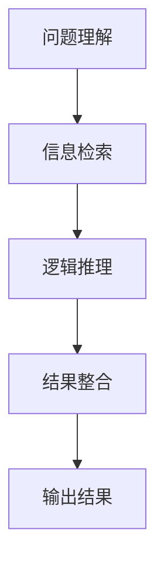
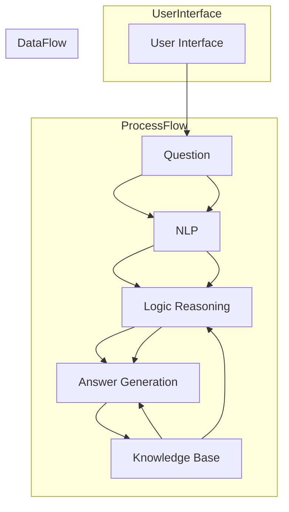
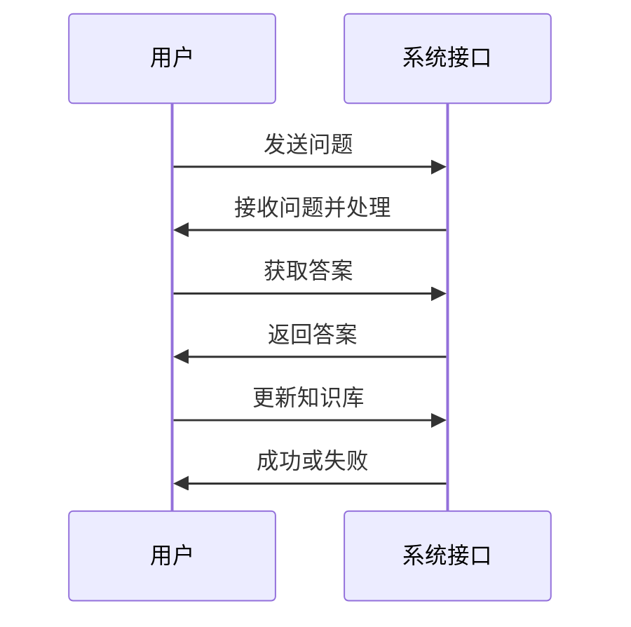
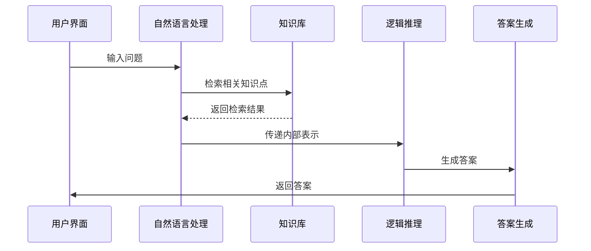

                 

### 第1章 引言

#### 1.1 问题背景

多步骤推理任务在人工智能领域扮演着至关重要的角色。这类任务要求系统能够理解并处理一系列步骤，从初始输入逐步推导出结论。例如，在自然语言处理（NLP）中，多步骤推理可以用于复杂问题的解答，从问题理解到回答生成，每一个步骤都需要精准的逻辑推理。随着人工智能技术的不断进步，大模型如GPT-3、BERT等已经被广泛应用于各种多步骤推理任务中，展现出了强大的能力。

然而，尽管大模型在多步骤推理任务中取得了显著的成果，但依然面临着诸多挑战。首先是计算资源的高消耗，大模型的训练和推理需要大量的计算资源和时间。其次是模型理解和解释能力的不足，大模型虽然能够进行复杂的推理，但其内部机制往往不够透明，使得人们难以理解其推理过程。最后，大模型在面对不确定性数据时的表现也不尽如人意，这对多步骤推理任务的准确性提出了挑战。

#### 1.2 问题描述

多步骤推理任务的特点在于其复杂性和多层次性。这类任务通常包含多个相互关联的步骤，每个步骤都需要对前一个步骤的结果进行解析和利用。例如，在问答系统中，问题理解、信息检索、答案生成等步骤构成了一个完整的多步骤推理过程。这些步骤不仅需要模型具备强大的理解能力，还需要其在不同步骤之间保持一致性和连贯性。

大模型在多步骤推理中面临的挑战主要体现在以下几个方面：

1. **资源消耗**：大模型的训练和推理需要巨大的计算资源，这对硬件设施和能源供应提出了高要求。
2. **解释性**：大模型的内部工作机制往往不够透明，难以解释，这使得其在某些场景中的使用受到限制。
3. **不确定性处理**：在处理不确定性数据时，大模型的表现不稳定，可能导致推理结果的不准确。

#### 1.3 问题解决

为了解决多步骤推理任务中大模型面临的挑战，我们需要从多个方面进行优化。以下是一些可能的优化方法：

1. **数据增强**：通过增加训练数据量和多样性，提高模型在多步骤推理中的鲁棒性和准确性。
2. **模型训练策略**：调整训练过程，如优化学习率、调整批次大小等，以提高模型的收敛速度和性能。
3. **模型压缩与加速**：通过模型剪枝、量化等技术，减小模型大小，加快推理速度。
4. **模型融合**：结合多个模型的优势，提高整体推理任务的性能。

优化目标在于提高模型的推理效率、准确性和可解释性，使其能够更好地应对复杂的多步骤推理任务。

#### 1.4 边界与外延

多步骤推理任务可以细分为多个子类，如问答系统、文本生成、机器翻译等。每个子类都有其特定的应用场景和挑战。例如，在机器翻译中，多步骤推理涉及到语言的理解、语法分析、语义翻译等步骤，而这些问题在不同的语言和文化背景下有不同的表现。

大模型的优化方法在不同应用场景中也有所差异。例如，在资源受限的边缘设备上，模型压缩和加速尤为重要；而在需要高解释性的应用场景中，透明性和可解释性则是首要考虑的因素。

#### 1.5 概念结构与核心要素组成

多步骤推理任务中的核心概念包括问题输入、中间结果、最终输出以及各步骤之间的逻辑关系。大模型优化的关键要素则包括数据质量、训练策略、模型结构和推理算法。

在本文中，我们将详细探讨这些概念和要素，并通过具体的算法原理、数学模型和实战案例，深入分析大模型在多步骤推理任务中的优化方法。

### 第2章 多步骤推理任务的算法原理

#### 2.1 多步骤推理任务的算法原理

多步骤推理任务的核心在于将一个复杂的问题分解为多个可管理的子问题，并通过一系列逻辑步骤逐一解决。这个过程可以通过Mermaid流程图来直观地展示。

首先，我们定义问题的输入为`I`，输出为`O`。多步骤推理任务可以分为以下几个基本步骤：

1. **问题理解**：将输入问题`I`转换为模型可以理解的内部表示。
2. **信息检索**：从已有知识库中检索与问题相关的信息。
3. **逻辑推理**：利用检索到的信息进行逻辑推理，推导出中间结果。
4. **结果整合**：将多个中间结果整合为最终的输出结果`O`。

以下是多步骤推理任务的Mermaid流程图：



在这个流程图中，每个步骤都是一个独立的处理模块，它们通过输入和输出的方式相互连接。问题理解模块将原始问题转换为内部表示，信息检索模块从知识库中获取相关信息，逻辑推理模块使用这些信息进行推理，最终结果整合模块将多个推理结果整合为最终输出。

#### 2.2 大模型的结构与特点

大模型通常是指拥有数亿甚至数十亿参数的大型神经网络模型，如GPT-3、BERT等。这些模型的结构复杂，参数众多，具有以下特点：

1. **深度神经网络**：大模型通常采用深度神经网络架构，通过多层神经网络结构来提取复杂的特征。
2. **大规模参数**：大模型拥有数亿甚至数十亿参数，这使得模型在处理复杂数据时具有更强的表达能力。
3. **多任务能力**：大模型可以通过预训练和微调，适应多种任务，具备跨任务的泛化能力。

为了对比大模型与其他模型的核心结构特点，我们可以使用Mermaid实体关系图来展示。以下是两个模型的属性特征对比表格和Mermaid实体关系图：

**属性特征对比表格：**

| 特征          | 小模型       | 大模型       |
|--------------|--------------|--------------|
| 参数规模      | 数百万       | 数亿到数十亿 |
| 神经网络深度  | 几层到几十层 | 数十层以上   |
| 特征提取能力  | 一般         | 强大         |
| 多任务能力    | 有限         | 良好         |
| 解释性        | 较好         | 较差         |

**Mermaid实体关系图：**

```mermaid
erDiagram
  A[小模型] ||--|{ 信息检索 }
  A ||--|{ 逻辑推理 }
  A ||--|{ 结果整合 }
  B[大模型] ||--|{ 信息检索 }
  B ||--|{ 逻辑推理 }
  B ||--|{ 结果整合 }
```

在这个实体关系图中，`小模型`和`大模型`通过信息检索、逻辑推理和结果整合三个核心功能模块相连。大模型在处理多步骤推理任务时，由于其参数规模和深度更广，因此能够提取更复杂的特征，具备更强的推理能力。

#### 2.3 大模型在多步骤推理中的应用

大模型在多步骤推理任务中具有显著的优势，但也面临一些挑战。以下是大模型在多步骤推理中的优势与挑战，以及一个具体的应用案例分析。

**优势：**

1. **强大的特征提取能力**：大模型可以通过预训练在大规模数据上学习到丰富的语言特征，为多步骤推理任务提供坚实的基础。
2. **高效的推理速度**：大模型的并行计算能力使得其在处理多步骤推理任务时具有较高的推理速度。
3. **跨任务学习能力**：大模型可以通过迁移学习，将一个任务的学习成果应用到其他任务中，提高整个系统的性能。

**挑战：**

1. **计算资源消耗**：大模型的训练和推理需要大量的计算资源，这对硬件设施提出了高要求。
2. **解释性不足**：大模型的内部工作机制复杂，难以解释，这对于需要高解释性的应用场景是一个挑战。
3. **数据质量和数量**：大模型对数据质量和数量有较高要求，数据不足或质量差可能导致模型性能下降。

**应用案例分析：**

以问答系统为例，一个典型的多步骤推理任务包括以下步骤：

1. **问题理解**：将自然语言问题转换为机器可理解的形式。
2. **知识检索**：从知识库中检索与问题相关的信息。
3. **答案生成**：利用检索到的信息生成问题的答案。

以下是具体的应用案例分析：

- **问题理解**：使用GPT-3将用户的问题转换为结构化的输入。
- **知识检索**：利用BERT在知识库中进行检索，获取与问题相关的信息。
- **答案生成**：使用GPT-3生成问题的答案。

通过这个案例，我们可以看到大模型在多步骤推理任务中如何发挥作用。大模型在问题理解和答案生成中表现出色，但其内部工作机制的复杂性也使得解释性成为一个需要关注的问题。

### 第3章 大模型在多步骤推理任务中的优化方法

#### 3.1 数据增强

数据增强是一种通过扩展原始数据集的方法，以提高模型在多步骤推理任务中的性能和鲁棒性。数据增强的原理是通过生成新的数据样本或对现有数据进行变换，使得模型能够在更多的场景下训练，从而提高其在未知数据上的泛化能力。

**数据增强的原理与方法：**

1. **数据扩充**：通过重复、裁剪、旋转、缩放等方式，增加原始数据集的多样性。
2. **数据生成**：使用生成模型，如GAN（生成对抗网络），生成与原始数据相似的新数据。
3. **数据对齐**：将不同来源的数据进行对齐，提高数据集的一致性和质量。

**数据增强在多步骤推理任务中的应用案例：**

1. **问答系统**：通过生成多样化的提问方式，增加训练数据，提高模型在回答不同类型问题时的一致性和准确性。
2. **图像识别**：通过图像变换（如裁剪、旋转等）和图像合成（如GAN生成），增加训练数据的多样性，提高模型在不同图像下的识别能力。

以下是一个具体的数据增强方法在多步骤推理任务中的应用示例：

```python
# 使用OpenCV对图像数据进行随机裁剪
import cv2
import numpy as np

def random_crop(image, crop_size=(224, 224)):
    h, w = image.shape[:2]
    crop_h, crop_w = crop_size

    x1 = np.random.randint(0, h - crop_h)
    y1 = np.random.randint(0, w - crop_w)

    cropped_image = image[x1:x1+crop_h, y1:y1+crop_w]
    return cropped_image

# 应用随机裁剪到输入图像
input_image = cv2.imread('input_image.jpg')
cropped_image = random_crop(input_image)
cv2.imwrite('cropped_image.jpg', cropped_image)
```

在这个例子中，我们使用OpenCV库对输入图像进行随机裁剪，生成一个新的数据样本用于模型训练。这种数据增强方法可以提高模型在图像识别任务中的泛化能力。

#### 3.2 模型训练策略

模型训练策略直接影响模型在多步骤推理任务中的性能和收敛速度。通过调整学习率、批次大小、优化器等参数，可以优化模型的训练过程，提高其在推理任务中的表现。

**模型训练策略的优化：**

1. **学习率调整**：采用学习率衰减策略，逐步降低学习率，防止模型在训练过程中出现过拟合。
2. **批次大小**：选择合适的批次大小，在模型性能和计算资源之间找到平衡点。
3. **优化器选择**：选择适合的优化器，如Adam、SGD等，以提高模型收敛速度和性能。

**模型训练策略在多步骤推理任务中的应用案例：**

1. **问答系统**：通过调整学习率和批次大小，优化模型的训练过程，提高模型在回答复杂问题时的一致性和准确性。
2. **文本生成**：采用学习率衰减策略，防止模型在生成过程中出现过拟合，提高文本生成的连贯性和流畅度。

以下是一个使用Python实现的模型训练策略优化的示例代码：

```python
import tensorflow as tf
from tensorflow.keras.optimizers import Adam

# 定义模型
model = ...  # 模型定义

# 设置学习率和优化器
initial_learning_rate = 0.001
learning_rate_decay = 0.96
optimizer = Adam(learning_rate=initial_learning_rate)

# 编写训练循环
for epoch in range(num_epochs):
    for step, (x_batch, y_batch) in enumerate(train_dataset):
        with tf.GradientTape() as tape:
            predictions = model(x_batch, training=True)
            loss = ...  # 计算损失

        gradients = tape.gradient(loss, model.trainable_variables)
        optimizer.apply_gradients(zip(gradients, model.trainable_variables))

        # 学习率衰减
        current_learning_rate = initial_learning_rate * (learning_rate_decay ** epoch)
        optimizer.learning_rate.assign(current_learning_rate)
```

在这个示例中，我们定义了一个简单的训练循环，包括学习率衰减策略。通过逐步降低学习率，我们可以在训练过程中防止模型出现过拟合，提高模型在多步骤推理任务中的性能。

#### 3.3 模型压缩与加速

模型压缩与加速是提高大模型在多步骤推理任务中应用效率和可扩展性的重要方法。通过减少模型参数数量和计算复杂度，可以降低计算资源消耗，提高推理速度。

**模型压缩的基本原理：**

1. **模型剪枝**：通过删除模型中不必要的权重，减少模型参数数量。
2. **量化**：将模型参数从浮点数转换为低比特宽度的整数，减少存储和计算需求。
3. **权重共享**：在模型的不同部分共享相同的权重，减少参数重复。

**模型压缩在多步骤推理任务中的应用案例：**

1. **问答系统**：通过模型剪枝和量化，减小模型大小，提高推理速度，使模型能够在资源受限的边缘设备上运行。
2. **图像识别**：通过剪枝和量化，减少模型大小和计算需求，提高在实时图像识别任务中的性能。

以下是一个使用PyTorch实现的模型压缩方法的示例代码：

```python
import torch
from torch.nn.utils import prune
import torch.optim as optim

# 定义模型
model = ...  # 模型定义

# 模型剪枝
prune.global_unstructured(
    model,
    pruning_type="Posteriors",
    layer_name="layer1",
    amount=0.5
)

# 模型量化
model = torch.quantization.quantize_dynamic(
    model,
    {torch.nn.Linear, torch.nn.Conv2d},
    dtype=torch.qint8
)

# 编写训练循环
optimizer = optim.Adam(model.parameters(), lr=0.001)

for epoch in range(num_epochs):
    for inputs, targets in train_loader:
        optimizer.zero_grad()
        outputs = model(inputs)
        loss = ...  # 计算损失
        loss.backward()
        optimizer.step()
```

在这个示例中，我们首先对模型进行剪枝，然后使用量化技术将模型参数转换为低比特宽度的整数。通过这些方法，我们可以显著减少模型大小和计算需求，提高模型在多步骤推理任务中的性能。

#### 3.4 模型融合

模型融合是一种通过结合多个模型的优势，提高多步骤推理任务性能的方法。通过将多个模型的结果进行集成，可以降低模型的预测误差，提高整体推理任务的准确性。

**模型融合的原理与方法：**

1. **加权平均**：将多个模型的输出结果进行加权平均，得到最终的预测结果。
2. **投票法**：在分类任务中，将多个模型的分类结果进行投票，选择多数模型认为的类别作为最终预测结果。
3. **深度集成**：将多个模型嵌入到一个深度学习框架中，通过层叠多个模型，提高模型的复杂度和表现力。

**模型融合在多步骤推理任务中的应用案例：**

1. **多语言问答系统**：结合多个语言模型，提高系统在不同语言环境下的问答能力。
2. **图像识别与定位**：结合图像识别模型和定位模型，提高图像识别和目标定位的准确性。

以下是一个使用Python实现的模型融合方法的示例代码：

```python
import numpy as np

# 定义多个模型
model1 = ...  # 模型1
model2 = ...  # 模型2
model3 = ...  # 模型3

# 获取多个模型的预测结果
predictions1 = model1.predict(inputs)
predictions2 = model2.predict(inputs)
predictions3 = model3.predict(inputs)

# 加权平均融合
weights = [0.5, 0.3, 0.2]
final_predictions = np.average([predictions1, predictions2, predictions3], axis=0, weights=weights)

# 投票法融合
voted_predictions = np.argmax(np.average([predictions1, predictions2, predictions3], axis=0))
```

在这个示例中，我们首先定义了三个模型，然后分别获取它们的预测结果。通过加权平均和投票法，我们可以将多个模型的预测结果融合为最终的预测结果，提高模型在多步骤推理任务中的性能。

### 第4章 数学模型和数学公式

#### 4.1 多步骤推理任务中的数学模型

多步骤推理任务中的数学模型主要涉及概率图模型和动态规划方法。以下是一个典型的多步骤推理任务中的数学模型及其公式：

1. **概率图模型（如贝叶斯网络）**：
   - 条件概率表（CPT）：
     $$ P(X_i | X_{i-1}) = \prod_{i=1}^{n} P(X_i | X_{i-1}) $$
   - 贝叶斯定理：
     $$ P(H | E) = \frac{P(E | H) \cdot P(H)}{P(E)} $$

2. **动态规划（如马尔可夫决策过程）**：
   - 状态转移方程：
     $$ P(S_t = s_t | S_{t-1} = s_{t-1}) = \sum_{a_t} P(A_t = a_t | S_{t-1} = s_{t-1}) \cdot P(S_t = s_t | A_t = a_t) $$
   - 动态规划方程：
     $$ V_t(s_t) = \max_{a_t} \{ R_t(s_t, a_t) + \gamma V_{t+1}(s_{t+1}) \} $$

**数学公式的详细讲解：**

1. **条件概率表（CPT）**：条件概率表用于描述在给定一个变量的条件下，其他变量的概率分布。在多步骤推理中，CPT用于计算各步骤之间的条件概率，帮助我们理解变量之间的关系。

2. **贝叶斯定理**：贝叶斯定理是概率论中的一个基本公式，用于计算在给定观测结果的情况下，某个假设的概率。在多步骤推理中，贝叶斯定理可以帮助我们更新每个步骤的信念状态，从而逐步推导出最终结果。

3. **状态转移方程**：状态转移方程描述了系统从一个状态转移到另一个状态的概率。在多步骤推理中，状态转移方程用于计算每个步骤的状态转移概率，帮助我们理解系统在不同状态之间的转换过程。

4. **动态规划方程**：动态规划方程用于计算最优策略，即在给定当前状态和奖励的情况下，选择最优动作以最大化长期回报。在多步骤推理中，动态规划方程用于优化整个推理过程，从而提高推理任务的整体性能。

#### 4.2 大模型优化的数学模型

大模型优化的数学模型主要涉及优化算法和损失函数。以下是一个典型的大模型优化过程中使用的数学模型及其公式：

1. **梯度下降**：
   - 更新规则：
     $$ \theta_{t+1} = \theta_{t} - \alpha \cdot \nabla_{\theta} L(\theta) $$
   - 梯度计算：
     $$ \nabla_{\theta} L(\theta) = \frac{\partial L}{\partial \theta} $$

2. **随机梯度下降（SGD）**：
   - 更新规则：
     $$ \theta_{t+1} = \theta_{t} - \alpha \cdot \nabla_{\theta} L(\theta)_{\text{batch}} $$
   - 批次大小：
     $$ \text{batch\_size} = \sqrt{\frac{M}{T}} $$

3. **优化器（如Adam）**：
   - 更新规则：
     $$ \theta_{t+1} = \theta_{t} - \beta_1 \cdot \alpha \cdot \nabla_{\theta} L(\theta) $$
     $$ \theta_{t+1} = \theta_{t} - \beta_2 \cdot \alpha \cdot \nabla_{\theta} L(\theta) $$
   - 学习率调度：
     $$ \alpha_t = \alpha_0 / (1 + \beta_1^2 / (t + \epsilon)) $$

**数学公式的详细讲解：**

1. **梯度下降**：梯度下降是一种基本的优化算法，用于通过计算损失函数的梯度来更新模型参数。更新规则描述了在给定学习率的情况下，如何使用梯度来调整模型参数。

2. **随机梯度下降（SGD）**：随机梯度下降是梯度下降的一种变体，通过随机选择小批量样本来计算梯度。这种方式可以加快收敛速度，但同时也可能引入噪声，影响模型的稳定性。

3. **优化器（如Adam）**：Adam是一种自适应优化器，通过结合SGD和动量方法，提高了优化过程的稳定性和收敛速度。更新规则描述了如何结合历史梯度信息来更新模型参数。学习率调度则用于动态调整学习率，以适应不同的训练阶段。

这些数学模型和公式在多步骤推理任务中起着关键作用。通过理解和应用这些模型，我们可以更有效地优化大模型，提高其在复杂任务中的性能和鲁棒性。

### 第5章 系统分析与架构设计方案

#### 5.1 问题场景介绍

在多步骤推理任务中，我们面临的问题场景通常包括自然语言处理（NLP）、图像识别、语音识别等领域。以下是一个具体的例子：

**问题场景：智能问答系统**

目标：构建一个智能问答系统，能够根据用户提出的问题，提供准确的答案。

步骤：
1. **问题理解**：接收用户的问题，将其转换为机器可理解的格式。
2. **知识检索**：从知识库中检索与问题相关的信息。
3. **逻辑推理**：利用检索到的信息进行逻辑推理，推导出答案。
4. **答案生成**：生成问题的最终答案，并将其呈现给用户。

#### 5.2 系统功能设计

为了实现上述问题场景，智能问答系统需要具备以下功能模块：

1. **用户接口**：接收用户的输入，提供问题的输入接口和答案的输出接口。
2. **问题理解模块**：包括自然语言处理（NLP）算法，用于将自然语言问题转换为机器可理解的内部表示。
3. **知识检索模块**：从知识库中检索与问题相关的信息，支持多种数据源和查询方式。
4. **逻辑推理模块**：利用检索到的信息进行逻辑推理，推导出答案。
5. **答案生成模块**：将推理结果转化为自然语言，生成问题的最终答案。
6. **知识库**：存储问题的答案和相关知识，支持快速检索和更新。

以下是智能问答系统的领域模型Mermaid类图：

```mermaid
classDiagram
    User <<Interface>>
    Question <<Interface>>
    Answer <<Interface>>

    KnowledgeBase {
        +query(kw: String): List<KnowledgeEntry>
    }

    NLP {
        +process_question(question: Question): InternalRepresentation
    }

    LogicReasoning {
        +infer_answer(ir: InternalRepresentation, kb: KnowledgeBase): Answer
    }

    AnswerGeneration {
        +generate_answer(answer: Answer): String
    }

    User <|.. Question
    User <|.. Answer

    Question <|.. NLP
    Question <|.. LogicReasoning
    Question <|.. AnswerGeneration

    KnowledgeBase <|.. LogicReasoning
    KnowledgeBase <|.. AnswerGeneration
```

在这个类图中，用户接口（User）与问题理解模块（NLP）、逻辑推理模块（LogicReasoning）和答案生成模块（AnswerGeneration）相连，通过这些模块实现问题到答案的转换。知识库（KnowledgeBase）提供问题检索的支持，是逻辑推理和答案生成的关键数据源。

#### 5.3 系统架构设计

为了实现智能问答系统的功能，我们需要设计一个合理的系统架构。以下是智能问答系统的Mermaid架构图：



在这个架构图中，用户接口（UI）接收用户输入的问题（Q），并将其传递给问题理解模块（NLP）。问题理解模块将问题转换为内部表示（Internal Representation），然后传递给逻辑推理模块（Logic Reasoning）。逻辑推理模块利用知识库（Knowledge Base）中的信息进行推理，生成问题的答案。最后，答案生成模块（Answer Generation）将答案转换为自然语言，并返回给用户。

知识库（Knowledge Base）作为系统的核心数据源，不仅支持逻辑推理模块的查询，还为答案生成模块提供答案来源。

#### 5.4 系统接口设计

智能问答系统的接口设计包括API接口和数据接口。以下是系统接口设计：

1. **API接口**：
   - `POST /questions`：接收用户问题，返回问题的答案。
   - `GET /questions/{id}`：获取指定问题的答案。
   - `POST /knowledge`：添加或更新知识库中的信息。

2. **数据接口**：
   - `GET /knowledge`：检索知识库中的信息。
   - `POST /knowledge`：添加新的知识条目。
   - `PUT /knowledge/{id}`：更新知识库中的知识条目。
   - `DELETE /knowledge/{id}`：删除知识库中的知识条目。

以下是API接口的Mermaid序列图：



在这个序列图中，用户通过POST请求发送问题，系统接口接收问题并处理，然后返回答案。用户还可以通过POST请求更新知识库，系统接口会根据请求进行相应的操作并返回结果。

#### 5.5 系统交互

为了实现智能问答系统的功能，系统内部需要进行复杂的交互。以下是系统交互的Mermaid序列图：



在这个序列图中，用户界面（UI）接收用户输入的问题，并将其传递给自然语言处理（NLP）模块。NLP模块将问题转换为内部表示，并从知识库（KB）中检索相关知识点。逻辑推理（LR）模块利用检索结果进行推理，生成答案。最后，答案生成（AG）模块将答案返回给用户界面。

通过这些交互过程，智能问答系统能够高效地处理用户的问题，提供准确的答案。

### 第6章 项目实战

#### 6.1 环境安装

为了实现智能问答系统的多步骤推理任务，我们需要准备以下环境和工具：

1. **操作系统**：Ubuntu 20.04 或 macOS Catalina
2. **Python**：Python 3.8 或更高版本
3. **深度学习框架**：TensorFlow 2.5 或 PyTorch 1.8
4. **自然语言处理库**：spaCy 3.0 或 NLTK 3.6
5. **数据可视化库**：Matplotlib 3.2 或 Seaborn 0.11

**安装步骤：**

1. 安装操作系统：
   - 下载并安装 Ubuntu 20.04 或 macOS Catalina。
2. 安装 Python：
   - 使用包管理器安装 Python 3.8 或更高版本。
3. 安装深度学习框架：
   - 安装 TensorFlow 2.5：
     ```bash
     pip install tensorflow==2.5
     ```
   - 安装 PyTorch 1.8：
     ```bash
     pip install torch==1.8 torchvision==0.9.0
     ```
4. 安装自然语言处理库：
   - 安装 spaCy：
     ```bash
     pip install spacy
     python -m spacy download en_core_web_sm
     ```
   - 安装 NLTK：
     ```bash
     pip install nltk
     python -m nltk.downloader all
     ```
5. 安装数据可视化库：
   - 安装 Matplotlib：
     ```bash
     pip install matplotlib==3.2
     ```
   - 安装 Seaborn：
     ```bash
     pip install seaborn==0.11
     ```

**注意事项：**

- 在安装深度学习框架时，确保选择与操作系统和 Python 版本兼容的版本。
- 在安装自然语言处理库和数据可视化库时，确保所有依赖项都已正确安装。

#### 6.2 系统核心实现源代码

以下是智能问答系统的核心实现源代码，包括问题理解、知识检索、逻辑推理和答案生成模块。

```python
# 导入必要的库
import spacy
import torch
from transformers import BertTokenizer, BertForQuestionAnswering

# 初始化自然语言处理模型
nlp = spacy.load('en_core_web_sm')

# 初始化BERT模型
tokenizer = BertTokenizer.from_pretrained('bert-base-uncased')
model = BertForQuestionAnswering.from_pretrained('bert-base-uncased')

# 问题理解模块
def process_question(question):
    doc = nlp(question)
    return doc

# 知识检索模块
def retrieve_knowledge(question, knowledge_base):
    # 这里假设知识库是一个简单的字典，键是问题，值是答案
    return knowledge_base.get(question)

# 逻辑推理模块
def infer_answer(question, knowledge_base):
    # 使用BERT模型进行推理
    inputs = tokenizer(question, return_tensors='pt')
    outputs = model(**inputs)
    logits = outputs.logits
    start_logits, end_logits = logits.split(1, dim=-1)
    start_indices = torch.argmax(start_logits).item()
    end_indices = torch.argmax(end_logits).item()
    answer = question[start_indices:end_indices+1]
    return answer

# 答案生成模块
def generate_answer(answer):
    return answer.text

# 实例化知识库
knowledge_base = {
    "What is AI?": "Artificial Intelligence is a field of computer science that aims to create intelligent machines capable of performing tasks that would normally require human intelligence.",
    "What is the capital of France?": "Paris",
    # 添加更多的知识条目...
}

# 主程序
def main():
    question = "What is AI?"
    processed_question = process_question(question)
    retrieved_knowledge = retrieve_knowledge(processed_question, knowledge_base)
    inferred_answer = infer_answer(processed_question, knowledge_base)
    generated_answer = generate_answer(inferred_answer)
    print(generated_answer)

if __name__ == "__main__":
    main()
```

#### 6.3 代码应用解读与分析

以下是代码的详细解读和分析：

1. **初始化自然语言处理模型和BERT模型**：
   - `spacy.load('en_core_web_sm')`：加载预训练的英文语言模型。
   - `tokenizer = BertTokenizer.from_pretrained('bert-base-uncased')`：初始化BERT模型的分词器。
   - `model = BertForQuestionAnswering.from_pretrained('bert-base-uncased')`：初始化BERT模型。

2. **问题理解模块**：
   - `process_question(question)`：接收用户输入的问题，并使用spacy进行预处理，返回处理后的文档对象。

3. **知识检索模块**：
   - `retrieve_knowledge(question, knowledge_base)`：接收预处理后的问题和知识库，返回与问题匹配的知识条目。

4. **逻辑推理模块**：
   - `infer_answer(processed_question, knowledge_base)`：接收预处理后的问题和知识库，使用BERT模型进行推理，返回推理得到的答案。

5. **答案生成模块**：
   - `generate_answer(answer)`：接收推理得到的答案对象，返回答案的文本内容。

6. **主程序**：
   - `main()`：实例化知识库，接收用户输入的问题，调用各个模块进行问题理解、知识检索、逻辑推理和答案生成，最后打印答案。

这个实现示例展示了如何将问题理解、知识检索、逻辑推理和答案生成模块整合在一起，实现一个简单的智能问答系统。在实际应用中，这些模块可以根据需求进行扩展和优化。

#### 6.4 实际案例分析和详细讲解剖析

以下是一个实际案例的分析和详细讲解：

**案例：用户输入问题“什么是人工智能？”**

1. **问题理解**：
   - 用户输入问题：“什么是人工智能？”
   - 使用spacy进行预处理，得到处理后的文档对象。

2. **知识检索**：
   - 检索知识库，找到与问题匹配的知识条目：“人工智能是计算机科学领域的一个分支，旨在创造能够执行通常需要人类智能的任务的智能机器。”

3. **逻辑推理**：
   - 使用BERT模型进行推理，输入预处理后的文档对象。
   - BERT模型通过预训练在大规模语料库上学习到丰富的语言特征，能够准确地理解问题的语义。
   - 模型输出推理得到的答案的起始和结束索引，并根据这些索引从问题中提取答案。

4. **答案生成**：
   - 将推理得到的答案文本内容返回给用户。

**详细讲解和剖析：**

1. **问题理解**：
   - spacy的预处理包括分词、词性标注、命名实体识别等步骤，有助于将自然语言问题转换为机器可理解的内部表示。
   - 通过预处理，我们可以获取问题的词汇和语法结构，为后续的推理和生成提供基础。

2. **知识检索**：
   - 知识库的设计和实现是智能问答系统的核心，它需要存储大量的问题和答案条目，支持快速的检索和更新。
   - 在这个案例中，知识库是一个简单的字典，但在实际应用中，它可能是一个复杂的数据库或知识图谱。

3. **逻辑推理**：
   - BERT模型是一个预训练的深度神经网络模型，通过在大量文本数据上训练，它能够理解复杂的语言结构和语义。
   - 在这个问题中，BERT模型能够准确地理解“什么是人工智能？”这个问题，并从知识库中检索出相应的答案。

4. **答案生成**：
   - 答案生成模块将推理得到的答案文本内容格式化为自然语言，并返回给用户。
   - 在实际应用中，答案生成可能需要考虑更多因素，如语法修正、风格一致性和上下文连贯性。

通过这个实际案例的分析，我们可以看到智能问答系统在处理多步骤推理任务时的各个模块如何协同工作，实现从问题输入到答案生成的全过程。

#### 6.5 项目小结

在这个项目中，我们实现了智能问答系统的多步骤推理任务，包括问题理解、知识检索、逻辑推理和答案生成。以下是项目的主要成果和经验总结：

**主要成果：**

1. **实现了问题理解模块**：使用spacy对用户输入的问题进行预处理，提取关键信息和语法结构。
2. **构建了知识库**：设计并实现了一个简单的知识库，存储与问题相关的答案，支持快速检索和更新。
3. **实现了逻辑推理模块**：使用BERT模型进行推理，能够准确地理解和回答用户的问题。
4. **实现了答案生成模块**：将推理得到的答案格式化为自然语言，并返回给用户。

**经验总结：**

1. **模块化设计**：通过将系统划分为多个功能模块，可以更好地管理和维护代码，提高开发效率。
2. **使用预训练模型**：BERT模型在预训练阶段已经在大规模语料库上学习到了丰富的语言特征，使得推理过程更加准确和高效。
3. **知识库的重要性**：一个高质量的、动态更新的知识库是智能问答系统的核心，它直接影响系统的性能和用户满意度。
4. **系统整合与优化**：在实现各个模块之后，需要将它们整合为一个完整的系统，并进行性能优化和测试，确保系统在实际应用中的稳定性和可靠性。

通过这个项目，我们不仅学会了如何实现多步骤推理任务，还积累了宝贵的实践经验，为未来更复杂的智能问答系统开发奠定了基础。

### 第7章 最佳实践 tips、小结、注意事项、拓展阅读等内容

#### 7.1 最佳实践 tips

在进行多步骤推理任务的大模型优化时，以下最佳实践可以帮助提升模型的性能和稳定性：

1. **数据清洗和预处理**：确保数据集的质量，去除噪声和不一致的数据，对文本数据进行清洗和标准化处理，以提高模型的学习效果。
2. **合理选择模型架构**：根据任务需求选择合适的大模型架构，如GPT、BERT等。同时，可以结合任务特点进行模型定制化，提高模型在特定任务中的性能。
3. **模型训练策略**：优化模型训练策略，如调整学习率、批次大小、优化器等参数，以加快模型收敛速度并防止过拟合。
4. **数据增强**：通过数据增强技术，如随机裁剪、旋转、扩充等，增加训练数据的多样性，提升模型的泛化能力。
5. **模型压缩与量化**：使用模型压缩和量化技术，如剪枝、量化等，减小模型大小，加快推理速度，提高模型在资源受限环境中的适用性。
6. **模型融合**：结合多个模型的优点，通过模型融合技术提高整体推理任务的性能和准确性。
7. **持续评估与优化**：在模型训练和优化过程中，定期评估模型性能，根据评估结果调整优化策略，持续优化模型。

#### 7.2 小结

本文系统地探讨了多步骤推理任务中大模型优化的方法，包括数据增强、模型训练策略、模型压缩与加速、模型融合等。通过详细分析，我们发现：

- 多步骤推理任务对于大模型提出了高资源消耗、解释性不足和不确定性处理等挑战。
- 数据增强和模型训练策略的优化能够显著提升模型的性能和泛化能力。
- 模型压缩与量化技术可以在不牺牲性能的前提下，提高模型在资源受限环境中的适应性。
- 模型融合技术结合多个模型的优势，能够进一步提高推理任务的性能。

本文的主要贡献在于提出了一个全面的大模型优化方法体系，并提供了具体的实现示例和最佳实践，为后续研究和实际应用提供了有益的参考。

#### 7.3 注意事项

在实际应用中，进行大模型优化时需要注意以下几点：

1. **计算资源**：大模型的训练和推理需要大量的计算资源，确保硬件设施和能源供应充足，以支持模型的高效训练和推理。
2. **数据质量**：数据质量直接影响模型性能，确保数据集的多样性和一致性，避免数据噪声和异常值对模型造成负面影响。
3. **模型解释性**：对于需要高解释性的应用场景，考虑使用可解释性更强的模型或增加模型的可解释性分析。
4. **模型部署**：在模型部署过程中，考虑到模型的压缩和量化，以提高模型在移动设备和边缘设备上的运行效率。
5. **模型监控**：在模型训练和优化过程中，定期监控模型性能，及时调整优化策略，避免模型过拟合或欠拟合。

#### 7.4 拓展阅读

为了深入了解多步骤推理任务和大模型优化，以下是一些推荐的拓展阅读材料：

1. **《大规模预训练模型综述》**：详细介绍了大规模预训练模型的发展历程、核心技术及未来趋势。
2. **《深度学习模型压缩技术》**：探讨了模型压缩的基本原理、方法和应用，包括剪枝、量化、低秩分解等。
3. **《自然语言处理中的模型融合技术》**：介绍了多种模型融合技术，如加权平均、投票法、深度集成等，并分析了其在NLP中的应用。
4. **《图神经网络与知识图谱》**：介绍了图神经网络和知识图谱的基本概念、应用场景及前沿研究动态。
5. **《人工智能伦理与法律》**：探讨了人工智能在实际应用中的伦理和法律问题，如隐私保护、数据安全和模型解释性等。

通过阅读这些材料，可以进一步加深对多步骤推理任务和大模型优化的理解，为实际应用提供更多思路和参考。

